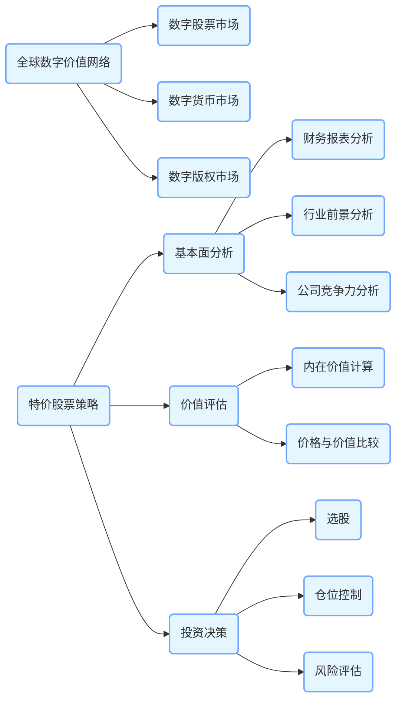

# 如何利用特价股票策略进行全球数字价值网络投资

> 关键词：特价股票策略、全球数字价值网络、投资、数字资产、价值评估

> 摘要：本文旨在深入探讨如何运用特价股票策略进行全球数字价值网络投资。首先介绍了相关背景知识，包括目的范围、预期读者等。接着阐述核心概念，通过示意图和流程图展示其原理和架构。详细讲解核心算法原理和具体操作步骤，并给出Python代码示例。对数学模型和公式进行推导和举例说明。结合项目实战，展示代码实现和解读。分析实际应用场景，推荐相关工具和资源。最后总结未来发展趋势与挑战，解答常见问题并提供扩展阅读和参考资料，帮助投资者更好地理解和运用特价股票策略在全球数字价值网络中进行投资。

## 1. 背景介绍 
### 1.1 目的和范围
在当今全球化和数字化的时代，全球数字价值网络涵盖了众多领域的数字资产，如科技股、数字货币、数字版权等。特价股票策略旨在寻找那些价格被低估的股票，通过投资这些股票获取潜在的高额回报。本文的目的是详细阐述如何将特价股票策略应用于全球数字价值网络投资中，为投资者提供全面的指导。范围包括核心概念的介绍、算法原理的讲解、实际案例的分析以及相关工具和资源的推荐等。

### 1.2 预期读者
本文预期读者主要包括有一定投资经验的个人投资者、专业投资机构的从业者、金融科技领域的研究者以及对全球数字价值网络投资感兴趣的技术人员。这些读者希望通过学习特价股票策略，提升在全球数字价值网络投资中的能力和收益。

### 1.3 文档结构概述
本文首先介绍背景知识，让读者了解文章的目的、适用人群和整体结构。接着阐述核心概念，帮助读者建立起对特价股票策略和全球数字价值网络的基本认识。然后详细讲解核心算法原理和具体操作步骤，通过Python代码进行示例。再介绍数学模型和公式，并举例说明其应用。通过项目实战展示代码的实际实现和解读。分析实际应用场景，为读者提供投资思路。推荐相关的工具和资源，方便读者进一步学习和实践。最后总结未来发展趋势与挑战，解答常见问题并提供扩展阅读和参考资料。

### 1.4 术语表
#### 1.4.1 核心术语定义
- **特价股票策略**：一种投资策略，通过分析股票的基本面和市场情况，寻找价格低于其内在价值的股票进行投资。
- **全球数字价值网络**：由全球范围内的数字资产和相关市场组成的网络，包括数字股票、数字货币、数字版权等。
- **数字资产**：以数字形式存在的资产，如股票、债券、数字货币、数字版权等。
- **内在价值**：股票或其他资产的真实价值，通过对其基本面进行分析得出。

#### 1.4.2 相关概念解释
- **价值投资**：基于对资产内在价值的评估，寻找被低估的资产进行投资的理念。
- **基本面分析**：通过研究公司的财务状况、经营业绩、行业前景等因素，评估股票的内在价值。
- **市场效率**：市场价格反映资产内在价值的程度。在有效市场中，价格能够迅速反映所有可用信息。

#### 1.4.3 缩略词列表
- **P/E**：市盈率（Price-to-Earnings Ratio），衡量股票价格与每股收益的比率。
- **P/B**：市净率（Price-to-Book Ratio），衡量股票价格与每股净资产的比率。
- **ROE**：净资产收益率（Return on Equity），衡量公司盈利能力的指标。

## 2. 核心概念与联系 

### 核心概念原理
特价股票策略的核心原理是基于价值投资理念，认为市场有时会出现定价错误，导致某些股票的价格低于其内在价值。通过对全球数字价值网络中股票的基本面进行分析，寻找这些被低估的股票，在价格回归其内在价值时获取收益。

全球数字价值网络是一个复杂的生态系统，其中的数字资产相互关联。不同国家和地区的数字经济发展水平、政策环境、行业竞争等因素都会影响数字股票的价格和价值。投资者需要综合考虑这些因素，运用特价股票策略进行投资决策。

### 架构的文本示意图
```plaintext
全球数字价值网络
|
|-- 数字股票市场
|   |-- 科技股
|   |-- 金融科技股
|   |-- 其他数字相关股票
|
|-- 数字货币市场
|   |-- 比特币
|   |-- 以太坊
|   |-- 其他数字货币
|
|-- 数字版权市场
|   |-- 音乐版权
|   |-- 影视版权
|   |-- 软件版权
|
特价股票策略
|
|-- 基本面分析
|   |-- 财务报表分析
|   |-- 行业前景分析
|   |-- 公司竞争力分析
|
|-- 价值评估
|   |-- 内在价值计算
|   |-- 价格与价值比较
|
|-- 投资决策
|   |-- 选股
|   |-- 仓位控制
|   |-- 风险评估
```

### Mermaid 流程图


## 3. 核心算法原理 & 具体操作步骤 

### 核心算法原理
特价股票策略的核心算法主要基于基本面分析和价值评估。通过对公司的财务报表进行分析，计算关键财务指标，如市盈率（P/E）、市净率（P/B）、净资产收益率（ROE）等。然后根据这些指标评估公司的内在价值。

内在价值的计算可以采用多种方法，如现金流折现法（DCF）、相对估值法等。现金流折现法是通过预测公司未来的现金流，并将其折现到当前时刻，得到公司的内在价值。相对估值法是通过与同行业其他公司的估值指标进行比较，评估公司的价值。

### 具体操作步骤
1. **数据收集**：收集全球数字价值网络中相关公司的财务报表、行业数据、市场信息等。
2. **财务指标计算**：根据收集到的数据，计算关键财务指标，如P/E、P/B、ROE等。
3. **内在价值计算**：选择合适的方法计算公司的内在价值。
4. **价格与价值比较**：将公司的当前股价与内在价值进行比较，筛选出价格低于内在价值的股票。
5. **投资决策**：根据筛选结果，进行选股、仓位控制和风险评估，制定投资计划。

### Python源代码示例
```python
import pandas as pd
import numpy as np

# 示例数据：假设我们有一个包含公司财务信息的DataFrame
data = {
    '公司名称': ['公司A', '公司B', '公司C'],
    '每股收益': [2.0, 1.5, 3.0],
    '每股净资产': [10.0, 8.0, 15.0],
    '当前股价': [25.0, 18.0, 35.0]
}
df = pd.DataFrame(data)

# 计算市盈率（P/E）和市净率（P/B）
df['P/E'] = df['当前股价'] / df['每股收益']
df['P/B'] = df['当前股价'] / df['每股净资产']

# 假设我们使用简单的相对估值法，同行业平均P/E为15，平均P/B为2
industry_avg_pe = 15
industry_avg_pb = 2

# 计算内在价值（这里简单假设内在价值根据P/E和P/B的平均值计算）
df['内在价值_PE'] = df['每股收益'] * industry_avg_pe
df['内在价值_PB'] = df['每股净资产'] * industry_avg_pb
df['内在价值'] = (df['内在价值_PE'] + df['内在价值_PB']) / 2

# 筛选出价格低于内在价值的股票
undervalued_stocks = df[df['当前股价'] < df['内在价值']]

print("价格低于内在价值的股票：")
print(undervalued_stocks)
```

## 4. 数学模型和公式 & 详细讲解 & 举例说明 

### 市盈率（P/E）
市盈率是衡量股票价格与每股收益的比率，计算公式为：
$$P/E = \frac{当前股价}{每股收益}$$
市盈率反映了投资者为获取公司每一元盈利所愿意支付的价格。一般来说，较低的市盈率可能表示股票被低估，但也可能反映公司的盈利能力较弱或行业前景不佳。

举例：假设某公司的当前股价为50元，每股收益为5元，则该公司的市盈率为：
$$P/E = \frac{50}{5} = 10$$

### 市净率（P/B）
市净率是衡量股票价格与每股净资产的比率，计算公式为：
$$P/B = \frac{当前股价}{每股净资产}$$
市净率反映了投资者为获取公司每一元净资产所愿意支付的价格。较低的市净率可能表示股票被低估，但也可能反映公司的资产质量较差或盈利能力较弱。

举例：假设某公司的当前股价为30元，每股净资产为15元，则该公司的市净率为：
$$P/B = \frac{30}{15} = 2$$

### 净资产收益率（ROE）
净资产收益率是衡量公司盈利能力的指标，计算公式为：
$$ROE = \frac{净利润}{股东权益} \times 100\%$$
ROE反映了公司运用自有资本获取收益的能力。较高的ROE通常表示公司具有较强的盈利能力。

举例：假设某公司的净利润为100万元，股东权益为500万元，则该公司的ROE为：
$$ROE = \frac{100}{500} \times 100\% = 20\%$$

### 现金流折现法（DCF）
现金流折现法是通过预测公司未来的现金流，并将其折现到当前时刻，得到公司的内在价值。基本公式为：
$$V = \sum_{t=1}^{n} \frac{CF_t}{(1 + r)^t}$$
其中，$V$ 表示公司的内在价值，$CF_t$ 表示第 $t$ 期的现金流，$r$ 表示折现率，$n$ 表示预测期数。

举例：假设某公司未来三年的现金流分别为100万元、120万元、150万元，折现率为10%，则该公司的内在价值为：
$$V = \frac{100}{(1 + 0.1)^1} + \frac{120}{(1 + 0.1)^2} + \frac{150}{(1 + 0.1)^3} \approx 295.03 \text{万元}$$

## 5. 项目实战：代码实际案例和详细解释说明 

### 5.1  开发环境搭建
- **操作系统**：推荐使用Windows、Linux或Mac OS。
- **Python环境**：安装Python 3.7及以上版本。
- **开发工具**：可以使用PyCharm、Jupyter Notebook等。
- **所需库**：安装pandas、numpy、matplotlib等库，可以使用以下命令进行安装：
```sh
pip install pandas numpy matplotlib
```

### 5.2  源代码详细实现和代码解读
```python
import pandas as pd
import numpy as np
import matplotlib.pyplot as plt

# 模拟收集到的全球数字价值网络中部分公司的财务数据
data = {
    '公司名称': ['公司A', '公司B', '公司C', '公司D', '公司E'],
    '每股收益': [2.5, 1.8, 3.2, 2.0, 1.5],
    '每股净资产': [12.0, 9.0, 15.0, 10.0, 8.0],
    '当前股价': [30.0, 20.0, 38.0, 25.0, 18.0]
}
df = pd.DataFrame(data)

# 计算关键财务指标
df['P/E'] = df['当前股价'] / df['每股收益']
df['P/B'] = df['当前股价'] / df['每股净资产']

# 假设同行业平均P/E为12，平均P/B为1.5
industry_avg_pe = 12
industry_avg_pb = 1.5

# 计算内在价值
df['内在价值_PE'] = df['每股收益'] * industry_avg_pe
df['内在价值_PB'] = df['每股净资产'] * industry_avg_pb
df['内在价值'] = (df['内在价值_PE'] + df['内在价值_PB']) / 2

# 筛选出价格低于内在价值的股票
undervalued_stocks = df[df['当前股价'] < df['内在价值']]

# 输出筛选结果
print("价格低于内在价值的股票：")
print(undervalued_stocks)

# 可视化结果
plt.figure(figsize=(10, 6))
plt.bar(df['公司名称'], df['当前股价'], label='当前股价')
plt.bar(df['公司名称'], df['内在价值'], alpha=0.5, label='内在价值')
plt.xlabel('公司名称')
plt.ylabel('价格')
plt.title('当前股价与内在价值对比')
plt.legend()
plt.show()
```

### 代码解读与分析
1. **数据模拟**：使用字典 `data` 模拟收集到的全球数字价值网络中部分公司的财务数据，并将其转换为 `pandas` 的 `DataFrame` 对象 `df`。
2. **财务指标计算**：根据公式计算市盈率（P/E）和市净率（P/B），并将结果添加到 `df` 中。
3. **内在价值计算**：假设同行业平均P/E为12，平均P/B为1.5，根据这两个指标计算公司的内在价值，并将结果添加到 `df` 中。
4. **筛选低估股票**：使用布尔索引筛选出价格低于内在价值的股票，存储在 `undervalued_stocks` 中。
5. **结果输出**：打印筛选结果，并使用 `matplotlib` 库绘制当前股价与内在价值的对比图，直观展示筛选结果。

## 6. 实际应用场景 
### 个人投资者
个人投资者可以利用特价股票策略在全球数字价值网络中寻找被低估的股票进行投资。通过对不同国家和地区的数字公司进行基本面分析，筛选出具有投资价值的股票，构建自己的投资组合。例如，个人投资者可以关注科技股、金融科技股等领域，寻找那些价格低于内在价值的股票，长期持有获取收益。

### 专业投资机构
专业投资机构可以运用特价股票策略进行大规模的资产配置。通过建立专业的投资模型和分析系统，对全球数字价值网络中的大量股票进行筛选和评估，制定投资策略。投资机构还可以结合其他投资策略，如量化投资、对冲基金等，提高投资组合的收益和风险控制能力。

### 风险投资公司
风险投资公司可以在全球数字价值网络中寻找具有潜力的初创数字公司。通过对这些公司的技术实力、市场前景、团队能力等方面进行分析，评估其内在价值。如果发现某些公司的估值低于其内在价值，风险投资公司可以进行投资，帮助公司发展壮大，在公司上市或被收购时获取高额回报。

## 7. 工具和资源推荐
### 7.1 学习资源推荐
#### 7.1.1 书籍推荐
- 《聪明的投资者》（The Intelligent Investor）：本杰明·格雷厄姆（Benjamin Graham）著，价值投资领域的经典之作，介绍了价值投资的基本理念和方法。
- 《证券分析》（Security Analysis）：本杰明·格雷厄姆和大卫·多德（David Dodd）著，详细阐述了基本面分析的方法和技巧。
- 《巴菲特致股东的信》（Letters to Shareholders of Berkshire Hathaway）：沃伦·巴菲特（Warren Buffett）著，通过巴菲特的信件，了解他的投资理念和策略。

#### 7.1.2 在线课程
- Coursera上的“投资学原理”（Principles of Investing）：介绍了投资的基本概念、理论和方法。
- edX上的“价值投资分析”（Value Investing Analysis）：深入讲解了价值投资的分析方法和技巧。

#### 7.1.3 技术博客和网站
- Seeking Alpha：提供全球金融市场的分析和研究报告，包括股票、债券、基金等。
- Motley Fool：提供投资建议、股票分析和市场评论。
- Investopedia：一个专业的金融知识学习网站，提供各种投资术语、概念和分析方法的解释。

### 7.2 开发工具框架推荐
#### 7.2.1 IDE和编辑器
- PyCharm：一款专业的Python集成开发环境，提供代码编辑、调试、版本控制等功能。
- Jupyter Notebook：一个交互式的开发环境，适合进行数据分析和可视化。

#### 7.2.2 调试和性能分析工具
- PDB：Python自带的调试工具，可以帮助开发者定位代码中的问题。
- cProfile：Python的性能分析工具，可以分析代码的运行时间和性能瓶颈。

#### 7.2.3 相关框架和库
- Pandas：用于数据处理和分析的Python库，提供了高效的数据结构和数据操作方法。
- NumPy：用于科学计算的Python库，提供了多维数组和各种数学函数。
- Matplotlib：用于数据可视化的Python库，可以绘制各种图表和图形。

### 7.3 相关论文著作推荐
#### 7.3.1 经典论文
- Fama, Eugene F., and Kenneth R. French. "The Cross-Section of Expected Stock Returns." Journal of Finance 47, no. 2 (1992): 427-465. 提出了Fama-French三因子模型，用于解释股票收益率的差异。
- Graham, Benjamin, and David L. Dodd. "Security Analysis." McGraw-Hill, 1934. 价值投资领域的经典著作，奠定了基本面分析的基础。

#### 7.3.2 最新研究成果
- 关注顶尖金融学术期刊，如Journal of Financial Economics、Review of Financial Studies等，了解最新的投资理论和研究成果。

#### 7.3.3 应用案例分析
- 可以参考一些知名投资机构的研究报告和案例分析，了解他们如何运用特价股票策略进行投资。

## 8. 总结：未来发展趋势与挑战
### 未来发展趋势
- **数字化程度加深**：随着全球数字化进程的加速，全球数字价值网络将不断扩大和深化，数字资产的种类和规模将不断增加。这将为特价股票策略提供更多的投资机会。
- **人工智能和大数据的应用**：人工智能和大数据技术将在投资领域得到更广泛的应用。通过对海量数据的分析和挖掘，可以更准确地评估公司的内在价值，提高特价股票策略的有效性。
- **国际化投资趋势加强**：全球经济一体化的趋势将促使投资者更加关注全球市场，进行国际化投资。特价股票策略可以帮助投资者在全球范围内寻找被低估的股票，实现资产的多元化配置。

### 挑战
- **数据质量和可靠性**：全球数字价值网络中的数据来源广泛，数据质量和可靠性参差不齐。投资者需要花费大量的时间和精力进行数据清洗和验证，以确保分析结果的准确性。
- **市场不确定性**：全球数字价值网络受到多种因素的影响，如政策法规、技术创新、市场情绪等。这些因素增加了市场的不确定性，使得股票价格的波动更加剧烈，给特价股票策略的实施带来了挑战。
- **竞争加剧**：随着特价股票策略的普及，越来越多的投资者开始运用该策略进行投资。这将导致市场竞争加剧，被低估的股票更容易被发现和挖掘，从而降低了投资的超额收益。

## 9. 附录：常见问题与解答
### 问题1：特价股票策略一定能获得收益吗？
解答：特价股票策略并不能保证一定能获得收益。虽然该策略基于价值投资理念，寻找被低估的股票，但市场是复杂多变的，股票价格可能受到多种因素的影响，如宏观经济环境、行业竞争、公司内部问题等。即使股票被低估，其价格也可能在较长时间内无法回归其内在价值，甚至可能继续下跌。因此，投资者在运用特价股票策略时，需要充分考虑市场风险，合理控制仓位。

### 问题2：如何确定股票的内在价值？
解答：确定股票的内在价值是一个复杂的过程，需要综合考虑多种因素。常见的方法包括现金流折现法（DCF）、相对估值法等。现金流折现法需要预测公司未来的现金流，并选择合适的折现率将其折现到当前时刻。相对估值法是通过与同行业其他公司的估值指标进行比较，评估公司的价值。在实际应用中，投资者可以结合多种方法进行综合评估，同时考虑公司的基本面、行业前景、市场竞争等因素。

### 问题3：特价股票策略适用于所有类型的股票吗？
解答：特价股票策略并不适用于所有类型的股票。该策略更适用于那些具有稳定现金流、良好基本面和可预测未来业绩的公司。对于一些新兴行业的初创公司，由于其业绩不稳定、未来发展具有较大的不确定性，很难准确评估其内在价值，因此特价股票策略的适用性相对较低。此外，对于一些受到特殊事件影响的股票，如重组、并购等，其价格波动较大，也需要谨慎运用特价股票策略。

## 10. 扩展阅读 & 参考资料
### 扩展阅读
- 《金融炼金术》（The Alchemy of Finance）：乔治·索罗斯（George Soros）著，介绍了他的投资哲学和方法。
- 《黑天鹅》（The Black Swan）：纳西姆·尼古拉斯·塔勒布（Nassim Nicholas Taleb）著，探讨了不确定性和黑天鹅事件对金融市场的影响。

### 参考资料
- 各金融机构的研究报告和市场分析资料。
- 相关金融学术期刊和论文。
- 财经新闻网站和社交媒体上的投资分析和评论。