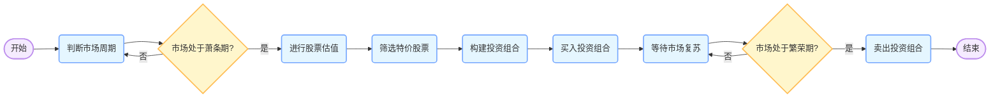

# 如何利用特价股票策略进行反周期投资

> 关键词：特价股票策略、反周期投资、股票估值、市场周期、投资组合

> 摘要：本文围绕如何利用特价股票策略进行反周期投资展开。首先介绍了相关背景，包括目的、预期读者等内容。接着阐述了核心概念及联系，分析了核心算法原理与操作步骤，并给出了相应的数学模型和公式。通过项目实战，详细展示了代码实现和解读。同时探讨了实际应用场景，推荐了学习资源、开发工具和相关论文著作。最后总结了未来发展趋势与挑战，解答了常见问题，并提供了扩展阅读和参考资料，旨在帮助投资者深入理解并运用特价股票策略进行反周期投资。

## 1. 背景介绍 
### 1.1 目的和范围
本文章的主要目的是深入探讨特价股票策略在反周期投资中的应用。通过详细阐述特价股票策略的原理、操作步骤以及相关的数学模型，帮助投资者掌握利用这一策略进行反周期投资的方法。范围涵盖了从理论概念的讲解到实际案例的分析，包括开发环境的搭建、代码实现与解读等，旨在为投资者提供全面、系统的指导，使其能够在不同的市场环境中灵活运用该策略，实现投资收益的最大化。

### 1.2 预期读者
本文预期读者主要包括对股票投资有一定了解，希望进一步学习和应用专业投资策略的个人投资者；金融行业的从业者，如投资顾问、分析师等，他们可以通过本文深入了解特价股票策略的原理和应用，为客户提供更专业的投资建议；以及相关专业的学生，通过阅读本文可以加深对股票投资和反周期投资策略的理解，为未来的职业发展打下坚实的基础。

### 1.3 文档结构概述
本文将按照以下结构进行阐述：首先介绍相关背景知识，包括目的、预期读者和文档结构概述等；接着详细讲解核心概念与联系，通过文本示意图和 Mermaid 流程图帮助读者理解；然后阐述核心算法原理和具体操作步骤，并使用 Python 源代码进行详细说明；随后介绍数学模型和公式，并结合具体例子进行讲解；通过项目实战展示代码实际案例和详细解释；探讨实际应用场景；推荐相关的学习资源、开发工具和论文著作；总结未来发展趋势与挑战；解答常见问题；最后提供扩展阅读和参考资料。

### 1.4 术语表
#### 1.4.1 核心术语定义
- **特价股票策略**：指投资者通过分析股票的基本面和市场情况，寻找那些价格被低估的股票进行投资的策略。这些股票通常具有较低的市盈率、市净率等估值指标，但其内在价值可能被市场忽视。
- **反周期投资**：是一种投资策略，投资者在市场处于低迷周期时买入资产，而在市场处于繁荣周期时卖出资产，以获取差价收益。这种策略的核心是逆向思维，通过与市场趋势相反的操作来实现投资目标。
- **股票估值**：是对股票的内在价值进行评估的过程。常用的估值方法包括市盈率法、市净率法、现金流折现法等，通过这些方法可以判断股票价格是否被高估或低估。
- **市场周期**：指股票市场在一定时间内呈现出的周期性波动。通常包括繁荣期、衰退期、萧条期和复苏期四个阶段，不同阶段的市场表现和投资机会有所不同。
- **投资组合**：是投资者将不同的资产组合在一起形成的投资集合。通过合理配置资产，可以降低投资风险，实现投资收益的最大化。

#### 1.4.2 相关概念解释
- **基本面分析**：是一种通过分析公司的财务状况、经营业绩、行业前景等基本面因素来评估股票价值的方法。基本面分析的目的是找出那些具有良好发展前景和内在价值的股票。
- **技术分析**：是一种通过分析股票的价格走势、成交量等技术指标来预测股票未来走势的方法。技术分析主要关注市场的短期波动和投资者的心理行为。
- **价值投资**：是一种基于股票内在价值的投资策略，投资者通过寻找被低估的股票并长期持有，等待股票价格回归其内在价值，从而获取投资收益。

#### 1.4.3 缩略词列表
- **PE**：市盈率（Price-to-Earnings Ratio），是指股票价格与每股收益的比率，用于衡量股票的估值水平。
- **PB**：市净率（Price-to-Book Ratio），是指股票价格与每股净资产的比率，用于衡量股票的估值水平。
- **DCF**：现金流折现法（Discounted Cash Flow），是一种通过预测公司未来的现金流并将其折现到当前的方法来评估公司的内在价值。

## 2. 核心概念与联系 

### 核心概念原理
特价股票策略的核心原理是基于股票的内在价值和市场价格之间的差异。在市场周期的不同阶段，股票价格可能会偏离其内在价值。在市场低迷期，由于投资者的恐慌情绪和市场的整体下跌，很多股票的价格会被低估，形成特价股票。反周期投资则是利用市场周期的波动，在市场低迷时买入特价股票，等待市场复苏和股票价格回归其内在价值，从而获取投资收益。

股票估值是特价股票策略的重要基础。通过各种估值方法，如市盈率法、市净率法、现金流折现法等，可以评估股票的内在价值。如果股票的市场价格低于其内在价值，则认为该股票被低估，具有投资价值。

投资组合的构建也是反周期投资的关键。通过将不同行业、不同风格的特价股票组合在一起，可以降低投资风险，提高投资组合的稳定性。同时，根据市场周期的变化，动态调整投资组合的权重，以适应不同的市场环境。

### 架构的文本示意图
```plaintext
特价股票策略与反周期投资架构

|-- 市场周期
|   |-- 繁荣期
|   |-- 衰退期
|   |-- 萧条期
|   |-- 复苏期
|
|-- 股票估值
|   |-- 市盈率法
|   |-- 市净率法
|   |-- 现金流折现法
|
|-- 特价股票筛选
|   |-- 基本面分析
|   |   |-- 财务状况
|   |   |-- 经营业绩
|   |   |-- 行业前景
|   |-- 技术分析
|   |   |-- 价格走势
|   |   |-- 成交量
|
|-- 反周期投资操作
|   |-- 萧条期买入
|   |-- 繁荣期卖出
|
|-- 投资组合构建
|   |-- 不同行业股票组合
|   |-- 不同风格股票组合
|   |-- 动态调整权重
```

### Mermaid 流程图


## 3. 核心算法原理 & 具体操作步骤 

### 核心算法原理
特价股票策略的核心算法主要围绕股票估值展开。以下以市盈率法和现金流折现法为例进行说明。

#### 市盈率法
市盈率（PE）是股票价格与每股收益的比率，计算公式为：
$PE = \frac{P}{EPS}$
其中，$P$ 为股票价格，$EPS$ 为每股收益。

通过比较目标股票的市盈率与同行业平均市盈率或历史市盈率，可以判断该股票是否被低估。如果目标股票的市盈率低于同行业平均市盈率或历史市盈率，则认为该股票可能被低估，具有投资价值。

#### 现金流折现法
现金流折现法（DCF）是一种通过预测公司未来的现金流并将其折现到当前的方法来评估公司的内在价值。具体步骤如下：
1. 预测公司未来的自由现金流（FCF）。自由现金流是指公司在满足了所有必要的资本支出后剩余的现金流量，可以用于分配给股东或进行再投资。
2. 确定折现率（r）。折现率反映了投资者对投资风险的要求，通常可以使用加权平均资本成本（WACC）作为折现率。
3. 将未来的自由现金流折现到当前。计算公式为：
$V = \sum_{t=1}^{n} \frac{FCF_t}{(1 + r)^t} + \frac{TV}{(1 + r)^n}$
其中，$V$ 为公司的内在价值，$FCF_t$ 为第 $t$ 年的自由现金流，$TV$ 为终值，$n$ 为预测期。
4. 计算每股内在价值。将公司的内在价值除以总股本，得到每股内在价值。如果每股内在价值高于当前股票价格，则认为该股票被低估，具有投资价值。

### 具体操作步骤

#### 步骤 1：数据收集
收集目标股票的相关数据，包括财务报表数据（如每股收益、净资产等）、市场数据（如股票价格、成交量等）以及行业数据（如同行业平均市盈率、增长率等）。

#### 步骤 2：股票估值
使用市盈率法、现金流折现法等估值方法对目标股票进行估值。可以编写 Python 代码来实现这些估值方法，以下是一个简单的市盈率法估值示例：
```python
def pe_valuation(price, eps, industry_pe):
    """
    市盈率法估值
    :param price: 股票价格
    :param eps: 每股收益
    :param industry_pe: 同行业平均市盈率
    :return: 是否被低估
    """
    pe = price / eps
    if pe < industry_pe:
        return True
    else:
        return False

# 示例数据
price = 20
eps = 2
industry_pe = 15

result = pe_valuation(price, eps, industry_pe)
print(f"该股票是否被低估: {result}")
```

#### 步骤 3：特价股票筛选
根据估值结果，筛选出被低估的股票作为特价股票。可以设置一些筛选条件，如市盈率低于同行业平均市盈率的一定比例、市净率低于某个阈值等。

#### 步骤 4：投资组合构建
将筛选出的特价股票组合在一起，构建投资组合。可以根据不同的投资目标和风险偏好，确定各股票在投资组合中的权重。例如，可以采用等权重法，即每个股票在投资组合中的权重相等。

#### 步骤 5：反周期投资操作
在市场处于萧条期时，买入构建好的投资组合；在市场处于繁荣期时，卖出投资组合，实现投资收益。

## 4. 数学模型和公式 & 详细讲解 & 举例说明 

### 市盈率法
#### 公式
$PE = \frac{P}{EPS}$
其中，$PE$ 为市盈率，$P$ 为股票价格，$EPS$ 为每股收益。

#### 详细讲解
市盈率是衡量股票估值水平的常用指标之一。它反映了投资者为获取每股收益所愿意支付的价格。一般来说，市盈率越低，说明股票越便宜，投资价值越高；市盈率越高，说明股票越贵，投资风险越大。

在使用市盈率法进行估值时，需要注意以下几点：
1. 同行业比较：不同行业的市盈率水平可能存在较大差异，因此需要将目标股票的市盈率与同行业平均市盈率进行比较，才能更准确地判断该股票是否被低估。
2. 历史比较：除了与同行业比较外，还可以将目标股票的市盈率与历史市盈率进行比较，了解该股票的估值水平在历史上的位置。
3. 动态市盈率：除了静态市盈率（使用上一年度的每股收益计算）外，还可以使用动态市盈率（使用预测的未来每股收益计算），以更准确地反映股票的估值水平。

#### 举例说明
假设某股票的当前价格为 $P = 50$ 元，上一年度的每股收益为 $EPS = 5$ 元，则该股票的静态市盈率为：
$PE = \frac{50}{5} = 10$

如果同行业平均市盈率为 15，则该股票的市盈率低于同行业平均市盈率，可能被低估，具有投资价值。

### 市净率法
#### 公式
$PB = \frac{P}{BVPS}$
其中，$PB$ 为市净率，$P$ 为股票价格，$BVPS$ 为每股净资产。

#### 详细讲解
市净率是衡量股票估值水平的另一个重要指标。它反映了投资者为获取每股净资产所愿意支付的价格。一般来说，市净率越低，说明股票越便宜，投资价值越高；市净率越高，说明股票越贵，投资风险越大。

市净率法适用于那些资产价值较为稳定的行业，如金融、房地产等。在使用市净率法进行估值时，需要注意以下几点：
1. 资产质量：市净率只考虑了净资产的账面价值，而没有考虑资产的质量和未来的盈利能力。因此，在使用市净率法时，需要结合其他指标进行综合分析。
2. 行业差异：不同行业的市净率水平可能存在较大差异，因此需要将目标股票的市净率与同行业平均市净率进行比较，才能更准确地判断该股票是否被低估。

#### 举例说明
假设某股票的当前价格为 $P = 30$ 元，每股净资产为 $BVPS = 10$ 元，则该股票的市净率为：
$PB = \frac{30}{10} = 3$

如果同行业平均市净率为 4，则该股票的市净率低于同行业平均市净率，可能被低估，具有投资价值。

### 现金流折现法
#### 公式
$V = \sum_{t=1}^{n} \frac{FCF_t}{(1 + r)^t} + \frac{TV}{(1 + r)^n}$
其中，$V$ 为公司的内在价值，$FCF_t$ 为第 $t$ 年的自由现金流，$r$ 为折现率，$TV$ 为终值，$n$ 为预测期。

#### 详细讲解
现金流折现法是一种基于公司未来现金流的估值方法，它考虑了货币的时间价值和公司的长期发展前景。具体步骤如下：
1. 预测自由现金流：需要对公司未来的经营情况进行分析和预测，确定未来各年的自由现金流。可以采用历史数据分析法、行业比较法等方法进行预测。
2. 确定折现率：折现率反映了投资者对投资风险的要求，通常可以使用加权平均资本成本（WACC）作为折现率。WACC 的计算公式为：
$WACC = w_d \times r_d \times (1 - T) + w_e \times r_e$
其中，$w_d$ 和 $w_e$ 分别为债务和股权的权重，$r_d$ 为债务成本，$r_e$ 为股权成本，$T$ 为所得税税率。
3. 计算终值：终值是指预测期结束后公司的价值，可以采用永续增长模型或退出倍数法进行计算。
4. 折现计算：将未来的自由现金流和终值折现到当前，得到公司的内在价值。

#### 举例说明
假设某公司未来 5 年的自由现金流分别为 $FCF_1 = 100$ 万元，$FCF_2 = 120$ 万元，$FCF_3 = 140$ 万元，$FCF_4 = 160$ 万元，$FCF_5 = 180$ 万元，预测期结束后的终值为 $TV = 2000$ 万元，折现率为 $r = 10\%$，则该公司的内在价值为：
\[
\begin{align*}
V &= \frac{100}{(1 + 0.1)^1} + \frac{120}{(1 + 0.1)^2} + \frac{140}{(1 + 0.1)^3} + \frac{160}{(1 + 0.1)^4} + \frac{180}{(1 + 0.1)^5} + \frac{2000}{(1 + 0.1)^5}\\
&= \frac{100}{1.1} + \frac{120}{1.21} + \frac{140}{1.331} + \frac{160}{1.4641} + \frac{180}{1.61051} + \frac{2000}{1.61051}\\
&\approx 90.91 + 99.17 + 105.19 + 109.29 + 111.74 + 1241.84\\
&= 1758.14 \text{（万元）}
\end{align*}
\]

如果该公司的总股本为 100 万股，则每股内在价值为 $1758.14 \div 100 = 17.58$ 元。如果当前股票价格低于 17.58 元，则认为该股票被低估，具有投资价值。

## 5. 项目实战：代码实际案例和详细解释说明 

### 5.1  开发环境搭建
为了实现特价股票策略进行反周期投资的项目，我们需要搭建相应的开发环境。以下是具体的搭建步骤：

#### 安装 Python
Python 是一种广泛使用的编程语言，具有丰富的库和工具，适合进行数据分析和投资策略开发。可以从 Python 官方网站（https://www.python.org/downloads/）下载并安装最新版本的 Python。

#### 安装必要的库
在 Python 中，有许多库可以用于数据获取、数据分析和可视化等。以下是一些常用的库及其安装方法：
- **pandas**：用于数据处理和分析。可以使用以下命令进行安装：
```sh
pip install pandas
```
- **numpy**：用于数值计算。可以使用以下命令进行安装：
```sh
pip install numpy
```
- **yfinance**：用于获取股票市场数据。可以使用以下命令进行安装：
```sh
pip install yfinance
```
- **matplotlib**：用于数据可视化。可以使用以下命令进行安装：
```sh
pip install matplotlib
```

### 5.2  源代码详细实现和代码解读
以下是一个简单的示例代码，用于实现特价股票策略进行反周期投资的基本流程：

```python
import yfinance as yf
import pandas as pd
import numpy as np
import matplotlib.pyplot as plt

# 定义股票列表
stock_list = ['AAPL', 'MSFT', 'GOOG', 'AMZN']

# 定义时间范围
start_date = '2020-01-01'
end_date = '2023-01-01'

# 获取股票数据
data = yf.download(stock_list, start=start_date, end=end_date)

# 计算每股收益（假设已知）
eps = {
    'AAPL': 5.0,
    'MSFT': 8.0,
    'GOOG': 40.0,
    'AMZN': 2.0
}

# 计算市盈率
pe = {}
for stock in stock_list:
    price = data['Close'][stock]
    pe[stock] = price / eps[stock]

# 计算同行业平均市盈率（假设已知）
industry_pe = 20

# 筛选特价股票
bargain_stocks = []
for stock in stock_list:
    if np.mean(pe[stock]) < industry_pe:
        bargain_stocks.append(stock)

# 构建投资组合（等权重）
portfolio_weights = {stock: 1 / len(bargain_stocks) for stock in bargain_stocks}

# 计算投资组合的收益率
portfolio_returns = pd.Series(index=data.index)
for stock in bargain_stocks:
    stock_returns = data['Close'][stock].pct_change()
    portfolio_returns += portfolio_weights[stock] * stock_returns

# 绘制投资组合的收益率曲线
plt.figure(figsize=(12, 6))
plt.plot(portfolio_returns, label='Portfolio Returns')
plt.title('Portfolio Returns')
plt.xlabel('Date')
plt.ylabel('Returns')
plt.legend()
plt.show()
```

### 5.3  代码解读与分析
#### 数据获取
使用 `yfinance` 库的 `download` 函数获取指定股票在指定时间范围内的历史数据，包括开盘价、收盘价、最高价、最低价等。

#### 市盈率计算
根据每股收益和股票价格计算各股票的市盈率。每股收益假设已知，可以从公司的财务报表中获取。

#### 特价股票筛选
将各股票的平均市盈率与同行业平均市盈率进行比较，筛选出市盈率低于同行业平均市盈率的股票作为特价股票。

#### 投资组合构建
采用等权重法构建投资组合，即每个特价股票在投资组合中的权重相等。

#### 投资组合收益率计算
计算各特价股票的收益率，并根据投资组合的权重计算投资组合的收益率。

#### 可视化
使用 `matplotlib` 库绘制投资组合的收益率曲线，直观展示投资组合的表现。

通过以上代码，我们可以实现特价股票策略进行反周期投资的基本流程，并对投资组合的表现进行可视化分析。

## 6. 实际应用场景 
### 个人投资者
对于个人投资者来说，利用特价股票策略进行反周期投资可以帮助他们在市场低迷时以较低的价格买入优质股票，等待市场复苏时获取较高的投资收益。例如，在 2008 年金融危机期间，很多股票价格大幅下跌，一些具有良好基本面的股票被低估。个人投资者可以通过分析和筛选，选择这些特价股票进行投资，在随后的市场反弹中获得了丰厚的回报。

### 机构投资者
机构投资者，如基金公司、保险公司等，也可以采用特价股票策略进行反周期投资。他们可以通过大规模的数据分析和研究，筛选出更多的特价股票，并构建更加复杂和多元化的投资组合。同时，机构投资者还可以利用自己的专业优势和资源，对投资组合进行动态管理，以适应市场的变化。

### 长期投资
特价股票策略适合长期投资。通过长期持有被低估的股票，投资者可以分享公司的成长和发展带来的收益。同时，长期投资还可以避免短期市场波动的影响，降低投资风险。例如，巴菲特就是一位长期投资者，他通过深入的基本面分析，寻找被低估的优质股票，并长期持有，取得了巨大的投资成功。

### 资产配置
在资产配置中，特价股票策略可以作为一种重要的投资策略。投资者可以将一部分资金分配到特价股票投资组合中，以提高资产组合的收益率和稳定性。同时，通过与其他资产，如债券、现金等进行合理配置，可以进一步降低投资风险，实现资产的保值增值。

## 7. 工具和资源推荐
### 7.1 学习资源推荐
#### 7.1.1 书籍推荐
- 《聪明的投资者》（The Intelligent Investor）：作者是本杰明·格雷厄姆（Benjamin Graham），这本书被誉为投资界的圣经，详细介绍了价值投资的理念和方法，对于理解特价股票策略具有重要的指导意义。
- 《巴菲特致股东的信：股份公司教程》（Letters to Shareholders of Berkshire Hathaway）：作者是沃伦·巴菲特（Warren Buffett），这本书收录了巴菲特多年来致股东的信，从中可以学习到巴菲特的投资思想和策略。
- 《财务报表分析与证券定价》（Financial Statement Analysis and Security Valuation）：作者是斯蒂芬·佩因曼（Stephen Penman），这本书系统地介绍了财务报表分析和股票估值的方法，对于进行特价股票筛选和估值具有重要的参考价值。

#### 7.1.2 在线课程
- Coursera 上的“投资学原理”（Principles of Investing）课程：由宾夕法尼亚大学的教授授课，课程内容涵盖了投资的基本概念、资产定价模型、投资组合理论等，对于学习投资策略和方法具有很大的帮助。
- edX 上的“财务分析与估值”（Financial Analysis and Valuation）课程：由麻省理工学院的教授授课，课程主要介绍了财务报表分析和股票估值的方法和技巧。

#### 7.1.3 技术博客和网站
- 雪球网（https://xueqiu.com/）：是一个投资社交平台，提供了丰富的股票分析、投资策略和市场资讯。投资者可以在上面与其他投资者交流经验，学习投资知识。
- 东方财富网（https://www.eastmoney.com/）：是一个综合性的金融网站，提供了股票行情、财经新闻、研究报告等丰富的信息。投资者可以通过该网站获取最新的市场动态和公司信息。

### 7.2 开发工具框架推荐
#### 7.2.1 IDE和编辑器
- PyCharm：是一款专业的 Python 集成开发环境，具有代码编辑、调试、版本控制等功能，适合进行 Python 程序开发。
- Jupyter Notebook：是一个交互式的开发环境，支持多种编程语言，尤其适合进行数据分析和可视化。可以在浏览器中直接编写和运行代码，方便快捷。

#### 7.2.2 调试和性能分析工具
- PDB：是 Python 自带的调试工具，可以帮助开发者在程序运行过程中进行调试，查看变量的值和程序的执行流程。
- cProfile：是 Python 自带的性能分析工具，可以帮助开发者分析程序的性能瓶颈，找出耗时较长的代码段。

#### 7.2.3 相关框架和库
- Pandas：是一个强大的数据分析库，提供了数据结构和数据分析工具，适合进行数据处理和分析。
- NumPy：是一个用于数值计算的库，提供了高效的数组操作和数学函数，适合进行科学计算和数据分析。
- Scikit-learn：是一个机器学习库，提供了各种机器学习算法和工具，适合进行数据挖掘和预测分析。

### 7.3 相关论文著作推荐
#### 7.3.1 经典论文
- “The Cross - Section of Expected Stock Returns”（Fama and French, 1992）：这篇论文提出了著名的 Fama - French 三因子模型，用于解释股票收益率的差异，对于理解股票定价和投资策略具有重要的影响。
- “Capital Asset Prices: A Theory of Market Equilibrium under Conditions of Risk”（Sharpe, 1964）：这篇论文提出了资本资产定价模型（CAPM），为资产定价和投资组合理论奠定了基础。

#### 7.3.2 最新研究成果
可以通过学术数据库，如 Web of Science、IEEE Xplore、ACM Digital Library 等，搜索关于特价股票策略和反周期投资的最新研究成果。这些研究成果可以帮助投资者了解该领域的最新发展动态和研究趋势。

#### 7.3.3 应用案例分析
一些金融研究机构和咨询公司会发布关于投资策略的应用案例分析报告。可以通过阅读这些报告，了解特价股票策略在实际应用中的效果和经验教训。

## 8. 总结：未来发展趋势与挑战
### 未来发展趋势
#### 技术驱动的投资策略
随着人工智能、大数据、机器学习等技术的不断发展，未来特价股票策略和反周期投资将更加依赖于技术的支持。通过利用这些技术，可以更高效地收集和分析大量的市场数据和公司信息，提高股票估值和筛选的准确性和效率。例如，使用机器学习算法可以对股票的基本面和市场数据进行深度挖掘和分析，预测股票的未来走势和投资价值。

#### 全球化投资
随着全球经济的一体化和金融市场的互联互通，投资者将有更多的机会进行全球化投资。未来，特价股票策略将不再局限于国内市场，投资者可以在全球范围内寻找被低估的股票进行投资。同时，全球化投资也可以帮助投资者分散投资风险，提高投资组合的稳定性。

#### 社会责任投资
越来越多的投资者开始关注企业的社会责任和可持续发展。未来，特价股票策略可能会结合社会责任投资的理念，筛选出那些具有良好社会形象和可持续发展能力的公司进行投资。这样不仅可以获得投资收益，还可以为社会做出贡献。

### 挑战
#### 市场不确定性
股票市场充满了不确定性，市场周期的变化难以准确预测。即使采用了特价股票策略和反周期投资方法，也无法完全避免市场风险。例如，在市场出现突发重大事件时，如金融危机、战争、自然灾害等，股票价格可能会出现大幅波动，导致投资组合的价值下降。

#### 数据质量和准确性
特价股票策略和反周期投资需要大量的市场数据和公司信息作为支撑。然而，数据的质量和准确性可能会受到多种因素的影响，如数据来源的可靠性、数据处理过程中的误差等。如果数据质量不高或不准确，可能会导致股票估值和筛选的结果出现偏差，从而影响投资决策的正确性。

#### 投资者情绪和行为偏差
投资者的情绪和行为偏差也会对特价股票策略和反周期投资产生影响。在市场低迷时，投资者往往会因为恐慌而不敢买入被低估的股票；而在市场繁荣时，投资者又往往会因为贪婪而追高买入股票。这种情绪和行为偏差可能会导致投资者错过投资机会或做出错误的投资决策。

## 9. 附录：常见问题与解答
### 问题 1：如何确定同行业平均市盈率和市净率？
可以通过金融数据提供商，如东方财富网、Wind 资讯等，获取同行业股票的市盈率和市净率数据，然后计算平均值。也可以参考相关的行业研究报告和分析文章，获取行业平均估值水平的信息。

### 问题 2：现金流折现法中的折现率如何确定？
折现率可以使用加权平均资本成本（WACC）来确定。WACC 的计算公式为 $WACC = w_d \times r_d \times (1 - T) + w_e \times r_e$，其中 $w_d$ 和 $w_e$ 分别为债务和股权的权重，$r_d$ 为债务成本，$r_e$ 为股权成本，$T$ 为所得税税率。债务成本可以根据公司的贷款利率来确定，股权成本可以使用资本资产定价模型（CAPM）来计算。

### 问题 3：特价股票策略是否适用于所有市场环境？
特价股票策略更适用于市场处于低迷周期时。在市场低迷时，很多股票的价格会被低估，此时采用特价股票策略可以以较低的价格买入优质股票。但在市场处于繁荣周期时，股票价格普遍较高，可能很难找到被低估的股票，此时特价股票策略的效果可能会受到影响。

### 问题 4：如何动态调整投资组合的权重？
可以根据市场周期的变化和股票的估值情况动态调整投资组合的权重。例如，在市场处于萧条期时，可以增加特价股票的权重；在市场处于繁荣期时，可以减少特价股票的权重。同时，也可以根据股票的基本面变化和市场表现，对投资组合中的股票进行调整和替换。

## 10. 扩展阅读 & 参考资料
### 扩展阅读
- 《金融炼金术》（The Alchemy of Finance）：作者是乔治·索罗斯（George Soros），这本书介绍了索罗斯的投资哲学和交易策略，对于理解金融市场的运行规律和投资策略具有重要的启示作用。
- 《非理性繁荣》（Irrational Exuberance）：作者是罗伯特·席勒（Robert Shiller），这本书分析了金融市场中的非理性行为和泡沫现象，对于投资者认识市场风险和避免盲目投资具有重要的参考价值。

### 参考资料
- 格雷厄姆, 多德. 证券分析[M]. 海南出版社, 2006.
- 巴菲特. 巴菲特致股东的信：股份公司教程[M]. 机械工业出版社, 2014.
- 斯蒂芬·佩因曼. 财务报表分析与证券定价[M]. 中国人民大学出版社, 2012.
- Fama, E. F., & French, K. R. (1992). The Cross - Section of Expected Stock Returns. The Journal of Finance, 47(2), 427 - 465.
- Sharpe, W. F. (1964). Capital Asset Prices: A Theory of Market Equilibrium under Conditions of Risk. The Journal of Finance, 19(3), 425 - 442.