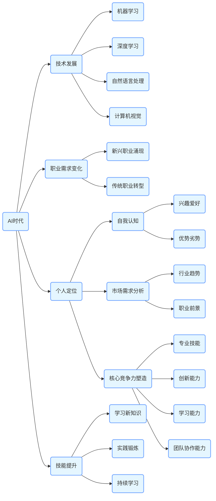

# 如何在AI时代找到自己的定位

> 关键词：AI时代、个人定位、人工智能、职业发展、技能提升、核心竞争力、未来趋势

> 摘要：随着人工智能（AI）技术的飞速发展，我们正步入一个全新的AI时代。这个时代既带来了前所未有的机遇，也对个人的职业发展和定位提出了新的挑战。本文旨在深入探讨在AI时代背景下，个人如何清晰地找到自己的定位。通过分析AI时代的特点和发展趋势，阐述核心概念，介绍相关算法原理和数学模型，结合项目实战案例，探讨实际应用场景，推荐学习资源、开发工具和相关论文著作，最后总结未来发展趋势与挑战，解答常见问题，为读者在AI时代找到适合自己的发展路径提供全面而深入的指导。

## 1. 背景介绍 
### 1.1 目的和范围
在AI技术迅猛发展并深刻改变各个行业的今天，许多人面临着职业选择的困惑和对未来发展方向的迷茫。本文的目的就是帮助读者理解AI时代的特点和发展趋势，掌握找到个人定位的方法和策略，从而在这个充满机遇和挑战的时代中实现自身的价值。本文的范围涵盖了AI时代的各个方面，包括技术发展、职业需求、个人技能提升、核心竞争力塑造等，旨在为读者提供全面而系统的指导。

### 1.2 预期读者
本文预期读者包括正在寻求职业发展的职场人士、即将步入社会的大学生、对AI技术感兴趣并希望在该领域有所发展的爱好者，以及关注未来趋势、希望提前规划个人发展的人群。无论您是处于职业发展的哪个阶段，都能从本文中获得有益的启示和指导。

### 1.3 文档结构概述
本文将按照以下结构进行阐述：首先介绍AI时代的背景知识，包括目的、预期读者和文档结构概述等；接着阐述核心概念与联系，通过文本示意图和Mermaid流程图帮助读者理解；然后讲解核心算法原理和具体操作步骤，结合Python源代码进行详细说明；再介绍相关的数学模型和公式，并举例说明；随后通过项目实战案例，详细解释代码实现和解读；探讨AI时代的实际应用场景；推荐学习资源、开发工具和相关论文著作；总结未来发展趋势与挑战；附录部分解答常见问题；最后提供扩展阅读和参考资料。

### 1.4 术语表
#### 1.4.1 核心术语定义
- **人工智能（AI）**：是一门研究如何使计算机能够模拟人类智能的学科和技术领域，包括机器学习、深度学习、自然语言处理、计算机视觉等多个方面。
- **个人定位**：指个人在社会、职业、学习等方面确定自己的位置和发展方向，明确自己的优势和价值，以实现个人目标和价值最大化。
- **核心竞争力**：是个人或组织在市场竞争中所具备的独特的、难以被模仿的优势和能力，能够使其在竞争中脱颖而出。
- **机器学习**：是人工智能的一个重要分支，通过让计算机从数据中自动学习模式和规律，从而实现预测、分类等任务。
- **深度学习**：是一种基于人工神经网络的机器学习方法，通过构建多层神经网络，自动从大量数据中学习特征和模式，在图像识别、语音识别等领域取得了显著的成果。

#### 1.4.2 相关概念解释
- **AI时代**：指以人工智能技术为核心驱动力，在经济、社会、科技等各个领域广泛应用和深度融合的时代。在这个时代，AI技术将对人们的生活和工作产生深远的影响。
- **职业转型**：指个人从一个职业领域转向另一个职业领域的过程，通常是为了适应市场需求的变化、追求更好的职业发展机会或实现个人兴趣和价值。
- **技能提升**：指个人通过学习、培训、实践等方式，不断提高自己的知识和技能水平，以适应不断变化的工作需求和市场竞争。

#### 1.4.3 缩略词列表
- **AI**：Artificial Intelligence（人工智能）
- **ML**：Machine Learning（机器学习）
- **DL**：Deep Learning（深度学习）
- **NLP**：Natural Language Processing（自然语言处理）
- **CV**：Computer Vision（计算机视觉）

## 2. 核心概念与联系 

### 核心概念原理
在AI时代，个人定位涉及多个核心概念，它们相互关联、相互影响。人工智能技术的发展改变了传统的职业结构和工作方式，新的职业机会不断涌现，同时也对个人的技能和能力提出了更高的要求。个人定位就是要在这种变化的环境中，找到自己的优势和兴趣所在，结合市场需求和未来发展趋势，确定自己的职业方向和发展路径。

核心竞争力是个人定位的关键因素之一。在AI时代，具备独特的、难以被替代的核心竞争力是个人在激烈的市场竞争中立足的根本。核心竞争力可以包括专业技能、创新能力、学习能力、团队协作能力等多个方面。

技能提升是实现个人定位的重要途径。随着AI技术的不断发展，个人需要不断学习和掌握新的知识和技能，以适应市场需求的变化。通过持续的技能提升，个人可以提高自己的核心竞争力，实现职业发展的目标。

### 架构的文本示意图
```plaintext
AI时代
├── 技术发展
│   ├── 机器学习
│   ├── 深度学习
│   ├── 自然语言处理
│   ├── 计算机视觉
├── 职业需求变化
│   ├── 新兴职业涌现
│   ├── 传统职业转型
├── 个人定位
│   ├── 自我认知
│   │   ├── 兴趣爱好
│   │   ├── 优势劣势
│   ├── 市场需求分析
│   │   ├── 行业趋势
│   │   ├── 职业前景
│   ├── 核心竞争力塑造
│   │   ├── 专业技能
│   │   ├── 创新能力
│   │   ├── 学习能力
│   │   ├── 团队协作能力
├── 技能提升
│   ├── 学习新知识
│   ├── 实践锻炼
│   ├── 持续学习
```

### Mermaid流程图


## 3. 核心算法原理 & 具体操作步骤 

### 核心算法原理
在寻找个人定位的过程中，可以借鉴一些算法思想，如决策树算法。决策树算法是一种基于树结构进行决策的算法，它通过对数据进行分类和划分，逐步确定最优的决策路径。在个人定位中，我们可以将个人的兴趣、技能、市场需求等因素作为输入数据，通过一系列的判断和决策，最终确定适合自己的职业方向。

以下是一个简化的决策树算法的Python实现示例：
```python
# 定义决策树节点类
class DecisionTreeNode:
    def __init__(self, feature_index=None, threshold=None, left=None, right=None, value=None):
        self.feature_index = feature_index  # 特征索引
        self.threshold = threshold  # 阈值
        self.left = left  # 左子树
        self.right = right  # 右子树
        self.value = value  # 叶子节点的值

# 定义决策树类
class DecisionTree:
    def __init__(self, max_depth=2):
        self.max_depth = max_depth  # 树的最大深度

    def fit(self, X, y):
        self.root = self._build_tree(X, y, depth=0)

    def _build_tree(self, X, y, depth):
        num_samples, num_features = X.shape
        num_classes = len(set(y))

        # 终止条件：样本数为0或深度达到最大或只有一个类别
        if num_samples == 0 or depth == self.max_depth or num_classes == 1:
            leaf_value = self._most_common_label(y)
            return DecisionTreeNode(value=leaf_value)

        # 选择最优特征和阈值
        best_feature_index, best_threshold = self._best_split(X, y)

        # 划分数据集
        left_indices, right_indices = self._split(X[:, best_feature_index], best_threshold)

        # 递归构建左右子树
        left_subtree = self._build_tree(X[left_indices, :], y[left_indices], depth + 1)
        right_subtree = self._build_tree(X[right_indices, :], y[right_indices], depth + 1)

        return DecisionTreeNode(best_feature_index, best_threshold, left_subtree, right_subtree)

    def _best_split(self, X, y):
        best_gini = float('inf')
        best_feature_index = None
        best_threshold = None

        num_features = X.shape[1]

        for feature_index in range(num_features):
            thresholds = sorted(set(X[:, feature_index]))

            for threshold in thresholds:
                left_indices, right_indices = self._split(X[:, feature_index], threshold)

                if len(left_indices) == 0 or len(right_indices) == 0:
                    continue

                gini = self._gini_index(y[left_indices], y[right_indices])

                if gini < best_gini:
                    best_gini = gini
                    best_feature_index = feature_index
                    best_threshold = threshold

        return best_feature_index, best_threshold

    def _split(self, feature_values, threshold):
        left_indices = feature_values < threshold
        right_indices = feature_values >= threshold
        return left_indices, right_indices

    def _gini_index(self, left_labels, right_labels):
        num_left = len(left_labels)
        num_right = len(right_labels)
        num_total = num_left + num_right

        gini_left = self._gini(left_labels)
        gini_right = self._gini(right_labels)

        gini = (num_left / num_total) * gini_left + (num_right / num_total) * gini_right
        return gini

    def _gini(self, labels):
        num_labels = len(labels)
        if num_labels == 0:
            return 0

        class_counts = {}
        for label in labels:
            if label not in class_counts:
                class_counts[label] = 0
            class_counts[label] += 1

        gini = 1
        for count in class_counts.values():
            probability = count / num_labels
            gini -= probability ** 2

        return gini

    def _most_common_label(self, labels):
        class_counts = {}
        for label in labels:
            if label not in class_counts:
                class_counts[label] = 0
            class_counts[label] += 1

        most_common_label = max(class_counts, key=class_counts.get)
        return most_common_label

    def predict(self, X):
        predictions = []
        for sample in X:
            prediction = self._traverse_tree(sample, self.root)
            predictions.append(prediction)
        return predictions

    def _traverse_tree(self, sample, node):
        if node.value is not None:
            return node.value

        if sample[node.feature_index] < node.threshold:
            return self._traverse_tree(sample, node.left)
        else:
            return self._traverse_tree(sample, node.right)
```

### 具体操作步骤
1. **自我认知**：收集自己的兴趣爱好、优势劣势等信息，将其转化为数据特征。例如，对不同领域的兴趣程度可以用数值表示，优势和劣势可以进行量化评估。
2. **市场需求分析**：研究行业趋势和职业前景，收集相关数据，如不同职业的薪资水平、发展前景、技能要求等。
3. **数据预处理**：将收集到的个人信息和市场需求数据进行整理和清洗，确保数据的准确性和一致性。
4. **特征工程**：选择合适的特征，对数据进行特征提取和转换，以便更好地应用决策树算法。
5. **模型训练**：使用整理好的数据训练决策树模型，调整模型参数，如树的最大深度等，以提高模型的性能。
6. **预测和决策**：使用训练好的模型对个人的职业方向进行预测，根据预测结果结合自己的实际情况做出决策。

## 4. 数学模型和公式 & 详细讲解 & 举例说明 

### 数学模型
在寻找个人定位的过程中，除了决策树算法中的基尼指数外，还可以涉及到其他数学模型和公式，如线性回归模型、逻辑回归模型等。这里以线性回归模型为例进行介绍。

线性回归模型是一种用于预测连续数值的统计模型，其基本形式为：
$$y = \theta_0 + \theta_1x_1 + \theta_2x_2 + \cdots + \theta_nx_n + \epsilon$$
其中，$y$ 是预测值，$x_1, x_2, \cdots, x_n$ 是特征变量，$\theta_0, \theta_1, \theta_2, \cdots, \theta_n$ 是模型的参数，$\epsilon$ 是误差项。

### 详细讲解
线性回归模型的目标是找到一组最优的参数 $\theta_0, \theta_1, \theta_2, \cdots, \theta_n$，使得预测值 $y$ 与实际值之间的误差最小。通常使用最小二乘法来求解参数，即最小化误差平方和：
$$J(\theta) = \frac{1}{2m}\sum_{i=1}^{m}(y^{(i)} - h_{\theta}(x^{(i)}))^2$$
其中，$m$ 是样本数量，$y^{(i)}$ 是第 $i$ 个样本的实际值，$h_{\theta}(x^{(i)})$ 是第 $i$ 个样本的预测值。

为了求解最小化 $J(\theta)$ 的参数 $\theta$，可以使用梯度下降法。梯度下降法是一种迭代优化算法，通过不断更新参数 $\theta$ 的值，使得 $J(\theta)$ 逐渐减小。参数更新公式为：
$$\theta_j := \theta_j - \alpha\frac{\partial J(\theta)}{\partial \theta_j}$$
其中，$\alpha$ 是学习率，控制参数更新的步长。

### 举例说明
假设我们要预测一个人在某个职业中的薪资水平，我们可以选择一些特征变量，如工作经验、教育程度、技能水平等。设工作经验为 $x_1$，教育程度为 $x_2$，技能水平为 $x_3$，薪资水平为 $y$。我们收集了一些样本数据，通过线性回归模型来拟合这些数据，得到模型的参数 $\theta_0, \theta_1, \theta_2, \theta_3$。

例如，我们得到的线性回归模型为：
$$y = 2000 + 1000x_1 + 500x_2 + 800x_3$$
如果一个人的工作经验为 3 年，教育程度为本科（假设本科对应的数值为 2），技能水平为 4，那么他的预测薪资为：
$$y = 2000 + 1000\times3 + 500\times2 + 800\times4 = 2000 + 3000 + 1000 + 3200 = 9200$$

## 5. 项目实战：代码实际案例和详细解释说明 

### 5.1  开发环境搭建
- **Python环境**：建议使用Python 3.7及以上版本。可以从Python官方网站（https://www.python.org/downloads/）下载安装。
- **开发工具**：推荐使用PyCharm作为集成开发环境（IDE），可以从JetBrains官方网站（https://www.jetbrains.com/pycharm/download/）下载安装。
- **必要的库**：需要安装NumPy、Pandas、Scikit-learn等库。可以使用以下命令进行安装：
```sh
pip install numpy pandas scikit-learn
```

### 5.2  源代码详细实现和代码解读
以下是一个使用线性回归模型预测个人薪资的Python代码示例：
```python
import numpy as np
import pandas as pd
from sklearn.model_selection import train_test_split
from sklearn.linear_model import LinearRegression
from sklearn.metrics import mean_squared_error

# 生成示例数据
data = {
    'work_experience': [1, 2, 3, 4, 5, 6, 7, 8, 9, 10],
    'education_level': [1, 2, 2, 3, 3, 3, 4, 4, 4, 4],
    'skill_level': [2, 3, 4, 5, 6, 7, 8, 9, 10, 11],
    'salary': [3000, 4000, 5000, 6000, 7000, 8000, 9000, 10000, 11000, 12000]
}

df = pd.DataFrame(data)

# 划分特征和目标变量
X = df[['work_experience', 'education_level', 'skill_level']]
y = df['salary']

# 划分训练集和测试集
X_train, X_test, y_train, y_test = train_test_split(X, y, test_size=0.2, random_state=42)

# 创建线性回归模型
model = LinearRegression()

# 训练模型
model.fit(X_train, y_train)

# 预测
y_pred = model.predict(X_test)

# 计算均方误差
mse = mean_squared_error(y_test, y_pred)
print(f"均方误差: {mse}")

# 打印模型参数
print(f"截距: {model.intercept_}")
print(f"系数: {model.coef_}")
```

### 代码解读与分析
1. **数据生成**：使用字典创建一个包含工作经验、教育程度、技能水平和薪资的数据框。
2. **特征和目标变量划分**：将工作经验、教育程度和技能水平作为特征变量 $X$，薪资作为目标变量 $y$。
3. **训练集和测试集划分**：使用 `train_test_split` 函数将数据集划分为训练集和测试集，测试集占比为 20%。
4. **模型创建和训练**：创建一个线性回归模型，并使用训练集数据对模型进行训练。
5. **预测和评估**：使用训练好的模型对测试集数据进行预测，并计算预测结果的均方误差。
6. **模型参数打印**：打印模型的截距和系数，这些参数表示模型的具体形式。

通过这个项目实战，我们可以更好地理解线性回归模型在个人定位中的应用，例如通过预测不同职业的薪资水平，结合自己的实际情况，选择更适合自己的职业方向。

## 6. 实际应用场景 
### 职业选择
在AI时代，新兴职业不断涌现，如数据分析师、人工智能工程师、机器学习专家等。个人可以通过对自己的兴趣、技能和市场需求的分析，结合相关的模型和算法，选择适合自己的职业方向。例如，一个对数学和编程有兴趣且具备一定基础的人，可以考虑选择数据分析师或人工智能工程师等职业。

### 职业转型
随着AI技术的发展，一些传统职业可能会受到冲击，需要进行转型。个人可以利用自己的现有技能和经验，结合市场需求，寻找新的职业机会。例如，一个传统的会计人员可以学习数据分析和人工智能相关知识，转型为财务数据分析师。

### 技能提升规划
在确定个人定位后，个人可以根据职业需求制定技能提升规划。例如，如果想要成为一名人工智能工程师，就需要学习机器学习、深度学习、编程语言等相关知识和技能。通过不断提升自己的技能水平，提高自己的核心竞争力。

### 创业方向选择
AI时代也为创业者带来了新的机遇。个人可以结合自己的兴趣和优势，发现市场中的痛点和需求，选择适合的创业方向。例如，利用人工智能技术开发智能医疗、智能教育等领域的产品和服务。

## 7. 工具和资源推荐
### 7.1 学习资源推荐
#### 7.1.1 书籍推荐
- 《Python机器学习》：全面介绍了Python在机器学习中的应用，包括各种机器学习算法的原理和实现。
- 《深度学习》：由深度学习领域的三位顶尖专家撰写，是深度学习领域的经典著作。
- 《人工智能：一种现代的方法》：系统地介绍了人工智能的基本概念、算法和应用。

#### 7.1.2 在线课程
- Coursera上的“机器学习”课程：由斯坦福大学的Andrew Ng教授主讲，是机器学习领域的经典课程。
- edX上的“深度学习”课程：由知名高校的教授授课，深入讲解深度学习的原理和应用。
- 中国大学MOOC上的“人工智能基础”课程：适合初学者学习人工智能的基础知识。

#### 7.1.3 技术博客和网站
- Medium：有许多人工智能领域的专家和从业者分享他们的经验和见解。
- 机器之心：专注于人工智能领域的资讯和技术分享。
- 开源中国：提供丰富的技术文章和开源项目资源。

### 7.2 开发工具框架推荐
#### 7.2.1 IDE和编辑器
- PyCharm：功能强大的Python集成开发环境，适合开发Python项目。
- Jupyter Notebook：交互式的开发环境，适合进行数据分析和机器学习实验。
- Visual Studio Code：轻量级的代码编辑器，支持多种编程语言，有丰富的插件。

#### 7.2.2 调试和性能分析工具
- Py-Spy：用于分析Python程序的性能，找出性能瓶颈。
- PDB：Python自带的调试工具，用于调试Python代码。
- TensorBoard：TensorFlow的可视化工具，用于可视化训练过程和模型结构。

#### 7.2.3 相关框架和库
- TensorFlow：开源的机器学习框架，广泛应用于深度学习领域。
- PyTorch：另一个流行的深度学习框架，具有动态图的优势。
- Scikit-learn：简单易用的机器学习库，提供了各种机器学习算法和工具。

### 7.3 相关论文著作推荐
#### 7.3.1 经典论文
- “ImageNet Classification with Deep Convolutional Neural Networks”：介绍了AlexNet卷积神经网络，开启了深度学习在计算机视觉领域的革命。
- “Attention Is All You Need”：提出了Transformer架构，在自然语言处理领域取得了巨大的成功。
- “Gradient-Based Learning Applied to Document Recognition”：介绍了LeNet卷积神经网络，是早期卷积神经网络的经典之作。

#### 7.3.2 最新研究成果
- arXiv：一个预印本平台，提供了大量最新的人工智能研究论文。
- IEEE Xplore：电气和电子工程师协会的数字图书馆，包含了许多人工智能领域的研究论文。
- ACM Digital Library：美国计算机协会的数字图书馆，有丰富的计算机科学研究成果。

#### 7.3.3 应用案例分析
- 《AI未来进行式》：通过多个实际案例，介绍了人工智能在各个领域的应用和发展趋势。
- 《智能时代》：阐述了人工智能对社会和经济的影响，以及如何在智能时代中找到自己的定位。

## 8. 总结：未来发展趋势与挑战
### 未来发展趋势
- **AI技术不断创新**：人工智能技术将不断发展和创新，新的算法和模型将不断涌现，如强化学习、生成对抗网络等将在更多领域得到应用。
- **AI与各行业深度融合**：人工智能将与医疗、教育、金融、交通等各个行业深度融合，推动各行业的数字化转型和智能化升级。
- **跨学科人才需求增加**：未来需要具备多学科知识和技能的跨学科人才，如既懂人工智能技术又懂医学知识的医疗人工智能人才。

### 挑战
- **技术更新换代快**：AI技术发展迅速，知识和技能更新换代快，个人需要不断学习和适应新的技术和变化。
- **就业结构调整**：AI技术的发展将导致就业结构的调整，一些传统职业可能会被取代，个人需要做好职业转型和再就业的准备。
- **伦理和法律问题**：人工智能的发展也带来了一系列伦理和法律问题，如隐私保护、算法偏见、人工智能的责任归属等，需要个人和社会共同关注和解决。

## 9. 附录：常见问题与解答
### 如何确定自己的兴趣和优势？
可以通过自我反思、参加职业测评、实践体验等方式来确定自己的兴趣和优势。例如，回顾自己过去的学习和工作经历，找出自己感兴趣且做得比较好的事情；参加一些专业的职业测评，了解自己的性格特点和职业倾向；尝试参与不同的项目和活动，亲身体验自己对不同领域的兴趣和能力。

### 学习AI技术需要具备哪些基础知识？
学习AI技术需要具备一定的数学基础，如线性代数、概率论与数理统计、微积分等；还需要掌握一门编程语言，如Python；此外，了解数据结构和算法也很重要。

### 如何进行职业转型？
进行职业转型需要做好充分的准备。首先要明确自己的转型目标，了解目标职业的技能要求和发展前景；然后制定学习计划，学习相关的知识和技能；可以通过参加培训课程、在线学习、实践项目等方式来提升自己的能力；同时，利用自己的人脉资源，寻找转型的机会。

### 如何应对AI时代的竞争压力？
要不断提升自己的核心竞争力，包括专业技能、创新能力、学习能力等。保持学习的热情和动力，持续关注行业动态和技术发展趋势，不断更新自己的知识和技能。此外，还可以培养自己的软技能，如沟通能力、团队协作能力、领导力等，提高自己的综合素质。

## 10. 扩展阅读 & 参考资料
### 扩展阅读
- 《人类简史：从动物到上帝》：从人类历史的角度探讨人类的发展和未来，对理解AI时代的人类变革有一定的启示。
- 《生命3.0：人工智能时代人类的进化与重生》：探讨了人工智能对人类未来的影响，以及人类如何在人工智能时代实现进化和重生。

### 参考资料
- 相关的学术论文和研究报告。
- 各技术公司的官方文档和博客。
- 行业专家的观点和言论。