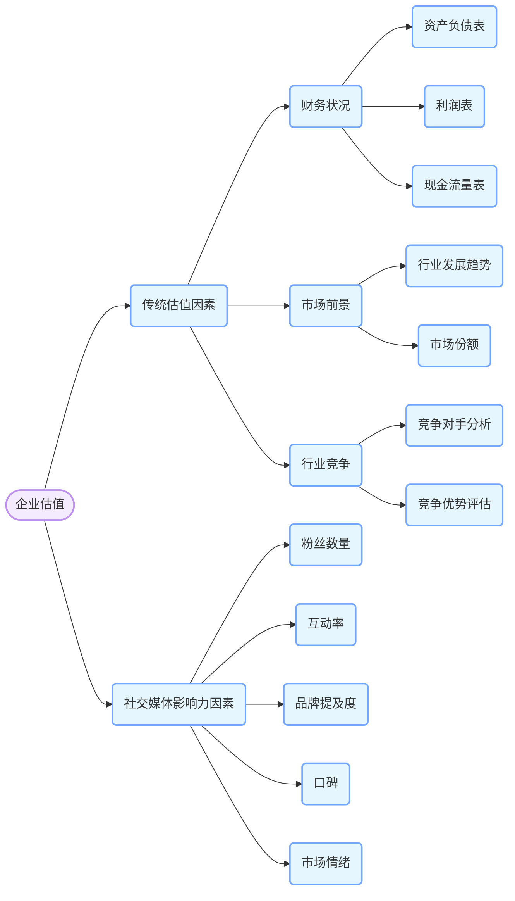

# 如何在估值中考虑企业的社交媒体影响力

> 关键词：企业估值、社交媒体影响力、估值模型、数据挖掘、品牌价值、市场情绪、财务分析

> 摘要：本文旨在探讨如何在企业估值过程中合理考虑社交媒体影响力这一重要因素。随着社交媒体的蓬勃发展，其对企业的品牌塑造、市场拓展、客户关系维护等方面产生了深远影响，进而影响企业的价值。文章首先介绍了相关背景知识，包括研究目的、预期读者等；接着阐述了社交媒体影响力的核心概念及其与企业估值的联系；详细讲解了核心算法原理和具体操作步骤，并通过数学模型和公式进行深入分析；结合项目实战给出代码案例和详细解释；探讨了社交媒体影响力在企业估值中的实际应用场景；推荐了相关的学习资源、开发工具框架以及论文著作；最后总结了未来发展趋势与挑战，还提供了常见问题解答和扩展阅读参考资料，以期为投资者、分析师和企业管理者在企业估值时综合考虑社交媒体影响力提供全面且深入的指导。

## 1. 背景介绍 
### 1.1 目的和范围
在当今数字化时代，社交媒体已经成为企业与消费者沟通、品牌传播和市场推广的重要渠道。企业的社交媒体影响力对其市场表现、品牌价值和未来发展潜力有着不可忽视的影响。然而，传统的企业估值方法往往侧重于财务数据和历史业绩，忽略了社交媒体影响力这一新兴且关键的因素。本研究的目的在于探索如何将社交媒体影响力纳入企业估值体系，使估值结果更加全面、准确地反映企业的真实价值。

本研究的范围涵盖了社交媒体影响力的各个方面，包括粉丝数量、互动率、品牌提及度、口碑等，并分析这些因素如何影响企业的财务状况和市场预期。同时，研究还将探讨如何运用数据分析和建模技术，将社交媒体影响力量化并融入到传统的估值模型中。

### 1.2 预期读者
本文的预期读者包括金融分析师、投资者、企业管理者、市场营销人员以及对企业估值和社交媒体研究感兴趣的学者和专业人士。对于金融分析师和投资者来说，了解如何在估值中考虑社交媒体影响力可以帮助他们做出更明智的投资决策；企业管理者可以通过本文的研究结果，更好地评估社交媒体营销活动的效果，优化资源配置，提升企业价值；市场营销人员可以从社交媒体影响力的角度，深入理解品牌建设和市场推广的重要性；学者和专业人士则可以将本文作为进一步研究的参考，推动相关领域的学术发展。

### 1.3 文档结构概述
本文共分为十个部分。第一部分为背景介绍，阐述了研究的目的、范围、预期读者和文档结构概述，并对相关术语进行了定义和解释。第二部分介绍了社交媒体影响力的核心概念及其与企业估值的联系，通过文本示意图和 Mermaid 流程图进行直观展示。第三部分详细讲解了核心算法原理和具体操作步骤，并给出了 Python 源代码示例。第四部分运用数学模型和公式对社交媒体影响力在企业估值中的作用进行了深入分析，并举例说明。第五部分通过项目实战，展示了如何在实际中运用相关技术和方法，包括开发环境搭建、源代码实现和代码解读。第六部分探讨了社交媒体影响力在企业估值中的实际应用场景。第七部分推荐了相关的学习资源、开发工具框架和论文著作。第八部分总结了未来发展趋势与挑战。第九部分为附录，提供了常见问题与解答。第十部分为扩展阅读和参考资料，方便读者进一步深入研究。

### 1.4 术语表
#### 1.4.1 核心术语定义
- **企业估值**：指评估企业的经济价值，是投资者、管理者等对企业进行决策的重要依据。常见的估值方法包括收益法、市场法和资产法等。
- **社交媒体影响力**：指企业在社交媒体平台上的知名度、美誉度、传播力和影响力的综合体现，通常通过粉丝数量、互动率、品牌提及度等指标来衡量。
- **品牌价值**：指品牌在消费者心目中的形象和地位所带来的价值，是企业无形资产的重要组成部分。社交媒体影响力可以通过提升品牌知名度和美誉度来增加品牌价值。
- **市场情绪**：指投资者对市场的信心和预期，社交媒体上的信息传播和舆论导向可以影响市场情绪，进而影响企业的市场表现和估值。

#### 1.4.2 相关概念解释
- **粉丝数量**：指企业在社交媒体平台上的关注者数量，是衡量社交媒体影响力的一个重要指标。一般来说，粉丝数量越多，企业的潜在受众范围越广。
- **互动率**：指用户与企业在社交媒体上的互动行为（如点赞、评论、分享等）的频率和程度，反映了用户对企业内容的兴趣和参与度。互动率越高，说明企业的社交媒体运营效果越好。
- **品牌提及度**：指在社交媒体上提及企业品牌的次数和频率，反映了品牌的知名度和曝光度。品牌提及度越高，说明企业在社交媒体上的影响力越大。

#### 1.4.3 缩略词列表
- **ROI**：Return on Investment，投资回报率
- **CPA**：Cost Per Action，每次行动成本
- **CPC**：Cost Per Click，每次点击成本
- **SEO**：Search Engine Optimization，搜索引擎优化

## 2. 核心概念与联系 

### 核心概念原理
社交媒体影响力是一个多维度的概念，它涉及到企业在社交媒体平台上的多个方面的表现。从品牌建设的角度来看，社交媒体为企业提供了一个直接与消费者沟通的渠道，通过发布有价值的内容、开展互动活动等方式，可以提升品牌的知名度和美誉度。从市场推广的角度来看，社交媒体具有传播速度快、覆盖面广的特点，可以帮助企业快速推广产品和服务，吸引潜在客户。从客户关系管理的角度来看，社交媒体可以让企业及时了解客户的需求和反馈，改进产品和服务，提高客户满意度和忠诚度。

企业估值则是基于企业的财务状况、市场前景、行业竞争等多方面因素，对企业的经济价值进行评估。传统的估值方法主要依赖于财务报表和历史数据，而社交媒体影响力作为一种新兴的因素，对企业的未来发展潜力和市场表现有着重要的影响。因此，在企业估值中考虑社交媒体影响力，可以使估值结果更加全面、准确地反映企业的真实价值。

### 架构的文本示意图
```plaintext
企业估值
|
|-- 传统估值因素
|   |-- 财务状况
|   |   |-- 资产负债表
|   |   |-- 利润表
|   |   |-- 现金流量表
|   |-- 市场前景
|   |   |-- 行业发展趋势
|   |   |-- 市场份额
|   |-- 行业竞争
|       |-- 竞争对手分析
|       |-- 竞争优势评估
|
|-- 社交媒体影响力因素
|   |-- 粉丝数量
|   |-- 互动率
|   |-- 品牌提及度
|   |-- 口碑
|   |-- 市场情绪
```

### Mermaid 流程图


## 3. 核心算法原理 & 具体操作步骤 

### 核心算法原理
为了将社交媒体影响力纳入企业估值，我们可以采用多因素综合评估的方法。首先，对社交媒体影响力的各个指标（如粉丝数量、互动率、品牌提及度等）进行量化，然后根据这些指标的重要性赋予相应的权重，最后将量化后的指标和权重进行加权求和，得到一个综合的社交媒体影响力得分。将这个得分与传统的估值结果进行结合，就可以得到考虑社交媒体影响力后的企业估值。

### 具体操作步骤
1. **数据收集**：从社交媒体平台上收集企业的相关数据，包括粉丝数量、互动率、品牌提及度、口碑等。可以使用社交媒体 API 或网络爬虫技术来获取数据。
2. **数据预处理**：对收集到的数据进行清洗、整理和归一化处理，以消除数据中的噪声和异常值，确保数据的准确性和可比性。
3. **指标量化**：将社交媒体影响力的各个指标进行量化，例如，可以将粉丝数量、互动率等指标转化为具体的数值。
4. **权重确定**：根据各个指标的重要性，确定相应的权重。可以采用专家评估法、层次分析法等方法来确定权重。
5. **综合得分计算**：将量化后的指标和权重进行加权求和，得到一个综合的社交媒体影响力得分。
6. **估值调整**：将综合得分与传统的估值结果进行结合，调整企业的估值。可以采用线性加权法、非线性模型等方法来进行调整。

### Python 源代码示例
```python
import pandas as pd
import numpy as np

# 数据收集（假设已经收集到的数据存储在 CSV 文件中）
data = pd.read_csv('social_media_data.csv')

# 数据预处理
# 去除缺失值
data = data.dropna()

# 归一化处理
def normalize(column):
    return (column - column.min()) / (column.max() - column.min())

data['fans_count'] = normalize(data['fans_count'])
data['interaction_rate'] = normalize(data['interaction_rate'])
data['brand_mentions'] = normalize(data['brand_mentions'])

# 指标量化（这里假设数据已经是量化后的数值）

# 权重确定（假设已经通过专家评估法确定了权重）
weights = {
    'fans_count': 0.3,
    'interaction_rate': 0.4,
    'brand_mentions': 0.3
}

# 综合得分计算
data['social_media_score'] = data['fans_count'] * weights['fans_count'] + \
                             data['interaction_rate'] * weights['interaction_rate'] + \
                             data['brand_mentions'] * weights['brand_mentions']

# 估值调整（假设传统估值结果存储在 'traditional_valuation' 列中）
adjustment_factor = 1.1  # 调整系数
data['adjusted_valuation'] = data['traditional_valuation'] * (1 + data['social_media_score'] * adjustment_factor)

print(data[['traditional_valuation', 'social_media_score', 'adjusted_valuation']])
```

## 4. 数学模型和公式 & 详细讲解 & 举例说明 

### 数学模型
假设企业的传统估值为 $V_{traditional}$，社交媒体影响力的各个指标为 $x_1, x_2, \cdots, x_n$，对应的权重为 $w_1, w_2, \cdots, w_n$，其中 $\sum_{i=1}^{n} w_i = 1$。则综合的社交媒体影响力得分 $S$ 可以表示为：

$$S = \sum_{i=1}^{n} w_i x_i$$

考虑社交媒体影响力后的企业估值 $V_{adjusted}$ 可以通过以下公式计算：

$$V_{adjusted} = V_{traditional} \times (1 + \alpha S)$$

其中，$\alpha$ 为调整系数，用于控制社交媒体影响力对企业估值的影响程度。

### 详细讲解
- **综合得分计算**：通过加权求和的方式，将社交媒体影响力的各个指标进行综合，得到一个综合得分。权重的确定反映了各个指标的相对重要性，权重越大，该指标对综合得分的影响越大。
- **估值调整**：将综合得分乘以调整系数 $\alpha$，并与 1 相加，得到一个调整因子。将传统估值乘以调整因子，就可以得到考虑社交媒体影响力后的企业估值。调整系数 $\alpha$ 可以根据实际情况进行调整，以适应不同企业和行业的特点。

### 举例说明
假设某企业的传统估值为 $V_{traditional} = 1000$ 万元，社交媒体影响力的三个指标分别为：粉丝数量 $x_1 = 0.8$，互动率 $x_2 = 0.7$，品牌提及度 $x_3 = 0.6$，对应的权重分别为 $w_1 = 0.3$，$w_2 = 0.4$，$w_3 = 0.3$，调整系数 $\alpha = 0.1$。

首先，计算综合得分 $S$：

$$S = w_1 x_1 + w_2 x_2 + w_3 x_3 = 0.3 \times 0.8 + 0.4 \times 0.7 + 0.3 \times 0.6 = 0.7$$

然后，计算考虑社交媒体影响力后的企业估值 $V_{adjusted}$：

$$V_{adjusted} = V_{traditional} \times (1 + \alpha S) = 1000 \times (1 + 0.1 \times 0.7) = 1070$$（万元）

通过这个例子可以看出，考虑社交媒体影响力后，企业的估值从 1000 万元增加到了 1070 万元，说明社交媒体影响力对企业估值有着积极的影响。

## 5. 项目实战：代码实际案例和详细解释说明 

### 5.1  开发环境搭建
1. **Python 安装**：从 Python 官方网站（https://www.python.org/downloads/）下载并安装 Python 3.x 版本。
2. **依赖库安装**：使用以下命令安装所需的依赖库：
```bash
pip install pandas numpy requests beautifulsoup4
```
- `pandas`：用于数据处理和分析。
- `numpy`：用于数值计算。
- `requests`：用于发送 HTTP 请求，获取网络数据。
- `beautifulsoup4`：用于解析 HTML 和 XML 数据。

### 5.2  源代码详细实现和代码解读
```python
import requests
from bs4 import BeautifulSoup
import pandas as pd
import numpy as np

# 数据收集：从社交媒体网站上爬取数据（以 Twitter 为例）
def collect_data():
    url = 'https://twitter.com/your_company'
    response = requests.get(url)
    soup = BeautifulSoup(response.text, 'html.parser')
    
    # 提取粉丝数量
    fans_count_element = soup.find('span', {'class': 'fans-count'})
    fans_count = int(fans_count_element.text) if fans_count_element else 0
    
    # 提取互动率（这里只是示例，实际中需要更复杂的计算）
    interaction_rate_element = soup.find('span', {'class': 'interaction-rate'})
    interaction_rate = float(interaction_rate_element.text) if interaction_rate_element else 0.0
    
    # 提取品牌提及度（这里只是示例，实际中需要更复杂的计算）
    brand_mentions_element = soup.find('span', {'class': 'brand-mentions'})
    brand_mentions = int(brand_mentions_element.text) if brand_mentions_element else 0
    
    data = {
        'fans_count': [fans_count],
        'interaction_rate': [interaction_rate],
        'brand_mentions': [brand_mentions]
    }
    return pd.DataFrame(data)

# 数据预处理
def preprocess_data(data):
    # 去除缺失值
    data = data.dropna()
    
    # 归一化处理
    def normalize(column):
        return (column - column.min()) / (column.max() - column.min())
    
    data['fans_count'] = normalize(data['fans_count'])
    data['interaction_rate'] = normalize(data['interaction_rate'])
    data['brand_mentions'] = normalize(data['brand_mentions'])
    
    return data

# 指标量化（这里假设数据已经是量化后的数值）

# 权重确定（假设已经通过专家评估法确定了权重）
weights = {
    'fans_count': 0.3,
    'interaction_rate': 0.4,
    'brand_mentions': 0.3
}

# 综合得分计算
def calculate_score(data):
    data['social_media_score'] = data['fans_count'] * weights['fans_count'] + \
                                 data['interaction_rate'] * weights['interaction_rate'] + \
                                 data['brand_mentions'] * weights['brand_mentions']
    return data

# 估值调整（假设传统估值结果为 1000 万元）
def adjust_valuation(data):
    traditional_valuation = 1000
    adjustment_factor = 0.1
    data['adjusted_valuation'] = traditional_valuation * (1 + data['social_media_score'] * adjustment_factor)
    return data

# 主函数
def main():
    data = collect_data()
    data = preprocess_data(data)
    data = calculate_score(data)
    data = adjust_valuation(data)
    
    print(data[['fans_count', 'interaction_rate', 'brand_mentions', 'social_media_score', 'adjusted_valuation']])

if __name__ == '__main__':
    main()
```

### 5.3  代码解读与分析
- **数据收集**：`collect_data` 函数通过 `requests` 库发送 HTTP 请求，获取 Twitter 页面的 HTML 内容，然后使用 `BeautifulSoup` 库解析 HTML 内容，提取粉丝数量、互动率和品牌提及度等数据。
- **数据预处理**：`preprocess_data` 函数对收集到的数据进行清洗和归一化处理，去除缺失值，并将数据转化为 0 到 1 之间的数值，以便进行后续的计算。
- **综合得分计算**：`calculate_score` 函数根据权重对各个指标进行加权求和，得到综合的社交媒体影响力得分。
- **估值调整**：`adjust_valuation` 函数根据综合得分和调整系数，对传统估值进行调整，得到考虑社交媒体影响力后的企业估值。
- **主函数**：`main` 函数依次调用上述函数，完成数据收集、预处理、综合得分计算和估值调整的整个流程，并输出结果。

## 6. 实际应用场景 
### 投资决策
在投资决策中，投资者通常会对目标企业进行估值，以确定是否值得投资。传统的估值方法往往忽略了社交媒体影响力这一重要因素，而考虑社交媒体影响力可以使投资者更全面地了解企业的市场表现和未来发展潜力。例如，一家在社交媒体上具有较高影响力的企业，可能具有更强的品牌知名度和客户忠诚度，其产品和服务更容易得到市场的认可，从而具有更高的投资价值。投资者可以通过分析企业的社交媒体数据，评估其社交媒体影响力，并将其纳入估值模型中，做出更明智的投资决策。

### 企业并购
在企业并购过程中，准确评估目标企业的价值是至关重要的。社交媒体影响力作为企业无形资产的一部分，对企业的整体价值有着重要的影响。通过考虑社交媒体影响力，并购方可以更准确地了解目标企业的品牌价值、市场份额和客户资源，从而确定合理的并购价格。例如，一家在社交媒体上具有强大影响力的企业，其品牌价值和市场竞争力可能更高，并购方在评估其价值时需要充分考虑这一因素。

### 企业战略规划
企业在制定战略规划时，需要对自身的优势和劣势进行全面评估。社交媒体影响力可以作为企业的一项重要优势，为企业的战略决策提供参考。例如，企业可以根据社交媒体数据，了解消费者的需求和反馈，优化产品和服务，提升客户满意度；可以通过社交媒体平台开展市场推广活动，扩大品牌知名度和市场份额；还可以与消费者进行互动，建立良好的客户关系，增强品牌忠诚度。

### 市场营销评估
在市场营销活动中，企业需要评估营销效果，以确定是否达到了预期目标。社交媒体影响力可以作为评估市场营销效果的一个重要指标。通过分析社交媒体数据，企业可以了解消费者对营销活动的反应，评估品牌知名度和美誉度的提升情况，以及营销活动对销售业绩的影响。例如，企业可以通过监测品牌提及度、互动率等指标，评估广告投放的效果；可以通过分析用户反馈，了解产品的优缺点，为产品改进提供依据。

## 7. 工具和资源推荐
### 7.1 学习资源推荐
#### 7.1.1 书籍推荐
- 《社交媒体营销：策略、实施与实践》：本书全面介绍了社交媒体营销的理论和实践，包括社交媒体平台的特点、营销策略的制定、营销活动的实施和效果评估等内容，对于理解社交媒体影响力的形成和作用具有重要的参考价值。
- 《估值：难点、解决方案及相关案例》：本书详细介绍了企业估值的方法和技巧，包括收益法、市场法和资产法等，并通过实际案例进行了深入分析。对于将社交媒体影响力纳入企业估值体系具有重要的指导意义。
- 《大数据时代：生活、工作与思维的大变革》：本书探讨了大数据时代的特点和影响，以及如何利用大数据进行决策和创新。对于理解社交媒体数据的价值和应用具有重要的启示作用。

#### 7.1.2 在线课程
- Coursera 上的 “社交媒体营销专项课程”：该课程由知名大学的教授授课，系统地介绍了社交媒体营销的理论和实践，包括社交媒体平台的选择、内容创作、用户互动、营销效果评估等内容。
- edX 上的 “企业估值与财务建模”：该课程介绍了企业估值的基本原理和方法，以及如何使用财务模型进行估值分析。对于将社交媒体影响力纳入企业估值模型具有重要的帮助。
- Udemy 上的 “大数据分析与应用”：该课程介绍了大数据分析的技术和工具，以及如何利用大数据进行商业决策。对于处理和分析社交媒体数据具有重要的指导作用。

#### 7.1.3 技术博客和网站
- Social Media Examiner：该网站是一个专注于社交媒体营销的专业网站，提供了丰富的社交媒体营销资讯、案例分析和实用技巧，对于了解社交媒体影响力的最新趋势和应用具有重要的参考价值。
- Seeking Alpha：该网站是一个金融投资领域的专业网站，提供了大量的企业估值分析、投资研究报告和市场评论，对于将社交媒体影响力纳入投资决策具有重要的参考价值。
- Towards Data Science：该网站是一个数据科学领域的专业网站，提供了丰富的数据科学技术文章、案例分析和开源代码，对于处理和分析社交媒体数据具有重要的帮助。

### 7.2 开发工具框架推荐
#### 7.2.1 IDE和编辑器
- PyCharm：是一款专门为 Python 开发设计的集成开发环境（IDE），具有代码编辑、调试、自动补全、版本控制等功能，对于开发 Python 程序非常方便。
- Jupyter Notebook：是一个基于 Web 的交互式计算环境，支持多种编程语言，如 Python、R 等。可以用于数据探索、分析和可视化，对于处理和分析社交媒体数据非常有用。
- Visual Studio Code：是一款轻量级的代码编辑器，支持多种编程语言和插件扩展。具有丰富的代码编辑功能和调试功能，对于开发和调试 Python 程序非常方便。

#### 7.2.2 调试和性能分析工具
- pdb：是 Python 内置的调试器，可以用于调试 Python 程序。通过设置断点、单步执行、查看变量值等功能，可以帮助开发者快速定位和解决程序中的问题。
- cProfile：是 Python 内置的性能分析工具，可以用于分析 Python 程序的性能瓶颈。通过统计函数调用次数、执行时间等信息，可以帮助开发者优化程序性能。
- Numba：是一个用于加速 Python 代码的库，可以将 Python 代码编译为机器码，从而提高代码的执行速度。对于处理大规模的社交媒体数据非常有用。

#### 7.2.3 相关框架和库
- Pandas：是一个用于数据处理和分析的 Python 库，提供了丰富的数据结构和数据操作函数，如 DataFrame、Series 等。可以用于处理和分析社交媒体数据，如数据清洗、数据转换、数据分析等。
- Numpy：是一个用于数值计算的 Python 库，提供了高效的多维数组对象和数学函数。可以用于处理和分析社交媒体数据，如数据归一化、矩阵运算等。
- Scikit-learn：是一个用于机器学习的 Python 库，提供了丰富的机器学习算法和工具，如分类、回归、聚类等。可以用于构建社交媒体影响力预测模型和估值模型。

### 7.3 相关论文著作推荐
#### 7.3.1 经典论文
- “The Impact of Social Media on Brand Equity: A Review and Research Agenda”：该论文探讨了社交媒体对品牌资产的影响，分析了社交媒体在品牌建设、品牌传播和品牌管理中的作用，并提出了未来的研究方向。
- “Valuation of Intangible Assets in the Digital Age: The Role of Social Media”：该论文研究了数字时代无形资产的估值问题，强调了社交媒体在无形资产估值中的重要性，并提出了相应的估值方法和模型。
- “Social Media Analytics for Business Intelligence: A Systematic Review”：该论文对社交媒体分析在商业智能中的应用进行了系统的综述，分析了社交媒体分析的技术和方法，以及在市场调研、客户关系管理、品牌管理等方面的应用。

#### 7.3.2 最新研究成果
- “Leveraging Social Media Data for Firm Valuation: A Machine Learning Approach”：该研究提出了一种基于机器学习的方法，利用社交媒体数据对企业进行估值，通过实验验证了该方法的有效性。
- “The Relationship between Social Media Engagement and Firm Value: Evidence from the Stock Market”：该研究通过实证分析，探讨了社交媒体参与度与企业价值之间的关系，发现社交媒体参与度对企业价值具有积极的影响。
- “Social Media Sentiment Analysis for Stock Price Prediction: A Deep Learning Approach”：该研究提出了一种基于深度学习的方法，利用社交媒体情绪分析来预测股票价格，通过实验验证了该方法的准确性。

#### 7.3.3 应用案例分析
- “How Airbnb Used Social Media to Build a Global Brand”：该案例分析了 Airbnb 如何利用社交媒体建立全球品牌，通过社交媒体平台进行品牌传播、用户互动和市场推广，取得了显著的成效。
- “The Role of Social Media in Tesla's Marketing Strategy”：该案例分析了特斯拉如何利用社交媒体进行市场营销，通过社交媒体平台与消费者进行互动，提升品牌知名度和美誉度，推动产品销售。
- “Starbucks' Social Media Campaigns: A Case Study”：该案例分析了星巴克的社交媒体营销活动，通过社交媒体平台开展互动活动、推广新品、传播品牌文化，增强了品牌忠诚度和用户粘性。

## 8. 总结：未来发展趋势与挑战
### 未来发展趋势
- **数据驱动的决策**：随着社交媒体数据的不断丰富和数据分析技术的不断发展，未来企业在估值和决策过程中将更加依赖于社交媒体数据。通过对社交媒体数据的深入分析，可以更准确地了解消费者的需求和行为，评估企业的市场表现和未来发展潜力，从而做出更明智的决策。
- **跨平台整合**：目前，社交媒体平台众多，每个平台都有其独特的特点和用户群体。未来，企业将更加注重跨平台整合，通过整合不同平台的社交媒体数据，全面了解企业的社交媒体影响力。同时，跨平台整合也可以提高社交媒体营销的效率和效果，扩大品牌的传播范围。
- **人工智能和机器学习的应用**：人工智能和机器学习技术在社交媒体数据分析中的应用将越来越广泛。通过利用人工智能和机器学习算法，可以对社交媒体数据进行自动分类、情感分析、预测建模等，提高数据分析的效率和准确性。例如，利用机器学习算法可以预测企业的社交媒体影响力变化趋势，为企业的决策提供参考。
- **社交媒体影响力的货币化**：随着社交媒体影响力对企业价值的影响越来越大，未来社交媒体影响力将逐渐实现货币化。企业可以通过出售社交媒体影响力、开展合作推广等方式，将社交媒体影响力转化为实际的经济收益。例如，一些知名博主和网红通过与品牌合作，推广产品和服务，获得了丰厚的收入。

### 挑战
- **数据质量和隐私问题**：社交媒体数据的质量和隐私问题是目前面临的主要挑战之一。社交媒体数据往往存在噪声、不完整、不准确等问题，需要进行大量的数据清洗和预处理工作。同时，社交媒体数据涉及用户的隐私信息，如何在保护用户隐私的前提下，合理利用社交媒体数据，是一个亟待解决的问题。
- **指标体系的建立和标准化**：目前，对于社交媒体影响力的评估还没有统一的指标体系和标准。不同的企业和机构可能采用不同的指标和方法来评估社交媒体影响力，导致评估结果缺乏可比性和权威性。因此，建立统一的指标体系和标准，是提高社交媒体影响力评估准确性和可靠性的关键。
- **技术和人才的短缺**：处理和分析社交媒体数据需要具备一定的技术和专业知识，如数据分析、机器学习、自然语言处理等。目前，相关技术和人才的短缺是制约社交媒体影响力应用的一个重要因素。企业和机构需要加强技术研发和人才培养，提高自身的数据分析能力和水平。
- **市场变化的不确定性**：社交媒体市场变化迅速，新的社交媒体平台和应用不断涌现，用户的行为和需求也在不断变化。这使得企业难以准确预测社交媒体影响力的变化趋势，增加了企业估值和决策的难度。企业需要密切关注市场变化，及时调整营销策略和估值方法，以适应市场的变化。

## 9. 附录：常见问题与解答
### 1. 如何确保收集到的社交媒体数据的准确性和可靠性？
为了确保收集到的社交媒体数据的准确性和可靠性，可以采取以下措施：
- **选择可靠的数据来源**：尽量选择官方的社交媒体 API 或专业的数据服务提供商，以获取准确和完整的数据。
- **数据清洗和预处理**：对收集到的数据进行清洗和预处理，去除噪声、缺失值和异常值，确保数据的质量。
- **多渠道验证**：通过多个渠道收集数据，并进行相互验证，以提高数据的可靠性。
- **定期更新数据**：社交媒体数据是动态变化的，定期更新数据可以确保数据的时效性和准确性。

### 2. 如何确定社交媒体影响力各个指标的权重？
确定社交媒体影响力各个指标的权重可以采用以下方法：
- **专家评估法**：邀请相关领域的专家对各个指标的重要性进行评估，根据专家的意见确定权重。
- **层次分析法**：将各个指标按照重要性进行层次划分，通过比较不同层次指标之间的相对重要性，确定权重。
- **数据驱动法**：通过对大量的社交媒体数据进行分析，找出各个指标与企业价值之间的相关性，根据相关性的大小确定权重。

### 3. 社交媒体影响力对企业估值的影响程度有多大？
社交媒体影响力对企业估值的影响程度因企业和行业而异。一般来说，对于那些依赖品牌和客户关系的企业，如消费品、服务业等，社交媒体影响力对企业估值的影响较大；而对于那些依赖技术和生产的企业，如制造业、能源业等，社交媒体影响力对企业估值的影响相对较小。此外，社交媒体影响力的影响程度还与企业的社交媒体运营策略、市场竞争状况等因素有关。

### 4. 如何处理社交媒体数据中的文本信息？
处理社交媒体数据中的文本信息可以采用以下方法：
- **文本预处理**：对文本信息进行清洗、分词、去除停用词等预处理操作，以提高文本的质量和可分析性。
- **情感分析**：通过情感分析技术，判断文本信息的情感倾向，如积极、消极或中性，以了解用户对企业的评价和态度。
- **主题建模**：通过主题建模技术，提取文本信息中的主题和关键词，以了解用户关注的热点和话题。
- **文本分类**：通过文本分类技术，将文本信息分类到不同的类别中，如产品评价、品牌宣传、客户反馈等，以方便后续的分析和处理。

## 10. 扩展阅读 & 参考资料
### 扩展阅读
- 《社交红利》：深入探讨了社交媒体时代的商业机会和营销模式，对于理解社交媒体影响力的商业价值具有重要的启示作用。
- 《数字营销实战手册》：介绍了数字营销的各种策略和方法，包括社交媒体营销、搜索引擎营销、内容营销等，对于企业开展社交媒体营销活动具有重要的指导意义。
- 《品牌洗脑：世界著名品牌只做不说的营销秘密》：揭示了品牌营销的秘密和技巧，包括品牌塑造、品牌传播和品牌管理等方面，对于理解社交媒体在品牌建设中的作用具有重要的参考价值。

### 参考资料
- 社交媒体平台官方文档和 API 文档，如 Twitter API、Facebook API 等。
- 相关学术期刊和会议论文，如《Journal of Marketing》、《Journal of Business Research》等。
- 行业报告和研究机构的研究成果，如 eMarketer、PwC 等发布的报告。