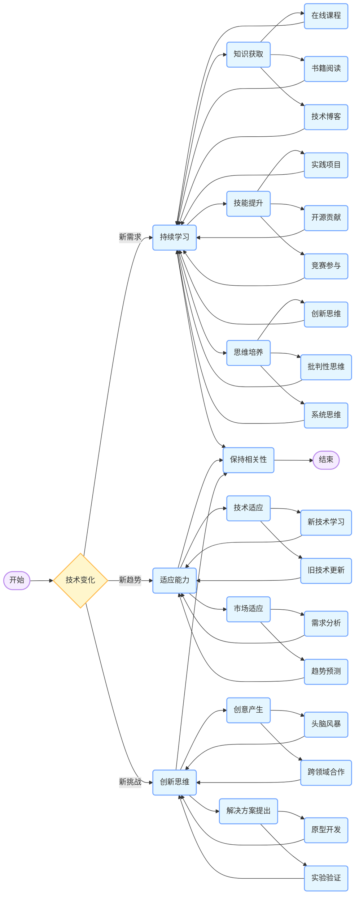

# 如何在技术快速变化中保持相关性

> 关键词：技术变化、相关性、学习策略、技能提升、职业发展、适应能力、创新思维

> 摘要：在当今时代，技术正以前所未有的速度发展和变化。对于技术从业者而言，如何在这种快速变化的环境中保持相关性，是一个亟待解决的关键问题。本文围绕这一核心主题，深入探讨了技术快速变化的背景和影响，详细阐述了保持相关性的核心概念和方法，包括学习策略、技能提升途径等。同时，结合具体的算法原理、数学模型进行分析，并通过项目实战案例展示实际操作过程。此外，还介绍了相关的实际应用场景、推荐了实用的工具和资源。最后，对未来的发展趋势和挑战进行总结，为技术从业者在技术浪潮中持续保持竞争力提供全面而深入的指导。

## 1. 背景介绍 
### 1.1 目的和范围
本文章的主要目的是为技术领域的从业者提供全面且具有可操作性的建议，帮助他们在技术快速变化的环境中保持自身的相关性和竞争力。范围涵盖了从基础的技术概念和学习策略，到具体的项目实践和未来趋势分析，涉及软件开发、人工智能、数据科学等多个热门技术领域。

### 1.2 预期读者
本文预期读者主要包括技术领域的程序员、软件工程师、数据分析师、人工智能研究者等专业人员，同时也适合对技术发展趋势感兴趣的管理人员、创业者以及希望进入技术行业的初学者。

### 1.3 文档结构概述
本文首先介绍技术快速变化的背景信息，包括目的、读者群体和文档结构。接着阐述保持相关性的核心概念和联系，通过文本示意图和 Mermaid 流程图进行直观展示。然后详细讲解核心算法原理和具体操作步骤，结合 Python 源代码进行说明。之后介绍相关的数学模型和公式，并举例说明。再通过项目实战案例，包括开发环境搭建、源代码实现和代码解读，深入展示实际应用。随后探讨实际应用场景，推荐相关的工具和资源。最后总结未来发展趋势与挑战，提供常见问题解答和扩展阅读参考资料。

### 1.4 术语表
#### 1.4.1 核心术语定义
- **技术相关性**：指个人或组织所掌握的技术知识和技能与当前市场需求、行业发展趋势的契合程度。
- **技术半衰期**：指一项技术从诞生到其知识和技能的一半变得过时所需的时间。
- **持续学习**：指个人在职业生涯中不断获取新知识、新技能的过程。

#### 1.4.2 相关概念解释
- **创新思维**：是指以新颖独特的方法解决问题的思维过程，在技术领域中表现为对新技术的探索和应用。
- **适应能力**：指个人或组织能够快速适应技术变化和市场需求的能力。

#### 1.4.3 缩略词列表
- **AI**：Artificial Intelligence，人工智能
- **ML**：Machine Learning，机器学习
- **DL**：Deep Learning，深度学习
- **DS**：Data Science，数据科学

## 2. 核心概念与联系 
### 2.1 核心概念原理
在技术快速变化的环境中，保持相关性的核心在于持续学习和不断适应。技术的发展呈现出指数级增长的趋势，新的技术和概念不断涌现。为了跟上这种变化，技术从业者需要具备以下几个关键能力：

- **学习能力**：能够快速掌握新知识和技能，包括编程语言、算法、框架等。
- **适应能力**：能够灵活调整自己的工作方式和思维模式，以适应新技术的应用和市场需求的变化。
- **创新思维**：能够提出新颖的解决方案和创意，推动技术的发展和应用。

### 2.2 架构的文本示意图
技术相关性的保持可以看作是一个动态的系统，由多个相互关联的部分组成。以下是一个简单的文本示意图：

```plaintext
持续学习
    |
    |-- 知识获取
    |       |
    |       |-- 在线课程
    |       |-- 书籍阅读
    |       |-- 技术博客
    |
    |-- 技能提升
    |       |
    |       |-- 实践项目
    |       |-- 开源贡献
    |       |-- 竞赛参与
    |
    |-- 思维培养
    |       |
    |       |-- 创新思维
    |       |-- 批判性思维
    |       |-- 系统思维
    |
适应能力
    |
    |-- 技术适应
    |       |
    |       |-- 新技术学习
    |       |-- 旧技术更新
    |
    |-- 市场适应
    |       |
    |       |-- 需求分析
    |       |-- 趋势预测
    |
创新思维
    |
    |-- 创意产生
    |       |
    |       |-- 头脑风暴
    |       |-- 跨领域合作
    |
    |-- 解决方案提出
    |       |
    |       |-- 原型开发
    |       |-- 实验验证
```

### 2.3 Mermaid 流程图


## 3. 核心算法原理 & 具体操作步骤 
### 3.1 核心算法原理
在保持技术相关性的过程中，可以借鉴机器学习中的强化学习算法原理。强化学习是一种通过智能体与环境进行交互，不断尝试不同的行为并根据环境反馈的奖励信号来优化行为策略的算法。在技术学习和适应过程中，我们可以将自己看作智能体，技术环境看作环境，学习和实践行为看作行为，而技术能力的提升和市场需求的满足看作奖励信号。

以下是一个简单的强化学习算法伪代码：

```plaintext
初始化智能体的策略
初始化环境
while 未达到终止条件:
    观察当前环境状态
    根据策略选择行为
    执行行为并获得环境反馈的奖励和下一个状态
    根据奖励和下一个状态更新策略
```

### 3.2 具体操作步骤（Python 源代码实现）
我们可以使用 Python 来模拟一个简单的强化学习过程，以帮助我们理解如何在技术学习中应用强化学习的思想。

```python
import numpy as np

# 定义环境类
class TechnologyEnvironment:
    def __init__(self):
        # 初始化环境状态，这里简单用一个整数表示
        self.state = 0
        # 定义可能的行为，例如学习不同的技术
        self.actions = [0, 1, 2]
        # 定义状态的终止条件
        self.terminal_state = 10

    def step(self, action):
        # 根据行为更新状态
        if action == 0:
            self.state += 1
        elif action == 1:
            self.state += 2
        elif action == 2:
            self.state -= 1

        # 判断是否达到终止条件
        done = self.state >= self.terminal_state

        # 定义奖励函数，这里简单地根据状态给予奖励
        if done:
            reward = 10
        else:
            reward = -1

        return self.state, reward, done

# 定义智能体类
class Agent:
    def __init__(self, num_actions):
        # 初始化策略，这里简单地使用随机策略
        self.policy = np.ones(num_actions) / num_actions

    def choose_action(self):
        # 根据策略选择行为
        action = np.random.choice(len(self.policy), p=self.policy)
        return action

    def update_policy(self, state, action, reward):
        # 简单的策略更新，这里只是示例，实际应用中需要更复杂的算法
        if reward > 0:
            self.policy[action] += 0.1
        else:
            self.policy[action] -= 0.1
        # 归一化策略
        self.policy = self.policy / np.sum(self.policy)

# 主程序
if __name__ == "__main__":
    env = TechnologyEnvironment()
    agent = Agent(len(env.actions))

    num_episodes = 100
    for episode in range(num_episodes):
        state = env.state
        done = False
        while not done:
            action = agent.choose_action()
            next_state, reward, done = env.step(action)
            agent.update_policy(state, action, reward)
            state = next_state

        print(f"Episode {episode + 1} completed with final state {state}")
```

### 3.3 代码解释
- **TechnologyEnvironment 类**：表示技术环境，包含环境的状态、可能的行为和终止条件。`step` 方法根据智能体的行为更新环境状态，并返回下一个状态、奖励和是否终止的标志。
- **Agent 类**：表示智能体，包含策略和选择行为的方法。`update_policy` 方法根据奖励信号更新策略。
- **主程序**：创建环境和智能体，进行多次训练，每次训练中智能体与环境进行交互，根据环境反馈更新策略。

## 4. 数学模型和公式 & 详细讲解 & 举例说明 
### 4.1 强化学习的数学模型
强化学习的数学模型可以用马尔可夫决策过程（Markov Decision Process, MDP）来描述。MDP 由一个五元组 $(S, A, P, R, \gamma)$ 组成，其中：

- $S$ 是状态空间，表示环境可能处于的所有状态的集合。
- $A$ 是行为空间，表示智能体可以采取的所有行为的集合。
- $P$ 是状态转移概率函数，表示在状态 $s$ 采取行为 $a$ 后转移到状态 $s'$ 的概率，即 $P(s'|s, a)$。
- $R$ 是奖励函数，表示在状态 $s$ 采取行为 $a$ 后获得的即时奖励，即 $R(s, a)$。
- $\gamma$ 是折扣因子，取值范围为 $[0, 1]$，用于衡量未来奖励的重要性。

### 4.2 价值函数和策略
在强化学习中，有两个重要的概念：价值函数和策略。

- **状态价值函数**：表示在状态 $s$ 下，遵循策略 $\pi$ 所能获得的期望累积折扣奖励，定义为：
$$V^{\pi}(s) = \mathbb{E}_{\pi}\left[\sum_{t=0}^{\infty} \gamma^t R_{t+1} | S_0 = s\right]$$

- **行为价值函数**：表示在状态 $s$ 下采取行为 $a$，然后遵循策略 $\pi$ 所能获得的期望累积折扣奖励，定义为：
$$Q^{\pi}(s, a) = \mathbb{E}_{\pi}\left[\sum_{t=0}^{\infty} \gamma^t R_{t+1} | S_0 = s, A_0 = a\right]$$

- **策略**：表示智能体在每个状态下选择行为的概率分布，用 $\pi(a|s)$ 表示在状态 $s$ 下选择行为 $a$ 的概率。

### 4.3 贝尔曼方程
贝尔曼方程是强化学习中的核心方程，用于描述价值函数的递归关系。

- **状态价值函数的贝尔曼方程**：
$$V^{\pi}(s) = \sum_{a \in A} \pi(a|s) \left(R(s, a) + \gamma \sum_{s' \in S} P(s'|s, a) V^{\pi}(s')\right)$$

- **行为价值函数的贝尔曼方程**：
$$Q^{\pi}(s, a) = R(s, a) + \gamma \sum_{s' \in S} P(s'|s, a) \sum_{a' \in A} \pi(a'|s') Q^{\pi}(s', a')$$

### 4.4 举例说明
假设我们有一个简单的技术学习环境，状态空间 $S = \{0, 1, 2\}$，行为空间 $A = \{0, 1\}$，状态转移概率和奖励函数如下：

| $s$ | $a$ | $s'$ | $P(s'|s, a)$ | $R(s, a)$ |
|---|---|---|---|---|
| 0 | 0 | 1 | 0.8 | 1 |
| 0 | 0 | 0 | 0.2 | -1 |
| 0 | 1 | 2 | 0.6 | 2 |
| 0 | 1 | 0 | 0.4 | -2 |
| 1 | 0 | 2 | 0.7 | 3 |
| 1 | 0 | 1 | 0.3 | -1 |
| 1 | 1 | 0 | 0.5 | -3 |
| 1 | 1 | 1 | 0.5 | -1 |
| 2 | 0 | 2 | 1 | 5 |
| 2 | 1 | 2 | 1 | 5 |

假设折扣因子 $\gamma = 0.9$，策略 $\pi$ 是随机策略，即 $\pi(0|s) = \pi(1|s) = 0.5$。

我们可以使用贝尔曼方程来计算状态价值函数 $V^{\pi}(s)$：

对于状态 $s = 0$：
$$
\begin{align*}
V^{\pi}(0) &= 0.5 \times (0.8 \times (1 + 0.9 \times V^{\pi}(1)) + 0.2 \times (-1 + 0.9 \times V^{\pi}(0))) \\
&+ 0.5 \times (0.6 \times (2 + 0.9 \times V^{\pi}(2)) + 0.4 \times (-2 + 0.9 \times V^{\pi}(0)))
\end{align*}
$$

对于状态 $s = 1$：
$$
\begin{align*}
V^{\pi}(1) &= 0.5 \times (0.7 \times (3 + 0.9 \times V^{\pi}(2)) + 0.3 \times (-1 + 0.9 \times V^{\pi}(1))) \\
&+ 0.5 \times (0.5 \times (-3 + 0.9 \times V^{\pi}(0)) + 0.5 \times (-1 + 0.9 \times V^{\pi}(1)))
\end{align*}
$$

对于状态 $s = 2$：
$$V^{\pi}(2) = 0.5 \times (1 \times (5 + 0.9 \times V^{\pi}(2))) + 0.5 \times (1 \times (5 + 0.9 \times V^{\pi}(2)))$$

通过迭代求解上述方程，我们可以得到状态价值函数 $V^{\pi}(s)$ 的值。

## 5. 项目实战：代码实际案例和详细解释说明 
### 5.1 开发环境搭建
在这个项目实战中，我们将使用 Python 进行开发，需要安装以下库：

- **NumPy**：用于数值计算。
- **Matplotlib**：用于数据可视化。

可以使用以下命令安装这些库：

```sh
pip install numpy matplotlib
```

### 5.2 源代码详细实现和代码解读
我们将实现一个简单的技术学习模拟项目，通过模拟不同技术的学习过程，展示如何在技术变化中保持相关性。

```python
import numpy as np
import matplotlib.pyplot as plt

# 定义技术类
class Technology:
    def __init__(self, name, difficulty, growth_rate):
        self.name = name
        self.difficulty = difficulty
        self.growth_rate = growth_rate
        self.skills = 0

    def learn(self, effort):
        # 学习技能的增长公式
        self.skills += effort / self.difficulty * self.growth_rate
        return self.skills

# 定义技术环境类
class TechnologyEnvironment:
    def __init__(self, technologies):
        self.technologies = technologies
        self.num_technologies = len(technologies)

    def step(self, action, effort):
        # 根据行为选择技术进行学习
        technology = self.technologies[action]
        new_skills = technology.learn(effort)
        return new_skills

# 定义智能体类
class Agent:
    def __init__(self, num_technologies):
        # 初始化策略，这里简单地使用随机策略
        self.policy = np.ones(num_technologies) / num_technologies
        self.skill_history = []

    def choose_action(self):
        # 根据策略选择行为
        action = np.random.choice(len(self.policy), p=self.policy)
        return action

    def update_policy(self, action, reward):
        # 简单的策略更新，根据奖励调整策略
        if reward > 0:
            self.policy[action] += 0.1
        else:
            self.policy[action] -= 0.1
        # 归一化策略
        self.policy = self.policy / np.sum(self.policy)

    def record_skills(self, skills):
        self.skill_history.append(skills)

# 主程序
if __name__ == "__main__":
    # 定义技术列表
    technologies = [
        Technology("Python Programming", 5, 1.2),
        Technology("Machine Learning", 8, 1.5),
        Technology("Data Science", 7, 1.3)
    ]

    env = TechnologyEnvironment(technologies)
    agent = Agent(env.num_technologies)

    num_steps = 100
    effort = 1

    for step in range(num_steps):
        action = agent.choose_action()
        new_skills = env.step(action, effort)
        # 简单的奖励函数，根据技能增长给予奖励
        reward = new_skills - sum([tech.skills for tech in technologies])
        agent.update_policy(action, reward)
        agent.record_skills([tech.skills for tech in technologies])

    # 绘制技能增长曲线
    skill_history = np.array(agent.skill_history)
    plt.figure(figsize=(10, 6))
    for i, tech in enumerate(technologies):
        plt.plot(skill_history[:, i], label=tech.name)
    plt.xlabel("Steps")
    plt.ylabel("Skills")
    plt.title("Skill Growth in Technology Learning")
    plt.legend()
    plt.show()
```

### 5.3 代码解读与分析
- **Technology 类**：表示一种技术，包含技术的名称、难度和增长速率。`learn` 方法根据投入的努力计算技能的增长。
- **TechnologyEnvironment 类**：表示技术环境，包含多个技术。`step` 方法根据智能体的行为选择技术进行学习，并返回新的技能水平。
- **Agent 类**：表示智能体，包含策略和选择行为的方法。`update_policy` 方法根据奖励信号更新策略。`record_skills` 方法记录每次学习后的技能水平。
- **主程序**：创建技术列表、环境和智能体，进行多次学习步骤。在每个步骤中，智能体选择一个技术进行学习，根据技能增长获得奖励，并更新策略。最后，绘制技能增长曲线。

通过这个项目实战，我们可以看到智能体如何在不同技术之间进行选择和学习，以适应技术环境的变化，从而保持自身的技术相关性。

## 6. 实际应用场景 
### 6.1 软件开发领域
在软件开发领域，技术变化非常快速。新的编程语言、框架和工具不断涌现。例如，近年来，Python 语言因其简洁易用和丰富的库而受到广泛关注，同时，人工智能和机器学习相关的框架如 TensorFlow、PyTorch 也在快速发展。软件开发人员需要不断学习新的技术，以提高开发效率和软件质量。例如，开发 Web 应用程序时，可能需要从传统的 PHP 框架转向更现代的 Python 的 Django 或 Flask 框架。

### 6.2 人工智能和机器学习领域
人工智能和机器学习领域是技术变化最为迅速的领域之一。新的算法和模型不断涌现，如深度学习中的卷积神经网络（CNN）、循环神经网络（RNN）及其变种 LSTM、GRU 等，还有强化学习算法的不断改进。研究人员和工程师需要持续关注最新的研究成果，学习新的算法和技术，以推动人工智能技术的发展和应用。例如，在图像识别领域，不断有新的 CNN 模型提出，提高了图像识别的准确率。

### 6.3 数据科学领域
数据科学领域涉及到数据的收集、存储、处理、分析和可视化等多个环节。随着数据量的不断增长和数据分析需求的不断提高，新的技术和工具也在不断涌现。例如，大数据处理框架 Hadoop、Spark 等，以及数据分析和可视化工具如 Pandas、Matplotlib、Seaborn 等。数据科学家需要不断学习和掌握这些新技术，以更好地处理和分析数据。

### 6.4 物联网领域
物联网领域将物理设备与互联网连接起来，实现设备之间的通信和数据交换。随着物联网技术的发展，新的通信协议、传感器技术和边缘计算技术不断涌现。物联网开发者需要不断学习新的技术，以开发出更智能、更高效的物联网应用。例如，低功耗广域网（LPWAN）技术的发展，使得物联网设备的通信距离和功耗得到了更好的平衡。

## 7. 工具和资源推荐
### 7.1 学习资源推荐
#### 7.1.1 书籍推荐
- **《Python 数据分析实战》**：介绍了如何使用 Python 进行数据分析，包括数据清洗、数据可视化、机器学习等内容。
- **《深度学习》**：由 Ian Goodfellow、Yoshua Bengio 和 Aaron Courville 合著，是深度学习领域的经典教材。
- **《算法导论》**：由 Thomas H. Cormen 等人合著，是算法领域的权威著作。

#### 7.1.2 在线课程
- **Coursera**：提供了丰富的在线课程，包括计算机科学、数据科学、人工智能等多个领域。
- **edX**：与全球多所知名大学合作，提供高质量的在线课程。
- **Udemy**：有大量的技术课程，价格相对较为实惠。

#### 7.1.3 技术博客和网站
- **Medium**：有很多技术专家在上面分享自己的经验和见解。
- **Hacker News**：关注技术、创业等领域的最新动态。
- **Stack Overflow**：是程序员交流和解决问题的重要平台。

### 7.2 开发工具框架推荐
#### 7.2.1 IDE和编辑器
- **PyCharm**：是 Python 开发的专业 IDE，提供了丰富的功能和插件。
- **Visual Studio Code**：是一款轻量级的代码编辑器，支持多种编程语言。
- **Jupyter Notebook**：适合数据科学和机器学习的开发和实验。

#### 7.2.2 调试和性能分析工具
- **pdb**：Python 内置的调试工具。
- **cProfile**：Python 用于性能分析的模块。
- **TensorBoard**：TensorFlow 提供的可视化工具，用于查看训练过程和模型性能。

#### 7.2.3 相关框架和库
- **NumPy**：用于数值计算。
- **Pandas**：用于数据处理和分析。
- **Scikit-learn**：用于机器学习。
- **TensorFlow**：用于深度学习。
- **PyTorch**：用于深度学习。

### 7.3 相关论文著作推荐
#### 7.3.1 经典论文
- **LeCun, Y., Bottou, L., Bengio, Y., & Haffner, P. (1998). Gradient-based learning applied to document recognition. Proceedings of the IEEE, 86(11), 2278-2324.**：介绍了卷积神经网络（CNN）在文档识别中的应用。
- **Hinton, G. E., Osindero, S., & Teh, Y. W. (2006). A fast learning algorithm for deep belief nets. Neural computation, 18(7), 1527-1554.**：提出了深度信念网络（DBN）的快速学习算法。

#### 7.3.2 最新研究成果
- **OpenAI 的研究论文**：关注人工智能领域的最新研究成果。
- **Google Research 的研究论文**：涵盖了多个技术领域的最新研究。

#### 7.3.3 应用案例分析
- **Kaggle 上的竞赛案例**：提供了很多实际的数据科学和机器学习应用案例。
- **GitHub 上的开源项目**：可以学习到不同技术领域的实际应用代码。

## 8. 总结：未来发展趋势与挑战
### 8.1 未来发展趋势
- **技术融合**：不同技术领域之间的融合将越来越明显，例如人工智能与物联网、区块链等技术的融合，将创造出更多的创新应用。
- **自动化和智能化**：随着人工智能和机器学习技术的发展，越来越多的工作将实现自动化和智能化，例如软件开发中的代码自动生成、测试自动化等。
- **数据驱动**：数据将成为企业和组织的核心资产，数据科学和数据分析技术将得到更广泛的应用。

### 8.2 挑战
- **知识更新压力**：技术的快速变化使得知识更新的压力越来越大，技术从业者需要不断学习和适应新的技术。
- **技术复杂度增加**：随着技术的发展，技术的复杂度也在不断增加，例如深度学习模型的训练和调优需要大量的计算资源和专业知识。
- **人才竞争激烈**：技术领域的快速发展导致人才竞争日益激烈，企业和组织对高素质的技术人才需求旺盛，技术从业者需要不断提升自己的竞争力。

## 9. 附录：常见问题与解答
### 9.1 如何确定学习哪些技术？
可以通过关注行业动态、技术趋势和市场需求来确定学习哪些技术。例如，可以关注行业报告、技术博客、社交媒体等渠道，了解最新的技术发展动态。同时，也可以根据自己的职业规划和兴趣来选择学习的技术。

### 9.2 如何平衡学习新技术和巩固旧技术？
可以制定合理的学习计划，分配一定的时间用于学习新技术，同时也安排时间巩固旧技术。例如，可以每周安排一定的时间学习新的技术知识，每月安排一次对旧技术的复习和总结。

### 9.3 如何在工作中应用新学习的技术？
可以在工作中寻找合适的项目和机会来应用新学习的技术。例如，可以与团队成员沟通，争取在项目中使用新的技术，或者自己发起一些小型的实验项目来验证新技术的可行性。

### 9.4 如何应对技术更新换代过快的问题？
可以培养自己的学习能力和适应能力，建立持续学习的习惯。同时，也可以关注技术的核心原理和思想，而不是仅仅关注具体的技术工具和框架，这样可以更好地适应技术的变化。

## 10. 扩展阅读 & 参考资料
- 李开复. 《人工智能》. 文化发展出版社.
- 周志华. 《机器学习》. 清华大学出版社.
- 维基百科相关词条
- 各技术领域的官方文档和技术博客