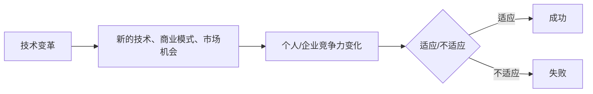

# 如何在技术迅速变化的时代保持竞争力

> 关键词：技术变革、竞争力、持续学习、创新思维、技术趋势、职业发展、适应能力

> 摘要：在当今技术迅速变化的时代，保持竞争力对于个人和企业而言都至关重要。本文深入探讨了在这一背景下保持竞争力的多方面策略和方法，从核心概念的阐述到具体操作步骤的讲解，从数学模型的理论分析到项目实战的案例说明，全面涵盖了保持竞争力的各个关键要点。旨在为读者提供系统且实用的指导，帮助其在快速变化的技术浪潮中站稳脚跟，实现持续的职业发展和企业的蓬勃发展。

## 1. 背景介绍 
### 1.1 目的和范围
在科技飞速发展的当下，技术创新日新月异，新的概念、工具和方法不断涌现。从人工智能到区块链，从大数据到物联网，这些技术的发展深刻地改变了各个行业的格局。本文的目的在于探讨个人和企业如何在这样的环境中保持竞争力，以适应技术的快速变化。范围涵盖了技术领域的多个方面，包括但不限于软件开发、数据分析、人工智能等热门领域，同时也涉及到与技术变革相关的管理、创新和职业发展等内容。

### 1.2 预期读者
本文预期读者包括技术领域的从业者，如程序员、软件工程师、数据分析师等，他们希望在快速变化的技术环境中提升自己的技能和竞争力；企业的管理者和决策者，他们需要了解如何引导企业适应技术变革，制定相应的战略；以及对技术发展趋势感兴趣的学生和研究人员，他们可以从本文中获取有关技术变革和竞争力的相关知识和思路。

### 1.3 文档结构概述
本文将按照以下结构展开：首先介绍相关的核心概念与联系，明确技术变革和竞争力的内涵以及它们之间的关系；接着阐述核心算法原理和具体操作步骤，以说明如何通过技术手段提升竞争力；然后介绍数学模型和公式，从理论层面深入分析竞争力的构成和影响因素；通过项目实战部分展示实际案例，详细解释如何在实际项目中应用这些理论和方法；随后探讨实际应用场景，说明这些策略和方法在不同行业的应用；推荐相关的工具和资源，帮助读者进一步学习和实践；最后总结未来发展趋势与挑战，并提供常见问题的解答和扩展阅读参考资料。

### 1.4 术语表
#### 1.4.1 核心术语定义
- **技术变革**：指由于科学技术的进步而引起的生产方式、管理模式、社会结构等方面的重大变化。
- **竞争力**：个人或企业在市场环境中，相对于竞争对手所具有的优势和能力，能够在资源获取、产品或服务提供等方面表现更出色。
- **持续学习**：个人或组织为了适应不断变化的环境和需求，持续不断地获取新知识、新技能的过程。
- **创新思维**：以新颖、独特的方式思考问题，提出新的想法、方法或解决方案的思维方式。
- **技术趋势**：指在一定时期内，技术发展的方向和趋势，包括新兴技术的出现、现有技术的演进等。

#### 1.4.2 相关概念解释
- **数字化转型**：企业利用数字技术对业务流程、组织架构、商业模式等进行全面改造和升级，以提高效率、创新能力和竞争力。
- **知识半衰期**：指知识从产生到过时所经历的时间，在快速变化的技术领域，知识半衰期越来越短。
- **敏捷开发**：一种软件开发方法，强调快速响应变化、团队协作和客户参与，以提高软件开发的效率和质量。

#### 1.4.3 缩略词列表
- **AI**：Artificial Intelligence，人工智能
- **IoT**：Internet of Things，物联网
- **BD**：Big Data，大数据
- **ML**：Machine Learning，机器学习
- **DL**：Deep Learning，深度学习

## 2. 核心概念与联系 

### 2.1 技术变革的本质
技术变革是科技进步的必然结果，它推动了生产力的发展和社会的进步。从工业革命到信息时代，每一次重大的技术变革都带来了生产方式和生活方式的巨大变化。技术变革的本质在于创新，新的技术不断涌现，替代旧的技术，推动产业升级和转型。例如，互联网技术的发展改变了人们的信息获取和交流方式，电子商务的兴起改变了传统的商业模式。

### 2.2 竞争力的构成要素
竞争力是一个综合的概念，包括多个方面的要素。对于个人而言，竞争力主要包括专业技能、学习能力、创新能力、沟通能力等；对于企业而言，竞争力包括技术实力、产品质量、品牌影响力、市场份额、管理效率等。这些要素相互影响、相互作用，共同构成了个人或企业的竞争力。

### 2.3 技术变革与竞争力的关系
技术变革对竞争力有着深远的影响。一方面，技术变革为个人和企业提供了提升竞争力的机会。新的技术可以带来新的商业模式和市场机会，那些能够及时掌握和应用新技术的个人和企业可以在竞争中脱颖而出。例如，在移动互联网时代，一些新兴的互联网企业通过创新的商业模式和技术应用，迅速崛起并成为行业的领导者。另一方面，技术变革也带来了挑战。如果个人或企业不能及时适应技术变革，就可能会被市场淘汰。例如，传统的胶片相机企业在数码相机技术出现后，由于未能及时转型，逐渐失去了市场份额。

### 2.4 核心概念原理和架构的文本示意图
```plaintext
              技术变革
                |
                | 推动
                v
  新的技术、商业模式、市场机会
                |
                | 影响
                v
  个人/企业竞争力变化
                |
                | 适应/不适应
                v
  成功/失败
```

### 2.5 Mermaid 流程图


## 3. 核心算法原理 & 具体操作步骤 

### 3.1 持续学习算法原理
持续学习的核心思想是不断更新和扩展自己的知识体系，以适应技术的变化。可以将持续学习看作一个迭代的过程，每次迭代都包括获取新知识、学习新知识和应用新知识三个步骤。以下是用 Python 代码实现的一个简单的持续学习模拟算法：

```python
class Learner:
    def __init__(self):
        self.knowledge = set()  # 初始知识集合

    def acquire_new_knowledge(self, new_knowledge):
        """获取新知识"""
        self.knowledge.update(new_knowledge)

    def learn_new_knowledge(self):
        """学习新知识"""
        print("正在学习新知识:", self.knowledge)

    def apply_knowledge(self):
        """应用新知识"""
        print("应用知识:", self.knowledge)

# 示例使用
learner = Learner()
new_knowledge = {"Python编程", "机器学习基础"}
learner.acquire_new_knowledge(new_knowledge)
learner.learn_new_knowledge()
learner.apply_knowledge()
```

### 3.2 具体操作步骤
#### 3.2.1 设定学习目标
明确自己想要学习的技术领域和技能方向，例如想要学习人工智能，就需要确定是学习机器学习、深度学习还是自然语言处理等具体方向。可以根据自己的职业规划和兴趣来设定学习目标。

#### 3.2.2 制定学习计划
根据学习目标，制定详细的学习计划。学习计划应该包括学习的时间安排、学习资源的选择、学习方法的确定等。例如，每天安排一定的时间学习，选择适合自己的教材或在线课程，采用理论学习和实践操作相结合的方法。

#### 3.2.3 执行学习计划
按照学习计划认真执行，不断获取新知识和技能。在学习过程中，要注重实践，通过实际项目来巩固所学的知识。例如，学习编程时，可以参与开源项目或自己动手开发一些小应用。

#### 3.2.4 评估学习效果
定期对自己的学习效果进行评估，检查自己是否达到了学习目标。可以通过考试、实践项目的成果、他人的评价等方式来评估学习效果。如果发现学习效果不理想，要及时调整学习计划和方法。

### 3.3 创新思维培养算法原理
创新思维的培养可以看作是一个激发创意和突破常规的过程。可以通过组合不同的知识和想法，打破思维定式来培养创新思维。以下是一个简单的创新思维模拟算法：

```python
import random

class Innovator:
    def __init__(self, knowledge_base):
        self.knowledge_base = knowledge_base

    def generate_idea(self):
        """生成创意"""
        idea1 = random.choice(list(self.knowledge_base))
        idea2 = random.choice(list(self.knowledge_base))
        new_idea = idea1 + " + " + idea2
        return new_idea

# 示例使用
knowledge_base = {"人工智能", "物联网", "大数据", "区块链"}
innovator = Innovator(knowledge_base)
new_idea = innovator.generate_idea()
print("生成的创意:", new_idea)
```

### 3.4 创新思维培养具体操作步骤
#### 3.4.1 拓宽知识视野
广泛学习不同领域的知识，了解不同行业的发展趋势和创新模式。例如，不仅要学习技术知识，还要学习管理、市场营销、心理学等方面的知识。通过拓宽知识视野，可以为创新思维提供更多的素材。

#### 3.4.2 打破思维定式
尝试从不同的角度看待问题，挑战传统的思维方式。可以采用头脑风暴、逆向思维、类比思维等方法来打破思维定式。例如，在解决问题时，不要局限于现有的解决方案，而是尝试寻找新的思路。

#### 3.4.3 鼓励尝试和失败
创新过程中难免会遇到失败，要鼓励自己和团队勇于尝试，不要害怕失败。从失败中吸取教训，不断改进和完善创新方案。例如，在开发新产品时，可以先进行小规模的试验，根据试验结果进行调整和优化。

#### 3.4.4 建立创新文化
对于企业而言，要建立一种鼓励创新的文化氛围。可以通过设立创新奖励机制、组织创新活动、提供创新资源等方式来激发员工的创新积极性。例如，企业可以定期举办创新比赛，对优秀的创新项目进行奖励。

## 4. 数学模型和公式 & 详细讲解 & 举例说明 

### 4.1 竞争力评估数学模型
我们可以用一个简单的数学模型来评估个人或企业的竞争力。假设竞争力 $C$ 由多个因素决定，每个因素用 $x_i$ 表示，其权重为 $w_i$，则竞争力可以表示为：

$$C = \sum_{i=1}^{n} w_i x_i$$

其中，$n$ 为因素的个数，$\sum_{i=1}^{n} w_i = 1$。

### 4.2 详细讲解
这个模型的核心思想是将竞争力分解为多个因素，每个因素对竞争力的贡献不同，通过权重来体现。例如，对于个人而言，$x_1$ 可以表示专业技能，$x_2$ 可以表示学习能力，$x_3$ 可以表示创新能力等；对于企业而言，$x_1$ 可以表示技术实力，$x_2$ 可以表示产品质量，$x_3$ 可以表示品牌影响力等。权重 $w_i$ 表示每个因素在竞争力中所占的比重，权重的确定需要根据具体情况进行分析和评估。

### 4.3 举例说明
假设我们要评估一个软件开发人员的竞争力，考虑三个因素：专业技能（$x_1$）、学习能力（$x_2$）和沟通能力（$x_3$），其权重分别为 $w_1 = 0.5$，$w_2 = 0.3$，$w_3 = 0.2$。通过对该人员的评估，得到 $x_1 = 80$（满分 100 分），$x_2 = 70$，$x_3 = 60$。则该人员的竞争力为：

$$C = 0.5 \times 80 + 0.3 \times 70 + 0.2 \times 60$$
$$C = 40 + 21 + 12$$
$$C = 73$$

这表明该软件开发人员的竞争力得分为 73 分。通过这个模型，我们可以分析出该人员在哪些方面表现较好，哪些方面需要改进，从而有针对性地提升自己的竞争力。

### 4.4 技术变革对竞争力影响的数学模型
技术变革的速度可以用一个时间函数 $T(t)$ 来表示，其中 $t$ 表示时间。竞争力 $C$ 会随着技术变革的速度而变化，可以表示为：

$$\frac{dC}{dt} = -kT(t)C$$

其中，$k$ 为一个常数，表示技术变革对竞争力的影响系数。

### 4.5 详细讲解
这个模型描述了技术变革对竞争力的动态影响。随着时间的推移，技术变革的速度越快，竞争力下降的速度也越快。这是因为技术变革会导致现有的知识和技能过时，如果不能及时更新和提升，竞争力就会逐渐降低。常数 $k$ 反映了技术变革对竞争力影响的程度，$k$ 越大，说明技术变革对竞争力的影响越显著。

### 4.6 举例说明
假设技术变革的速度 $T(t)$ 是一个线性函数 $T(t) = at + b$（$a$ 和 $b$ 为常数），初始竞争力 $C(0) = C_0$。我们可以通过求解上述微分方程来得到竞争力随时间的变化曲线。

对 $\frac{dC}{dt} = -k(at + b)C$ 进行分离变量，得到：

$$\frac{dC}{C} = -k(at + b)dt$$

两边积分：

$$\int_{C_0}^{C} \frac{dC}{C} = -k \int_{0}^{t} (at + b)dt$$

$$\ln \frac{C}{C_0} = -k \left(\frac{1}{2}at^2 + bt\right)$$

$$C = C_0 e^{-k(\frac{1}{2}at^2 + bt)}$$

通过这个公式，我们可以预测在不同技术变革速度下，竞争力随时间的变化情况。例如，如果 $a = 0.1$，$b = 0.2$，$k = 0.05$，$C_0 = 100$，则可以计算出不同时间点的竞争力值。

## 5. 项目实战：代码实际案例和详细解释说明 

### 5.1  开发环境搭建
假设我们要开发一个简单的人工智能项目，以图像分类为例。以下是开发环境搭建的步骤：

#### 5.1.1 安装 Python
首先，需要安装 Python 环境。可以从 Python 官方网站（https://www.python.org/downloads/） 下载适合自己操作系统的 Python 安装包，并按照安装向导进行安装。

#### 5.1.2 安装深度学习框架
我们选择使用 TensorFlow 作为深度学习框架。可以使用以下命令来安装 TensorFlow：

```sh
pip install tensorflow
```

#### 5.1.3 安装其他依赖库
还需要安装一些其他的依赖库，如 NumPy、Matplotlib 等。可以使用以下命令来安装：

```sh
pip install numpy matplotlib
```

### 5.2  源代码详细实现和代码解读
以下是一个简单的图像分类代码示例：

```python
import tensorflow as tf
from tensorflow.keras.datasets import mnist
from tensorflow.keras.models import Sequential
from tensorflow.keras.layers import Flatten, Dense
import matplotlib.pyplot as plt

# 加载数据集
(train_images, train_labels), (test_images, test_labels) = mnist.load_data()

# 数据预处理
train_images = train_images / 255.0
test_images = test_images / 255.0

# 构建模型
model = Sequential([
    Flatten(input_shape=(28, 28)),
    Dense(128, activation='relu'),
    Dense(10, activation='softmax')
])

# 编译模型
model.compile(optimizer='adam',
              loss='sparse_categorical_crossentropy',
              metrics=['accuracy'])

# 训练模型
model.fit(train_images, train_labels, epochs=5)

# 评估模型
test_loss, test_acc = model.evaluate(test_images, test_labels)
print(f"Test accuracy: {test_acc}")

# 预测示例
predictions = model.predict(test_images)
index = 0
plt.imshow(test_images[index], cmap='gray')
plt.title(f"Predicted: {tf.argmax(predictions[index])}")
plt.show()
```

### 5.3  代码解读与分析
#### 5.3.1 数据加载
使用 `mnist.load_data()` 函数加载 MNIST 手写数字数据集，该数据集包含 60000 个训练样本和 10000 个测试样本。

#### 5.3.2 数据预处理
将图像数据的像素值归一化到 0 到 1 之间，这样可以加快模型的训练速度。

#### 5.3.3 模型构建
使用 `Sequential` 模型构建一个简单的神经网络，包括一个 `Flatten` 层将图像数据展平，一个 `Dense` 层作为隐藏层，使用 `relu` 激活函数，最后一个 `Dense` 层作为输出层，使用 `softmax` 激活函数，输出 10 个类别的概率。

#### 5.3.4 模型编译
使用 `adam` 优化器，`sparse_categorical_crossentropy` 作为损失函数，`accuracy` 作为评估指标。

#### 5.3.5 模型训练
使用 `fit` 方法对模型进行训练，训练 5 个 epoch。

#### 5.3.6 模型评估
使用 `evaluate` 方法对模型在测试集上的性能进行评估，输出测试集的损失和准确率。

#### 5.3.7 预测示例
使用 `predict` 方法对测试集进行预测，选择一个样本并显示其图像和预测结果。

通过这个项目实战，我们可以学习到如何使用深度学习框架进行图像分类任务，同时也可以体会到技术的应用和更新对项目的影响。如果想要提高模型的性能，可以尝试使用更复杂的模型结构、更多的训练数据或调整超参数等方法。

## 6. 实际应用场景 
### 6.1 软件开发行业
在软件开发行业，技术变革非常迅速。新的编程语言、框架和开发方法不断涌现。为了保持竞争力，软件开发人员需要不断学习新的技术，如人工智能、区块链、云计算等。同时，要注重创新思维的培养，开发出更具创新性和竞争力的软件产品。例如，一些互联网企业通过采用敏捷开发方法，快速响应市场需求，不断迭代产品，提高了产品的竞争力。

### 6.2 金融行业
金融行业也受到技术变革的深刻影响。金融科技的发展，如移动支付、数字货币、智能投顾等，改变了传统金融行业的格局。金融机构需要不断引入新的技术，提高服务效率和质量，防范金融风险。例如，银行可以利用大数据和人工智能技术进行风险评估和客户画像，提供个性化的金融服务。

### 6.3 医疗行业
医疗行业是一个对技术要求较高的行业。技术的进步为医疗行业带来了新的机遇和挑战。例如，基因编辑技术、人工智能辅助诊断、远程医疗等技术的发展，提高了医疗诊断和治疗的准确性和效率。医疗人员需要不断学习新的技术知识，掌握新的医疗设备和方法，以提供更好的医疗服务。

### 6.4 教育行业
教育行业也在不断进行技术变革。在线教育、虚拟教室、智能教学系统等技术的应用，改变了传统的教育模式。教育机构和教师需要适应这种变化，利用新的技术手段提高教学质量和效率。例如，教师可以使用在线教学平台进行远程授课，利用智能教学系统进行个性化教学。

## 7. 工具和资源推荐
### 7.1 学习资源推荐
#### 7.1.1 书籍推荐
- 《Python 深度学习》：详细介绍了使用 Python 和 Keras 进行深度学习的方法和技巧。
- 《人工智能：一种现代的方法》：全面介绍了人工智能的基本概念、算法和应用。
- 《大数据时代》：探讨了大数据对社会、经济和生活的影响。

#### 7.1.2 在线课程
- Coursera：提供了丰富的在线课程，包括计算机科学、数据分析、人工智能等多个领域。
- edX：与全球顶尖大学合作，提供高质量的在线课程。
- 中国大学 MOOC：提供了国内高校的优质课程资源。

#### 7.1.3 技术博客和网站
- Medium：有很多技术专家和开发者分享自己的经验和见解。
- 开源中国：提供了丰富的开源技术资讯和项目资源。
- 博客园：国内知名的技术博客平台，有很多优秀的技术文章。

### 7.2 开发工具框架推荐
#### 7.2.1 IDE和编辑器
- PyCharm：一款专门为 Python 开发设计的集成开发环境，功能强大，使用方便。
- Visual Studio Code：一款轻量级的代码编辑器，支持多种编程语言和插件扩展。
- IntelliJ IDEA：一款功能强大的 Java 集成开发环境，也支持其他编程语言。

#### 7.2.2 调试和性能分析工具
- PDB：Python 自带的调试工具，可以帮助开发者调试代码。
- TensorBoard：TensorFlow 提供的可视化工具，可以用于查看模型的训练过程和性能指标。
- Profiler：可以对代码的性能进行分析，找出性能瓶颈。

#### 7.2.3 相关框架和库
- TensorFlow：一个开源的深度学习框架，广泛应用于人工智能领域。
- PyTorch：另一个流行的深度学习框架，具有简洁易用的特点。
- NumPy：Python 的数值计算库，提供了高效的数组操作和数学函数。

### 7.3 相关论文著作推荐
#### 7.3.1 经典论文
- 《ImageNet Classification with Deep Convolutional Neural Networks》：介绍了深度卷积神经网络在图像分类任务中的应用。
- 《Attention Is All You Need》：提出了 Transformer 模型，在自然语言处理领域取得了巨大成功。
- 《A Mathematical Theory of Communication》：奠定了信息论的基础。

#### 7.3.2 最新研究成果
可以通过学术数据库，如 IEEE Xplore、ACM Digital Library 等，查找最新的研究论文。关注顶级学术会议，如 NeurIPS、ICML、CVPR 等，了解最新的研究动态。

#### 7.3.3 应用案例分析
一些知名企业和研究机构会发布技术应用的案例分析报告，可以通过他们的官方网站或相关媒体获取这些报告。例如，谷歌、微软等公司会分享他们在人工智能、云计算等领域的应用案例。

## 8. 总结：未来发展趋势与挑战
### 8.1 未来发展趋势
- **人工智能的广泛应用**：人工智能将在更多领域得到应用，如医疗、交通、教育等，改变人们的生活和工作方式。
- **数字化转型加速**：企业将加快数字化转型的步伐，利用数字技术提升竞争力。
- **绿色技术的兴起**：随着环保意识的增强，绿色技术将得到更多的关注和发展，如可再生能源技术、节能减排技术等。
- **量子计算的突破**：量子计算技术的发展将为科学研究和计算能力带来巨大的突破。

### 8.2 挑战
- **技术更新速度快**：技术的快速更新使得个人和企业需要不断学习和适应，否则就会被淘汰。
- **人才短缺**：新兴技术领域的人才短缺问题日益突出，企业需要花费更多的时间和成本来培养和吸引人才。
- **数据安全和隐私问题**：随着数字化程度的提高，数据安全和隐私问题变得越来越重要，需要加强相关的技术和管理措施。
- **伦理和法律问题**：新技术的发展也带来了一些伦理和法律问题，如人工智能的道德责任、基因编辑的伦理争议等，需要建立相应的规范和制度。

为了在未来的技术变革中保持竞争力，个人和企业需要不断学习和创新，积极应对挑战，抓住发展机遇。

## 9. 附录：常见问题与解答
### 9.1 如何确定自己的学习方向？
可以根据自己的兴趣、职业规划和市场需求来确定学习方向。了解当前热门的技术领域和行业趋势，结合自己的优势和特长，选择适合自己的学习方向。

### 9.2 如何平衡工作和学习？
可以制定合理的时间计划，合理安排工作和学习的时间。利用碎片化时间进行学习，如在上下班路上、午休时间等。同时，要注重学习效率，选择适合自己的学习方法。

### 9.3 如何培养创新思维？
可以通过拓宽知识视野、打破思维定式、鼓励尝试和失败、建立创新文化等方法来培养创新思维。多参加创新活动，与不同领域的人交流合作，激发自己的创意。

### 9.4 如何应对技术更新换代快的问题？
要树立持续学习的意识，不断关注技术发展动态，及时学习新的知识和技能。可以加入技术社区、参加培训课程、阅读技术文献等方式来保持对新技术的了解。

### 9.5 如何在团队中发挥自己的竞争力？
要注重团队协作，发挥自己的优势和特长，为团队的目标贡献力量。同时，要善于学习团队成员的优点，不断提升自己的能力。积极参与团队讨论和决策，提出自己的见解和建议。

## 10. 扩展阅读 & 参考资料
### 10.1 扩展阅读
- 《未来简史：从智人到神人》：探讨了未来人类社会的发展趋势和面临的挑战。
- 《人类简史：从动物到上帝》：讲述了人类的进化历程和文明的发展。
- 《奇点临近》：讨论了技术奇点对人类社会的影响。

### 10.2 参考资料
- 相关技术书籍和文献。
- 各大技术公司的官方文档和博客。
- 学术数据库中的研究论文。
- 行业报告和统计数据。