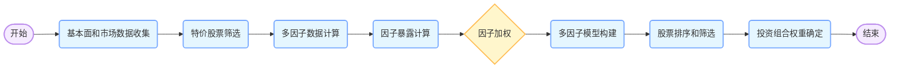

# 如何将特价股票策略融入多因子智能投资组合

> 关键词：特价股票策略、多因子智能投资组合、因子模型、量化投资、风险收益优化

> 摘要：本文旨在深入探讨如何将特价股票策略融入多因子智能投资组合。首先介绍了相关背景知识，包括目的、预期读者等内容。接着阐述了核心概念，分析了特价股票策略和多因子智能投资组合的原理及联系，并给出相应的示意图和流程图。详细讲解了核心算法原理，通过 Python 代码进行说明。同时给出了数学模型和公式，并举例说明。通过项目实战展示了如何搭建开发环境、实现源代码及进行代码解读。探讨了该融合策略的实际应用场景，推荐了相关的学习资源、开发工具框架以及论文著作。最后总结了未来发展趋势与挑战，提供了常见问题解答和扩展阅读参考资料，为投资者和相关从业者提供全面的技术和理论支持。

## 1. 背景介绍 
### 1.1 目的和范围
随着金融市场的不断发展和复杂化，投资者越来越需要更科学、有效的投资策略来实现资产的增值和风险的控制。多因子智能投资组合作为一种基于量化分析的投资方法，通过综合考虑多个因子来构建投资组合，能够在一定程度上提高投资组合的收益和降低风险。而特价股票策略则专注于寻找被市场低估的股票，以获取超额收益。将特价股票策略融入多因子智能投资组合的目的在于充分发挥两者的优势，进一步优化投资组合的风险收益特征。

本文的范围涵盖了从理论原理到实际应用的各个方面，包括核心概念的解释、算法原理的阐述、数学模型的推导、项目实战的展示以及实际应用场景的分析等，旨在为投资者和相关从业者提供全面、深入的指导。

### 1.2 预期读者
本文的预期读者包括金融投资者、量化投资从业者、金融科技领域的开发者以及对金融投资和量化分析感兴趣的研究人员。无论是专业的投资人士还是初学者，都可以从本文中获取有价值的信息和知识，帮助他们更好地理解和应用特价股票策略与多因子智能投资组合的融合方法。

### 1.3 文档结构概述
本文将按照以下结构进行组织：首先介绍背景知识，包括目的、预期读者和文档结构概述等内容；接着阐述核心概念，分析特价股票策略和多因子智能投资组合的原理及联系；详细讲解核心算法原理，并通过 Python 代码进行说明；给出数学模型和公式，并举例说明；通过项目实战展示如何搭建开发环境、实现源代码及进行代码解读；探讨该融合策略的实际应用场景；推荐相关的学习资源、开发工具框架以及论文著作；最后总结未来发展趋势与挑战，提供常见问题解答和扩展阅读参考资料。

### 1.4 术语表
#### 1.4.1 核心术语定义
- **特价股票策略**：一种投资策略，通过分析股票的基本面和市场数据，寻找被市场低估的股票进行投资，以期望在股票价格回归合理价值时获得超额收益。
- **多因子智能投资组合**：基于多个因子（如估值因子、成长因子、动量因子等）构建的投资组合，通过量化模型对因子进行分析和加权，以实现投资组合的优化。
- **因子模型**：一种用于描述资产收益率与多个因子之间关系的数学模型，常见的因子模型包括 Fama - French 三因子模型、Carhart 四因子模型等。
- **量化投资**：利用数学、统计学和计算机技术，通过建立量化模型来进行投资决策的一种投资方法。
- **风险收益优化**：在投资过程中，通过合理配置资产和选择投资策略，在控制风险的前提下实现投资收益的最大化。

#### 1.4.2 相关概念解释
- **因子**：影响股票收益率的各种因素，如市盈率、市净率、净利润增长率等。因子可以分为基本面因子、市场因子和技术因子等。
- **因子暴露**：指投资组合对某个因子的敏感程度，通常用因子载荷来表示。
- **因子选股**：根据因子的大小对股票进行排序，选择排名靠前或靠后的股票构建投资组合的方法。
- **投资组合优化**：通过调整投资组合中各资产的权重，使投资组合的风险收益特征达到最优的过程。

#### 1.4.3 缩略词列表
- **F-F**：Fama - French，指 Fama 和 French 提出的三因子模型。
- **CAPM**：Capital Asset Pricing Model，资本资产定价模型。
- **IC**：Information Coefficient，信息系数，用于衡量因子与股票未来收益率之间的相关性。
- **IR**：Information Ratio，信息比率，用于衡量投资组合的主动管理能力。

## 2. 核心概念与联系 
### 核心概念原理
#### 特价股票策略原理
特价股票策略的核心思想是寻找市场中被低估的股票。其理论基础在于市场并非完全有效的，存在着信息不对称和投资者情绪等因素，导致某些股票的价格偏离其内在价值。通过对股票的基本面进行分析，如市盈率、市净率、股息率等指标，结合公司的财务状况、行业前景等因素，可以筛选出那些被市场低估的股票。一旦市场发现这些股票的真实价值，其价格就会向内在价值回归，从而为投资者带来超额收益。

#### 多因子智能投资组合原理
多因子智能投资组合基于因子模型，认为股票的收益率可以由多个因子共同解释。不同的因子对股票收益率的影响程度不同，通过对多个因子进行综合分析和加权，可以构建出一个能够有效捕捉市场收益和控制风险的投资组合。常见的因子包括估值因子、成长因子、动量因子、质量因子等。多因子模型的优势在于能够综合考虑多种因素的影响，避免单一因子的局限性，从而提高投资组合的稳定性和收益性。

### 架构的文本示意图
特价股票策略与多因子智能投资组合的融合架构可以描述如下：首先，通过基本面分析和市场数据筛选出符合特价股票策略的股票池。然后，对这些股票进行多因子分析，计算每个股票在各个因子上的暴露程度。接着，根据因子的重要性和有效性，对各个因子进行加权，构建多因子模型。最后，利用多因子模型对股票池中的股票进行排序和筛选，确定投资组合中各股票的权重。

### Mermaid 流程图


## 3. 核心算法原理 & 具体操作步骤 
### 核心算法原理
在将特价股票策略融入多因子智能投资组合的过程中，核心算法主要包括因子计算、因子加权和投资组合优化三个部分。

#### 因子计算
因子计算是指根据股票的基本面和市场数据，计算每个股票在各个因子上的数值。常见的因子计算方法如下：
- **市盈率（PE）**：$PE = \frac{股价}{每股收益}$
- **市净率（PB）**：$PB = \frac{股价}{每股净资产}$
- **净利润增长率（G）**：$G = \frac{本期净利润 - 上期净利润}{上期净利润}$

#### 因子加权
因子加权是指确定每个因子在多因子模型中的权重。常见的因子加权方法包括等权重法、市值加权法、IC 加权法等。

- **等权重法**：每个因子的权重相等，即 $w_i = \frac{1}{n}$，其中 $n$ 为因子的数量。
- **市值加权法**：根据因子的市值大小来确定权重，市值越大的因子权重越高。
- **IC 加权法**：根据因子的信息系数（IC）来确定权重，IC 越高的因子权重越高。

#### 投资组合优化
投资组合优化是指在满足一定约束条件下，调整投资组合中各股票的权重，使投资组合的风险收益特征达到最优。常见的投资组合优化方法包括均值 - 方差优化法、风险平价法等。

### 具体操作步骤
#### 步骤 1：数据收集
收集股票的基本面数据（如财务报表数据）和市场数据（如股价、成交量等）。

#### 步骤 2：特价股票筛选
根据特价股票策略的标准，对收集到的股票数据进行筛选，确定符合条件的股票池。

#### 步骤 3：因子计算
对股票池中的股票，计算每个股票在各个因子上的数值。

#### 步骤 4：因子加权
根据选择的因子加权方法，确定每个因子的权重。

#### 步骤 5：多因子模型构建
根据因子计算结果和因子权重，构建多因子模型。

#### 步骤 6：股票排序和筛选
利用多因子模型对股票池中的股票进行排序，选择排名靠前的股票作为投资组合的候选股票。

#### 步骤 7：投资组合优化
根据选择的投资组合优化方法，确定投资组合中各股票的权重。

### Python 源代码实现
```python
import pandas as pd
import numpy as np
from scipy.optimize import minimize

# 步骤 1：数据收集
# 假设已经有一个包含股票基本面和市场数据的 DataFrame
data = pd.read_csv('stock_data.csv')

# 步骤 2：特价股票筛选
# 例如，筛选市盈率小于 10 且市净率小于 1 的股票
special_stocks = data[(data['PE'] < 10) & (data['PB'] < 1)]

# 步骤 3：因子计算
factors = ['PE', 'PB', 'G']
for factor in factors:
    special_stocks[factor + '_rank'] = special_stocks[factor].rank()

# 步骤 4：因子加权
# 等权重法
weights = np.ones(len(factors)) / len(factors)

# 步骤 5：多因子模型构建
special_stocks['score'] = 0
for i, factor in enumerate(factors):
    special_stocks['score'] += weights[i] * special_stocks[factor + '_rank']

# 步骤 6：股票排序和筛选
top_stocks = special_stocks.sort_values(by='score', ascending=False).head(10)

# 步骤 7：投资组合优化
# 假设已经有股票的收益率协方差矩阵 cov_matrix
cov_matrix = np.random.rand(len(top_stocks), len(top_stocks))
returns = np.random.rand(len(top_stocks))

# 定义目标函数：最小化投资组合的方差
def objective(weights):
    return np.dot(weights.T, np.dot(cov_matrix, weights))

# 定义约束条件：权重之和为 1
constraints = ({'type': 'eq', 'fun': lambda x: np.sum(x) - 1})

# 定义边界条件：权重在 0 到 1 之间
bounds = [(0, 1) for _ in range(len(top_stocks))]

# 初始权重
initial_weights = np.ones(len(top_stocks)) / len(top_stocks)

# 进行优化
result = minimize(objective, initial_weights, method='SLSQP', bounds=bounds, constraints=constraints)

optimal_weights = result.x

print("最优投资组合权重：", optimal_weights)
```

## 4. 数学模型和公式 & 详细讲解 & 举例说明 
### 因子模型
常见的多因子模型如 Fama - French 三因子模型可以表示为：
$$R_{i,t} - R_{f,t} = \alpha_i + \beta_{i,MKT}(R_{MKT,t} - R_{f,t}) + \beta_{i,SMB}SMB_t + \beta_{i,HML}HML_t + \epsilon_{i,t}$$
其中：
- $R_{i,t}$ 是股票 $i$ 在 $t$ 时刻的收益率；
- $R_{f,t}$ 是 $t$ 时刻的无风险收益率；
- $R_{MKT,t}$ 是 $t$ 时刻的市场组合收益率；
- $SMB_t$ 是 $t$ 时刻的规模因子收益率；
- $HML_t$ 是 $t$ 时刻的价值因子收益率；
- $\alpha_i$ 是股票 $i$ 的超额收益率；
- $\beta_{i,MKT}$、$\beta_{i,SMB}$、$\beta_{i,HML}$ 分别是股票 $i$ 对市场因子、规模因子和价值因子的暴露程度；
- $\epsilon_{i,t}$ 是股票 $i$ 在 $t$ 时刻的残差收益率。

### 因子加权公式
#### 等权重法
假设共有 $n$ 个因子，每个因子的权重 $w_i$ 为：
$$w_i = \frac{1}{n}, \quad i = 1,2,\cdots,n$$

#### 市值加权法
设第 $i$ 个因子的市值为 $MV_i$，则第 $i$ 个因子的权重 $w_i$ 为：
$$w_i = \frac{MV_i}{\sum_{j=1}^{n}MV_j}, \quad i = 1,2,\cdots,n$$

#### IC 加权法
设第 $i$ 个因子的信息系数为 $IC_i$，则第 $i$ 个因子的权重 $w_i$ 为：
$$w_i = \frac{IC_i}{\sum_{j=1}^{n}|IC_j|}, \quad i = 1,2,\cdots,n$$

### 投资组合优化公式
#### 均值 - 方差优化法
均值 - 方差优化法的目标是在给定预期收益率的情况下，最小化投资组合的方差。设投资组合的权重向量为 $\mathbf{w} = [w_1, w_2, \cdots, w_n]^T$，预期收益率向量为 $\mathbf{\mu} = [\mu_1, \mu_2, \cdots, \mu_n]^T$，收益率协方差矩阵为 $\mathbf{\Sigma}$，目标收益率为 $R_p$，则均值 - 方差优化问题可以表示为：
$$\min_{\mathbf{w}} \mathbf{w}^T\mathbf{\Sigma}\mathbf{w}$$
$$\text{s.t.} \quad \mathbf{w}^T\mathbf{\mu} = R_p$$
$$\sum_{i=1}^{n}w_i = 1$$
$$w_i \geq 0, \quad i = 1,2,\cdots,n$$

#### 风险平价法
风险平价法的目标是使投资组合中各资产的风险贡献相等。设投资组合的风险贡献向量为 $\mathbf{RC} = [RC_1, RC_2, \cdots, RC_n]^T$，则风险平价问题可以表示为：
$$\min_{\mathbf{w}} \sum_{i=1}^{n}\sum_{j=1}^{n}(RC_i - RC_j)^2$$
$$\text{s.t.} \quad \sum_{i=1}^{n}w_i = 1$$
$$w_i \geq 0, \quad i = 1,2,\cdots,n$$

### 举例说明
假设我们有三只股票 $A$、$B$、$C$，其预期收益率分别为 $\mu_A = 0.1$、$\mu_B = 0.15$、$\mu_C = 0.2$，收益率协方差矩阵为：
$$\mathbf{\Sigma} = \begin{bmatrix}
0.04 & 0.02 & 0.01 \\
0.02 & 0.09 & 0.03 \\
0.01 & 0.03 & 0.16
\end{bmatrix}$$
目标收益率 $R_p = 0.15$。

#### 均值 - 方差优化法求解
使用 Python 的 `scipy.optimize.minimize` 函数求解上述优化问题：
```python
import numpy as np
from scipy.optimize import minimize

# 预期收益率向量
mu = np.array([0.1, 0.15, 0.2])

# 收益率协方差矩阵
Sigma = np.array([[0.04, 0.02, 0.01],
                  [0.02, 0.09, 0.03],
                  [0.01, 0.03, 0.16]])

# 目标收益率
Rp = 0.15

# 定义目标函数
def objective(w):
    return np.dot(w.T, np.dot(Sigma, w))

# 定义约束条件
constraints = [{'type': 'eq', 'fun': lambda w: np.dot(w, mu) - Rp},
               {'type': 'eq', 'fun': lambda w: np.sum(w) - 1}]

# 定义边界条件
bounds = [(0, 1) for _ in range(len(mu))]

# 初始权重
initial_weights = np.ones(len(mu)) / len(mu)

# 进行优化
result = minimize(objective, initial_weights, method='SLSQP', bounds=bounds, constraints=constraints)

optimal_weights = result.x

print("最优投资组合权重：", optimal_weights)
```

## 5. 项目实战：代码实际案例和详细解释说明 
### 5.1  开发环境搭建
#### 安装 Python
首先需要安装 Python 环境，建议使用 Python 3.7 及以上版本。可以从 Python 官方网站（https://www.python.org/downloads/）下载并安装适合自己操作系统的 Python 版本。

#### 安装必要的库
在命令行中使用 `pip` 命令安装必要的库，包括 `pandas`、`numpy`、`scipy` 等：
```sh
pip install pandas numpy scipy
```

#### 数据准备
准备包含股票基本面和市场数据的 CSV 文件，文件中应包含股票代码、股价、每股收益、每股净资产、净利润等必要信息。

### 5.2  源代码详细实现和代码解读
```python
import pandas as pd
import numpy as np
from scipy.optimize import minimize

# 步骤 1：数据收集
# 读取 CSV 文件
data = pd.read_csv('stock_data.csv')

# 步骤 2：特价股票筛选
# 筛选市盈率小于 10 且市净率小于 1 的股票
special_stocks = data[(data['PE'] < 10) & (data['PB'] < 1)]

# 步骤 3：因子计算
# 定义因子列表
factors = ['PE', 'PB', 'G']
for factor in factors:
    # 对每个因子进行排名
    special_stocks[factor + '_rank'] = special_stocks[factor].rank()

# 步骤 4：因子加权
# 等权重法
weights = np.ones(len(factors)) / len(factors)

# 步骤 5：多因子模型构建
# 初始化分数列
special_stocks['score'] = 0
for i, factor in enumerate(factors):
    # 计算每个股票的综合得分
    special_stocks['score'] += weights[i] * special_stocks[factor + '_rank']

# 步骤 6：股票排序和筛选
# 按综合得分降序排序，并选择排名前 10 的股票
top_stocks = special_stocks.sort_values(by='score', ascending=False).head(10)

# 步骤 7：投资组合优化
# 生成随机的收益率协方差矩阵和预期收益率向量
cov_matrix = np.random.rand(len(top_stocks), len(top_stocks))
returns = np.random.rand(len(top_stocks))

# 定义目标函数：最小化投资组合的方差
def objective(weights):
    return np.dot(weights.T, np.dot(cov_matrix, weights))

# 定义约束条件：权重之和为 1
constraints = ({'type': 'eq', 'fun': lambda x: np.sum(x) - 1})

# 定义边界条件：权重在 0 到 1 之间
bounds = [(0, 1) for _ in range(len(top_stocks))]

# 初始权重
initial_weights = np.ones(len(top_stocks)) / len(top_stocks)

# 进行优化
result = minimize(objective, initial_weights, method='SLSQP', bounds=bounds, constraints=constraints)

optimal_weights = result.x

print("最优投资组合权重：", optimal_weights)
```

### 5.3  代码解读与分析
#### 数据收集
使用 `pandas` 库的 `read_csv` 函数读取包含股票数据的 CSV 文件。

#### 特价股票筛选
通过条件筛选，选择市盈率小于 10 且市净率小于 1 的股票作为特价股票。

#### 因子计算
对每个因子进行排名，排名越高表示该股票在该因子上的表现越好。

#### 因子加权
使用等权重法对每个因子进行加权，即每个因子的权重相等。

#### 多因子模型构建
根据因子排名和因子权重，计算每个股票的综合得分。

#### 股票排序和筛选
按综合得分降序排序，选择排名前 10 的股票作为投资组合的候选股票。

#### 投资组合优化
使用 `scipy.optimize.minimize` 函数进行均值 - 方差优化，目标是最小化投资组合的方差，同时满足权重之和为 1 和权重非负的约束条件。

## 6. 实际应用场景 
### 个人投资者
对于个人投资者来说，将特价股票策略融入多因子智能投资组合可以帮助他们更科学地进行投资决策。通过筛选被低估的股票，并结合多因子分析，可以构建出风险收益特征更优的投资组合。例如，个人投资者可以根据自己的风险偏好和投资目标，选择不同的因子和加权方法，构建适合自己的投资组合。

### 机构投资者
机构投资者如基金公司、保险公司等，通常管理着大量的资产，需要更专业、更有效的投资策略来实现资产的增值和风险的控制。将特价股票策略融入多因子智能投资组合可以为机构投资者提供一种新的投资思路和方法。机构投资者可以利用自己的研究团队和数据资源，对因子进行更深入的分析和研究，构建更复杂、更有效的多因子模型。

### 量化投资公司
量化投资公司以量化分析为核心，通过建立量化模型来进行投资决策。将特价股票策略融入多因子智能投资组合是量化投资公司常用的策略之一。量化投资公司可以利用计算机技术和算法，对大量的股票数据进行实时分析和处理，快速调整投资组合的权重，以适应市场的变化。

## 7. 工具和资源推荐
### 7.1 学习资源推荐
#### 7.1.1 书籍推荐
- 《量化投资：策略与技术》：全面介绍了量化投资的基本概念、方法和技术，包括因子模型、投资组合优化等内容。
- 《聪明的投资者》：价值投资的经典著作，介绍了如何寻找被低估的股票，对特价股票策略有很好的指导作用。
- 《多因子模型与量化投资》：深入讲解了多因子模型的原理和应用，以及如何将多因子模型应用于投资组合管理。

#### 7.1.2 在线课程
- Coursera 上的“Quantitative Investing”：由知名教授授课，系统介绍了量化投资的理论和实践。
- 网易云课堂上的“量化投资入门与实战”：适合初学者，通过实际案例介绍了量化投资的基本方法和技术。

#### 7.1.3 技术博客和网站
- 优矿（https://uqer.datayes.com/）：提供了丰富的量化投资数据和工具，还有很多量化投资的研究报告和案例。
- 聚宽（https://www.joinquant.com/）：专注于量化投资领域，提供了量化交易平台和学习资源。

### 7.2 开发工具框架推荐
#### 7.2.1 IDE和编辑器
- PyCharm：功能强大的 Python 集成开发环境，提供了代码编辑、调试、版本控制等功能。
- Jupyter Notebook：交互式的开发环境，适合进行数据分析和模型开发，方便代码的展示和分享。

#### 7.2.2 调试和性能分析工具
- PySnooper：可以自动记录函数的调用过程和变量的值，方便调试代码。
- cProfile：Python 自带的性能分析工具，可以分析代码的运行时间和函数调用次数。

#### 7.2.3 相关框架和库
- pandas：用于数据处理和分析的 Python 库，提供了丰富的数据结构和函数。
- numpy：用于科学计算的 Python 库，提供了高效的数组和矩阵运算功能。
- scipy：用于科学计算和优化的 Python 库，提供了很多优化算法和统计函数。

### 7.3 相关论文著作推荐
#### 7.3.1 经典论文
- Fama, E. F., & French, K. R. (1993). Common risk factors in the returns on stocks and bonds. *Journal of Financial Economics*, 33(1), 3-56. 提出了 Fama - French 三因子模型。
- Carhart, M. M. (1997). On persistence in mutual fund performance. *The Journal of Finance*, 52(1), 57-82. 提出了 Carhart 四因子模型。

#### 7.3.2 最新研究成果
可以关注《Journal of Financial Economics》、《The Journal of Finance》等金融领域的顶级期刊，了解多因子模型和量化投资的最新研究成果。

#### 7.3.3 应用案例分析
可以参考一些量化投资公司的研究报告和案例分析，了解他们如何将特价股票策略融入多因子智能投资组合。

## 8. 总结：未来发展趋势与挑战
### 未来发展趋势
#### 因子多元化
随着金融市场的不断发展和创新，未来的多因子模型将更加多元化。除了传统的估值因子、成长因子、动量因子等，还会引入更多的另类因子，如社交媒体情绪因子、宏观经济因子等，以提高模型的解释能力和预测能力。

#### 人工智能与机器学习的应用
人工智能和机器学习技术将在多因子智能投资组合中得到更广泛的应用。通过深度学习算法，可以对大量的非结构化数据进行分析和挖掘，发现更多潜在的因子和投资机会。同时，强化学习算法可以用于动态调整投资组合的权重，提高投资组合的适应性和收益性。

#### 跨市场和跨境投资
随着全球金融市场的一体化，未来的多因子智能投资组合将不仅仅局限于国内市场，还会涉及跨市场和跨境投资。投资者可以通过构建全球多因子模型，实现资产的全球配置，降低投资组合的风险。

### 挑战
#### 数据质量和可用性
多因子智能投资组合需要大量的高质量数据作为支撑。然而，金融数据的质量和可用性存在一定的问题，如数据缺失、数据错误、数据延迟等。这些问题会影响因子的计算和模型的准确性，需要投资者和研究人员采取有效的方法来解决。

#### 因子失效和过拟合
随着市场环境的变化，一些因子可能会失效，导致模型的预测能力下降。同时，过度拟合也是一个常见的问题，即模型在训练数据上表现良好，但在测试数据上表现不佳。为了避免因子失效和过拟合，需要对因子进行不断的筛选和更新，同时采用交叉验证等方法来评估模型的性能。

#### 监管和合规要求
金融市场受到严格的监管和合规要求，投资者和金融机构在使用多因子智能投资组合进行投资时，需要遵守相关的法律法规和监管要求。这对投资者和金融机构的合规管理能力提出了更高的要求。

## 9. 附录：常见问题与解答
### 问题 1：如何选择合适的因子？
选择合适的因子需要考虑多个因素，包括因子的有效性、稳定性、可解释性等。可以通过历史数据回测、因子的信息系数（IC）等指标来评估因子的有效性和稳定性。同时，因子应该具有一定的经济意义和可解释性，以便投资者能够理解和应用。

### 问题 2：因子加权方法有哪些优缺点？
- **等权重法**：优点是简单易懂，不需要对因子进行复杂的分析和评估；缺点是没有考虑因子的重要性和有效性差异。
- **市值加权法**：优点是考虑了因子的市值大小，能够反映因子在市场中的影响力；缺点是可能会导致某些因子的权重过高，而忽略了其他因子的作用。
- **IC 加权法**：优点是能够根据因子的信息系数来确定权重，更注重因子的有效性；缺点是需要对因子的信息系数进行准确的估计，否则会影响权重的合理性。

### 问题 3：如何评估投资组合的性能？
可以使用多个指标来评估投资组合的性能，如收益率、夏普比率、最大回撤等。收益率反映了投资组合的盈利水平，夏普比率衡量了投资组合的风险调整后收益，最大回撤表示投资组合在一段时间内的最大亏损幅度。同时，还可以通过与基准指数进行比较，评估投资组合的相对表现。

## 10. 扩展阅读 & 参考资料
### 扩展阅读
- 《金融计量学：从基础到前沿》：深入介绍了金融计量学的理论和方法，对于理解多因子模型和量化投资有很大的帮助。
- 《机器学习与金融市场》：探讨了机器学习技术在金融市场中的应用，包括因子挖掘、投资组合优化等方面。

### 参考资料
- 文中引用的学术论文和研究报告。
- 相关的金融网站和数据提供商，如东方财富网、Wind 资讯等。