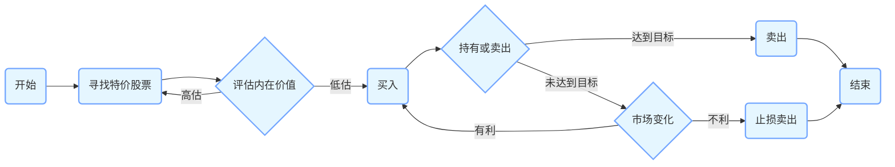

# 如何提高特价股票投资的成功率

> 关键词：特价股票、投资成功率、价值分析、风险控制、市场趋势

> 摘要：本文旨在深入探讨如何提高特价股票投资的成功率。首先介绍了特价股票投资的背景知识，包括目的、预期读者等内容。接着阐述了核心概念及它们之间的联系，分析了核心算法原理和具体操作步骤，并通过数学模型和公式进行详细说明。然后结合项目实战，给出实际案例及代码实现与解读。之后探讨了特价股票投资的实际应用场景，推荐了相关的工具和资源。最后总结了未来发展趋势与挑战，提供常见问题解答和扩展阅读参考资料，帮助投资者全面了解并掌握提高特价股票投资成功率的方法。

## 1. 背景介绍 
### 1.1 目的和范围
在股票投资领域，特价股票往往具有较大的吸引力，因为它们可能以较低的价格提供较高的潜在回报。然而，投资特价股票也伴随着较高的风险。本文的目的在于系统地分析和阐述如何提高特价股票投资的成功率，涵盖从基本概念理解、投资策略制定到实际操作技巧等多个方面。范围包括对特价股票的定义、价值评估方法、投资过程中的风险控制以及如何结合市场趋势进行投资决策等内容。

### 1.2 预期读者
本文预期读者主要包括对股票投资有一定兴趣，尤其是希望参与特价股票投资的个人投资者。同时，也适合金融专业的学生、研究人员以及从事相关金融工作的从业者阅读，帮助他们深入了解特价股票投资的理论和实践知识。

### 1.3 文档结构概述
本文将按照以下结构展开：首先介绍核心概念与联系，让读者对特价股票有清晰的认识；接着阐述核心算法原理和具体操作步骤，为投资决策提供技术支持；然后通过数学模型和公式详细说明投资过程中的量化分析方法；再结合项目实战，给出实际案例和代码解读；之后探讨实际应用场景，为读者提供投资思路；推荐相关的工具和资源，帮助读者进一步学习和实践；最后总结未来发展趋势与挑战，解答常见问题并提供扩展阅读参考资料。

### 1.4 术语表
#### 1.4.1 核心术语定义
- **特价股票**：指价格相对其内在价值被低估的股票，可能由于市场情绪、行业短期困境或公司个别事件等原因导致股价低于其应有的水平。
- **投资成功率**：指在一定时期内，成功的投资交易次数占总投资交易次数的比例，成功的投资通常定义为实现了预期的投资回报。
- **内在价值**：是指股票所代表的公司的真实价值，通过对公司的财务状况、盈利能力、市场竞争力等多方面因素进行分析评估得出。
- **风险控制**：在投资过程中，采取一系列措施来降低投资风险，如分散投资、设置止损点等。

#### 1.4.2 相关概念解释
- **价值投资**：一种投资策略，强调通过分析股票的内在价值，寻找被低估的股票进行投资，以获取长期的投资回报。
- **市场效率**：指市场价格反映所有可用信息的程度。在有效市场中，股票价格能够迅速反映所有公开信息，而在无效市场中，可能存在价格与内在价值偏离的情况，这为特价股票投资提供了机会。
- **技术分析**：通过研究股票价格和交易量的历史数据，运用各种技术指标和图表来预测股票未来价格走势的方法。

#### 1.4.3 缩略词列表
- **PE**：市盈率（Price - Earnings Ratio），指股票价格除以每股收益的比率，用于衡量股票的估值水平。
- **PB**：市净率（Price - to - Book Ratio），指股票价格除以每股净资产的比率，反映了股票价格相对于公司净资产的倍数。
- **ROE**：净资产收益率（Return on Equity），衡量公司运用自有资本的效率，反映股东权益的收益水平。

## 2. 核心概念与联系 

### 核心概念原理
特价股票投资的核心在于发现价格被低估的股票，通过买入并持有，等待市场对其价值的重新认可，从而实现投资回报。其原理基于市场的非有效性，即市场价格并不总是能够准确反映股票的内在价值。以下是几个关键概念的原理：

#### 内在价值评估
内在价值是特价股票投资的基础。评估内在价值需要综合考虑公司的财务状况、行业前景、竞争优势等因素。常用的方法包括现金流折现法（DCF）、相对估值法（如PE、PB等）。现金流折现法通过预测公司未来的现金流，并将其折现到当前，得到公司的内在价值。相对估值法则是将公司的估值指标与同行业其他公司进行比较，判断其是否被低估。

#### 市场情绪影响
市场情绪是导致股票价格偏离内在价值的重要因素之一。当市场处于恐慌或过度乐观状态时，投资者的情绪会影响他们的投资决策，从而导致股票价格出现不合理的波动。例如，在市场下跌时，投资者可能会过度抛售股票，导致一些优质股票的价格被低估，形成特价股票。

#### 风险与回报关系
特价股票投资虽然可能带来较高的回报，但也伴随着较高的风险。投资者需要在追求回报的同时，合理控制风险。风险控制的方法包括分散投资、设置止损点等。分散投资可以降低单一股票对投资组合的影响，减少非系统性风险；设置止损点可以在股票价格下跌到一定程度时及时卖出，避免损失进一步扩大。

### 架构的文本示意图
```plaintext
特价股票投资
|-- 核心概念
|   |-- 内在价值评估
|   |   |-- 现金流折现法
|   |   |-- 相对估值法
|   |-- 市场情绪影响
|   |-- 风险与回报关系
|-- 投资策略
|   |-- 价值投资
|   |-- 技术分析结合
|-- 风险控制
|   |-- 分散投资
|   |-- 设置止损点
```

### Mermaid 流程图


## 3. 核心算法原理 & 具体操作步骤 

### 核心算法原理
在特价股票投资中，核心算法主要用于评估股票的内在价值和判断投资时机。以下是一些常用的算法原理：

#### 现金流折现法（DCF）
现金流折现法的基本思想是将公司未来的现金流折现到当前，得到公司的内在价值。其公式为：
$$V = \sum_{t=1}^{n} \frac{CF_t}{(1 + r)^t} + \frac{TV}{(1 + r)^n}$$
其中，$V$ 表示公司的内在价值，$CF_t$ 表示第 $t$ 期的现金流，$r$ 表示折现率，$n$ 表示预测期数，$TV$ 表示终值。

#### 相对估值法
相对估值法通过比较公司的估值指标（如PE、PB等）与同行业其他公司的指标，判断公司是否被低估。例如，使用市盈率法，公式为：
$$P = EPS \times PE$$
其中，$P$ 表示股票价格，$EPS$ 表示每股收益，$PE$ 表示市盈率。

### 具体操作步骤
#### 步骤 1：筛选特价股票
使用财务数据筛选出可能的特价股票。可以通过设置一些财务指标的阈值，如低PE、低PB、高ROE等，筛选出符合条件的股票。以下是使用Python进行筛选的示例代码：
```python
import pandas as pd

# 假设我们有一个包含股票财务数据的DataFrame
data = {
    '股票代码': ['000001', '000002', '000003'],
    'PE': [10, 20, 15],
    'PB': [1.5, 2.5, 1.8],
    'ROE': [0.2, 0.15, 0.18]
}
df = pd.DataFrame(data)

# 筛选条件：PE < 18，PB < 2，ROE > 0.15
filtered_df = df[(df['PE'] < 18) & (df['PB'] < 2) & (df['ROE'] > 0.15)]
print(filtered_df)
```
#### 步骤 2：评估内在价值
对于筛选出的特价股票，使用现金流折现法或相对估值法评估其内在价值。以下是一个简单的相对估值法示例：
```python
# 假设我们已经筛选出一只股票，已知其EPS和行业平均PE
EPS = 2
industry_avg_PE = 15

# 计算股票的合理价格
fair_price = EPS * industry_avg_PE
print(f"股票的合理价格为: {fair_price}")
```
#### 步骤 3：判断投资时机
结合技术分析和市场趋势，判断是否是买入该特价股票的时机。例如，可以使用移动平均线等技术指标来判断股票的走势。以下是一个简单的移动平均线示例：
```python
import yfinance as yf
import matplotlib.pyplot as plt

# 下载股票数据
stock = yf.Ticker('000001.SZ')
data = stock.history(period='1y')

# 计算短期和长期移动平均线
data['短期均线'] = data['Close'].rolling(window=5).mean()
data['长期均线'] = data['Close'].rolling(window=20).mean()

# 绘制图表
plt.plot(data['Close'], label='收盘价')
plt.plot(data['短期均线'], label='短期均线')
plt.plot(data['长期均线'], label='长期均线')
plt.legend()
plt.show()

# 判断投资时机：短期均线上穿长期均线为买入信号
if data['短期均线'].iloc[-1] > data['长期均线'].iloc[-1] and data['短期均线'].iloc[-2] <= data['长期均线'].iloc[-2]:
    print("买入信号")
else:
    print("无买入信号")
```

## 4. 数学模型和公式 & 详细讲解 & 举例说明 

### 现金流折现法（DCF）
#### 公式
$$V = \sum_{t=1}^{n} \frac{CF_t}{(1 + r)^t} + \frac{TV}{(1 + r)^n}$$
#### 详细讲解
- $V$：公司的内在价值，即我们要计算的结果。
- $CF_t$：第 $t$ 期的现金流。现金流是指公司在某一时期内实际收到或支付的现金金额。预测现金流需要对公司的业务、市场环境等进行深入分析。
- $r$：折现率。折现率反映了资金的时间价值和投资的风险程度。通常可以使用加权平均资本成本（WACC）作为折现率。
- $n$：预测期数。预测期数的选择需要根据公司的行业特点和发展阶段来确定，一般为5 - 10年。
- $TV$：终值。终值是指预测期结束后公司的价值，通常使用永续增长模型来计算，公式为：
$$TV = \frac{CF_{n+1}}{r - g}$$
其中，$CF_{n+1}$ 是预测期结束后下一期的现金流，$g$ 是永续增长率。

#### 举例说明
假设一家公司未来5年的现金流分别为100万元、120万元、130万元、140万元、150万元，折现率为10%，永续增长率为3%。预测期结束后下一期的现金流为150 * (1 + 3%) = 154.5万元。

首先计算终值：
$$TV = \frac{154.5}{0.1 - 0.03} = 2207.14 \text{（万元）}$$

然后计算各期现金流的现值：
$$PV_1 = \frac{100}{(1 + 0.1)^1} = 90.91 \text{（万元）}$$
$$PV_2 = \frac{120}{(1 + 0.1)^2} = 99.17 \text{（万元）}$$
$$PV_3 = \frac{130}{(1 + 0.1)^3} = 97.67 \text{（万元）}$$
$$PV_4 = \frac{140}{(1 + 0.1)^4} = 95.62 \text{（万元）}$$
$$PV_5 = \frac{150}{(1 + 0.1)^5} = 93.14 \text{（万元）}$$

最后计算公司的内在价值：
$$V = 90.91 + 99.17 + 97.67 + 95.62 + 93.14 + \frac{2207.14}{(1 + 0.1)^5} = 1534.65 \text{（万元）}$$

### 相对估值法
#### 公式
- **市盈率法**：$P = EPS \times PE$
- **市净率法**：$P = BVPS \times PB$
其中，$P$ 表示股票价格，$EPS$ 表示每股收益，$PE$ 表示市盈率，$BVPS$ 表示每股净资产，$PB$ 表示市净率。

#### 详细讲解
- **市盈率法**：市盈率反映了投资者愿意为每一元的每股收益支付的价格。通过比较公司的市盈率与同行业其他公司的市盈率，可以判断公司的估值是否合理。如果公司的市盈率低于行业平均水平，可能表示公司被低估。
- **市净率法**：市净率反映了股票价格相对于公司净资产的倍数。市净率越低，说明股票价格相对于公司净资产越便宜。

#### 举例说明
假设一家公司的每股收益为2元，行业平均市盈率为15；每股净资产为10元，行业平均市净率为2。

使用市盈率法计算股票的合理价格：
$$P = 2 \times 15 = 30 \text{（元）}$$

使用市净率法计算股票的合理价格：
$$P = 10 \times 2 = 20 \text{（元）}$$

在实际应用中，可以综合考虑多种估值方法，以更准确地评估股票的内在价值。

## 5. 项目实战：代码实际案例和详细解释说明 

### 5.1  开发环境搭建
#### 安装Python
首先需要安装Python，可以从Python官方网站（https://www.python.org/downloads/）下载适合自己操作系统的Python版本进行安装。

#### 安装必要的库
在特价股票投资项目中，需要使用一些Python库来进行数据处理、财务分析和可视化等操作。可以使用以下命令安装这些库：
```sh
pip install pandas yfinance matplotlib
```
- `pandas`：用于数据处理和分析。
- `yfinance`：用于下载股票数据。
- `matplotlib`：用于数据可视化。

### 5.2  源代码详细实现和代码解读
#### 代码实现
```python
import pandas as pd
import yfinance as yf
import matplotlib.pyplot as plt

# 步骤 1：筛选特价股票
def filter_stocks():
    # 假设我们有一个包含股票财务数据的CSV文件
    data = pd.read_csv('stock_financial_data.csv')
    
    # 筛选条件：PE < 18，PB < 2，ROE > 0.15
    filtered_df = data[(data['PE'] < 18) & (data['PB'] < 2) & (data['ROE'] > 0.15)]
    return filtered_df['股票代码'].tolist()

# 步骤 2：评估内在价值（相对估值法）
def evaluate_intrinsic_value(stock_code, industry_avg_PE):
    # 下载股票的财务数据
    stock = yf.Ticker(stock_code)
    financials = stock.financials
    
    # 获取每股收益
    EPS = financials.loc['Net Income Applicable To Common Shares'].iloc[0] / stock.info['sharesOutstanding']
    
    # 计算股票的合理价格
    fair_price = EPS * industry_avg_PE
    return fair_price

# 步骤 3：判断投资时机（移动平均线）
def judge_investment_opportunity(stock_code):
    # 下载股票数据
    stock = yf.Ticker(stock_code)
    data = stock.history(period='1y')
    
    # 计算短期和长期移动平均线
    data['短期均线'] = data['Close'].rolling(window=5).mean()
    data['长期均线'] = data['Close'].rolling(window=20).mean()
    
    # 绘制图表
    plt.plot(data['Close'], label='收盘价')
    plt.plot(data['短期均线'], label='短期均线')
    plt.plot(data['长期均线'], label='长期均线')
    plt.legend()
    plt.show()
    
    # 判断投资时机：短期均线上穿长期均线为买入信号
    if data['短期均线'].iloc[-1] > data['长期均线'].iloc[-1] and data['短期均线'].iloc[-2] <= data['长期均线'].iloc[-2]:
        return True
    else:
        return False

# 主程序
if __name__ == "__main__":
    # 筛选特价股票
    special_stocks = filter_stocks()
    
    # 假设行业平均市盈率为15
    industry_avg_PE = 15
    
    for stock_code in special_stocks:
        # 评估内在价值
        fair_price = evaluate_intrinsic_value(stock_code, industry_avg_PE)
        print(f"{stock_code} 的合理价格为: {fair_price}")
        
        # 判断投资时机
        if judge_investment_opportunity(stock_code):
            print(f"{stock_code} 出现买入信号")
        else:
            print(f"{stock_code} 无买入信号")
```

#### 代码解读
- **`filter_stocks` 函数**：该函数从CSV文件中读取股票的财务数据，并根据设定的筛选条件（PE < 18，PB < 2，ROE > 0.15）筛选出可能的特价股票，返回这些股票的代码列表。
- **`evaluate_intrinsic_value` 函数**：该函数使用相对估值法评估股票的内在价值。首先下载股票的财务数据，获取每股收益，然后根据行业平均市盈率计算股票的合理价格。
- **`judge_investment_opportunity` 函数**：该函数使用移动平均线判断股票的投资时机。下载股票的历史数据，计算短期和长期移动平均线，并绘制图表。如果短期均线上穿长期均线，则认为出现买入信号。
- **主程序**：调用上述三个函数，依次筛选特价股票、评估内在价值和判断投资时机，并输出结果。

### 5.3  代码解读与分析
#### 优点
- **模块化设计**：代码采用模块化设计，将筛选股票、评估内在价值和判断投资时机等功能分别封装在不同的函数中，提高了代码的可读性和可维护性。
- **数据可视化**：在判断投资时机的函数中，使用 `matplotlib` 库绘制了股票的收盘价和移动平均线图表，方便投资者直观地观察股票的走势。
- **灵活性**：代码中的筛选条件、行业平均市盈率等参数可以根据实际情况进行调整，具有一定的灵活性。

#### 不足之处
- **数据准确性**：代码中使用的财务数据和股票历史数据是通过 `yfinance` 库下载的，可能存在数据不准确或不完整的情况。在实际应用中，需要使用更可靠的数据来源。
- **单一指标局限性**：筛选特价股票时仅使用了PE、PB和ROE等少数几个指标，可能会遗漏一些有潜力的股票。可以结合更多的财务指标和非财务指标进行综合筛选。
- **技术分析的局限性**：移动平均线等技术指标只能提供一定的参考，不能完全准确地预测股票的未来走势。在实际投资中，需要结合基本面分析和市场趋势进行综合判断。

## 6. 实际应用场景 
### 个人投资者
对于个人投资者来说，提高特价股票投资的成功率可以帮助他们实现资产的增值。个人投资者可以使用本文介绍的方法，筛选出被低估的特价股票，评估其内在价值，并结合市场趋势判断投资时机。例如，一位个人投资者每月有一定的闲置资金，他可以通过分析财务数据和市场情况，选择几只特价股票进行长期投资，以获取较高的投资回报。

### 基金经理
基金经理负责管理大量的资金，需要在众多的股票中选择具有投资价值的股票。提高特价股票投资的成功率可以帮助基金经理优化投资组合，提高基金的业绩。基金经理可以使用专业的财务分析工具和数据，结合本文介绍的方法，筛选出优质的特价股票，并根据基金的投资策略进行配置。

### 金融研究机构
金融研究机构可以利用本文的方法进行特价股票投资的研究和分析。通过对大量股票数据的分析和研究，金融研究机构可以发现市场中的投资机会，为投资者提供专业的投资建议。同时，金融研究机构还可以对特价股票投资的成功率进行评估和研究，为投资者提供参考。

## 7. 工具和资源推荐
### 7.1 学习资源推荐
#### 7.1.1 书籍推荐
- 《聪明的投资者》（The Intelligent Investor）：本杰明·格雷厄姆（Benjamin Graham）著，被誉为价值投资的圣经，详细介绍了价值投资的理念和方法。
- 《证券分析》（Security Analysis）：本杰明·格雷厄姆和戴维·多德（David Dodd）著，是价值投资领域的经典著作，对股票的分析和估值方法进行了深入探讨。
- 《彼得·林奇的成功投资》（One Up On Wall Street）：彼得·林奇（Peter Lynch）著，作者通过自己的投资经验，介绍了如何寻找有潜力的股票和进行投资组合管理。

#### 7.1.2 在线课程
- Coursera上的“投资学原理”（Principles of Investment）课程：由知名大学教授授课，系统地介绍了投资学的基本原理和方法。
- 网易云课堂上的“股票投资实战教程”：结合实际案例，讲解股票投资的技巧和策略。

#### 7.1.3 技术博客和网站
- 雪球网（https://xueqiu.com/）：国内知名的投资交流平台，提供股票行情、财务数据、投资分析等信息，同时还有很多投资者分享自己的投资经验和观点。
- 东方财富网（https://www.eastmoney.com/）：提供全面的金融信息和数据，包括股票、基金、债券等市场的行情和分析。
- Seeking Alpha（https://seekingalpha.com/）：国外知名的投资研究网站，提供专业的股票分析和投资建议。

### 7.2 开发工具框架推荐
#### 7.2.1 IDE和编辑器
- PyCharm：一款专业的Python集成开发环境，具有代码编辑、调试、版本控制等功能，适合开发Python程序。
- Jupyter Notebook：一个交互式的开发环境，可以方便地进行数据分析和可视化，适合进行股票投资分析和代码测试。

#### 7.2.2 调试和性能分析工具
- pdb：Python自带的调试工具，可以帮助开发者在代码中设置断点，逐步执行代码，查找问题。
- cProfile：Python的性能分析工具，可以分析代码的运行时间和函数调用情况，帮助开发者优化代码性能。

#### 7.2.3 相关框架和库
- Pandas：用于数据处理和分析的Python库，提供了高效的数据结构和数据操作方法，适合处理股票财务数据。
- NumPy：用于科学计算的Python库，提供了多维数组和数学函数，在股票投资分析中可以用于计算统计指标和进行数据处理。
- Scikit-learn：用于机器学习的Python库，提供了各种机器学习算法和工具，可以用于股票价格预测和投资策略优化。

### 7.3 相关论文著作推荐
#### 7.3.1 经典论文
- “The Capital Asset Pricing Model: Theory and Evidence”：由尤金·法玛（Eugene F. Fama）和肯尼斯·弗伦奇（Kenneth R. French）发表，对资本资产定价模型进行了深入研究和实证分析。
- “Efficient Capital Markets: A Review of Theory and Empirical Work”：由尤金·法玛发表，提出了有效市场假说，对金融市场的效率进行了系统的阐述。

#### 7.3.2 最新研究成果
- 可以关注《金融研究》、《管理世界》等国内权威金融期刊，以及The Journal of Finance、The Review of Financial Studies等国际知名金融期刊，了解最新的股票投资研究成果。

#### 7.3.3 应用案例分析
- 可以参考一些金融机构的研究报告和投资案例分析，了解他们在特价股票投资方面的实践经验和策略。例如，一些券商的研究报告中会对特定行业或股票进行深入分析，提供投资建议和案例分析。

## 8. 总结：未来发展趋势与挑战
### 未来发展趋势
#### 技术驱动的投资决策
随着人工智能、大数据和机器学习等技术的不断发展，未来特价股票投资将越来越依赖于技术驱动的投资决策。通过对大量的股票数据进行分析和挖掘，可以发现更多的投资机会和规律，提高投资决策的准确性和效率。

#### 全球市场一体化
随着全球经济的一体化，股票市场之间的联系越来越紧密。未来投资者将有更多的机会参与全球市场的投资，特价股票的范围也将扩大到全球市场。投资者需要具备更广阔的视野和全球市场的分析能力。

#### 社会责任投资的兴起
越来越多的投资者开始关注企业的社会责任和可持续发展。未来特价股票投资可能会结合社会责任投资的理念，选择那些在环境保护、社会公益等方面表现良好的企业进行投资。

### 挑战
#### 数据质量和可靠性
在技术驱动的投资决策中，数据质量和可靠性是关键。股票市场的数据来源广泛，数据的准确性和完整性可能存在问题。投资者需要花费更多的精力来收集、整理和验证数据。

#### 市场不确定性
股票市场充满了不确定性，受到宏观经济、政策变化、突发事件等多种因素的影响。即使采用了先进的投资方法和技术，也难以完全准确地预测市场走势。投资者需要具备应对市场不确定性的能力，合理控制风险。

#### 竞争加剧
随着投资技术的普及和投资者素质的提高，特价股票投资的竞争将越来越激烈。投资者需要不断学习和创新，提高自己的投资能力和竞争力。

## 9. 附录：常见问题与解答
### 问题1：如何判断一只股票是否是特价股票？
解答：可以从多个方面判断一只股票是否是特价股票。首先，可以通过分析公司的财务数据，如PE、PB、ROE等指标，与同行业其他公司进行比较，如果这些指标明显低于行业平均水平，可能表示该股票被低估。其次，可以考虑公司的基本面情况，如公司的盈利能力、市场竞争力、行业前景等。此外，还可以关注市场情绪和宏观经济环境的影响，当市场出现恐慌或过度乐观时，可能会出现一些价格与内在价值偏离的特价股票。

### 问题2：现金流折现法中的折现率如何确定？
解答：折现率反映了资金的时间价值和投资的风险程度。通常可以使用加权平均资本成本（WACC）作为折现率。WACC的计算公式为：
$$WACC = E/V \times R_e + D/V \times R_d \times (1 - T_c)$$
其中，$E$ 表示股权价值，$V$ 表示公司总价值（股权价值 + 债务价值），$R_e$ 表示股权成本，$D$ 表示债务价值，$R_d$ 表示债务成本，$T_c$ 表示公司所得税税率。股权成本可以使用资本资产定价模型（CAPM）来计算，公式为：
$$R_e = R_f + \beta \times (R_m - R_f)$$
其中，$R_f$ 表示无风险利率，$\beta$ 表示股票的贝塔系数，$R_m$ 表示市场收益率。

### 问题3：技术分析在特价股票投资中起什么作用？
解答：技术分析可以帮助投资者判断股票的短期走势和投资时机。通过研究股票价格和交易量的历史数据，运用各种技术指标和图表，如移动平均线、相对强弱指标（RSI）等，可以发现股票价格的趋势和波动规律。在特价股票投资中，技术分析可以辅助投资者确定买入和卖出的时机，提高投资的成功率。但需要注意的是，技术分析不能完全准确地预测股票的未来走势，需要结合基本面分析和市场趋势进行综合判断。

### 问题4：如何控制特价股票投资的风险？
解答：可以从以下几个方面控制特价股票投资的风险：
- **分散投资**：不要把所有的资金都投资在一只股票上，而是选择多只不同行业、不同风格的股票进行投资，以降低单一股票对投资组合的影响。
- **设置止损点**：在买入股票时，设定一个止损价格，当股票价格下跌到止损价格时，及时卖出股票，避免损失进一步扩大。
- **深入研究**：在投资前，对公司的基本面进行深入研究，了解公司的财务状况、行业前景、竞争优势等，避免投资那些存在重大风险的公司。
- **关注市场动态**：密切关注宏观经济环境、政策变化、行业动态等市场信息，及时调整投资策略。

## 10. 扩展阅读 & 参考资料
### 扩展阅读
- 《金融炼金术》（The Alchemy of Finance）：乔治·索罗斯（George Soros）著，作者通过自己的投资实践，阐述了反身性理论，对金融市场的运行机制进行了深入思考。
- 《金融市场与金融机构》（Financial Markets and Institutions）：弗雷德里克·S·米什金（Frederic S. Mishkin）著，系统地介绍了金融市场和金融机构的基本原理和运作机制。

### 参考资料
- 中国证券监督管理委员会官方网站（https://www.csrc.gov.cn/）：提供了中国证券市场的政策法规、监管信息等。
- 美国证券交易委员会官方网站（https://www.sec.gov/）：提供了美国证券市场的相关信息和监管文件。
- 各上市公司的年报和财务报告：可以从证券交易所网站或上市公司官方网站获取，是了解公司基本面的重要资料。