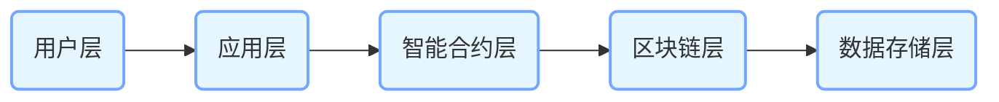

# 如何评估企业的区块链投票系统应用

> 关键词：企业、区块链投票系统、评估、应用价值、安全性

> 摘要：本文旨在深入探讨如何评估企业的区块链投票系统应用。首先介绍了评估该系统的背景，包括目的、预期读者等内容。接着阐述了区块链投票系统的核心概念与联系，详细讲解了其核心算法原理及具体操作步骤，并通过数学模型和公式进行理论支撑。在项目实战部分，给出代码实际案例并进行详细解释。同时，分析了该系统的实际应用场景，推荐了相关的工具和资源。最后总结了其未来发展趋势与挑战，还提供了常见问题与解答以及扩展阅读和参考资料，为企业全面评估区块链投票系统应用提供了全面且深入的指导。

## 1. 背景介绍 
### 1.1 目的和范围
企业引入区块链投票系统的目的多样，如提升投票的公正性、透明度和安全性，提高投票效率，降低成本等。评估企业的区块链投票系统应用的目的在于全面了解该系统是否能够满足企业的实际需求，是否在各个方面都表现良好，从而为企业的决策提供依据。评估的范围涵盖了系统的功能、性能、安全性、成本效益、用户体验等多个维度。

### 1.2 预期读者
本文的预期读者包括企业的管理者，他们需要依据评估结果做出关于是否采用或继续使用区块链投票系统的决策；技术人员，他们可以从技术层面深入了解系统的原理和实现方式，以便进行优化和改进；以及对区块链投票系统感兴趣的研究人员，他们可以通过本文获取全面的信息，进行相关的学术研究。

### 1.3 文档结构概述
本文首先介绍背景信息，让读者了解评估的目的和范围等内容。接着阐述区块链投票系统的核心概念与联系，使读者对系统有基本的认识。然后详细讲解核心算法原理和具体操作步骤，通过数学模型和公式进行理论分析。项目实战部分给出实际代码案例并进行解读。之后分析实际应用场景，推荐相关工具和资源。最后总结未来发展趋势与挑战，提供常见问题与解答以及扩展阅读和参考资料。

### 1.4 术语表
#### 1.4.1 核心术语定义
- **区块链**：一种去中心化的分布式账本技术，通过密码学方法保证数据的不可篡改和可追溯性。
- **智能合约**：一种自动执行的合约，其条款以代码的形式存储在区块链上，当满足预设条件时自动执行。
- **共识机制**：区块链网络中节点达成一致的算法，确保数据的一致性和安全性。
- **哈希函数**：一种将任意长度的输入转换为固定长度输出的函数，具有单向性和唯一性。

#### 1.4.2 相关概念解释
- **去中心化**：在区块链投票系统中，去中心化意味着没有单一的控制中心，所有节点都具有平等的地位，共同维护系统的运行，避免了单点故障和中心化机构的操控。
- **不可篡改**：由于区块链采用哈希函数和链式结构，一旦数据被记录在区块链上，就很难被修改，保证了投票数据的真实性和完整性。
- **匿名性**：在区块链投票系统中，投票者的身份可以通过加密技术进行保护，使得投票行为具有一定的匿名性，保护了投票者的隐私。

#### 1.4.3 缩略词列表
- **PoW**：Proof of Work，工作量证明，一种常见的共识机制。
- **PoS**：Proof of Stake，权益证明，另一种共识机制。
- **DApp**：Decentralized Application，去中心化应用。

## 2. 核心概念与联系 

### 核心概念原理
区块链投票系统的核心原理基于区块链的特性，即去中心化、不可篡改和可追溯性。在该系统中，投票信息被记录在区块链上的一个个区块中，每个区块包含前一个区块的哈希值，形成一个链式结构。当有新的投票产生时，节点通过共识机制验证投票的有效性，并将其添加到区块链中。智能合约则用于定义投票的规则和流程，确保投票按照预设的条件进行。

### 架构的文本示意图
区块链投票系统的架构主要包括用户层、应用层、智能合约层、区块链层和数据存储层。
- 用户层：包括投票者和管理员，投票者通过客户端进行投票，管理员进行系统的管理和维护。
- 应用层：提供用户界面和交互功能，如投票界面、结果查询界面等。
- 智能合约层：定义投票的规则和流程，如投票的开始和结束时间、投票的资格条件等。
- 区块链层：负责记录投票信息，通过共识机制保证数据的一致性和安全性。
- 数据存储层：存储区块链数据和相关的元数据。

### Mermaid 流程图


## 3. 核心算法原理 & 具体操作步骤 

### 核心算法原理
区块链投票系统中常用的算法包括哈希算法、签名算法和共识算法。

#### 哈希算法
哈希算法用于生成数据的哈希值，保证数据的完整性。常见的哈希算法有 SHA-256 等。以下是一个使用 Python 实现的简单哈希示例：
```python
import hashlib

def calculate_hash(data):
    data = str(data).encode('utf-8')
    hash_object = hashlib.sha256(data)
    return hash_object.hexdigest()

# 示例数据
data = "Hello, World!"
hash_value = calculate_hash(data)
print(f"Hash value: {hash_value}")
```
#### 签名算法
签名算法用于对投票信息进行签名，保证投票的真实性和不可抵赖性。常见的签名算法有 ECDSA（椭圆曲线数字签名算法）。以下是一个使用 Python 的 `ecdsa` 库实现的简单签名示例：
```python
from ecdsa import SigningKey, NIST256p

# 生成私钥
private_key = SigningKey.generate(curve=NIST256p)
# 从私钥导出公钥
public_key = private_key.get_verifying_key()

# 示例消息
message = b"Hello, World!"

# 签名消息
signature = private_key.sign(message)

# 验证签名
is_valid = public_key.verify(signature, message)
print(f"Signature is valid: {is_valid}")
```
#### 共识算法
共识算法用于确保区块链网络中节点的一致性。以工作量证明（PoW）为例，以下是一个简化的 Python 实现：
```python
import hashlib
import time

class Block:
    def __init__(self, index, previous_hash, data):
        self.index = index
        self.previous_hash = previous_hash
        self.data = data
        self.timestamp = time.time()
        self.nonce = 0
        self.hash = self.calculate_hash()

    def calculate_hash(self):
        block_string = f"{self.index}{self.previous_hash}{self.data}{self.timestamp}{self.nonce}"
        return hashlib.sha256(block_string.encode('utf-8')).hexdigest()

    def mine_block(self, difficulty):
        target = "0" * difficulty
        while self.hash[:difficulty] != target:
            self.nonce += 1
            self.hash = self.calculate_hash()
        print(f"Block mined: {self.hash}")

# 示例区块链
blockchain = []
genesis_block = Block(0, "0", "Genesis Block")
blockchain.append(genesis_block)

# 难度级别
difficulty = 4

# 挖掘新块
new_block = Block(1, genesis_block.hash, "New Block")
new_block.mine_block(difficulty)
blockchain.append(new_block)
```
### 具体操作步骤
1. **用户注册**：投票者和管理员在系统中进行注册，系统为每个用户生成唯一的身份标识和密钥对。
2. **投票规则设置**：管理员通过智能合约设置投票的规则，如投票的开始和结束时间、投票的选项等。
3. **投票过程**：投票者使用自己的私钥对投票信息进行签名，然后将签名后的投票信息发送到区块链网络。
4. **共识验证**：区块链网络中的节点通过共识机制验证投票信息的有效性，如投票者的身份是否合法、投票是否在规定时间内等。
5. **投票记录**：验证通过的投票信息被记录在区块链上，形成一个新的区块。
6. **结果统计**：在投票结束后，系统根据区块链上的投票记录进行结果统计，并公布投票结果。

## 4. 数学模型和公式 & 详细讲解 & 举例说明 

### 哈希函数的数学模型
哈希函数可以表示为一个映射 $H: M \to D$，其中 $M$ 是输入消息的集合，$D$ 是固定长度的哈希值集合。对于任意的 $m_1, m_2 \in M$，如果 $m_1 \neq m_2$，则 $H(m_1) \neq H(m_2)$ 的概率非常高。

例如，对于 SHA-256 哈希函数，输入消息可以是任意长度的二进制字符串，输出是 256 位的哈希值。

### 签名算法的数学模型
签名算法基于椭圆曲线密码学。设 $G$ 是椭圆曲线上的一个基点，$d$ 是私钥，$Q = dG$ 是公钥。对于消息 $m$，签名过程可以表示为：
1. 计算消息的哈希值 $h = H(m)$。
2. 选择一个随机数 $k$，计算 $R = kG$，其中 $R = (x_R, y_R)$。
3. 计算 $r = x_R \bmod n$，其中 $n$ 是椭圆曲线的阶。
4. 计算 $s = k^{-1}(h + rd) \bmod n$。
签名为 $(r, s)$。

验证过程可以表示为：
1. 计算消息的哈希值 $h = H(m)$。
2. 计算 $u_1 = h s^{-1} \bmod n$ 和 $u_2 = r s^{-1} \bmod n$。
3. 计算 $P = u_1G + u_2Q$，其中 $P = (x_P, y_P)$。
4. 计算 $v = x_P \bmod n$。
如果 $v = r$，则签名有效。

### 工作量证明的数学模型
工作量证明的目标是找到一个满足特定条件的随机数（nonce）。设 $H$ 是哈希函数，$B$ 是区块的信息（包括前一个区块的哈希值、交易信息等），$D$ 是难度目标。矿工需要找到一个 nonce，使得 $H(B \| nonce) < D$。

例如，在比特币中，难度目标 $D$ 是一个 256 位的数值，前导零的数量越多，难度越高。矿工通过不断尝试不同的 nonce 值，直到找到满足条件的哈希值。

## 5. 项目实战：代码实际案例和详细解释说明 

### 5.1  开发环境搭建
1. **安装 Python**：确保系统中安装了 Python 3.x 版本。
2. **安装相关库**：使用 `pip` 安装所需的库，如 `hashlib`、`ecdsa` 等。
```sh
pip install ecdsa
```
3. **选择开发工具**：可以使用 PyCharm、VS Code 等集成开发环境。

### 5.2  源代码详细实现和代码解读
以下是一个简单的区块链投票系统的 Python 实现：
```python
import hashlib
import time
from ecdsa import SigningKey, NIST256p

class Block:
    def __init__(self, index, previous_hash, data):
        self.index = index
        self.previous_hash = previous_hash
        self.data = data
        self.timestamp = time.time()
        self.nonce = 0
        self.hash = self.calculate_hash()

    def calculate_hash(self):
        block_string = f"{self.index}{self.previous_hash}{self.data}{self.timestamp}{self.nonce}"
        return hashlib.sha256(block_string.encode('utf-8')).hexdigest()

    def mine_block(self, difficulty):
        target = "0" * difficulty
        while self.hash[:difficulty] != target:
            self.nonce += 1
            self.hash = self.calculate_hash()
        print(f"Block mined: {self.hash}")

class Blockchain:
    def __init__(self):
        self.chain = [self.create_genesis_block()]
        self.difficulty = 4

    def create_genesis_block(self):
        return Block(0, "0", "Genesis Block")

    def get_latest_block(self):
        return self.chain[-1]

    def add_block(self, new_block):
        new_block.previous_hash = self.get_latest_block().hash
        new_block.mine_block(self.difficulty)
        self.chain.append(new_block)

class VotingSystem:
    def __init__(self):
        self.blockchain = Blockchain()
        self.voters = {}
        self.candidates = []

    def register_voter(self, voter_id):
        private_key = SigningKey.generate(curve=NIST256p)
        public_key = private_key.get_verifying_key()
        self.voters[voter_id] = (private_key, public_key)
        print(f"Voter {voter_id} registered successfully.")

    def add_candidate(self, candidate_name):
        self.candidates.append(candidate_name)
        print(f"Candidate {candidate_name} added successfully.")

    def vote(self, voter_id, candidate_name):
        if voter_id not in self.voters:
            print("Voter not registered.")
            return
        private_key, public_key = self.voters[voter_id]
        if candidate_name not in self.candidates:
            print("Invalid candidate.")
            return
        vote_data = f"{voter_id} voted for {candidate_name}"
        signature = private_key.sign(vote_data.encode('utf-8'))
        is_valid = public_key.verify(signature, vote_data.encode('utf-8'))
        if is_valid:
            new_block = Block(len(self.blockchain.chain), self.blockchain.get_latest_block().hash, vote_data)
            self.blockchain.add_block(new_block)
            print("Vote cast successfully.")
        else:
            print("Invalid signature.")

    def get_vote_results(self):
        results = {candidate: 0 for candidate in self.candidates}
        for block in self.blockchain.chain[1:]:
            vote_data = block.data
            parts = vote_data.split(" voted for ")
            if len(parts) == 2:
                candidate = parts[1]
                if candidate in results:
                    results[candidate] += 1
        return results

# 示例使用
voting_system = VotingSystem()

# 注册投票者
voting_system.register_voter("voter1")
voting_system.register_voter("voter2")

# 添加候选人
voting_system.add_candidate("Candidate A")
voting_system.add_candidate("Candidate B")

# 投票
voting_system.vote("voter1", "Candidate A")
voting_system.vote("voter2", "Candidate B")

# 获取投票结果
results = voting_system.get_vote_results()
print("Vote results:")
for candidate, votes in results.items():
    print(f"{candidate}: {votes} votes")
```
### 5.3  代码解读与分析
- **Block 类**：表示区块链中的一个区块，包含区块的索引、前一个区块的哈希值、数据、时间戳、随机数和哈希值。`calculate_hash` 方法用于计算区块的哈希值，`mine_block` 方法用于挖掘区块。
- **Blockchain 类**：表示区块链，包含一个区块列表和难度级别。`create_genesis_block` 方法用于创建创世区块，`add_block` 方法用于添加新的区块。
- **VotingSystem 类**：表示投票系统，包含一个区块链、投票者列表和候选人列表。`register_voter` 方法用于注册投票者，`add_candidate` 方法用于添加候选人，`vote` 方法用于处理投票，`get_vote_results` 方法用于获取投票结果。

## 6. 实际应用场景 
### 企业内部决策
企业在进行重要决策时，如选举董事会成员、决定重大投资项目等，可以使用区块链投票系统。通过区块链的不可篡改和可追溯性，保证投票的公正性和透明度，提高决策的可信度。

### 股东投票
在上市公司中，股东投票是一项重要的活动。使用区块链投票系统可以提高投票的效率，减少中间环节，降低成本，同时保证股东的投票权得到充分尊重。

### 行业协会选举
行业协会在选举理事、会长等职务时，可以采用区块链投票系统。这样可以确保选举的公平、公正、公开，增强会员对协会的信任。

### 公益组织投票
公益组织在进行项目决策、资金分配等投票时，使用区块链投票系统可以提高透明度，让捐赠者和参与者更加放心。

## 7. 工具和资源推荐
### 7.1 学习资源推荐
#### 7.1.1 书籍推荐
- 《区块链：技术驱动金融》：全面介绍了区块链的技术原理和应用场景，是学习区块链的经典书籍。
- 《精通以太坊》：深入讲解了以太坊的技术细节和智能合约开发，对于想深入了解区块链应用开发的读者非常有帮助。

#### 7.1.2 在线课程
- Coursera 上的“区块链基础”课程：由知名教授授课，系统地介绍了区块链的基本概念和技术。
- edX 上的“区块链技术与应用”课程：提供了丰富的案例和实践项目，帮助学习者更好地掌握区块链技术。

#### 7.1.3 技术博客和网站
- Medium 上的区块链相关博客：有很多行业专家分享的最新技术和观点。
- 巴比特：国内知名的区块链资讯平台，提供了大量的技术文章和行业动态。

### 7.2 开发工具框架推荐
#### 7.2.1 IDE和编辑器
- PyCharm：功能强大的 Python 集成开发环境，适合开发区块链投票系统的 Python 代码。
- Visual Studio Code：轻量级的代码编辑器，支持多种编程语言和插件，方便进行代码开发和调试。

#### 7.2.2 调试和性能分析工具
- Ganache：以太坊的本地开发环境，用于调试和测试智能合约。
- Remix：在线的智能合约开发和调试工具，方便快速验证智能合约的正确性。

#### 7.2.3 相关框架和库
- Web3.py：Python 语言的以太坊开发库，用于与以太坊网络进行交互。
- Solidity：以太坊智能合约开发语言，用于编写智能合约。

### 7.3 相关论文著作推荐
#### 7.3.1 经典论文
- Nakamoto, S. (2008). Bitcoin: A Peer-to-Peer Electronic Cash System. 这是比特币的白皮书，奠定了区块链技术的基础。
- Buterin, V. (2013). Ethereum: A Next-Generation Smart Contract and Decentralized Application Platform. 以太坊的白皮书，介绍了以太坊的设计理念和技术架构。

#### 7.3.2 最新研究成果
- 可以关注 IEEE、ACM 等学术会议和期刊上发表的关于区块链的最新研究论文，了解行业的前沿动态。

#### 7.3.3 应用案例分析
- 可以参考一些企业和机构发布的区块链投票系统应用案例，学习他们的实践经验和成功做法。

## 8. 总结：未来发展趋势与挑战
### 未来发展趋势
- **应用场景拓展**：区块链投票系统将在更多领域得到应用，如政府选举、国际组织决策等，其应用范围将不断扩大。
- **技术创新**：随着区块链技术的不断发展，共识机制、智能合约等技术将不断创新，提高区块链投票系统的性能和安全性。
- **与其他技术融合**：区块链投票系统将与人工智能、大数据等技术融合，实现更加智能化和高效的投票管理。

### 挑战
- **法律和监管**：区块链投票系统的应用涉及到法律和监管问题，如投票的合法性、隐私保护等，需要建立相应的法律法规和监管机制。
- **性能问题**：目前区块链技术的性能还存在一定的局限性，如交易处理速度慢、存储成本高等，需要进一步优化技术，提高系统的性能。
- **用户接受度**：部分用户对区块链技术还存在一定的疑虑和不信任，需要加强宣传和教育，提高用户的接受度。

## 9. 附录：常见问题与解答
### 1. 区块链投票系统如何保证投票的安全性？
区块链投票系统通过哈希算法、签名算法和共识机制等技术保证投票的安全性。哈希算法保证数据的完整性，签名算法保证投票的真实性和不可抵赖性，共识机制确保数据的一致性和安全性。

### 2. 区块链投票系统可以匿名投票吗？
可以，区块链投票系统可以通过加密技术对投票者的身份进行保护，实现一定程度的匿名投票。但在实际应用中，需要根据具体情况平衡匿名性和投票的合法性。

### 3. 区块链投票系统的性能如何？
目前区块链投票系统的性能还存在一定的局限性，如交易处理速度慢、存储成本高等。但随着技术的不断发展，性能将不断提高。

### 4. 区块链投票系统的成本高吗？
区块链投票系统的成本包括硬件成本、软件成本和运维成本等。与传统投票系统相比，初期的投入可能会高一些，但从长期来看，由于减少了中间环节和人工成本，总成本可能会降低。

## 10. 扩展阅读 & 参考资料
### 扩展阅读
- 可以阅读一些关于分布式系统、密码学等方面的书籍和文章，深入了解区块链投票系统的技术基础。
- 关注区块链行业的最新动态和研究成果，了解行业的发展趋势。

### 参考资料
- 相关的学术论文、技术报告和行业标准。
- 区块链技术的官方文档和开源代码库。
- 企业和机构发布的区块链投票系统应用案例和白皮书。