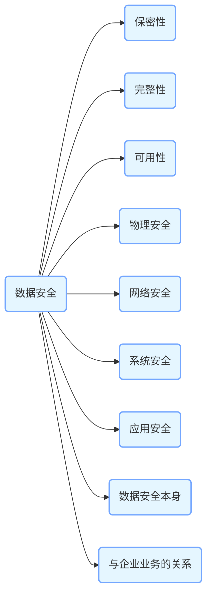

# 如何评估企业的数据安全能力

> 关键词：企业数据安全、安全能力评估、评估方法、数据安全策略、安全技术措施

> 摘要：在数字化时代，数据已成为企业的核心资产之一，数据安全至关重要。本文旨在全面探讨如何评估企业的数据安全能力。首先介绍评估的背景信息，包括目的、预期读者等；接着阐述数据安全的核心概念与联系；然后详细讲解评估过程中涉及的核心算法原理、数学模型和公式；通过项目实战展示具体的代码实现与解读；分析实际应用场景；推荐相关的工具和资源；最后总结未来发展趋势与挑战，并提供常见问题解答及参考资料，为企业评估自身数据安全能力提供全面且深入的指导。

## 1. 背景介绍 
### 1.1 目的和范围
在当今数字化浪潮下，企业面临着日益严峻的数据安全挑战。黑客攻击、数据泄露等事件频发，给企业带来了巨大的损失，包括经济损失、声誉损害等。评估企业的数据安全能力的目的在于全面了解企业数据安全的现状，发现潜在的安全风险和漏洞，为企业制定有效的数据安全策略提供依据，确保企业数据的保密性、完整性和可用性。

本评估的范围涵盖企业数据的整个生命周期，包括数据的产生、存储、传输、使用和销毁等各个环节。同时，也涉及企业的人员、流程和技术等多个层面，包括员工的安全意识、数据安全管理制度、安全技术措施等。

### 1.2 预期读者
本文的预期读者主要包括企业的高层管理人员，他们需要从战略层面了解企业的数据安全状况，以便做出正确的决策；企业的信息安全管理人员，他们负责具体的数据安全管理工作，需要掌握详细的评估方法和技术；以及对数据安全感兴趣的技术人员和研究人员，他们可以从本文中获取相关的理论和实践知识。

### 1.3 文档结构概述
本文将按照以下结构进行阐述：首先介绍数据安全评估的背景信息，让读者了解评估的目的、范围和预期读者等；接着讲解数据安全的核心概念与联系，包括数据安全的定义、关键要素以及它们之间的关系；然后详细阐述评估过程中涉及的核心算法原理和具体操作步骤，并用Python源代码进行说明；介绍相关的数学模型和公式，并举例说明；通过项目实战展示具体的代码实现和详细解释；分析数据安全评估在不同场景下的实际应用；推荐相关的学习资源、开发工具框架和论文著作；最后总结未来发展趋势与挑战，提供常见问题解答和参考资料。

### 1.4 术语表
#### 1.4.1 核心术语定义
- **数据安全**：指采取一系列措施保护数据免受未经授权的访问、使用、披露、破坏、更改或泄露，确保数据的保密性、完整性和可用性。
- **风险评估**：对企业面临的数据安全风险进行识别、分析和评估的过程，以确定风险的可能性和影响程度。
- **漏洞扫描**：使用专门的工具对企业的信息系统进行扫描，发现其中存在的安全漏洞。
- **访问控制**：对用户访问数据的权限进行管理和控制，确保只有授权用户能够访问相应的数据。

#### 1.4.2 相关概念解释
- **保密性**：确保数据只能被授权的人员访问，防止数据泄露给未授权的第三方。
- **完整性**：保证数据在存储和传输过程中不被篡改或损坏，数据的内容和结构保持完整。
- **可用性**：确保数据在需要时能够被授权用户正常访问和使用，不受系统故障、网络中断等因素的影响。

#### 1.4.3 缩略词列表
- **CIA**：Confidentiality（保密性）、Integrity（完整性）、Availability（可用性）的缩写，是数据安全的三个核心要素。
- **OWASP**：Open Web Application Security Project（开放 Web 应用安全项目）的缩写，是一个致力于提高 Web 应用程序安全性的开源组织。
- **NIST**：National Institute of Standards and Technology（美国国家标准与技术研究院）的缩写，发布了一系列的数据安全标准和指南。

## 2. 核心概念与联系 
数据安全是一个复杂的系统工程，涉及多个核心概念，这些概念相互关联、相互影响，共同构成了企业数据安全的整体框架。

### 数据安全的关键要素
数据安全的关键要素包括保密性、完整性和可用性，通常被称为 CIA 三元组。这三个要素是数据安全的核心目标，任何一个要素受到破坏都可能导致数据安全事件的发生。

保密性确保数据的隐私性，防止数据泄露给未授权的人员。例如，企业的客户信息、商业机密等敏感数据需要采取加密等措施来保护其保密性。

完整性保证数据的准确性和一致性，防止数据被篡改或损坏。例如，在数据传输过程中，使用数字签名等技术来验证数据的完整性。

可用性确保数据在需要时能够被授权用户正常访问和使用。例如，企业需要建立备份和恢复机制，以应对系统故障、自然灾害等情况，保证数据的可用性。

### 数据安全的层次结构
数据安全可以分为不同的层次，包括物理安全、网络安全、系统安全、应用安全和数据安全本身。这些层次相互关联，共同构成了企业数据安全的防护体系。

物理安全是数据安全的基础，包括对数据中心、服务器等硬件设备的保护，防止设备被盗、损坏或遭受自然灾害等。

网络安全主要涉及对网络边界的保护，防止外部网络攻击和非法访问。例如，使用防火墙、入侵检测系统等技术来保护网络安全。

系统安全是指对操作系统、数据库等软件系统的安全防护，防止系统漏洞被利用，确保系统的稳定性和安全性。

应用安全是指对企业的各种应用程序的安全保护，防止应用程序存在安全漏洞，导致数据泄露或被篡改。

数据安全本身则是指对数据的加密、访问控制、备份恢复等具体措施，直接保护数据的保密性、完整性和可用性。

### 数据安全与企业业务的关系
数据安全与企业的业务密切相关，数据安全的好坏直接影响企业的业务运营和发展。一方面，企业的业务活动离不开数据的支持，例如客户信息、订单数据等，如果这些数据出现安全问题，可能导致业务中断、客户流失等后果。另一方面，企业的业务需求也会影响数据安全策略的制定，例如不同行业的企业对数据安全的要求可能不同，金融行业对数据安全的要求通常更高。

### 文本示意图
```plaintext
数据安全
|-- 保密性
|-- 完整性
|-- 可用性
|
|-- 物理安全
|-- 网络安全
|-- 系统安全
|-- 应用安全
|-- 数据安全本身
|
|-- 与企业业务的关系
```

### Mermaid 流程图


## 3. 核心算法原理 & 具体操作步骤 
### 风险评估算法原理
风险评估是评估企业数据安全能力的重要环节，其核心算法原理是通过对风险的可能性和影响程度进行量化分析，确定风险的等级。常见的风险评估算法包括定性评估和定量评估两种方法。

#### 定性评估
定性评估是一种相对主观的评估方法，主要通过专家判断和经验来确定风险的可能性和影响程度。通常将风险的可能性和影响程度分为高、中、低三个等级，然后根据这两个等级的组合来确定风险的等级。

#### 定量评估
定量评估是一种更加客观的评估方法，通过对风险的可能性和影响程度进行量化分析，计算出风险的数值。常见的定量评估方法包括故障树分析、事件树分析等。

### Python 代码实现风险评估
以下是一个简单的 Python 代码示例，用于实现风险的定性评估：

```python
# 定义风险可能性和影响程度的等级
possibility_levels = ['低', '中', '高']
impact_levels = ['低', '中', '高']

# 定义风险等级矩阵
risk_matrix = {
    ('低', '低'): '低',
    ('低', '中'): '低',
    ('低', '高'): '中',
    ('中', '低'): '低',
    ('中', '中'): '中',
    ('中', '高'): '高',
    ('高', '低'): '中',
    ('高', '中'): '高',
    ('高', '高'): '高'
}

# 定义风险评估函数
def risk_assessment(possibility, impact):
    if possibility not in possibility_levels or impact not in impact_levels:
        raise ValueError("可能性或影响程度等级输入错误")
    return risk_matrix[(possibility, impact)]

# 示例使用
possibility = '中'
impact = '高'
risk_level = risk_assessment(possibility, impact)
print(f"风险等级: {risk_level}")
```

### 具体操作步骤
#### 风险识别
首先需要对企业的数据资产进行梳理，确定需要保护的数据资产清单。然后分析这些数据资产可能面临的威胁和漏洞，例如黑客攻击、数据泄露、系统故障等。

#### 风险分析
对于识别出的风险，需要对其可能性和影响程度进行评估。可以采用定性评估或定量评估的方法，根据企业的实际情况选择合适的评估方法。

#### 风险评估
根据风险分析的结果，确定风险的等级。对于高风险的事件，需要采取相应的措施进行处理，例如加强安全防护、制定应急预案等。

#### 风险处理
根据风险评估的结果，制定相应的风险处理策略。常见的风险处理策略包括风险规避、风险减轻、风险转移和风险接受等。

#### 风险监控
对风险处理措施的执行情况进行监控，确保风险得到有效控制。同时，定期对企业的数据安全状况进行评估，及时发现新的风险和问题。

## 4. 数学模型和公式 & 详细讲解 & 举例说明 
### 风险评估的数学模型
在定量风险评估中，常用的数学模型是风险值（Risk Value，RV）的计算模型。风险值是风险可能性（Probability，P）和风险影响程度（Impact，I）的乘积，即：

$$RV = P \times I$$

其中，风险可能性 $P$ 表示风险发生的概率，取值范围通常为 $[0, 1]$；风险影响程度 $I$ 表示风险发生后可能造成的损失，通常可以用货币价值、业务影响程度等指标来衡量。

### 详细讲解
风险可能性 $P$ 的确定可以通过历史数据统计、专家判断等方法来进行。例如，根据过去一段时间内企业遭受黑客攻击的次数和频率，计算出黑客攻击发生的概率。

风险影响程度 $I$ 的确定需要考虑多个因素，例如数据泄露可能导致的经济损失、声誉损害、法律责任等。可以通过对这些因素进行量化分析，确定风险影响程度的具体数值。

### 举例说明
假设某企业面临数据泄露的风险，经过分析，数据泄露发生的概率 $P = 0.2$，数据泄露可能造成的经济损失为 100 万元，声誉损害等其他损失折合为 50 万元，因此风险影响程度 $I = 150$ 万元。则数据泄露的风险值为：

$$RV = P \times I = 0.2 \times 150 = 30 \text{（万元）}$$

根据风险值的大小，可以对不同的风险进行排序，优先处理风险值较高的风险。

## 5. 项目实战：代码实际案例和详细解释说明 
### 5.1  开发环境搭建
本项目实战将使用 Python 语言进行开发，需要安装以下开发环境：

- **Python**：建议安装 Python 3.7 及以上版本。可以从 Python 官方网站（https://www.python.org/downloads/） 下载并安装。
- **开发工具**：可以使用 PyCharm、VS Code 等集成开发环境（IDE），也可以使用简单的文本编辑器，如 Sublime Text、Notepad++ 等。

### 5.2  源代码详细实现和代码解读
以下是一个完整的 Python 代码示例，用于实现一个简单的数据安全评估系统，包括风险识别、风险分析、风险评估和风险处理等功能。

```python
# 定义数据资产清单
data_assets = {
    "客户信息": {
        "价值": 100000,  # 数据资产的价值，单位：元
        "威胁": ["黑客攻击", "内部人员泄露"],
        "漏洞": ["系统存在安全漏洞", "访问控制不完善"]
    },
    "商业机密": {
        "价值": 500000,
        "威胁": ["竞争对手窃取", "数据泄露"],
        "漏洞": ["加密措施不足", "备份策略不完善"]
    }
}

# 定义风险可能性和影响程度的等级及对应的数值
possibility_levels = {
    "低": 0.1,
    "中": 0.3,
    "高": 0.6
}

impact_levels = {
    "低": 0.1,
    "中": 0.3,
    "高": 0.6
}

# 定义风险等级矩阵
risk_matrix = {
    (0.1, 0.1): "低",
    (0.1, 0.3): "低",
    (0.1, 0.6): "中",
    (0.3, 0.1): "低",
    (0.3, 0.3): "中",
    (0.3, 0.6): "高",
    (0.6, 0.1): "中",
    (0.6, 0.3): "高",
    (0.6, 0.6): "高"
}

# 风险识别函数
def risk_identification():
    risks = []
    for asset, info in data_assets.items():
        for threat in info["威胁"]:
            for vulnerability in info["漏洞"]:
                risk = {
                    "资产": asset,
                    "威胁": threat,
                    "漏洞": vulnerability
                }
                risks.append(risk)
    return risks

# 风险分析函数
def risk_analysis(risks):
    analyzed_risks = []
    for risk in risks:
        asset_value = data_assets[risk["资产"]]["价值"]
        # 假设根据经验确定风险可能性和影响程度
        possibility = possibility_levels["中"]
        impact = impact_levels["高"]
        risk_value = possibility * impact * asset_value
        risk["可能性"] = possibility
        risk["影响程度"] = impact
        risk["风险值"] = risk_value
        analyzed_risks.append(risk)
    return analyzed_risks

# 风险评估函数
def risk_assessment(analyzed_risks):
    assessed_risks = []
    for risk in analyzed_risks:
        risk_level = risk_matrix[(risk["可能性"], risk["影响程度"])]
        risk["风险等级"] = risk_level
        assessed_risks.append(risk)
    return assessed_risks

# 风险处理函数
def risk_treatment(assessed_risks):
    treatments = []
    for risk in assessed_risks:
        if risk["风险等级"] == "高":
            treatment = f"针对 {risk['资产']} 的 {risk['威胁']} 威胁和 {risk['漏洞']} 漏洞，采取加强安全防护、完善访问控制等措施"
        elif risk["风险等级"] == "中":
            treatment = f"针对 {risk['资产']} 的 {risk['威胁']} 威胁和 {risk['漏洞']} 漏洞，采取一定的安全措施，如加密数据、定期备份等"
        else:
            treatment = f"针对 {risk['资产']} 的 {risk['威胁']} 威胁和 {risk['漏洞']} 漏洞，进行定期监控"
        treatments.append(treatment)
    return treatments

# 主函数
def main():
    # 风险识别
    risks = risk_identification()
    # 风险分析
    analyzed_risks = risk_analysis(risks)
    # 风险评估
    assessed_risks = risk_assessment(analyzed_risks)
    # 风险处理
    treatments = risk_treatment(assessed_risks)

    # 输出结果
    print("风险识别结果：")
    for risk in risks:
        print(risk)

    print("\n风险分析结果：")
    for risk in analyzed_risks:
        print(risk)

    print("\n风险评估结果：")
    for risk in assessed_risks:
        print(risk)

    print("\n风险处理建议：")
    for treatment in treatments:
        print(treatment)

if __name__ == "__main__":
    main()
```

### 5.3  代码解读与分析
#### 风险识别函数 `risk_identification`
该函数通过遍历数据资产清单，找出每个数据资产可能面临的威胁和漏洞的组合，生成风险列表。

#### 风险分析函数 `risk_analysis`
该函数对识别出的风险进行分析，根据数据资产的价值、风险可能性和影响程度，计算出风险值。

#### 风险评估函数 `risk_assessment`
该函数根据风险可能性和影响程度的组合，通过风险等级矩阵确定风险的等级。

#### 风险处理函数 `risk_treatment`
该函数根据风险等级，给出相应的风险处理建议。对于高风险的事件，采取加强安全防护等措施；对于中风险的事件，采取一定的安全措施；对于低风险的事件，进行定期监控。

#### 主函数 `main`
该函数依次调用风险识别、风险分析、风险评估和风险处理函数，并输出相应的结果。

## 6. 实际应用场景 
### 金融行业
在金融行业，数据安全至关重要。银行、证券、保险等金融机构拥有大量的客户信息、交易数据等敏感信息，如果这些数据泄露，可能导致客户资金损失、声誉损害等严重后果。因此，金融机构需要定期对自身的数据安全能力进行评估，确保数据的保密性、完整性和可用性。例如，银行会对其核心业务系统进行漏洞扫描，对客户信息进行加密处理，对员工进行安全培训等，以提高数据安全能力。

### 医疗行业
医疗行业涉及患者的个人健康信息、病历数据等敏感信息，这些信息的安全直接关系到患者的隐私和权益。医院、医疗保险公司等医疗机构需要评估自身的数据安全能力，防止患者信息泄露。例如，医院会对医疗信息系统进行安全加固，对电子病历进行加密存储，对医护人员进行数据安全培训等。

### 电商行业
电商行业拥有大量的用户信息、订单数据等，这些数据是电商企业的核心资产。如果数据泄露，可能导致用户信息被滥用、订单数据被篡改等问题，影响用户的信任和企业的声誉。因此，电商企业需要对自身的数据安全能力进行评估，采取相应的安全措施，如加强网络安全防护、对用户信息进行加密处理等。

### 政府部门
政府部门掌握着大量的公民个人信息、国家机密等敏感信息，数据安全责任重大。政府部门需要定期评估自身的数据安全能力，确保信息系统的安全稳定运行。例如，政府会对政务信息系统进行安全审计，对涉密信息进行严格的访问控制等。

## 7. 工具和资源推荐
### 7.1 学习资源推荐
#### 7.1.1 书籍推荐
- 《数据安全实战》：本书全面介绍了数据安全的理论和实践知识，包括数据安全的基本概念、风险评估、安全技术措施等内容，通过实际案例展示了如何应用数据安全技术解决实际问题。
- 《信息安全技术与实践》：详细讲解了信息安全的各个方面，包括网络安全、系统安全、应用安全等，同时也涉及了数据安全的相关知识，是一本非常实用的信息安全教材。
- 《数据安全治理：体系、方法与实践》：介绍了数据安全治理的理论和方法，通过实际案例展示了如何建立有效的数据安全治理体系，提高企业的数据安全管理水平。

#### 7.1.2 在线课程
- Coursera 上的“Data Security and Privacy”：该课程由知名大学的教授授课，系统地介绍了数据安全和隐私保护的相关知识，包括数据加密、访问控制、安全审计等内容。
- edX 上的“Information Security Fundamentals”：讲解了信息安全的基础知识，包括网络安全、系统安全、数据安全等方面的内容，适合初学者学习。
- 中国大学 MOOC 上的“信息安全技术”：由国内高校的教师授课，结合国内的实际情况，介绍了信息安全的相关理论和技术，包括数据安全的评估和防护等内容。

#### 7.1.3 技术博客和网站
- 安全牛（https://www.aqniu.com/）：专注于信息安全领域，提供最新的安全资讯、技术文章、行业报告等内容，对于了解数据安全的最新动态和技术趋势非常有帮助。
- 嘶吼网（https://www.4hou.com/）：提供丰富的安全技术文章、漏洞分析、安全工具介绍等内容，是安全技术人员学习和交流的重要平台。
- 国家信息安全漏洞库（https://www.cnnvd.org.cn/）：提供权威的信息安全漏洞信息，包括漏洞的描述、影响范围、修复建议等内容，对于企业进行漏洞管理和风险评估非常有帮助。

### 7.2 开发工具框架推荐
#### 7.2.1 IDE和编辑器
- PyCharm：一款专门为 Python 开发设计的集成开发环境，具有强大的代码编辑、调试、代码分析等功能，适合开发数据安全相关的 Python 程序。
- VS Code：一款轻量级的代码编辑器，支持多种编程语言，具有丰富的插件扩展功能，可以方便地进行数据安全相关的开发工作。
- Sublime Text：一款简洁高效的文本编辑器，具有快速打开、语法高亮等功能，适合快速编写和调试代码。

#### 7.2.2 调试和性能分析工具
- PDB：Python 自带的调试工具，可以帮助开发者在代码中设置断点、查看变量值等，方便调试数据安全相关的 Python 程序。
- cProfile：Python 自带的性能分析工具，可以分析 Python 程序的性能瓶颈，帮助开发者优化代码。
- Wireshark：一款网络协议分析工具，可以捕获和分析网络数据包，帮助开发者发现网络安全问题，如数据泄露、网络攻击等。

#### 7.2.3 相关框架和库
- Cryptography：Python 中常用的加密库，提供了丰富的加密算法和工具，如对称加密、非对称加密、哈希算法等，可以帮助开发者实现数据的加密和解密。
- Requests：Python 中常用的 HTTP 库，可以方便地发送 HTTP 请求，实现与网络服务的交互，在数据安全测试和漏洞扫描中经常使用。
- Nmap：一款强大的网络扫描工具，可以扫描网络中的主机和端口，发现网络中的安全漏洞，有 Python 库可以方便地调用 Nmap 进行扫描。

### 7.3 相关论文著作推荐
#### 7.3.1 经典论文
- “A Survey of Privacy-Preserving Data Mining”：该论文对隐私保护数据挖掘的相关技术进行了全面的综述，介绍了各种隐私保护数据挖掘算法和方法，对于了解数据安全和隐私保护的前沿技术非常有帮助。
- “Security Analysis of the Advanced Encryption Standard (AES)”：对高级加密标准（AES）进行了详细的安全分析，介绍了 AES 的加密原理、安全性证明等内容，是研究加密算法的经典论文。
- “An Overview of Access Control Models”：对访问控制模型进行了全面的介绍，包括自主访问控制、强制访问控制、基于角色的访问控制等模型，对于理解访问控制技术非常有帮助。

#### 7.3.2 最新研究成果
- 在 IEEE Security & Privacy、ACM SIGSAC Conference on Computer and Communications Security 等顶级学术会议和期刊上发表的关于数据安全的最新研究成果，这些研究成果反映了数据安全领域的最新技术和趋势。
- 各大高校和科研机构的研究报告和论文，如清华大学、中国科学院等的相关研究成果，对于了解数据安全的前沿技术和应用非常有帮助。

#### 7.3.3 应用案例分析
- 一些知名企业的数据安全实践案例，如谷歌、微软等公司的数据安全策略和措施，通过分析这些案例可以学习到先进的数据安全管理经验和技术应用。
- 行业报告和案例分析，如金融行业、医疗行业等的数据安全案例分析，对于了解不同行业的数据安全需求和解决方案非常有帮助。

## 8. 总结：未来发展趋势与挑战
### 未来发展趋势
#### 智能化和自动化
随着人工智能和机器学习技术的发展，数据安全评估将越来越智能化和自动化。例如，利用机器学习算法可以自动识别数据中的异常模式，发现潜在的安全风险；利用自动化工具可以快速进行漏洞扫描和风险评估，提高评估效率。

#### 零信任架构
零信任架构将成为未来数据安全的重要发展方向。零信任架构的核心思想是“默认不信任，始终验证”，不再信任企业内部网络和外部网络的边界，对任何访问都进行严格的身份验证和授权，确保数据的安全。

#### 隐私计算
隐私计算技术将得到更广泛的应用。隐私计算可以在不泄露数据隐私的前提下，实现数据的分析和利用，满足企业在数据安全和业务发展之间的需求。例如，联邦学习、同态加密等隐私计算技术将在金融、医疗等行业得到广泛应用。

#### 云安全
随着企业数字化转型的加速，越来越多的企业将数据存储和业务系统迁移到云端。因此，云安全将成为未来数据安全的重要领域。云服务提供商需要加强云安全技术的研发和应用，企业也需要加强对云环境下数据安全的管理和控制。

### 挑战
#### 技术更新换代快
数据安全技术不断更新换代，新的安全漏洞和攻击手段不断涌现。企业需要不断学习和掌握新的安全技术，及时更新安全防护措施，以应对不断变化的安全威胁。

#### 数据量增长迅速
随着数字化的发展，企业的数据量呈现出爆炸式增长。大量的数据增加了数据安全管理的难度，企业需要处理海量数据的存储、传输和处理过程中的安全问题，同时也需要提高数据安全评估的效率和准确性。

#### 人才短缺
数据安全领域的专业人才短缺是当前面临的一个重要挑战。数据安全需要既懂技术又懂业务的复合型人才，而目前市场上这类人才相对较少。企业需要加强对数据安全人才的培养和引进，提高企业的数据安全管理水平。

#### 法律法规不断完善
随着数据安全问题的日益突出，各国政府纷纷出台了相关的法律法规，加强对数据安全的监管。企业需要遵守这些法律法规的要求，否则将面临严重的法律责任。因此，企业需要加强对法律法规的学习和研究，确保企业的数据安全管理符合法律法规的要求。

## 9. 附录：常见问题与解答
### 问题 1：如何确定风险的可能性和影响程度？
答：风险的可能性可以通过历史数据统计、专家判断等方法来确定。例如，根据过去一段时间内企业遭受黑客攻击的次数和频率，计算出黑客攻击发生的概率。风险的影响程度需要考虑多个因素，如数据泄露可能导致的经济损失、声誉损害、法律责任等，可以通过对这些因素进行量化分析，确定风险影响程度的具体数值。

### 问题 2：风险评估的频率应该是多久一次？
答：风险评估的频率取决于企业的实际情况，如企业的业务类型、数据资产的重要性、安全环境的变化等。一般来说，对于关键业务系统和重要数据资产，建议每年至少进行一次全面的风险评估；对于安全环境变化较快的企业，可以适当增加评估的频率，如每半年或每季度进行一次评估。

### 问题 3：如何选择合适的数据安全评估工具？
答：选择合适的数据安全评估工具需要考虑多个因素，如工具的功能、性能、易用性、价格等。首先，需要根据企业的需求确定工具的功能，如漏洞扫描、风险评估、安全审计等。其次，需要考虑工具的性能，如扫描速度、准确性等。此外，工具的易用性也很重要，需要选择操作简单、界面友好的工具。最后，还需要考虑工具的价格，选择性价比高的工具。

### 问题 4：数据安全评估与合规性有什么关系？
答：数据安全评估是确保企业合规性的重要手段之一。各国政府和行业组织都出台了相关的法律法规和标准，如 GDPR、HIPAA 等，要求企业保护数据安全和隐私。通过数据安全评估，企业可以发现自身存在的安全问题和漏洞，及时采取措施进行整改，确保企业的数据安全管理符合法律法规和标准的要求，从而避免因违规而面临的法律责任和声誉损失。

## 10. 扩展阅读 & 参考资料
### 扩展阅读
- 《数据安全蓝皮书》：该蓝皮书对数据安全领域的发展现状、趋势和挑战进行了深入分析，提供了丰富的案例和数据，对于进一步了解数据安全行业非常有帮助。
- 《网络空间安全战略研究》：探讨了网络空间安全的战略问题，包括数据安全在国家战略中的地位和作用，对于从宏观层面理解数据安全具有重要意义。
- 《数据隐私保护前沿技术研究》：介绍了数据隐私保护的最新技术和研究成果，如差分隐私、多方安全计算等，对于了解数据安全和隐私保护的前沿技术非常有帮助。

### 参考资料
- NIST Special Publication 800-30: Guide for Conducting Risk Assessments：美国国家标准与技术研究院发布的风险评估指南，提供了详细的风险评估方法和流程。
- ISO/IEC 27001: Information technology - Security techniques - Information security management systems - Requirements：国际标准化组织发布的信息安全管理体系标准，为企业建立和实施信息安全管理体系提供了指导。
- GDPR (General Data Protection Regulation)：欧盟发布的通用数据保护条例，对数据主体的权利和数据控制者、处理者的义务进行了详细规定，是数据安全和隐私保护领域的重要法规。