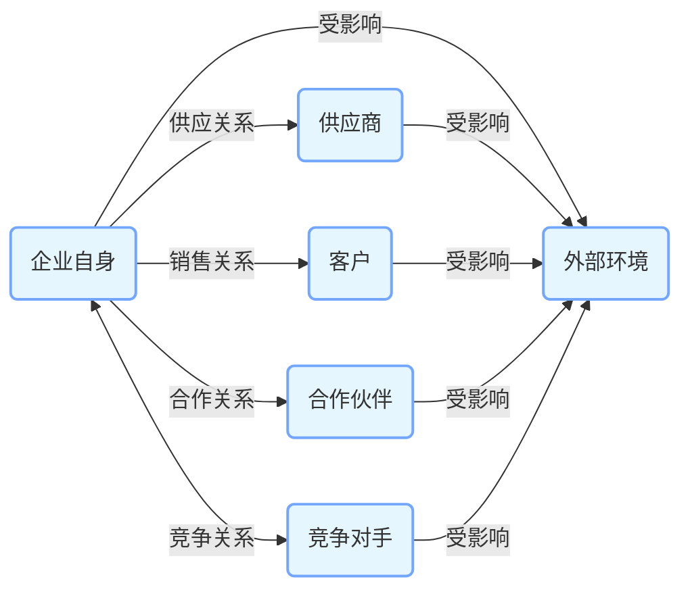

# 如何评估企业的生态系统价值

> 关键词：企业生态系统、价值评估、评估方法、生态系统要素、战略价值

> 摘要：在当今竞争激烈的商业环境中，企业生态系统的价值评估日益重要。本文旨在全面探讨如何评估企业的生态系统价值，深入分析其背景、核心概念、评估算法、数学模型等内容。通过实际案例展示评估过程和方法的应用，介绍生态系统价值评估在不同场景的实际应用，推荐相关的学习资源、开发工具和论文著作。最后总结未来发展趋势与挑战，为企业管理者、投资者及相关研究人员提供全面且深入的参考，助力其更好地理解和评估企业生态系统的价值。

## 1. 背景介绍 
### 1.1 目的和范围
企业生态系统是由企业与其所处环境中的供应商、客户、合作伙伴等利益相关者共同构成的复杂网络。评估企业生态系统价值的目的在于帮助企业管理者清晰了解自身生态系统的优势与劣势，为战略决策提供依据；同时，也为投资者评估企业的长期投资价值提供参考。本文章的范围涵盖企业生态系统价值评估的各个方面，包括概念、方法、应用等。

### 1.2 预期读者
本文预期读者包括企业管理人员、投资者、行业分析师、学术研究人员以及对企业生态系统价值评估感兴趣的相关人士。企业管理人员可以借助本文的方法和思路来优化企业的生态系统战略；投资者可以通过本文的评估方法更准确地判断投资价值；行业分析师可以将本文内容作为分析行业生态系统的参考；学术研究人员可以在本文基础上进行更深入的理论研究。

### 1.3 文档结构概述
本文首先介绍企业生态系统价值评估的背景，包括目的、预期读者和文档结构概述等内容。接着阐述核心概念与联系，分析企业生态系统的构成要素及其相互关系。然后详细讲解核心算法原理和具体操作步骤，通过 Python 代码进行示例。随后介绍数学模型和公式，并举例说明。再通过项目实战展示代码实际案例和详细解释。之后探讨实际应用场景。接着推荐相关的工具和资源，包括学习资源、开发工具框架和相关论文著作。最后总结未来发展趋势与挑战，提供常见问题与解答以及扩展阅读和参考资料。

### 1.4 术语表
#### 1.4.1 核心术语定义
- **企业生态系统**：指企业与其利益相关者（如供应商、客户、合作伙伴、竞争对手等）以及所处的外部环境（如政策、经济、技术等）相互作用、相互影响而形成的一个有机整体。
- **生态系统价值**：企业生态系统为其参与者创造的经济、社会和环境等方面的综合价值。它不仅包括直接的经济收益，还包括品牌影响力、技术创新能力、市场份额拓展等潜在价值。
- **价值评估**：对企业生态系统的价值进行量化或定性分析的过程，旨在确定其价值大小和发展潜力。

#### 1.4.2 相关概念解释
- **利益相关者**：指与企业生态系统有利益关联的个人或组织，他们的行为和决策会影响企业生态系统的运行和发展。
- **协同效应**：企业生态系统中各参与者之间通过合作和互动产生的额外价值，大于各参与者单独行动的价值之和。

#### 1.4.3 缩略词列表
- **ROI**：Return on Investment，投资回报率
- **NPV**：Net Present Value，净现值

## 2. 核心概念与联系 
企业生态系统是一个复杂的网络，由多个要素相互作用构成。其核心要素包括企业自身、供应商、客户、合作伙伴、竞争对手以及外部环境等。这些要素之间存在着复杂的关系，相互影响、相互制约。

### 企业生态系统要素关系示意图


### 核心概念原理
企业生态系统的价值来源于各要素之间的协同作用和互动。企业通过与供应商建立良好的合作关系，可以确保原材料的稳定供应和成本的控制；与客户保持紧密联系，可以了解市场需求，提高客户满意度和忠诚度；与合作伙伴开展合作，可以实现资源共享、优势互补，共同开拓市场；对竞争对手的分析和应对，可以提升企业的竞争力。外部环境则为企业生态系统的发展提供了机遇和挑战，企业需要适应环境的变化，调整自身的战略和运营模式。

## 3. 核心算法原理 & 具体操作步骤 
### 算法原理
评估企业生态系统价值的一种常用方法是综合评价法，该方法通过构建评价指标体系，对企业生态系统的各个方面进行量化评价，然后根据各指标的权重计算综合得分，以此来评估企业生态系统的价值。

### 具体操作步骤
1. **确定评价指标体系**：根据企业生态系统的特点和评估目的，确定一系列相关的评价指标，如市场份额、盈利能力、创新能力、品牌影响力、合作伙伴关系等。
2. **确定指标权重**：采用层次分析法（AHP）等方法确定各指标的权重，以反映各指标在评估中的重要程度。
3. **数据收集**：收集各指标的相关数据，可以通过企业内部报表、市场调研、行业报告等渠道获取。
4. **指标量化**：将各指标的数据进行量化处理，使其具有可比性。
5. **计算综合得分**：根据各指标的量化值和权重，计算企业生态系统的综合得分。

### Python 代码实现
```python
import numpy as np

# 定义评价指标体系
indicators = ['市场份额', '盈利能力', '创新能力', '品牌影响力', '合作伙伴关系']

# 定义指标权重
weights = np.array([0.2, 0.3, 0.2, 0.15, 0.15])

# 收集数据
data = np.array([0.3, 0.2, 0.4, 0.3, 0.35])

# 计算综合得分
score = np.dot(data, weights)

print(f"企业生态系统综合得分: {score}")
```

### 代码解释
- `indicators` 列表定义了评价指标体系。
- `weights` 数组定义了各指标的权重，权重之和为 1。
- `data` 数组存储了各指标的量化数据。
- `np.dot(data, weights)` 计算了各指标数据与权重的点积，得到综合得分。

## 4. 数学模型和公式 & 详细讲解 & 举例说明 
### 数学模型
综合评价法的数学模型可以表示为：

$$V = \sum_{i=1}^{n} w_i x_i$$

其中，$V$ 表示企业生态系统的综合价值得分，$w_i$ 表示第 $i$ 个指标的权重，$x_i$ 表示第 $i$ 个指标的量化值，$n$ 表示指标的数量。

### 详细讲解
该公式的原理是将各指标的量化值乘以其对应的权重，然后将所有乘积相加，得到企业生态系统的综合价值得分。权重的大小反映了各指标在评估中的重要程度，量化值则反映了企业在该指标方面的表现。

### 举例说明
假设企业生态系统的评价指标体系包括市场份额、盈利能力、创新能力三个指标，权重分别为 0.3、0.4、0.3，各指标的量化值分别为 0.4、0.5、0.6。则企业生态系统的综合价值得分计算如下：

$$V = 0.3 \times 0.4 + 0.4 \times 0.5 + 0.3 \times 0.6$$
$$V = 0.12 + 0.2 + 0.18$$
$$V = 0.5$$

这表明该企业生态系统的综合价值得分为 0.5。

## 5. 项目实战：代码实际案例和详细解释说明 
### 5.1  开发环境搭建
- **Python 环境**：确保安装了 Python 3.x 版本。
- **相关库**：安装 `numpy` 库，用于数值计算。可以使用以下命令进行安装：
```sh
pip install numpy
```

### 5.2  源代码详细实现和代码解读
```python
import numpy as np

# 定义评价指标体系
indicators = ['市场份额', '盈利能力', '创新能力', '品牌影响力', '客户满意度']

# 定义指标权重
weights = np.array([0.2, 0.25, 0.2, 0.15, 0.2])

# 模拟数据收集
def collect_data():
    data = []
    for indicator in indicators:
        value = float(input(f"请输入 {indicator} 的量化值 (0-1 之间): "))
        data.append(value)
    return np.array(data)

# 计算综合得分
def calculate_score(data, weights):
    score = np.dot(data, weights)
    return score

# 主程序
if __name__ == "__main__":
    data = collect_data()
    score = calculate_score(data, weights)
    print(f"企业生态系统综合得分: {score}")
```

### 代码解读与分析
- **指标体系和权重**：`indicators` 列表定义了评价指标体系，`weights` 数组定义了各指标的权重。
- **数据收集**：`collect_data` 函数通过用户输入的方式收集各指标的量化值。
- **计算综合得分**：`calculate_score` 函数根据输入的数据和权重计算综合得分。
- **主程序**：在主程序中，调用 `collect_data` 函数收集数据，然后调用 `calculate_score` 函数计算综合得分，并输出结果。

## 6. 实际应用场景 
### 企业战略决策
企业管理者可以通过评估生态系统价值，了解企业在生态系统中的地位和优势，从而制定合理的战略决策。例如，如果发现企业在创新能力方面的得分较低，可以加大研发投入，提升创新能力；如果市场份额得分较高，可以考虑进一步拓展市场，巩固优势。

### 投资决策
投资者在进行投资决策时，可以将企业生态系统价值作为重要参考指标。具有较高生态系统价值的企业通常具有更强的竞争力和发展潜力，投资风险相对较低。例如，投资者可以比较不同企业的生态系统综合得分，选择得分较高的企业进行投资。

### 合作伙伴选择
企业在选择合作伙伴时，可以通过评估合作伙伴的生态系统价值，选择与自身优势互补、生态系统价值较高的合作伙伴。这样可以实现资源共享、协同发展，提升整个生态系统的价值。例如，一家技术型企业可以选择与具有强大市场渠道的企业合作，共同开拓市场。

## 7. 工具和资源推荐
### 7.1 学习资源推荐
#### 7.1.1 书籍推荐
- 《平台战略：正在席卷全球的商业模式革命》：介绍了平台型企业的生态系统构建和价值创造，对理解企业生态系统有很大帮助。
- 《竞争战略》：阐述了企业竞争战略的基本原理和方法，有助于分析企业在生态系统中的竞争地位。
- 《创新者的窘境》：探讨了企业创新的重要性和面临的挑战，对评估企业生态系统的创新能力有参考价值。

#### 7.1.2 在线课程
- Coursera 上的《商业生态系统管理》课程：系统介绍了商业生态系统的概念、理论和实践，由知名教授授课。
- edX 上的《战略管理》课程：讲解了企业战略管理的相关知识，包括生态系统战略。

#### 7.1.3 技术博客和网站
- 36氪：提供大量的商业资讯和行业分析，对了解企业生态系统的发展动态有帮助。
- 虎嗅网：关注新经济、新商业，有很多关于企业生态系统的深度报道和分析文章。

### 7.2 开发工具框架推荐
#### 7.2.1 IDE和编辑器
- PyCharm：一款功能强大的 Python 集成开发环境，适合编写和调试 Python 代码。
- Visual Studio Code：轻量级的代码编辑器，支持多种编程语言，具有丰富的插件扩展功能。

#### 7.2.2 调试和性能分析工具
- pdb：Python 自带的调试工具，可以帮助开发者调试代码，查找问题。
- cProfile：Python 内置的性能分析工具，用于分析代码的性能瓶颈。

#### 7.2.3 相关框架和库
- numpy：用于数值计算，提供高效的数组操作和数学函数。
- pandas：用于数据处理和分析，提供数据结构和数据操作功能。

### 7.3 相关论文著作推荐
#### 7.3.1 经典论文
- Moore, J. F. (1993). Predators and prey: A new ecology of competition. Harvard business review, 71(3), 75-86. 该论文首次提出了企业生态系统的概念，对后续研究产生了深远影响。
- Adner, R., & Kapoor, R. (2010). Value creation in innovation ecosystems: How the structure of technological interdependence affects firm performance in new technology generations. Strategic Management Journal, 31(3), 306-333. 探讨了创新生态系统中价值创造的机制和影响因素。

#### 7.3.2 最新研究成果
- 关注顶级学术期刊如《Strategic Management Journal》《Management Science》等，这些期刊会发表关于企业生态系统的最新研究成果。

#### 7.3.3 应用案例分析
- 一些知名企业的案例研究，如苹果、阿里巴巴、腾讯等企业的生态系统构建和发展案例，可以帮助读者更好地理解企业生态系统价值评估的实际应用。

## 8. 总结：未来发展趋势与挑战
### 未来发展趋势
- **数字化转型加速**：随着信息技术的不断发展，企业生态系统将更加数字化。企业将利用大数据、人工智能等技术实现生态系统的智能化管理和决策，提升生态系统的价值创造能力。
- **跨界融合加剧**：不同行业之间的界限将越来越模糊，企业生态系统将呈现出跨界融合的趋势。企业将与更多不同行业的参与者合作，拓展生态系统的边界，创造更多的价值。
- **可持续发展成为重点**：社会对可持续发展的关注度不断提高，企业生态系统也将更加注重可持续发展。企业将在经济、社会和环境等方面实现平衡发展，提升生态系统的综合价值。

### 挑战
- **数据安全和隐私问题**：数字化转型带来了大量的数据，如何保障数据的安全和隐私是企业面临的重要挑战。一旦数据泄露，将对企业生态系统的信任和价值造成严重影响。
- **复杂的利益协调**：企业生态系统中涉及多个利益相关者，各利益相关者的利益诉求不同，如何协调各方利益，实现生态系统的稳定和可持续发展是一个难题。
- **技术创新压力**：在快速变化的技术环境下，企业需要不断进行技术创新，以保持在生态系统中的竞争力。但技术创新需要大量的资源和投入，且存在失败的风险。

## 9. 附录：常见问题与解答
### 问题 1：如何确定评价指标的权重？
答：可以采用层次分析法（AHP）、德尔菲法等方法确定评价指标的权重。层次分析法通过比较各指标之间的相对重要性，构建判断矩阵，计算出各指标的权重；德尔菲法通过专家咨询的方式，收集专家意见，经过多轮反馈和调整，确定指标权重。

### 问题 2：数据收集过程中如何确保数据的准确性？
答：可以通过多种渠道收集数据，如企业内部报表、市场调研、行业报告等。同时，要对收集到的数据进行审核和验证，确保数据的准确性和可靠性。对于一些关键数据，可以进行多次收集和验证，以减少误差。

### 问题 3：企业生态系统价值评估的结果是否具有时效性？
答：是的，企业生态系统价值评估的结果具有时效性。企业生态系统是一个动态的系统，其构成要素和相互关系会随着时间的推移而发生变化。因此，需要定期对企业生态系统价值进行评估，以反映其最新状态。

## 10. 扩展阅读 & 参考资料
### 扩展阅读
- 《数字化转型：企业如何实现可持续增长》：介绍了企业数字化转型的方法和策略，对理解企业生态系统的数字化发展有帮助。
- 《共生：未来企业组织进化路径》：探讨了企业组织的进化趋势，强调了企业与生态系统中其他参与者的共生关系。

### 参考资料
- 相关学术期刊文章，如《Journal of Business Strategy》《Organization Science》等。
- 行业报告，如 Gartner、IDC 等机构发布的关于企业生态系统的研究报告。