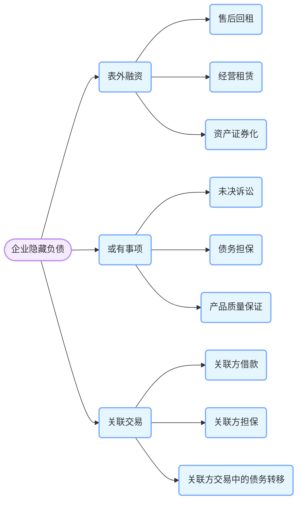

# 如何识别企业的隐藏负债

> 关键词：企业隐藏负债、财务报表分析、风险识别、信用评估、非财务信息、关联交易、或有事项

> 摘要：企业的隐藏负债如同潜藏在水面下的冰山，不易被察觉，却可能对企业的财务状况和经营稳定性造成重大影响。准确识别企业的隐藏负债对于投资者、债权人、监管机构等利益相关者至关重要。本文深入探讨了隐藏负债的背景知识，包括目的、预期读者等，详细阐述了核心概念、算法原理、数学模型，通过项目实战案例进行分析，介绍了实际应用场景，推荐了相关工具和资源，最后总结了未来发展趋势与挑战，并提供常见问题解答和参考资料，旨在为读者提供全面、深入的企业隐藏负债识别方法和思路。

## 1. 背景介绍 
### 1.1 目的和范围
企业隐藏负债的存在可能导致财务信息失真，误导利益相关者做出错误的决策。本文的目的在于系统地介绍识别企业隐藏负债的方法和技巧，帮助投资者、债权人、监管机构等准确评估企业的真实财务状况和风险水平。范围涵盖了企业隐藏负债的各种表现形式、识别方法、实际应用案例以及相关工具和资源推荐。

### 1.2 预期读者
本文预期读者包括但不限于投资者、债权人、财务分析师、监管机构工作人员、企业管理人员以及对企业财务风险识别感兴趣的专业人士和研究人员。

### 1.3 文档结构概述
本文首先介绍背景知识，包括目的、预期读者等。接着阐述核心概念与联系，通过文本示意图和 Mermaid 流程图展示隐藏负债的相关原理和架构。然后讲解核心算法原理和具体操作步骤，并给出 Python 源代码示例。随后介绍数学模型和公式，并举例说明。再通过项目实战案例详细分析代码实现和解读。之后介绍实际应用场景，推荐相关工具和资源。最后总结未来发展趋势与挑战，提供常见问题解答和参考资料。

### 1.4 术语表
#### 1.4.1 核心术语定义
- **隐藏负债**：指企业故意或无意未在财务报表中充分披露的债务或潜在债务，这些负债可能对企业的财务状况和经营成果产生重大影响。
- **或有事项**：是指过去的交易或者事项形成的，其结果须由某些未来事项的发生或不发生才能决定的不确定事项。或有事项可能导致企业承担潜在的负债。
- **关联交易**：是指关联方之间转移资源、劳务或义务的行为，而不论是否收取价款。关联交易可能被企业用于隐藏负债。

#### 1.4.2 相关概念解释
- **表外融资**：是企业在资产负债表中未予以反映的融资行为，常见的表外融资方式包括售后回租、经营租赁、资产证券化等。表外融资可能导致企业隐藏负债。
- **未决诉讼**：是指尚未判决的诉讼案件，企业可能因未决诉讼而承担潜在的赔偿责任，这属于隐藏负债的一种形式。

#### 1.4.3 缩略词列表
- **GAAP**：Generally Accepted Accounting Principles，公认会计原则
- **IFRS**：International Financial Reporting Standards，国际财务报告准则

## 2. 核心概念与联系 
企业的隐藏负债主要源于企业为了美化财务报表、降低资产负债率、满足融资条件等目的，故意或不恰当地隐瞒债务信息。隐藏负债的表现形式多样，常见的包括表外融资、或有事项、关联交易等。

### 文本示意图
```plaintext
企业隐藏负债
|-- 表外融资
|   |-- 售后回租
|   |-- 经营租赁
|   |-- 资产证券化
|-- 或有事项
|   |-- 未决诉讼
|   |-- 债务担保
|   |-- 产品质量保证
|-- 关联交易
|   |-- 关联方借款
|   |-- 关联方担保
|   |-- 关联方交易中的债务转移
```

### Mermaid 流程图


表外融资是企业通过不将某些融资活动反映在资产负债表中，从而降低资产负债率的一种手段。售后回租是企业将资产出售给租赁公司，然后再从租赁公司租回使用，在这种情况下，企业可能仍然承担着与该资产相关的债务，但在资产负债表中却未体现。经营租赁是企业以租赁方式使用资产，按照会计准则，经营租赁的租金支出通常作为费用处理，而不确认为负债，这可能导致企业隐藏了潜在的负债。资产证券化是企业将缺乏流动性但具有未来现金流量的资产打包成证券出售给投资者，企业可能通过资产证券化转移了风险，但同时也可能隐藏了与这些资产相关的负债。

或有事项是企业面临的不确定事项，其结果可能导致企业承担潜在的负债。未决诉讼是指企业涉及的尚未判决的法律纠纷，企业可能需要承担赔偿责任，但在判决结果出来之前，该负债是不确定的。债务担保是企业为其他方提供的担保，当被担保方无法履行债务时，企业可能需要承担担保责任。产品质量保证是企业对其销售的产品提供的质量保证，企业可能需要承担维修、更换等费用，这也属于潜在的负债。

关联交易是企业与关联方之间的交易，关联方可能包括企业的股东、董事、高管及其亲属等。关联方借款是企业从关联方获得的借款，可能存在借款条件不公允或未在财务报表中充分披露的情况。关联方担保是关联方为企业提供的担保，可能存在担保责任未被充分揭示的问题。关联方交易中的债务转移是企业通过与关联方的交易将债务转移给关联方，从而隐藏自身的负债。

## 3. 核心算法原理 & 具体操作步骤 
### 核心算法原理
识别企业隐藏负债的核心算法原理是通过对企业财务报表、非财务信息、关联交易等多方面的数据进行分析和挖掘，发现潜在的负债线索。具体可以采用以下几种方法：

- **财务比率分析**：通过计算企业的各项财务比率，如资产负债率、流动比率、速动比率等，并与同行业平均水平进行比较，发现异常的财务指标，从而推断企业可能存在隐藏负债。
- **现金流量分析**：分析企业的现金流量状况，关注企业的经营活动现金流量、投资活动现金流量和筹资活动现金流量。如果企业的经营活动现金流量持续为负，而筹资活动现金流量持续为正，可能意味着企业存在隐藏负债，需要通过不断融资来维持经营。
- **非财务信息分析**：关注企业的行业动态、市场竞争状况、法律纠纷、媒体报道等非财务信息，从中发现可能导致企业承担潜在负债的线索。
- **关联交易分析**：审查企业的关联交易情况，包括关联方的身份、交易内容、交易价格等，判断关联交易是否存在不公允或隐藏负债的情况。

### 具体操作步骤
#### 步骤 1：收集企业的财务报表和相关资料
收集企业的资产负债表、利润表、现金流量表、财务报表附注等财务报表，以及企业的年报、招股说明书、公告等相关资料。

#### 步骤 2：进行财务比率分析
计算企业的各项财务比率，如资产负债率、流动比率、速动比率、利息保障倍数等，并与同行业平均水平进行比较。如果企业的某些财务比率明显偏离同行业平均水平，可能意味着企业存在隐藏负债。

#### 步骤 3：进行现金流量分析
分析企业的现金流量状况，关注企业的经营活动现金流量、投资活动现金流量和筹资活动现金流量。计算企业的自由现金流量，即经营活动现金流量减去资本支出。如果企业的自由现金流量持续为负，可能意味着企业存在隐藏负债，需要通过不断融资来维持经营。

#### 步骤 4：分析非财务信息
关注企业的行业动态、市场竞争状况、法律纠纷、媒体报道等非财务信息，从中发现可能导致企业承担潜在负债的线索。例如，企业涉及重大法律纠纷，可能需要承担赔偿责任；企业的产品出现质量问题，可能需要承担产品质量保证费用。

#### 步骤 5：审查关联交易
审查企业的关联交易情况，包括关联方的身份、交易内容、交易价格等，判断关联交易是否存在不公允或隐藏负债的情况。例如，企业与关联方之间的借款利率明显低于市场利率，可能存在利益输送或隐藏负债的情况。

#### 步骤 6：综合分析和判断
综合考虑以上各方面的分析结果，对企业是否存在隐藏负债进行判断。如果发现企业存在异常的财务指标、现金流量状况、非财务信息或关联交易情况，需要进一步深入调查，以确定是否存在隐藏负债。

### Python 源代码示例
```python
import pandas as pd
import numpy as np

# 读取企业财务报表数据
def read_financial_statements(file_path):
    df = pd.read_excel(file_path)
    return df

# 计算财务比率
def calculate_financial_ratios(df):
    # 资产负债率 = 负债总额 / 资产总额
    df['资产负债率'] = df['负债总额'] / df['资产总额']
    # 流动比率 = 流动资产 / 流动负债
    df['流动比率'] = df['流动资产'] / df['流动负债']
    # 速动比率 = (流动资产 - 存货) / 流动负债
    df['速动比率'] = (df['流动资产'] - df['存货']) / df['流动负债']
    # 利息保障倍数 = (净利润 + 利息费用 + 所得税费用) / 利息费用
    df['利息保障倍数'] = (df['净利润'] + df['利息费用'] + df['所得税费用']) / df['利息费用']
    return df

# 进行现金流量分析
def cash_flow_analysis(df):
    # 自由现金流量 = 经营活动现金流量 - 资本支出
    df['自由现金流量'] = df['经营活动现金流量'] - df['资本支出']
    # 判断自由现金流量是否持续为负
    df['自由现金流量持续为负'] = df['自由现金流量'].rolling(window=3).apply(lambda x: np.all(x < 0)).fillna(0)
    return df

# 主函数
def main(file_path):
    df = read_financial_statements(file_path)
    df = calculate_financial_ratios(df)
    df = cash_flow_analysis(df)
    return df

if __name__ == '__main__':
    file_path = 'financial_statements.xlsx'
    result = main(file_path)
    print(result)
```

## 4. 数学模型和公式 & 详细讲解 & 举例说明 
### 财务比率分析相关公式
- **资产负债率（Debt-to-Asset Ratio）**：
$$资产负债率 = \frac{负债总额}{资产总额} \times 100\%$$
资产负债率反映了企业的负债水平和偿债能力。一般来说，资产负债率越高，企业的负债水平越高，偿债风险越大。例如，某企业的负债总额为 5000 万元，资产总额为 10000 万元，则该企业的资产负债率为：
$$资产负债率 = \frac{5000}{10000} \times 100\% = 50\%$$

- **流动比率（Current Ratio）**：
$$流动比率 = \frac{流动资产}{流动负债}$$
流动比率反映了企业的短期偿债能力。一般来说，流动比率越高，企业的短期偿债能力越强。通常认为，流动比率在 2 左右比较合适。例如，某企业的流动资产为 3000 万元，流动负债为 1500 万元，则该企业的流动比率为：
$$流动比率 = \frac{3000}{1500} = 2$$

- **速动比率（Quick Ratio）**：
$$速动比率 = \frac{流动资产 - 存货}{流动负债}$$
速动比率是在流动比率的基础上，剔除了存货的影响，更能准确地反映企业的短期偿债能力。一般来说，速动比率在 1 左右比较合适。例如，某企业的流动资产为 3000 万元，存货为 1000 万元，流动负债为 1500 万元，则该企业的速动比率为：
$$速动比率 = \frac{3000 - 1000}{1500} = \frac{2000}{1500} \approx 1.33$$

- **利息保障倍数（Interest Coverage Ratio）**：
$$利息保障倍数 = \frac{息税前利润}{利息费用}$$
利息保障倍数反映了企业支付利息的能力。一般来说，利息保障倍数越高，企业支付利息的能力越强。例如，某企业的息税前利润为 1000 万元，利息费用为 200 万元，则该企业的利息保障倍数为：
$$利息保障倍数 = \frac{1000}{200} = 5$$

### 现金流量分析相关公式
- **自由现金流量（Free Cash Flow）**：
$$自由现金流量 = 经营活动现金流量 - 资本支出$$
自由现金流量反映了企业在满足经营活动和投资活动的现金需求后，剩余的可自由支配的现金流量。如果企业的自由现金流量持续为负，可能意味着企业存在隐藏负债，需要通过不断融资来维持经营。例如，某企业的经营活动现金流量为 800 万元，资本支出为 1000 万元，则该企业的自由现金流量为：
$$自由现金流量 = 800 - 1000 = -200（万元）$$

## 5. 项目实战：代码实际案例和详细解释说明 
### 5.1  开发环境搭建
#### 安装 Python
首先，需要安装 Python 开发环境。可以从 Python 官方网站（https://www.python.org/downloads/） 下载适合自己操作系统的 Python 安装包，并按照安装向导进行安装。

#### 安装必要的库
在安装好 Python 后，需要安装一些必要的库，如 Pandas、Numpy 等。可以使用以下命令进行安装：
```sh
pip install pandas numpy
```

### 5.2  源代码详细实现和代码解读
```python
import pandas as pd
import numpy as np

# 读取企业财务报表数据
def read_financial_statements(file_path):
    df = pd.read_excel(file_path)
    return df

# 计算财务比率
def calculate_financial_ratios(df):
    # 资产负债率 = 负债总额 / 资产总额
    df['资产负债率'] = df['负债总额'] / df['资产总额']
    # 流动比率 = 流动资产 / 流动负债
    df['流动比率'] = df['流动资产'] / df['流动负债']
    # 速动比率 = (流动资产 - 存货) / 流动负债
    df['速动比率'] = (df['流动资产'] - df['存货']) / df['流动负债']
    # 利息保障倍数 = (净利润 + 利息费用 + 所得税费用) / 利息费用
    df['利息保障倍数'] = (df['净利润'] + df['利息费用'] + df['所得税费用']) / df['利息费用']
    return df

# 进行现金流量分析
def cash_flow_analysis(df):
    # 自由现金流量 = 经营活动现金流量 - 资本支出
    df['自由现金流量'] = df['经营活动现金流量'] - df['资本支出']
    # 判断自由现金流量是否持续为负
    df['自由现金流量持续为负'] = df['自由现金流量'].rolling(window=3).apply(lambda x: np.all(x < 0)).fillna(0)
    return df

# 主函数
def main(file_path):
    df = read_financial_statements(file_path)
    df = calculate_financial_ratios(df)
    df = cash_flow_analysis(df)
    return df

if __name__ == '__main__':
    file_path = 'financial_statements.xlsx'
    result = main(file_path)
    print(result)
```

### 代码解读与分析
- **`read_financial_statements` 函数**：该函数用于读取企业的财务报表数据，使用 `pandas` 库的 `read_excel` 函数读取 Excel 文件，并返回一个 `DataFrame` 对象。
- **`calculate_financial_ratios` 函数**：该函数用于计算企业的各项财务比率，包括资产负债率、流动比率、速动比率和利息保障倍数。通过对 `DataFrame` 中的相关列进行计算，将计算结果添加到 `DataFrame` 中。
- **`cash_flow_analysis` 函数**：该函数用于进行现金流量分析，计算企业的自由现金流量，并判断自由现金流量是否持续为负。使用 `rolling` 函数对自由现金流量列进行滚动计算，判断连续 3 期的自由现金流量是否都为负。
- **`main` 函数**：该函数是主函数，调用上述三个函数，完成财务报表数据的读取、财务比率的计算和现金流量分析，并返回最终的 `DataFrame` 对象。
- **主程序**：指定财务报表数据文件的路径，调用 `main` 函数进行分析，并打印分析结果。

## 6. 实际应用场景 
### 投资者决策
投资者在进行投资决策时，需要准确评估企业的真实财务状况和风险水平。识别企业的隐藏负债可以帮助投资者发现潜在的风险，避免投资失误。例如，投资者在分析某企业的财务报表时，发现该企业的资产负债率明显低于同行业平均水平，但通过进一步分析发现该企业存在大量的表外融资和关联交易，可能隐藏了部分负债。投资者可以根据这些信息，重新评估该企业的投资价值，做出更加明智的投资决策。

### 债权人信贷评估
债权人在进行信贷评估时，需要评估企业的偿债能力和信用风险。识别企业的隐藏负债可以帮助债权人更准确地评估企业的负债水平和偿债能力，降低信贷风险。例如，银行在审批某企业的贷款申请时，通过对该企业的财务报表和非财务信息进行分析，发现该企业存在未决诉讼和债务担保等或有事项，可能需要承担潜在的负债。银行可以根据这些信息，调整对该企业的信用评级和贷款额度，降低信贷风险。

### 监管机构监管
监管机构在对企业进行监管时，需要确保企业的财务信息真实、准确、完整。识别企业的隐藏负债可以帮助监管机构发现企业的财务违规行为，维护市场秩序。例如，证券监管机构在对上市公司进行监管时，通过对上市公司的财务报表和关联交易进行审查，发现某上市公司存在通过关联交易隐藏负债的情况。监管机构可以对该上市公司进行调查和处罚，维护投资者的合法权益和市场秩序。

### 企业自身风险管理
企业自身也需要识别隐藏负债，加强风险管理。通过识别隐藏负债，企业可以及时发现潜在的财务风险，采取相应的措施进行防范和化解。例如，企业在进行战略规划和投资决策时，需要考虑隐藏负债对企业财务状况和经营成果的影响。企业可以通过优化资本结构、加强内部控制等措施，降低隐藏负债带来的风险。

## 7. 工具和资源推荐
### 7.1 学习资源推荐
#### 7.1.1 书籍推荐
- 《财务报表分析》：这本书系统地介绍了财务报表分析的方法和技巧，包括财务比率分析、现金流量分析、资产负债表分析等内容，对于学习如何识别企业隐藏负债具有重要的参考价值。
- 《公司财务》：该书涵盖了公司财务的各个方面，包括资本结构、融资决策、风险管理等，有助于深入理解企业的财务运作和隐藏负债的产生原因。
- 《审计学》：审计学是一门研究如何对企业财务报表进行审计的学科，学习审计学可以了解审计的方法和程序，以及如何发现企业的财务违规行为和隐藏负债。

#### 7.1.2 在线课程
- Coursera 平台上的“财务报表分析与估值”课程：该课程由知名教授授课，通过案例分析和实践操作，帮助学员掌握财务报表分析的方法和技巧，以及如何识别企业的隐藏负债。
- 中国大学 MOOC 平台上的“财务管理”课程：该课程系统地介绍了财务管理的基本理论和方法，包括财务分析、投资决策、融资决策等内容，对于学习企业隐藏负债的识别具有一定的帮助。

#### 7.1.3 技术博客和网站
- 雪球网：雪球网是一个投资者社区，上面有很多关于企业财务分析和投资决策的文章和讨论，通过阅读这些内容，可以了解其他投资者对企业隐藏负债的看法和分析方法。
- 巨潮资讯网：巨潮资讯网是中国证监会指定的上市公司信息披露网站，上面可以获取上市公司的财务报表、公告等信息，是进行企业财务分析和隐藏负债识别的重要信息来源。

### 7.2 开发工具框架推荐
#### 7.2.1 IDE和编辑器
- PyCharm：PyCharm 是一款专业的 Python 集成开发环境，具有代码编辑、调试、代码分析等功能，非常适合用于开发和调试识别企业隐藏负债的 Python 代码。
- Jupyter Notebook：Jupyter Notebook 是一个交互式的开发环境，可以在浏览器中编写和运行 Python 代码，同时还可以添加文本说明和可视化图表，方便进行数据分析和结果展示。

#### 7.2.2 调试和性能分析工具
- pdb：pdb 是 Python 自带的调试工具，可以在代码中设置断点，逐行执行代码，查看变量的值，帮助调试代码中的错误。
- cProfile：cProfile 是 Python 的性能分析工具，可以分析代码的执行时间和函数调用情况，帮助优化代码性能。

#### 7.2.3 相关框架和库
- Pandas：Pandas 是一个强大的数据分析库，提供了数据结构和数据分析工具，非常适合用于处理和分析企业的财务报表数据。
- Numpy：Numpy 是一个科学计算库，提供了高效的数组操作和数学函数，在进行财务比率计算和现金流量分析时可以发挥重要作用。

### 7.3 相关论文著作推荐
#### 7.3.1 经典论文
- 《On the Pricing of Corporate Debt: The Risk Structure of Interest Rates》：这篇经典论文探讨了企业债务定价和利率风险结构的问题，对于理解企业隐藏负债对债务定价的影响具有重要的参考价值。
- 《The Information Content of Annual Earnings Announcements》：该论文研究了年度盈利公告的信息含量，对于分析企业财务报表信息和隐藏负债的关系具有一定的启示作用。

#### 7.3.2 最新研究成果
- 关注国际顶级学术期刊，如《Journal of Finance》、《The Accounting Review》等，这些期刊上经常发表关于企业财务和风险管理的最新研究成果，包括企业隐藏负债的识别和防范。
- 参加国际学术会议，如美国金融协会（AFA）年会、美国会计学会（AAA）年会等，与国际顶尖学者交流，了解企业隐藏负债领域的最新研究动态。

#### 7.3.3 应用案例分析
- 各大会计师事务所和咨询公司发布的企业财务分析报告和案例研究，这些报告和研究通常会结合实际案例，分析企业隐藏负债的表现形式、识别方法和防范措施，具有很强的实践指导意义。
- 上市公司的年报和招股说明书，其中包含了企业的财务报表和相关信息，可以通过分析这些资料，了解企业隐藏负债的实际案例。

## 8. 总结：未来发展趋势与挑战
### 未来发展趋势
- **数字化和智能化**：随着信息技术的不断发展，企业的财务数据和业务数据越来越数字化。未来，利用大数据、人工智能等技术进行企业隐藏负债的识别将成为趋势。例如，通过机器学习算法对企业的财务数据、非财务信息和关联交易数据进行分析和挖掘，提高隐藏负债识别的准确性和效率。
- **跨领域融合**：企业隐藏负债的识别不仅仅涉及财务领域，还涉及法律、审计、风险管理等多个领域。未来，跨领域的融合将更加深入，需要综合运用多学科的知识和方法进行隐藏负债的识别和防范。例如，结合法律知识对企业的或有事项进行分析，判断企业可能承担的法律责任和潜在负债。
- **国际化标准趋同**：随着经济全球化的发展，企业的跨国经营和融资活动越来越频繁。未来，国际财务报告准则（IFRS）和各国会计准则将进一步趋同，企业隐藏负债的识别标准和方法也将更加统一。这将有助于提高全球范围内企业财务信息的可比性和透明度。

### 挑战
- **数据质量和完整性**：企业隐藏负债的识别依赖于准确、完整的财务数据和非财务信息。然而，在实际应用中，数据质量和完整性往往存在问题。例如，企业可能故意隐瞒或歪曲部分财务信息，导致数据不准确；非财务信息的收集和整理也存在一定的难度，可能存在信息缺失或错误的情况。
- **隐藏负债形式的多样性和复杂性**：随着企业经营环境的变化和金融创新的发展，企业隐藏负债的形式越来越多样和复杂。例如，一些新型的金融工具和融资方式可能被企业用于隐藏负债，增加了识别的难度。此外，企业还可能通过复杂的关联交易和组织架构来隐藏负债，使得隐藏负债的识别更加困难。
- **法律法规和监管政策的不完善**：目前，关于企业隐藏负债的法律法规和监管政策还存在一定的不完善之处。例如，对于一些新型的隐藏负债形式，法律法规可能没有明确的规定；监管机构的监管手段和力度也有待加强。这使得企业可能存在一定的侥幸心理，通过隐藏负债来获取不当利益。

## 9. 附录：常见问题与解答
### 问题 1：如何判断企业的关联交易是否存在隐藏负债的情况？
答：可以从以下几个方面判断企业的关联交易是否存在隐藏负债的情况：
- **交易价格**：如果关联交易的价格明显偏离市场价格，可能存在利益输送或隐藏负债的情况。例如，企业以远低于市场价格的价格向关联方出售资产，可能是为了转移债务。
- **交易条款**：关注关联交易的条款是否合理，如借款利率、还款期限等。如果借款利率明显低于市场利率，可能存在隐藏负债的情况。
- **交易目的**：分析关联交易的目的是否合理，是否符合企业的正常经营需求。如果关联交易的目的不明确或不合理，可能存在隐藏负债的情况。
- **信息披露**：检查企业对关联交易的信息披露是否充分、准确。如果企业对关联交易的信息披露不完整或存在误导性陈述，可能存在隐藏负债的情况。

### 问题 2：企业的或有事项一定会导致隐藏负债吗？
答：不一定。或有事项是指过去的交易或者事项形成的，其结果须由某些未来事项的发生或不发生才能决定的不确定事项。或有事项可能导致企业承担潜在的负债，但只有在满足一定条件时，才会确认为负债。例如，对于未决诉讼，只有在法院判决企业败诉且需要承担赔偿责任时，才会确认为负债。在判决结果出来之前，未决诉讼只是一项或有事项，不一定会导致隐藏负债。

### 问题 3：如何获取企业的非财务信息？
答：可以通过以下途径获取企业的非财务信息：
- **企业官网**：企业官网通常会发布企业的新闻公告、产品信息、社会责任报告等非财务信息。
- **媒体报道**：关注各大媒体对企业的报道，包括报纸、杂志、网站等，从中获取企业的相关信息。
- **行业协会**：行业协会通常会发布行业动态、市场分析等信息，通过行业协会可以了解企业所处行业的情况。
- **政府部门**：政府部门的网站上可能会发布企业的行政处罚、环保信息等非财务信息。
- **法律数据库**：通过法律数据库可以查询企业涉及的法律纠纷和诉讼案件等信息。

## 10. 扩展阅读 & 参考资料
### 扩展阅读
- 《财务欺诈与识别》：这本书深入探讨了企业财务欺诈的手段和识别方法，对于学习如何识别企业隐藏负债具有重要的参考价值。
- 《企业风险管理》：该书系统地介绍了企业风险管理的理论和方法，包括风险识别、风险评估、风险应对等内容，有助于深入理解企业隐藏负债的风险管理。

### 参考资料
- 《企业会计准则》
- 《国际财务报告准则》
- 相关上市公司的年报、招股说明书和公告
- 各大会计师事务所和咨询公司发布的研究报告和案例分析