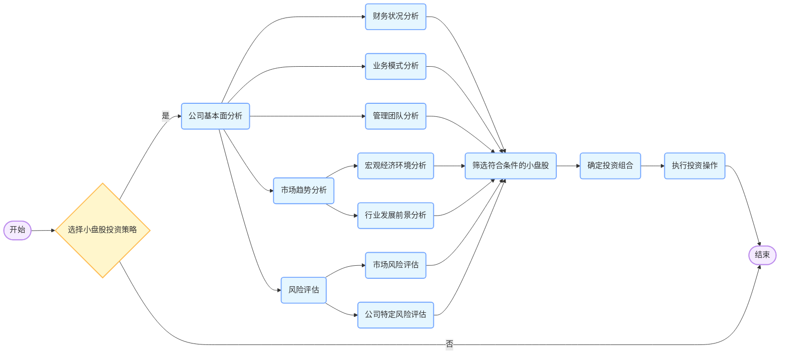

# 小盘股投资策略：发掘高增长潜力的公司

> 关键词：小盘股、投资策略、高增长潜力、公司发掘、财务分析、市场趋势

> 摘要：本文聚焦于小盘股投资策略，旨在探讨如何发掘具有高增长潜力的公司。首先介绍了小盘股投资的背景，包括目的、预期读者、文档结构和相关术语。接着阐述了小盘股及相关核心概念和联系，并通过示意图和流程图进行展示。详细讲解了核心算法原理及具体操作步骤，运用 Python 代码实现。引入数学模型和公式来评估小盘股的价值，并举例说明。通过项目实战，展示了开发环境搭建、源代码实现和解读。分析了小盘股投资的实际应用场景，推荐了学习资源、开发工具和相关论文著作。最后总结了小盘股投资的未来发展趋势与挑战，提供常见问题解答和扩展阅读参考资料。

## 1. 背景介绍 
### 1.1 目的和范围
在投资领域，小盘股常常被视为蕴含着巨大增长潜力的投资对象。本文章的目的在于深入探讨小盘股投资策略，帮助投资者掌握发掘具有高增长潜力小盘股公司的方法。范围涵盖了从基本概念的介绍、核心算法原理的讲解、数学模型的构建，到实际项目案例的分析以及未来发展趋势的展望等多个方面，旨在为投资者提供全面、系统的小盘股投资指导。

### 1.2 预期读者
本文预期读者主要包括对股票投资感兴趣的个人投资者，希望通过学习专业的投资策略来提高投资收益；金融专业的学生和研究人员，他们可以从文章中获取关于小盘股投资的理论知识和实践经验；以及金融机构的从业人员，如投资顾问、分析师等，为他们的工作提供参考和启发。

### 1.3 文档结构概述
本文将按照以下结构展开：首先介绍小盘股投资的背景知识，包括目的、读者群体和文档结构等；接着阐述小盘股及相关核心概念和联系，通过示意图和流程图进行直观展示；然后详细讲解核心算法原理及具体操作步骤，并运用 Python 代码实现；引入数学模型和公式来评估小盘股的价值，并举例说明；通过项目实战，展示开发环境搭建、源代码实现和解读；分析小盘股投资的实际应用场景；推荐学习资源、开发工具和相关论文著作；最后总结小盘股投资的未来发展趋势与挑战，提供常见问题解答和扩展阅读参考资料。

### 1.4 术语表
#### 1.4.1 核心术语定义
- **小盘股**：通常指流通市值较小的股票。在不同的市场和行业中，小盘股的界定标准可能有所不同，但一般来说，流通市值在一定范围内相对较小的公司股票被称为小盘股。
- **高增长潜力**：指公司在未来一段时间内具有实现快速业务增长、盈利提升和市场份额扩大的可能性。
- **财务比率**：用于评估公司财务状况和经营绩效的一系列指标，如市盈率、市净率、净资产收益率等。
- **市场趋势**：指股票市场在一定时期内的整体运行方向，包括上升趋势、下降趋势和盘整趋势。

#### 1.4.2 相关概念解释
- **价值投资**：一种投资策略，强调通过分析公司的基本面，如财务状况、盈利能力、行业地位等，寻找被低估的股票进行投资，以获取长期的投资回报。
- **成长投资**：关注公司的未来增长潜力，更注重公司的业务发展前景、创新能力和市场竞争力，愿意为具有高增长潜力的公司支付较高的价格。
- **风险评估**：对投资过程中可能面临的各种风险进行识别、分析和评估，以确定投资的风险程度和应对措施。

#### 1.4.3 缩略词列表
- **PE**：市盈率（Price-to-Earnings Ratio），指股票价格与每股盈利的比率，用于衡量股票的估值水平。
- **PB**：市净率（Price-to-Book Ratio），指股票价格与每股净资产的比率，反映了股票的市场价格相对于净资产的溢价程度。
- **ROE**：净资产收益率（Return on Equity），指公司净利润与净资产的比率，衡量了公司运用自有资本的效率。

## 2. 核心概念与联系 
### 核心概念原理
小盘股投资的核心在于发掘那些具有高增长潜力的公司。从原理上来说，小盘股公司通常处于发展的早期阶段，具有较大的成长空间。由于其规模较小，相对容易实现快速的业务扩张和盈利增长。然而，小盘股也面临着较高的风险，如市场竞争力较弱、抗风险能力较差等。

在发掘高增长潜力的小盘股公司时，需要综合考虑多个因素。公司的基本面是重要的考量因素之一，包括财务状况、业务模式、管理团队等。财务状况良好、具有独特业务模式和优秀管理团队的公司更有可能实现高增长。此外，市场趋势和行业发展前景也会对小盘股的表现产生影响。处于新兴行业、具有良好发展前景的小盘股公司往往具有更大的增长潜力。

### 架构的文本示意图
```plaintext
小盘股投资策略
|-- 核心目标：发掘高增长潜力公司
|   |-- 公司基本面分析
|   |   |-- 财务状况（PE、PB、ROE等）
|   |   |-- 业务模式
|   |   |-- 管理团队
|   |-- 市场趋势分析
|   |   |-- 宏观经济环境
|   |   |-- 行业发展前景
|   |-- 风险评估
|       |-- 市场风险
|       |-- 公司特定风险
|-- 投资决策
|   |-- 筛选符合条件的小盘股
|   |-- 确定投资组合
|   |-- 执行投资操作
```

### Mermaid 流程图


## 3. 核心算法原理 & 具体操作步骤 
### 核心算法原理
在小盘股投资中，我们可以使用多因素分析算法来筛选具有高增长潜力的公司。该算法的核心思想是综合考虑多个因素，对每个因素进行量化评分，然后根据评分结果筛选出符合条件的小盘股。

具体来说，我们可以从公司基本面和市场趋势两个方面选取多个因素，如市盈率、市净率、净资产收益率、营业收入增长率、行业增长率等。为每个因素设定一个权重，根据公司的实际数据计算每个因素的得分，然后将各因素得分加权求和，得到公司的综合得分。根据综合得分对小盘股进行排序，选取得分较高的公司作为投资对象。

### 具体操作步骤
#### 步骤 1：数据收集
收集小盘股公司的相关数据，包括财务数据（如市盈率、市净率、净资产收益率等）、业务数据（如营业收入、净利润等）和市场数据（如行业增长率、市场份额等）。可以通过金融数据提供商、公司年报、证券交易所网站等渠道获取数据。

#### 步骤 2：因素选择和权重设定
根据投资目标和经验，选择合适的因素进行分析，并为每个因素设定一个权重。例如，我们可以选择市盈率、市净率、净资产收益率、营业收入增长率和行业增长率作为分析因素，权重分别设定为 0.2、0.2、0.2、0.2 和 0.2。

#### 步骤 3：数据预处理
对收集到的数据进行预处理，包括数据清洗、缺失值处理和异常值处理等。确保数据的准确性和完整性。

#### 步骤 4：因素得分计算
根据公司的实际数据，计算每个因素的得分。可以采用标准化的方法，将每个因素的数据转换为 0 到 1 之间的得分。例如，对于市盈率因素，我们可以将市盈率较低的公司赋予较高的得分，市盈率较高的公司赋予较低的得分。

#### 步骤 5：综合得分计算
将各因素得分按照设定的权重进行加权求和，得到公司的综合得分。公式如下：

$$综合得分 = \sum_{i=1}^{n} 因素 i 得分 \times 因素 i 权重$$

其中，$n$ 为因素的数量。

#### 步骤 6：筛选投资对象
根据综合得分对小盘股进行排序，选取得分较高的公司作为投资对象。可以设定一个阈值，只选择综合得分超过阈值的公司。

### Python 代码实现
```python
import pandas as pd
import numpy as np

# 步骤 1：数据收集
# 假设我们已经从数据源获取了数据，并存储在一个 DataFrame 中
data = pd.DataFrame({
    '股票代码': ['000001', '000002', '000003', '000004', '000005'],
    '市盈率': [10, 20, 15, 25, 30],
    '市净率': [1.5, 2.0, 1.8, 2.2, 2.5],
    '净资产收益率': [0.15, 0.12, 0.18, 0.10, 0.13],
    '营业收入增长率': [0.2, 0.15, 0.25, 0.1, 0.18],
    '行业增长率': [0.1, 0.1, 0.1, 0.1, 0.1]
})

# 步骤 2：因素选择和权重设定
factors = ['市盈率', '市净率', '净资产收益率', '营业收入增长率', '行业增长率']
weights = [0.2, 0.2, 0.2, 0.2, 0.2]

# 步骤 3：数据预处理
# 这里简单假设数据没有缺失值和异常值，不需要进行处理

# 步骤 4：因素得分计算
def factor_score(data, factor, ascending=True):
    """
    计算单个因素的得分
    :param data: 数据 DataFrame
    :param factor: 因素名称
    :param ascending: 是否升序排序
    :return: 因素得分
    """
    sorted_data = data.sort_values(by=factor, ascending=ascending)
    score = np.linspace(0, 1, len(sorted_data))
    sorted_data[factor + '_得分'] = score
    return sorted_data.set_index('股票代码')[factor + '_得分']

# 计算每个因素的得分
for factor in factors:
    if factor in ['市盈率', '市净率']:
        ascending = True
    else:
        ascending = False
    data[factor + '_得分'] = factor_score(data, factor, ascending)

# 步骤 5：综合得分计算
data['综合得分'] = 0
for factor, weight in zip(factors, weights):
    data['综合得分'] += data[factor + '_得分'] * weight

# 步骤 6：筛选投资对象
threshold = 0.6
selected_stocks = data[data['综合得分'] > threshold]['股票代码']
print("筛选出的投资对象：", selected_stocks)
```

## 4. 数学模型和公式 & 详细讲解 & 举例说明 
### 数学模型和公式
#### 因素得分计算
对于每个因素，我们可以采用线性变换的方法将其数据转换为 0 到 1 之间的得分。假设因素 $x$ 的取值范围为 $[x_{min}, x_{max}]$，则因素 $x$ 的得分 $s$ 可以通过以下公式计算：

$$s = \frac{x - x_{min}}{x_{max} - x_{min}}$$

其中，$x$ 为公司在该因素上的实际值，$x_{min}$ 和 $x_{max}$ 分别为所有公司在该因素上的最小值和最大值。

#### 综合得分计算
综合得分是各因素得分的加权求和，公式如下：

$$综合得分 = \sum_{i=1}^{n} 因素 i 得分 \times 因素 i 权重$$

其中，$n$ 为因素的数量，因素 $i$ 得分是通过上述因素得分计算公式得到的，因素 $i$ 权重是预先设定的。

### 详细讲解
因素得分计算的目的是将不同因素的数据进行标准化，使其具有可比性。通过线性变换，将因素的取值范围映射到 0 到 1 之间，得分越高表示该因素表现越好。

综合得分计算则是将各因素得分按照设定的权重进行加权求和，得到一个综合的评估指标。权重的设定反映了各因素在投资决策中的重要程度。例如，如果我们认为净资产收益率和营业收入增长率对公司的增长潜力更为重要，可以适当提高这两个因素的权重。

### 举例说明
假设我们有三家小盘股公司 A、B、C，它们的市盈率数据分别为 10、20、30。根据因素得分计算公式，我们可以计算出它们的市盈率得分：

- 首先，确定 $x_{min} = 10$，$x_{max} = 30$。
- 对于公司 A：$s_A = \frac{10 - 10}{30 - 10} = 0$
- 对于公司 B：$s_B = \frac{20 - 10}{30 - 10} = 0.5$
- 对于公司 C：$s_C = \frac{30 - 10}{30 - 10} = 1$

假设我们设定市盈率因素的权重为 0.2，其他因素的得分和权重如下：

| 公司 | 市盈率得分 | 市盈率权重 | 市净率得分 | 市净率权重 | 净资产收益率得分 | 净资产收益率权重 | 营业收入增长率得分 | 营业收入增长率权重 | 行业增长率得分 | 行业增长率权重 |
| ---- | ---- | ---- | ---- | ---- | ---- | ---- | ---- | ---- | ---- | ---- |
| A | 0 | 0.2 | 0.6 | 0.2 | 0.8 | 0.2 | 0.7 | 0.2 | 0.5 | 0.2 |
| B | 0.5 | 0.2 | 0.5 | 0.2 | 0.6 | 0.2 | 0.6 | 0.2 | 0.5 | 0.2 |
| C | 1 | 0.2 | 0.4 | 0.2 | 0.4 | 0.2 | 0.5 | 0.2 | 0.5 | 0.2 |

根据综合得分计算公式，我们可以计算出三家公司的综合得分：

- 公司 A：$综合得分_A = 0 \times 0.2 + 0.6 \times 0.2 + 0.8 \times 0.2 + 0.7 \times 0.2 + 0.5 \times 0.2 = 0.56$
- 公司 B：$综合得分_B = 0.5 \times 0.2 + 0.5 \times 0.2 + 0.6 \times 0.2 + 0.6 \times 0.2 + 0.5 \times 0.2 = 0.56$
- 公司 C：$综合得分_C = 1 \times 0.2 + 0.4 \times 0.2 + 0.4 \times 0.2 + 0.5 \times 0.2 + 0.5 \times 0.2 = 0.48$

假设我们设定的阈值为 0.6，则公司 A 和公司 B 不符合筛选条件，公司 C 也不符合筛选条件。在实际应用中，我们可以根据需要调整因素的选择、权重的设定和阈值的大小，以筛选出符合我们投资目标的小盘股公司。

## 5. 项目实战：代码实际案例和详细解释说明 
### 5.1  开发环境搭建
#### 操作系统
可以选择 Windows、Linux 或 macOS 操作系统，建议使用较新版本的操作系统以确保兼容性和稳定性。

#### Python 环境
安装 Python 3.x 版本，推荐使用 Anaconda 发行版，它包含了许多常用的科学计算库和工具。可以从 Anaconda 官方网站（https://www.anaconda.com/products/individual）下载并安装适合自己操作系统的版本。

#### 第三方库
在项目中，我们需要使用一些第三方库来进行数据处理、分析和可视化。可以使用以下命令安装所需的库：
```sh
pip install pandas numpy matplotlib
```
- **pandas**：用于数据处理和分析，提供了 DataFrame 等数据结构，方便对数据进行读取、清洗、转换和计算。
- **numpy**：用于数值计算，提供了高效的数组操作和数学函数。
- **matplotlib**：用于数据可视化，可绘制各种图表，如折线图、柱状图、散点图等。

### 5.2  源代码详细实现和代码解读
```python
import pandas as pd
import numpy as np
import matplotlib.pyplot as plt

# 步骤 1：数据收集
# 假设我们已经从数据源获取了数据，并存储在一个 CSV 文件中
data = pd.read_csv('small_cap_stocks.csv')

# 步骤 2：因素选择和权重设定
factors = ['市盈率', '市净率', '净资产收益率', '营业收入增长率', '行业增长率']
weights = [0.2, 0.2, 0.2, 0.2, 0.2]

# 步骤 3：数据预处理
# 处理缺失值
data = data.dropna(subset=factors)

# 步骤 4：因素得分计算
def factor_score(data, factor, ascending=True):
    """
    计算单个因素的得分
    :param data: 数据 DataFrame
    :param factor: 因素名称
    :param ascending: 是否升序排序
    :return: 因素得分
    """
    sorted_data = data.sort_values(by=factor, ascending=ascending)
    score = np.linspace(0, 1, len(sorted_data))
    sorted_data[factor + '_得分'] = score
    return sorted_data.set_index('股票代码')[factor + '_得分']

# 计算每个因素的得分
for factor in factors:
    if factor in ['市盈率', '市净率']:
        ascending = True
    else:
        ascending = False
    data[factor + '_得分'] = factor_score(data, factor, ascending)

# 步骤 5：综合得分计算
data['综合得分'] = 0
for factor, weight in zip(factors, weights):
    data['综合得分'] += data[factor + '_得分'] * weight

# 步骤 6：筛选投资对象
threshold = 0.6
selected_stocks = data[data['综合得分'] > threshold]['股票代码']
print("筛选出的投资对象：", selected_stocks)

# 数据可视化
plt.figure(figsize=(10, 6))
plt.bar(data['股票代码'], data['综合得分'])
plt.xlabel('股票代码')
plt.ylabel('综合得分')
plt.title('小盘股综合得分分布')
plt.xticks(rotation=45)
plt.show()
```

### 代码解读与分析
#### 数据收集
通过 `pd.read_csv` 函数从 CSV 文件中读取小盘股公司的数据。在实际应用中，数据可以来自各种数据源，如金融数据提供商的 API、数据库等。

#### 因素选择和权重设定
选择了市盈率、市净率、净资产收益率、营业收入增长率和行业增长率作为分析因素，并为每个因素设定了 0.2 的权重。可以根据实际情况调整因素的选择和权重的设定。

#### 数据预处理
使用 `dropna` 函数处理缺失值，确保数据的完整性。在实际应用中，还可以进行其他数据预处理操作，如异常值处理、数据标准化等。

#### 因素得分计算
定义了 `factor_score` 函数，用于计算单个因素的得分。根据因素的性质，选择升序或降序排序，然后将排序后的数据映射到 0 到 1 之间的得分。

#### 综合得分计算
通过循环遍历每个因素，将因素得分乘以相应的权重并累加，得到公司的综合得分。

#### 筛选投资对象
根据设定的阈值，筛选出综合得分超过阈值的股票代码。

#### 数据可视化
使用 `matplotlib` 库绘制柱状图，展示小盘股公司的综合得分分布。通过可视化可以直观地了解各公司的综合得分情况，为投资决策提供参考。

## 6. 实际应用场景 
### 个人投资者
对于个人投资者来说，小盘股投资策略可以帮助他们发掘具有高增长潜力的公司，实现资产的增值。个人投资者可以根据自己的风险承受能力和投资目标，选择适合自己的小盘股进行投资。例如，风险承受能力较高的投资者可以选择一些处于新兴行业、具有较高增长潜力但风险也相对较高的小盘股；而风险承受能力较低的投资者可以选择一些基本面较好、业绩稳定的小盘股。

### 基金管理公司
基金管理公司可以运用小盘股投资策略构建小盘股基金，为投资者提供多样化的投资选择。通过专业的研究和分析，基金管理公司可以筛选出具有高增长潜力的小盘股，组成投资组合，以获取超额收益。同时，基金管理公司还可以根据市场情况和投资策略的调整，及时调整投资组合，降低风险。

### 风险投资机构
风险投资机构通常关注具有高增长潜力的初创企业，小盘股市场中可能存在一些处于成长阶段的公司，具有类似初创企业的特点。风险投资机构可以通过小盘股投资策略，发掘这些具有潜力的公司，进行投资并参与公司的发展。当公司实现快速增长后，风险投资机构可以通过股权转让等方式获得丰厚的回报。

### 金融研究机构
金融研究机构可以利用小盘股投资策略进行学术研究和市场分析。通过对小盘股市场的研究，金融研究机构可以深入了解小盘股的特点和投资规律，为投资者和监管机构提供决策参考。同时，金融研究机构还可以通过发布研究报告等方式，向市场传递有关小盘股投资的信息和建议。

## 7. 工具和资源推荐
### 7.1 学习资源推荐
#### 7.1.1 书籍推荐
- 《聪明的投资者》（The Intelligent Investor）：作者是本杰明·格雷厄姆（Benjamin Graham），这本书是价值投资的经典之作，介绍了价值投资的基本理念和方法，对小盘股投资也有一定的指导意义。
- 《怎样选择成长股》（Common Stocks and Uncommon Profits）：作者是菲利普·费雪（Philip Fisher），书中阐述了成长投资的理念和方法，帮助投资者发掘具有高增长潜力的公司。
- 《金融炼金术》（The Alchemy of Finance）：作者是乔治·索罗斯（George Soros），这本书探讨了金融市场的运行规律和投资者的心理因素，对理解市场趋势和投资决策有很大的帮助。

#### 7.1.2 在线课程
- Coursera 上的“投资学原理”（Principles of Investing）课程：由宾夕法尼亚大学的教授授课，介绍了投资的基本概念、理论和方法，包括股票投资、债券投资、资产配置等内容。
- edX 上的“金融市场”（Financial Markets）课程：由耶鲁大学的教授授课，深入讲解了金融市场的结构、运行机制和投资策略，对小盘股投资有一定的启示作用。
- 网易云课堂上的“股票投资实战课程”：由国内资深投资专家授课，结合实际案例，讲解股票投资的技巧和方法，适合初学者学习。

#### 7.1.3 技术博客和网站
- 雪球网（https://xueqiu.com/）：是一个投资者社区，提供股票行情、财经新闻、投资分析等内容，用户可以在上面交流投资经验和分享投资观点。
- 东方财富网（https://www.eastmoney.com/）：是国内知名的财经网站，提供丰富的金融数据、行情分析、研究报告等资源，对小盘股投资有很大的帮助。
- Seeking Alpha（https://seekingalpha.com/）：是一个国际知名的金融投资网站，提供全球股票市场的分析和评论，有很多专业的投资者和分析师在上面发表文章，分享投资见解。

### 7.2 开发工具框架推荐
#### 7.2.1 IDE和编辑器
- PyCharm：是一款专业的 Python 集成开发环境（IDE），具有代码编辑、调试、自动补全、代码分析等功能，适合开发复杂的 Python 项目。
- Jupyter Notebook：是一个交互式的开发环境，支持 Python、R 等多种编程语言，适合进行数据探索、分析和可视化。
- Visual Studio Code：是一款轻量级的代码编辑器，具有丰富的插件和扩展功能，支持多种编程语言，可用于开发 Python 项目。

#### 7.2.2 调试和性能分析工具
- pdb：是 Python 内置的调试工具，可以在代码中设置断点，逐行调试代码，帮助开发者找出代码中的错误。
- cProfile：是 Python 内置的性能分析工具，可以统计代码的运行时间和函数调用次数，帮助开发者找出代码中的性能瓶颈。
- Py-Spy：是一个轻量级的 Python 性能分析工具，可以实时监测 Python 程序的运行状态，分析函数的执行时间和内存使用情况。

#### 7.2.3 相关框架和库
- pandas：用于数据处理和分析，提供了高效的数据结构和数据操作方法，是 Python 数据分析的核心库之一。
- numpy：用于数值计算，提供了高效的数组操作和数学函数，是 Python 科学计算的基础库之一。
- scikit-learn：是一个机器学习库，提供了各种机器学习算法和工具，可用于构建投资模型和进行风险评估。

### 7.3 相关论文著作推荐
#### 7.3.1 经典论文
- Fama, E. F., & French, K. R. (1992). The cross-section of expected stock returns. The Journal of Finance, 47(2), 427-465. 这篇论文提出了著名的 Fama-French 三因子模型，对股票收益率的横截面进行了分析，对理解小盘股的风险和收益特征有重要意义。
- Jegadeesh, N., & Titman, S. (1993). Returns to buying winners and selling losers: Implications for stock market efficiency. The Journal of Finance, 48(1), 65-91. 该论文研究了股票的动量效应，即过去表现好的股票未来可能继续表现好，过去表现差的股票未来可能继续表现差，对小盘股投资策略的制定有一定的参考价值。

#### 7.3.2 最新研究成果
可以通过学术数据库如 Web of Science、EBSCOhost、CNKI 等搜索关于小盘股投资的最新研究论文。这些论文通常会探讨小盘股投资的新方法、新理论和新趋势，为投资者提供最新的研究成果和实践经验。

#### 7.3.3 应用案例分析
一些金融研究机构和咨询公司会发布关于小盘股投资的应用案例分析报告。这些报告通常会结合实际案例，分析小盘股投资的策略、过程和结果，为投资者提供实际操作的参考和借鉴。

## 8. 总结：未来发展趋势与挑战
### 未来发展趋势
#### 科技驱动的小盘股增长
随着科技的不断进步，越来越多的小盘股公司将受益于新兴技术的发展。例如，人工智能、大数据、物联网、区块链等技术的应用将为小盘股公司带来新的发展机遇。这些公司可能在技术创新、业务模式创新等方面具有独特的优势，有望实现快速增长。

#### 新兴行业的崛起
新兴行业如新能源、生物医药、半导体等将继续成为小盘股投资的热点。这些行业具有广阔的发展前景和巨大的市场潜力，小盘股公司在这些行业中更容易找到切入点，实现快速发展。同时，政府对新兴行业的支持政策也将为小盘股公司提供良好的发展环境。

#### 国际化投资趋势
随着全球经济的一体化，投资者将更加关注国际市场的小盘股投资机会。一些具有全球竞争力的小盘股公司可能会吸引国际投资者的关注，实现跨境投资和并购。同时，国内投资者也将有更多的机会参与国际小盘股市场的投资。

### 挑战
#### 市场波动风险
小盘股市场通常具有较高的波动性，价格波动较大。市场的不确定性和投资者情绪的影响可能导致小盘股价格的大幅波动，增加投资风险。投资者需要具备较强的风险承受能力和风险管理能力，以应对市场波动带来的挑战。

#### 信息不对称
小盘股公司的信息披露可能不如大盘股公司完善，投资者获取信息的难度较大。信息不对称可能导致投资者对公司的了解不够全面，从而增加投资决策的难度和风险。投资者需要通过多种渠道获取信息，加强对公司的研究和分析。

#### 竞争压力
随着小盘股投资的关注度不断提高，市场竞争也将日益激烈。越来越多的投资者和机构将参与到小盘股投资中来，寻找具有高增长潜力的公司。这将导致优质小盘股公司的估值上升，投资难度加大。投资者需要具备更强的分析能力和选股能力，以在竞争中脱颖而出。

## 9. 附录：常见问题与解答
### 问题 1：如何确定小盘股的界定标准？
解答：小盘股的界定标准在不同的市场和行业中可能有所不同。一般来说，可以根据流通市值来划分，流通市值较小的股票被认为是小盘股。例如，在A股市场中，流通市值在 10 亿元以下的股票通常被视为小盘股。但这只是一个大致的标准，具体的界定还需要结合市场情况和行业特点进行判断。

### 问题 2：小盘股投资的风险有哪些？
解答：小盘股投资的风险主要包括市场波动风险、公司经营风险、信息不对称风险等。市场波动风险是指小盘股价格容易受到市场整体走势和投资者情绪的影响，波动幅度较大。公司经营风险是指小盘股公司的规模较小，抗风险能力较弱，可能面临经营不善、业绩下滑等问题。信息不对称风险是指投资者获取小盘股公司信息的难度较大，可能对公司的了解不够全面，从而增加投资决策的风险。

### 问题 3：如何评估小盘股公司的增长潜力？
解答：可以从多个方面评估小盘股公司的增长潜力。首先，分析公司的基本面，包括财务状况、业务模式、管理团队等。财务状况良好、具有独特业务模式和优秀管理团队的公司更有可能实现高增长。其次，关注公司所处的行业发展前景，处于新兴行业、具有良好发展前景的公司增长潜力较大。此外，还可以分析公司的创新能力、市场份额、研发投入等因素，综合评估公司的增长潜力。

### 问题 4：小盘股投资策略是否适合所有投资者？
解答：小盘股投资策略并不适合所有投资者。小盘股投资具有较高的风险，需要投资者具备较强的风险承受能力和风险管理能力。对于风险承受能力较低、投资目标较为保守的投资者来说，小盘股投资可能不是一个合适的选择。而对于风险承受能力较高、追求高收益的投资者来说，小盘股投资可以作为投资组合的一部分，以获取超额收益。

### 问题 5：如何构建小盘股投资组合？
解答：构建小盘股投资组合需要综合考虑多个因素。首先，根据自己的投资目标和风险承受能力，确定投资组合的规模和风险水平。然后，运用多因素分析等方法，筛选出具有高增长潜力的小盘股。在选择股票时，要注意分散投资，避免集中投资于少数几只股票，以降低风险。最后，根据市场情况和投资策略的调整，及时调整投资组合，确保投资组合的合理性和有效性。

## 10. 扩展阅读 & 参考资料
### 扩展阅读
- 《投资中最简单的事》：作者是邱国鹭，书中介绍了投资的基本理念和方法，结合实际案例，阐述了如何进行价值投资和风险管理。
- 《股市进阶之道》：作者是李杰，这本书深入探讨了股票投资的策略和技巧，对小盘股投资也有一定的参考价值。
- 《漫步华尔街》（A Random Walk Down Wall Street）：作者是伯顿·马尔基尔（Burton Malkiel），书中介绍了股票市场的运行规律和投资策略，帮助投资者树立正确的投资观念。

### 参考资料
- 各证券交易所的官方网站，如上海证券交易所（https://www.sse.com.cn/）、深圳证券交易所（https://www.szse.cn/），提供了股票市场的相关数据和信息。
- 金融数据提供商，如 Wind、东方财富 Choice 等，提供了丰富的金融数据和分析工具。
- 公司年报和公告，可通过公司官方网站或证券交易所网站获取，是了解公司基本面的重要信息来源。