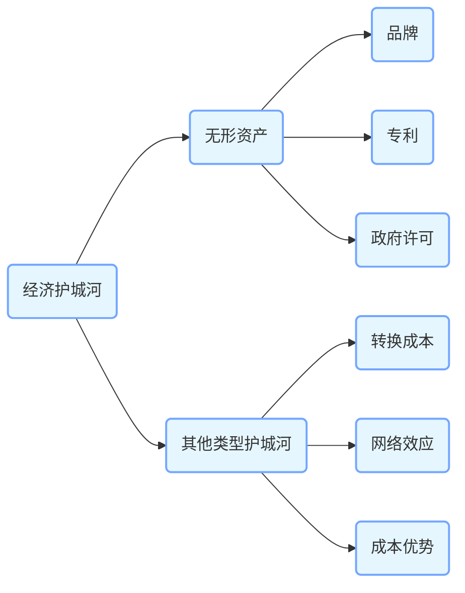

# 巴菲特 - 芒格的护城河理论：寻找持久竞争优势

> 关键词：巴菲特、芒格、护城河理论、持久竞争优势、企业分析、投资策略、经济护城河

> 摘要：本文深入探讨了巴菲特 - 芒格的护城河理论，旨在帮助投资者和企业管理者寻找具有持久竞争优势的企业。文章从背景介绍入手，阐述了该理论的目的、适用范围、预期读者以及文档结构。接着详细解析了护城河理论的核心概念与联系，包括各种类型的护城河及其原理和架构，并通过 Mermaid 流程图进行直观展示。深入讲解了相关核心算法原理和具体操作步骤，结合 Python 源代码进行详细阐述。同时给出了数学模型和公式，并举例说明其在实际中的应用。通过项目实战案例，从开发环境搭建到源代码实现和解读，展示了如何运用护城河理论进行企业分析。还介绍了该理论在实际中的应用场景，推荐了学习该理论的工具和资源，包括书籍、在线课程、技术博客、开发工具、框架以及相关论文著作等。最后对未来发展趋势与挑战进行总结，并提供常见问题解答和扩展阅读参考资料，为读者全面理解和应用护城河理论提供了系统而深入的指导。

## 1. 背景介绍 
### 1.1 目的和范围
巴菲特 - 芒格的护城河理论在投资领域具有极其重要的地位。该理论的主要目的是帮助投资者识别那些具有持久竞争优势的企业，从而为投资决策提供有力的依据。在当今复杂多变的商业环境中，企业面临着各种竞争和挑战，只有具备强大护城河的企业才能在长期的市场竞争中保持领先地位，为投资者带来稳定的回报。

本文章的范围涵盖了护城河理论的各个方面，包括核心概念的解析、算法原理的阐述、数学模型的构建、实际案例的分析以及在不同场景下的应用等。通过全面深入的探讨，旨在让读者对护城河理论有一个系统而清晰的认识，并能够将其应用到实际的投资和企业分析中。

### 1.2 预期读者
本文的预期读者主要包括两类人群。一类是投资者，无论是专业的机构投资者还是普通的个人投资者，都可以从本文中获取有价值的信息，帮助他们更好地筛选投资标的，提高投资决策的准确性和成功率。另一类是企业管理者，他们可以借鉴护城河理论来分析自身企业的竞争优势，发现潜在的问题，并制定相应的战略来巩固和扩大企业的护城河，提升企业的竞争力和市场地位。

### 1.3 文档结构概述
本文将按照以下结构进行阐述：首先介绍护城河理论的背景知识，包括目的、范围、预期读者和术语表等内容。接着深入探讨核心概念与联系，通过文本示意图和 Mermaid 流程图展示各种类型的护城河及其相互关系。然后详细讲解核心算法原理和具体操作步骤，并使用 Python 源代码进行说明。之后介绍数学模型和公式，并结合实际例子进行讲解。通过项目实战案例，展示如何运用护城河理论进行企业分析，包括开发环境搭建、源代码实现和代码解读。再介绍该理论在实际中的应用场景，推荐相关的学习工具和资源，包括书籍、在线课程、开发工具、框架以及论文著作等。最后对未来发展趋势与挑战进行总结，提供常见问题解答和扩展阅读参考资料。

### 1.4 术语表
#### 1.4.1 核心术语定义
- **经济护城河**：指企业所拥有的一种结构性竞争优势，这种优势可以保护企业的长期利润和市场份额，使其在竞争中脱颖而出，就像中世纪城堡周围的护城河可以抵御外敌入侵一样。具有经济护城河的企业能够在较长时间内保持高于行业平均水平的盈利能力。
- **无形资产**：包括品牌、专利、政府许可等非实物资产。品牌可以使企业的产品或服务在消费者心目中具有独特的价值和认知，从而吸引消费者购买；专利可以保护企业的技术创新，防止竞争对手模仿；政府许可则为企业进入某些特定行业或开展特定业务提供了合法的资格。
- **转换成本**：指消费者从使用一种产品或服务转换到使用另一种产品或服务时所面临的成本，包括时间成本、金钱成本、学习成本等。如果转换成本较高，消费者就不太愿意轻易更换产品或服务，从而为企业提供了一定的竞争优势。
- **网络效应**：指随着使用某一产品或服务的用户数量增加，该产品或服务对新用户的价值也会增加的现象。例如，社交网络平台上的用户越多，新用户加入后能够获得的社交价值就越大，从而吸引更多的用户加入，形成一个良性循环。
- **成本优势**：企业通过各种方式降低生产、运营等成本，使其产品或服务的价格低于竞争对手，从而在市场竞争中占据优势。成本优势可以来自于规模经济、独特的生产工艺、高效的供应链管理等方面。

#### 1.4.2 相关概念解释
- **可持续竞争优势**：与经济护城河密切相关，是指企业在长期内能够持续保持的竞争优势。这种优势不是短期的、偶然的，而是基于企业的核心竞争力和独特的资源配置，能够抵御竞争对手的挑战和市场环境的变化。
- **竞争壁垒**：是经济护城河的另一种表述方式，强调企业在市场竞争中所设置的障碍，阻止竞争对手进入或与自己竞争。竞争壁垒可以是技术、品牌、成本等方面的优势，使企业在市场中具有一定的垄断地位或相对优势。
- **超额收益**：指企业的投资回报率高于行业平均水平或市场平均水平的部分。具有经济护城河的企业通常能够获得超额收益，因为其竞争优势可以使其在市场中获得更高的利润和市场份额。

#### 1.4.3 缩略词列表
- **ROE**：Return on Equity，净资产收益率，是衡量企业盈利能力的重要指标之一，反映了企业运用自有资本获取收益的能力。计算公式为：$ROE = \frac{净利润}{净资产} \times 100\%$
- **ROIC**：Return on Invested Capital，投入资本回报率，用于衡量企业运用所有投入资本获取收益的能力，包括股东权益和债务资本。计算公式为：$ROIC = \frac{税后净营业利润}{投入资本} \times 100\%$

## 2. 核心概念与联系 

### 核心概念原理
巴菲特和芒格提出的护城河理论核心在于识别企业的持久竞争优势，这些优势就像城堡周围的护城河一样，保护企业免受竞争对手的攻击，确保企业能够长期稳定地盈利。以下是几种主要类型的护城河及其原理：

#### 无形资产护城河
- **品牌**：品牌是企业在消费者心目中的形象和声誉，是通过长期的广告宣传、产品质量保证、良好的客户服务等方式建立起来的。一个强大的品牌可以使消费者对企业的产品或服务产生信任和认同感，愿意为其支付更高的价格。例如，苹果公司的品牌在全球范围内具有极高的知名度和美誉度，消费者愿意为苹果产品支付较高的价格，即使市场上有其他性价比更高的产品。
- **专利**：专利是企业对其发明创造所享有的独占权，受到法律的保护。拥有专利的企业可以在一定期限内独家生产和销售受专利保护的产品或使用受专利保护的技术，从而避免竞争对手的模仿和抄袭，获得竞争优势。例如，制药公司研发出一种新的药物并获得专利后，可以在专利有效期内独家销售该药物，获取高额利润。
- **政府许可**：某些行业需要政府颁发的许可证才能开展业务，如金融、医疗、能源等行业。政府许可可以限制新企业的进入，减少市场竞争，使获得许可的企业在市场中具有一定的垄断地位。例如，银行需要获得银行业监管机构的许可才能开展业务，这使得银行行业的竞争相对较小。

#### 转换成本护城河
转换成本是消费者从使用一种产品或服务转换到使用另一种产品或服务时所面临的成本。如果转换成本较高，消费者就不太愿意轻易更换产品或服务，从而为企业提供了一定的竞争优势。例如，企业使用的企业资源规划（ERP）系统，一旦实施并投入使用，企业员工需要花费大量的时间和精力来学习和适应该系统。如果企业要更换 ERP 系统，不仅需要支付新系统的购买和实施费用，还需要重新培训员工，这将给企业带来巨大的成本和风险。因此，企业通常不会轻易更换 ERP 系统，为 ERP 系统供应商提供了转换成本护城河。

#### 网络效应护城河
网络效应是指随着使用某一产品或服务的用户数量增加，该产品或服务对新用户的价值也会增加的现象。网络效应可以形成一个良性循环，吸引更多的用户加入，从而使企业在市场中占据主导地位。例如，社交网络平台 Facebook，随着用户数量的不断增加，新用户加入后能够结识更多的朋友，获得更多的社交信息和资源，这使得 Facebook 对新用户的吸引力越来越大。同时，更多的用户也意味着更多的广告投放机会和更高的广告收入，进一步巩固了 Facebook 的市场地位。

#### 成本优势护城河
企业通过各种方式降低生产、运营等成本，使其产品或服务的价格低于竞争对手，从而在市场竞争中占据优势。成本优势可以来自于规模经济、独特的生产工艺、高效的供应链管理等方面。例如，沃尔玛通过大规模采购、高效的物流配送和先进的信息技术管理，降低了商品的采购成本和运营成本，使其能够以较低的价格销售商品，吸引了大量的消费者，成为全球最大的零售商之一。

### 架构的文本示意图
```plaintext
                 经济护城河
                    |
        +-----------------------+
        |                       |
     无形资产             其他类型护城河
        |                       |
 +------+------+           +----+----+
 |      |      |           |         |
品牌  专利  政府许可  转换成本  网络效应  成本优势
```

### Mermaid 流程图


## 3. 核心算法原理 & 具体操作步骤 

### 核心算法原理
在运用护城河理论进行企业分析时，我们可以通过一些财务指标和定性分析方法来评估企业的竞争优势。以下是几个重要的财务指标及其算法原理：

#### 净资产收益率（ROE）
ROE 是衡量企业盈利能力的重要指标之一，反映了企业运用自有资本获取收益的能力。其计算公式为：
$$ROE = \frac{净利润}{净资产} \times 100\%$$
ROE 越高，说明企业运用自有资本的效率越高，盈利能力越强。具有经济护城河的企业通常能够在较长时间内保持较高的 ROE 水平。

#### 投入资本回报率（ROIC）
ROIC 用于衡量企业运用所有投入资本获取收益的能力，包括股东权益和债务资本。其计算公式为：
$$ROIC = \frac{税后净营业利润}{投入资本} \times 100\%$$
ROIC 可以更全面地反映企业的盈利能力和资本利用效率。具有经济护城河的企业通常能够获得高于行业平均水平的 ROIC。

#### 毛利率
毛利率是指企业毛利占销售收入的百分比，反映了企业产品或服务的盈利能力。其计算公式为：
$$毛利率 = \frac{销售收入 - 销售成本}{销售收入} \times 100\%$$
毛利率越高，说明企业在产品或服务定价方面具有更大的优势，或者在成本控制方面做得更好。具有经济护城河的企业通常能够保持较高的毛利率水平。

### 具体操作步骤
以下是运用护城河理论进行企业分析的具体操作步骤，同时给出相应的 Python 代码示例：

#### 步骤 1：数据收集
首先需要收集企业的财务数据，包括净利润、净资产、税后净营业利润、投入资本、销售收入、销售成本等。可以通过金融数据网站（如东方财富网、同花顺等）或企业的年报来获取这些数据。

```python
import pandas as pd

# 假设我们已经从金融数据网站下载了某企业的财务数据，并保存为 CSV 文件
financial_data = pd.read_csv('financial_data.csv')

# 提取所需的财务数据
net_income = financial_data['净利润'].values
net_assets = financial_data['净资产'].values
nopat = financial_data['税后净营业利润'].values
invested_capital = financial_data['投入资本'].values
sales_revenue = financial_data['销售收入'].values
cost_of_sales = financial_data['销售成本'].values
```

#### 步骤 2：计算财务指标
根据收集到的财务数据，计算 ROE、ROIC 和毛利率等指标。

```python
# 计算 ROE
roe = (net_income / net_assets) * 100

# 计算 ROIC
roic = (nopat / invested_capital) * 100

# 计算毛利率
gross_margin = ((sales_revenue - cost_of_sales) / sales_revenue) * 100
```

#### 步骤 3：定性分析
除了计算财务指标外，还需要对企业进行定性分析，评估企业的无形资产、转换成本、网络效应和成本优势等方面的情况。可以通过查阅企业的年报、新闻报道、行业研究报告等资料来获取相关信息。

```python
# 假设我们已经对企业进行了定性分析，并得到了以下结果
# 无形资产得分（0 - 10 分）
intangible_assets_score = 8
# 转换成本得分（0 - 10 分）
switching_cost_score = 7
# 网络效应得分（0 - 10 分）
network_effect_score = 6
# 成本优势得分（0 - 10 分）
cost_advantage_score = 7
```

#### 步骤 4：综合评估
根据计算得到的财务指标和定性分析结果，对企业的竞争优势进行综合评估。可以为每个指标设定一定的权重，然后计算加权得分。

```python
# 设定各指标的权重
roe_weight = 0.3
roic_weight = 0.3
gross_margin_weight = 0.2
qualitative_score_weight = 0.2

# 计算财务指标的加权得分
financial_score = roe_weight * roe[-1] + roic_weight * roic[-1] + gross_margin_weight * gross_margin[-1]

# 计算定性分析的加权得分
qualitative_score = (intangible_assets_score + switching_cost_score + network_effect_score + cost_advantage_score) / 4

# 计算综合得分
overall_score = financial_score * financial_score_weight + qualitative_score * qualitative_score_weight

print(f"企业的综合得分为: {overall_score}")
```

通过以上步骤，我们可以对企业的竞争优势进行全面的评估，从而判断企业是否具有经济护城河。

## 4. 数学模型和公式 & 详细讲解 & 举例说明 

### 数学模型和公式
在评估企业的经济护城河时，我们可以构建一个综合评估模型，结合财务指标和定性分析结果来计算企业的综合得分。以下是该模型的数学公式：

$$综合得分 = 财务指标加权得分 \times 财务指标权重 + 定性分析加权得分 \times 定性分析权重$$

其中，财务指标加权得分可以通过以下公式计算：

$$财务指标加权得分 = ROE权重 \times ROE + ROIC权重 \times ROIC + 毛利率权重 \times 毛利率$$

定性分析加权得分可以通过以下公式计算：

$$定性分析加权得分 = \frac{无形资产得分 + 转换成本得分 + 网络效应得分 + 成本优势得分}{4}$$

### 详细讲解
- **财务指标加权得分**：通过计算 ROE、ROIC 和毛利率的加权平均值，反映企业的盈利能力和资本利用效率。不同的财务指标可以根据其重要性赋予不同的权重，一般来说，ROE 和 ROIC 可以赋予较高的权重，因为它们能够更全面地反映企业的盈利能力。
- **定性分析加权得分**：通过对企业的无形资产、转换成本、网络效应和成本优势等方面进行评分，并计算平均值，反映企业的定性竞争优势。这些方面的优势虽然难以用具体的财务指标来衡量，但对企业的长期发展至关重要。
- **综合得分**：将财务指标加权得分和定性分析加权得分按照一定的权重进行加权平均，得到企业的综合得分。综合得分越高，说明企业的竞争优势越强，具有经济护城河的可能性越大。

### 举例说明
假设我们要评估一家科技企业的经济护城河，收集到该企业的财务数据如下：

| 年份 | 净利润（万元） | 净资产（万元） | 税后净营业利润（万元） | 投入资本（万元） | 销售收入（万元） | 销售成本（万元） |
| ---- | ---- | ---- | ---- | ---- | ---- | ---- |
| 2022 | 5000 | 20000 | 4500 | 30000 | 20000 | 12000 |

根据以上数据，计算该企业 2022 年的财务指标：

$$ROE = \frac{5000}{20000} \times 100\% = 25\%$$

$$ROIC = \frac{4500}{30000} \times 100\% = 15\%$$

$$毛利率 = \frac{20000 - 12000}{20000} \times 100\% = 40\%$$

假设我们对该企业进行定性分析后，得到以下得分：

- 无形资产得分：7 分
- 转换成本得分：6 分
- 网络效应得分：5 分
- 成本优势得分：6 分

设定各指标的权重如下：

- ROE 权重：0.3
- ROIC 权重：0.3
- 毛利率权重：0.2
- 财务指标权重：0.8
- 定性分析权重：0.2

计算该企业的综合得分：

财务指标加权得分 = $0.3 \times 25 + 0.3 \times 15 + 0.2 \times 40 = 7.5 + 4.5 + 8 = 20$

定性分析加权得分 = $\frac{7 + 6 + 5 + 6}{4} = 6$

综合得分 = $20 \times 0.8 + 6 \times 0.2 = 16 + 1.2 = 17.2$

通过以上计算，我们可以得出该企业的综合得分为 17.2 分。根据得分情况，我们可以判断该企业具有一定的竞争优势，但仍有提升的空间。

## 5. 项目实战：代码实际案例和详细解释说明 

### 5.1  开发环境搭建
在进行项目实战之前，需要搭建相应的开发环境。以下是具体的步骤：

#### 安装 Python
首先需要安装 Python 编程语言，建议安装 Python 3.7 及以上版本。可以从 Python 官方网站（https://www.python.org/downloads/）下载适合自己操作系统的安装包，并按照安装向导进行安装。

#### 安装必要的库
在 Python 中，我们需要使用一些第三方库来处理数据和进行分析，如 Pandas、Numpy 等。可以使用以下命令来安装这些库：

```bash
pip install pandas numpy
```

#### 准备数据
从金融数据网站（如东方财富网、同花顺等）下载企业的财务数据，并保存为 CSV 文件。确保 CSV 文件包含所需的财务数据列，如净利润、净资产、税后净营业利润、投入资本、销售收入、销售成本等。

### 5.2  源代码详细实现和代码解读
以下是一个完整的 Python 代码示例，用于运用护城河理论对企业进行分析：

```python
import pandas as pd
import numpy as np

# 步骤 1：数据收集
# 读取 CSV 文件
financial_data = pd.read_csv('financial_data.csv')

# 提取所需的财务数据
net_income = financial_data['净利润'].values
net_assets = financial_data['净资产'].values
nopat = financial_data['税后净营业利润'].values
invested_capital = financial_data['投入资本'].values
sales_revenue = financial_data['销售收入'].values
cost_of_sales = financial_data['销售成本'].values

# 步骤 2：计算财务指标
# 计算 ROE
roe = (net_income / net_assets) * 100

# 计算 ROIC
roic = (nopat / invested_capital) * 100

# 计算毛利率
gross_margin = ((sales_revenue - cost_of_sales) / sales_revenue) * 100

# 步骤 3：定性分析
# 假设我们已经对企业进行了定性分析，并得到了以下结果
# 无形资产得分（0 - 10 分）
intangible_assets_score = 8
# 转换成本得分（0 - 10 分）
switching_cost_score = 7
# 网络效应得分（0 - 10 分）
network_effect_score = 6
# 成本优势得分（0 - 10 分）
cost_advantage_score = 7

# 步骤 4：综合评估
# 设定各指标的权重
roe_weight = 0.3
roic_weight = 0.3
gross_margin_weight = 0.2
financial_score_weight = 0.8
qualitative_score_weight = 0.2

# 计算财务指标的加权得分
financial_score = roe_weight * roe[-1] + roic_weight * roic[-1] + gross_margin_weight * gross_margin[-1]

# 计算定性分析的加权得分
qualitative_score = (intangible_assets_score + switching_cost_score + network_effect_score + cost_advantage_score) / 4

# 计算综合得分
overall_score = financial_score * financial_score_weight + qualitative_score * qualitative_score_weight

print(f"企业的综合得分为: {overall_score}")
```

### 代码解读与分析
- **数据收集部分**：使用 Pandas 库的 `read_csv` 函数读取保存企业财务数据的 CSV 文件，并提取所需的财务数据列。
- **财务指标计算部分**：根据前面介绍的公式，使用 Numpy 数组进行向量化计算，分别计算 ROE、ROIC 和毛利率。
- **定性分析部分**：假设我们已经对企业进行了定性分析，并得到了无形资产、转换成本、网络效应和成本优势等方面的得分。
- **综合评估部分**：设定各指标的权重，计算财务指标的加权得分和定性分析的加权得分，最后计算企业的综合得分。

通过以上代码，我们可以对企业的竞争优势进行全面的评估，从而判断企业是否具有经济护城河。

## 6. 实际应用场景 
### 投资领域
在投资领域，护城河理论是投资者筛选投资标的的重要工具。投资者可以运用该理论分析企业的竞争优势，寻找那些具有经济护城河的企业进行投资。具有经济护城河的企业通常能够在长期内保持稳定的盈利能力和市场份额，为投资者带来稳定的回报。例如，巴菲特通过运用护城河理论，投资了可口可乐、富国银行等具有强大护城河的企业，获得了丰厚的收益。

### 企业战略规划
对于企业管理者来说，护城河理论可以帮助他们分析自身企业的竞争优势，发现潜在的问题，并制定相应的战略来巩固和扩大企业的护城河。例如，企业可以通过加强品牌建设、研发新技术、优化供应链管理等方式来提升自身的无形资产、转换成本、网络效应和成本优势，从而增强企业的竞争力和市场地位。

### 行业分析
在进行行业分析时，护城河理论可以帮助分析师了解行业内企业的竞争格局和竞争态势。通过分析行业内企业的护城河情况，分析师可以判断哪些企业具有较强的竞争优势，哪些企业面临较大的竞争压力，从而为行业投资和企业战略决策提供参考。

## 7. 工具和资源推荐
### 7.1 学习资源推荐
#### 7.1.1 书籍推荐
- 《巴菲特的护城河》：作者是帕特·多尔西，这本书是关于护城河理论的经典著作，详细介绍了护城河理论的概念、类型和分析方法，并通过大量的案例进行了说明。
- 《穷查理宝典：查理·芒格的智慧箴言录》：这本书收录了查理·芒格的演讲、文章和名言等内容，从中可以了解到芒格的投资思想和哲学，包括护城河理论的相关观点。
- 《聪明的投资者》：作者是本杰明·格雷厄姆，这本书是价值投资的经典之作，对巴菲特和芒格的投资思想产生了深远的影响。书中介绍了价值投资的基本原理和方法，与护城河理论有一定的关联。

#### 7.1.2 在线课程
- Coursera 上的“投资学原理”课程：该课程由知名大学的教授授课，介绍了投资学的基本原理和方法，包括企业分析和估值等内容，与护城河理论有一定的结合。
- 网易云课堂上的“价值投资实战训练营”：该课程由投资领域的专家授课，通过实际案例讲解价值投资的方法和技巧，其中包括运用护城河理论进行企业分析的内容。

#### 7.1.3 技术博客和网站
- 雪球网：是一个投资社区，上面有很多投资者分享自己的投资经验和分析报告，其中不乏运用护城河理论进行企业分析的内容。
- 东方财富网：是一个金融信息网站，提供丰富的企业财务数据和行业研究报告，有助于投资者运用护城河理论进行企业分析。

### 7.2 开发工具框架推荐
#### 7.2.1 IDE和编辑器
- PyCharm：是一款专业的 Python 集成开发环境，提供了丰富的代码编辑、调试和分析功能，适合用于开发和运行运用护城河理论进行企业分析的 Python 代码。
- Jupyter Notebook：是一个交互式的开发环境，支持 Python 等多种编程语言。可以方便地进行数据处理、分析和可视化，适合用于探索性数据分析和模型验证。

#### 7.2.2 调试和性能分析工具
- PDB：是 Python 自带的调试工具，可以帮助开发者在代码运行过程中进行调试，查找和解决问题。
- cProfile：是 Python 自带的性能分析工具，可以分析代码的运行时间和函数调用情况，帮助开发者优化代码性能。

#### 7.2.3 相关框架和库
- Pandas：是一个强大的数据处理和分析库，提供了丰富的数据结构和函数，适合用于处理和分析企业的财务数据。
- Numpy：是一个用于科学计算的库，提供了高效的数组和矩阵运算功能，适合用于进行财务指标的计算。

### 7.3 相关论文著作推荐
#### 7.3.1 经典论文
- 《The Theory of Economic Development》（《经济发展理论》）：作者是约瑟夫·熊彼特，这本书提出了创新理论和创造性破坏的概念，对理解企业的竞争优势和经济发展有重要的启示。
- 《Competitive Advantage: Creating and Sustaining Superior Performance》（《竞争优势：创造与保持卓越绩效》）：作者是迈克尔·波特，这本书提出了波特五力模型和价值链分析等理论，对企业战略和竞争优势的研究有重要的影响。

#### 7.3.2 最新研究成果
- 可以通过学术数据库（如知网、万方、Web of Science 等）搜索关于护城河理论和企业竞争优势的最新研究论文，了解该领域的最新研究动态和成果。

#### 7.3.3 应用案例分析
- 可以通过商业杂志（如《哈佛商业评论》、《财富》等）和企业年报等渠道获取关于企业运用护城河理论进行战略规划和投资决策的应用案例分析，从中学习实际应用经验。

## 8. 总结：未来发展趋势与挑战
### 未来发展趋势
- **数字化转型带来新的护城河**：随着数字化技术的快速发展，企业可以通过数字化转型构建新的护城河。例如，通过大数据分析和人工智能技术，企业可以更好地了解消费者需求，提供个性化的产品和服务，从而提升客户满意度和忠诚度。同时，数字化平台的网络效应也可以为企业带来更大的竞争优势。
- **可持续发展成为重要的护城河**：在当今社会，可持续发展已经成为企业发展的重要趋势。具有良好环境、社会和治理（ESG）表现的企业更容易获得消费者的认可和投资者的青睐，从而形成可持续发展的护城河。例如，一些企业通过采用清洁能源、减少碳排放等方式，提升了企业的社会形象和品牌价值。
- **跨界竞争加剧，护城河的边界变得模糊**：随着科技的发展和行业的融合，跨界竞争越来越激烈。传统行业的企业可能会面临来自新兴行业的竞争，而新兴行业的企业也可能会进入传统行业。这使得企业的护城河边界变得模糊，需要不断创新和拓展，以适应新的竞争环境。

### 挑战
- **技术变革带来的挑战**：科技的快速发展使得技术变革日新月异，企业的护城河可能会因为新技术的出现而受到挑战。例如，互联网技术的发展使得传统零售企业的实体店优势受到冲击，需要企业不断进行技术创新和转型，以保持竞争优势。
- **市场竞争加剧**：随着全球经济的一体化和市场的开放，企业面临的市场竞争越来越激烈。竞争对手可能会通过模仿、降价等方式来削弱企业的护城河，企业需要不断提升自身的核心竞争力，以应对市场竞争的挑战。
- **人才短缺**：构建和维护企业的护城河需要具备专业知识和技能的人才。然而，目前市场上相关的专业人才短缺，企业需要加大人才培养和引进的力度，以满足企业发展的需求。

## 9. 附录：常见问题与解答
### 问题 1：如何判断企业的护城河是否可持续？
解答：判断企业的护城河是否可持续需要从多个方面进行分析。首先，要分析企业的核心竞争力是否具有独特性和难以模仿性，如品牌、专利等。其次，要关注行业的发展趋势和技术变革，判断企业的护城河是否能够适应新的市场环境。此外，还可以通过分析企业的财务指标，如 ROE、ROIC 等，来判断企业的盈利能力是否稳定。

### 问题 2：护城河理论是否适用于所有行业？
解答：护城河理论适用于大多数行业，但不同行业的护城河类型和表现形式可能会有所不同。例如，在科技行业，技术创新和专利可能是企业的重要护城河；而在消费品行业，品牌和渠道可能是企业的关键护城河。因此，在运用护城河理论进行企业分析时，需要结合行业特点进行具体分析。

### 问题 3：如何量化企业的护城河？
解答：可以通过一些财务指标和定性分析方法来量化企业的护城河。财务指标如 ROE、ROIC、毛利率等可以反映企业的盈利能力和资本利用效率，而定性分析可以评估企业的无形资产、转换成本、网络效应和成本优势等方面的情况。通过为每个指标设定一定的权重，计算加权得分，可以得到企业的综合得分，从而量化企业的护城河。

## 10. 扩展阅读 & 参考资料
### 扩展阅读
- 《创新者的窘境》：作者是克莱顿·克里斯坦森，这本书探讨了企业在面对技术变革和市场竞争时的困境和应对策略，与护城河理论有一定的关联。
- 《从优秀到卓越》：作者是吉姆·柯林斯，这本书研究了一些从优秀企业成长为卓越企业的案例，分析了这些企业的成功因素，对理解企业的竞争优势和发展有一定的启示。

### 参考资料
- 帕特·多尔西. 《巴菲特的护城河》. 机械工业出版社.
- 查理·芒格. 《穷查理宝典：查理·芒格的智慧箴言录》. 中信出版社.
- 本杰明·格雷厄姆. 《聪明的投资者》. 人民邮电出版社.
- 约瑟夫·熊彼特. 《经济发展理论》. 商务印书馆.
- 迈克尔·波特. 《竞争优势：创造与保持卓越绩效》. 华夏出版社.