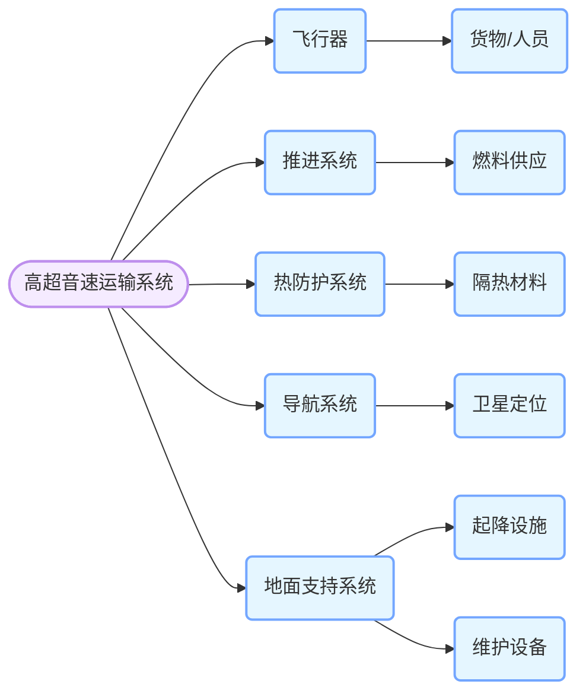

# 巴菲特 - 芒格的高超音速运输投资：重塑全球物流网络

> 关键词：巴菲特、芒格、高超音速运输、全球物流网络、投资、技术变革、行业重塑

> 摘要：本文聚焦于巴菲特和芒格对高超音速运输领域的投资行为及其影响。首先介绍了高超音速运输的背景和相关概念，深入剖析了其核心技术原理与具体操作步骤。接着阐述了该领域涉及的数学模型和公式，并结合实际案例进行说明。通过项目实战部分，展示了高超音速运输在物流网络中的应用代码及详细解读。探讨了其实际应用场景，推荐了相关的学习资源、开发工具和论文著作。最后总结了高超音速运输的未来发展趋势与挑战，解答常见问题并提供扩展阅读和参考资料，旨在全面呈现巴菲特 - 芒格投资高超音速运输对全球物流网络重塑的重大意义。

## 1. 背景介绍 
### 1.1 目的和范围
本文旨在深入研究巴菲特和芒格对高超音速运输领域的投资决策及其对全球物流网络的潜在影响。范围涵盖高超音速运输的技术原理、发展现状、投资逻辑、实际应用场景以及未来发展趋势等多个方面。通过对这些内容的探讨，帮助读者全面了解这一投资行为背后的战略意义和行业变革潜力。

### 1.2 预期读者
本文预期读者包括金融投资者、物流行业从业者、科技爱好者、研究学者以及对全球经济和技术发展趋势感兴趣的人士。希望为他们提供有价值的信息和深入的思考，帮助他们更好地理解高超音速运输领域的投资机会和行业发展前景。

### 1.3 文档结构概述
本文将按照以下结构展开：首先介绍高超音速运输的背景知识和相关概念，包括术语定义和概念解释；接着深入探讨其核心技术原理、具体操作步骤以及涉及的数学模型和公式；通过项目实战部分展示实际应用中的代码案例和详细解读；分析高超音速运输的实际应用场景；推荐相关的学习资源、开发工具和论文著作；总结未来发展趋势与挑战；解答常见问题并提供扩展阅读和参考资料。

### 1.4 术语表
#### 1.4.1 核心术语定义
- **高超音速**：一般指物体的飞行速度超过5倍音速（约6174公里/小时），在这个速度下，物体与空气的相互作用会产生一系列特殊的物理现象。
- **高超音速运输**：利用高超音速技术实现人员或货物的快速运输，具有速度快、效率高的特点。
- **全球物流网络**：由多个物流节点和运输线路组成的覆盖全球的物流系统，旨在实现货物的高效流通和配送。

#### 1.4.2 相关概念解释
- **空气动力学**：研究物体在空气中运动时所受的力和运动规律的学科，对于高超音速运输至关重要，因为在高超音速飞行中，空气动力学特性会发生显著变化。
- **推进系统**：为高超音速飞行器提供动力的系统，常见的有冲压发动机、超燃冲压发动机等，其性能直接影响飞行器的速度和航程。
- **热防护系统**：由于高超音速飞行时与空气的摩擦会产生极高的温度，热防护系统用于保护飞行器结构不受高温破坏，确保飞行安全。

#### 1.4.3 缩略词列表
- **HST**：高超音速运输（Hypersonic Transportation）
- **RAMJET**：冲压发动机（Ramjet Engine）
- **SCRAMJET**：超燃冲压发动机（Scramjet Engine）

## 2. 核心概念与联系 
### 高超音速运输的核心概念原理
高超音速运输的核心在于实现飞行器以超过5倍音速的速度飞行。其原理基于先进的空气动力学和推进系统技术。在空气动力学方面，高超音速飞行器需要设计特殊的外形，以减少空气阻力并提高升力。例如，采用尖锐的头部和细长的机身，能够降低激波阻力，提高飞行效率。

推进系统是高超音速运输的关键。冲压发动机和超燃冲压发动机是常用的推进方式。冲压发动机通过高速气流进入发动机后减速增压，与燃料混合燃烧产生推力。超燃冲压发动机则在更高的速度下工作，允许气流在发动机内以超音速状态燃烧，从而产生更大的推力。

### 架构的文本示意图
高超音速运输系统主要由飞行器、推进系统、热防护系统、导航系统和地面支持系统组成。飞行器是运输的载体，推进系统提供飞行动力，热防护系统保护飞行器免受高温损害，导航系统确保飞行器准确飞行，地面支持系统负责飞行器的起降、维护和管理。

### Mermaid 流程图


## 3. 核心算法原理 & 具体操作步骤 
### 空气动力学算法原理
在高超音速飞行中，空气动力学计算是关键。其中，激波理论是重要的基础。激波是由于物体在空气中以超音速运动时，空气受到强烈压缩而形成的。激波的强度和形状会影响飞行器的阻力和升力。

以下是一个简单的Python代码示例，用于计算激波角：
```python
import math

def shock_angle(mach_number, gamma=1.4):
    """
    计算激波角
    :param mach_number: 马赫数
    :param gamma: 比热比，一般空气取1.4
    :return: 激波角（弧度）
    """
    beta = math.asin(1 / mach_number)
    return beta

# 示例：计算马赫数为6时的激波角
mach = 6
shock_angle_result = shock_angle(mach)
print(f"马赫数为 {mach} 时的激波角为 {math.degrees(shock_angle_result)} 度")
```
### 推进系统算法原理
推进系统的性能计算涉及到热力学和流体力学原理。以冲压发动机为例，其推力计算可以通过以下公式：
$F = \dot{m}_e V_e - \dot{m}_a V_a + (p_e - p_a)A_e$
其中，$F$ 是推力，$\dot{m}_e$ 和 $\dot{m}_a$ 分别是发动机出口和进口的质量流量，$V_e$ 和 $V_a$ 分别是发动机出口和进口的速度，$p_e$ 和 $p_a$ 分别是发动机出口和进口的压力，$A_e$ 是发动机出口面积。

以下是一个简单的Python代码示例，用于计算冲压发动机的推力：
```python
def ramjet_thrust(m_dot_e, V_e, m_dot_a, V_a, p_e, p_a, A_e):
    """
    计算冲压发动机的推力
    :param m_dot_e: 发动机出口质量流量（kg/s）
    :param V_e: 发动机出口速度（m/s）
    :param m_dot_a: 发动机进口质量流量（kg/s）
    :param V_a: 发动机进口速度（m/s）
    :param p_e: 发动机出口压力（Pa）
    :param p_a: 发动机进口压力（Pa）
    :param A_e: 发动机出口面积（m²）
    :return: 推力（N）
    """
    thrust = m_dot_e * V_e - m_dot_a * V_a + (p_e - p_a) * A_e
    return thrust

# 示例参数
m_dot_e = 100
V_e = 2000
m_dot_a = 80
V_a = 500
p_e = 100000
p_a = 50000
A_e = 1

thrust_result = ramjet_thrust(m_dot_e, V_e, m_dot_a, V_a, p_e, p_a, A_e)
print(f"冲压发动机的推力为 {thrust_result} N")
```
### 具体操作步骤
1. **飞行器设计**：根据运输需求和技术要求，设计飞行器的外形、结构和尺寸。
2. **推进系统选型和设计**：选择合适的推进系统，如冲压发动机或超燃冲压发动机，并进行详细设计。
3. **热防护系统设计**：根据飞行器的飞行速度和航程，设计热防护系统，选择合适的隔热材料。
4. **导航系统集成**：将导航系统集成到飞行器中，确保飞行器能够准确飞行。
5. **地面支持系统建设**：建设飞行器的起降设施和维护设备，确保飞行器的正常运行。
6. **飞行测试和优化**：进行飞行测试，根据测试结果对飞行器和系统进行优化和改进。

## 4. 数学模型和公式 & 详细讲解 & 举例说明 
### 空气动力学数学模型
在高超音速空气动力学中，常用的数学模型包括欧拉方程和纳维 - 斯托克斯方程。欧拉方程是描述无粘性流体运动的基本方程，其形式为：
$$\frac{\partial \mathbf{U}}{\partial t} + \frac{\partial \mathbf{F}}{\partial x} + \frac{\partial \mathbf{G}}{\partial y} + \frac{\partial \mathbf{H}}{\partial z} = 0$$
其中，$\mathbf{U}$ 是守恒变量向量，$\mathbf{F}$、$\mathbf{G}$ 和 $\mathbf{H}$ 是通量向量。

纳维 - 斯托克斯方程则考虑了流体的粘性，其形式更为复杂。在实际应用中，通常会根据具体情况对这些方程进行简化和求解。

### 推进系统数学模型
推进系统的数学模型主要基于热力学和流体力学原理。以冲压发动机为例，其性能计算涉及到以下几个关键公式：
- **质量流量公式**：$\dot{m} = \rho A V$，其中 $\dot{m}$ 是质量流量，$\rho$ 是流体密度，$A$ 是流道面积，$V$ 是流体速度。
- **能量方程**：$h_1 + \frac{V_1^2}{2} = h_2 + \frac{V_2^2}{2}$，其中 $h$ 是焓，$V$ 是速度。

### 举例说明
假设一个冲压发动机的进口条件为：空气密度 $\rho_1 = 1.2 kg/m^3$，进口速度 $V_1 = 500 m/s$，进口面积 $A_1 = 1 m^2$。出口条件为：空气密度 $\rho_2 = 0.8 kg/m^3$，出口速度 $V_2 = 2000 m/s$，出口面积 $A_2 = 0.5 m^2$。

1. **计算进口质量流量**：
$\dot{m}_1 = \rho_1 A_1 V_1 = 1.2 \times 1 \times 500 = 600 kg/s$
2. **计算出口质量流量**：
$\dot{m}_2 = \rho_2 A_2 V_2 = 0.8 \times 0.5 \times 2000 = 800 kg/s$
3. **计算推力（假设进出口压力差忽略不计）**：
$F = \dot{m}_2 V_2 - \dot{m}_1 V_1 = 800 \times 2000 - 600 \times 500 = 1600000 - 300000 = 1300000 N$

## 5. 项目实战：代码实际案例和详细解释说明 
### 5.1  开发环境搭建
为了实现一个简单的高超音速运输模拟项目，我们可以使用Python语言和相关的科学计算库。以下是开发环境的搭建步骤：
1. **安装Python**：从Python官方网站（https://www.python.org/downloads/）下载并安装Python 3.x版本。
2. **安装科学计算库**：使用pip命令安装NumPy、Matplotlib等库。
```sh
pip install numpy matplotlib
```

### 5.2  源代码详细实现和代码解读
以下是一个简单的高超音速飞行器飞行轨迹模拟代码：
```python
import numpy as np
import matplotlib.pyplot as plt

# 定义常量
G = 6.67430e-11  # 万有引力常量
M = 5.972e24  # 地球质量
R = 6371000  # 地球半径
V0 = 7000  # 初始速度（m/s）
theta0 = np.radians(30)  # 初始发射角度（弧度）
t_max = 3600  # 模拟时间（s）
dt = 0.1  # 时间步长（s）

# 初始化变量
t = np.arange(0, t_max, dt)
x = np.zeros_like(t)
y = np.zeros_like(t)
vx = V0 * np.cos(theta0)
vy = V0 * np.sin(theta0)
x[0] = 0
y[0] = R

# 模拟飞行轨迹
for i in range(1, len(t)):
    r = np.sqrt(x[i - 1] ** 2 + y[i - 1] ** 2)
    ax = -G * M * x[i - 1] / r ** 3
    ay = -G * M * y[i - 1] / r ** 3
    vx += ax * dt
    vy += ay * dt
    x[i] = x[i - 1] + vx * dt
    y[i] = y[i - 1] + vy * dt

# 绘制飞行轨迹
plt.figure(figsize=(10, 8))
plt.plot(x / 1000, y / 1000)
plt.xlabel('X (km)')
plt.ylabel('Y (km)')
plt.title('Hypersonic Vehicle Flight Trajectory')
plt.grid(True)
plt.show()
```
### 5.3  代码解读与分析
1. **常量定义**：定义了万有引力常量、地球质量、地球半径、初始速度、初始发射角度、模拟时间和时间步长等常量。
2. **变量初始化**：初始化时间数组、位置数组和速度变量。
3. **模拟飞行轨迹**：使用欧拉法进行数值积分，根据牛顿万有引力定律计算加速度，更新速度和位置。
4. **绘制飞行轨迹**：使用Matplotlib库绘制飞行器的飞行轨迹。

通过这个代码示例，我们可以模拟高超音速飞行器的飞行轨迹，了解其在地球引力场中的运动规律。

## 6. 实际应用场景 
### 全球物流运输
高超音速运输将极大地缩短货物的运输时间。例如，从亚洲到美洲的货物运输，传统的海运需要数周时间，而高超音速运输可能只需要几个小时。这将大大提高物流效率，降低库存成本，促进全球贸易的发展。

### 紧急救援和医疗运输
在紧急救援和医疗运输方面，高超音速运输可以快速将救援人员和医疗物资送达灾区或急需的地方。对于一些危重症患者的转运，能够争取宝贵的治疗时间，提高救治成功率。

### 太空探索
高超音速运输技术也可以为太空探索提供支持。例如，作为太空飞行器的第一级，将有效载荷快速送入太空，降低太空发射成本。

### 军事应用
在军事领域，高超音速运输可以实现快速的兵力投送和战略物资运输，提高军队的反应速度和作战能力。

## 7. 工具和资源推荐
### 7.1 学习资源推荐
#### 7.1.1 书籍推荐
- 《空气动力学基础》：全面介绍了空气动力学的基本原理和应用，是学习高超音速空气动力学的重要参考书籍。
- 《航空航天推进系统》：详细讲解了各种航空航天推进系统的原理和设计，对于了解高超音速推进系统有很大帮助。
- 《计算流体力学基础与应用》：介绍了计算流体力学的基本方法和应用，可用于高超音速空气动力学的数值模拟。

#### 7.1.2 在线课程
- Coursera上的“航空航天工程基础”课程：由知名高校教授授课，系统介绍航空航天工程的基础知识，包括空气动力学、推进系统等。
- edX上的“高超音速飞行技术”课程：专门讲解高超音速飞行的相关技术和研究进展。

#### 7.1.3 技术博客和网站
- NASA官方网站：提供了大量关于航空航天技术的研究成果和最新动态，包括高超音速飞行的相关信息。
- AIAA（美国航空航天学会）官网：发布航空航天领域的最新研究论文和技术报告。

### 7.2 开发工具框架推荐
#### 7.2.1 IDE和编辑器
- PyCharm：功能强大的Python集成开发环境，适合进行高超音速运输相关的Python代码开发。
- Visual Studio Code：轻量级的代码编辑器，支持多种编程语言，可用于编写和调试代码。

#### 7.2.2 调试和性能分析工具
- Numba：用于加速Python代码的工具，可提高数值计算的性能。
- Profiler：Python自带的性能分析工具，可帮助找出代码中的性能瓶颈。

#### 7.2.3 相关框架和库
- NumPy：用于科学计算的Python库，提供了高效的数组操作和数学函数。
- Matplotlib：用于绘制图表和可视化数据的Python库，可用于展示高超音速运输模拟结果。

### 7.3 相关论文著作推荐
#### 7.3.1 经典论文
- “Hypersonic Aerodynamics: From Shock Waves to Scramjets”：详细介绍了高超音速空气动力学的发展历程和关键技术。
- “Advances in Hypersonic Propulsion Systems”：综述了高超音速推进系统的研究进展和未来发展趋势。

#### 7.3.2 最新研究成果
- 关注AIAA Journal、Journal of Propulsion and Power等学术期刊，获取高超音速运输领域的最新研究成果。

#### 7.3.3 应用案例分析
- 研究NASA的高超音速飞行试验项目，了解高超音速运输技术在实际应用中的挑战和解决方案。

## 8. 总结：未来发展趋势与挑战
### 未来发展趋势
- **技术不断进步**：随着材料科学、空气动力学和推进系统技术的不断发展，高超音速运输的速度和效率将不断提高。
- **商业应用拓展**：高超音速运输将逐渐从军事和科研领域向商业领域拓展，如全球物流、旅游等。
- **国际合作加强**：高超音速运输技术的研发需要大量的资金和资源，国际合作将成为未来发展的趋势。

### 挑战
- **技术难题**：高超音速飞行面临着高温、高阻力、强激波等技术难题，需要进一步研究和解决。
- **安全问题**：高超音速运输的安全性是一个重要问题，需要建立完善的安全保障体系。
- **法规和政策**：目前还缺乏针对高超音速运输的相关法规和政策，需要政府和国际组织制定相应的规范。

## 9. 附录：常见问题与解答
### 高超音速运输的成本是否很高？
目前高超音速运输的研发和运营成本较高，主要原因是技术难度大、材料成本高。但随着技术的不断进步和规模的扩大，成本有望逐渐降低。

### 高超音速运输是否安全？
高超音速运输面临着一些安全挑战，如高温、高阻力等。但通过先进的技术和严格的安全措施，可以确保其安全性。目前，相关的研究和试验正在不断进行，以提高其安全性能。

### 高超音速运输对环境有什么影响？
高超音速运输在飞行过程中会产生一定的噪音和尾气排放。但随着技术的发展，新型的推进系统和材料的应用，有望减少其对环境的影响。

## 10. 扩展阅读 & 参考资料
### 扩展阅读
- 《未来交通：从高铁到星际旅行》：探讨了未来交通的发展趋势，包括高超音速运输等前沿技术。
- 《科技革命与产业变革》：分析了科技革命对产业变革的影响，高超音速运输可能带来的物流行业变革是其中的重要内容。

### 参考资料
- AIAA官方网站：https://www.aiaa.org/
- NASA官方网站：https://www.nasa.gov/
- 相关学术期刊和会议论文

以上就是关于“巴菲特 - 芒格的高超音速运输投资：重塑全球物流网络”的详细内容，希望对读者有所帮助。 