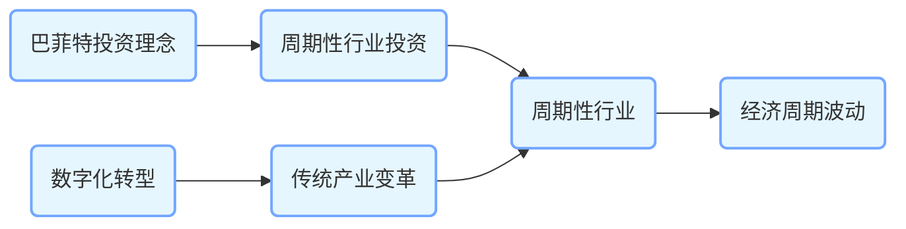

# 巴菲特的周期性行业投资：数字化转型中的传统产业机遇

> 关键词：巴菲特、周期性行业、数字化转型、传统产业、投资机遇、价值投资、经济周期

> 摘要：本文深入探讨了巴菲特在周期性行业的投资理念与策略，结合当下数字化转型的时代背景，分析传统产业在这一过程中所面临的机遇。通过对核心概念的阐述、投资算法原理的解析、数学模型的构建、实际案例的剖析，揭示了在数字化浪潮下传统周期性行业如何实现价值重塑以及投资者应如何把握其中的投资机会。同时，介绍了相关的学习资源、开发工具与研究成果，最后对未来发展趋势与挑战进行总结，并提供常见问题解答与参考资料，旨在为投资者和行业从业者提供全面且深入的思考与指导。

## 1. 背景介绍 
### 1.1 目的和范围
本研究的目的在于深入剖析巴菲特在周期性行业的投资逻辑，并结合当前数字化转型的大趋势，探寻传统产业在这一变革中所蕴含的投资机遇。研究范围涵盖了周期性行业的定义、特点，数字化转型对传统产业的影响机制，以及如何运用巴菲特的投资理念来评估和把握这些机遇。同时，通过实际案例分析和理论探讨，为投资者和相关行业从业者提供决策参考和实践指导。

### 1.2 预期读者
本文预期读者包括对投资领域感兴趣的个人投资者、金融行业从业者、企业管理者以及相关领域的研究人员。对于个人投资者，希望能够帮助他们更好地理解周期性行业的投资特点和数字化转型带来的机会，提升投资决策的准确性；对于金融行业从业者，提供新的投资思路和行业分析视角；对于企业管理者，有助于他们把握行业发展趋势，制定合理的企业战略；对于研究人员，为相关领域的学术研究提供参考和启示。

### 1.3 文档结构概述
本文将按照以下结构展开：首先介绍核心概念，明确周期性行业、数字化转型等相关概念的内涵与联系；接着阐述巴菲特在周期性行业投资的核心算法原理和具体操作步骤，通过Python代码进行详细说明；然后构建数学模型和公式，对投资决策进行量化分析并举例说明；之后通过实际项目案例展示如何在数字化转型中挖掘传统产业的投资机会；再介绍周期性行业投资和数字化转型相关的实际应用场景；推荐相关的学习资源、开发工具和研究成果；最后总结未来发展趋势与挑战，提供常见问题解答和参考资料。

### 1.4 术语表
#### 1.4.1 核心术语定义
- **周期性行业**：指和国内或国际经济波动相关性较强的行业，其盈利状况随着经济周期的变化而呈现周期性波动。常见的周期性行业包括钢铁、有色金属、化工等基础大宗原材料行业，水泥等建筑材料行业，工程机械、机床、重型卡车、装备制造等资本集约性领域。
- **数字化转型**：是建立在数字化转换、数字化升级基础上， 进一步触及公司核心业务，以新建一种商业模式为目标的高层次转型。数字化转型是开发数字化技术及支持能力以新建一个富有活力的数字化商业模式。
- **价值投资**：一种常见的投资方式，专门寻找价格低估的证券。该理论认为，股票价格围绕“内在价值”上下波动，而内在价值可以用一定方法测定；股票价格长期来看有向“内在价值”回归的趋势；当股票价格低于内在价值时，就出现了投资机会。

#### 1.4.2 相关概念解释
- **经济周期**：也称商业周期、景气循环， 它是指经济运行中周期性出现的经济扩张与经济紧缩交替更迭、循环往复的一种现象。经济周期一般分为繁荣、衰退、萧条和复苏四个阶段。
- **护城河**：在价值投资理论中，“护城河”是指企业抵御竞争对手的可持续竞争优势。这种优势可以表现为品牌优势、成本优势、技术优势、网络效应等，使企业在市场竞争中能够长期保持领先地位并获取超额利润。

#### 1.4.3 缩略词列表
- **GDP**：国内生产总值（Gross Domestic Product），是一个国家（或地区）所有常住单位在一定时期内生产活动的最终成果。
- **ROE**：净资产收益率（Return on Equity），是净利润与平均股东权益的百分比，是公司税后利润除以净资产得到的百分比率，该指标反映股东权益的收益水平，用以衡量公司运用自有资本的效率。

## 2. 核心概念与联系 

### 2.1 周期性行业的特点与分类
周期性行业的特点主要体现在其与经济周期的高度相关性。在经济繁荣阶段，市场需求旺盛，周期性行业的产品或服务销量大增，企业盈利水平显著提高；而在经济衰退阶段，需求萎缩，企业面临产能过剩、价格下跌等问题，盈利水平大幅下降。

根据行业与经济周期的关联程度和性质，周期性行业可以分为以下几类：
- **强周期性行业**：这类行业对经济周期的敏感度极高，如钢铁、汽车等行业。经济繁荣时，建筑、基础设施建设等领域对钢铁的需求大增，推动钢铁企业的产量和价格上升；经济衰退时，需求骤减，钢铁企业面临巨大的经营压力。
- **弱周期性行业**：相对强周期性行业，弱周期性行业受经济周期的影响较小，如食品、医药等行业。即使在经济衰退时期，人们对食品和药品的基本需求仍然存在，因此这些行业的业绩波动相对较小。

### 2.2 数字化转型的内涵与意义
数字化转型是利用数字化技术对企业的业务流程、商业模式、组织架构等进行全面变革的过程。其内涵包括以下几个方面：
- **技术层面**：运用大数据、人工智能、物联网、云计算等新兴技术，提升企业的生产效率、管理水平和创新能力。
- **业务层面**：通过数字化手段优化业务流程，拓展业务渠道，创新业务模式，提高企业的市场竞争力。
- **组织层面**：培养员工的数字化素养，建立适应数字化时代的组织文化和管理机制。

数字化转型对于传统产业具有重要意义：
- **提升效率**：通过自动化生产、智能供应链管理等方式，降低生产成本，提高生产效率。
- **创新商业模式**：借助数字化平台，实现产品和服务的个性化定制，拓展新的业务领域和盈利模式。
- **增强竞争力**：提高企业的响应速度和决策能力，更好地满足客户需求，在市场竞争中占据优势。

### 2.3 巴菲特的投资理念与周期性行业投资
巴菲特是价值投资的代表人物，他的投资理念核心在于寻找具有长期竞争优势和稳定现金流的企业，并在其价格低于内在价值时进行投资。在周期性行业投资中，巴菲特并非简单地回避周期性波动，而是通过深入研究行业和企业，把握周期变化的规律，在行业低谷时买入具有核心竞争力的企业股票，等待行业复苏和企业价值的回归。

例如，巴菲特在2008年金融危机期间投资了比亚迪，当时汽车行业受到严重冲击，但巴菲特看中了比亚迪在新能源汽车领域的技术储备和发展潜力。随着全球对环境保护和能源转型的重视，新能源汽车行业逐渐崛起，比亚迪的业绩和股价也实现了大幅增长。

### 2.4 核心概念的联系示意图


该流程图展示了周期性行业受经济周期波动的影响，数字化转型推动传统产业变革，而巴菲特的投资理念指导其在周期性行业进行投资，同时数字化转型也为周期性行业的投资带来新的机遇。

## 3. 核心算法原理 & 具体操作步骤 

### 3.1 巴菲特投资决策的核心算法原理
巴菲特的投资决策主要基于对企业内在价值的评估。内在价值是指企业未来现金流量的现值，其计算公式为：
$$V = \sum_{t=1}^{n} \frac{CF_t}{(1 + r)^t}$$
其中，$V$ 表示企业的内在价值，$CF_t$ 表示第 $t$ 期的现金流量，$r$ 表示折现率，$n$ 表示预测期数。

在实际应用中，需要对未来现金流量和折现率进行合理估计。未来现金流量的预测需要考虑企业的历史业绩、行业发展趋势、宏观经济环境等因素；折现率的确定通常参考无风险利率和企业的风险溢价。

### 3.2 具体操作步骤

#### 3.2.1 行业分析
- **宏观经济分析**：研究宏观经济周期的变化趋势，判断当前经济所处的阶段（繁荣、衰退、萧条或复苏）。可以通过分析GDP增长率、通货膨胀率、利率等宏观经济指标来进行判断。
- **行业竞争格局分析**：了解周期性行业的市场结构、竞争态势和主要竞争对手。分析行业的进入壁垒、市场份额分布、产品差异化程度等因素，评估行业的竞争强度和吸引力。

#### 3.2.2 企业筛选
- **财务分析**：对企业的财务报表进行深入分析，包括资产负债表、利润表和现金流量表。重点关注企业的盈利能力（如ROE、毛利率等）、偿债能力（如资产负债率、流动比率等）和现金流状况。
- **竞争优势评估**：评估企业是否具有可持续的竞争优势，如品牌优势、成本优势、技术优势等。判断企业的“护城河”是否足够宽广和深厚。

#### 3.2.3 内在价值计算
- **现金流量预测**：根据企业的历史业绩和行业发展趋势，预测企业未来的现金流量。可以采用线性回归、时间序列分析等方法进行预测。
- **折现率确定**：参考无风险利率（如国债收益率）和企业的风险溢价，确定合适的折现率。风险溢价的大小取决于企业的行业风险、经营风险和财务风险等因素。
- **内在价值计算**：将预测的现金流量按照折现率进行折现，计算企业的内在价值。

#### 3.2.4 投资决策
- **估值比较**：将企业的内在价值与当前市场价格进行比较。如果市场价格低于内在价值，且存在一定的安全边际（如内在价值的70%或更低），则认为该股票具有投资价值。
- **投资组合构建**：根据投资目标和风险承受能力，将选中的股票纳入投资组合，并合理分配资金。

### 3.3 Python代码实现

```python
import numpy as np

def calculate_intrinsic_value(cash_flows, discount_rate):
    """
    计算企业的内在价值
    :param cash_flows: 未来现金流量列表
    :param discount_rate: 折现率
    :return: 内在价值
    """
    n = len(cash_flows)
    present_values = []
    for t in range(n):
        present_value = cash_flows[t] / (1 + discount_rate) ** (t + 1)
        present_values.append(present_value)
    intrinsic_value = np.sum(present_values)
    return intrinsic_value

# 示例数据
cash_flows = [100, 120, 150, 180, 200]  # 未来5年的现金流量
discount_rate = 0.1  # 折现率为10%

# 计算内在价值
intrinsic_value = calculate_intrinsic_value(cash_flows, discount_rate)
print(f"企业的内在价值为: {intrinsic_value}")
```

在上述代码中，定义了一个 `calculate_intrinsic_value` 函数，用于计算企业的内在价值。通过输入未来现金流量列表和折现率，函数返回企业的内在价值。最后，使用示例数据进行了计算并输出结果。

## 4. 数学模型和公式 & 详细讲解 & 举例说明 

### 4.1 现金流量预测模型
现金流量预测是计算企业内在价值的关键步骤。常用的现金流量预测模型包括线性回归模型和时间序列模型。

#### 4.1.1 线性回归模型
线性回归模型假设现金流量与某个或多个自变量之间存在线性关系。其基本形式为：
$$CF_t = \beta_0 + \beta_1X_{1t} + \beta_2X_{2t} + \cdots + \beta_kX_{kt} + \epsilon_t$$
其中，$CF_t$ 表示第 $t$ 期的现金流量，$X_{it}$ 表示第 $t$ 期的第 $i$ 个自变量，$\beta_i$ 表示回归系数，$\epsilon_t$ 表示随机误差项。

通过历史数据估计回归系数 $\beta_i$，可以对未来现金流量进行预测。例如，假设现金流量与GDP增长率之间存在线性关系，可以使用以下Python代码进行回归分析和预测：

```python
import numpy as np
import pandas as pd
from sklearn.linear_model import LinearRegression

# 示例数据
data = {
    'GDP_growth_rate': [0.05, 0.06, 0.04, 0.03, 0.07],
    'cash_flow': [100, 120, 80, 60, 150]
}
df = pd.DataFrame(data)

# 准备数据
X = df[['GDP_growth_rate']]
y = df['cash_flow']

# 拟合线性回归模型
model = LinearRegression()
model.fit(X, y)

# 预测未来现金流量
future_gdp_growth_rate = np.array([[0.06]])
predicted_cash_flow = model.predict(future_gdp_growth_rate)
print(f"预测的未来现金流量为: {predicted_cash_flow[0]}")
```

#### 4.1.2 时间序列模型
时间序列模型是基于现金流量的历史数据进行预测的方法。常用的时间序列模型包括ARIMA（自回归积分滑动平均模型）和指数平滑模型。

以ARIMA模型为例，其基本形式为：
$$\phi(B)(1 - B)^dY_t = \theta(B)\epsilon_t$$
其中，$\phi(B)$ 和 $\theta(B)$ 分别是自回归和移动平均多项式，$B$ 是滞后算子，$d$ 是差分阶数，$Y_t$ 是时间序列数据，$\epsilon_t$ 是白噪声序列。

使用Python的 `statsmodels` 库可以实现ARIMA模型的拟合和预测：

```python
import pandas as pd
from statsmodels.tsa.arima.model import ARIMA

# 示例数据
cash_flows = [100, 120, 150, 180, 200]
series = pd.Series(cash_flows)

# 拟合ARIMA模型
model = ARIMA(series, order=(1, 1, 1))
model_fit = model.fit()

# 预测未来现金流量
n_steps = 1
forecast = model_fit.forecast(steps=n_steps)
print(f"预测的未来现金流量为: {forecast[0]}")
```

### 4.2 折现率确定模型
折现率的确定需要考虑无风险利率和风险溢价。常用的折现率确定模型是资本资产定价模型（CAPM），其公式为：
$$r = r_f + \beta(R_m - r_f)$$
其中，$r$ 表示折现率，$r_f$ 表示无风险利率，$\beta$ 表示股票的贝塔系数，$R_m$ 表示市场收益率。

贝塔系数 $\beta$ 衡量了股票的系统性风险，即股票价格相对于市场整体波动的敏感度。可以通过历史数据计算贝塔系数，也可以使用金融数据提供商提供的贝塔值。

例如，假设无风险利率为3%，市场收益率为8%，股票的贝塔系数为1.2，则折现率为：
$$r = 0.03 + 1.2\times(0.08 - 0.03) = 0.09$$

### 4.3 举例说明
假设我们要评估一家钢铁企业的内在价值。通过对该企业历史财务数据的分析和行业研究，预测其未来5年的现金流量分别为1000万元、1200万元、1500万元、1800万元和2000万元。无风险利率为3%，市场收益率为8%，该企业股票的贝塔系数为1.3。

首先，计算折现率：
$$r = 0.03 + 1.3\times(0.08 - 0.03) = 0.095$$

然后，计算内在价值：
$$V = \frac{1000}{(1 + 0.095)^1} + \frac{1200}{(1 + 0.095)^2} + \frac{1500}{(1 + 0.095)^3} + \frac{1800}{(1 + 0.095)^4} + \frac{2000}{(1 + 0.095)^5}$$
```python
cash_flows = [1000, 1200, 1500, 1800, 2000]
discount_rate = 0.095
intrinsic_value = calculate_intrinsic_value(cash_flows, discount_rate)
print(f"该钢铁企业的内在价值为: {intrinsic_value} 万元")
```

通过以上计算，我们可以得到该钢铁企业的内在价值，将其与当前市场价格进行比较，从而做出投资决策。

## 5. 项目实战：代码实际案例和详细解释说明 

### 5.1  开发环境搭建
#### 5.1.1 安装Python
首先，需要安装Python开发环境。可以从Python官方网站（https://www.python.org/downloads/） 下载适合自己操作系统的Python安装包，并按照安装向导进行安装。建议安装Python 3.7及以上版本。

#### 5.1.2 安装必要的库
在本项目中，需要使用一些Python库来进行数据处理、分析和可视化。可以使用以下命令安装这些库：
```sh
pip install numpy pandas scikit-learn statsmodels matplotlib
```

### 5.2  源代码详细实现和代码解读
#### 5.2.1 数据获取与预处理
```python
import pandas as pd

# 模拟获取企业财务数据
data = {
    'year': [2016, 2017, 2018, 2019, 2020],
    'revenue': [1000, 1200, 1500, 1800, 2000],
    'cost': [800, 900, 1100, 1300, 1400]
}
df = pd.DataFrame(data)

# 计算现金流量
df['cash_flow'] = df['revenue'] - df['cost']

print(df)
```
**代码解读**：这段代码首先模拟获取了企业的财务数据，包括年份、收入和成本。然后，通过计算收入与成本的差值得到现金流量，并将结果存储在新的列中。最后，打印出处理后的数据框。

#### 5.2.2 现金流量预测
```python
from statsmodels.tsa.arima.model import ARIMA

# 提取现金流量数据
cash_flows = df['cash_flow'].values

# 拟合ARIMA模型
model = ARIMA(cash_flows, order=(1, 1, 1))
model_fit = model.fit()

# 预测未来5年的现金流量
n_steps = 5
forecast = model_fit.forecast(steps=n_steps)

print(f"预测的未来5年现金流量为: {forecast}")
```
**代码解读**：这段代码从数据框中提取现金流量数据，并使用ARIMA模型进行拟合。然后，使用拟合好的模型预测未来5年的现金流量，并打印出预测结果。

#### 5.2.3 折现率计算
```python
# 假设无风险利率和市场收益率
risk_free_rate = 0.03
market_return = 0.08

# 假设股票的贝塔系数
beta = 1.2

# 计算折现率
discount_rate = risk_free_rate + beta * (market_return - risk_free_rate)

print(f"折现率为: {discount_rate}")
```
**代码解读**：这段代码假设了无风险利率、市场收益率和股票的贝塔系数，然后使用资本资产定价模型（CAPM）计算折现率，并打印出结果。

#### 5.2.4 内在价值计算
```python
def calculate_intrinsic_value(cash_flows, discount_rate):
    n = len(cash_flows)
    present_values = []
    for t in range(n):
        present_value = cash_flows[t] / (1 + discount_rate) ** (t + 1)
        present_values.append(present_value)
    intrinsic_value = sum(present_values)
    return intrinsic_value

# 合并历史和预测的现金流量
all_cash_flows = list(cash_flows) + list(forecast)

# 计算内在价值
intrinsic_value = calculate_intrinsic_value(all_cash_flows, discount_rate)

print(f"企业的内在价值为: {intrinsic_value}")
```
**代码解读**：这段代码定义了一个计算内在价值的函数 `calculate_intrinsic_value`，然后将历史和预测的现金流量合并，使用计算得到的折现率计算企业的内在价值，并打印出结果。

### 5.3  代码解读与分析
#### 5.3.1 数据处理与预测
在数据处理阶段，我们通过简单的计算得到了现金流量数据，为后续的预测和估值提供了基础。使用ARIMA模型进行现金流量预测是一种常见的时间序列分析方法，但需要注意的是，ARIMA模型的参数选择（如 `order=(1, 1, 1)`）需要根据数据的特点进行调整，以获得更准确的预测结果。

#### 5.3.2 折现率计算
折现率的计算使用了资本资产定价模型（CAPM），该模型考虑了无风险利率、市场收益率和股票的贝塔系数。贝塔系数的估计对折现率的计算结果有重要影响，因此需要准确估计贝塔系数。

#### 5.3.3 内在价值计算
内在价值的计算基于现金流量折现法，将未来现金流量按照折现率进行折现，得到企业的内在价值。在实际应用中，需要对现金流量和折现率进行合理估计，以提高估值的准确性。

## 6. 实际应用场景 
### 6.1 投资者决策
对于个人投资者和机构投资者来说，了解巴菲特在周期性行业的投资理念和数字化转型带来的机遇，可以帮助他们更好地进行投资决策。在周期性行业的低谷期，投资者可以通过分析企业的内在价值和竞争优势，寻找被低估的优质企业进行投资。同时，关注传统产业的数字化转型趋势，挖掘具有转型潜力的企业，分享企业成长带来的收益。

例如，在传统制造业向智能制造转型的过程中，一些具备先进数字化技术和创新能力的企业有望实现业绩的快速增长。投资者可以通过研究相关企业的技术实力、市场份额和发展战略，选择具有投资价值的企业进行投资。

### 6.2 企业战略规划
对于传统产业的企业来说，数字化转型是提升企业竞争力和实现可持续发展的必然选择。企业可以借鉴巴菲特的投资理念，评估自身的核心竞争力和价值，制定合理的数字化转型战略。

例如，钢铁企业可以利用数字化技术优化生产流程，提高生产效率和产品质量；同时，通过建立数字化营销平台，拓展销售渠道，提高市场响应速度。企业还可以通过与科技企业合作，引入先进的数字化技术和解决方案，加速数字化转型的进程。

### 6.3 行业研究与政策制定
对于行业研究机构和政府部门来说，深入研究周期性行业的投资特点和数字化转型趋势，有助于制定科学合理的行业发展政策和规划。通过了解行业的发展动态和需求，政府可以出台相关政策支持传统产业的数字化转型，引导资源向具有发展潜力的企业和领域配置。

例如，政府可以通过财政补贴、税收优惠等政策鼓励企业加大数字化技术研发和应用的投入，推动传统产业的升级改造。同时，行业研究机构可以为企业提供专业的研究报告和咨询服务，帮助企业把握行业发展趋势，制定正确的发展战略。

## 7. 工具和资源推荐
### 7.1 学习资源推荐
#### 7.1.1 书籍推荐
- 《聪明的投资者》（The Intelligent Investor）：作者本杰明·格雷厄姆（Benjamin Graham），是价值投资领域的经典著作，介绍了价值投资的基本理念和方法。
- 《巴菲特致股东的信：投资者和公司高管教程》（Letters to Shareholders of Berkshire Hathaway）：作者沃伦·巴菲特（Warren Buffett），收录了巴菲特历年致股东的信，通过这些信件可以深入了解巴菲特的投资思想和管理理念。
- 《周期》（Mastering the Market Cycle）：作者霍华德·马克斯（Howard Marks），探讨了经济周期、市场周期和投资周期的规律和特点，对于理解周期性行业的投资具有重要参考价值。

#### 7.1.2 在线课程
- Coursera上的“投资学原理”（Principles of Investing）课程：由知名教授授课，系统介绍了投资学的基本原理和方法，包括价值投资、资产定价等内容。
- edX上的“金融市场”（Financial Markets）课程：由耶鲁大学教授罗伯特·席勒（Robert Shiller）主讲，讲解了金融市场的运行机制和投资策略。

#### 7.1.3 技术博客和网站
- Seeking Alpha（https://seekingalpha.com/）：提供专业的金融分析和投资研究报告，涵盖了全球各类金融市场和投资领域。
- ValueWalk（https://www.valuewalk.com/）：专注于价值投资领域，分享价值投资者的观点和研究成果，提供市场分析和投资机会推荐。

### 7.2 开发工具框架推荐
#### 7.2.1 IDE和编辑器
- PyCharm：是一款专业的Python集成开发环境（IDE），提供了丰富的代码编辑、调试和项目管理功能，适合Python开发和数据分析。
- Jupyter Notebook：是一个交互式的开发环境，支持Python、R等多种编程语言，方便进行数据探索、分析和可视化。

#### 7.2.2 调试和性能分析工具
- pdb：是Python内置的调试工具，可以帮助开发者定位和解决代码中的问题。
- cProfile：是Python的性能分析工具，可以分析代码的运行时间和资源消耗情况，帮助优化代码性能。

#### 7.2.3 相关框架和库
- Pandas：是Python中用于数据处理和分析的强大库，提供了高效的数据结构和数据操作方法。
- NumPy：是Python中用于科学计算的基础库，提供了多维数组对象和各种数学函数。
- Scikit-learn：是Python中用于机器学习的常用库，提供了各种机器学习算法和工具，如分类、回归、聚类等。

### 7.3 相关论文著作推荐
#### 7.3.1 经典论文
- Eugene F. Fama, Kenneth R. French, “The Cross - Section of Expected Stock Returns,” Journal of Finance, 1992. 该论文提出了Fama - French三因子模型，对资本资产定价模型（CAPM）进行了扩展和改进。
- Burton G. Malkiel, “Efficient Capital Markets: A Review of Theory and Empirical Work,” Journal of Finance, 1970. 该论文阐述了有效市场假说的理论和实证研究成果，对理解金融市场的运行机制具有重要意义。

#### 7.3.2 最新研究成果
- 关注顶级金融学术期刊，如Journal of Financial Economics、Review of Financial Studies等，这些期刊发表了大量关于投资、金融市场和企业财务等领域的最新研究成果。
- 关注知名研究机构的研究报告，如麦肯锡、波士顿咨询集团等发布的关于数字化转型和行业发展趋势的研究报告。

#### 7.3.3 应用案例分析
- 阅读商业杂志和财经媒体上的企业案例分析，了解企业在数字化转型和投资决策方面的成功经验和失败教训。
- 参考专业书籍和研究报告中的案例分析，深入学习如何将理论知识应用到实际案例中。

## 8. 总结：未来发展趋势与挑战
### 8.1 未来发展趋势
#### 8.1.1 数字化转型加速
随着科技的不断进步和市场竞争的加剧，传统产业的数字化转型将加速推进。大数据、人工智能、物联网等技术将更加广泛地应用于生产、管理、营销等各个环节，提高企业的效率和竞争力。

#### 8.1.2 周期性行业与新兴产业融合
周期性行业将与新兴产业（如新能源、新材料、智能制造等）深度融合，实现产业升级和转型。例如，钢铁行业可以与新能源汽车行业合作，开发高性能的汽车用钢；煤炭行业可以向清洁能源领域拓展，实现能源结构的调整。

#### 8.1.3 投资策略多元化
投资者将更加注重企业的创新能力和数字化转型潜力，投资策略将更加多元化。除了传统的价值投资策略，成长投资、主题投资等策略也将受到更多关注。

### 8.2 挑战
#### 8.2.1 技术变革带来的不确定性
数字化转型涉及到大量的新技术和新应用，技术变革的速度非常快，这给企业和投资者带来了很大的不确定性。企业需要不断投入资源进行技术研发和创新，以跟上技术发展的步伐；投资者需要准确判断技术发展的趋势和影响，避免投资失误。

#### 8.2.2 行业竞争加剧
数字化转型将打破传统行业的竞争格局，新的竞争对手不断涌现，行业竞争将更加激烈。企业需要不断提升自身的核心竞争力，加强品牌建设和市场拓展，以在激烈的竞争中生存和发展。

#### 8.2.3 人才短缺
数字化转型需要大量的高素质人才，包括技术人才、管理人才和创新人才等。目前，相关领域的人才短缺问题比较突出，这将制约企业数字化转型的进程和投资机会的挖掘。

## 9. 附录：常见问题与解答
### 9.1 如何准确判断经济周期的阶段？
判断经济周期的阶段需要综合考虑多个宏观经济指标，如GDP增长率、通货膨胀率、利率、失业率等。一般来说，GDP增长率持续上升、通货膨胀率温和上升、利率较低、失业率下降时，经济处于繁荣阶段；GDP增长率下降、通货膨胀率上升、利率上升、失业率上升时，经济处于衰退阶段；GDP增长率持续下降、通货膨胀率下降、利率下降、失业率高企时，经济处于萧条阶段；GDP增长率开始回升、通货膨胀率稳定、利率较低、失业率开始下降时，经济处于复苏阶段。此外，还可以参考经济领先指标（如PMI指数）和经济景气指数等进行判断。

### 9.2 如何评估企业的竞争优势？
评估企业的竞争优势可以从以下几个方面入手：
- **品牌优势**：考察企业的品牌知名度、美誉度和忠诚度，品牌优势可以使企业在市场竞争中获得更高的溢价和市场份额。
- **成本优势**：分析企业的生产成本、运营成本等是否低于竞争对手，成本优势可以使企业在价格竞争中占据优势。
- **技术优势**：评估企业的研发能力、技术创新能力和专利情况，技术优势可以使企业推出更具竞争力的产品和服务。
- **网络效应**：对于一些具有网络属性的企业，如互联网平台企业，考察其用户数量、用户活跃度和网络效应的强度，网络效应可以形成强大的竞争壁垒。

### 9.3 现金流量预测的准确性如何保证？
现金流量预测的准确性受到多种因素的影响，如宏观经济环境、行业发展趋势、企业自身的经营状况等。为了提高预测的准确性，可以采取以下措施：
- **收集充分的数据**：收集企业的历史财务数据、行业数据和宏观经济数据，为预测提供丰富的信息。
- **采用多种预测方法**：结合线性回归、时间序列分析、情景分析等多种方法进行预测，综合考虑不同方法的优缺点，提高预测的可靠性。
- **定期更新预测**：随着市场环境和企业经营状况的变化，及时更新预测数据，保证预测的及时性和准确性。

### 9.4 如何确定合适的折现率？
确定合适的折现率需要考虑无风险利率、风险溢价等因素。无风险利率一般可以参考国债收益率等；风险溢价的确定需要考虑企业的行业风险、经营风险和财务风险等因素。常用的方法是使用资本资产定价模型（CAPM）计算折现率，公式为 $r = r_f + \beta(R_m - r_f)$，其中 $r_f$ 为无风险利率，$\beta$ 为股票的贝塔系数，$R_m$ 为市场收益率。贝塔系数可以通过历史数据计算或参考金融数据提供商提供的值。

## 10. 扩展阅读 & 参考资料
### 10.1 扩展阅读
- 《金融炼金术》（The Alchemy of Finance），作者乔治·索罗斯（George Soros），探讨了金融市场的运行机制和投资者的行为模式。
- 《创新者的窘境》（The Innovator's Dilemma），作者克莱顿·克里斯坦森（Clayton Christensen），分析了企业在面对技术创新和市场变革时所面临的挑战和机遇。

### 10.2 参考资料
- 沃伦·巴菲特历年致股东的信，可从伯克希尔·哈撒韦公司官方网站（https://www.berkshirehathaway.com/）获取。
- 世界银行、国际货币基金组织等国际组织发布的宏观经济数据和研究报告。
- 相关企业的年报、招股说明书等公开披露信息。