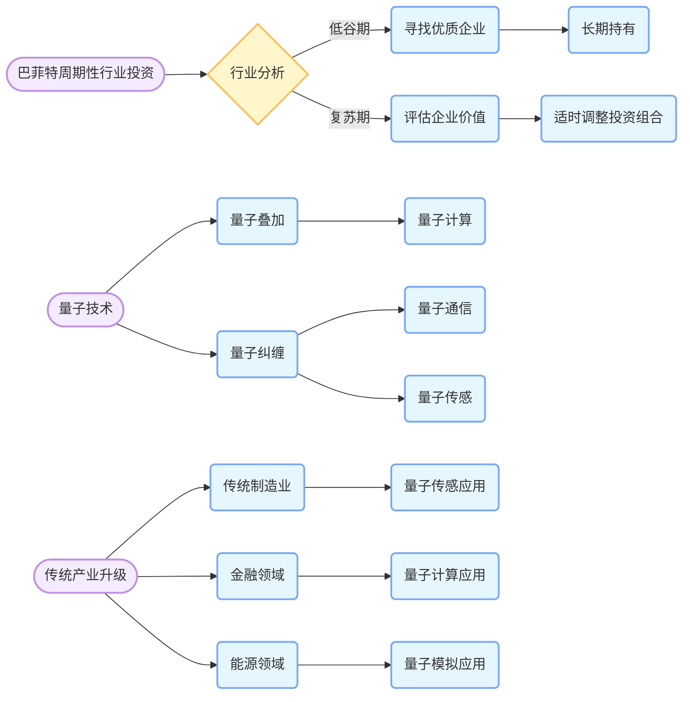

# 巴菲特的周期性行业投资：量子技术在传统产业升级中的机遇

> 关键词：巴菲特、周期性行业、量子技术、传统产业升级、投资机遇

> 摘要：本文深入探讨了巴菲特在周期性行业的投资理念，并将其与量子技术在传统产业升级中的机遇相结合。首先介绍了巴菲特周期性行业投资的背景与特点，接着阐述量子技术的核心概念及其与传统产业的联系。通过对核心算法原理、数学模型的分析，结合项目实战案例，揭示量子技术如何助力传统产业升级。同时，探讨了量子技术在不同实际应用场景中的作用，推荐了相关学习资源、开发工具与论文著作。最后总结了量子技术在传统产业升级中的未来发展趋势与挑战，并对常见问题进行解答，为投资者和产业从业者提供全面的参考。

## 1. 背景介绍 
### 1.1 目的和范围
本文章的目的在于深入剖析巴菲特在周期性行业的投资策略，并探讨量子技术为传统产业升级带来的机遇。通过研究巴菲特的投资理念，我们可以了解在周期性行业中如何把握投资时机和价值。而量子技术作为新兴的前沿技术，其在传统产业中的应用潜力巨大。本文的范围涵盖了周期性行业的特点、量子技术的原理、量子技术与传统产业的结合方式、实际应用场景以及相关的投资分析等方面。

### 1.2 预期读者
本文预期读者包括对投资领域感兴趣的投资者，尤其是关注周期性行业投资的人群；传统产业的从业者，希望了解如何利用新兴技术实现产业升级；科研人员和技术爱好者，对量子技术的发展和应用有研究需求；以及相关领域的学者和学生，用于学术研究和学习参考。

### 1.3 文档结构概述
本文首先介绍背景信息，包括目的、预期读者和文档结构概述等。接着阐述核心概念，如巴菲特的周期性行业投资理念和量子技术的原理。然后详细讲解核心算法原理、数学模型，并通过项目实战案例进行说明。之后探讨量子技术在实际应用场景中的作用，推荐相关的学习资源、开发工具和论文著作。最后总结未来发展趋势与挑战，解答常见问题，并提供扩展阅读和参考资料。

### 1.4 术语表
#### 1.4.1 核心术语定义
- **周期性行业**：指和国内或国际经济波动相关性较强的行业，如钢铁、有色金属、化工等基础大宗原材料行业，水泥等建筑材料行业，工程机械、机床、重型卡车、装备制造等资本集约性领域。这些行业的业绩表现与经济周期紧密相关，在经济扩张阶段通常表现良好，而在经济衰退阶段则面临压力。
- **量子技术**：基于量子力学原理发展起来的一系列技术，包括量子计算、量子通信、量子传感等。量子力学是描述微观世界物理现象的理论，量子技术利用了量子系统的独特性质，如量子叠加、量子纠缠等，为信息处理、通信安全等领域带来了革命性的变化。
- **传统产业升级**：指传统产业通过采用新技术、新工艺、新管理模式等手段，提高生产效率、产品质量和市场竞争力，实现产业的优化和转型。传统产业升级可以涉及技术创新、产品升级、管理创新、产业融合等多个方面。

#### 1.4.2 相关概念解释
- **巴菲特投资理念**：沃伦·巴菲特是全球著名的投资家，他的投资理念强调价值投资，即寻找被低估的优质企业，长期持有并分享企业的成长红利。在周期性行业投资中，巴菲特注重企业的内在价值、竞争优势和管理层能力，善于在行业低谷时布局，等待行业复苏和企业价值的提升。
- **产业升级的驱动力**：产业升级的驱动力包括技术创新、市场需求变化、政策引导等。技术创新是推动产业升级的核心力量，新的技术可以带来生产方式的变革和产品性能的提升。市场需求变化促使企业不断调整产品结构和服务模式，以满足消费者的需求。政策引导则通过制定相关政策和法规，鼓励企业进行技术创新和产业升级。

#### 1.4.3 缩略词列表
- **QC**：Quantum Computing，量子计算
- **QKD**：Quantum Key Distribution，量子密钥分发
- **IoT**：Internet of Things，物联网

## 2. 核心概念与联系 

### 2.1 巴菲特的周期性行业投资理念
巴菲特认为，周期性行业虽然具有较强的周期性波动，但其中也蕴含着投资机会。他在投资周期性行业时，会深入研究行业的供需关系、竞争格局和成本结构等因素。当行业处于低谷期，企业盈利不佳、股价低迷时，巴菲特会寻找那些具有强大竞争优势、财务状况良好的企业进行投资。他相信，随着经济周期的复苏，这些企业的业绩将得到改善，股价也会随之上涨。

例如，在2008年金融危机期间，全球经济陷入衰退，钢铁、汽车等周期性行业受到严重冲击。巴菲特旗下的伯克希尔·哈撒韦公司在此时投资了一些具有长期竞争力的企业，如比亚迪。比亚迪在新能源汽车和电池技术领域具有较强的研发实力和市场份额，随着全球对环境保护和新能源的重视，比亚迪的业绩逐渐回升，股价也大幅上涨。

### 2.2 量子技术的核心原理
量子技术基于量子力学的基本原理。量子力学是描述微观世界物理现象的理论，与经典物理学有很大的不同。在量子力学中，微观粒子具有量子叠加和量子纠缠等独特性质。

- **量子叠加**：量子叠加是指一个量子系统可以同时处于多个状态的叠加态。例如，一个量子比特（qubit）可以同时处于0和1的叠加态，而不是像经典比特那样只能处于0或1的确定状态。量子叠加使得量子计算机在处理某些问题时具有指数级的速度优势。
- **量子纠缠**：量子纠缠是指两个或多个量子系统之间存在一种特殊的关联，使得它们的状态相互依赖。即使这些量子系统在空间上相隔很远，它们之间的纠缠关系仍然存在。量子纠缠在量子通信和量子传感等领域具有重要应用。

### 2.3 量子技术与传统产业的联系
量子技术为传统产业升级提供了新的机遇。在传统制造业中，量子传感技术可以用于高精度的测量和检测，提高产品质量和生产效率。例如，量子传感器可以实时监测机械设备的运行状态，提前发现故障隐患，实现预测性维护。

在金融领域，量子计算可以用于优化投资组合、风险管理和金融建模等方面。量子计算的强大计算能力可以在更短的时间内处理大量的数据，提高金融决策的准确性和效率。

在能源领域，量子技术可以用于开发新型能源材料和提高能源利用效率。例如，量子模拟可以帮助科学家研究材料的量子性质，为开发高效的太阳能电池和超导材料提供理论支持。

### 2.4 核心概念原理和架构的文本示意图
```plaintext
巴菲特周期性行业投资理念
|-- 价值投资
|   |-- 寻找被低估的优质企业
|   |-- 关注企业内在价值、竞争优势和管理层能力
|-- 周期把握
|   |-- 在行业低谷期布局
|   |-- 等待行业复苏和企业价值提升

量子技术核心原理
|-- 量子叠加
|   |-- 量子比特处于多个状态的叠加态
|-- 量子纠缠
|   |-- 量子系统之间的特殊关联

量子技术与传统产业的联系
|-- 传统制造业
|   |-- 量子传感用于高精度测量和检测
|   |-- 实现预测性维护
|-- 金融领域
|   |-- 量子计算用于投资组合优化和风险管理
|-- 能源领域
|   |-- 量子模拟用于开发新型能源材料
```

### 2.5 Mermaid 流程图


## 3. 核心算法原理 & 具体操作步骤 

### 3.1 量子计算的核心算法原理
量子计算的核心算法基于量子比特的量子叠加和量子纠缠性质。其中，最著名的量子算法之一是Shor算法，用于整数分解问题。Shor算法在量子计算机上的运行速度比经典计算机快得多，这对现代密码学产生了重大影响。

以下是Shor算法的Python伪代码示例：
```python
import math
from qiskit import QuantumCircuit, Aer, execute

def shor_algorithm(N):
    # 选择一个随机数 a，1 < a < N
    import random
    a = random.randint(2, N - 1)
    # 计算 a 和 N 的最大公约数
    gcd_value = math.gcd(a, N)
    if gcd_value != 1:
        # 如果 gcd(a, N) != 1，那么 gcd(a, N) 就是 N 的一个因子
        return gcd_value, N // gcd_value
    
    # 量子部分：寻找 a 的阶 r
    num_qubits = 2 * math.ceil(math.log2(N))
    qc = QuantumCircuit(num_qubits, num_qubits // 2)
    
    # 初始化寄存器
    for qubit in range(num_qubits // 2):
        qc.h(qubit)
    
    # 执行模幂运算
    # 这里简化为一个占位函数，实际实现需要更复杂的电路设计
    def modular_exponentiation(a, N, exponent, num_qubits):
        # 实际实现需要量子门操作
        pass
    
    for exponent in range(num_qubits // 2):
        modular_exponentiation(a, N, 2 ** exponent, num_qubits)
    
    # 执行逆量子傅里叶变换
    def inverse_quantum_fourier_transform(qc, qubits):
        # 实际实现需要量子门操作
        pass
    
    inverse_quantum_fourier_transform(qc, range(num_qubits // 2))
    
    # 测量寄存器
    qc.measure(range(num_qubits // 2), range(num_qubits // 2))
    
    # 运行量子电路
    simulator = Aer.get_backend('qasm_simulator')
    job = execute(qc, simulator, shots=1000)
    result = job.result()
    counts = result.get_counts(qc)
    
    # 经典部分：从测量结果中提取阶 r
    measured_value = max(counts, key=counts.get)
    measured_value = int(measured_value, 2)
    r = 2 ** (num_qubits // 2) / measured_value
    
    if r % 2 == 0 and pow(a, r // 2, N) != N - 1:
        factor1 = math.gcd(a ** (r // 2) + 1, N)
        factor2 = math.gcd(a ** (r // 2) - 1, N)
        return factor1, factor2
    else:
        return None, None

# 示例：分解整数 15
N = 15
factor1, factor2 = shor_algorithm(N)
if factor1 and factor2:
    print(f"15 的因子是 {factor1} 和 {factor2}")
else:
    print("未能找到因子")
```

### 3.2 具体操作步骤
1. **问题分析**：确定需要解决的问题，例如整数分解、优化问题等。对于不同的问题，需要选择合适的量子算法。
2. **量子电路设计**：根据所选的量子算法，设计相应的量子电路。量子电路由量子门组成，用于对量子比特进行操作。
3. **量子态初始化**：将量子比特初始化为合适的状态，例如通过Hadamard门将量子比特置于叠加态。
4. **量子操作执行**：按照量子电路的设计，依次执行量子门操作，实现量子算法的计算过程。
5. **测量和结果分析**：对量子比特进行测量，得到经典的测量结果。然后通过经典算法对测量结果进行分析，得到最终的问题解。

### 3.3 量子传感的核心算法原理
量子传感利用量子系统的特性来实现高精度的测量。例如，基于原子干涉仪的量子加速度计可以测量加速度的微小变化。

以下是一个简单的量子传感模拟的Python代码示例：
```python
import numpy as np

# 模拟原子干涉仪的量子态演化
def quantum_sensor_simulation(acceleration, time_interval, num_atoms):
    # 初始量子态
    psi = np.ones(num_atoms) / np.sqrt(num_atoms)
    
    # 模拟量子态演化
    for _ in range(int(time_interval)):
        # 加速度对量子态的影响
        phase_shift = acceleration * np.arange(num_atoms)
        psi = psi * np.exp(1j * phase_shift)
    
    # 测量量子态
    probabilities = np.abs(psi) ** 2
    measurement_result = np.random.choice(num_atoms, p=probabilities)
    
    return measurement_result

# 示例：模拟量子加速度计测量
acceleration = 0.1
time_interval = 10
num_atoms = 100
measurement = quantum_sensor_simulation(acceleration, time_interval, num_atoms)
print(f"测量结果: {measurement}")
```

### 3.4 量子传感的具体操作步骤
1. **量子系统制备**：选择合适的量子系统，如原子、离子等，并将其制备到特定的量子态。
2. **外界物理量作用**：让量子系统与外界物理量（如加速度、磁场等）相互作用，使量子态发生变化。
3. **量子态测量**：对量子系统进行测量，得到测量结果。
4. **数据处理和物理量反演**：通过对测量结果的分析和处理，反演出外界物理量的大小。

## 4. 数学模型和公式 & 详细讲解 & 举例说明 

### 4.1 量子比特的数学表示
量子比特是量子计算的基本信息单元，用狄拉克符号表示为 $|\psi\rangle$。一个量子比特可以处于 $|0\rangle$ 和 $|1\rangle$ 两个基态的叠加态，其一般形式为：
$$|\psi\rangle = \alpha|0\rangle + \beta|1\rangle$$
其中，$\alpha$ 和 $\beta$ 是复数，满足 $|\alpha|^2 + |\beta|^2 = 1$。$|\alpha|^2$ 表示测量量子比特得到 $|0\rangle$ 态的概率，$|\beta|^2$ 表示测量量子比特得到 $|1\rangle$ 态的概率。

例如，当 $\alpha = \frac{1}{\sqrt{2}}$，$\beta = \frac{1}{\sqrt{2}}$ 时，量子比特处于等概率叠加态：
$$|\psi\rangle = \frac{1}{\sqrt{2}}|0\rangle + \frac{1}{\sqrt{2}}|1\rangle$$
测量这个量子比特，得到 $|0\rangle$ 态和 $|1\rangle$ 态的概率均为 $\frac{1}{2}$。

### 4.2 量子门的数学表示
量子门是对量子比特进行操作的基本单元，用幺正矩阵表示。常见的量子门包括Hadamard门（H门）、Pauli-X门（X门）、Pauli-Y门（Y门）和Pauli-Z门（Z门）等。

- **Hadamard门（H门）**：将量子比特从基态转换为叠加态，其矩阵表示为：
$$H = \frac{1}{\sqrt{2}}\begin{bmatrix}1 & 1\\1 & -1\end{bmatrix}$$
对基态 $|0\rangle$ 应用H门，得到：
$$H|0\rangle = \frac{1}{\sqrt{2}}\begin{bmatrix}1 & 1\\1 & -1\end{bmatrix}\begin{bmatrix}1\\0\end{bmatrix} = \frac{1}{\sqrt{2}}\begin{bmatrix}1\\1\end{bmatrix} = \frac{1}{\sqrt{2}}|0\rangle + \frac{1}{\sqrt{2}}|1\rangle$$

- **Pauli-X门（X门）**：相当于经典逻辑中的非门，其矩阵表示为：
$$X = \begin{bmatrix}0 & 1\\1 & 0\end{bmatrix}$$
对基态 $|0\rangle$ 应用X门，得到：
$$X|0\rangle = \begin{bmatrix}0 & 1\\1 & 0\end{bmatrix}\begin{bmatrix}1\\0\end{bmatrix} = \begin{bmatrix}0\\1\end{bmatrix} = |1\rangle$$

### 4.3 量子算法的数学模型
以Shor算法为例，其核心是寻找一个整数 $a$ 模 $N$ 的阶 $r$，即满足 $a^r \equiv 1 \pmod{N}$ 的最小正整数 $r$。通过量子傅里叶变换（QFT）可以高效地找到阶 $r$。

量子傅里叶变换的定义为：
$$QFT|j\rangle = \frac{1}{\sqrt{2^n}}\sum_{k=0}^{2^n - 1}e^{2\pi i jk / 2^n}|k\rangle$$
其中，$n$ 是量子比特的数量，$j$ 和 $k$ 是整数。

在Shor算法中，通过对模幂运算的结果应用逆量子傅里叶变换，可以从测量结果中提取阶 $r$ 的信息。

### 4.4 量子传感的数学模型
量子传感基于量子系统的干涉效应。以原子干涉仪为例，原子的量子态可以表示为：
$$|\psi(t)\rangle = \alpha(t)|g\rangle + \beta(t)|e\rangle$$
其中，$|g\rangle$ 和 $|e\rangle$ 分别是原子的基态和激发态。外界物理量（如加速度）会导致原子的相位发生变化，从而影响量子态的演化。

通过测量原子的干涉信号，可以得到相位差 $\Delta\phi$，进而反演出外界物理量的大小。例如，在原子加速度计中，加速度 $a$ 与相位差 $\Delta\phi$ 的关系为：
$$\Delta\phi = \frac{2m a k}{\hbar} T^2$$
其中，$m$ 是原子的质量，$k$ 是激光的波矢，$T$ 是干涉仪的时间间隔，$\hbar$ 是约化普朗克常数。

## 5. 项目实战：代码实际案例和详细解释说明 

### 5.1  开发环境搭建
#### 5.1.1 安装Python
首先，需要安装Python开发环境。可以从Python官方网站（https://www.python.org/downloads/） 下载适合自己操作系统的Python安装包，并按照安装向导进行安装。建议安装Python 3.7及以上版本。

#### 5.1.2 安装量子计算库
为了进行量子计算的开发，需要安装相关的量子计算库。其中，Qiskit是一个常用的开源量子计算框架，支持多种量子模拟器和真实量子设备。可以使用以下命令安装Qiskit：
```sh
pip install qiskit
```

#### 5.1.3 安装其他依赖库
根据具体的项目需求，可能还需要安装其他依赖库，如NumPy、Matplotlib等。可以使用以下命令安装：
```sh
pip install numpy matplotlib
```

### 5.2  源代码详细实现和代码解读
#### 5.2.1 量子比特操作示例
```python
from qiskit import QuantumCircuit, Aer, execute
import numpy as np

# 创建一个包含1个量子比特和1个经典比特的量子电路
qc = QuantumCircuit(1, 1)

# 应用Hadamard门将量子比特置于叠加态
qc.h(0)

# 测量量子比特
qc.measure(0, 0)

# 模拟量子电路
simulator = Aer.get_backend('qasm_simulator')
job = execute(qc, simulator, shots=1000)
result = job.result()
counts = result.get_counts(qc)

# 打印测量结果
print("测量结果:", counts)
```
**代码解读**：
- `QuantumCircuit(1, 1)`：创建一个包含1个量子比特和1个经典比特的量子电路。
- `qc.h(0)`：对第0个量子比特应用Hadamard门，将其置于等概率叠加态。
- `qc.measure(0, 0)`：将第0个量子比特的测量结果存储到第0个经典比特中。
- `execute(qc, simulator, shots=1000)`：在量子模拟器上运行量子电路1000次，得到测量结果。
- `result.get_counts(qc)`：获取测量结果的统计信息，即0和1出现的次数。

#### 5.2.2 量子纠缠示例
```python
from qiskit import QuantumCircuit, Aer, execute
import numpy as np

# 创建一个包含2个量子比特和2个经典比特的量子电路
qc = QuantumCircuit(2, 2)

# 应用Hadamard门将第一个量子比特置于叠加态
qc.h(0)

# 应用CNOT门创建量子纠缠
qc.cx(0, 1)

# 测量两个量子比特
qc.measure([0, 1], [0, 1])

# 模拟量子电路
simulator = Aer.get_backend('qasm_simulator')
job = execute(qc, simulator, shots=1000)
result = job.result()
counts = result.get_counts(qc)

# 打印测量结果
print("测量结果:", counts)
```
**代码解读**：
- `QuantumCircuit(2, 2)`：创建一个包含2个量子比特和2个经典比特的量子电路。
- `qc.h(0)`：对第0个量子比特应用Hadamard门，将其置于等概率叠加态。
- `qc.cx(0, 1)`：对第0个和第1个量子比特应用CNOT门，创建量子纠缠。CNOT门的作用是当控制比特（第0个量子比特）为1时，目标比特（第1个量子比特）取反。
- `qc.measure([0, 1], [0, 1])`：将两个量子比特的测量结果分别存储到对应的经典比特中。
- `execute(qc, simulator, shots=1000)`：在量子模拟器上运行量子电路1000次，得到测量结果。
- `result.get_counts(qc)`：获取测量结果的统计信息，即00、01、10和11出现的次数。由于量子纠缠的存在，测量结果只会出现00和11两种情况。

### 5.3  代码解读与分析
#### 5.3.1 量子比特操作的分析
在量子比特操作示例中，通过应用Hadamard门将量子比特置于叠加态，测量结果会以一定的概率得到0或1。由于量子力学的随机性，每次运行代码得到的测量结果可能会有所不同，但在大量测量的情况下，0和1出现的概率应该接近相等。

#### 5.3.2 量子纠缠的分析
在量子纠缠示例中，通过应用Hadamard门和CNOT门创建了量子纠缠态。测量结果只会出现00和11两种情况，这表明两个量子比特的状态是相互关联的。当测量第一个量子比特得到0时，第二个量子比特必然为0；当测量第一个量子比特得到1时，第二个量子比特必然为1。这种非局域的关联是量子纠缠的重要特性。

## 6. 实际应用场景 
### 6.1 传统制造业
在传统制造业中，量子技术可以用于提高生产效率和产品质量。例如，量子传感技术可以实现高精度的测量和检测。在汽车制造中，量子加速度计可以用于汽车零部件的振动测试，提前发现潜在的故障隐患，提高汽车的安全性和可靠性。

量子计算可以用于优化生产流程和供应链管理。通过对生产数据的分析和建模，量子计算机可以快速找到最优的生产计划和物流方案，降低生产成本。

### 6.2 金融领域
在金融领域，量子技术可以用于风险管理、投资组合优化和金融建模等方面。量子计算的强大计算能力可以在更短的时间内处理大量的金融数据，提高金融决策的准确性和效率。

例如，在投资组合优化中，量子计算机可以考虑更多的投资标的和约束条件，找到最优的投资组合，实现风险和收益的平衡。量子通信技术可以用于保障金融交易的安全，防止信息泄露和黑客攻击。

### 6.3 能源领域
在能源领域，量子技术可以用于开发新型能源材料和提高能源利用效率。量子模拟可以帮助科学家研究材料的量子性质，为开发高效的太阳能电池、超导材料和量子电池等提供理论支持。

量子传感技术可以用于监测能源设备的运行状态，实现能源系统的智能管理。例如，量子传感器可以实时监测风力发电机的叶片振动和温度变化，及时发现故障并进行维修，提高风力发电的效率和可靠性。

### 6.4 医疗领域
在医疗领域，量子技术可以用于医学成像、药物研发和基因测序等方面。量子传感技术可以提高医学成像的分辨率和灵敏度，帮助医生更早地发现疾病。

量子计算可以加速药物研发的过程，通过对分子结构和药物作用机制的模拟，快速筛选出有效的药物候选物。量子基因测序技术可以实现更快速、准确的基因测序，为个性化医疗提供支持。

## 7. 工具和资源推荐
### 7.1 学习资源推荐
#### 7.1.1 书籍推荐
- 《量子计算与量子信息》（Quantum Computation and Quantum Information）：由Michael A. Nielsen和Isaac L. Chuang所著，是量子计算领域的经典教材，全面介绍了量子计算和量子信息的基本原理和算法。
- 《量子力学导论》（Introduction to Quantum Mechanics）：由David J. Griffiths所著，是量子力学的入门教材，内容深入浅出，适合初学者学习。
- 《量子技术：从基础到应用》（Quantum Technologies: From Fundamentals to Applications）：由Giuliano Benenti、Giuseppe Casati和Giancarlo Strini所著，介绍了量子技术的基本原理和应用领域。

#### 7.1.2 在线课程
- Coursera上的“量子计算基础”（Fundamentals of Quantum Computation）：由University of Maryland提供，介绍了量子计算的基本概念、算法和实验技术。
- edX上的“量子信息科学与技术”（Quantum Information Science and Technology）：由Delft University of Technology提供，涵盖了量子比特、量子门、量子算法等内容。
- 中国大学MOOC上的“量子力学”：由多所高校的教师联合授课，系统地介绍了量子力学的基本原理和应用。

#### 7.1.3 技术博客和网站
- Qiskit官方博客（https://qiskit.org/blog/）：提供了关于量子计算的最新技术文章、研究成果和应用案例。
- Quantum Computing Report（https://www.quantumcomputingreport.com/）：专注于量子计算领域的新闻、分析和评论。
- Physics World（https://physicsworld.com/）：涵盖了物理学各个领域的新闻和研究进展，包括量子技术。

### 7.2 开发工具框架推荐
#### 7.2.1 IDE和编辑器
- PyCharm：是一款功能强大的Python集成开发环境，支持量子计算库的开发和调试。
- Visual Studio Code：是一款轻量级的代码编辑器，具有丰富的插件和扩展功能，适合量子计算的快速开发。
- Jupyter Notebook：是一个交互式的编程环境，适合进行量子计算的实验和演示。

#### 7.2.2 调试和性能分析工具
- Qiskit Aqua：是Qiskit框架中的一个模块，提供了量子算法的调试和性能分析工具。
- QuTiP：是一个用于量子系统模拟和计算的Python库，支持量子态的可视化和性能分析。
- Quantum Inspire：是一个基于云的量子计算平台，提供了量子电路的调试和性能分析功能。

#### 7.2.3 相关框架和库
- Qiskit：是一个开源的量子计算框架，支持多种量子模拟器和真实量子设备，提供了丰富的量子算法和工具。
- Cirq：是Google开发的量子计算框架，专注于量子电路的设计和模拟。
- PennyLane：是一个跨平台的量子机器学习框架，支持量子计算和经典机器学习的结合。

### 7.3 相关论文著作推荐
#### 7.3.1 经典论文
- "Algorithms for Quantum Computation: Discrete Logarithms and Factoring" by Peter W. Shor：提出了Shor算法，是量子计算领域的经典论文。
- "Teleporting an Unknown Quantum State via Dual Classical and Einstein-Podolsky-Rosen Channels" by Charles H. Bennett et al.：提出了量子隐形传态的概念，是量子通信领域的重要论文。
- "Quantum Mechanics Helps in Searching for a Needle in a Haystack" by Lov Grover：提出了Grover算法，是量子搜索算法的经典论文。

#### 7.3.2 最新研究成果
- 关注arXiv（https://arxiv.org/） 上的量子技术相关论文，了解最新的研究进展。
- 阅读《Physical Review Letters》、《Nature》、《Science》等顶级学术期刊上的量子技术研究论文。

#### 7.3.3 应用案例分析
- 关注行业报告和企业案例，了解量子技术在实际应用中的效果和经验。例如，IBM、Google等公司发布的量子计算应用案例。

## 8. 总结：未来发展趋势与挑战
### 8.1 未来发展趋势
- **量子技术与传统产业深度融合**：随着量子技术的不断发展，它将与传统产业更加深度地融合，为传统产业的升级和转型提供强大的动力。例如，量子计算将在金融、能源、医疗等领域得到广泛应用，量子传感将在制造业、交通、环境监测等领域发挥重要作用。
- **量子互联网的建设**：量子互联网是未来量子技术发展的重要方向。量子互联网将利用量子通信技术实现安全的信息传输和量子纠缠的远程分发，为全球范围内的量子计算和量子传感网络提供支持。
- **量子技术的商业化进程加速**：越来越多的企业和投资者开始关注量子技术的商业化应用，量子技术的创业公司不断涌现。未来，量子技术的商业化进程将加速，量子计算机、量子传感器等量子技术产品将逐渐进入市场。

### 8.2 挑战
- **技术难题**：量子技术仍然面临许多技术难题，如量子比特的稳定性、量子纠错、量子系统的规模化等。解决这些技术难题需要大量的研究和实验，需要科学家和工程师们的共同努力。
- **人才短缺**：量子技术是一个新兴的领域，相关的专业人才短缺。培养量子技术领域的专业人才需要较长的时间和大量的资源，这是制约量子技术发展的一个重要因素。
- **成本高昂**：量子技术的研发和应用成本高昂，包括量子计算机的制造、维护和运行成本，量子传感器的研发和生产成本等。降低量子技术的成本，提高其性价比，是实现量子技术广泛应用的关键。

## 9. 附录：常见问题与解答
### 9.1 量子技术是否已经成熟？
量子技术目前还处于发展阶段，虽然在某些领域已经取得了重要的研究成果，但距离完全成熟还有很长的路要走。例如，量子计算机的性能还受到量子比特数量、量子比特的稳定性等因素的限制，量子通信的传输距离和速率也有待提高。

### 9.2 量子技术对传统产业的影响有多大？
量子技术对传统产业的影响是深远的。它可以为传统产业提供新的技术手段和解决方案，提高生产效率、产品质量和市场竞争力。例如，量子计算可以优化生产流程和供应链管理，量子传感可以实现高精度的测量和检测。

### 9.3 如何学习量子技术？
学习量子技术需要具备一定的物理学和数学基础，如量子力学、线性代数等。可以通过阅读相关的书籍和论文、参加在线课程、参与科研项目等方式来学习量子技术。同时，还可以使用量子计算框架和工具进行实践和实验。

### 9.4 量子技术的应用是否存在风险？
量子技术的应用存在一定的风险。例如，量子计算的强大计算能力可能会对现有的密码系统构成威胁，量子通信的安全性也需要进一步保障。此外，量子技术的应用还可能带来伦理和法律等方面的问题，需要引起足够的重视。

## 10. 扩展阅读 & 参考资料
- Nielsen, M. A., & Chuang, I. L. (2010). Quantum Computation and Quantum Information. Cambridge University Press.
- Griffiths, D. J. (2018). Introduction to Quantum Mechanics. Cambridge University Press.
- Benenti, G., Casati, G., & Strini, G. (2017). Quantum Technologies: From Fundamentals to Applications. Springer.
- Qiskit官方文档（https://qiskit.org/documentation/）
- Cirq官方文档（https://quantumai.google/cirq）
- PennyLane官方文档（https://pennylane.ai/）
- arXiv量子技术相关论文（https://arxiv.org/archive/quant-ph）
- 《物理评论快报》（Physical Review Letters）
- 《自然》（Nature）
- 《科学》（Science）