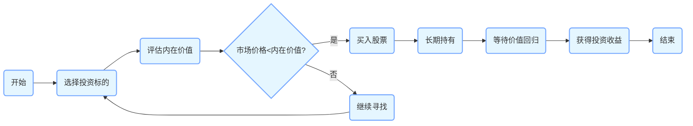

# 巴菲特的年度股东信：价值投资智慧的年度盛宴

> 关键词：巴菲特、年度股东信、价值投资、投资智慧、伯克希尔·哈撒韦、财务分析、长期投资

> 摘要：巴菲特的年度股东信一直以来都是全球投资者瞩目的焦点，被誉为价值投资智慧的年度盛宴。本文深入剖析巴菲特年度股东信的各个方面，包括其背景、核心概念、投资算法原理、数学模型、实际案例、应用场景等，旨在全面解读其中蕴含的价值投资精髓，为投资者提供深入学习和借鉴的参考，帮助读者更好地理解价值投资理念和巴菲特的投资智慧。

## 1. 背景介绍 
### 1.1 目的和范围
巴菲特的年度股东信是伯克希尔·哈撒韦公司与股东沟通的重要渠道，也是全球投资者获取投资智慧的宝贵资源。本文的目的在于全面、深入地解读巴菲特年度股东信，挖掘其中的价值投资理念、策略和方法，为投资者提供系统性的学习和参考。范围涵盖股东信的历史演变、核心内容、投资思想的形成与发展，以及对全球投资界的影响等方面。

### 1.2 预期读者
本文预期读者包括广大投资者，无论是专业的投资人士、金融从业者，还是对投资感兴趣的普通大众。同时，也适合从事金融研究、教学的学者和学生，以及关注商业和经济发展的各界人士。

### 1.3 文档结构概述
本文将按照以下结构展开：首先介绍巴菲特年度股东信的背景信息，包括其目的、读者群体和文档结构概述等；接着阐述股东信中涉及的核心概念与联系，通过文本示意图和 Mermaid 流程图进行展示；然后详细讲解核心算法原理和具体操作步骤，结合 Python 源代码进行说明；再介绍相关的数学模型和公式，并举例说明；之后通过项目实战展示代码实际案例并进行详细解释；探讨股东信在实际应用中的场景；推荐学习股东信和价值投资相关的工具和资源；最后总结未来发展趋势与挑战，解答常见问题，并提供扩展阅读和参考资料。

### 1.4 术语表
#### 1.4.1 核心术语定义
- **价值投资**：一种基于对公司内在价值的评估，寻找被低估的股票并长期持有的投资策略。
- **伯克希尔·哈撒韦**：巴菲特领导的多元化投资控股公司，旗下拥有众多子公司，涉及保险、能源、制造业等多个领域。
- **股东信**：伯克希尔·哈撒韦公司每年向股东发布的信件，内容包括公司的经营状况、投资策略、对经济形势的看法等。
- **内在价值**：公司未来现金流的折现值，是价值投资中评估公司价值的重要指标。
- **安全边际**：股票市场价格低于其内在价值的幅度，是价值投资中降低风险的重要原则。

#### 1.4.2 相关概念解释
- **复利效应**：指在投资过程中，每一期的收益都会加入本金，下一期的收益将基于增加后的本金计算，从而实现收益的加速增长。
- **护城河**：指公司具有的可持续竞争优势，能够保护公司的市场份额和盈利能力，使其在竞争中脱颖而出。
- **能力圈**：投资者应该专注于自己熟悉和了解的领域进行投资，避免涉足不熟悉的行业，以降低投资风险。

#### 1.4.3 缩略词列表
- **BRK**：伯克希尔·哈撒韦公司（Berkshire Hathaway）的股票代码。

## 2. 核心概念与联系 

### 核心概念原理
巴菲特的价值投资理念基于对公司内在价值的深刻理解和评估。其核心原理是通过对公司的财务状况、商业模式、竞争优势等方面进行深入分析，确定公司的内在价值。当股票市场价格低于其内在价值时，就存在投资机会，投资者可以买入股票并长期持有，等待市场价格向内在价值回归，从而实现投资收益。

价值投资强调长期投资，因为短期市场波动是难以预测的，而公司的内在价值是由其长期的经营业绩和竞争优势决定的。通过长期持有优质公司的股票，投资者可以分享公司成长带来的收益，同时避免因短期市场波动而做出错误的投资决策。

### 架构的文本示意图
```plaintext
价值投资理念
|-- 内在价值评估
|   |-- 财务分析
|   |   |-- 盈利能力
|   |   |-- 偿债能力
|   |   |-- 运营能力
|   |-- 商业模式分析
|   |   |-- 业务模式
|   |   |-- 盈利模式
|   |-- 竞争优势分析
|       |-- 品牌优势
|       |-- 成本优势
|       |-- 技术优势
|-- 安全边际原则
|-- 长期投资策略
```

### Mermaid 流程图


## 3. 核心算法原理 & 具体操作步骤 

### 核心算法原理
在价值投资中，评估公司内在价值是关键。一种常用的方法是现金流折现法（DCF），其基本原理是将公司未来的现金流按照一定的折现率折现到当前时刻，得到公司的内在价值。

现金流折现法的公式为：

$$V = \sum_{t=1}^{n} \frac{CF_t}{(1 + r)^t} + \frac{TV}{(1 + r)^n}$$

其中：
- $V$ 表示公司的内在价值
- $CF_t$ 表示第 $t$ 期的现金流
- $r$ 表示折现率
- $n$ 表示预测期数
- $TV$ 表示终值

### 具体操作步骤
1. **预测未来现金流**：对公司未来的经营业绩进行预测，确定每年的现金流。这需要对公司的业务模式、市场前景、竞争优势等进行深入分析。
2. **确定折现率**：折现率反映了投资者对投资回报的要求，通常可以使用资本资产定价模型（CAPM）来确定。
3. **计算终值**：终值是指预测期结束后公司的价值，可以使用永续增长模型来计算。
4. **折现现金流**：将预测的未来现金流和终值按照折现率折现到当前时刻，得到公司的内在价值。
5. **比较市场价格和内在价值**：如果市场价格低于内在价值，且存在足够的安全边际，则可以考虑买入股票。

### Python 源代码实现
```python
import numpy as np

def dcf_valuation(cash_flows, discount_rate, growth_rate, terminal_year):
    """
    现金流折现法计算公司内在价值
    :param cash_flows: 预测的未来现金流列表
    :param discount_rate: 折现率
    :param growth_rate: 永续增长率
    :param terminal_year: 预测期数
    :return: 公司内在价值
    """
    # 计算预测期内现金流的折现值
    pv_cash_flows = np.sum([cash_flows[i] / (1 + discount_rate) ** (i + 1) for i in range(terminal_year)])

    # 计算终值
    terminal_value = cash_flows[-1] * (1 + growth_rate) / (discount_rate - growth_rate)
    pv_terminal_value = terminal_value / (1 + discount_rate) ** terminal_year

    # 计算公司内在价值
    intrinsic_value = pv_cash_flows + pv_terminal_value
    return intrinsic_value

# 示例数据
cash_flows = [100, 120, 140, 160, 180]  # 预测的未来现金流
discount_rate = 0.1  # 折现率
growth_rate = 0.03  # 永续增长率
terminal_year = 5  # 预测期数

# 计算内在价值
intrinsic_value = dcf_valuation(cash_flows, discount_rate, growth_rate, terminal_year)
print(f"公司内在价值: {intrinsic_value}")
```

## 4. 数学模型和公式 & 详细讲解 & 举例说明 

### 现金流折现法（DCF）
现金流折现法是价值投资中常用的评估公司内在价值的方法，其数学模型和公式已经在前面介绍过。下面详细讲解其各个参数的含义和确定方法。

- **未来现金流（$CF_t$）**：未来现金流是指公司在未来各期预计产生的现金流量。预测未来现金流需要对公司的业务模式、市场前景、竞争优势等进行深入分析。通常可以采用历史数据分析法、行业分析法、情景分析法等方法进行预测。
- **折现率（$r$）**：折现率反映了投资者对投资回报的要求，通常可以使用资本资产定价模型（CAPM）来确定。CAPM 的公式为：

$$r = R_f + \beta (R_m - R_f)$$

其中：
- $R_f$ 表示无风险利率，通常可以使用国债收益率来近似代替。
- $\beta$ 表示股票的贝塔系数，反映了股票相对于市场的波动程度。
- $R_m$ 表示市场收益率，通常可以使用股票市场指数的收益率来近似代替。

- **终值（$TV$）**：终值是指预测期结束后公司的价值，通常可以使用永续增长模型来计算。永续增长模型的公式为：

$$TV = \frac{CF_n (1 + g)}{r - g}$$

其中：
- $CF_n$ 表示预测期最后一期的现金流
- $g$ 表示永续增长率

### 举例说明
假设某公司未来 5 年的现金流分别为 100 万元、120 万元、140 万元、160 万元、180 万元，无风险利率为 3%，市场收益率为 10%，股票的贝塔系数为 1.2，永续增长率为 3%。

1. **计算折现率**：
$$r = 0.03 + 1.2 \times (0.1 - 0.03) = 0.114$$

2. **计算终值**：
$$TV = \frac{180 \times (1 + 0.03)}{0.114 - 0.03} = 2202.38$$

3. **计算内在价值**：
$$V = \frac{100}{(1 + 0.114)^1} + \frac{120}{(1 + 0.114)^2} + \frac{140}{(1 + 0.114)^3} + \frac{160}{(1 + 0.114)^4} + \frac{180}{(1 + 0.114)^5} + \frac{2202.38}{(1 + 0.114)^5} = 1547.62$$

因此，该公司的内在价值约为 1547.62 万元。

## 5. 项目实战：代码实际案例和详细解释说明 

### 5.1  开发环境搭建
为了实现基于价值投资理念的股票分析和筛选系统，我们需要搭建以下开发环境：
- **编程语言**：Python
- **开发工具**：PyCharm 或 Jupyter Notebook
- **相关库**：pandas、numpy、matplotlib、yfinance 等

安装相关库的命令如下：
```sh
pip install pandas numpy matplotlib yfinance
```

### 5.2  源代码详细实现和代码解读
下面是一个简单的基于价值投资理念的股票分析和筛选系统的示例代码：
```python
import yfinance as yf
import pandas as pd
import numpy as np
import matplotlib.pyplot as plt

# 定义股票列表
stocks = ['AAPL', 'MSFT', 'GOOG', 'AMZN', 'BRK-A']

# 获取股票数据
data = yf.download(stocks, start='2010-01-01', end='2023-12-31')

# 计算年化收益率
annual_returns = data['AdjClose'].pct_change().dropna().resample('Y').agg(lambda x: (x + 1).prod() - 1)

# 计算平均年化收益率
mean_annual_returns = annual_returns.mean()

# 计算标准差
std_returns = annual_returns.std()

# 计算夏普比率
risk_free_rate = 0.03
sharpe_ratios = (mean_annual_returns - risk_free_rate) / std_returns

# 筛选出夏普比率大于 1 的股票
selected_stocks = sharpe_ratios[sharpe_ratios > 1].index

# 绘制股票收益率和夏普比率的柱状图
fig, axes = plt.subplots(2, 1, figsize=(10, 8))
mean_annual_returns.plot(kind='bar', ax=axes[0], title='平均年化收益率')
sharpe_ratios.plot(kind='bar', ax=axes[1], title='夏普比率')
plt.tight_layout()
plt.show()

print("筛选出的股票:", selected_stocks)
```

### 5.3  代码解读与分析
1. **获取股票数据**：使用 `yfinance` 库从雅虎财经获取指定股票的历史数据。
2. **计算年化收益率**：使用 `pct_change()` 函数计算每日收益率，然后使用 `resample()` 函数将每日收益率转换为年化收益率。
3. **计算平均年化收益率和标准差**：使用 `mean()` 和 `std()` 函数分别计算平均年化收益率和标准差。
4. **计算夏普比率**：夏普比率是衡量投资组合风险调整后收益的指标，计算公式为：

$$Sharpe Ratio = \frac{R_p - R_f}{\sigma_p}$$

其中：
- $R_p$ 表示投资组合的平均收益率
- $R_f$ 表示无风险利率
- $\sigma_p$ 表示投资组合的标准差

5. **筛选股票**：筛选出夏普比率大于 1 的股票，作为潜在的投资标的。
6. **绘制柱状图**：使用 `matplotlib` 库绘制股票收益率和夏普比率的柱状图，直观展示各股票的表现。

## 6. 实际应用场景 
### 个人投资
对于个人投资者来说，巴菲特的年度股东信是学习价值投资理念和方法的宝贵资源。通过阅读股东信，个人投资者可以了解巴菲特的投资决策过程、对市场和行业的看法，以及如何评估公司的内在价值。个人投资者可以将价值投资理念应用到自己的投资实践中，选择被低估的优质股票并长期持有，实现资产的保值增值。

### 机构投资
机构投资者，如基金公司、保险公司等，也可以从巴菲特的年度股东信中获取投资灵感和决策依据。机构投资者可以借鉴巴菲特的投资策略，对投资组合进行优化和调整，降低投资风险，提高投资收益。同时，机构投资者还可以通过研究股东信中对宏观经济和行业趋势的分析，制定更合理的投资战略。

### 企业管理
巴菲特的年度股东信不仅包含投资智慧，还涉及企业管理、战略规划等方面的内容。企业管理者可以从股东信中学习到如何打造具有竞争优势的企业、如何进行有效的风险管理、如何实现企业的长期稳定发展等经验和方法。这些经验和方法可以应用到企业的实际管理中，提升企业的竞争力和价值。

## 7. 工具和资源推荐
### 7.1 学习资源推荐
#### 7.1.1 书籍推荐
- 《聪明的投资者》（The Intelligent Investor）：本杰明·格雷厄姆（Benjamin Graham）著，被誉为价值投资的圣经，是巴菲特的投资启蒙书籍。
- 《巴菲特致股东的信：股份公司教程》（Letters to Shareholders of Berkshire Hathaway Inc.）：沃伦·巴菲特（Warren Buffett）著，收录了巴菲特历年的股东信，是学习巴菲特投资思想的第一手资料。
- 《穷查理宝典：查理·芒格的智慧箴言录》（Poor Charlie's Almanack: The Wit and Wisdom of Charles T. Munger）：查理·芒格（Charlie Munger）著，介绍了芒格的投资哲学、思维方式和人生经验，与巴菲特的投资思想相互补充。

#### 7.1.2 在线课程
- Coursera 上的“投资学原理”（Principles of Investing）：由知名大学教授授课，系统介绍投资学的基本原理和方法。
- edX 上的“价值投资基础”（Foundations of Value Investing）：深入讲解价值投资的理念、策略和技巧。

#### 7.1.3 技术博客和网站
- 伯克希尔·哈撒韦公司官网（https://www.berkshirehathaway.com/）：可以获取巴菲特历年的股东信原文。
- 雪球网（https://xueqiu.com/）：国内知名的投资社区，有很多关于价值投资的讨论和分享。
- Seeking Alpha（https://seekingalpha.com/）：提供全球金融市场的分析和评论，有很多关于价值投资的文章。

### 7.2 开发工具框架推荐
#### 7.2.1 IDE和编辑器
- PyCharm：专业的 Python 集成开发环境，提供丰富的代码编辑、调试和项目管理功能。
- Jupyter Notebook：交互式的开发环境，适合数据探索和分析，方便代码的编写、运行和展示。

#### 7.2.2 调试和性能分析工具
- pdb：Python 内置的调试工具，用于调试 Python 代码。
- cProfile：Python 内置的性能分析工具，用于分析 Python 代码的性能瓶颈。

#### 7.2.3 相关框架和库
- pandas：强大的数据处理和分析库，用于处理和分析股票数据。
- numpy：高效的数值计算库，用于进行数学运算。
- matplotlib：常用的绘图库，用于绘制股票收益率和夏普比率的柱状图等。
- yfinance：用于从雅虎财经获取股票数据的库。

### 7.3 相关论文著作推荐
#### 7.3.1 经典论文
- 《证券分析》（Security Analysis）：本杰明·格雷厄姆（Benjamin Graham）和戴维·多德（David Dodd）著，奠定了价值投资的理论基础。
- 《有效市场假说》（Efficient Markets Hypothesis）：尤金·法玛（Eugene F. Fama）著，探讨了市场效率和股票价格的形成机制。

#### 7.3.2 最新研究成果
- 《行为金融学》（Behavioral Finance）：研究投资者的心理和行为对投资决策的影响，为价值投资提供了新的视角。
- 《量化投资》（Quantitative Investment）：结合数学模型和计算机技术，实现投资决策的科学化和自动化。

#### 7.3.3 应用案例分析
- 《巴菲特的投资组合》（The Warren Buffett Portfolio）：分析巴菲特的投资组合和投资策略，总结其成功的经验和方法。
- 《价值投资实战案例》：收录了多个价值投资的实际案例，详细分析了投资决策的过程和结果。

## 8. 总结：未来发展趋势与挑战
### 未来发展趋势
- **数字化和智能化**：随着科技的不断发展，数字化和智能化将在价值投资中发挥越来越重要的作用。投资者可以利用大数据、人工智能等技术，更高效地获取和分析信息，提高投资决策的准确性和效率。
- **全球化**：全球经济一体化的趋势不断加强，投资者的投资范围也将越来越广泛。价值投资将更加注重全球市场的机会和风险，投资者需要具备更广阔的视野和更深入的研究能力。
- **社会责任投资**：越来越多的投资者开始关注企业的社会责任和可持续发展，社会责任投资将成为未来价值投资的重要方向。投资者将更加注重企业的环境、社会和治理（ESG）表现，选择具有良好社会形象和可持续发展能力的企业进行投资。

### 挑战
- **市场不确定性**：市场环境复杂多变，充满了不确定性。宏观经济形势、政策变化、行业竞争等因素都可能对股票价格产生影响，增加了价值投资的难度和风险。
- **信息过载**：在信息爆炸的时代，投资者面临着海量的信息。如何从众多的信息中筛选出有价值的信息，进行准确的分析和判断，是价值投资面临的一大挑战。
- **投资者情绪波动**：投资者的情绪波动往往会影响投资决策。在市场波动较大时，投资者容易出现恐慌、贪婪等情绪，做出错误的投资决策。如何克服情绪波动，保持理性的投资心态，是价值投资成功的关键。

## 9. 附录：常见问题与解答
### 问题 1：巴菲特的价值投资理念是否适用于所有投资者？
解答：巴菲特的价值投资理念是一种经过实践检验的成功投资理念，但并不适用于所有投资者。价值投资需要投资者具备一定的财务知识、分析能力和耐心，能够进行深入的研究和分析。同时，价值投资强调长期投资，需要投资者有足够的资金和耐心等待投资回报。因此，投资者在选择投资策略时，应根据自己的风险承受能力、投资目标和投资经验等因素进行综合考虑。

### 问题 2：如何评估公司的内在价值？
解答：评估公司的内在价值是价值投资的核心。常用的方法包括现金流折现法（DCF）、相对估值法（如市盈率、市净率等）、资产估值法等。不同的方法适用于不同的行业和公司，投资者可以根据具体情况选择合适的方法进行评估。同时，评估公司的内在价值需要对公司的财务状况、商业模式、竞争优势等方面进行深入分析，需要投资者具备一定的专业知识和分析能力。

### 问题 3：价值投资是否意味着长期持有不动？
解答：价值投资强调长期投资，但并不意味着长期持有不动。在投资过程中，投资者需要密切关注公司的经营状况和市场环境的变化，如果公司的基本面发生了重大变化，或者市场价格已经充分反映了公司的内在价值，投资者可以考虑卖出股票。同时，投资者也可以根据市场情况进行适当的调整和优化投资组合，以降低风险，提高投资收益。

## 10. 扩展阅读 & 参考资料
### 扩展阅读
- 《金融炼金术》（The Alchemy of Finance）：乔治·索罗斯（George Soros）著，介绍了索罗斯的投资哲学和金融市场的运行规律。
- 《黑天鹅》（The Black Swan）：纳西姆·尼古拉斯·塔勒布（Nassim Nicholas Taleb）著，探讨了不确定性和黑天鹅事件对金融市场的影响。

### 参考资料
- 伯克希尔·哈撒韦公司历年股东信
- 相关金融书籍、学术论文和研究报告
- 金融媒体和网站的相关报道和分析