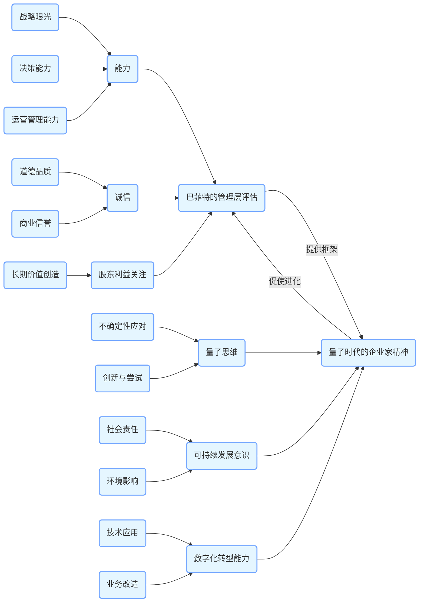

# 巴菲特的管理层评估：量子时代的企业家精神新标准

> 关键词：巴菲特、管理层评估、量子时代、企业家精神、评估标准

> 摘要：本文聚焦于巴菲特的管理层评估理念在量子时代的适应性与发展。深入探讨在量子时代这一全新背景下，传统的管理层评估标准如何演变，以及巴菲特的评估方法为确立企业家精神新标准带来的启示。通过剖析核心概念、算法原理、数学模型，结合项目实战案例，阐述新评估标准在实际应用场景中的作用，同时推荐相关学习资源、开发工具和研究论文，最后总结未来发展趋势与挑战，解答常见问题并提供扩展阅读和参考资料。

## 1. 背景介绍 
### 1.1 目的和范围
在当今科技飞速发展的量子时代，商业环境发生了翻天覆地的变化。传统的企业管理层评估标准在面对新的挑战和机遇时，需要进行重新审视和调整。本文的目的在于深入研究巴菲特的管理层评估理念，并探讨如何将其应用于量子时代，确立适应这一时代的企业家精神新标准。文章将涵盖从理论到实践的多个层面，包括核心概念的解读、评估算法的原理、数学模型的构建、实际案例的分析以及未来趋势的展望。

### 1.2 预期读者
本文预期读者包括企业管理者、投资者、创业者、学术研究人员以及对商业管理和投资领域感兴趣的人士。对于企业管理者和创业者而言，了解量子时代的管理层评估新标准有助于提升自身的管理能力和领导素养；投资者可以借助这些标准更好地评估投资对象的管理层质量；学术研究人员则可以从理论和实践的结合中获取新的研究思路和方向。

### 1.3 文档结构概述
本文将按照以下结构展开：首先介绍相关的背景信息，包括目的、预期读者和文档结构概述；接着阐述核心概念及其联系，通过文本示意图和 Mermaid 流程图进行说明；然后详细讲解核心算法原理和具体操作步骤，并使用 Python 源代码进行阐述；随后介绍数学模型和公式，并举例说明；再通过项目实战案例，包括开发环境搭建、源代码实现和代码解读，进一步说明新标准的应用；接着探讨实际应用场景；推荐相关的工具和资源；总结未来发展趋势与挑战；解答常见问题；最后提供扩展阅读和参考资料。

### 1.4 术语表
#### 1.4.1 核心术语定义
- **巴菲特的管理层评估**：指巴菲特在长期投资实践中形成的一套用于评估企业管理层能力、诚信和价值观等方面的方法和标准。
- **量子时代**：以量子技术、人工智能、大数据等新兴技术为特征，具有高度不确定性、快速变化和复杂性的时代。
- **企业家精神**：企业家所具备的创新、冒险、承担风险、领导力等特质和精神。
- **管理层评估标准**：用于衡量企业管理层综合素质和能力的一系列指标和准则。

#### 1.4.2 相关概念解释
- **量子思维**：强调在不确定性和复杂性环境中，采用灵活、创新和多元的思维方式来应对挑战和把握机遇。
- **可持续发展**：企业在追求经济利益的同时，也要考虑社会和环境的可持续性，实现长期的稳定发展。
- **数字化转型**：企业利用数字技术对业务流程、组织架构和商业模式进行全面改造和升级。

#### 1.4.3 缩略词列表
- AI：Artificial Intelligence，人工智能
- IoT：Internet of Things，物联网
- ESG：Environmental, Social and Governance，环境、社会和治理

## 2. 核心概念与联系 
### 核心概念原理
巴菲特的管理层评估主要关注管理层的能力、诚信和对股东利益的关注。在能力方面，他看重管理层的战略眼光、决策能力、运营管理能力等；在诚信方面，强调管理层的道德品质和商业信誉；对股东利益的关注则体现在管理层是否能够为股东创造长期的价值。

在量子时代，企业家精神需要具备新的内涵。量子思维要求企业家能够在不确定性中寻找机会，勇于尝试新的商业模式和技术应用；可持续发展意识促使企业家关注企业的社会责任和环境影响；数字化转型能力则是企业在新时代保持竞争力的关键。

这些概念之间存在着紧密的联系。巴菲特的管理层评估标准可以为量子时代的企业家精神提供一个基础框架，而量子时代的新要求又促使管理层评估标准不断进化。例如，具备量子思维的企业家更有可能做出符合长期发展的战略决策，这与巴菲特对管理层能力的要求相契合；注重可持续发展的企业家通常具有较高的诚信度，因为他们关注的不仅仅是短期利益，还包括企业的长期声誉和社会影响。

### 文本示意图
```plaintext
巴菲特的管理层评估
|-- 能力
|   |-- 战略眼光
|   |-- 决策能力
|   |-- 运营管理能力
|-- 诚信
|   |-- 道德品质
|   |-- 商业信誉
|-- 股东利益关注
|   |-- 长期价值创造

量子时代的企业家精神
|-- 量子思维
|   |-- 不确定性应对
|   |-- 创新与尝试
|-- 可持续发展意识
|   |-- 社会责任
|   |-- 环境影响
|-- 数字化转型能力
|   |-- 技术应用
|   |-- 业务改造

联系：
巴菲特的管理层评估标准 <-- 为 --> 量子时代的企业家精神提供框架
量子时代的新要求 <-- 促使 --> 巴菲特的管理层评估标准进化
```

### Mermaid 流程图


## 3. 核心算法原理 & 具体操作步骤 
### 核心算法原理
为了在量子时代评估管理层，我们可以构建一个综合评估模型。该模型将考虑巴菲特的传统评估因素和量子时代的新要求。具体来说，我们将使用多因素加权评分法，对管理层的各个方面进行量化评估。

假设我们有 $n$ 个评估因素，分别为 $F_1, F_2, \cdots, F_n$，每个因素对应的权重为 $w_1, w_2, \cdots, w_n$，且 $\sum_{i=1}^{n} w_i = 1$。对于每个因素，我们可以根据一定的标准对管理层进行评分，得到评分值 $s_1, s_2, \cdots, s_n$。则管理层的综合评估得分 $S$ 可以通过以下公式计算：

$$S = \sum_{i=1}^{n} w_i s_i$$

### 具体操作步骤
1. **确定评估因素**：结合巴菲特的管理层评估标准和量子时代的新要求，确定具体的评估因素。例如，能力方面可以包括战略规划能力、创新能力等；诚信方面可以包括道德行为记录、信息披露透明度等；量子时代的新因素可以包括数字化转型推进能力、可持续发展战略制定等。
2. **确定因素权重**：根据各因素的重要性，确定其对应的权重。可以通过专家评估、历史数据统计等方法来确定权重。例如，在量子时代，数字化转型能力可能相对重要，权重可以适当提高。
3. **进行评分**：根据预先制定的评分标准，对管理层在每个评估因素上进行评分。评分可以采用定性和定量相结合的方法，例如，对于战略规划能力，可以根据战略的前瞻性、可行性等方面进行评分。
4. **计算综合得分**：将每个因素的评分乘以其对应的权重，然后求和得到管理层的综合评估得分。
5. **评估结果分析**：根据综合得分，对管理层的表现进行评估。可以设定不同的得分区间，对应不同的评估等级，如优秀、良好、一般、较差等。

### Python 源代码实现
```python
# 评估因素列表
factors = ['战略规划能力', '创新能力', '道德行为记录', '信息披露透明度', '数字化转型推进能力', '可持续发展战略制定']

# 各因素对应的权重
weights = [0.2, 0.15, 0.1, 0.1, 0.25, 0.2]

# 假设的管理层评分
scores = [8, 7, 9, 8, 6, 7]

# 计算综合得分
def calculate_score(factors, weights, scores):
    if len(factors)!= len(weights) or len(weights)!= len(scores):
        raise ValueError("因素、权重和评分的长度必须一致")
    total_score = 0
    for i in range(len(factors)):
        total_score += weights[i] * scores[i]
    return total_score

# 调用函数计算综合得分
final_score = calculate_score(factors, weights, scores)
print(f"管理层的综合评估得分: {final_score}")
```

## 4. 数学模型和公式 & 详细讲解 & 举例说明 
### 数学模型
在上述核心算法原理中，我们使用的多因素加权评分法可以看作一个线性组合的数学模型。设 $F = [F_1, F_2, \cdots, F_n]^T$ 为评估因素向量，$W = [w_1, w_2, \cdots, w_n]^T$ 为权重向量，$S = [s_1, s_2, \cdots, s_n]^T$ 为评分向量，则综合评估得分 $S_{total}$ 可以表示为：

$$S_{total} = W^T S = \sum_{i=1}^{n} w_i s_i$$

### 详细讲解
这个数学模型的核心思想是将多个评估因素综合考虑，通过赋予不同的权重来体现各因素的重要性。权重的确定是模型的关键，它反映了在整体评估中每个因素所占的比重。评分向量则是对管理层在各个因素上的具体表现进行量化。通过将权重向量和评分向量进行内积运算，得到一个综合的评估得分，这个得分可以直观地反映管理层的整体表现。

### 举例说明
假设我们有三个评估因素：战略规划能力（$F_1$）、创新能力（$F_2$）和数字化转型能力（$F_3$），对应的权重分别为 $w_1 = 0.3$，$w_2 = 0.2$，$w_3 = 0.5$。对某企业管理层在这三个因素上的评分分别为 $s_1 = 7$，$s_2 = 8$，$s_3 = 6$。

根据公式 $S_{total} = \sum_{i=1}^{3} w_i s_i$，可以计算出该管理层的综合评估得分：

$$S_{total} = 0.3 \times 7 + 0.2 \times 8 + 0.5 \times 6$$
$$= 2.1 + 1.6 + 3$$
$$= 6.7$$

这意味着该管理层的综合表现得分为 6.7 分。我们可以根据预先设定的评分区间对其进行评估，例如，如果 8 分以上为优秀，6 - 8 分为良好，4 - 6 分为一般，4 分以下为较差，那么该管理层的表现为良好。

## 5. 项目实战：代码实际案例和详细解释说明 
### 5.1  开发环境搭建
为了实现上述评估模型，我们可以使用 Python 编程语言。以下是开发环境搭建的步骤：

1. **安装 Python**：从 Python 官方网站（https://www.python.org/downloads/）下载并安装适合你操作系统的 Python 版本。建议安装 Python 3.7 及以上版本。
2. **安装开发工具**：可以选择使用集成开发环境（IDE），如 PyCharm、Visual Studio Code 等，也可以使用文本编辑器，如 Sublime Text、Notepad++ 等。这里以 PyCharm 为例，从 JetBrains 官方网站（https://www.jetbrains.com/pycharm/download/）下载并安装 PyCharm 社区版。
3. **创建虚拟环境**：为了避免不同项目之间的依赖冲突，建议使用虚拟环境。在命令行中执行以下命令创建并激活虚拟环境：

```bash
# 创建虚拟环境
python -m venv myenv

# 激活虚拟环境（Windows）
myenv\Scripts\activate

# 激活虚拟环境（Linux/Mac）
source myenv/bin/activate
```

### 5.2  源代码详细实现和代码解读
```python
# 评估因素列表
factors = ['战略规划能力', '创新能力', '道德行为记录', '信息披露透明度', '数字化转型推进能力', '可持续发展战略制定']

# 各因素对应的权重
weights = [0.2, 0.15, 0.1, 0.1, 0.25, 0.2]

# 输入管理层评分的函数
def input_scores(factors):
    scores = []
    for factor in factors:
        while True:
            try:
                score = float(input(f"请输入管理层在 {factor} 方面的评分（0 - 10 分）: "))
                if 0 <= score <= 10:
                    scores.append(score)
                    break
                else:
                    print("评分必须在 0 - 10 分之间，请重新输入。")
            except ValueError:
                print("输入无效，请输入一个有效的数字。")
    return scores

# 计算综合得分
def calculate_score(factors, weights, scores):
    if len(factors)!= len(weights) or len(weights)!= len(scores):
        raise ValueError("因素、权重和评分的长度必须一致")
    total_score = 0
    for i in range(len(factors)):
        total_score += weights[i] * scores[i]
    return total_score

# 主函数
def main():
    scores = input_scores(factors)
    final_score = calculate_score(factors, weights, scores)
    print(f"管理层的综合评估得分: {final_score}")

    # 根据得分给出评估等级
    if final_score >= 8:
        print("评估等级: 优秀")
    elif final_score >= 6:
        print("评估等级: 良好")
    elif final_score >= 4:
        print("评估等级: 一般")
    else:
        print("评估等级: 较差")

if __name__ == "__main__":
    main()
```

### 代码解读与分析
- **评估因素列表和权重**：`factors` 列表存储了所有的评估因素，`weights` 列表存储了各因素对应的权重。这些因素和权重可以根据实际情况进行调整。
- **输入管理层评分的函数 `input_scores`**：该函数用于获取用户输入的管理层在各个评估因素上的评分。它会对用户输入进行验证，确保评分在 0 - 10 分之间。
- **计算综合得分的函数 `calculate_score`**：该函数实现了多因素加权评分的计算逻辑。它会检查因素、权重和评分的长度是否一致，如果不一致会抛出异常。
- **主函数 `main`**：在主函数中，首先调用 `input_scores` 函数获取用户输入的评分，然后调用 `calculate_score` 函数计算综合得分。最后根据得分给出评估等级。

## 6. 实际应用场景 
### 企业内部管理
在企业内部，管理层评估可以作为人力资源管理的重要工具。通过定期对管理层进行评估，可以发现管理层的优势和不足，为管理层的培训和发展提供依据。例如，如果评估发现管理层在数字化转型能力方面较弱，可以为其提供相关的培训课程和学习机会，提升其数字化管理能力。

### 投资者决策
对于投资者来说，管理层的质量是影响投资决策的重要因素之一。通过使用量子时代的管理层评估新标准，投资者可以更全面地了解企业管理层的能力和素质，从而更准确地评估企业的投资价值。例如，如果一家企业的管理层在可持续发展战略制定方面表现出色，说明该企业具有较好的长期发展潜力，投资者可能更愿意对其进行投资。

### 企业战略规划
管理层评估结果可以为企业的战略规划提供参考。如果评估发现管理层在某些方面存在不足，企业可以在战略规划中制定相应的改进措施。例如，如果管理层的创新能力较弱，企业可以在战略中加大对研发的投入，鼓励创新，提升企业的核心竞争力。

### 行业竞争分析
在行业竞争中，通过比较不同企业管理层的评估得分，可以了解各企业在管理层素质方面的差异。这有助于企业发现自身的竞争优势和劣势，制定相应的竞争策略。例如，如果一家企业的管理层在数字化转型能力方面得分较高，而竞争对手得分较低，该企业可以利用这一优势，加快数字化转型步伐，抢占市场份额。

## 7. 工具和资源推荐
### 7.1 学习资源推荐
#### 7.1.1 书籍推荐
- 《巴菲特致股东的信：投资者和公司高管教程》：这本书汇集了巴菲特多年来写给股东的信，其中包含了他对企业管理、投资理念等方面的深刻见解，是学习巴菲特投资和管理思想的经典之作。
- 《创新者的窘境》：探讨了创新在企业发展中的重要性以及企业如何应对创新带来的挑战，对于理解量子时代企业家的创新精神具有重要意义。
- 《可持续发展：企业战略与实践》：介绍了企业在可持续发展方面的战略和实践方法，有助于了解量子时代企业家的可持续发展意识。

#### 7.1.2 在线课程
- Coursera 平台上的“商业领导力”课程：提供了关于领导力、管理决策等方面的知识和技能培训，有助于提升管理层的综合能力。
- edX 平台上的“数字化转型战略”课程：深入讲解了企业数字化转型的战略和方法，适合学习量子时代的数字化转型能力。
- 中国大学 MOOC 上的“创新创业基础”课程：培养创新创业思维和能力，对于理解企业家精神具有重要帮助。

#### 7.1.3 技术博客和网站
- 36氪：关注科技、商业等领域的最新动态和创新趋势，提供大量关于企业家精神和企业管理的文章和案例。
- 虎嗅网：以深度报道和独到观点著称，对商业领域的热点问题进行分析和解读，有助于了解行业最新动态。
- Medium 上的商业和管理相关博客：有许多专业人士分享的关于企业管理、投资等方面的经验和见解。

### 7.2 开发工具框架推荐
#### 7.2.1 IDE和编辑器
- PyCharm：功能强大的 Python 集成开发环境，提供代码编辑、调试、版本控制等一系列功能，适合 Python 开发。
- Visual Studio Code：轻量级的代码编辑器，支持多种编程语言，具有丰富的插件生态系统，可以根据需要进行扩展。
- Jupyter Notebook：交互式的开发环境，适合进行数据分析和模型验证，方便展示代码和结果。

#### 7.2.2 调试和性能分析工具
- PDB：Python 自带的调试器，可以帮助开发者定位代码中的问题。
- cProfile：Python 的性能分析工具，可以分析代码的运行时间和函数调用情况，找出性能瓶颈。
- Py-Spy：用于实时分析 Python 程序的性能，提供直观的可视化界面。

#### 7.2.3 相关框架和库
- NumPy：Python 的科学计算库，提供高效的数组操作和数学函数，对于处理评估模型中的数据计算非常有用。
- Pandas：用于数据处理和分析的库，提供了方便的数据结构和数据操作方法，可用于存储和处理评估数据。
- Matplotlib：Python 的绘图库，可以用于可视化评估结果，如绘制评分柱状图、权重饼图等。

### 7.3 相关论文著作推荐
#### 7.3.1 经典论文
- Jensen, M. C., & Meckling, W. H. (1976). Theory of the firm: Managerial behavior, agency costs and ownership structure. Journal of Financial Economics, 3(4), 305 - 360. 这篇论文提出了代理理论，探讨了管理层和股东之间的利益冲突问题，对于理解管理层评估的重要性具有重要意义。
- Porter, M. E. (1985). Competitive advantage: Creating and sustaining superior performance. Free Press. 波特的这一著作阐述了企业竞争优势的来源和获取方法，为企业管理层的战略决策提供了理论基础。

#### 7.3.2 最新研究成果
- 关于量子时代企业管理创新的相关研究论文，如探讨量子技术对企业管理模式的影响、量子思维在企业决策中的应用等方面的研究。
- 关于可持续发展和企业社会责任的最新研究，包括如何将可持续发展理念融入企业战略和管理实践中。

#### 7.3.3 应用案例分析
- 分析成功企业在管理层评估和企业家精神培养方面的案例，如苹果、谷歌等公司如何选拔和培养优秀的管理层，以及他们的企业家精神如何推动企业的发展。
- 研究新兴科技企业在量子时代的发展案例，了解他们如何适应新的商业环境，发挥企业家精神实现创新和突破。

## 8. 总结：未来发展趋势与挑战
### 未来发展趋势
- **技术驱动的评估创新**：随着量子技术、人工智能、大数据等技术的不断发展，管理层评估将更加依赖于先进的技术手段。例如，利用人工智能算法对大量的企业数据进行分析，更准确地评估管理层的能力和绩效；借助量子计算的强大计算能力，处理更复杂的评估模型和数据。
- **跨学科融合的评估标准**：量子时代的企业面临着更加复杂的商业环境，需要管理层具备跨学科的知识和能力。因此，管理层评估标准将逐渐融合管理学、经济学、物理学、计算机科学等多个学科的知识，形成更加全面和综合的评估体系。
- **强调可持续发展和社会责任**：可持续发展和社会责任将成为未来管理层评估的重要内容。消费者和投资者越来越关注企业的社会和环境影响，管理层需要在追求经济利益的同时，考虑企业的长期可持续发展和社会贡献。

### 挑战
- **数据安全和隐私问题**：在利用大数据和人工智能进行管理层评估时，需要收集和处理大量的企业和个人数据。这就带来了数据安全和隐私保护的问题。如何确保数据的安全性和隐私性，防止数据泄露和滥用，是需要解决的重要挑战。
- **评估标准的动态调整**：量子时代的商业环境变化迅速，评估标准需要及时进行调整和更新。然而，确定合适的评估标准和调整时机并非易事，需要综合考虑多种因素，包括技术发展、市场趋势、行业竞争等。
- **人才培养和能力提升**：为了适应量子时代的管理层评估新标准，企业需要培养和吸引具备跨学科知识和能力的管理人才。这对企业的人力资源管理和人才培养体系提出了更高的要求，需要企业加大对人才培养的投入，提供更多的学习和发展机会。

## 9. 附录：常见问题与解答
### 问题 1：如何确定评估因素的权重？
答：确定评估因素的权重可以采用多种方法。一种常见的方法是专家评估法，邀请行业专家、学者和企业高管等对各因素的重要性进行评估，然后综合他们的意见确定权重。另一种方法是历史数据统计法，通过分析历史上企业的经营业绩和管理层表现，找出各因素与企业绩效之间的相关性，根据相关性确定权重。还可以使用层次分析法（AHP）等数学方法，将各因素进行两两比较，构建判断矩阵，通过计算矩阵的特征向量来确定权重。

### 问题 2：评估结果的准确性如何保证？
答：为了保证评估结果的准确性，需要从多个方面入手。首先，评估因素的选择要全面、合理，能够反映管理层的真实能力和素质。其次，评分标准要明确、客观，避免主观随意性。可以采用定性和定量相结合的方法进行评分，例如，对于某些因素可以制定具体的量化指标，对于难以量化的因素可以采用专家评估和问卷调查等方式进行评分。此外，还可以进行多次评估和交叉验证，以提高评估结果的可靠性。

### 问题 3：量子时代的管理层评估与传统评估有哪些不同？
答：量子时代的管理层评估与传统评估相比，主要有以下几个方面的不同。一是更加注重创新和变革能力，量子时代技术发展迅速，企业需要不断创新和变革才能适应市场变化。二是强调可持续发展和社会责任，企业不仅要追求经济利益，还要考虑社会和环境的可持续性。三是引入了量子思维等新的理念，要求管理层具备在不确定性和复杂性环境中决策的能力。四是更加依赖先进的技术手段，如大数据、人工智能等，以提高评估的准确性和效率。

### 问题 4：评估结果如何应用于企业管理中？
答：评估结果可以在企业管理的多个方面得到应用。在人力资源管理方面，可以根据评估结果为管理层提供培训和发展建议，进行绩效评估和薪酬调整，选拔和晋升优秀的管理人员。在战略规划方面，评估结果可以为企业的战略制定提供参考，帮助企业发现自身的优势和不足，制定相应的战略措施。在投资决策方面，评估结果可以作为投资者评估企业投资价值的重要依据，影响投资者的投资决策。

## 10. 扩展阅读 & 参考资料
### 扩展阅读
- 《从 0 到 1：开启商业与未来的秘密》：这本书探讨了创业和创新的本质，对于理解量子时代企业家的创新精神和创业思维具有启发作用。
- 《大数据时代：生活、工作与思维的大变革》：介绍了大数据技术的发展和应用，以及它对各个领域的影响，有助于了解在量子时代如何利用大数据进行管理层评估。
- 《管理的实践》：经典的管理学著作，阐述了管理的基本原理和方法，为理解企业管理层的职责和作用提供了理论基础。

### 参考资料
- 巴菲特历年致股东的信，可从伯克希尔·哈撒韦公司官方网站获取。
- 相关学术期刊，如《管理世界》、《经济研究》、《哈佛商业评论》等，发表了大量关于企业管理、投资和企业家精神的研究论文。
- 行业报告和研究机构发布的资料，如麦肯锡、波士顿咨询等机构发布的关于企业数字化转型、可持续发展等方面的报告。