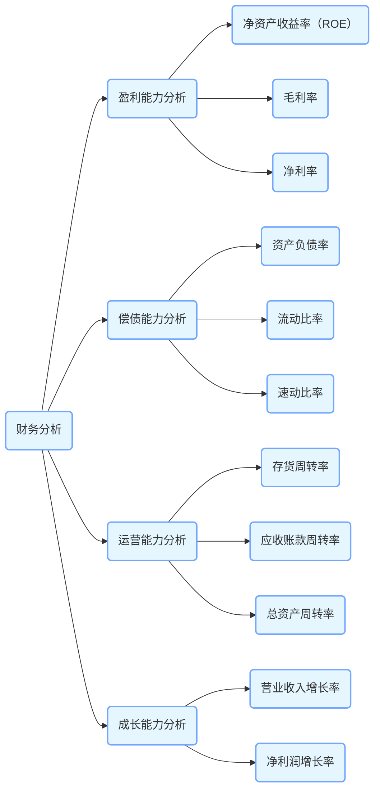

# 巴菲特的财务分析技巧：解读财报的关键指标

> 关键词：巴菲特、财务分析技巧、财报解读、关键指标、价值投资

> 摘要：本文深入探讨了巴菲特的财务分析技巧，聚焦于解读财报的关键指标。从背景介绍出发，阐述了理解这些技巧和指标的目的、适用读者群体以及文档结构。详细讲解了与财务分析相关的核心概念及其联系，用Python代码阐述关键指标分析的核心算法原理和具体操作步骤，结合数学模型和公式进行详细说明并举例。通过项目实战展示如何运用这些指标进行财报分析，包括开发环境搭建、源代码实现与解读。同时介绍了这些技巧和指标在实际中的应用场景，推荐了相关的学习资源、开发工具框架以及论文著作。最后总结了未来财务分析的发展趋势与挑战，并提供常见问题解答和扩展阅读参考资料，旨在帮助读者掌握巴菲特式的财务分析方法，提升财报解读能力。

## 1. 背景介绍 
### 1.1 目的和范围
本文章的主要目的是深入剖析巴菲特的财务分析技巧，详细解读在财报中具有关键作用的指标。通过对这些技巧和指标的研究，帮助投资者、财务分析人员以及对财务知识感兴趣的人士更好地理解企业的财务状况，评估企业的价值和投资潜力。范围涵盖了巴菲特在长期投资实践中所关注的主要财务指标，包括但不限于盈利能力、偿债能力、运营能力等方面的指标，以及如何运用这些指标进行综合分析。

### 1.2 预期读者
本文预期读者包括各类投资者，如个人投资者、机构投资者等，他们希望通过学习巴菲特的财务分析方法来优化自己的投资决策。同时，财务分析专业人员可以从本文中获取更深入的分析思路和方法，提升自身的专业水平。此外，对财务知识有兴趣的学生和普通爱好者也能通过本文了解到实用的财报解读技巧。

### 1.3 文档结构概述
本文将首先介绍与财务分析相关的核心概念，包括各关键指标的定义和它们之间的联系，通过文本示意图和Mermaid流程图进行直观展示。接着阐述核心算法原理和具体操作步骤，使用Python代码进行详细说明。然后介绍数学模型和公式，并举例说明如何运用这些公式进行指标计算和分析。在项目实战部分，将展示如何搭建开发环境，实现源代码并进行详细解读。之后探讨这些财务分析技巧和指标在实际中的应用场景。再推荐相关的学习资源、开发工具框架以及论文著作。最后总结未来财务分析的发展趋势与挑战，提供常见问题解答和扩展阅读参考资料。

### 1.4 术语表
#### 1.4.1 核心术语定义
- **净资产收益率（ROE）**：又称股东权益报酬率，是净利润与平均股东权益的百分比，反映股东权益的收益水平，用以衡量公司运用自有资本的效率。计算公式为：$ROE = \frac{净利润}{平均股东权益} \times 100\%$。
- **毛利率**：是毛利与销售收入（或营业收入）的百分比，其中毛利是收入和与收入相对应的营业成本之间的差额。计算公式为：$毛利率 = \frac{营业收入 - 营业成本}{营业收入} \times 100\%$。
- **资产负债率**：是期末负债总额除以资产总额的百分比，也就是负债总额与资产总额的比例关系。它反映在总资产中有多大比例是通过借债来筹资的，也可以衡量企业在清算时保护债权人利益的程度。计算公式为：$资产负债率 = \frac{负债总额}{资产总额} \times 100\%$。
- **存货周转率**：是企业一定时期营业成本（销货成本）与平均存货余额的比率。用于反映存货的周转速度，即存货的流动性及存货资金占用量是否合理，促使企业在保证生产经营连续性的同时，提高资金的使用效率，增强企业的短期偿债能力。计算公式为：$存货周转率 = \frac{营业成本}{平均存货余额}$。

#### 1.4.2 相关概念解释
- **价值投资**：是一种投资策略，强调通过对企业内在价值的分析来选择投资标的。价值投资者相信市场有时会低估企业的真实价值，通过深入研究企业的财务报表和基本面，找到被低估的股票并长期持有，等待市场对企业价值的重新认识，从而获得投资回报。巴菲特是价值投资的典型代表人物。
- **财务报表**：是企业向外界展示其财务状况和经营成果的重要文件，主要包括资产负债表、利润表和现金流量表。资产负债表反映企业在某一特定日期的财务状况，利润表反映企业在一定会计期间的经营成果，现金流量表反映企业在一定会计期间的现金和现金等价物流入和流出情况。

#### 1.4.3 缩略词列表
- **ROE**：Return on Equity，净资产收益率
- **EPS**：Earnings Per Share，每股收益

## 2. 核心概念与联系 
### 核心概念原理
#### 盈利能力指标
- **净资产收益率（ROE）**：ROE是衡量企业盈利能力的核心指标之一。它反映了企业运用股东投入资本创造利润的能力。较高的ROE意味着企业能够更有效地利用股东的资金，为股东创造更多的价值。例如，一家企业的ROE持续保持在20%以上，说明该企业在盈利方面表现出色，具有较强的竞争力。
- **毛利率**：毛利率体现了企业产品或服务的基本盈利空间。较高的毛利率表明企业在成本控制或产品定价方面具有优势。例如，一家科技公司的毛利率达到50%以上，说明该公司的产品具有较高的附加值，在市场上有较强的定价权。

#### 偿债能力指标
- **资产负债率**：资产负债率反映了企业的负债水平和偿债风险。较低的资产负债率意味着企业的负债相对较少，偿债能力较强，财务风险较低。例如，一家企业的资产负债率在30%以下，说明该企业的财务状况较为稳健，有较强的偿债能力。
- **流动比率**：流动比率是流动资产与流动负债的比率，用于衡量企业短期偿债能力。一般来说，流动比率大于2被认为企业具有较好的短期偿债能力。例如，一家企业的流动比率为2.5，说明该企业的流动资产能够较好地覆盖流动负债，短期偿债压力较小。

#### 运营能力指标
- **存货周转率**：存货周转率反映了企业存货的管理效率。较高的存货周转率意味着企业能够快速地将存货销售出去，减少存货积压，提高资金使用效率。例如，一家服装企业的存货周转率较高，说明该企业的服装款式能够及时跟上市场需求，销售情况良好。
- **应收账款周转率**：应收账款周转率反映了企业收回应收账款的速度。较高的应收账款周转率表明企业能够及时收回应收账款，减少坏账损失，提高资金回笼速度。例如，一家企业的应收账款周转率较高，说明该企业在销售信用管理方面做得较好，客户付款较为及时。

### 架构的文本示意图
```plaintext
财务分析
|-- 盈利能力分析
|   |-- 净资产收益率（ROE）
|   |-- 毛利率
|   |-- 净利率
|-- 偿债能力分析
|   |-- 资产负债率
|   |-- 流动比率
|   |-- 速动比率
|-- 运营能力分析
|   |-- 存货周转率
|   |-- 应收账款周转率
|   |-- 总资产周转率
|-- 成长能力分析
|   |-- 营业收入增长率
|   |-- 净利润增长率
```

### Mermaid流程图


## 3. 核心算法原理 & 具体操作步骤 
### 核心算法原理
在财务分析中，我们主要通过计算各种财务指标来评估企业的财务状况。下面以计算净资产收益率（ROE）、毛利率和资产负债率为例，介绍核心算法原理。

#### 净资产收益率（ROE）
ROE的计算原理是将企业的净利润除以平均股东权益，再乘以100%得到百分比形式。平均股东权益通常是期初股东权益和期末股东权益的平均值。通过计算ROE，我们可以了解企业运用股东投入资本创造利润的效率。

#### 毛利率
毛利率的计算原理是用营业收入减去营业成本，得到毛利，再将毛利除以营业收入，最后乘以100%得到百分比形式。毛利率反映了企业产品或服务的基本盈利空间。

#### 资产负债率
资产负债率的计算原理是将企业的负债总额除以资产总额，再乘以100%得到百分比形式。资产负债率反映了企业的负债水平和偿债风险。

### 具体操作步骤及Python代码实现
```python
# 假设我们有以下财务数据
net_income = 1000000  # 净利润
beginning_equity = 5000000  # 期初股东权益
ending_equity = 6000000  # 期末股东权益
operating_income = 5000000  # 营业收入
operating_cost = 3000000  # 营业成本
total_liabilities = 2000000  # 负债总额
total_assets = 8000000  # 资产总额

# 计算平均股东权益
average_equity = (beginning_equity + ending_equity) / 2

# 计算净资产收益率（ROE）
roe = (net_income / average_equity) * 100
print(f"净资产收益率（ROE）: {roe:.2f}%")

# 计算毛利率
gross_profit = operating_income - operating_cost
gross_margin = (gross_profit / operating_income) * 100
print(f"毛利率: {gross_margin:.2f}%")

# 计算资产负债率
debt_ratio = (total_liabilities / total_assets) * 100
print(f"资产负债率: {debt_ratio:.2f}%")
```
### 代码解释
1. 首先，我们定义了所需的财务数据，包括净利润、期初股东权益、期末股东权益、营业收入、营业成本、负债总额和资产总额。
2. 然后，计算平均股东权益，通过将期初股东权益和期末股东权益相加并除以2得到。
3. 接着，根据ROE的计算公式，将净利润除以平均股东权益并乘以100，得到ROE的值，并使用`print`函数输出结果，保留两位小数。
4. 计算毛利率时，先计算毛利，即营业收入减去营业成本，然后将毛利除以营业收入并乘以100，得到毛利率的值并输出。
5. 最后，根据资产负债率的计算公式，将负债总额除以资产总额并乘以100，得到资产负债率的值并输出。

## 4. 数学模型和公式 & 详细讲解 & 举例说明 
### 净资产收益率（ROE）
#### 数学模型和公式
$ROE = \frac{净利润}{平均股东权益} \times 100\%$

其中，$平均股东权益 = \frac{期初股东权益 + 期末股东权益}{2}$

#### 详细讲解
ROE是衡量企业盈利能力的重要指标，它反映了股东每投入一元资本所能获得的净利润。ROE越高，说明企业利用股东资金创造利润的能力越强。一般来说，ROE持续稳定在15%以上的企业被认为具有较好的盈利能力。

#### 举例说明
假设A公司2022年初股东权益为5000万元，年末股东权益为6000万元，2022年净利润为1000万元。

首先计算平均股东权益：
$平均股东权益 = \frac{5000 + 6000}{2} = 5500$（万元）

然后计算ROE：
$ROE = \frac{1000}{5500} \times 100\% \approx 18.18\%$

这表明A公司在2022年利用股东资金创造利润的能力较强，每投入100元股东资金大约能获得18.18元的净利润。

### 毛利率
#### 数学模型和公式
$毛利率 = \frac{营业收入 - 营业成本}{营业收入} \times 100\%$

#### 详细讲解
毛利率反映了企业产品或服务的基本盈利空间，是企业盈利能力的基础。较高的毛利率意味着企业在成本控制或产品定价方面具有优势。不同行业的毛利率水平差异较大，一般来说，高科技行业、奢侈品行业的毛利率相对较高，而传统制造业、零售业的毛利率相对较低。

#### 举例说明
假设B公司2022年营业收入为8000万元，营业成本为5000万元。

计算毛利率：
$毛利率 = \frac{8000 - 5000}{8000} \times 100\% = 37.5\%$

这表明B公司的产品或服务在扣除直接成本后，还有37.5%的毛利空间，说明该公司在成本控制或产品定价方面有一定优势。

### 资产负债率
#### 数学模型和公式
$资产负债率 = \frac{负债总额}{资产总额} \times 100\%$

#### 详细讲解
资产负债率反映了企业的负债水平和偿债风险。较低的资产负债率意味着企业的负债相对较少，偿债能力较强，财务风险较低；而较高的资产负债率则意味着企业的负债较多，偿债压力较大，财务风险较高。一般来说，资产负债率在40% - 60%之间被认为是比较合理的范围，但不同行业的情况有所不同。

#### 举例说明
假设C公司2022年末负债总额为3000万元，资产总额为8000万元。

计算资产负债率：
$资产负债率 = \frac{3000}{8000} \times 100\% = 37.5\%$

这表明C公司的负债水平相对较低，偿债能力较强，财务风险相对较小。

## 5. 项目实战：代码实际案例和详细解释说明 
### 5.1  开发环境搭建
#### 安装Python
首先，你需要安装Python。可以从Python官方网站（https://www.python.org/downloads/）下载适合你操作系统的Python安装包，按照安装向导进行安装。安装完成后，打开命令行工具，输入`python --version`，如果能正确显示Python版本号，说明安装成功。

#### 安装必要的库
在进行财务分析时，我们需要使用一些Python库，如`pandas`用于数据处理和分析，`numpy`用于数值计算。可以使用以下命令来安装这些库：
```sh
pip install pandas numpy
```

### 5.2  源代码详细实现和代码解读
```python
import pandas as pd
import numpy as np

# 读取财务数据文件，假设文件为CSV格式
data = pd.read_csv('financial_data.csv')

# 计算净资产收益率（ROE）
data['平均股东权益'] = (data['期初股东权益'] + data['期末股东权益']) / 2
data['ROE'] = (data['净利润'] / data['平均股东权益']) * 100

# 计算毛利率
data['毛利'] = data['营业收入'] - data['营业成本']
data['毛利率'] = (data['毛利'] / data['营业收入']) * 100

# 计算资产负债率
data['资产负债率'] = (data['负债总额'] / data['资产总额']) * 100

# 输出结果
print(data[['年份', 'ROE', '毛利率', '资产负债率']])
```
### 代码解读与分析
1. **导入必要的库**：使用`import`语句导入`pandas`和`numpy`库，`pandas`用于数据处理和分析，`numpy`用于数值计算。
2. **读取财务数据文件**：使用`pd.read_csv`函数读取CSV格式的财务数据文件，将数据存储在`data`变量中。
3. **计算净资产收益率（ROE）**：首先计算平均股东权益，通过将期初股东权益和期末股东权益相加并除以2得到。然后根据ROE的计算公式，将净利润除以平均股东权益并乘以100，得到ROE的值，并将结果存储在`data`数据框的`ROE`列中。
4. **计算毛利率**：先计算毛利，即营业收入减去营业成本，然后将毛利除以营业收入并乘以100，得到毛利率的值，并将结果存储在`data`数据框的`毛利率`列中。
5. **计算资产负债率**：根据资产负债率的计算公式，将负债总额除以资产总额并乘以100，得到资产负债率的值，并将结果存储在`data`数据框的`资产负债率`列中。
6. **输出结果**：使用`print`函数输出包含年份、ROE、毛利率和资产负债率的结果。

## 6. 实际应用场景 
### 投资决策
投资者可以运用巴菲特的财务分析技巧和关键指标来评估企业的投资价值。通过分析企业的ROE、毛利率、资产负债率等指标，投资者可以判断企业的盈利能力、偿债能力和运营能力，从而筛选出具有投资潜力的企业。例如，如果一家企业的ROE持续稳定在较高水平，毛利率也较高，资产负债率较低，那么该企业可能是一个较好的投资标的。

### 企业内部管理
企业管理层可以利用这些财务分析指标来评估企业的经营状况，发现企业存在的问题并及时采取措施进行改进。例如，如果企业的存货周转率较低，说明企业的存货管理可能存在问题，管理层可以采取优化库存管理、加快产品销售等措施来提高存货周转率。

### 信贷评估
银行等金融机构在进行信贷评估时，可以参考企业的财务指标来评估企业的偿债能力和信用风险。例如，资产负债率较低、流动比率较高的企业通常具有较强的偿债能力，银行可以更放心地为其提供贷款。

### 行业比较
通过对同行业不同企业的财务指标进行比较，可以了解企业在行业中的竞争力和地位。例如，比较同行业企业的毛利率，可以发现哪些企业在成本控制或产品定价方面具有优势。

## 7. 工具和资源推荐
### 7.1 学习资源推荐
#### 7.1.1 书籍推荐
- 《聪明的投资者》（The Intelligent Investor）：作者是本杰明·格雷厄姆（Benjamin Graham），这本书是价值投资领域的经典之作，巴菲特称这本书是他投资的“圣经”。书中详细阐述了价值投资的理念和方法，对财务分析有深入的讲解。
- 《巴菲特致股东的信：股份公司教程》（Letters to Shareholders of Berkshire Hathaway）：这本书收集了巴菲特多年来致股东的信，通过这些信件可以了解巴菲特的投资思想、财务分析方法和企业管理理念。
- 《财务报表分析与证券定价》（Financial Statement Analysis and Security Valuation）：作者是斯蒂芬·佩因曼（Stephen Penman），这本书系统地介绍了财务报表分析的方法和技术，以及如何运用这些方法进行证券定价。

#### 7.1.2 在线课程
- Coursera上的“Financial Markets”：由耶鲁大学的罗伯特·席勒（Robert Shiller）教授授课，课程涵盖了金融市场的各个方面，包括财务分析、投资策略等内容。
- edX上的“Introduction to Financial Accounting”：这门课程由麻省理工学院（MIT）的教授授课，介绍了财务会计的基本概念和方法，对于理解财务报表有很大帮助。

#### 7.1.3 技术博客和网站
- Seeking Alpha：这是一个提供金融市场分析和投资建议的网站，上面有很多专业的分析师和投资者分享他们的财务分析报告和投资观点。
- ValueWalk：专注于价值投资领域，提供有关价值投资的最新消息、研究报告和案例分析。

### 7.2 开发工具框架推荐
#### 7.2.1 IDE和编辑器
- PyCharm：是一款专门为Python开发设计的集成开发环境（IDE），具有强大的代码编辑、调试和代码分析功能，适合进行财务分析代码的开发。
- Jupyter Notebook：是一个交互式的开发环境，支持Python等多种编程语言。它可以将代码、文本、图表等内容整合在一起，方便进行数据分析和可视化展示。

#### 7.2.2 调试和性能分析工具
- PDB：是Python自带的调试工具，可以帮助开发者在代码运行过程中进行调试，查找代码中的错误。
- cProfile：是Python的性能分析工具，可以分析代码的运行时间和函数调用情况，帮助开发者优化代码性能。

#### 7.2.3 相关框架和库
- Pandas：是Python中用于数据处理和分析的重要库，提供了高效的数据结构和数据分析工具，非常适合处理财务数据。
- Numpy：是Python中用于数值计算的基础库，提供了多维数组对象和各种数学函数，在财务分析中经常用于数值计算。
- Matplotlib：是Python中用于数据可视化的库，可以绘制各种类型的图表，如折线图、柱状图、饼图等，帮助用户直观地展示财务数据。

### 7.3 相关论文著作推荐
#### 7.3.1 经典论文
- “The Capital Asset Pricing Model: Theory and Evidence”：由尤金·法玛（Eugene F. Fama）和肯尼斯·弗伦奇（Kenneth R. French）发表，这篇论文对资本资产定价模型进行了深入的研究和探讨，对财务分析和投资理论有重要影响。
- “Earnings, Book Values, and Dividends in Equity Valuation”：由詹姆斯·奥肖内西（James O'Shaughnessy）发表，论文研究了盈利、账面价值和股息在股票估值中的作用，为财务分析提供了重要的理论依据。

#### 7.3.2 最新研究成果
- 关注顶级金融学术期刊，如《Journal of Finance》《Review of Financial Studies》等，这些期刊上发表的最新研究成果可以帮助读者了解财务分析领域的前沿动态。

#### 7.3.3 应用案例分析
- 可以参考一些知名投资机构的研究报告，如高盛、摩根大通等，这些报告中通常包含了对企业财务状况的详细分析和投资建议，具有较高的参考价值。

## 8. 总结：未来发展趋势与挑战
### 未来发展趋势
#### 数字化和智能化
随着信息技术的不断发展，财务分析将越来越数字化和智能化。利用大数据、人工智能等技术，可以更高效地处理和分析海量的财务数据，挖掘数据背后的潜在信息。例如，通过机器学习算法可以对企业的财务指标进行预测，帮助投资者和企业管理层做出更准确的决策。

#### 非财务指标的重要性增加
除了传统的财务指标，未来非财务指标如客户满意度、员工满意度、创新能力等将越来越受到关注。这些非财务指标可以反映企业的长期发展潜力和竞争力，与财务指标相结合，可以更全面地评估企业的价值。

#### 国际化和全球化
随着经济全球化的发展，企业的跨国经营越来越普遍。财务分析需要考虑不同国家和地区的会计准则、税收政策等因素，进行国际化和全球化的分析。同时，投资者也需要关注全球市场的动态，进行跨国投资决策。

### 挑战
#### 数据质量和安全问题
在数字化时代，财务数据的质量和安全是一个重要挑战。不准确或不完整的数据可能会导致错误的分析结果，而数据泄露和安全问题则可能给企业和投资者带来巨大的损失。因此，需要加强数据质量管理和安全保障。

#### 技术更新换代快
信息技术的快速发展使得财务分析工具和方法不断更新换代。财务分析人员需要不断学习和掌握新的技术和方法，以适应市场的变化。同时，企业也需要不断投入资源进行技术升级和人才培养。

#### 复杂的市场环境
全球经济形势的不确定性、政策法规的变化等因素使得市场环境变得越来越复杂。财务分析需要考虑更多的因素，对分析人员的综合素质和专业能力提出了更高的要求。

## 9. 附录：常见问题与解答
### 问题1：ROE越高越好吗？
解答：一般来说，ROE越高说明企业的盈利能力越强，但并不是ROE越高就一定越好。有些企业可能通过高负债来提高ROE，这种情况下企业的财务风险也会相应增加。因此，在分析ROE时，需要结合企业的资产负债率等指标进行综合分析。

### 问题2：毛利率下降一定意味着企业盈利能力下降吗？
解答：不一定。毛利率下降可能是由于多种原因引起的，如原材料价格上涨、市场竞争加剧等。在判断企业盈利能力是否下降时，需要综合考虑其他因素，如净利润率、营业收入增长率等。

### 问题3：资产负债率多少比较合适？
解答：资产负债率的合适范围因行业而异。一般来说，资产负债率在40% - 60%之间被认为是比较合理的范围，但一些重资产行业如房地产、制造业的资产负债率可能会相对较高，而一些轻资产行业如科技、服务行业的资产负债率可能会相对较低。

### 问题4：如何选择合适的财务分析指标？
解答：选择合适的财务分析指标需要根据分析的目的和企业的特点来确定。如果是评估企业的盈利能力，可以选择ROE、毛利率、净利率等指标；如果是评估企业的偿债能力，可以选择资产负债率、流动比率、速动比率等指标；如果是评估企业的运营能力，可以选择存货周转率、应收账款周转率等指标。同时，还需要结合行业特点和企业的发展阶段进行综合分析。

## 10. 扩展阅读 & 参考资料
### 扩展阅读
- 《证券分析》（Security Analysis）：本杰明·格雷厄姆和戴维·多德（David Dodd）的经典著作，深入探讨了证券分析的理论和方法，对财务分析有重要的指导意义。
- 《金融炼金术》（The Alchemy of Finance）：乔治·索罗斯（George Soros）的著作，介绍了他的投资哲学和金融市场分析方法。

### 参考资料
- 各上市公司的财务报表和年报，可以从证券交易所的官方网站获取。
- 相关的金融学术期刊和研究报告，如《Journal of Accounting Research》《Financial Analysts Journal》等。