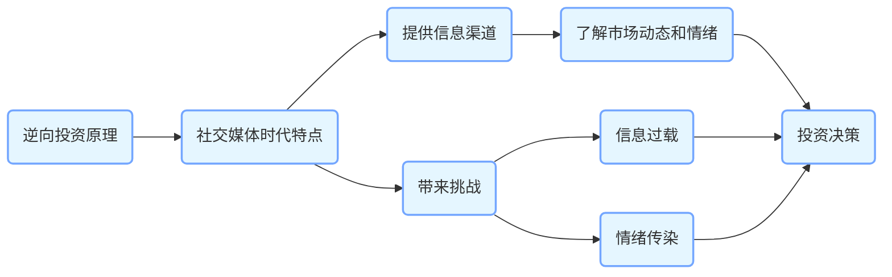

# 巴菲特的逆向投资艺术：在社交媒体时代的执行挑战

> 关键词：巴菲特、逆向投资、社交媒体时代、执行挑战、投资策略

> 摘要：本文深入探讨了巴菲特的逆向投资艺术在社交媒体时代所面临的执行挑战。首先介绍了逆向投资的背景与基本概念，阐述其核心原理与逻辑架构。接着分析在社交媒体时代信息传播的特点如何冲击传统逆向投资策略，包括信息过载、情绪传染等因素。通过数学模型和具体案例说明逆向投资在当下环境中的复杂性。结合实际项目实战，展示逆向投资策略在社交媒体时代的实际操作与面临的问题。探讨逆向投资在不同场景下的应用，并推荐相关学习资源、开发工具和研究论文。最后总结逆向投资在社交媒体时代的未来发展趋势与挑战，解答常见问题并提供扩展阅读与参考资料，旨在为投资者全面剖析在新环境下运用逆向投资艺术的要点与难点。

## 1. 背景介绍 
### 1.1 目的和范围
本文章的目的在于全面深入地研究巴菲特的逆向投资艺术在社交媒体时代所面临的执行挑战。逆向投资作为一种经典且有效的投资策略，在过去几十年中被巴菲特等投资大师成功运用并取得了显著的成果。然而，随着社交媒体的迅速发展和普及，信息传播的速度、范围和方式都发生了巨大的变化，这无疑对传统的逆向投资策略产生了多方面的影响。本文将详细分析这些影响，探讨在新的信息环境下逆向投资策略执行过程中遇到的各种挑战，同时也会思考相应的应对措施和未来的发展方向。研究范围涵盖逆向投资的基本概念、社交媒体时代信息传播的特点、逆向投资策略在新环境下的具体案例分析以及相关的理论探讨等多个方面。

### 1.2 预期读者
本文预期读者包括广大的投资者群体，无论是个人投资者还是机构投资者，都可以从本文中获取关于逆向投资在社交媒体时代的深入理解和思考，有助于他们在实际投资过程中更好地应对新环境带来的挑战。金融领域的从业者，如分析师、基金经理等，也能通过本文对逆向投资策略的演变和面临的问题有更全面的认识，从而优化自己的投资决策和风险管理方法。此外，对投资理论和金融市场感兴趣的学者和研究人员，也可以将本文作为研究逆向投资在社交媒体时代发展的参考资料，为进一步的学术研究提供思路和方向。

### 1.3 文档结构概述
本文首先在背景介绍部分阐述了研究的目的、预期读者和文档结构概述，让读者对文章的整体框架和研究方向有初步的了解。接着在核心概念与联系部分，详细介绍逆向投资的核心概念、原理以及与社交媒体时代的联系，通过文本示意图和 Mermaid 流程图直观地展示其逻辑关系。核心算法原理 & 具体操作步骤部分，运用 Python 源代码详细阐述逆向投资的相关算法原理和具体操作步骤。数学模型和公式 & 详细讲解 & 举例说明部分，通过数学公式和具体案例深入分析逆向投资在社交媒体时代的复杂性。项目实战部分，通过实际的代码案例展示逆向投资策略在社交媒体时代的具体实现和面临的问题，并进行详细的代码解读与分析。实际应用场景部分，探讨逆向投资在不同场景下的应用。工具和资源推荐部分，推荐相关的学习资源、开发工具和研究论文，为读者提供进一步学习和研究的途径。总结部分，总结逆向投资在社交媒体时代的未来发展趋势与挑战。附录部分，解答常见问题。最后，提供扩展阅读与参考资料，方便读者深入研究相关主题。

### 1.4 术语表
#### 1.4.1 核心术语定义
- **逆向投资**：逆向投资是一种投资策略，它与市场的主流趋势相反。逆向投资者通常在市场过度悲观时买入资产，在市场过度乐观时卖出资产。其核心思想是利用市场参与者的情绪波动和错误定价来获取投资收益。
- **社交媒体**：社交媒体是指允许人们创建、分享和交换用户生成内容的电子通信工具和平台，如 Facebook、Twitter、微博、抖音等。这些平台具有用户参与度高、信息传播迅速、互动性强等特点。
- **信息过载**：在社交媒体时代，由于信息的快速传播和大量产生，导致人们接收到的信息量远远超过了其处理能力，从而使得有用信息难以筛选和识别，影响决策的准确性。
- **情绪传染**：在社交媒体平台上，投资者的情绪很容易相互感染和传播。当大多数投资者表现出乐观或悲观情绪时，这种情绪会迅速扩散，影响更多人的投资决策，进而影响市场价格。

#### 1.4.2 相关概念解释
- **市场效率假说**：该假说认为在有效的市场中，资产价格已经反映了所有可用的信息，因此投资者很难通过分析信息来获得超额收益。然而，逆向投资策略的存在挑战了这一假说，认为市场并非完全有效，存在因投资者情绪等因素导致的错误定价。
- **羊群效应**：羊群效应是指投资者在决策过程中往往会受到其他投资者的影响，跟随大多数人的决策行动。在社交媒体时代，羊群效应可能会因为信息的快速传播和情绪传染而更加明显，导致市场价格的过度波动。

#### 1.4.3 缩略词列表
- **ETF**：Exchange Traded Fund，交易型开放式指数基金。
- **PEG**：Price/Earnings to Growth ratio，市盈率相对盈利增长比率。

## 2. 核心概念与联系 

### 逆向投资的核心概念原理
逆向投资的核心原理基于市场的非有效性和投资者的情绪波动。市场参与者往往会受到贪婪和恐惧等情绪的影响，导致市场价格偏离其内在价值。当市场处于过度悲观的状态时，大多数投资者会纷纷抛售资产，使得资产价格大幅下跌，甚至低于其实际价值。逆向投资者此时会认为这是一个买入的机会，因为他们相信随着市场情绪的逐渐恢复，资产价格会回归到其内在价值，从而获得投资收益。相反，当市场处于过度乐观的状态时，投资者会盲目追高，使得资产价格远远高于其内在价值。逆向投资者则会选择卖出资产，避免在市场泡沫破裂时遭受损失。

### 逆向投资与社交媒体时代的联系
在社交媒体时代，信息的传播速度和范围得到了极大的提升。社交媒体平台上的信息可以在瞬间传遍全球，影响大量投资者的决策。一方面，社交媒体为逆向投资者提供了更多获取信息的渠道，可以更及时地了解市场动态和投资者情绪。例如，通过分析社交媒体上的舆论倾向，逆向投资者可以判断市场是处于过度乐观还是过度悲观的状态。另一方面，社交媒体也带来了新的挑战。信息过载使得逆向投资者难以筛选出有价值的信息，情绪传染则可能导致市场价格的波动更加剧烈和难以预测。例如，一条在社交媒体上广泛传播的虚假消息可能会引发投资者的恐慌性抛售，使得市场价格大幅下跌，即使资产的内在价值并没有发生变化。

### 文本示意图
逆向投资与社交媒体时代的联系可以用以下文本示意图表示：

逆向投资（基于市场非有效和情绪波动）
    |
    |---社交媒体时代（信息传播快、范围广）
    |       |
    |       |---提供信息渠道（了解市场动态和情绪）
    |       |
    |       |---带来挑战（信息过载、情绪传染）
    |
    |---投资决策（根据市场情况买入或卖出）

### Mermaid 流程图


## 3. 核心算法原理 & 具体操作步骤 

### 逆向投资的核心算法原理
逆向投资的核心算法原理主要基于对资产内在价值的评估和市场情绪的判断。以下是一个简化的逆向投资算法思路：

1. **资产内在价值评估**：可以使用多种方法来评估资产的内在价值，如现金流折现法（DCF）、市盈率（PE）法、市净率（PB）法等。以现金流折现法为例，其基本公式为：

$$V = \sum_{t=1}^{n} \frac{CF_t}{(1 + r)^t} + \frac{TV}{(1 + r)^n}$$

其中，$V$ 表示资产的内在价值，$CF_t$ 表示第 $t$ 期的现金流，$r$ 表示折现率，$TV$ 表示资产的终值，$n$ 表示预测期数。

2. **市场情绪判断**：通过分析社交媒体上的舆论倾向、投资者情绪指标等方法来判断市场是处于过度乐观还是过度悲观的状态。例如，可以使用文本挖掘技术对社交媒体上的相关文本进行情感分析，计算出积极情绪和消极情绪的比例，从而判断市场情绪。

3. **投资决策**：当资产价格低于其内在价值，且市场处于过度悲观状态时，逆向投资者选择买入资产；当资产价格高于其内在价值，且市场处于过度乐观状态时，逆向投资者选择卖出资产。

### Python 源代码实现

```python
import pandas as pd
import numpy as np
from textblob import TextBlob  # 用于情感分析

# 模拟资产内在价值评估（现金流折现法）
def dcf_evaluation(cash_flows, discount_rate, terminal_value, num_periods):
    present_values = []
    for t in range(1, num_periods + 1):
        present_value = cash_flows[t - 1] / (1 + discount_rate) ** t
        present_values.append(present_value)
    present_value_terminal = terminal_value / (1 + discount_rate) ** num_periods
    intrinsic_value = sum(present_values) + present_value_terminal
    return intrinsic_value

# 模拟市场情绪判断（情感分析）
def market_sentiment_analysis(social_media_texts):
    positive_count = 0
    negative_count = 0
    for text in social_media_texts:
        analysis = TextBlob(text)
        if analysis.sentiment.polarity > 0:
            positive_count += 1
        elif analysis.sentiment.polarity < 0:
            negative_count += 1
    total_count = positive_count + negative_count
    if total_count == 0:
        sentiment_ratio = 0
    else:
        sentiment_ratio = positive_count / total_count
    if sentiment_ratio < 0.3:
        market_sentiment = '过度悲观'
    elif sentiment_ratio > 0.7:
        market_sentiment = '过度乐观'
    else:
        market_sentiment = '正常'
    return market_sentiment

# 逆向投资决策
def contrarian_investment_decision(intrinsic_value, market_price, market_sentiment):
    if market_price < intrinsic_value and market_sentiment == '过度悲观':
        decision = '买入'
    elif market_price > intrinsic_value and market_sentiment == '过度乐观':
        decision = '卖出'
    else:
        decision = '持有'
    return decision

# 示例数据
cash_flows = [100, 120, 150, 180, 200]
discount_rate = 0.1
terminal_value = 1000
num_periods = 5
market_price = 800
social_media_texts = ['市场太糟糕了，股票都在跌', '经济形势不容乐观', '这只股票肯定要涨']

# 计算内在价值
intrinsic_value = dcf_evaluation(cash_flows, discount_rate, terminal_value, num_periods)

# 判断市场情绪
market_sentiment = market_sentiment_analysis(social_media_texts)

# 做出投资决策
investment_decision = contrarian_investment_decision(intrinsic_value, market_price, market_sentiment)

print(f'资产内在价值: {intrinsic_value}')
print(f'市场情绪: {market_sentiment}')
print(f'投资决策: {investment_decision}')
```

### 具体操作步骤
1. **数据收集**：收集与资产相关的财务数据，如现金流、盈利等，用于评估资产的内在价值。同时，收集社交媒体上与该资产或市场相关的文本信息，用于市场情绪判断。
2. **资产内在价值评估**：选择合适的评估方法，如上述的现金流折现法，计算资产的内在价值。
3. **市场情绪判断**：使用文本挖掘和情感分析技术，对社交媒体上的文本信息进行分析，判断市场情绪是过度乐观、过度悲观还是正常。
4. **投资决策**：根据资产的内在价值和市场情绪，按照逆向投资的原则做出买入、卖出或持有的决策。

## 4. 数学模型和公式 & 详细讲解 & 举例说明 

### 资产内在价值评估模型
#### 现金流折现法（DCF）
现金流折现法是一种常用的评估资产内在价值的方法，其基本思想是将资产未来产生的现金流按照一定的折现率折现到当前时刻，从而得到资产的内在价值。公式如下：

$$V = \sum_{t=1}^{n} \frac{CF_t}{(1 + r)^t} + \frac{TV}{(1 + r)^n}$$

其中：
- $V$ 表示资产的内在价值。
- $CF_t$ 表示第 $t$ 期的现金流。
- $r$ 表示折现率，反映了资金的时间价值和投资的风险。
- $TV$ 表示资产的终值，通常可以通过假设资产在预测期结束后以一定的增长率持续增长来计算。
- $n$ 表示预测期数。

**详细讲解**：现金流折现法的核心在于对未来现金流的预测和折现率的选择。未来现金流的预测需要考虑资产的业务模式、市场前景、竞争环境等因素。折现率的选择则需要综合考虑无风险利率、市场风险溢价等因素。一般来说，折现率越高，资产的内在价值越低，因为高折现率意味着投资者对未来现金流的不确定性要求更高的补偿。

**举例说明**：假设某公司预计未来 5 年的现金流分别为 100 万元、120 万元、150 万元、180 万元和 200 万元，折现率为 10%，预测期结束后公司的终值为 1000 万元。则该公司的内在价值为：

$$V = \frac{100}{(1 + 0.1)^1} + \frac{120}{(1 + 0.1)^2} + \frac{150}{(1 + 0.1)^3} + \frac{180}{(1 + 0.1)^4} + \frac{200}{(1 + 0.1)^5} + \frac{1000}{(1 + 0.1)^5}$$

```python
import numpy as np

cash_flows = [100, 120, 150, 180, 200]
discount_rate = 0.1
terminal_value = 1000
num_periods = 5

present_values = []
for t in range(1, num_periods + 1):
    present_value = cash_flows[t - 1] / (1 + discount_rate) ** t
    present_values.append(present_value)
present_value_terminal = terminal_value / (1 + discount_rate) ** num_periods
intrinsic_value = sum(present_values) + present_value_terminal

print(f'该公司的内在价值: {intrinsic_value} 万元')
```

#### 市盈率（PE）法
市盈率法是一种相对简单的评估资产内在价值的方法，其公式为：

$$V = EPS \times PE$$

其中：
- $V$ 表示资产的内在价值。
- $EPS$ 表示每股收益。
- $PE$ 表示市盈率，反映了市场对资产的估值水平。

**详细讲解**：市盈率法的关键在于选择合适的市盈率。一般来说，可以参考同行业的平均市盈率或资产的历史市盈率来确定。如果资产的市盈率低于同行业平均水平或历史平均水平，且公司的基本面良好，则可能被低估，具有投资价值。

**举例说明**：假设某公司的每股收益为 2 元，同行业的平均市盈率为 15 倍。则该公司的内在价值为：

$$V = 2 \times 15 = 30 \text{ 元}$$

### 市场情绪量化模型
#### 情绪比例模型
可以通过计算社交媒体上积极情绪和消极情绪的比例来量化市场情绪。公式如下：

$$S = \frac{P}{P + N}$$

其中：
- $S$ 表示市场情绪比例。
- $P$ 表示积极情绪的数量。
- $N$ 表示消极情绪的数量。

**详细讲解**：情绪比例模型的核心在于对社交媒体文本的情感分析。可以使用自然语言处理技术，如情感词典、机器学习算法等，对文本进行分类，判断其是积极情绪还是消极情绪。情绪比例越接近 1，市场情绪越乐观；情绪比例越接近 0，市场情绪越悲观。

**举例说明**：假设在社交媒体上收集到 100 条与某资产相关的文本，其中积极情绪的文本有 30 条，消极情绪的文本有 70 条。则市场情绪比例为：

$$S = \frac{30}{30 + 70} = 0.3$$

由于情绪比例小于 0.3，可判断市场处于过度悲观状态。

## 5. 项目实战：代码实际案例和详细解释说明 

### 5.1  开发环境搭建
在进行逆向投资策略的项目实战时，需要搭建相应的开发环境。以下是具体的步骤：

1. **安装 Python**：Python 是一种功能强大的编程语言，广泛应用于数据分析和机器学习领域。可以从 Python 官方网站（https://www.python.org/downloads/）下载并安装适合自己操作系统的 Python 版本。
2. **安装必要的库**：在本项目中，需要使用以下几个重要的库：
    - **pandas**：用于数据处理和分析。
    - **numpy**：用于数值计算。
    - **textblob**：用于文本情感分析。
    - **matplotlib**：用于数据可视化。

可以使用以下命令来安装这些库：

```sh
pip install pandas numpy textblob matplotlib
```

3. **选择开发工具**：可以选择使用 Jupyter Notebook、PyCharm 等开发工具。Jupyter Notebook 适合交互式开发和数据分析，PyCharm 则更适合大型项目的开发和调试。

### 5.2  源代码详细实现和代码解读
以下是一个完整的逆向投资策略项目实战代码示例，包括数据收集、资产内在价值评估、市场情绪判断和投资决策等步骤：

```python
import pandas as pd
import numpy as np
from textblob import TextBlob
import matplotlib.pyplot as plt

# 模拟数据收集
def collect_data():
    # 模拟资产的财务数据
    cash_flows = [100, 120, 150, 180, 200]
    discount_rate = 0.1
    terminal_value = 1000
    num_periods = 5
    market_price = 800

    # 模拟社交媒体上的文本信息
    social_media_texts = ['市场太糟糕了，股票都在跌', '经济形势不容乐观', '这只股票肯定要涨']

    return cash_flows, discount_rate, terminal_value, num_periods, market_price, social_media_texts

# 资产内在价值评估（现金流折现法）
def dcf_evaluation(cash_flows, discount_rate, terminal_value, num_periods):
    present_values = []
    for t in range(1, num_periods + 1):
        present_value = cash_flows[t - 1] / (1 + discount_rate) ** t
        present_values.append(present_value)
    present_value_terminal = terminal_value / (1 + discount_rate) ** num_periods
    intrinsic_value = sum(present_values) + present_value_terminal
    return intrinsic_value

# 市场情绪判断（情感分析）
def market_sentiment_analysis(social_media_texts):
    positive_count = 0
    negative_count = 0
    for text in social_media_texts:
        analysis = TextBlob(text)
        if analysis.sentiment.polarity > 0:
            positive_count += 1
        elif analysis.sentiment.polarity < 0:
            negative_count += 1
    total_count = positive_count + negative_count
    if total_count == 0:
        sentiment_ratio = 0
    else:
        sentiment_ratio = positive_count / total_count
    if sentiment_ratio < 0.3:
        market_sentiment = '过度悲观'
    elif sentiment_ratio > 0.7:
        market_sentiment = '过度乐观'
    else:
        market_sentiment = '正常'
    return market_sentiment

# 逆向投资决策
def contrarian_investment_decision(intrinsic_value, market_price, market_sentiment):
    if market_price < intrinsic_value and market_sentiment == '过度悲观':
        decision = '买入'
    elif market_price > intrinsic_value and market_sentiment == '过度乐观':
        decision = '卖出'
    else:
        decision = '持有'
    return decision

# 主函数
def main():
    # 数据收集
    cash_flows, discount_rate, terminal_value, num_periods, market_price, social_media_texts = collect_data()

    # 资产内在价值评估
    intrinsic_value = dcf_evaluation(cash_flows, discount_rate, terminal_value, num_periods)

    # 市场情绪判断
    market_sentiment = market_sentiment_analysis(social_media_texts)

    # 逆向投资决策
    investment_decision = contrarian_investment_decision(intrinsic_value, market_price, market_sentiment)

    # 数据可视化
    labels = ['内在价值', '市场价格']
    values = [intrinsic_value, market_price]
    plt.bar(labels, values)
    plt.title('资产内在价值与市场价格对比')
    plt.ylabel('价格')
    plt.show()

    print(f'资产内在价值: {intrinsic_value}')
    print(f'市场情绪: {market_sentiment}')
    print(f'投资决策: {investment_decision}')

if __name__ == '__main__':
    main()
```

### 5.3  代码解读与分析
1. **数据收集**：`collect_data` 函数模拟了数据收集的过程，包括资产的财务数据和社交媒体上的文本信息。在实际应用中，这些数据可以从金融数据库、社交媒体平台等渠道获取。
2. **资产内在价值评估**：`dcf_evaluation` 函数使用现金流折现法计算资产的内在价值。通过将未来的现金流按照折现率折现到当前时刻，得到资产的内在价值。
3. **市场情绪判断**：`market_sentiment_analysis` 函数使用 `TextBlob` 库对社交媒体上的文本进行情感分析，计算积极情绪和消极情绪的比例，从而判断市场情绪是过度乐观、过度悲观还是正常。
4. **逆向投资决策**：`contrarian_investment_decision` 函数根据资产的内在价值和市场情绪，按照逆向投资的原则做出买入、卖出或持有的决策。
5. **数据可视化**：使用 `matplotlib` 库绘制柱状图，对比资产的内在价值和市场价格，直观地展示两者之间的关系。

通过这个项目实战，我们可以看到逆向投资策略在实际应用中的具体实现过程，以及如何结合资产内在价值评估和市场情绪判断来做出投资决策。

## 6. 实际应用场景 
### 股票投资
在股票投资领域，逆向投资策略可以帮助投资者在市场过度悲观时发现被低估的股票，从而获得投资机会。例如，在 2008 年全球金融危机期间，市场情绪极度悲观，股票价格大幅下跌。巴菲特等逆向投资者抓住了这个机会，大量买入被低估的股票，如富国银行、美国运通等。随着市场的逐渐复苏，这些股票的价格大幅上涨，为投资者带来了丰厚的回报。

### 基金投资
在基金投资中，逆向投资策略可以应用于选择基金产品。当市场上大多数投资者追捧热门基金时，逆向投资者可以关注那些被市场忽视的基金。例如，某些小众的行业基金或主题基金，可能由于市场热点的转移而被投资者冷落，但实际上这些基金所投资的行业或主题具有较好的发展前景。逆向投资者可以在这些基金净值较低时买入，等待市场对其价值的重新发现。

### 房地产投资
在房地产投资领域，逆向投资策略也有一定的应用空间。当房地产市场处于低迷期，市场情绪悲观时，逆向投资者可以寻找那些被低估的房产项目。例如，某些地段的房产由于短期的市场因素或政策因素而价格下跌，但从长期来看，该地段具有良好的发展潜力，如交通改善、商业配套完善等。逆向投资者可以在此时买入房产，等待市场的回暖。

### 债券投资
在债券投资中，逆向投资策略可以帮助投资者在债券市场过度悲观时发现投资机会。例如，当某个企业的债券由于短期的信用风险而价格下跌时，逆向投资者可以对该企业的基本面进行深入分析。如果企业的基本面并没有发生实质性的恶化，只是由于市场情绪的影响导致债券价格下跌，那么逆向投资者可以在此时买入该债券，等待债券价格的回升。

## 7. 工具和资源推荐
### 7.1 学习资源推荐
#### 7.1.1 书籍推荐
- 《聪明的投资者》（The Intelligent Investor）：作者是本杰明·格雷厄姆（Benjamin Graham），这本书是价值投资的经典之作，也是逆向投资的理论基础。书中详细阐述了价值投资的原则和方法，对投资者具有重要的指导意义。
- 《巴菲特致股东的信：股份公司教程》（Letters to Shareholders of Berkshire Hathaway）：作者是沃伦·巴菲特（Warren Buffett），这本书收录了巴菲特历年致股东的信，通过这些信件可以深入了解巴菲特的投资理念和逆向投资策略。
- 《金融炼金术》（The Alchemy of Finance）：作者是乔治·索罗斯（George Soros），这本书探讨了金融市场的运行规律和投资者的心理因素，对逆向投资策略的理解有很大的帮助。

#### 7.1.2 在线课程
- Coursera 平台上的“投资学原理”（Principles of Investing）课程：该课程由知名大学的教授授课，系统地介绍了投资学的基本原理和方法，包括逆向投资策略。
- edX 平台上的“金融市场”（Financial Markets）课程：该课程由耶鲁大学的教授授课，深入探讨了金融市场的运行机制和投资策略，对逆向投资的研究有一定的参考价值。

#### 7.1.3 技术博客和网站
- Seeking Alpha（https://seekingalpha.com/）：这是一个金融投资领域的专业网站，提供大量的股票分析、投资策略和市场评论等内容，其中不乏关于逆向投资的文章和观点。
- ValueWalk（https://www.valuewalk.com/）：该网站专注于价值投资和逆向投资领域，提供最新的投资资讯、研究报告和专家观点，是逆向投资者获取信息的重要渠道。

### 7.2 开发工具框架推荐
#### 7.2.1 IDE和编辑器
- Jupyter Notebook：是一种交互式的开发环境，适合数据分析和机器学习项目的开发。可以方便地进行代码编写、数据可视化和结果展示。
- PyCharm：是一款专业的 Python 集成开发环境，具有强大的代码编辑、调试和项目管理功能，适合大型项目的开发。

#### 7.2.2 调试和性能分析工具
- IPython：是 Python 的交互式 shell，提供了强大的调试功能，可以方便地查看变量值、执行代码片段等。
- cProfile：是 Python 的内置性能分析工具，可以帮助开发者找出代码中的性能瓶颈，优化代码性能。

#### 7.2.3 相关框架和库
- Pandas：是 Python 中用于数据处理和分析的重要库，提供了高效的数据结构和数据操作方法，方便进行金融数据的处理和分析。
- NumPy：是 Python 中用于数值计算的基础库，提供了高效的数组操作和数学函数，为逆向投资策略的实现提供了强大的数值计算支持。
- TextBlob：是 Python 中用于自然语言处理的库，提供了简单易用的文本情感分析功能，可用于市场情绪判断。

### 7.3 相关论文著作推荐
#### 7.3.1 经典论文
- “The Cross - Section of Expected Stock Returns” by Eugene F. Fama and Kenneth R. French：这篇论文提出了著名的 Fama - French 三因子模型，对股票收益率的影响因素进行了深入分析，为逆向投资策略的研究提供了理论基础。
- “Behavioral Finance: A Survey” by Nicholas Barberis and Richard Thaler：这篇论文对行为金融学进行了全面的综述，探讨了投资者的心理因素对金融市场的影响，对理解逆向投资策略的市场环境有重要意义。

#### 7.3.2 最新研究成果
- 可以关注《Journal of Finance》、《Review of Financial Studies》等金融领域的顶级学术期刊，这些期刊上发表的最新研究成果可以帮助我们了解逆向投资策略在新环境下的发展和应用。

#### 7.3.3 应用案例分析
- 可以参考一些专业的金融研究报告和案例分析书籍，如《金融案例分析与决策》等，这些资料中包含了大量的实际投资案例，通过对这些案例的分析可以更好地理解逆向投资策略的实际应用和操作方法。

## 8. 总结：未来发展趋势与挑战
### 未来发展趋势
1. **与人工智能和大数据的融合**：随着人工智能和大数据技术的不断发展，逆向投资策略将与这些技术更加紧密地结合。通过大数据分析，可以更全面地收集和分析市场信息，包括社交媒体上的海量数据，从而更准确地判断市场情绪和资产的内在价值。人工智能算法可以对这些数据进行深度挖掘和分析，为逆向投资决策提供更科学的依据。
2. **跨市场和跨资产类别的应用**：逆向投资策略将不再局限于股票市场，而是逐渐扩展到其他金融市场和资产类别，如债券市场、期货市场、房地产市场等。投资者可以通过跨市场和跨资产类别的逆向投资，实现资产的多元化配置，降低投资风险。
3. **社会责任投资的结合**：未来的逆向投资策略可能会与社会责任投资相结合。投资者不仅关注资产的财务回报，还会考虑企业的社会责任表现，如环境保护、社会公平、公司治理等方面。在市场对某些具有良好社会责任表现的企业过度悲观时，逆向投资者可以发现投资机会，同时也推动了企业的可持续发展。

### 面临的挑战
1. **信息真实性和可靠性**：在社交媒体时代，信息的传播速度极快，但信息的真实性和可靠性却难以保证。虚假信息和谣言可能会导致市场情绪的异常波动，给逆向投资策略的执行带来困难。逆向投资者需要具备更强的信息甄别能力，准确判断信息的真实性和可靠性。
2. **情绪传染的加剧**：社交媒体的互动性和传播性使得投资者的情绪更容易相互传染，导致市场情绪的波动更加剧烈和难以预测。逆向投资者需要在这种复杂的市场环境中保持冷静和理性，不被市场情绪所左右，准确判断市场的过度乐观或过度悲观状态。
3. **监管政策的变化**：金融市场的监管政策不断变化，这可能会对逆向投资策略的执行产生影响。例如，某些监管政策的出台可能会限制某些投资行为或资产类别的交易，逆向投资者需要及时了解和适应这些政策变化，调整投资策略。

## 9. 附录：常见问题与解答
### 1. 逆向投资策略适合所有投资者吗？
逆向投资策略并不适合所有投资者。逆向投资需要投资者具备较强的心理素质和独立思考能力，能够在市场情绪波动时保持冷静和理性。同时，逆向投资需要对资产的内在价值有深入的研究和判断能力，这需要投资者具备一定的专业知识和经验。因此，逆向投资策略更适合有一定投资经验和风险承受能力的投资者。

### 2. 如何判断市场是处于过度乐观还是过度悲观状态？
可以通过多种方法来判断市场情绪。一方面，可以分析社交媒体上的舆论倾向，使用文本挖掘和情感分析技术对相关文本进行分析，计算积极情绪和消极情绪的比例。另一方面，可以观察市场的估值指标，如市盈率、市净率等。当市场的估值指标过高时，可能表示市场处于过度乐观状态；当市场的估值指标过低时，可能表示市场处于过度悲观状态。此外，还可以参考投资者的情绪指标、市场的成交量等因素来综合判断市场情绪。

### 3. 逆向投资策略的风险如何控制？
逆向投资策略也存在一定的风险，如市场判断失误、资产价值下降等。为了控制风险，投资者可以采取以下措施：一是进行充分的研究和分析，对资产的内在价值和市场环境有深入的了解，降低判断失误的风险。二是进行多元化投资，分散投资于不同的资产类别和行业，降低单一资产的风险。三是设置止损点，当投资损失达到一定程度时，及时止损，避免损失进一步扩大。

### 4. 社交媒体上的信息对逆向投资决策有多大影响？
社交媒体上的信息对逆向投资决策有重要影响。一方面，社交媒体为逆向投资者提供了更多获取信息的渠道，可以更及时地了解市场动态和投资者情绪。通过分析社交媒体上的舆论倾向，逆向投资者可以判断市场是处于过度乐观还是过度悲观的状态，从而做出投资决策。另一方面，社交媒体上的信息也存在虚假和误导的可能，逆向投资者需要对这些信息进行甄别和筛选，避免受到虚假信息的影响。

## 10. 扩展阅读 & 参考资料
### 扩展阅读
- 《非理性繁荣》（Irrational Exuberance）：作者是罗伯特·席勒（Robert J. Shiller），这本书探讨了金融市场中的非理性行为和泡沫现象，对逆向投资策略的理解有一定的帮助。
- 《黑天鹅：如何应对不可预知的未来》（The Black Swan: The Impact of the Highly Improbable）：作者是纳西姆·尼古拉斯·塔勒布（Nassim Nicholas Taleb），这本书强调了不确定性和极端事件对金融市场的影响，提醒投资者在逆向投资过程中要考虑到这些因素。

### 参考资料
- 金融数据库，如 Wind 数据库、东方财富数据库等，提供了丰富的金融数据和市场信息。
- 社交媒体平台，如 Twitter、微博等，是获取市场情绪和投资者观点的重要渠道。
- 相关的学术研究论文和报告，可以从学术数据库，如 CNKI、Web of Science 等获取。