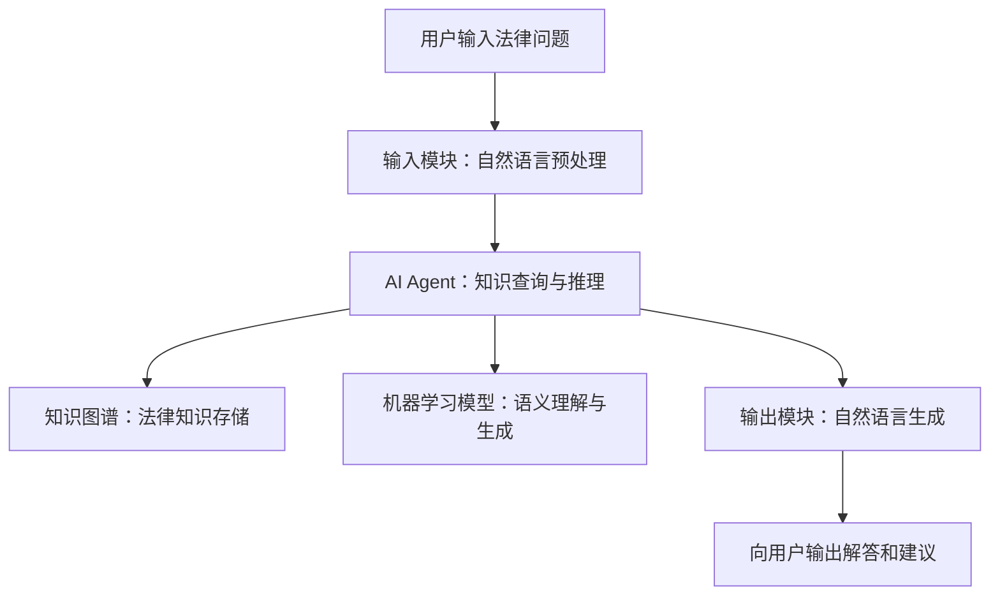

# 开发AI Agent支持的法律咨询系统

> 关键词：AI Agent、法律咨询系统、自然语言处理、知识图谱、机器学习

> 摘要：本文聚焦于开发AI Agent支持的法律咨询系统。详细阐述了该系统开发的背景、核心概念、算法原理、数学模型等内容。通过Python代码展示了核心算法的实现，给出了项目实战的具体步骤和代码案例，分析了系统的实际应用场景。同时，推荐了相关的学习资源、开发工具和论文著作。最后对系统的未来发展趋势与挑战进行了总结，并提供了常见问题的解答和扩展阅读的参考资料，旨在为开发此类系统提供全面且深入的技术指导。

## 1. 背景介绍 
### 1.1 目的和范围
随着社会的发展，人们在生活和工作中面临的法律问题日益增多。传统的法律咨询方式往往存在效率低、成本高、资源分配不均等问题。开发AI Agent支持的法律咨询系统的目的在于利用先进的人工智能技术，为用户提供高效、便捷、准确的法律咨询服务。该系统的范围涵盖了常见法律问题的解答、法律条文的查询、简单法律事务的处理建议等方面，旨在为广大用户提供一站式的法律帮助。

### 1.2 预期读者
本文的预期读者主要包括从事人工智能、自然语言处理、软件开发等领域的专业技术人员，对法律科技感兴趣的研究人员，以及希望开发或使用法律咨询系统的企业和机构。

### 1.3 文档结构概述
本文将按照以下结构进行阐述：首先介绍核心概念与联系，包括AI Agent和法律咨询系统的基本原理和架构；接着详细讲解核心算法原理及具体操作步骤，通过Python代码进行说明；然后介绍相关的数学模型和公式，并举例说明；再通过项目实战展示系统的开发过程，包括开发环境搭建、源代码实现和代码解读；之后分析系统的实际应用场景；推荐相关的工具和资源；最后总结系统的未来发展趋势与挑战，提供常见问题的解答和扩展阅读的参考资料。

### 1.4 术语表
#### 1.4.1 核心术语定义
- **AI Agent**：即人工智能代理，是一种能够感知环境、自主决策并采取行动以实现特定目标的软件实体。在法律咨询系统中，AI Agent可以理解用户的法律问题，查询相关法律知识，生成合理的解答和建议。
- **法律咨询系统**：是一种利用计算机技术和法律知识，为用户提供法律咨询服务的系统。它可以接收用户的问题，通过内部的知识处理和推理机制，给出相应的法律解答和建议。
- **自然语言处理（NLP）**：是人工智能的一个重要领域，主要研究如何让计算机理解和处理人类语言。在法律咨询系统中，NLP技术用于对用户输入的自然语言问题进行分析和理解。
- **知识图谱**：是一种以图的形式表示知识的方法，它将实体、概念及其之间的关系以图形化的方式呈现。在法律咨询系统中，知识图谱可以用于存储和管理法律知识，方便AI Agent进行查询和推理。

#### 1.4.2 相关概念解释
- **机器学习**：是一门多领域交叉学科，涉及概率论、统计学、逼近论、凸分析、算法复杂度理论等多门学科。它专门研究计算机怎样模拟或实现人类的学习行为，以获取新的知识或技能，重新组织已有的知识结构使之不断改善自身的性能。在法律咨询系统中，机器学习算法可以用于训练模型，提高系统的问答准确性。
- **深度学习**：是机器学习的一个分支领域，它是一种基于对数据进行表征学习的方法。深度学习通过构建具有很多层的神经网络模型，自动从大量数据中学习特征和模式。在法律咨询系统中，深度学习模型可以用于处理自然语言文本，实现更准确的语义理解和问答生成。

#### 1.4.3 缩略词列表
- **NLP**：Natural Language Processing（自然语言处理）
- **ML**：Machine Learning（机器学习）
- **DL**：Deep Learning（深度学习）

## 2. 核心概念与联系 
### 核心概念原理
#### AI Agent原理
AI Agent是一个具有自主性、反应性、社会性和主动性的软件实体。在法律咨询系统中，AI Agent的工作原理如下：
- **感知**：通过自然语言处理技术，AI Agent能够感知用户输入的法律问题，将其转化为计算机可以处理的形式。
- **决策**：根据感知到的问题，AI Agent在知识图谱中查询相关的法律知识，并运用机器学习和推理算法进行分析和决策，确定最佳的解答和建议。
- **行动**：将决策结果以自然语言的形式反馈给用户，完成一次法律咨询服务。

#### 法律咨询系统原理
法律咨询系统主要由输入模块、处理模块和输出模块组成。输入模块负责接收用户的法律问题，处理模块利用AI Agent和相关技术对问题进行处理和分析，输出模块将处理结果反馈给用户。具体原理如下：
- **输入模块**：接收用户以自然语言形式输入的法律问题，并进行初步的预处理，如去除噪声、分词等。
- **处理模块**：将预处理后的问题传递给AI Agent，AI Agent在知识图谱中查找相关的法律知识，运用机器学习模型进行语义理解和推理，生成解答和建议。
- **输出模块**：将AI Agent生成的解答和建议以自然语言的形式呈现给用户。

### 架构的文本示意图
```plaintext
+---------------------+
|     用户界面        |
+---------------------+
        |
        v
+---------------------+
|     输入模块        |
| （自然语言预处理）  |
+---------------------+
        |
        v
+---------------------+
|     AI Agent        |
| （知识查询与推理）  |
+---------------------+
        |
        v
+---------------------+
|    知识图谱         |
| （法律知识存储）    |
+---------------------+
        |
        v
+---------------------+
|     机器学习模型    |
| （语义理解与生成）  |
+---------------------+
        |
        v
+---------------------+
|     输出模块        |
| （自然语言生成）    |
+---------------------+
        |
        v
+---------------------+
|     用户界面        |
+---------------------+
```

### Mermaid流程图


## 3. 核心算法原理 & 具体操作步骤 
### 核心算法原理
#### 自然语言处理算法
在法律咨询系统中，自然语言处理算法主要用于对用户输入的问题进行预处理和语义理解。常用的算法包括分词算法、词性标注算法和命名实体识别算法。
- **分词算法**：将用户输入的文本按照一定的规则分割成一个个词语。常见的分词算法有基于词典的分词算法、基于统计的分词算法和基于深度学习的分词算法。
- **词性标注算法**：为每个词语标注其词性，如名词、动词、形容词等。词性标注可以帮助AI Agent更好地理解句子的语法结构和语义。
- **命名实体识别算法**：识别文本中的命名实体，如人名、地名、组织机构名等。在法律咨询系统中，命名实体识别可以帮助确定问题中涉及的具体对象。

#### 机器学习算法
机器学习算法用于训练模型，提高系统的问答准确性。常用的机器学习算法包括朴素贝叶斯算法、支持向量机算法和深度学习算法。
- **朴素贝叶斯算法**：是一种基于贝叶斯定理和特征条件独立假设的分类算法。在法律咨询系统中，朴素贝叶斯算法可以用于对法律问题进行分类，预测问题所属的法律领域。
- **支持向量机算法**：是一种二分类模型，其基本模型定义为特征空间上的间隔最大的线性分类器。支持向量机算法可以用于对法律问题进行分类和相似度计算。
- **深度学习算法**：如循环神经网络（RNN）、长短期记忆网络（LSTM）和门控循环单元（GRU）等，这些算法可以处理序列数据，在自然语言处理中具有很好的效果。在法律咨询系统中，深度学习算法可以用于语义理解和问答生成。

### 具体操作步骤
#### 数据预处理
```python
import jieba
import re

def preprocess_text(text):
    # 去除特殊字符
    text = re.sub(r'[^\u4e00-\u9fa5a-zA-Z0-9]', ' ', text)
    # 分词
    words = jieba.lcut(text)
    # 去除停用词
    stopwords = set()
    with open('stopwords.txt', 'r', encoding='utf-8') as f:
        for line in f:
            stopwords.add(line.strip())
    filtered_words = [word for word in words if word not in stopwords]
    return ' '.join(filtered_words)

# 示例
text = "请问，签订劳动合同需要注意哪些事项？"
preprocessed_text = preprocess_text(text)
print(preprocessed_text)
```
#### 特征提取
```python
from sklearn.feature_extraction.text import TfidfVectorizer

# 假设我们有一些训练数据
train_data = ["签订劳动合同注意事项", "劳动纠纷解决方法", "知识产权保护"]
vectorizer = TfidfVectorizer()
X_train = vectorizer.fit_transform(train_data)

# 对预处理后的文本进行特征提取
X_test = vectorizer.transform([preprocessed_text])
```
#### 模型训练与预测
```python
from sklearn.naive_bayes import MultinomialNB

# 假设我们有对应的标签
y_train = ["劳动合同", "劳动纠纷", "知识产权"]

# 训练模型
model = MultinomialNB()
model.fit(X_train, y_train)

# 预测
predicted_label = model.predict(X_test)
print("预测的法律领域：", predicted_label[0])
```

## 4. 数学模型和公式 & 详细讲解 & 举例说明 
### 贝叶斯定理
贝叶斯定理是机器学习中常用的一个定理，用于计算后验概率。其公式为：
$$P(A|B)=\frac{P(B|A)P(A)}{P(B)}$$
其中，$P(A|B)$ 表示在事件 $B$ 发生的条件下事件 $A$ 发生的概率，称为后验概率；$P(B|A)$ 表示在事件 $A$ 发生的条件下事件 $B$ 发生的概率，称为似然概率；$P(A)$ 表示事件 $A$ 发生的概率，称为先验概率；$P(B)$ 表示事件 $B$ 发生的概率，称为证据概率。

在法律咨询系统中，我们可以使用贝叶斯定理对法律问题进行分类。假设我们有 $n$ 个法律领域 $C_1,C_2,\cdots,C_n$，用户输入的问题为 $x$，我们要计算 $P(C_i|x)$，即问题 $x$ 属于法律领域 $C_i$ 的概率。根据贝叶斯定理：
$$P(C_i|x)=\frac{P(x|C_i)P(C_i)}{P(x)}$$
由于 $P(x)$ 对于所有的 $C_i$ 都是相同的，我们可以忽略它，只需要比较 $P(x|C_i)P(C_i)$ 的大小，选择概率最大的 $C_i$ 作为问题的分类结果。

### 举例说明
假设我们有两个法律领域：劳动合同和知识产权。我们通过训练数据统计得到：
- $P(劳动合同)=0.6$，$P(知识产权)=0.4$
- 对于问题 “签订劳动合同需要注意哪些事项？”，我们计算得到：
  - $P(签订劳动合同需要注意哪些事项？|劳动合同)=0.8$
  - $P(签订劳动合同需要注意哪些事项？|知识产权)=0.2$

则：
- $P(劳动合同|签订劳动合同需要注意哪些事项？)=\frac{P(签订劳动合同需要注意哪些事项？|劳动合同)P(劳动合同)}{P(签订劳动合同需要注意哪些事项？)} \approx \frac{0.8\times0.6}{P(签订劳动合同需要注意哪些事项？)}$
- $P(知识产权|签订劳动合同需要注意哪些事项？)=\frac{P(签订劳动合同需要注意哪些事项？|知识产权)P(知识产权)}{P(签订劳动合同需要注意哪些事项？)} \approx \frac{0.2\times0.4}{P(签订劳动合同需要注意哪些事项？)}$

由于 $0.8\times0.6 > 0.2\times0.4$，所以我们可以判断该问题属于劳动合同领域。

## 5. 项目实战：代码实际案例和详细解释说明 
### 5.1  开发环境搭建
#### 操作系统
建议使用Linux或Windows操作系统。

#### Python环境
安装Python 3.7及以上版本。可以从Python官方网站（https://www.python.org/downloads/）下载安装包进行安装。

#### 依赖库安装
使用pip命令安装以下依赖库：
```bash
pip install jieba sklearn numpy pandas
```

### 5.2  源代码详细实现和代码解读
```python
import jieba
import re
from sklearn.feature_extraction.text import TfidfVectorizer
from sklearn.naive_bayes import MultinomialNB

# 数据预处理函数
def preprocess_text(text):
    # 去除特殊字符
    text = re.sub(r'[^\u4e00-\u9fa5a-zA-Z0-9]', ' ', text)
    # 分词
    words = jieba.lcut(text)
    # 去除停用词
    stopwords = set()
    with open('stopwords.txt', 'r', encoding='utf-8') as f:
        for line in f:
            stopwords.add(line.strip())
    filtered_words = [word for word in words if word not in stopwords]
    return ' '.join(filtered_words)

# 训练数据
train_data = ["签订劳动合同注意事项", "劳动纠纷解决方法", "知识产权保护"]
train_labels = ["劳动合同", "劳动纠纷", "知识产权"]

# 特征提取
vectorizer = TfidfVectorizer()
X_train = vectorizer.fit_transform(train_data)

# 模型训练
model = MultinomialNB()
model.fit(X_train, train_labels)

# 法律咨询函数
def legal_consultation(question):
    # 数据预处理
    preprocessed_question = preprocess_text(question)
    # 特征提取
    X_test = vectorizer.transform([preprocessed_question])
    # 预测
    predicted_label = model.predict(X_test)
    return predicted_label[0]

# 示例
question = "请问，签订劳动合同需要注意哪些事项？"
result = legal_consultation(question)
print("预测的法律领域：", result)
```
### 代码解读与分析
- **数据预处理**：`preprocess_text` 函数用于对用户输入的问题进行预处理，包括去除特殊字符、分词和去除停用词。
- **特征提取**：使用 `TfidfVectorizer` 对训练数据进行特征提取，将文本转换为向量表示。
- **模型训练**：使用 `MultinomialNB` 算法对模型进行训练，根据训练数据学习不同法律领域的特征。
- **法律咨询**：`legal_consultation` 函数接收用户输入的问题，对其进行预处理和特征提取，然后使用训练好的模型进行预测，返回预测的法律领域。

## 6. 实际应用场景 
### 在线法律咨询平台
在在线法律咨询平台上，用户可以通过输入法律问题，AI Agent支持的法律咨询系统可以快速给出问题所属的法律领域，并提供相关的法律解答和建议。这可以提高咨询效率，减少用户等待时间。

### 企业内部法律支持
企业内部可能会遇到各种法律问题，如合同审查、知识产权保护等。AI Agent支持的法律咨询系统可以为企业员工提供及时的法律帮助，帮助企业更好地管理法律风险。

### 智能客服
在一些法律相关的机构或网站中，智能客服可以集成AI Agent支持的法律咨询系统，自动回答用户的常见法律问题，提高服务质量和用户满意度。

## 7. 工具和资源推荐
### 7.1 学习资源推荐
#### 7.1.1 书籍推荐
- 《自然语言处理入门》：帮助读者了解自然语言处理的基本概念和方法。
- 《机器学习》：介绍机器学习的基本算法和模型，适合初学者入门。
- 《深度学习》：深入讲解深度学习的原理和应用，适合有一定基础的读者。

#### 7.1.2 在线课程
- Coursera上的“Natural Language Processing Specialization”：提供全面的自然语言处理课程。
- edX上的“Machine Learning Fundamentals”：介绍机器学习的基础知识。
- 中国大学MOOC上的“人工智能基础”：涵盖人工智能的多个领域，包括自然语言处理和机器学习。

#### 7.1.3 技术博客和网站
- 博客园：有很多技术博主分享自然语言处理和机器学习的经验和技巧。
- 知乎：可以关注一些自然语言处理和法律科技的话题，了解最新的研究成果和应用案例。
- arXiv：提供最新的学术论文，可用于了解相关领域的前沿研究。

### 7.2 开发工具框架推荐
#### 7.2.1 IDE和编辑器
- PyCharm：功能强大的Python集成开发环境，适合开发Python项目。
- Visual Studio Code：轻量级的代码编辑器，支持多种编程语言和插件扩展。

#### 7.2.2 调试和性能分析工具
- PDB：Python自带的调试工具，可用于调试Python代码。
- TensorBoard：用于可视化深度学习模型的训练过程和性能指标。

#### 7.2.3 相关框架和库
- Jieba：中文分词库，用于中文文本的分词处理。
- Scikit-learn：机器学习库，提供了丰富的机器学习算法和工具。
- TensorFlow和PyTorch：深度学习框架，用于构建和训练深度学习模型。

### 7.3 相关论文著作推荐
#### 7.3.1 经典论文
- “A Neural Probabilistic Language Model”：提出了神经网络语言模型的概念，为自然语言处理的发展奠定了基础。
- “Support-Vector Networks”：介绍了支持向量机算法的基本原理和应用。

#### 7.3.2 最新研究成果
- 关注ACL（Association for Computational Linguistics）、EMNLP（Conference on Empirical Methods in Natural Language Processing）等会议的最新论文，了解自然语言处理领域的最新研究成果。

#### 7.3.3 应用案例分析
- 可以参考一些法律科技公司的官方网站和研究报告，了解AI Agent支持的法律咨询系统在实际应用中的案例和效果。

## 8. 总结：未来发展趋势与挑战
### 未来发展趋势
- **智能化程度不断提高**：随着人工智能技术的不断发展，AI Agent支持的法律咨询系统将能够理解更复杂的法律问题，提供更准确、详细的解答和建议。
- **多模态交互**：未来的法律咨询系统可能会支持语音、图像等多模态交互方式，使用户与系统的交互更加便捷和自然。
- **与区块链技术结合**：区块链技术可以提供不可篡改、可追溯的法律证据，将其与法律咨询系统结合，可以提高法律事务处理的安全性和可信度。

### 挑战
- **法律知识的更新和维护**：法律条文和法规不断更新，法律咨询系统需要及时更新和维护知识图谱，以保证解答的准确性。
- **语义理解的准确性**：自然语言具有复杂性和歧义性，提高系统对法律问题的语义理解准确性是一个挑战。
- **数据隐私和安全**：法律咨询系统涉及用户的个人信息和法律问题，需要保证数据的隐私和安全，防止信息泄露。

## 9. 附录：常见问题与解答
### 问题1：如何提高法律咨询系统的问答准确性？
解答：可以通过以下方法提高问答准确性：
- 增加训练数据的数量和质量，使模型能够学习到更多的法律知识和问题模式。
- 优化特征提取方法，选择更合适的特征来表示法律问题。
- 使用更复杂的机器学习和深度学习模型，如深度学习中的预训练模型。

### 问题2：如何处理法律知识的更新？
解答：可以建立一个定期更新机制，及时获取最新的法律条文和法规，更新知识图谱。同时，可以利用自然语言处理技术对新的法律文本进行分析和处理，将其融入到系统中。

### 问题3：系统如何保证数据的隐私和安全？
解答：可以采取以下措施保证数据的隐私和安全：
- 对用户输入的数据进行加密处理，防止数据在传输和存储过程中被泄露。
- 限制系统访问权限，只有授权人员才能访问和处理用户数据。
- 定期进行安全审计和漏洞修复，确保系统的安全性。

## 10. 扩展阅读 & 参考资料
### 扩展阅读
- 《法律人工智能：文本、语音和图像中的法理》：深入探讨法律与人工智能的结合。
- 《人工智能时代的法律变革》：分析人工智能对法律领域的影响和挑战。

### 参考资料
- 《自然语言处理实战：基于Python和深度学习》
- 《机器学习实战》
- 相关学术论文和研究报告，如ACL、EMNLP会议论文等。