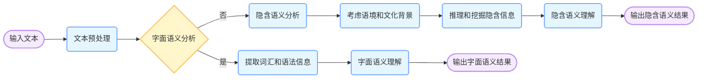

# 开发AI Agent的语义理解深度：从字面到隐含

> 关键词：AI Agent、语义理解、字面语义、隐含语义、自然语言处理

> 摘要：本文围绕开发AI Agent的语义理解深度展开，从字面语义逐步深入到隐含语义。详细阐述了语义理解的核心概念与联系，介绍了相关的核心算法原理及具体操作步骤，通过数学模型和公式对其进行理论支撑，并结合实际案例进行深入分析。同时探讨了AI Agent语义理解在不同场景下的应用，推荐了学习、开发相关的工具和资源。最后对AI Agent语义理解的未来发展趋势与挑战进行总结，还提供了常见问题解答及参考资料，旨在为开发者全面了解和提升AI Agent语义理解能力提供有价值的指导。

## 1. 背景介绍 
### 1.1 目的和范围
AI Agent在现代科技领域中扮演着越来越重要的角色，其语义理解能力是实现智能交互的关键。本文章的目的在于深入探讨AI Agent语义理解从字面到隐含的深度，帮助开发者全面了解语义理解的各个层面，提升AI Agent的智能水平。范围涵盖语义理解的基本概念、算法原理、数学模型、实际应用案例等多个方面，旨在为开发者提供一个系统而全面的知识体系。

### 1.2 预期读者
本文预期读者包括人工智能领域的开发者、研究人员，对自然语言处理和AI Agent技术感兴趣的技术爱好者，以及相关专业的学生等。无论你是初学者希望了解AI Agent语义理解的基础知识，还是有一定经验的开发者想要深入研究隐含语义处理，都能从本文中获得有价值的信息。

### 1.3 文档结构概述
本文首先介绍语义理解的背景知识，包括目的、预期读者和文档结构。接着阐述核心概念与联系，通过文本示意图和Mermaid流程图展示语义理解的原理和架构。然后详细讲解核心算法原理及具体操作步骤，并用Python源代码进行说明。之后介绍数学模型和公式，并举例说明。再通过项目实战展示代码实际案例并进行详细解释。随后探讨实际应用场景，推荐相关的工具和资源。最后总结未来发展趋势与挑战，提供常见问题解答及参考资料。

### 1.4 术语表
#### 1.4.1 核心术语定义
- **AI Agent**：人工智能代理，是一种能够感知环境、进行决策并采取行动以实现特定目标的智能实体。
- **语义理解**：指计算机对自然语言文本所表达的意义进行理解和分析的过程。
- **字面语义**：文本表面直接表达的含义，是最基本的语义层次。
- **隐含语义**：隐藏在文本背后，需要通过推理、语境等因素才能理解的语义信息。

#### 1.4.2 相关概念解释
- **自然语言处理（NLP）**：是计算机科学与人工智能领域中的一个重要方向，旨在让计算机能够理解、处理和生成人类语言。
- **语境**：指文本所处的上下文环境，包括文本的前后文、说话者的背景、场景等信息，对语义理解起着重要的辅助作用。

#### 1.4.3 缩略词列表
- **NLP**：Natural Language Processing（自然语言处理）
- **RNN**：Recurrent Neural Network（循环神经网络）
- **LSTM**：Long Short-Term Memory（长短期记忆网络）
- **GRU**：Gated Recurrent Unit（门控循环单元）

## 2. 核心概念与联系 
语义理解是AI Agent实现智能交互的核心能力之一，它可以分为字面语义和隐含语义两个主要层次。字面语义是文本表面直接表达的信息，例如“今天天气很好”，其字面语义就是描述今天的天气状况良好。而隐含语义则需要通过对语境、文化背景等因素的分析来挖掘，比如在某些语境下，这句话可能隐含着“适合出去游玩”的意思。

下面是语义理解核心概念的文本示意图：

```plaintext
语义理解
├── 字面语义
│   ├── 词汇意义
│   ├── 语法结构
│   └── 直接表达的信息
├── 隐含语义
│   ├── 语境信息
│   ├── 文化背景
│   ├── 推理和暗示
│   └── 潜在的信息
```

Mermaid流程图如下：



从流程图可以看出，输入的文本首先经过预处理，然后进行字面语义分析。如果能够直接理解字面意义，则提取相关信息得到字面语义结果；如果无法直接理解，则进入隐含语义分析阶段，考虑语境、文化背景等因素，通过推理挖掘隐含信息，最终得到隐含语义结果。

## 3. 核心算法原理 & 具体操作步骤 
在语义理解中，有多种算法可以用于处理字面语义和隐含语义。这里我们以基于深度学习的循环神经网络（RNN）及其变体长短期记忆网络（LSTM）和门控循环单元（GRU）为例进行讲解。

### 3.1 RNN算法原理
RNN是一种能够处理序列数据的神经网络，它通过在网络中引入循环结构，使得网络能够利用之前的信息来处理当前的输入。RNN的核心思想是在每个时间步 $t$ 接收输入 $x_t$，并结合上一个时间步的隐藏状态 $h_{t-1}$ 来更新当前的隐藏状态 $h_t$，最后根据隐藏状态 $h_t$ 输出结果 $y_t$。

RNN的更新公式如下：
$$
h_t = \tanh(W_{hh}h_{t-1} + W_{xh}x_t + b_h)
$$
$$
y_t = W_{hy}h_t + b_y
$$
其中，$W_{hh}$ 是隐藏状态到隐藏状态的权重矩阵，$W_{xh}$ 是输入到隐藏状态的权重矩阵，$W_{hy}$ 是隐藏状态到输出的权重矩阵，$b_h$ 和 $b_y$ 分别是隐藏状态和输出的偏置项，$\tanh$ 是激活函数。

### 3.2 LSTM算法原理
RNN存在梯度消失或梯度爆炸的问题，导致其在处理长序列数据时效果不佳。LSTM是为了解决这个问题而提出的一种改进的循环神经网络。LSTM通过引入门控机制，能够有效地控制信息的流动，从而更好地处理长序列数据。

LSTM的核心组件包括输入门 $i_t$、遗忘门 $f_t$、输出门 $o_t$ 和细胞状态 $C_t$。其更新公式如下：
$$
i_t = \sigma(W_{xi}x_t + W_{hi}h_{t-1} + b_i)
$$
$$
f_t = \sigma(W_{xf}x_t + W_{hf}h_{t-1} + b_f)
$$
$$
o_t = \sigma(W_{xo}x_t + W_{ho}h_{t-1} + b_o)
$$
$$
\tilde{C}_t = \tanh(W_{xc}x_t + W_{hc}h_{t-1} + b_c)
$$
$$
C_t = f_t \odot C_{t-1} + i_t \odot \tilde{C}_t
$$
$$
h_t = o_t \odot \tanh(C_t)
$$
其中，$\sigma$ 是sigmoid激活函数，$\odot$ 表示逐元素相乘。

### 3.3 GRU算法原理
GRU是另一种改进的循环神经网络，它在LSTM的基础上进行了简化，减少了参数数量，提高了训练效率。GRU的核心组件包括重置门 $r_t$ 和更新门 $z_t$。其更新公式如下：
$$
r_t = \sigma(W_{xr}x_t + W_{hr}h_{t-1} + b_r)
$$
$$
z_t = \sigma(W_{xz}x_t + W_{hz}h_{t-1} + b_z)
$$
$$
\tilde{h}_t = \tanh(W_{xh}x_t + r_t \odot W_{hh}h_{t-1} + b_h)
$$
$$
h_t = (1 - z_t) \odot h_{t-1} + z_t \odot \tilde{h}_t
$$

### 3.4 具体操作步骤及Python代码实现
下面我们使用Python和PyTorch库来实现一个简单的LSTM模型进行语义理解。

```python
import torch
import torch.nn as nn

# 定义LSTM模型
class LSTMModel(nn.Module):
    def __init__(self, input_size, hidden_size, num_layers, output_size):
        super(LSTMModel, self).__init__()
        self.hidden_size = hidden_size
        self.num_layers = num_layers
        self.lstm = nn.LSTM(input_size, hidden_size, num_layers, batch_first=True)
        self.fc = nn.Linear(hidden_size, output_size)

    def forward(self, x):
        # 初始化隐藏状态和细胞状态
        h0 = torch.zeros(self.num_layers, x.size(0), self.hidden_size).to(x.device)
        c0 = torch.zeros(self.num_layers, x.size(0), self.hidden_size).to(x.device)

        # 前向传播LSTM
        out, _ = self.lstm(x, (h0, c0))

        # 取最后一个时间步的输出
        out = out[:, -1, :]

        # 全连接层
        out = self.fc(out)
        return out

# 定义模型参数
input_size = 10
hidden_size = 20
num_layers = 2
output_size = 5

# 创建模型实例
model = LSTMModel(input_size, hidden_size, num_layers, output_size)

# 生成随机输入数据
batch_size = 3
seq_length = 4
input_data = torch.randn(batch_size, seq_length, input_size)

# 前向传播
output = model(input_data)
print("Output shape:", output.shape)
```

在上述代码中，我们首先定义了一个LSTM模型类 `LSTMModel`，其中包含一个LSTM层和一个全连接层。然后我们创建了模型实例，并生成了随机输入数据进行前向传播，最后打印出输出的形状。

## 4. 数学模型和公式 & 详细讲解 & 举例说明 
### 4.1 信息熵模型
信息熵是衡量信息不确定性的一个重要指标，在语义理解中可以用来衡量文本的信息量。信息熵的计算公式如下：
$$
H(X) = -\sum_{i=1}^{n}p(x_i)\log_2p(x_i)
$$
其中，$X$ 是一个随机变量，$x_i$ 是 $X$ 可能的取值，$p(x_i)$ 是 $x_i$ 出现的概率。

例如，假设有一个文本分类任务，有三个类别 $C_1$、$C_2$、$C_3$，它们出现的概率分别为 $p(C_1) = 0.2$、$p(C_2) = 0.3$、$p(C_3) = 0.5$。则该分类任务的信息熵为：
$$
\begin{align*}
H(X) &= - (0.2\log_20.2 + 0.3\log_20.3 + 0.5\log_20.5) \\
&\approx - (0.2\times(-2.32) + 0.3\times(-1.74) + 0.5\times(-1)) \\
&\approx 1.49
\end{align*}
$$

信息熵越大，说明文本的不确定性越高，信息量越大；信息熵越小，说明文本的不确定性越低，信息量越小。

### 4.2 条件熵模型
条件熵是在已知某个随机变量的条件下，另一个随机变量的信息熵。条件熵的计算公式如下：
$$
H(Y|X) = \sum_{i=1}^{n}p(x_i)H(Y|X = x_i)
$$
其中，$H(Y|X = x_i)$ 是在 $X = x_i$ 的条件下 $Y$ 的信息熵。

例如，假设有两个随机变量 $X$ 和 $Y$，$X$ 表示天气情况（晴天、阴天、雨天），$Y$ 表示是否适合户外活动（适合、不适合）。已知不同天气情况下是否适合户外活动的概率分布，我们可以计算条件熵 $H(Y|X)$，来衡量在已知天气情况的条件下，是否适合户外活动的不确定性。

### 4.3 互信息模型
互信息是衡量两个随机变量之间相关性的一个指标，在语义理解中可以用来衡量两个词语或概念之间的关联程度。互信息的计算公式如下：
$$
I(X;Y) = \sum_{x\in X}\sum_{y\in Y}p(x,y)\log_2\frac{p(x,y)}{p(x)p(y)}
$$
其中，$p(x,y)$ 是 $X$ 和 $Y$ 的联合概率分布，$p(x)$ 和 $p(y)$ 分别是 $X$ 和 $Y$ 的边缘概率分布。

例如，假设有两个词语 $X$ 和 $Y$，通过统计语料库中它们同时出现的频率和各自出现的频率，我们可以计算它们的互信息 $I(X;Y)$。互信息越大，说明这两个词语之间的关联程度越高；互信息越小，说明它们之间的关联程度越低。

## 5. 项目实战：代码实际案例和详细解释说明 
### 5.1  开发环境搭建
在进行AI Agent语义理解的项目实战之前，我们需要搭建相应的开发环境。以下是具体的步骤：

#### 5.1.1 安装Python
首先，确保你已经安装了Python，建议使用Python 3.6及以上版本。你可以从Python官方网站（https://www.python.org/downloads/） 下载并安装Python。

#### 5.1.2 安装必要的库
我们需要安装一些必要的Python库，如PyTorch、NLTK、Scikit-learn等。可以使用以下命令进行安装：
```bash
pip install torch nltk scikit-learn
```

#### 5.1.3 下载NLTK数据
NLTK是一个常用的自然语言处理库，我们需要下载一些必要的数据。在Python交互式环境中运行以下代码：
```python
import nltk
nltk.download('punkt')
nltk.download('stopwords')
```

### 5.2  源代码详细实现和代码解读
下面我们实现一个简单的文本分类任务，来展示AI Agent语义理解的应用。

```python
import torch
import torch.nn as nn
import torch.optim as optim
from sklearn.model_selection import train_test_split
from nltk.tokenize import word_tokenize
from nltk.corpus import stopwords
import numpy as np
import pandas as pd

# 加载数据
data = pd.read_csv('data.csv')
texts = data['text'].tolist()
labels = data['label'].tolist()

# 文本预处理
stop_words = set(stopwords.words('english'))
tokenized_texts = []
for text in texts:
    tokens = word_tokenize(text.lower())
    filtered_tokens = [token for token in tokens if token.isalpha() and token not in stop_words]
    tokenized_texts.append(filtered_tokens)

# 构建词汇表
vocab = set()
for tokens in tokenized_texts:
    vocab.update(tokens)
vocab = sorted(vocab)
vocab_size = len(vocab)
word_to_idx = {word: idx for idx, word in enumerate(vocab)}

# 将文本转换为数字序列
max_seq_length = 50
sequences = []
for tokens in tokenized_texts:
    seq = [word_to_idx[word] for word in tokens if word in word_to_idx]
    if len(seq) < max_seq_length:
        seq += [0] * (max_seq_length - len(seq))
    else:
        seq = seq[:max_seq_length]
    sequences.append(seq)

# 划分训练集和测试集
X = np.array(sequences)
y = np.array(labels)
X_train, X_test, y_train, y_test = train_test_split(X, y, test_size=0.2, random_state=42)

# 定义模型
class TextClassifier(nn.Module):
    def __init__(self, vocab_size, embedding_dim, hidden_dim, output_dim):
        super(TextClassifier, self).__init__()
        self.embedding = nn.Embedding(vocab_size, embedding_dim)
        self.lstm = nn.LSTM(embedding_dim, hidden_dim, batch_first=True)
        self.fc = nn.Linear(hidden_dim, output_dim)

    def forward(self, x):
        embedded = self.embedding(x)
        out, _ = self.lstm(embedded)
        out = out[:, -1, :]
        out = self.fc(out)
        return out

# 初始化模型
embedding_dim = 100
hidden_dim = 128
output_dim = len(set(labels))
model = TextClassifier(vocab_size, embedding_dim, hidden_dim, output_dim)

# 定义损失函数和优化器
criterion = nn.CrossEntropyLoss()
optimizer = optim.Adam(model.parameters(), lr=0.001)

# 训练模型
num_epochs = 10
for epoch in range(num_epochs):
    model.train()
    optimizer.zero_grad()
    inputs = torch.LongTensor(X_train)
    labels = torch.LongTensor(y_train)
    outputs = model(inputs)
    loss = criterion(outputs, labels)
    loss.backward()
    optimizer.step()
    print(f'Epoch {epoch+1}/{num_epochs}, Loss: {loss.item()}')

# 测试模型
model.eval()
with torch.no_grad():
    inputs = torch.LongTensor(X_test)
    labels = torch.LongTensor(y_test)
    outputs = model(inputs)
    _, predicted = torch.max(outputs.data, 1)
    accuracy = (predicted == labels).sum().item() / len(labels)
    print(f'Test Accuracy: {accuracy}')
```

### 5.3  代码解读与分析
#### 5.3.1 数据加载与预处理
- 首先，我们使用 `pandas` 库加载包含文本和标签的数据文件。
- 然后，对文本进行预处理，包括分词、去除停用词等操作。
- 接着，构建词汇表，并将文本转换为数字序列，方便模型处理。

#### 5.3.2 模型定义
- 我们定义了一个 `TextClassifier` 类，包含一个嵌入层、一个LSTM层和一个全连接层。
- 嵌入层将输入的数字序列转换为词向量，LSTM层处理序列数据，全连接层输出分类结果。

#### 5.3.3 训练和测试
- 使用交叉熵损失函数和Adam优化器进行模型训练。
- 在训练过程中，计算损失并进行反向传播更新模型参数。
- 训练完成后，在测试集上进行测试，计算模型的准确率。

## 6. 实际应用场景 
### 6.1 智能客服
在智能客服系统中，AI Agent需要理解用户的问题，从字面语义到隐含语义进行全面分析。例如，用户可能会问“你们的产品有折扣吗？”，其字面语义是询问产品是否有折扣，隐含语义可能是用户希望能够以更优惠的价格购买产品。智能客服需要根据这些语义信息，准确地回答用户的问题，并提供相应的优惠活动信息。

### 6.2 智能写作助手
智能写作助手可以帮助用户生成高质量的文本。在这个过程中，它需要理解用户输入的文本的语义，包括字面语义和隐含语义。例如，用户输入“我想写一篇关于旅游的文章，希望突出风景的美丽”，智能写作助手需要理解“旅游”和“风景美丽”这些字面语义，同时也要挖掘出用户希望文章生动、吸引人的隐含语义，从而生成符合用户需求的文章。

### 6.3 情感分析
情感分析是指通过对文本的语义理解，判断文本所表达的情感倾向。在这个过程中，不仅要理解文本的字面语义，还要考虑隐含语义。例如，“这个电影的剧情有点拖沓”，字面语义是在描述电影剧情的特点，隐含语义则是表达了用户对电影的负面评价。情感分析系统需要准确地捕捉这些信息，判断出用户的情感倾向。

### 6.4 智能翻译
在智能翻译中，AI Agent需要理解源语言文本的语义，并将其准确地翻译成目标语言。这不仅需要对字面语义的准确理解，还需要考虑隐含语义和文化背景。例如，一些习语、隐喻等在不同语言中的表达方式可能不同，智能翻译系统需要理解其隐含语义，才能进行准确的翻译。

## 7. 工具和资源推荐
### 7.1 学习资源推荐
#### 7.1.1 书籍推荐
- 《自然语言处理入门》：这本书适合初学者，系统地介绍了自然语言处理的基本概念、方法和技术。
- 《深度学习》：由深度学习领域的三位先驱Ian Goodfellow、Yoshua Bengio和Aaron Courville撰写，全面介绍了深度学习的理论和实践。
- 《Python自然语言处理》：详细介绍了如何使用Python进行自然语言处理，包含大量的实例代码。

#### 7.1.2 在线课程
- Coursera上的“Natural Language Processing Specialization”：由顶尖大学的教授授课，涵盖了自然语言处理的各个方面。
- edX上的“Introduction to Artificial Intelligence”：介绍了人工智能的基本概念和技术，包括自然语言处理。
- 哔哩哔哩上有很多关于自然语言处理和AI Agent的教学视频，适合初学者入门。

#### 7.1.3 技术博客和网站
- Medium：上面有很多关于人工智能和自然语言处理的优秀博客文章，涵盖了最新的研究成果和技术应用。
- arXiv：提供了大量的学术论文，是了解人工智能最新研究动态的重要资源。
- 机器之心：专注于人工智能领域的资讯和技术分享，有很多深度的技术文章和案例分析。

### 7.2 开发工具框架推荐
#### 7.2.1 IDE和编辑器
- PyCharm：是一款专业的Python集成开发环境，提供了丰富的功能和插件，方便开发和调试Python代码。
- Visual Studio Code：是一款轻量级的代码编辑器，支持多种编程语言，有大量的扩展插件可以增强其功能。

#### 7.2.2 调试和性能分析工具
- TensorBoard：是TensorFlow的可视化工具，可以帮助开发者直观地查看模型的训练过程和性能指标。
- PyTorch Profiler：可以帮助开发者分析PyTorch模型的性能瓶颈，优化模型的训练和推理速度。

#### 7.2.3 相关框架和库
- PyTorch：是一个开源的深度学习框架，提供了丰富的深度学习模型和工具，方便开发者进行自然语言处理任务。
- TensorFlow：是另一个广泛使用的深度学习框架，具有强大的分布式训练和部署能力。
- NLTK：是一个常用的自然语言处理库，提供了丰富的文本处理工具和数据集。

### 7.3 相关论文著作推荐
#### 7.3.1 经典论文
- “Attention Is All You Need”：提出了Transformer模型，是自然语言处理领域的重要突破。
- “Long Short-Term Memory”：介绍了LSTM模型的原理和应用，是循环神经网络领域的经典论文。

#### 7.3.2 最新研究成果
- 在arXiv和顶级学术会议（如ACL、EMNLP等）上可以找到自然语言处理领域的最新研究成果。

#### 7.3.3 应用案例分析
- 一些知名企业（如Google、Microsoft等）的技术博客会分享他们在自然语言处理和AI Agent应用方面的案例分析，可以从中学习到实际应用中的经验和技巧。

## 8. 总结：未来发展趋势与挑战
### 8.1 未来发展趋势
- **多模态语义理解**：未来的AI Agent将不仅能够理解文本语义，还能够结合图像、语音等多种模态的信息进行综合理解，实现更加全面和准确的语义分析。
- **常识推理能力的提升**：AI Agent将具备更强的常识推理能力，能够更好地理解隐含语义和上下文信息，从而实现更加智能的交互。
- **个性化语义理解**：根据用户的个人偏好、历史行为等信息，AI Agent能够提供个性化的语义理解服务，满足不同用户的需求。

### 8.2 挑战
- **语义的复杂性**：自然语言的语义非常复杂，包含大量的隐含信息和歧义性，如何准确地理解和处理这些语义信息是一个巨大的挑战。
- **数据的局限性**：语义理解需要大量的标注数据进行训练，但是获取高质量的标注数据非常困难，数据的局限性会影响模型的性能。
- **计算资源的需求**：深度学习模型在语义理解中表现出色，但是这些模型通常需要大量的计算资源进行训练和推理，如何在有限的计算资源下提高模型的效率是一个亟待解决的问题。

## 9. 附录：常见问题与解答
### 9.1 如何提高AI Agent的语义理解能力？
- 可以通过增加训练数据的数量和质量，使用更复杂的模型结构，引入外部知识等方法来提高AI Agent的语义理解能力。

### 9.2 隐含语义理解的难点在哪里？
- 隐含语义理解的难点在于需要考虑语境、文化背景等多种因素，并且隐含信息通常是不明确的，需要通过推理和挖掘才能获取。

### 9.3 如何处理语义歧义问题？
- 可以通过上下文信息、语境分析、多义词消歧等方法来处理语义歧义问题。

## 10. 扩展阅读 & 参考资料
- 《人工智能：一种现代的方法》
- 《统计自然语言处理基础》
- https://www.nltk.org/
- https://pytorch.org/
- https://www.tensorflow.org/