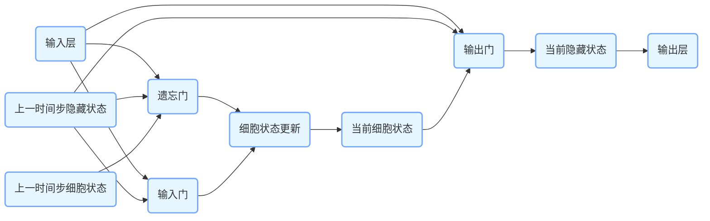

# 开发AI Agent的长短期记忆管理：平衡效率与信息保留

> 关键词：AI Agent、长短期记忆管理、效率、信息保留、记忆机制

> 摘要：本文围绕开发AI Agent的长短期记忆管理展开深入探讨。在AI技术迅猛发展的当下，AI Agent的记忆管理至关重要，它直接影响着Agent的性能和表现。文章详细阐述了长短期记忆的核心概念、相关算法原理、数学模型，通过项目实战展示了具体的代码实现和解读，分析了实际应用场景，推荐了学习资源、开发工具等。旨在帮助开发者更好地理解和掌握AI Agent长短期记忆管理的方法，实现效率与信息保留的平衡，推动AI Agent技术的进一步发展。

## 1. 背景介绍 
### 1.1 目的和范围
随着人工智能技术的不断进步，AI Agent在各个领域的应用越来越广泛，如智能客服、自动驾驶、游戏AI等。AI Agent的记忆管理对于其智能决策和行为表现起着关键作用。长短期记忆管理旨在解决如何有效地存储和利用信息，在保证处理效率的同时，保留重要的信息，以支持AI Agent做出合理的决策。本文的范围涵盖了长短期记忆管理的基本概念、算法原理、数学模型、实际应用等方面，旨在为开发者提供全面的技术指导。

### 1.2 预期读者
本文预期读者主要包括人工智能领域的开发者、研究人员，对AI Agent技术感兴趣的程序员，以及相关专业的学生。希望通过本文的介绍，能够帮助读者深入理解AI Agent长短期记忆管理的原理和方法，提升相关技术能力。

### 1.3 文档结构概述
本文首先介绍背景信息，包括目的、预期读者和文档结构概述等。接着阐述长短期记忆的核心概念与联系，包括原理和架构的文本示意图及Mermaid流程图。然后详细讲解核心算法原理和具体操作步骤，通过Python源代码进行阐述。随后介绍数学模型和公式，并举例说明。之后通过项目实战展示代码实际案例和详细解释说明。再分析实际应用场景，推荐相关的工具和资源。最后总结未来发展趋势与挑战，提供常见问题与解答和扩展阅读及参考资料。

### 1.4 术语表
#### 1.4.1 核心术语定义
- **AI Agent**：人工智能代理，是一种能够感知环境、进行决策并采取行动的智能实体。
- **长短期记忆（LSTM）**：一种特殊的循环神经网络（RNN）结构，能够有效处理序列数据中的长期依赖问题。
- **信息保留**：指在记忆管理过程中，将重要的信息保存下来，以便后续使用。
- **效率**：指在处理信息和进行决策时，能够快速、准确地完成任务，减少时间和资源的消耗。

#### 1.4.2 相关概念解释
- **循环神经网络（RNN）**：一种用于处理序列数据的神经网络，通过在网络中引入循环结构，能够捕捉序列中的时间依赖关系。但传统RNN存在梯度消失或梯度爆炸的问题，导致难以处理长期依赖。
- **遗忘门**：LSTM中的一个关键组件，用于决定哪些信息需要从细胞状态中丢弃。
- **输入门**：决定哪些新的信息需要被添加到细胞状态中。
- **输出门**：根据细胞状态决定输出哪些信息。

#### 1.4.3 缩略词列表
- **AI**：Artificial Intelligence（人工智能）
- **RNN**：Recurrent Neural Network（循环神经网络）
- **LSTM**：Long Short-Term Memory（长短期记忆）

## 2. 核心概念与联系 

### 长短期记忆（LSTM）原理
长短期记忆（LSTM）是一种特殊的循环神经网络（RNN）结构，旨在解决传统RNN在处理长期依赖问题时的局限性。传统RNN在处理长序列数据时，由于梯度消失或梯度爆炸的问题，难以有效地捕捉序列中的长期依赖关系。LSTM通过引入细胞状态（cell state）和三个门控机制（遗忘门、输入门和输出门），能够更好地控制信息的流动和保留。

细胞状态是LSTM的核心，它就像一条传送带，贯穿整个序列，能够直接传递信息，使得信息在序列中更容易流动而不容易消失。遗忘门决定哪些信息需要从细胞状态中丢弃，输入门决定哪些新的信息需要被添加到细胞状态中，输出门根据细胞状态决定输出哪些信息。

### 架构的文本示意图
LSTM单元主要由输入层、遗忘门、输入门、细胞状态、输出门和输出层组成。输入层接收当前时间步的输入数据和上一个时间步的隐藏状态。遗忘门根据输入数据和上一个时间步的隐藏状态计算一个遗忘概率，决定哪些信息需要从细胞状态中丢弃。输入门计算一个输入概率，决定哪些新的信息需要被添加到细胞状态中。细胞状态根据遗忘门和输入门的输出进行更新。输出门根据细胞状态和输入数据计算一个输出概率，决定输出哪些信息。最后，输出层输出当前时间步的隐藏状态和输出信息。

### Mermaid流程图


## 3. 核心算法原理 & 具体操作步骤 

### 算法原理讲解
LSTM的核心算法主要涉及遗忘门、输入门、细胞状态更新和输出门的计算。以下是详细的计算步骤和Python源代码实现。

#### 遗忘门
遗忘门决定哪些信息需要从细胞状态中丢弃。它通过一个sigmoid函数计算一个遗忘概率，取值范围在0到1之间。0表示完全丢弃，1表示完全保留。

$$
f_t = \sigma(W_f[h_{t-1}, x_t] + b_f)
$$

其中，$f_t$ 是遗忘门的输出，$\sigma$ 是sigmoid函数，$W_f$ 是遗忘门的权重矩阵，$h_{t-1}$ 是上一个时间步的隐藏状态，$x_t$ 是当前时间步的输入数据，$b_f$ 是遗忘门的偏置。

#### 输入门
输入门决定哪些新的信息需要被添加到细胞状态中。它由两部分组成：一个sigmoid函数计算输入概率，一个tanh函数计算候选细胞状态。

$$
i_t = \sigma(W_i[h_{t-1}, x_t] + b_i)
$$

$$
\tilde{C}_t = \tanh(W_C[h_{t-1}, x_t] + b_C)
$$

其中，$i_t$ 是输入门的输出，$\tilde{C}_t$ 是候选细胞状态，$W_i$ 和 $W_C$ 分别是输入门和候选细胞状态的权重矩阵，$b_i$ 和 $b_C$ 分别是输入门和候选细胞状态的偏置。

#### 细胞状态更新
细胞状态根据遗忘门和输入门的输出进行更新。

$$
C_t = f_t \odot C_{t-1} + i_t \odot \tilde{C}_t
$$

其中，$C_t$ 是当前时间步的细胞状态，$\odot$ 表示逐元素相乘。

#### 输出门
输出门根据细胞状态决定输出哪些信息。它通过一个sigmoid函数计算一个输出概率，然后与经过tanh函数处理的细胞状态相乘得到输出信息。

$$
o_t = \sigma(W_o[h_{t-1}, x_t] + b_o)
$$

$$
h_t = o_t \odot \tanh(C_t)
$$

其中，$o_t$ 是输出门的输出，$h_t$ 是当前时间步的隐藏状态，$W_o$ 是输出门的权重矩阵，$b_o$ 是输出门的偏置。

### Python源代码实现
```python
import numpy as np

# 定义sigmoid函数
def sigmoid(x):
    return 1 / (1 + np.exp(-x))

# 定义tanh函数
def tanh(x):
    return np.tanh(x)

class LSTM:
    def __init__(self, input_size, hidden_size):
        self.input_size = input_size
        self.hidden_size = hidden_size
        
        # 初始化权重矩阵和偏置
        self.W_f = np.random.randn(hidden_size, input_size + hidden_size)
        self.b_f = np.zeros((hidden_size, 1))
        
        self.W_i = np.random.randn(hidden_size, input_size + hidden_size)
        self.b_i = np.zeros((hidden_size, 1))
        
        self.W_C = np.random.randn(hidden_size, input_size + hidden_size)
        self.b_C = np.zeros((hidden_size, 1))
        
        self.W_o = np.random.randn(hidden_size, input_size + hidden_size)
        self.b_o = np.zeros((hidden_size, 1))
        
    def forward(self, x, h_prev, C_prev):
        # 拼接输入数据和上一个时间步的隐藏状态
        concat = np.vstack((h_prev, x))
        
        # 计算遗忘门
        f_t = sigmoid(np.dot(self.W_f, concat) + self.b_f)
        
        # 计算输入门
        i_t = sigmoid(np.dot(self.W_i, concat) + self.b_i)
        
        # 计算候选细胞状态
        C_tilde = tanh(np.dot(self.W_C, concat) + self.b_C)
        
        # 更新细胞状态
        C_t = f_t * C_prev + i_t * C_tilde
        
        # 计算输出门
        o_t = sigmoid(np.dot(self.W_o, concat) + self.b_o)
        
        # 计算当前时间步的隐藏状态
        h_t = o_t * tanh(C_t)
        
        return h_t, C_t
```

### 具体操作步骤
1. 初始化LSTM单元的权重矩阵和偏置。
2. 对于每个时间步，接收输入数据和上一个时间步的隐藏状态和细胞状态。
3. 计算遗忘门、输入门、候选细胞状态、细胞状态更新和输出门。
4. 输出当前时间步的隐藏状态和细胞状态。

## 4. 数学模型和公式 & 详细讲解 & 举例说明 

### 数学模型和公式
前面已经详细介绍了LSTM的数学模型和公式，这里再进行总结。

#### 遗忘门
$$
f_t = \sigma(W_f[h_{t-1}, x_t] + b_f)
$$

#### 输入门
$$
i_t = \sigma(W_i[h_{t-1}, x_t] + b_i)
$$

$$
\tilde{C}_t = \tanh(W_C[h_{t-1}, x_t] + b_C)
$$

#### 细胞状态更新
$$
C_t = f_t \odot C_{t-1} + i_t \odot \tilde{C}_t
$$

#### 输出门
$$
o_t = \sigma(W_o[h_{t-1}, x_t] + b_o)
$$

$$
h_t = o_t \odot \tanh(C_t)
$$

### 详细讲解
- **遗忘门**：遗忘门的作用是决定哪些信息需要从细胞状态中丢弃。通过sigmoid函数将输入映射到0到1之间的概率值，0表示完全丢弃，1表示完全保留。这样可以根据输入数据和上一个时间步的隐藏状态动态地调整细胞状态。
- **输入门**：输入门由两部分组成。sigmoid函数计算的输入概率决定了哪些新的信息需要被添加到细胞状态中，tanh函数计算的候选细胞状态提供了新的信息。通过两者的结合，可以灵活地更新细胞状态。
- **细胞状态更新**：细胞状态的更新是通过遗忘门和输入门的输出进行的。遗忘门控制着哪些旧的信息需要保留，输入门控制着哪些新的信息需要添加。这种机制使得细胞状态能够在不同时间步之间有效地传递信息。
- **输出门**：输出门根据细胞状态决定输出哪些信息。sigmoid函数计算的输出概率与经过tanh函数处理的细胞状态相乘，得到当前时间步的隐藏状态。这样可以根据细胞状态动态地调整输出信息。

### 举例说明
假设我们有一个简单的序列数据，每个时间步的输入数据维度为2，隐藏状态维度为3。我们可以使用上述的LSTM模型进行计算。

```python
# 初始化LSTM单元
input_size = 2
hidden_size = 3
lstm = LSTM(input_size, hidden_size)

# 随机生成输入数据、上一个时间步的隐藏状态和细胞状态
x = np.random.randn(input_size, 1)
h_prev = np.zeros((hidden_size, 1))
C_prev = np.zeros((hidden_size, 1))

# 前向传播
h_t, C_t = lstm.forward(x, h_prev, C_prev)

print("当前时间步的隐藏状态：", h_t)
print("当前时间步的细胞状态：", C_t)
```

在这个例子中，我们首先初始化了一个LSTM单元，然后随机生成了输入数据、上一个时间步的隐藏状态和细胞状态。最后，通过前向传播计算得到了当前时间步的隐藏状态和细胞状态。

## 5. 项目实战：代码实际案例和详细解释说明 

### 5.1  开发环境搭建
为了实现一个基于LSTM的AI Agent长短期记忆管理项目，我们需要搭建相应的开发环境。以下是具体的步骤：

1. **安装Python**：建议使用Python 3.6及以上版本。可以从Python官方网站（https://www.python.org/downloads/）下载并安装。
2. **安装深度学习框架**：我们使用PyTorch作为深度学习框架。可以使用以下命令进行安装：
```sh
pip install torch torchvision
```
3. **安装其他必要的库**：还需要安装一些其他的库，如numpy、matplotlib等。可以使用以下命令进行安装：
```sh
pip install numpy matplotlib
```

### 5.2  源代码详细实现和代码解读
以下是一个基于PyTorch的简单LSTM模型的实现，用于处理序列数据。

```python
import torch
import torch.nn as nn
import torch.optim as optim
import numpy as np
import matplotlib.pyplot as plt

# 定义LSTM模型
class LSTMModel(nn.Module):
    def __init__(self, input_size, hidden_size, num_layers, output_size):
        super(LSTMModel, self).__init__()
        self.hidden_size = hidden_size
        self.num_layers = num_layers
        
        # 定义LSTM层
        self.lstm = nn.LSTM(input_size, hidden_size, num_layers, batch_first=True)
        
        # 定义全连接层
        self.fc = nn.Linear(hidden_size, output_size)
        
    def forward(self, x):
        # 初始化隐藏状态和细胞状态
        h0 = torch.zeros(self.num_layers, x.size(0), self.hidden_size).to(x.device)
        c0 = torch.zeros(self.num_layers, x.size(0), self.hidden_size).to(x.device)
        
        # 前向传播LSTM
        out, _ = self.lstm(x, (h0, c0))
        
        # 取最后一个时间步的输出
        out = out[:, -1, :]
        
        # 全连接层
        out = self.fc(out)
        
        return out

# 生成示例数据
input_size = 1
hidden_size = 32
num_layers = 1
output_size = 1
sequence_length = 10
batch_size = 16

# 生成随机输入数据和目标数据
x = torch.randn(batch_size, sequence_length, input_size)
y = torch.randn(batch_size, output_size)

# 初始化模型、损失函数和优化器
model = LSTMModel(input_size, hidden_size, num_layers, output_size)
criterion = nn.MSELoss()
optimizer = optim.Adam(model.parameters(), lr=0.001)

# 训练模型
num_epochs = 100
losses = []

for epoch in range(num_epochs):
    # 前向传播
    outputs = model(x)
    loss = criterion(outputs, y)
    
    # 反向传播和优化
    optimizer.zero_grad()
    loss.backward()
    optimizer.step()
    
    losses.append(loss.item())
    
    if (epoch + 1) % 10 == 0:
        print(f'Epoch [{epoch+1}/{num_epochs}], Loss: {loss.item():.4f}')

# 绘制损失曲线
plt.plot(losses)
plt.xlabel('Epoch')
plt.ylabel('Loss')
plt.title('Training Loss')
plt.show()
```

### 代码解读与分析
1. **模型定义**：`LSTMModel` 类继承自 `nn.Module`，定义了一个LSTM层和一个全连接层。`forward` 方法实现了前向传播过程，包括初始化隐藏状态和细胞状态、LSTM层的前向传播、取最后一个时间步的输出和全连接层的计算。
2. **数据生成**：生成随机的输入数据和目标数据，用于训练模型。
3. **模型初始化**：初始化模型、损失函数和优化器。使用均方误差损失函数（MSE）和Adam优化器。
4. **训练过程**：通过循环进行多次训练，每次训练包括前向传播、计算损失、反向传播和优化。记录每次训练的损失值。
5. **损失曲线绘制**：使用 `matplotlib` 库绘制训练损失曲线，直观地展示模型的训练过程。

## 6. 实际应用场景 
### 自然语言处理
在自然语言处理领域，AI Agent的长短期记忆管理有着广泛的应用。例如，在机器翻译中，LSTM可以用于处理输入的源语言句子，通过长短期记忆机制捕捉句子中的语义信息和上下文关系，从而生成准确的目标语言翻译。在文本生成任务中，如故事生成、诗歌创作等，LSTM可以根据历史文本信息，生成连贯、有逻辑的文本内容。

### 时间序列预测
在时间序列预测中，如股票价格预测、天气预报等，AI Agent的长短期记忆管理可以帮助模型更好地捕捉时间序列数据中的长期依赖关系。LSTM通过细胞状态和门控机制，能够有效地保留历史数据中的重要信息，从而提高预测的准确性。

### 智能机器人
在智能机器人领域，AI Agent的长短期记忆管理对于机器人的决策和行为表现至关重要。机器人在执行任务过程中，需要不断地感知环境信息，并根据历史经验做出决策。LSTM可以用于存储和处理机器人的历史感知信息和决策信息，帮助机器人更好地适应环境变化，提高任务执行的效率和成功率。

### 游戏AI
在游戏AI中，AI Agent的长短期记忆管理可以使游戏角色具有更智能的行为表现。例如，在策略游戏中，游戏角色可以通过长短期记忆机制记住对手的策略和历史行动，从而制定出更有效的应对策略。在角色扮演游戏中，游戏角色可以根据历史对话和任务完成情况，表现出不同的情感和行为。

## 7. 工具和资源推荐
### 7.1 学习资源推荐
#### 7.1.1 书籍推荐
- 《深度学习》（Deep Learning）：由Ian Goodfellow、Yoshua Bengio和Aaron Courville所著，是深度学习领域的经典教材，涵盖了深度学习的基本概念、算法和应用。
- 《Python深度学习》（Deep Learning with Python）：由Francois Chollet所著，介绍了如何使用Python和Keras进行深度学习开发，包括神经网络、卷积神经网络、循环神经网络等。
- 《动手学深度学习》（Dive into Deep Learning）：由李沐、Aston Zhang等所著，提供了丰富的深度学习实战案例和代码实现，适合初学者快速上手。

#### 7.1.2 在线课程
- Coursera上的“深度学习专项课程”（Deep Learning Specialization）：由Andrew Ng教授授课，包括神经网络和深度学习、改善深层神经网络、结构化机器学习项目、卷积神经网络和序列模型等课程。
- edX上的“使用Python进行深度学习”（Deep Learning with Python）：介绍了深度学习的基本概念和Python实现，包括TensorFlow、Keras等框架的使用。
- 哔哩哔哩（Bilibili）上的一些深度学习相关视频教程，如“刘二大人的PyTorch深度学习入门教程”等。

#### 7.1.3 技术博客和网站
- Medium：有许多深度学习领域的技术博客和文章，如Towards Data Science等。
- arXiv：提供了大量的学术论文，包括深度学习的最新研究成果。
- 知乎：有很多关于深度学习的讨论和分享，如“深度学习领域有哪些经典的论文”等话题。

### 7.2 开发工具框架推荐
#### 7.2.1 IDE和编辑器
- PyCharm：一款专业的Python集成开发环境，提供了丰富的代码编辑、调试、代码分析等功能。
- Jupyter Notebook：一种交互式的开发环境，适合进行数据分析和深度学习实验。
- Visual Studio Code：一款轻量级的代码编辑器，支持多种编程语言和插件扩展，也可以用于深度学习开发。

#### 7.2.2 调试和性能分析工具
- PyTorch Profiler：PyTorch提供的性能分析工具，可以帮助开发者分析模型的性能瓶颈，优化代码。
- TensorBoard：TensorFlow提供的可视化工具，可以用于可视化模型的训练过程、损失曲线、准确率等信息。
- NVIDIA Nsight Systems：一款用于分析GPU性能的工具，可以帮助开发者优化深度学习模型在GPU上的运行效率。

#### 7.2.3 相关框架和库
- PyTorch：一个开源的深度学习框架，提供了丰富的神经网络模块和优化算法，易于使用和扩展。
- TensorFlow：另一个广泛使用的深度学习框架，具有强大的分布式训练和部署能力。
- Keras：一个高级神经网络API，可以在TensorFlow、Theano等后端上运行，适合快速搭建深度学习模型。

### 7.3 相关论文著作推荐
#### 7.3.1 经典论文
- “Long Short-Term Memory”（Sepp Hochreiter和Jürgen Schmidhuber，1997）：介绍了长短期记忆（LSTM）的基本原理和结构，是LSTM领域的经典论文。
- “Gradient-based learning applied to document recognition”（Yann LeCun、Léon Bottou、Yoshua Bengio和Patrick Haffner，1998）：介绍了卷积神经网络（CNN）在手写数字识别中的应用，是CNN领域的经典论文。
- “Attention Is All You Need”（Ashish Vaswani等，2017）：介绍了Transformer架构，是自然语言处理领域的重要突破。

#### 7.3.2 最新研究成果
- 关注arXiv上的最新论文，如关于LSTM的改进算法、新的记忆机制等方面的研究。
- 参加相关的学术会议，如NeurIPS、ICML、CVPR等，了解深度学习领域的最新研究动态。

#### 7.3.3 应用案例分析
- 一些开源项目和论文中会分享深度学习在各个领域的应用案例，如自然语言处理、计算机视觉、时间序列预测等。可以通过GitHub、arXiv等平台查找相关的案例分析。

## 8. 总结：未来发展趋势与挑战
### 未来发展趋势
- **更高效的记忆机制**：随着AI技术的不断发展，未来可能会出现更高效的长短期记忆机制，能够在保证信息保留的同时，进一步提高处理效率。例如，结合注意力机制、强化学习等技术，优化记忆管理策略。
- **多模态记忆管理**：在实际应用中，AI Agent需要处理多种类型的数据，如图像、语音、文本等。未来的长短期记忆管理可能会支持多模态数据的处理，实现更全面、更智能的信息存储和利用。
- **自适应记忆管理**：AI Agent能够根据不同的任务和环境，自适应地调整记忆管理策略。例如，在资源有限的情况下，优先保留重要的信息，提高资源利用效率。

### 挑战
- **计算资源限制**：长短期记忆管理通常需要大量的计算资源，特别是在处理大规模数据和复杂任务时。如何在有限的计算资源下实现高效的记忆管理，是一个亟待解决的问题。
- **信息过载**：随着数据量的不断增加，AI Agent面临着信息过载的问题。如何从海量的数据中筛选出重要的信息，并有效地进行存储和利用，是一个挑战。
- **可解释性**：目前的长短期记忆模型大多是黑盒模型，难以解释其决策过程和记忆机制。在一些对可解释性要求较高的应用场景中，如医疗、金融等，如何提高模型的可解释性是一个重要的挑战。

## 9. 附录：常见问题与解答
### 1. LSTM和传统RNN有什么区别？
传统RNN在处理长序列数据时存在梯度消失或梯度爆炸的问题，导致难以捕捉序列中的长期依赖关系。LSTM通过引入细胞状态和三个门控机制（遗忘门、输入门和输出门），能够有效地解决这个问题，更好地处理长期依赖。

### 2. 如何选择LSTM的隐藏层大小？
隐藏层大小的选择通常需要根据具体的任务和数据集进行调整。一般来说，可以通过实验的方法，尝试不同的隐藏层大小，选择性能最好的设置。同时，也可以参考相关的文献和经验，进行初步的选择。

### 3. LSTM模型训练过程中出现梯度消失或梯度爆炸怎么办？
可以采用以下方法来解决梯度消失或梯度爆炸的问题：
- **梯度裁剪**：在反向传播过程中，对梯度进行裁剪，限制梯度的范围。
- **使用合适的激活函数**：如ReLU、LeakyReLU等，避免使用容易导致梯度消失的sigmoid和tanh函数。
- **调整学习率**：降低学习率可以减少梯度爆炸的风险。

### 4. 如何评估LSTM模型的性能？
可以使用以下指标来评估LSTM模型的性能：
- **损失函数值**：如均方误差（MSE）、交叉熵损失等，反映模型的预测误差。
- **准确率**：在分类任务中，准确率是一个常用的评估指标。
- **召回率、F1值等**：在分类任务中，还可以使用召回率、F1值等指标来评估模型的性能。

## 10. 扩展阅读 & 参考资料
### 扩展阅读
- 《深度学习进阶：自然语言处理》（斋藤康毅）：深入介绍了深度学习在自然语言处理中的应用，包括词向量、循环神经网络、注意力机制等。
- 《深度学习实战》（Aurélien Géron）：通过实际案例介绍了深度学习的应用和开发，包括图像识别、语音识别、自然语言处理等。

### 参考资料
- Hochreiter, S., & Schmidhuber, J. (1997). Long short-term memory. Neural computation, 9(8), 1735-1780.
- LeCun, Y., Bottou, L., Bengio, Y., & Haffner, P. (1998). Gradient-based learning applied to document recognition. Proceedings of the IEEE, 86(11), 2278-2324.
- Vaswani, A., Shazeer, N., Parmar, N., Uszkoreit, J., Jones, L., Gomez, A. N., ... & Polosukhin, I. (2017). Attention is all you need. Advances in neural information processing systems, 5998-6008.