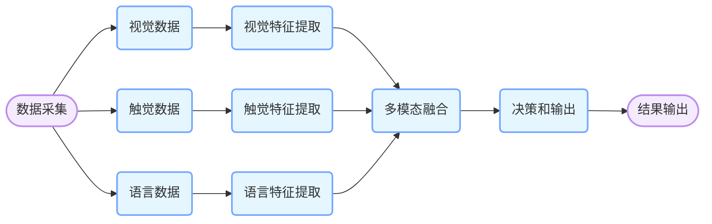

# 开发具有视觉-触觉-语言多模态学习能力的AI Agent

> 关键词：视觉-触觉-语言多模态；AI Agent；多模态学习；深度学习；机器人应用

> 摘要：本文旨在深入探讨开发具有视觉-触觉-语言多模态学习能力的AI Agent这一前沿课题。首先介绍了该研究的背景、目的、预期读者以及文档结构等内容。接着详细阐述了核心概念及其联系，包括多模态学习的原理和架构，并通过文本示意图和Mermaid流程图进行直观展示。然后深入剖析了核心算法原理，结合Python源代码进行详细讲解，同时给出了相关的数学模型和公式，并举例说明。通过项目实战，展示了开发环境搭建、源代码实现及解读分析。探讨了该技术的实际应用场景，推荐了相关的学习资源、开发工具框架以及论文著作。最后对未来发展趋势与挑战进行总结，并提供常见问题解答和扩展阅读参考资料，为相关领域的研究者和开发者提供全面而深入的技术指导。

## 1. 背景介绍 
### 1.1 目的和范围
随着人工智能技术的不断发展，单一模态的AI系统已经难以满足复杂现实场景的需求。开发具有视觉-触觉-语言多模态学习能力的AI Agent具有重要的研究和应用价值。本研究的目的在于构建一个能够同时处理视觉、触觉和语言信息，并从中学习和推理的智能体。其范围涵盖了多模态数据的融合、特征提取、模型训练以及在实际场景中的应用等多个方面。通过整合不同模态的数据，AI Agent可以更全面地感知和理解环境，做出更加准确和智能的决策，从而为机器人技术、智能家居、医疗辅助等多个领域带来新的发展机遇。

### 1.2 预期读者
本文预期读者包括人工智能领域的研究者、开发者、相关专业的学生以及对多模态学习技术感兴趣的技术爱好者。对于研究者来说，本文可以提供新的研究思路和方法；开发者可以借鉴其中的算法和代码实现，应用于实际项目中；学生可以通过本文系统地学习多模态学习的相关知识；技术爱好者则可以了解该领域的前沿动态和应用前景。

### 1.3 文档结构概述
本文将按照以下结构进行组织：首先介绍核心概念与联系，通过文本示意图和Mermaid流程图展示多模态学习的原理和架构；接着详细阐述核心算法原理，并结合Python源代码说明具体操作步骤；给出相关的数学模型和公式，并举例说明其应用；通过项目实战，展示开发环境搭建、源代码实现及解读分析；探讨该技术的实际应用场景；推荐相关的学习资源、开发工具框架以及论文著作；最后对未来发展趋势与挑战进行总结，并提供常见问题解答和扩展阅读参考资料。

### 1.4 术语表
#### 1.4.1 核心术语定义
- **AI Agent**：人工智能智能体，是一个能够感知环境并根据感知信息做出决策和行动的实体。
- **多模态学习**：指同时处理和融合多种不同模态的数据（如视觉、触觉、语言等）以实现更高级的学习和推理能力。
- **视觉模态**：指通过图像或视频等视觉信息来感知环境。
- **触觉模态**：指通过触觉传感器获取物体的物理属性（如硬度、纹理等）信息。
- **语言模态**：指通过文本或语音等语言信息来进行交流和理解。

#### 1.4.2 相关概念解释
- **数据融合**：将不同模态的数据进行整合，以获取更全面和准确的信息。
- **特征提取**：从原始数据中提取出具有代表性的特征，以便后续的学习和处理。
- **深度学习模型**：一种基于神经网络的机器学习模型，能够自动学习数据中的复杂模式和特征。

#### 1.4.3 缩略词列表
- **CNN**：卷积神经网络（Convolutional Neural Network）
- **RNN**：循环神经网络（Recurrent Neural Network）
- **LSTM**：长短期记忆网络（Long Short-Term Memory）
- **Transformer**：一种基于注意力机制的深度学习模型

## 2. 核心概念与联系 

### 核心概念原理
视觉-触觉-语言多模态学习的核心原理在于将不同模态的数据进行有效的融合和交互，以实现更强大的智能感知和决策能力。视觉模态可以提供丰富的场景信息，如物体的形状、颜色、位置等；触觉模态可以感知物体的物理属性，如硬度、粗糙度等；语言模态则可以用于描述和理解环境，以及与人类进行交互。通过将这三种模态的数据进行整合，AI Agent可以更全面地感知和理解环境，从而做出更加准确和智能的决策。

### 架构的文本示意图
以下是一个简单的视觉-触觉-语言多模态学习的架构文本示意图：

1. **数据采集层**：包括视觉传感器（如摄像头）、触觉传感器和语言输入设备（如麦克风或键盘），用于采集不同模态的数据。
2. **特征提取层**：分别对视觉、触觉和语言数据进行特征提取。对于视觉数据，可以使用卷积神经网络（CNN）提取图像特征；对于触觉数据，可以使用传统的信号处理方法或深度学习模型提取特征；对于语言数据，可以使用自然语言处理技术（如词嵌入、Transformer等）提取文本特征。
3. **多模态融合层**：将提取的不同模态的特征进行融合。常见的融合方法包括早期融合、晚期融合和混合融合等。早期融合是在特征提取之前将不同模态的数据进行拼接；晚期融合是在特征提取之后将不同模态的特征进行拼接；混合融合则结合了早期融合和晚期融合的优点。
4. **决策和输出层**：根据融合后的特征进行决策和输出。可以使用深度学习模型（如全连接神经网络、循环神经网络等）进行分类、回归或生成任务。

### Mermaid流程图


## 3. 核心算法原理 & 具体操作步骤 

### 核心算法原理
在视觉-触觉-语言多模态学习中，常用的核心算法包括卷积神经网络（CNN）用于视觉特征提取、循环神经网络（RNN）或Transformer用于语言特征提取，以及注意力机制用于多模态融合。

#### 视觉特征提取：卷积神经网络（CNN）
CNN是一种专门用于处理具有网格结构数据（如图像）的深度学习模型。它通过卷积层、池化层和全连接层等组件，自动学习图像中的特征。卷积层通过卷积核在图像上滑动，提取局部特征；池化层用于降低特征图的维度，减少计算量；全连接层将提取的特征进行分类或回归。

#### 语言特征提取：Transformer
Transformer是一种基于注意力机制的深度学习模型，广泛应用于自然语言处理任务。它通过多头注意力机制，能够捕捉文本中的长距离依赖关系。Transformer由编码器和解码器组成，编码器用于对输入文本进行编码，解码器用于生成输出文本。

#### 多模态融合：注意力机制
注意力机制可以帮助模型自动关注不同模态数据中的重要部分，从而实现更有效的多模态融合。在多模态学习中，注意力机制可以计算不同模态特征之间的相关性，根据相关性分配不同的权重，然后将加权后的特征进行融合。

### 具体操作步骤及Python源代码
以下是一个简单的示例，展示了如何使用Python和PyTorch库实现视觉-触觉-语言多模态学习的基本流程。

```python
import torch
import torch.nn as nn
import torch.optim as optim

# 定义视觉特征提取模型（简单的CNN）
class VisualFeatureExtractor(nn.Module):
    def __init__(self):
        super(VisualFeatureExtractor, self).__init__()
        self.conv1 = nn.Conv2d(3, 16, kernel_size=3, padding=1)
        self.relu1 = nn.ReLU()
        self.pool1 = nn.MaxPool2d(2)
        self.conv2 = nn.Conv2d(16, 32, kernel_size=3, padding=1)
        self.relu2 = nn.ReLU()
        self.pool2 = nn.MaxPool2d(2)
        self.fc = nn.Linear(32 * 8 * 8, 128)

    def forward(self, x):
        x = self.pool1(self.relu1(self.conv1(x)))
        x = self.pool2(self.relu2(self.conv2(x)))
        x = x.view(-1, 32 * 8 * 8)
        x = self.fc(x)
        return x

# 定义语言特征提取模型（简单的全连接网络）
class LanguageFeatureExtractor(nn.Module):
    def __init__(self):
        super(LanguageFeatureExtractor, self).__init__()
        self.fc1 = nn.Linear(100, 64)
        self.relu = nn.ReLU()
        self.fc2 = nn.Linear(64, 128)

    def forward(self, x):
        x = self.relu(self.fc1(x))
        x = self.fc2(x)
        return x

# 定义多模态融合模型（使用简单的拼接和全连接层）
class MultiModalFusionModel(nn.Module):
    def __init__(self):
        super(MultiModalFusionModel, self).__init__()
        self.fc1 = nn.Linear(128 + 128, 256)
        self.relu = nn.ReLU()
        self.fc2 = nn.Linear(256, 10)

    def forward(self, visual_features, language_features):
        combined_features = torch.cat((visual_features, language_features), dim=1)
        x = self.relu(self.fc1(combined_features))
        x = self.fc2(x)
        return x

# 初始化模型
visual_extractor = VisualFeatureExtractor()
language_extractor = LanguageFeatureExtractor()
fusion_model = MultiModalFusionModel()

# 定义损失函数和优化器
criterion = nn.CrossEntropyLoss()
optimizer = optim.Adam(list(visual_extractor.parameters()) + list(language_extractor.parameters()) + list(fusion_model.parameters()), lr=0.001)

# 模拟数据
visual_data = torch.randn(16, 3, 32, 32)
language_data = torch.randn(16, 100)
labels = torch.randint(0, 10, (16,))

# 训练模型
for epoch in range(10):
    optimizer.zero_grad()
    visual_features = visual_extractor(visual_data)
    language_features = language_extractor(language_data)
    outputs = fusion_model(visual_features, language_features)
    loss = criterion(outputs, labels)
    loss.backward()
    optimizer.step()
    print(f'Epoch {epoch + 1}, Loss: {loss.item()}')
```

## 4. 数学模型和公式 & 详细讲解 & 举例说明 

### 视觉特征提取的数学模型和公式
#### 卷积层
卷积层的计算公式如下：
$$
y_{i,j}^k = \sum_{m=0}^{M - 1} \sum_{n=0}^{N - 1} x_{i + m, j + n}^l \cdot w_{m,n}^{k,l} + b^k
$$
其中，$x_{i,j}^l$ 是输入特征图在第 $l$ 层的 $(i,j)$ 位置的值，$w_{m,n}^{k,l}$ 是卷积核在第 $k$ 个输出通道和第 $l$ 个输入通道的 $(m,n)$ 位置的值，$b^k$ 是第 $k$ 个输出通道的偏置，$y_{i,j}^k$ 是输出特征图在第 $k$ 个通道的 $(i,j)$ 位置的值。

#### 池化层
最大池化层的计算公式如下：
$$
y_{i,j}^k = \max_{m=0}^{M - 1} \max_{n=0}^{N - 1} x_{i \cdot s + m, j \cdot s + n}^k
$$
其中，$s$ 是池化步长，$M$ 和 $N$ 是池化窗口的大小。

### 语言特征提取的数学模型和公式
#### Transformer的注意力机制
多头注意力机制的计算公式如下：
$$
\text{MultiHead}(Q, K, V) = \text{Concat}(\text{head}_1, \ldots, \text{head}_h)W^O
$$
其中，$\text{head}_i = \text{Attention}(QW_i^Q, KW_i^K, VW_i^V)$，$\text{Attention}(Q, K, V) = \text{softmax}(\frac{QK^T}{\sqrt{d_k}})V$，$Q$、$K$、$V$ 分别是查询、键和值矩阵，$W_i^Q$、$W_i^K$、$W_i^V$ 和 $W^O$ 是可学习的权重矩阵，$d_k$ 是键的维度。

### 多模态融合的数学模型和公式
#### 早期融合
早期融合是将不同模态的数据在原始数据层面进行拼接，然后进行特征提取。假设视觉数据 $x_v$ 和语言数据 $x_l$，早期融合后的数据 $x_f$ 可以表示为：
$$
x_f = [x_v; x_l]
$$

#### 晚期融合
晚期融合是将不同模态的特征在特征层面进行拼接，然后进行分类或回归。假设视觉特征 $f_v$ 和语言特征 $f_l$，晚期融合后的特征 $f_f$ 可以表示为：
$$
f_f = [f_v; f_l]
$$

### 举例说明
假设我们有一张图像和一段文本描述，图像的大小为 $32 \times 32 \times 3$，文本的长度为 100 个词。我们使用上述的视觉特征提取模型和语言特征提取模型分别提取图像和文本的特征。视觉特征的维度为 128，语言特征的维度也为 128。然后使用晚期融合的方法将这两个特征进行拼接，得到维度为 256 的融合特征。最后，将融合特征输入到分类模型中，进行分类任务。

## 5. 项目实战：代码实际案例和详细解释说明 

### 5.1  开发环境搭建
#### 安装Python
首先，确保你已经安装了Python 3.6或更高版本。你可以从Python官方网站（https://www.python.org/downloads/）下载并安装Python。

#### 安装深度学习框架
我们使用PyTorch作为深度学习框架。可以使用以下命令安装PyTorch：
```sh
pip install torch torchvision
```

#### 安装其他依赖库
还需要安装一些其他的依赖库，如NumPy、Matplotlib等。可以使用以下命令安装：
```sh
pip install numpy matplotlib
```

### 5.2  源代码详细实现和代码解读
以下是一个完整的项目实战代码示例，实现了一个简单的视觉-触觉-语言多模态分类任务。

```python
import torch
import torch.nn as nn
import torch.optim as optim
import numpy as np
from torch.utils.data import Dataset, DataLoader

# 定义自定义数据集类
class MultiModalDataset(Dataset):
    def __init__(self, visual_data, tactile_data, language_data, labels):
        self.visual_data = visual_data
        self.tactile_data = tactile_data
        self.language_data = language_data
        self.labels = labels

    def __len__(self):
        return len(self.labels)

    def __getitem__(self, idx):
        visual_sample = self.visual_data[idx]
        tactile_sample = self.tactile_data[idx]
        language_sample = self.language_data[idx]
        label = self.labels[idx]
        return visual_sample, tactile_sample, language_sample, label

# 定义视觉特征提取模型（简单的CNN）
class VisualFeatureExtractor(nn.Module):
    def __init__(self):
        super(VisualFeatureExtractor, self).__init__()
        self.conv1 = nn.Conv2d(3, 16, kernel_size=3, padding=1)
        self.relu1 = nn.ReLU()
        self.pool1 = nn.MaxPool2d(2)
        self.conv2 = nn.Conv2d(16, 32, kernel_size=3, padding=1)
        self.relu2 = nn.ReLU()
        self.pool2 = nn.MaxPool2d(2)
        self.fc = nn.Linear(32 * 8 * 8, 128)

    def forward(self, x):
        x = self.pool1(self.relu1(self.conv1(x)))
        x = self.pool2(self.relu2(self.conv2(x)))
        x = x.view(-1, 32 * 8 * 8)
        x = self.fc(x)
        return x

# 定义触觉特征提取模型（简单的全连接网络）
class TactileFeatureExtractor(nn.Module):
    def __init__(self):
        super(TactileFeatureExtractor, self).__init__()
        self.fc1 = nn.Linear(10, 64)
        self.relu = nn.ReLU()
        self.fc2 = nn.Linear(64, 128)

    def forward(self, x):
        x = self.relu(self.fc1(x))
        x = self.fc2(x)
        return x

# 定义语言特征提取模型（简单的全连接网络）
class LanguageFeatureExtractor(nn.Module):
    def __init__(self):
        super(LanguageFeatureExtractor, self).__init__()
        self.fc1 = nn.Linear(100, 64)
        self.relu = nn.ReLU()
        self.fc2 = nn.Linear(64, 128)

    def forward(self, x):
        x = self.relu(self.fc1(x))
        x = self.fc2(x)
        return x

# 定义多模态融合模型（使用简单的拼接和全连接层）
class MultiModalFusionModel(nn.Module):
    def __init__(self):
        super(MultiModalFusionModel, self).__init__()
        self.fc1 = nn.Linear(128 + 128 + 128, 256)
        self.relu = nn.ReLU()
        self.fc2 = nn.Linear(256, 10)

    def forward(self, visual_features, tactile_features, language_features):
        combined_features = torch.cat((visual_features, tactile_features, language_features), dim=1)
        x = self.relu(self.fc1(combined_features))
        x = self.fc2(x)
        return x

# 模拟数据
num_samples = 1000
visual_data = torch.randn(num_samples, 3, 32, 32)
tactile_data = torch.randn(num_samples, 10)
language_data = torch.randn(num_samples, 100)
labels = torch.randint(0, 10, (num_samples,))

# 创建数据集和数据加载器
dataset = MultiModalDataset(visual_data, tactile_data, language_data, labels)
dataloader = DataLoader(dataset, batch_size=32, shuffle=True)

# 初始化模型
visual_extractor = VisualFeatureExtractor()
tactile_extractor = TactileFeatureExtractor()
language_extractor = LanguageFeatureExtractor()
fusion_model = MultiModalFusionModel()

# 定义损失函数和优化器
criterion = nn.CrossEntropyLoss()
optimizer = optim.Adam(list(visual_extractor.parameters()) + list(tactile_extractor.parameters()) + list(language_extractor.parameters()) + list(fusion_model.parameters()), lr=0.001)

# 训练模型
num_epochs = 10
for epoch in range(num_epochs):
    running_loss = 0.0
    for visual_batch, tactile_batch, language_batch, label_batch in dataloader:
        optimizer.zero_grad()
        visual_features = visual_extractor(visual_batch)
        tactile_features = tactile_extractor(tactile_batch)
        language_features = language_extractor(language_batch)
        outputs = fusion_model(visual_features, tactile_features, language_features)
        loss = criterion(outputs, label_batch)
        loss.backward()
        optimizer.step()
        running_loss += loss.item()
    print(f'Epoch {epoch + 1}, Loss: {running_loss / len(dataloader)}')
```

### 5.3  代码解读与分析
#### 数据集类 `MultiModalDataset`
该类继承自 `torch.utils.data.Dataset`，用于封装多模态数据。`__init__` 方法初始化数据集的视觉、触觉、语言数据和标签；`__len__` 方法返回数据集的样本数量；`__getitem__` 方法根据索引返回一个样本的视觉、触觉、语言数据和标签。

#### 特征提取模型
- `VisualFeatureExtractor`：使用简单的CNN结构提取视觉特征。
- `TactileFeatureExtractor`：使用全连接网络提取触觉特征。
- `LanguageFeatureExtractor`：使用全连接网络提取语言特征。

#### 多模态融合模型 `MultiModalFusionModel`
该模型将视觉、触觉和语言特征进行拼接，然后通过全连接层进行分类。

#### 训练过程
使用 `DataLoader` 加载数据集，每次加载一个批次的数据。在每个批次中，分别提取视觉、触觉和语言特征，然后将这些特征输入到融合模型中进行分类。计算损失并进行反向传播和参数更新。

## 6. 实际应用场景 
### 机器人领域
在机器人领域，具有视觉-触觉-语言多模态学习能力的AI Agent可以帮助机器人更全面地感知和理解环境。例如，在机器人抓取任务中，视觉信息可以帮助机器人识别物体的位置和形状，触觉信息可以帮助机器人感知物体的硬度和表面纹理，语言信息可以用于与人类进行交互和获取任务指令。通过整合这些信息，机器人可以更准确地完成抓取任务，并且能够适应不同的物体和环境。

### 智能家居领域
在智能家居领域，多模态AI Agent可以实现更加智能的家居控制。例如，用户可以通过语音指令控制家电设备，同时AI Agent可以通过视觉传感器监测家居环境的状态，如温度、湿度、光照等，通过触觉传感器感知门窗的开关状态。根据这些多模态信息，AI Agent可以自动调整家居设备的运行状态，提供更加舒适和便捷的家居体验。

### 医疗辅助领域
在医疗辅助领域，多模态AI Agent可以用于疾病诊断和康复治疗。例如，通过视觉信息（如X光、CT图像）、触觉信息（如触诊数据）和语言信息（如患者的症状描述），AI Agent可以辅助医生进行疾病诊断。在康复治疗中，AI Agent可以通过视觉和触觉信息监测患者的康复情况，根据患者的反馈调整治疗方案。

### 教育领域
在教育领域，多模态AI Agent可以提供更加个性化的学习体验。例如，通过视觉信息（如教学视频）、触觉信息（如实验设备的操作反馈）和语言信息（如教师的讲解和学生的提问），AI Agent可以根据学生的学习情况和需求，提供定制化的学习资源和指导。

## 7. 工具和资源推荐
### 7.1 学习资源推荐
#### 7.1.1 书籍推荐
- 《深度学习》（Deep Learning）：由Ian Goodfellow、Yoshua Bengio和Aaron Courville所著，是深度学习领域的经典教材，涵盖了深度学习的基本原理、算法和应用。
- 《Python深度学习》（Deep Learning with Python）：由Francois Chollet所著，介绍了如何使用Python和Keras库进行深度学习开发，适合初学者入门。
- 《多模态机器学习：原理与应用》（Multimodal Machine Learning: Principles and Applications）：全面介绍了多模态机器学习的原理、方法和应用，是多模态学习领域的重要参考书籍。

#### 7.1.2 在线课程
- Coursera上的“深度学习专项课程”（Deep Learning Specialization）：由Andrew Ng教授主讲，涵盖了深度学习的各个方面，包括神经网络、卷积神经网络、循环神经网络等。
- edX上的“人工智能导论”（Introduction to Artificial Intelligence）：介绍了人工智能的基本概念、算法和应用，包括多模态学习的相关内容。
- Udemy上的“Python数据科学和机器学习实战”（Python for Data Science and Machine Learning Bootcamp）：通过实际项目介绍了Python在数据科学和机器学习中的应用，包括深度学习和多模态学习的实践。

#### 7.1.3 技术博客和网站
- arXiv：一个预印本平台，提供了大量的学术论文，包括多模态学习领域的最新研究成果。
- Medium：一个技术博客平台，有很多关于人工智能和深度学习的优质文章，包括多模态学习的实践经验和技术分享。
- Towards Data Science：专注于数据科学和机器学习领域的博客，提供了很多关于多模态学习的教程和案例分析。

### 7.2 开发工具框架推荐
#### 7.2.1 IDE和编辑器
- PyCharm：一款专业的Python集成开发环境，提供了丰富的代码编辑、调试和项目管理功能，适合Python深度学习开发。
- Jupyter Notebook：一个交互式的开发环境，支持Python代码的实时运行和可视化，非常适合数据探索和模型实验。
- Visual Studio Code：一款轻量级的代码编辑器，支持多种编程语言和插件扩展，也可以用于Python深度学习开发。

#### 7.2.2 调试和性能分析工具
- PyTorch Profiler：PyTorch提供的性能分析工具，可以帮助开发者分析模型的运行时间和内存使用情况，优化模型性能。
- TensorBoard：TensorFlow提供的可视化工具，也可以与PyTorch结合使用，用于可视化模型的训练过程和性能指标。
- cProfile：Python标准库中的性能分析工具，可以帮助开发者分析代码的运行时间和函数调用情况。

#### 7.2.3 相关框架和库
- PyTorch：一个开源的深度学习框架，提供了丰富的神经网络层和优化算法，支持GPU加速，非常适合多模态学习的开发。
- TensorFlow：另一个广泛使用的深度学习框架，具有强大的分布式训练和模型部署能力，也可以用于多模态学习。
- Hugging Face Transformers：一个用于自然语言处理的开源库，提供了预训练的Transformer模型和相关工具，方便进行语言特征提取和处理。

### 7.3 相关论文著作推荐
#### 7.3.1 经典论文
- “Attention Is All You Need”：介绍了Transformer模型，是自然语言处理领域的经典论文，为多模态学习中的语言特征提取提供了重要的方法。
- “Fusion of Multimodal Information in Video: Feature Level vs. Decision Level”：探讨了多模态信息融合的两种方式（特征级融合和决策级融合），对多模态学习的融合策略有重要的指导意义。
- “Learning Deep Representations of Multimodal Data with Deep Boltzmann Machines”：提出了使用深度玻尔兹曼机进行多模态数据学习的方法，为多模态学习的模型设计提供了新的思路。

#### 7.3.2 最新研究成果
- 可以关注每年的顶级人工智能会议（如NeurIPS、ICML、CVPR等）上发表的关于多模态学习的论文，了解该领域的最新研究动态和技术创新。
- 一些知名的学术期刊（如Journal of Artificial Intelligence Research、Artificial Intelligence等）也会发表多模态学习领域的高质量研究论文。

#### 7.3.3 应用案例分析
- 可以参考一些实际应用案例的论文，如机器人抓取、智能家居控制、医疗诊断等领域的多模态学习应用，了解如何将多模态学习技术应用到实际场景中，解决实际问题。

## 8. 总结：未来发展趋势与挑战
### 未来发展趋势
#### 更强大的多模态融合方法
未来，研究人员将继续探索更强大的多模态融合方法，以更好地整合不同模态的数据。例如，基于注意力机制的融合方法将不断改进，能够更准确地捕捉不同模态数据之间的关联。同时，一些新型的融合策略，如基于图神经网络的融合方法，也将得到更多的研究和应用。

#### 跨模态迁移学习
跨模态迁移学习将成为未来的一个重要研究方向。通过将在一个模态上学习到的知识迁移到其他模态上，可以提高模型的学习效率和泛化能力。例如，将在视觉模态上学习到的物体识别知识迁移到触觉模态上，帮助机器人更好地理解物体的物理属性。

#### 多模态交互与协作
随着人工智能技术的发展，多模态AI Agent将能够与人类和其他智能体进行更加自然和高效的交互与协作。例如，在智能家居中，多模态AI Agent可以通过视觉、触觉和语言信息与用户进行互动，理解用户的需求并提供个性化的服务。

#### 应用领域的拓展
多模态学习技术将在更多的领域得到应用，如自动驾驶、虚拟现实、文化遗产保护等。在自动驾驶中，多模态AI Agent可以结合视觉、雷达、激光雷达等多种传感器的数据，提高自动驾驶的安全性和可靠性。

### 挑战
#### 数据获取和标注
多模态数据的获取和标注是一个具有挑战性的问题。不同模态的数据需要使用不同的传感器进行采集，而且数据的标注需要专业的知识和大量的人力。例如，在医疗领域，获取高质量的视觉、触觉和语言数据，并进行准确的标注是非常困难的。

#### 计算资源和效率
多模态学习模型通常比较复杂，需要大量的计算资源和时间进行训练。如何在有限的计算资源下提高模型的训练效率，是一个亟待解决的问题。例如，使用分布式训练和模型压缩技术，可以减少计算资源的需求，提高训练效率。

#### 模型可解释性
多模态学习模型通常是黑盒模型，难以解释其决策过程和结果。在一些关键领域（如医疗、金融等），模型的可解释性是非常重要的。如何提高多模态学习模型的可解释性，是未来研究的一个重要方向。

#### 跨模态语义理解
不同模态的数据具有不同的语义表示，如何实现跨模态的语义理解是一个挑战。例如，如何将视觉图像中的物体信息与语言描述中的语义信息进行有效的关联和匹配，是多模态学习需要解决的问题之一。

## 9. 附录：常见问题与解答
### 问题1：多模态学习中不同模态的数据如何进行归一化处理？
不同模态的数据可以根据其特点采用不同的归一化方法。对于视觉数据，常用的归一化方法是将像素值归一化到 [0, 1] 或 [-1, 1] 范围内。可以使用 `torchvision.transforms.Normalize` 函数进行归一化。对于触觉数据和语言数据，可以使用标准化（z-score normalization）或最小-最大归一化（min-max normalization）。标准化将数据的均值变为 0，标准差变为 1；最小-最大归一化将数据缩放到 [0, 1] 范围内。

### 问题2：如何选择合适的多模态融合方法？
选择合适的多模态融合方法需要考虑多个因素，如数据的特点、任务的需求和模型的复杂度等。早期融合适用于不同模态数据之间相关性较强的情况，可以在原始数据层面进行信息共享。晚期融合适用于不同模态数据之间相关性较弱的情况，可以在特征层面进行融合。混合融合结合了早期融合和晚期融合的优点，能够更好地平衡不同模态数据的信息。此外，基于注意力机制的融合方法可以自动关注不同模态数据中的重要部分，适用于需要捕捉模态间关联的任务。

### 问题3：多模态学习模型的训练时间较长，如何提高训练效率？
可以采取以下措施提高多模态学习模型的训练效率：
- 使用GPU加速：将模型和数据迁移到GPU上进行训练，可以显著提高训练速度。
- 分布式训练：使用多个GPU或多个计算节点进行分布式训练，进一步提高训练效率。
- 模型压缩：采用模型剪枝、量化等技术，减少模型的参数数量，降低计算量。
- 数据增强：通过数据增强技术增加训练数据的多样性，减少过拟合，提高模型的泛化能力，从而减少训练时间。

### 问题4：如何评估多模态学习模型的性能？
评估多模态学习模型的性能可以采用多种指标，具体取决于任务的类型。对于分类任务，可以使用准确率、召回率、F1值等指标；对于回归任务，可以使用均方误差（MSE）、平均绝对误差（MAE）等指标。此外，还可以使用一些多模态特定的评估指标，如跨模态一致性、模态互补性等，来评估模型在不同模态数据上的表现和融合效果。

## 10. 扩展阅读 & 参考资料
### 扩展阅读
- 可以进一步阅读关于深度学习优化算法、模型评估和解释性的相关书籍和论文，深入了解如何优化多模态学习模型的性能和提高其可解释性。
- 关注一些开源的多模态学习项目，如OpenAI的CLIP（Contrastive Language-Image Pretraining），学习其实现思路和代码结构。

### 参考资料
- Goodfellow, I., Bengio, Y., & Courville, A. (2016). Deep Learning. MIT Press.
- Chollet, F. (2018). Deep Learning with Python. Manning Publications.
- Baltrušaitis, T., Ahuja, C., & Morency, L.-P. (2018). Multimodal Machine Learning: A Survey and Taxonomy. IEEE Transactions on Pattern Analysis and Machine Intelligence, 41(2), 423-443.
- Vaswani, A., Shazeer, N., Parmar, N., Uszkoreit, J., Jones, L., Gomez, A. N.,... & Polosukhin, I. (2017). Attention Is All You Need. Advances in Neural Information Processing Systems, 5998-6008.