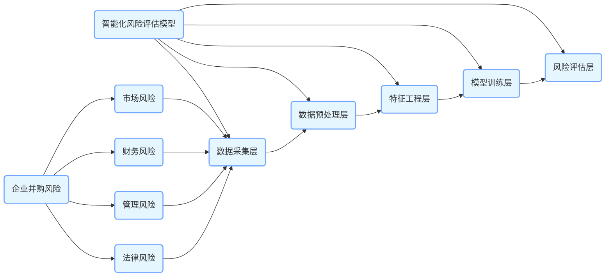

# 开发智能化的企业并购风险评估模型

> 关键词：企业并购、风险评估、智能化模型、数据分析、机器学习

> 摘要：本文聚焦于开发智能化的企业并购风险评估模型。在当今竞争激烈的商业环境中，企业并购活动频繁，但并购过程中面临着诸多风险。传统的风险评估方法存在效率低、主观性强等问题。本文旨在介绍智能化风险评估模型的核心概念、算法原理、数学模型等内容，并通过项目实战展示其具体实现和应用，探讨其在实际场景中的应用价值，同时推荐相关的工具和资源，最后对其未来发展趋势与挑战进行总结。

## 1. 背景介绍 
### 1.1 目的和范围
企业并购作为企业扩张和战略调整的重要手段，在全球经济活动中占据着重要地位。然而，并购过程中涉及到财务、法律、市场等多方面的风险，如果不能准确评估和有效控制这些风险，可能导致并购失败，给企业带来巨大损失。本项目的目的是开发一个智能化的企业并购风险评估模型，利用先进的数据分析和机器学习技术，对企业并购过程中的各种风险进行全面、客观、准确的评估。

本模型的范围涵盖了企业并购的各个阶段，包括并购前的目标企业筛选、尽职调查，并购中的交易谈判、合同签订，以及并购后的整合等。通过对相关数据的收集、整理和分析，模型将对市场风险、财务风险、管理风险、法律风险等进行量化评估，并提供相应的风险预警和应对建议。

### 1.2 预期读者
本文的预期读者包括企业的高层管理人员、投资银行家、财务分析师、风险管理专家、学者以及对企业并购和数据分析感兴趣的专业人士。这些读者希望通过了解智能化的企业并购风险评估模型，更好地理解企业并购过程中的风险，提高决策的科学性和准确性。

### 1.3 文档结构概述
本文将按照以下结构进行组织：
- 核心概念与联系：介绍企业并购风险评估的核心概念，包括风险的定义、分类以及智能化模型的架构和原理。
- 核心算法原理 & 具体操作步骤：详细讲解构建智能化风险评估模型所使用的核心算法，如机器学习算法，并给出具体的操作步骤和 Python 代码示例。
- 数学模型和公式 & 详细讲解 & 举例说明：介绍风险评估模型中涉及的数学模型和公式，通过具体的例子进行详细讲解。
- 项目实战：代码实际案例和详细解释说明：通过一个实际的项目案例，展示智能化风险评估模型的开发过程，包括开发环境搭建、源代码实现和代码解读。
- 实际应用场景：探讨智能化风险评估模型在企业并购中的实际应用场景和价值。
- 工具和资源推荐：推荐相关的学习资源、开发工具框架和论文著作。
- 总结：未来发展趋势与挑战：总结智能化企业并购风险评估模型的发展趋势和面临的挑战。
- 附录：常见问题与解答：解答读者在阅读过程中可能遇到的常见问题。
- 扩展阅读 & 参考资料：提供相关的扩展阅读材料和参考资料。

### 1.4 术语表
#### 1.4.1 核心术语定义
- **企业并购**：指企业之间的合并和收购行为，包括吸收合并、新设合并、股权收购、资产收购等多种形式。
- **风险评估**：对企业并购过程中可能面临的各种风险进行识别、分析和评价的过程。
- **智能化模型**：利用人工智能技术，如机器学习、深度学习等，构建的能够自动处理和分析数据，进行风险评估的模型。
- **机器学习**：一门多领域交叉学科，涉及概率论、统计学、逼近论、凸分析、算法复杂度理论等多门学科。它专门研究计算机怎样模拟或实现人类的学习行为，以获取新的知识或技能，重新组织已有的知识结构使之不断改善自身的性能。
- **特征工程**：指从原始数据中提取特征并将其转换为适合机器学习算法处理的格式的过程。

#### 1.4.2 相关概念解释
- **市场风险**：指由于市场因素的变化，如市场需求、市场价格、市场竞争等，导致企业并购后无法实现预期目标的风险。
- **财务风险**：指由于企业并购过程中的财务安排不当，如融资困难、财务杠杆过高、财务报表造假等，导致企业财务状况恶化的风险。
- **管理风险**：指由于企业并购后管理不善，如企业文化冲突、管理团队整合困难、管理制度不健全等，导致企业运营效率低下的风险。
- **法律风险**：指由于企业并购过程中涉及的法律问题，如合同纠纷、知识产权侵权、反垄断审查等，导致企业面临法律诉讼和赔偿的风险。

#### 1.4.3 缩略词列表
- **AI**：Artificial Intelligence，人工智能
- **ML**：Machine Learning，机器学习
- **DL**：Deep Learning，深度学习
- **PCA**：Principal Component Analysis，主成分分析
- **SVM**：Support Vector Machine，支持向量机

## 2. 核心概念与联系 

### 2.1 企业并购风险的分类与特征
企业并购风险可以分为多种类型，不同类型的风险具有不同的特征。

#### 2.1.1 市场风险
市场风险主要源于市场环境的不确定性。例如，市场需求的变化可能导致并购后的企业产品或服务无法满足市场需求，从而影响企业的盈利能力。市场价格的波动也会对企业的成本和收益产生影响。市场竞争的加剧可能使并购后的企业面临更大的竞争压力，难以在市场中立足。

#### 2.1.2 财务风险
财务风险是企业并购中较为关键的风险之一。融资风险是指企业在并购过程中无法及时、足额地筹集到所需资金，导致并购计划无法顺利进行。财务杠杆过高可能使企业面临较大的偿债压力，增加财务困境的风险。财务报表造假则会导致企业对目标企业的价值评估出现偏差，从而影响并购决策的正确性。

#### 2.1.3 管理风险
管理风险主要涉及企业并购后的整合问题。企业文化冲突是常见的管理风险之一，不同企业的文化差异可能导致员工之间的沟通障碍和合作困难。管理团队整合困难可能导致企业决策效率低下，无法有效地实施战略规划。管理制度不健全则会影响企业的运营秩序，降低企业的管理效率。

#### 2.1.4 法律风险
法律风险贯穿于企业并购的全过程。合同纠纷可能导致企业在并购过程中遭受经济损失。知识产权侵权问题可能引发法律诉讼，影响企业的声誉和市场形象。反垄断审查则可能导致并购计划无法获得批准，使企业的并购努力付诸东流。

### 2.2 智能化风险评估模型的架构
智能化的企业并购风险评估模型主要由数据采集层、数据预处理层、特征工程层、模型训练层和风险评估层组成。

#### 2.2.1 数据采集层
数据采集层负责收集与企业并购相关的各种数据，包括企业的财务报表、市场数据、行业报告、法律文件等。这些数据来源广泛，可以通过公开渠道、专业数据库、企业内部系统等获取。

#### 2.2.2 数据预处理层
数据预处理层对采集到的数据进行清洗、转换和集成等操作，以提高数据的质量和可用性。清洗操作主要是去除数据中的噪声、缺失值和重复值。转换操作则是将数据转换为适合机器学习算法处理的格式，如将文本数据转换为数值特征。集成操作是将来自不同数据源的数据进行整合，形成统一的数据集。

#### 2.2.3 特征工程层
特征工程层从预处理后的数据中提取有价值的特征，以提高模型的性能。特征提取可以采用多种方法，如主成分分析、因子分析等。特征选择则是从提取的特征中选择最相关的特征，以减少模型的复杂度。

#### 2.2.4 模型训练层
模型训练层使用机器学习算法对特征工程后的数据集进行训练，构建风险评估模型。常用的机器学习算法包括决策树、支持向量机、神经网络等。在训练过程中，需要对模型进行调优，以提高模型的准确性和泛化能力。

#### 2.2.5 风险评估层
风险评估层使用训练好的模型对新的企业并购项目进行风险评估，输出风险评估结果和相应的风险预警信息。风险评估结果可以以量化的形式表示，如风险得分、风险等级等。

### 2.3 核心概念的联系示意图


## 3. 核心算法原理 & 具体操作步骤 

### 3.1 决策树算法原理
决策树是一种常用的机器学习算法，它通过对数据的特征进行划分，构建一棵决策树，用于分类或回归任务。决策树的每个内部节点表示一个特征上的测试，每个分支表示一个测试输出，每个叶节点表示一个类别或值。

决策树的构建过程主要包括特征选择、树的生成和树的剪枝三个步骤。

#### 3.1.1 特征选择
特征选择的目的是选择最具有区分度的特征作为决策树的划分依据。常用的特征选择指标包括信息增益、信息增益比、基尼指数等。

信息增益是指在划分数据集前后信息熵的变化量。信息熵是衡量数据集不确定性的指标，信息熵越大，数据集的不确定性越大。信息增益越大，说明使用该特征划分数据集后，数据集的不确定性降低得越多，该特征的区分度越高。

信息增益比是在信息增益的基础上进行修正，以克服信息增益对取值较多的特征的偏好。

基尼指数是衡量数据集纯度的指标，基尼指数越小，数据集的纯度越高。

#### 3.1.2 树的生成
树的生成过程是一个递归的过程，从根节点开始，不断选择最优的特征进行划分，直到满足停止条件。停止条件可以是数据集的所有样本属于同一类别、没有特征可供选择、树的深度达到预设的阈值等。

#### 3.1.3 树的剪枝
树的剪枝是为了防止决策树过拟合，提高模型的泛化能力。剪枝可以分为预剪枝和后剪枝两种方法。预剪枝是在树的生成过程中，通过设定一些阈值，提前停止树的生长。后剪枝是在树生成后，对树进行修剪，去除一些不必要的节点。

### 3.2 决策树算法的 Python 实现
```python
from sklearn.datasets import load_iris
from sklearn.model_selection import train_test_split
from sklearn.tree import DecisionTreeClassifier
from sklearn.metrics import accuracy_score

# 加载数据集
iris = load_iris()
X = iris.data
y = iris.target

# 划分训练集和测试集
X_train, X_test, y_train, y_test = train_test_split(X, y, test_size=0.3, random_state=42)

# 创建决策树分类器
clf = DecisionTreeClassifier()

# 训练模型
clf.fit(X_train, y_train)

# 预测
y_pred = clf.predict(X_test)

# 计算准确率
accuracy = accuracy_score(y_test, y_pred)
print(f"Accuracy: {accuracy}")
```

### 3.3 具体操作步骤
#### 3.3.1 数据准备
首先，需要收集与企业并购风险评估相关的数据，并进行数据预处理，包括数据清洗、转换和集成等操作。

#### 3.3.2 特征工程
从预处理后的数据中提取有价值的特征，并进行特征选择，以减少模型的复杂度。

#### 3.3.3 模型训练
使用决策树算法对特征工程后的数据集进行训练，构建风险评估模型。在训练过程中，可以使用交叉验证等方法对模型进行调优，以提高模型的性能。

#### 3.3.4 模型评估
使用测试集对训练好的模型进行评估，计算模型的准确率、召回率、F1 值等指标，以评估模型的性能。

#### 3.3.5 模型应用
使用训练好的模型对新的企业并购项目进行风险评估，输出风险评估结果和相应的风险预警信息。

## 4. 数学模型和公式 & 详细讲解 & 举例说明 

### 4.1 信息熵
信息熵是衡量数据集不确定性的指标，其数学定义为：
$$H(X)=-\sum_{i=1}^{n}p(x_i)\log_2p(x_i)$$
其中，$X$ 是一个离散随机变量，$p(x_i)$ 是 $X$ 取值为 $x_i$ 的概率，$n$ 是 $X$ 的取值个数。

例如，假设有一个数据集 $D$，其中包含 10 个样本，分为两个类别，类别 1 有 6 个样本，类别 2 有 4 个样本。则数据集 $D$ 的信息熵为：
$$H(D)=-\frac{6}{10}\log_2\frac{6}{10}-\frac{4}{10}\log_2\frac{4}{10}\approx0.971$$

### 4.2 信息增益
信息增益是指在划分数据集前后信息熵的变化量，其数学定义为：
$$Gain(D,A)=H(D)-\sum_{v=1}^{V}\frac{|D^v|}{|D|}H(D^v)$$
其中，$D$ 是数据集，$A$ 是划分数据集的特征，$V$ 是特征 $A$ 的取值个数，$D^v$ 是特征 $A$ 取值为 $v$ 的样本子集。

例如，假设有一个数据集 $D$，包含 10 个样本，分为两个类别，类别 1 有 6 个样本，类别 2 有 4 个样本。特征 $A$ 有两个取值，$A_1$ 和 $A_2$，其中 $A_1$ 对应的样本子集 $D_1$ 包含 4 个样本，类别 1 有 3 个样本，类别 2 有 1 个样本；$A_2$ 对应的样本子集 $D_2$ 包含 6 个样本，类别 1 有 3 个样本，类别 2 有 3 个样本。则特征 $A$ 的信息增益为：
$$H(D)\approx0.971$$
$$H(D_1)=-\frac{3}{4}\log_2\frac{3}{4}-\frac{1}{4}\log_2\frac{1}{4}\approx0.811$$
$$H(D_2)=-\frac{3}{6}\log_2\frac{3}{6}-\frac{3}{6}\log_2\frac{3}{6}=1$$
$$Gain(D,A)=0.971-\frac{4}{10}\times0.811-\frac{6}{10}\times1\approx0.134$$

### 4.3 基尼指数
基尼指数是衡量数据集纯度的指标，其数学定义为：
$$Gini(D)=1-\sum_{i=1}^{n}p(x_i)^2$$
其中，$D$ 是数据集，$p(x_i)$ 是 $D$ 中属于类别 $i$ 的样本的概率，$n$ 是类别个数。

例如，假设有一个数据集 $D$，包含 10 个样本，分为两个类别，类别 1 有 6 个样本，类别 2 有 4 个样本。则数据集 $D$ 的基尼指数为：
$$Gini(D)=1-(\frac{6}{10})^2-(\frac{4}{10})^2=0.48$$

## 5. 项目实战：代码实际案例和详细解释说明 

### 5.1  开发环境搭建
#### 5.1.1 安装 Python
首先，需要安装 Python 开发环境。可以从 Python 官方网站（https://www.python.org/downloads/） 下载适合自己操作系统的 Python 安装包，并按照安装向导进行安装。

#### 5.1.2 安装必要的库
在开发智能化的企业并购风险评估模型时，需要使用一些 Python 库，如 Pandas、Numpy、Scikit-learn 等。可以使用以下命令安装这些库：
```bash
pip install pandas numpy scikit-learn
```

### 5.2  源代码详细实现和代码解读
```python
import pandas as pd
import numpy as np
from sklearn.model_selection import train_test_split
from sklearn.tree import DecisionTreeClassifier
from sklearn.metrics import accuracy_score

# 加载数据集
data = pd.read_csv('merger_risk_data.csv')

# 数据预处理
# 处理缺失值
data = data.dropna()

# 分离特征和标签
X = data.drop('risk_label', axis=1)
y = data['risk_label']

# 划分训练集和测试集
X_train, X_test, y_train, y_test = train_test_split(X, y, test_size=0.3, random_state=42)

# 创建决策树分类器
clf = DecisionTreeClassifier()

# 训练模型
clf.fit(X_train, y_train)

# 预测
y_pred = clf.predict(X_test)

# 计算准确率
accuracy = accuracy_score(y_test, y_pred)
print(f"Accuracy: {accuracy}")
```

### 5.3  代码解读与分析
#### 5.3.1 数据加载
使用 Pandas 库的 `read_csv` 函数加载企业并购风险评估数据集。

#### 5.3.2 数据预处理
使用 `dropna` 函数处理数据集中的缺失值，以保证数据的完整性。

#### 5.3.3 特征和标签分离
使用 `drop` 函数将数据集中的标签列（`risk_label`）分离出来，作为模型的标签，其余列作为模型的特征。

#### 5.3.4 数据集划分
使用 `train_test_split` 函数将数据集划分为训练集和测试集，其中测试集占总数据集的 30%。

#### 5.3.5 模型训练
使用 `DecisionTreeClassifier` 类创建决策树分类器，并使用 `fit` 函数对训练集进行训练。

#### 5.3.6 模型预测
使用训练好的模型对测试集进行预测，得到预测结果。

#### 5.3.7 模型评估
使用 `accuracy_score` 函数计算模型的准确率，以评估模型的性能。

## 6. 实际应用场景 
### 6.1 并购前的目标企业筛选
在企业进行并购之前，需要对潜在的目标企业进行筛选。智能化的企业并购风险评估模型可以对目标企业的财务状况、市场竞争力、管理水平等方面进行全面评估，帮助企业筛选出风险较低、价值较高的目标企业，提高并购的成功率。

### 6.2 尽职调查
在尽职调查阶段，智能化风险评估模型可以对目标企业的各种风险进行深入分析，发现潜在的风险点。例如，通过对目标企业的财务报表进行分析，发现财务造假的可能性；通过对目标企业的市场数据进行分析，评估市场风险的大小。这些风险信息可以为企业的决策提供重要依据。

### 6.3 交易谈判
在交易谈判过程中，智能化风险评估模型可以为企业提供风险量化的结果，帮助企业在谈判中争取更有利的条款。例如，如果模型评估出目标企业存在较高的财务风险，企业可以要求降低并购价格或增加风险补偿条款。

### 6.4 并购后整合
在并购后整合阶段，智能化风险评估模型可以持续监测企业的运营状况，及时发现整合过程中出现的风险。例如，通过对企业的财务指标、市场份额等数据进行分析，评估整合的效果；通过对员工满意度、企业文化融合等方面的数据进行分析，发现管理风险。根据风险评估结果，企业可以及时调整整合策略，降低风险。

## 7. 工具和资源推荐
### 7.1 学习资源推荐
#### 7.1.1 书籍推荐
- 《机器学习》（周志华著）：全面介绍了机器学习的基本概念、算法和应用，是机器学习领域的经典教材。
- 《Python 数据分析实战》（Sebastian Raschka 著）：通过实际案例介绍了使用 Python 进行数据分析的方法和技巧，适合初学者学习。
- 《数据挖掘：概念与技术》（Jiawei Han 等著）：系统介绍了数据挖掘的基本概念、算法和应用，是数据挖掘领域的权威著作。

#### 7.1.2 在线课程
- Coursera 上的 “Machine Learning” 课程（Andrew Ng 教授主讲）：是机器学习领域的经典在线课程，内容全面，讲解详细。
- edX 上的 “Data Science MicroMasters Program” 课程：提供了系统的数据科学学习路径，包括机器学习、数据分析、数据可视化等方面的内容。
- 中国大学 MOOC 上的 “Python 语言程序设计” 课程：适合初学者学习 Python 语言，为后续的数据分析和机器学习学习打下基础。

#### 7.1.3 技术博客和网站
- Medium：是一个技术博客平台，上面有很多关于机器学习、数据分析等领域的优秀文章。
- Kaggle：是一个数据科学竞赛平台，上面有很多数据科学项目和案例，可以学习到很多实用的数据分析和机器学习技巧。
- 机器学习算法全栈工程师：是一个专注于机器学习算法的技术博客，提供了很多机器学习算法的实现和讲解。

### 7.2 开发工具框架推荐
#### 7.2.1 IDE和编辑器
- PyCharm：是一款专门为 Python 开发设计的集成开发环境，功能强大，支持代码调试、自动补全、版本控制等功能。
- Jupyter Notebook：是一个交互式的开发环境，适合进行数据分析和机器学习实验。可以在浏览器中编写和运行代码，同时可以插入文本、图片等内容，方便记录实验过程和结果。
- Visual Studio Code：是一款轻量级的代码编辑器，支持多种编程语言，包括 Python。它具有丰富的插件生态系统，可以根据自己的需求进行扩展。

#### 7.2.2 调试和性能分析工具
- PDB：是 Python 自带的调试工具，可以在代码中设置断点，逐步执行代码，查看变量的值和程序的执行流程。
- cProfile：是 Python 自带的性能分析工具，可以统计代码的运行时间和函数调用次数，帮助找出代码中的性能瓶颈。
- Scikit-learn 的 `GridSearchCV`：可以用于模型调优，通过网格搜索的方法寻找最优的模型参数，提高模型的性能。

#### 7.2.3 相关框架和库
- Pandas：是一个用于数据处理和分析的 Python 库，提供了高效的数据结构和数据操作方法，如数据读取、数据清洗、数据转换等。
- Numpy：是一个用于科学计算的 Python 库，提供了高效的多维数组对象和数学函数，是很多机器学习和数据分析库的基础。
- Scikit-learn：是一个用于机器学习的 Python 库，提供了丰富的机器学习算法和工具，如分类、回归、聚类、降维等。

### 7.3 相关论文著作推荐
#### 7.3.1 经典论文
- “A Decision-Theoretic Generalization of On-Line Learning and an Application to Boosting”（Yoav Freund 和 Robert E. Schapire 著）：介绍了 AdaBoost 算法，是机器学习领域的经典论文之一。
- “Support-Vector Networks”（Corinna Cortes 和 Vladimir Vapnik 著）：介绍了支持向量机算法，是机器学习领域的重要论文之一。
- “Gradient-Based Learning Applied to Document Recognition”（Yann LeCun 等著）：介绍了卷积神经网络（CNN）在文档识别中的应用，是深度学习领域的经典论文之一。

#### 7.3.2 最新研究成果
- 在顶级学术会议（如 NeurIPS、ICML、CVPR 等）上发表的关于企业并购风险评估、机器学习、数据分析等方面的最新研究成果。
- 在顶级学术期刊（如 Journal of Machine Learning Research、Artificial Intelligence 等）上发表的相关研究论文。

#### 7.3.3 应用案例分析
- 一些知名企业的企业并购案例分析报告，如阿里巴巴并购案例、腾讯并购案例等，可以从中学习到企业在并购过程中的风险评估和管理经验。
- 专业咨询公司发布的企业并购市场研究报告，如德勤、普华永道等公司发布的报告，可以了解企业并购市场的最新动态和趋势。

## 8. 总结：未来发展趋势与挑战
### 8.1 未来发展趋势
#### 8.1.1 多源数据融合
未来的智能化企业并购风险评估模型将更加注重多源数据的融合。除了传统的财务数据、市场数据外，还将整合社交媒体数据、物联网数据等，以更全面地了解企业的运营状况和市场环境，提高风险评估的准确性。

#### 8.1.2 深度学习的应用
深度学习技术在图像识别、自然语言处理等领域取得了巨大成功，未来也将在企业并购风险评估中得到更广泛的应用。深度学习模型可以自动从大量数据中学习到复杂的特征和模式，提高风险评估的效率和精度。

#### 8.1.3 实时监测与预警
随着信息技术的发展，企业并购风险评估模型将实现实时监测和预警功能。通过对企业的运营数据、市场数据等进行实时分析，及时发现潜在的风险，并发出预警信号，帮助企业及时采取措施应对风险。

#### 8.1.4 智能化决策支持
未来的风险评估模型将不仅仅是提供风险评估结果，还将提供智能化的决策支持。通过结合企业的战略目标、风险偏好等因素，为企业的并购决策提供具体的建议和方案，帮助企业做出更科学、更合理的决策。

### 8.2 挑战
#### 8.2.1 数据质量问题
数据质量是影响智能化风险评估模型性能的关键因素之一。在实际应用中，数据可能存在缺失值、噪声、异常值等问题，这些问题会影响模型的训练和预测效果。因此，如何提高数据质量，是未来需要解决的重要问题之一。

#### 8.2.2 模型可解释性
深度学习模型虽然在性能上表现出色，但往往是一个“黑匣子”，难以解释其决策过程和结果。在企业并购决策中，决策者需要了解风险评估结果的依据和原因，因此如何提高模型的可解释性，是未来需要解决的另一个重要问题。

#### 8.2.3 数据安全与隐私
在企业并购风险评估过程中，涉及到大量的企业敏感数据，如财务报表、商业机密等。如何保证这些数据的安全和隐私，防止数据泄露和滥用，是未来需要面临的挑战之一。

#### 8.2.4 法律法规和伦理问题
随着人工智能技术的发展，相关的法律法规和伦理问题也日益受到关注。在企业并购风险评估中，如何确保模型的开发和应用符合法律法规和伦理标准，是未来需要解决的重要问题。

## 9. 附录：常见问题与解答
### 9.1 如何选择合适的机器学习算法？
选择合适的机器学习算法需要考虑多个因素，如数据的特点、问题的类型、模型的可解释性等。如果数据量较小，可以选择简单的算法，如决策树、逻辑回归等；如果数据量较大，可以选择复杂的算法，如神经网络、支持向量机等。如果需要模型具有较好的可解释性，可以选择决策树、线性回归等算法；如果对模型的性能要求较高，可以选择神经网络、随机森林等算法。

### 9.2 如何处理数据中的缺失值？
处理数据中的缺失值可以采用多种方法，如删除缺失值、填充缺失值等。如果缺失值的比例较小，可以直接删除包含缺失值的样本；如果缺失值的比例较大，可以采用填充的方法，如用均值、中位数、众数等填充缺失值，或者使用机器学习算法进行预测填充。

### 9.3 如何评估模型的性能？
评估模型的性能可以使用多种指标，如准确率、召回率、F1 值、均方误差等。不同的问题类型需要选择不同的评估指标。例如，在分类问题中，可以使用准确率、召回率、F1 值等指标；在回归问题中，可以使用均方误差、平均绝对误差等指标。

### 9.4 如何防止模型过拟合？
防止模型过拟合可以采用多种方法，如增加数据量、正则化、早停、模型融合等。增加数据量可以使模型学习到更丰富的特征和模式，减少过拟合的风险。正则化可以通过在损失函数中添加正则化项，限制模型的复杂度，防止模型过拟合。早停是在模型训练过程中，当验证集的性能不再提升时，停止训练，防止模型过拟合。模型融合是将多个模型的预测结果进行组合，提高模型的泛化能力。

## 10. 扩展阅读 & 参考资料
### 10.1 扩展阅读
- 《人工智能：现代方法》（Stuart Russell 和 Peter Norvig 著）：全面介绍了人工智能的基本概念、算法和应用，是人工智能领域的经典教材。
- 《深度学习》（Ian Goodfellow 等著）：系统介绍了深度学习的基本概念、算法和应用，是深度学习领域的权威著作。
- 《数据驱动的企业并购决策》（相关作者）：深入探讨了数据驱动在企业并购决策中的应用，为智能化企业并购风险评估模型的开发提供了理论和实践指导。

### 10.2 参考资料
- 相关学术论文和研究报告，如发表在顶级学术期刊和会议上的关于企业并购风险评估、机器学习、数据分析等方面的论文。
- 专业书籍和教材，如上述推荐的机器学习、数据分析、人工智能等方面的书籍。
- 相关的行业标准和规范，如企业并购的财务、法律等方面的标准和规范。