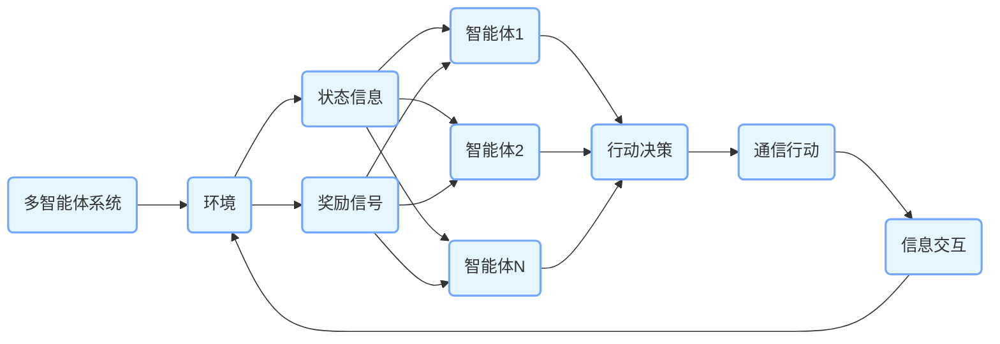

# 强化学习优化多智能体协同推理的通信效率

> 关键词：强化学习、多智能体协同推理、通信效率、智能体决策、信息交互

> 摘要：本文聚焦于利用强化学习优化多智能体协同推理的通信效率这一核心问题。首先介绍了相关背景，包括研究目的、预期读者、文档结构和术语表。接着阐述了核心概念，分析了强化学习与多智能体协同推理之间的联系，并给出了相应的架构示意图和流程图。详细讲解了核心算法原理，通过Python代码进行了具体操作步骤的展示。同时，给出了相关的数学模型和公式，并举例说明。在项目实战部分，提供了开发环境搭建、源代码实现和解读。还探讨了实际应用场景，推荐了学习资源、开发工具框架和相关论文著作。最后对未来发展趋势与挑战进行了总结，并提供了常见问题解答和扩展阅读参考资料，旨在为研究和应用多智能体协同推理通信效率优化的人员提供全面的技术指导。

## 1. 背景介绍 
### 1.1 目的和范围
在当今复杂的分布式系统和人工智能应用场景中，多智能体协同推理技术扮演着至关重要的角色。多个智能体通过协作完成复杂任务，然而，通信开销往往成为制约系统性能和效率的关键因素。本研究的目的在于探索如何利用强化学习算法优化多智能体协同推理过程中的通信效率，减少不必要的信息传输，提高系统整体性能。

研究范围涵盖了强化学习在多智能体系统中的基本原理、算法设计与实现，以及在不同应用场景下的性能评估和优化策略。我们将深入分析智能体之间的通信机制、信息交互模式，以及如何通过强化学习调整智能体的决策，以达到通信效率的最大化。

### 1.2 预期读者
本文预期读者包括计算机科学、人工智能、控制理论等相关领域的研究人员和学者，他们对多智能体系统和强化学习有一定的了解，希望深入探索如何利用强化学习解决多智能体协同推理中的通信效率问题。同时，也适合从事智能机器人、自动驾驶、分布式计算等实际应用开发的工程师和技术人员，他们可以从中获取优化系统性能的实用方法和技术思路。

### 1.3 文档结构概述
本文将按照以下结构进行组织：
- 核心概念与联系：介绍强化学习和多智能体协同推理的基本概念，分析它们之间的内在联系，并给出相应的架构示意图和流程图。
- 核心算法原理 & 具体操作步骤：详细阐述用于优化通信效率的强化学习算法原理，通过Python代码展示具体的操作步骤。
- 数学模型和公式 & 详细讲解 & 举例说明：建立数学模型，给出相关公式，并通过具体例子说明模型的应用。
- 项目实战：代码实际案例和详细解释说明：提供一个实际的项目案例，包括开发环境搭建、源代码实现和详细解读。
- 实际应用场景：探讨强化学习优化多智能体协同推理通信效率在不同领域的实际应用场景。
- 工具和资源推荐：推荐学习资源、开发工具框架和相关论文著作。
- 总结：未来发展趋势与挑战：总结研究成果，分析未来发展趋势和面临的挑战。
- 附录：常见问题与解答：解答读者在阅读过程中可能遇到的常见问题。
- 扩展阅读 & 参考资料：提供扩展阅读的建议和相关参考资料。

### 1.4 术语表
#### 1.4.1 核心术语定义
- **强化学习（Reinforcement Learning）**：一种机器学习方法，智能体通过与环境进行交互，根据环境反馈的奖励信号来学习最优的行为策略，以最大化长期累积奖励。
- **多智能体协同推理（Multi - Agent Collaborative Inference）**：多个智能体通过协作完成推理任务，每个智能体可以根据自身的局部信息和与其他智能体的交互信息做出决策。
- **通信效率（Communication Efficiency）**：衡量多智能体系统中信息传输的有效性和经济性，通常用通信带宽利用率、通信延迟等指标来表示。
- **智能体（Agent）**：具有自主决策能力的实体，可以感知环境信息，并根据一定的策略做出行动。

#### 1.4.2 相关概念解释
- **策略（Policy）**：智能体根据当前状态选择行动的规则，在强化学习中，策略通常用一个函数来表示。
- **状态（State）**：描述智能体所处环境的信息集合，包括智能体自身的状态和环境的状态。
- **奖励（Reward）**：环境根据智能体的行动给出的反馈信号，用于指导智能体学习最优策略。

#### 1.4.3 缩略词列表
- **RL**：Reinforcement Learning（强化学习）
- **MACI**：Multi - Agent Collaborative Inference（多智能体协同推理）

## 2. 核心概念与联系 

### 2.1 强化学习原理
强化学习的核心思想是智能体在环境中不断尝试不同的行动，根据环境反馈的奖励信号来调整自己的行为策略，以最大化长期累积奖励。智能体的学习过程可以看作是一个马尔可夫决策过程（MDP），其由以下几个要素组成：
- **状态空间（State Space）**：用 $\mathcal{S}$ 表示，包含了智能体可能处于的所有状态。
- **行动空间（Action Space）**：用 $\mathcal{A}$ 表示，包含了智能体可以采取的所有行动。
- **转移概率（Transition Probability）**：用 $P(s_{t + 1}|s_t, a_t)$ 表示，描述了在状态 $s_t$ 下采取行动 $a_t$ 后转移到状态 $s_{t + 1}$ 的概率。
- **奖励函数（Reward Function）**：用 $R(s_t, a_t, s_{t + 1})$ 表示，给出了在状态 $s_t$ 下采取行动 $a_t$ 并转移到状态 $s_{t + 1}$ 时获得的奖励。
- **策略（Policy）**：用 $\pi(a|s)$ 表示，定义了在状态 $s$ 下选择行动 $a$ 的概率。

智能体的目标是找到一个最优策略 $\pi^*$，使得长期累积奖励 $G_t=\sum_{k = 0}^{\infty}\gamma^kR(s_{t + k}, a_{t + k}, s_{t + k+1})$ 最大化，其中 $\gamma\in[0, 1]$ 是折扣因子，用于权衡当前奖励和未来奖励的重要性。

### 2.2 多智能体协同推理原理
多智能体协同推理中，多个智能体分布在不同的位置，每个智能体具有一定的局部信息和推理能力。智能体之间通过通信进行信息交互，共同完成一个复杂的推理任务。例如，在一个分布式传感器网络中，每个传感器节点可以看作一个智能体，它们通过交换数据来推断环境的整体状态。

多智能体协同推理的关键在于如何有效地协调智能体之间的通信和决策，以提高推理的准确性和效率。传统的方法往往采用固定的通信策略，即智能体按照预设的规则定期交换信息，这种方法可能会导致不必要的通信开销。

### 2.3 强化学习与多智能体协同推理的联系
强化学习可以为多智能体协同推理提供一种自适应的通信策略优化方法。通过将多智能体协同推理问题建模为一个多智能体强化学习问题，每个智能体可以根据自身的局部状态和其他智能体的部分信息，利用强化学习算法学习最优的通信决策策略。例如，智能体可以根据当前的任务需求、通信成本和其他智能体的状态，决定是否与其他智能体进行通信以及传输哪些信息，从而减少不必要的通信开销，提高通信效率。

### 2.4 架构示意图
以下是一个简化的强化学习优化多智能体协同推理通信效率的架构示意图：



在这个架构中，多智能体系统与环境进行交互，智能体感知环境的状态信息，根据强化学习算法做出行动决策，决定是否进行通信以及通信的内容。通信行动导致智能体之间的信息交互，进而影响环境状态，环境根据智能体的行动给出奖励信号，智能体根据奖励信号更新自己的策略。

## 3. 核心算法原理 & 具体操作步骤 

### 3.1 核心算法原理
为了优化多智能体协同推理的通信效率，我们可以采用深度强化学习算法，如深度Q网络（Deep Q - Network, DQN）。DQN的核心思想是使用一个深度神经网络来近似Q值函数 $Q(s, a)$，Q值函数表示在状态 $s$ 下采取行动 $a$ 的预期累积奖励。

在多智能体场景中，每个智能体都有自己的Q网络，智能体根据当前状态 $s$ 输入到Q网络中，得到每个行动 $a$ 的Q值，然后选择Q值最大的行动作为当前的决策。智能体在执行行动后，会得到环境反馈的奖励 $r$ 和下一个状态 $s'$，然后使用这些信息来更新Q网络的参数。

Q网络的更新目标是最小化损失函数 $L(\theta)= \mathbb{E}[(y - Q(s, a; \theta))^2]$，其中 $y = r+\gamma\max_{a'}Q(s', a'; \theta^-)$，$\theta$ 是当前Q网络的参数，$\theta^-$ 是目标Q网络的参数，目标Q网络的参数会定期从当前Q网络中复制。

### 3.2 具体操作步骤
以下是使用Python和PyTorch库实现基于DQN的多智能体通信决策的具体步骤：

```python
import torch
import torch.nn as nn
import torch.optim as optim
import numpy as np
import random

# 定义Q网络
class QNetwork(nn.Module):
    def __init__(self, state_size, action_size):
        super(QNetwork, self).__init__()
        self.fc1 = nn.Linear(state_size, 64)
        self.fc2 = nn.Linear(64, 64)
        self.fc3 = nn.Linear(64, action_size)

    def forward(self, x):
        x = torch.relu(self.fc1(x))
        x = torch.relu(self.fc2(x))
        x = self.fc3(x)
        return x

# 定义智能体类
class Agent:
    def __init__(self, state_size, action_size, learning_rate=0.001, gamma=0.99, epsilon=1.0, epsilon_decay=0.995, epsilon_min=0.01):
        self.state_size = state_size
        self.action_size = action_size
        self.learning_rate = learning_rate
        self.gamma = gamma
        self.epsilon = epsilon
        self.epsilon_decay = epsilon_decay
        self.epsilon_min = epsilon_min

        self.q_network = QNetwork(state_size, action_size)
        self.target_network = QNetwork(state_size, action_size)
        self.target_network.load_state_dict(self.q_network.state_dict())
        self.optimizer = optim.Adam(self.q_network.parameters(), lr=learning_rate)

    def act(self, state):
        if np.random.rand() <= self.epsilon:
            return random.randrange(self.action_size)
        state = torch.FloatTensor(state).unsqueeze(0)
        q_values = self.q_network(state)
        action = torch.argmax(q_values).item()
        return action

    def replay(self, state, action, reward, next_state, done):
        state = torch.FloatTensor(state).unsqueeze(0)
        next_state = torch.FloatTensor(next_state).unsqueeze(0)
        reward = torch.FloatTensor([reward])
        done = torch.FloatTensor([done])

        q_values = self.q_network(state)
        next_q_values = self.target_network(next_state)
        target_q_values = q_values.clone()

        target_q_values[0][action] = reward + (1 - done) * self.gamma * torch.max(next_q_values)

        loss = nn.MSELoss()(q_values, target_q_values)
        self.optimizer.zero_grad()
        loss.backward()
        self.optimizer.step()

        if self.epsilon > self.epsilon_min:
            self.epsilon *= self.epsilon_decay

    def update_target_network(self):
        self.target_network.load_state_dict(self.q_network.state_dict())

# 多智能体系统模拟
num_agents = 3
state_size = 10
action_size = 2  # 例如：通信或不通信

agents = [Agent(state_size, action_size) for _ in range(num_agents)]

# 模拟训练过程
num_episodes = 1000
for episode in range(num_episodes):
    states = [np.random.rand(state_size) for _ in range(num_agents)]
    done = False
    while not done:
        actions = [agent.act(state) for agent, state in zip(agents, states)]
        # 模拟环境反馈
        next_states = [np.random.rand(state_size) for _ in range(num_agents)]
        rewards = [random.random() for _ in range(num_agents)]
        for agent, state, action, reward, next_state in zip(agents, states, actions, rewards, next_states):
            agent.replay(state, action, reward, next_state, False)
        states = next_states

    if episode % 10 == 0:
        for agent in agents:
            agent.update_target_network()

```

### 3.3 代码解释
1. **QNetwork类**：定义了一个简单的三层全连接神经网络作为Q网络，用于近似Q值函数。
2. **Agent类**：
    - `__init__` 方法：初始化智能体的参数，包括状态空间大小、行动空间大小、学习率、折扣因子、探索率等，并创建Q网络和目标Q网络。
    - `act` 方法：根据当前状态选择行动，采用 $\epsilon$-贪心策略，以一定的概率随机选择行动，以探索新的策略。
    - `replay` 方法：使用经验回放机制更新Q网络的参数，计算损失函数并进行反向传播。
    - `update_target_network` 方法：定期更新目标Q网络的参数。
3. **多智能体系统模拟**：创建多个智能体，模拟训练过程，每个智能体根据当前状态选择行动，环境反馈下一个状态和奖励，智能体根据奖励更新自己的Q网络。

## 4. 数学模型和公式 & 详细讲解 & 举例说明 

### 4.1 马尔可夫决策过程（MDP）模型
在多智能体协同推理中，每个智能体的决策过程可以看作是一个马尔可夫决策过程（MDP）。对于一个智能体 $i$，其MDP可以表示为一个五元组 $\langle\mathcal{S}_i, \mathcal{A}_i, P_i, R_i, \gamma\rangle$，其中：
- $\mathcal{S}_i$ 是智能体 $i$ 的状态空间，包含了智能体 $i$ 可能处于的所有状态。
- $\mathcal{A}_i$ 是智能体 $i$ 的行动空间，包含了智能体 $i$ 可以采取的所有行动。
- $P_i(s_{i,t + 1}|s_{i,t}, a_{i,t})$ 是转移概率，表示在状态 $s_{i,t}$ 下采取行动 $a_{i,t}$ 后转移到状态 $s_{i,t + 1}$ 的概率。
- $R_i(s_{i,t}, a_{i,t}, s_{i,t + 1})$ 是奖励函数，表示在状态 $s_{i,t}$ 下采取行动 $a_{i,t}$ 并转移到状态 $s_{i,t + 1}$ 时智能体 $i$ 获得的奖励。
- $\gamma\in[0, 1]$ 是折扣因子，用于权衡当前奖励和未来奖励的重要性。

### 4.2 Q值函数和最优策略
Q值函数 $Q_i^{\pi}(s_i, a_i)$ 表示在策略 $\pi$ 下，智能体 $i$ 在状态 $s_i$ 下采取行动 $a_i$ 后获得的预期累积奖励，定义为：
$$Q_i^{\pi}(s_i, a_i)=\mathbb{E}_{\pi}\left[\sum_{k = 0}^{\infty}\gamma^kR_i(s_{i,t + k}, a_{i,t + k}, s_{i,t + k+1})\big|s_{i,t}=s_i, a_{i,t}=a_i\right]$$

最优Q值函数 $Q_i^*(s_i, a_i)$ 是所有策略中能获得的最大预期累积奖励，即：
$$Q_i^*(s_i, a_i)=\max_{\pi}Q_i^{\pi}(s_i, a_i)$$

最优策略 $\pi^*$ 可以通过最优Q值函数得到，即：
$$\pi^*(a_i|s_i)=\begin{cases}1, & \text{if } a_i=\arg\max_{a\in\mathcal{A}_i}Q_i^*(s_i, a)\\0, & \text{otherwise}\end{cases}$$

### 4.3 Bellman方程
Q值函数满足Bellman方程，对于最优Q值函数，有：
$$Q_i^*(s_i, a_i)=R_i(s_i, a_i)+\gamma\sum_{s_{i}'\in\mathcal{S}_i}P_i(s_{i}'|s_i, a_i)\max_{a_{i}'\in\mathcal{A}_i}Q_i^*(s_{i}', a_{i}')$$

### 4.4 举例说明
假设一个简单的多智能体场景，有两个智能体 $A$ 和 $B$，每个智能体的状态空间 $\mathcal{S}=\{s_1, s_2\}$，行动空间 $\mathcal{A}=\{a_1, a_2\}$。转移概率 $P$ 和奖励函数 $R$ 如下：

| $s$ | $a$ | $s'$ | $P(s'|s, a)$ | $R(s, a, s')$ |
|---|---|---|---|---|
| $s_1$ | $a_1$ | $s_1$ | 0.8 | 1 |
| $s_1$ | $a_1$ | $s_2$ | 0.2 | 0 |
| $s_1$ | $a_2$ | $s_1$ | 0.3 | 0 |
| $s_1$ | $a_2$ | $s_2$ | 0.7 | 2 |
| $s_2$ | $a_1$ | $s_1$ | 0.6 | 3 |
| $s_2$ | $a_1$ | $s_2$ | 0.4 | 0 |
| $s_2$ | $a_2$ | $s_1$ | 0.1 | 0 |
| $s_2$ | $a_2$ | $s_2$ | 0.9 | 1 |

假设折扣因子 $\gamma = 0.9$，我们可以使用迭代的方法求解最优Q值函数。

初始化 $Q^0(s, a)=0$ 对于所有 $s\in\mathcal{S}$ 和 $a\in\mathcal{A}$。

第一次迭代：
对于状态 $s_1$ 和行动 $a_1$：
$$Q^1(s_1, a_1)=R(s_1, a_1)+\gamma\left[P(s_1|s_1, a_1)\max_{a'}Q^0(s_1, a')+P(s_2|s_1, a_1)\max_{a'}Q^0(s_2, a')\right]$$
$$=1 + 0.9\times(0.8\times0 + 0.2\times0)=1$$

对于状态 $s_1$ 和行动 $a_2$：
$$Q^1(s_1, a_2)=R(s_1, a_2)+\gamma\left[P(s_1|s_1, a_2)\max_{a'}Q^0(s_1, a')+P(s_2|s_1, a_2)\max_{a'}Q^0(s_2, a')\right]$$
$$=2 + 0.9\times(0.3\times0 + 0.7\times0)=2$$

以此类推，不断迭代直到 $Q$ 值收敛，最终得到最优Q值函数，进而得到最优策略。

## 5. 项目实战：代码实际案例和详细解释说明 

### 5.1  开发环境搭建
为了实现强化学习优化多智能体协同推理的通信效率项目，我们需要搭建以下开发环境：
1. **Python环境**：建议使用Python 3.7及以上版本，可以从Python官方网站（https://www.python.org/downloads/）下载安装。
2. **深度学习框架**：使用PyTorch作为深度学习框架，可以通过以下命令安装：
```bash
pip install torch torchvision
```
3. **其他依赖库**：安装NumPy、Matplotlib等常用库，用于数据处理和可视化：
```bash
pip install numpy matplotlib
```

### 5.2  源代码详细实现和代码解读
以下是一个更加完整的项目代码示例，模拟了一个简单的多智能体协同推理场景，智能体需要根据环境状态决定是否与其他智能体进行通信：

```python
import torch
import torch.nn as nn
import torch.optim as optim
import numpy as np
import random
import matplotlib.pyplot as plt

# 定义Q网络
class QNetwork(nn.Module):
    def __init__(self, state_size, action_size):
        super(QNetwork, self).__init__()
        self.fc1 = nn.Linear(state_size, 64)
        self.fc2 = nn.Linear(64, 64)
        self.fc3 = nn.Linear(64, action_size)

    def forward(self, x):
        x = torch.relu(self.fc1(x))
        x = torch.relu(self.fc2(x))
        x = self.fc3(x)
        return x

# 定义智能体类
class Agent:
    def __init__(self, state_size, action_size, learning_rate=0.001, gamma=0.99, epsilon=1.0, epsilon_decay=0.995, epsilon_min=0.01):
        self.state_size = state_size
        self.action_size = action_size
        self.learning_rate = learning_rate
        self.gamma = gamma
        self.epsilon = epsilon
        self.epsilon_decay = epsilon_decay
        self.epsilon_min = epsilon_min

        self.q_network = QNetwork(state_size, action_size)
        self.target_network = QNetwork(state_size, action_size)
        self.target_network.load_state_dict(self.q_network.state_dict())
        self.optimizer = optim.Adam(self.q_network.parameters(), lr=learning_rate)

    def act(self, state):
        if np.random.rand() <= self.epsilon:
            return random.randrange(self.action_size)
        state = torch.FloatTensor(state).unsqueeze(0)
        q_values = self.q_network(state)
        action = torch.argmax(q_values).item()
        return action

    def replay(self, state, action, reward, next_state, done):
        state = torch.FloatTensor(state).unsqueeze(0)
        next_state = torch.FloatTensor(next_state).unsqueeze(0)
        reward = torch.FloatTensor([reward])
        done = torch.FloatTensor([done])

        q_values = self.q_network(state)
        next_q_values = self.target_network(next_state)
        target_q_values = q_values.clone()

        target_q_values[0][action] = reward + (1 - done) * self.gamma * torch.max(next_q_values)

        loss = nn.MSELoss()(q_values, target_q_values)
        self.optimizer.zero_grad()
        loss.backward()
        self.optimizer.step()

        if self.epsilon > self.epsilon_min:
            self.epsilon *= self.epsilon_decay

    def update_target_network(self):
        self.target_network.load_state_dict(self.q_network.state_dict())

# 定义环境类
class Environment:
    def __init__(self, num_agents, state_size):
        self.num_agents = num_agents
        self.state_size = state_size

    def reset(self):
        states = [np.random.rand(self.state_size) for _ in range(self.num_agents)]
        return states

    def step(self, actions):
        next_states = [np.random.rand(self.state_size) for _ in range(self.num_agents)]
        rewards = []
        for action in actions:
            if action == 1:  # 通信
                reward = -1  # 通信成本
            else:
                reward = 0
            rewards.append(reward)
        done = False
        return next_states, rewards, done

# 主训练函数
def train(num_agents, state_size, action_size, num_episodes):
    agents = [Agent(state_size, action_size) for _ in range(num_agents)]
    env = Environment(num_agents, state_size)

    total_rewards = []
    for episode in range(num_episodes):
        states = env.reset()
        episode_reward = 0
        done = False
        while not done:
            actions = [agent.act(state) for agent, state in zip(agents, states)]
            next_states, rewards, done = env.step(actions)
            for agent, state, action, reward, next_state in zip(agents, states, actions, rewards, next_states):
                agent.replay(state, action, reward, next_state, done)
            states = next_states
            episode_reward += sum(rewards)

        if episode % 10 == 0:
            for agent in agents:
                agent.update_target_network()

        total_rewards.append(episode_reward)
        print(f"Episode {episode}: Total Reward = {episode_reward}")

    # 绘制奖励曲线
    plt.plot(total_rewards)
    plt.xlabel('Episode')
    plt.ylabel('Total Reward')
    plt.title('Training Rewards')
    plt.show()

if __name__ == "__main__":
    num_agents = 3
    state_size = 10
    action_size = 2
    num_episodes = 1000
    train(num_agents, state_size, action_size, num_episodes)

```

### 5.3  代码解读与分析
1. **QNetwork类**：定义了一个三层全连接神经网络作为Q网络，用于近似Q值函数。输入是智能体的状态，输出是每个行动的Q值。
2. **Agent类**：
    - `__init__` 方法：初始化智能体的参数，包括状态空间大小、行动空间大小、学习率、折扣因子、探索率等，并创建Q网络和目标Q网络。
    - `act` 方法：根据当前状态选择行动，采用 $\epsilon$-贪心策略，以一定的概率随机选择行动，以探索新的策略。
    - `replay` 方法：使用经验回放机制更新Q网络的参数，计算损失函数并进行反向传播。
    - `update_target_network` 方法：定期更新目标Q网络的参数。
3. **Environment类**：
    - `reset` 方法：重置环境，返回每个智能体的初始状态。
    - `step` 方法：根据智能体的行动更新环境状态，返回下一个状态、奖励和是否结束的标志。在这个示例中，通信行动会产生一个负奖励，表示通信成本。
4. **train函数**：
    - 初始化多个智能体和环境。
    - 进行多轮训练，每一轮训练中，智能体根据当前状态选择行动，环境根据行动返回下一个状态和奖励，智能体根据奖励更新自己的Q网络。
    - 定期更新目标Q网络的参数。
    - 记录每一轮训练的总奖励，并绘制奖励曲线。

通过分析奖励曲线，我们可以观察到智能体的学习过程。如果奖励曲线逐渐上升，说明智能体在不断学习，逐渐找到最优的通信策略，减少通信成本，提高通信效率。

## 6. 实际应用场景 
### 6.1 分布式传感器网络
在分布式传感器网络中，多个传感器节点分布在不同的位置，用于监测环境参数。每个传感器节点可以看作一个智能体，它们需要通过通信来协同完成数据融合和环境状态推断任务。然而，传感器节点的通信能力和能量有限，过多的通信会导致能量消耗过快和网络拥塞。利用强化学习优化通信效率，可以使传感器节点根据当前的环境状态和任务需求，动态地决定是否与其他节点进行通信以及传输哪些数据，从而减少通信开销，延长传感器网络的使用寿命。

### 6.2 智能交通系统
在智能交通系统中，多个车辆、交通信号灯和路边基础设施可以看作智能体，它们需要通过通信来协同完成交通流量优化、避免碰撞等任务。例如，车辆之间可以交换速度、位置等信息，以实现自动驾驶和协同驾驶。然而，大量的通信会占用大量的频谱资源，导致通信延迟增加。通过强化学习，智能体可以学习到最优的通信策略，根据交通状况和自身状态，合理地选择通信对象和通信频率，提高通信效率，改善交通系统的性能。

### 6.3 多机器人协作
在多机器人协作场景中，多个机器人需要共同完成一个复杂的任务，如搜索救援、货物搬运等。机器人之间需要通过通信来协调行动、共享信息。但是，机器人的通信范围和带宽有限，过多的通信会影响机器人的行动效率。利用强化学习优化通信效率，机器人可以根据任务需求和自身状态，决定是否与其他机器人进行通信以及通信的内容，从而减少不必要的通信，提高协作效率。

### 6.4 云计算和边缘计算
在云计算和边缘计算环境中，多个边缘节点和云服务器可以看作智能体，它们需要通过通信来协同完成数据处理和计算任务。边缘节点可以在本地进行部分计算，然后将必要的结果传输到云服务器进行进一步处理。然而，数据传输会产生通信延迟和带宽消耗。通过强化学习，边缘节点可以根据自身的计算能力、数据量和网络状况，决定是否将数据传输到云服务器，以及传输哪些数据，从而优化通信效率，提高系统的响应速度。

## 7. 工具和资源推荐
### 7.1 学习资源推荐
#### 7.1.1 书籍推荐
- 《Reinforcement Learning: An Introduction》（第二版）：由Richard S. Sutton和Andrew G. Barto所著，是强化学习领域的经典教材，全面介绍了强化学习的基本概念、算法和应用。
- 《Multi - Agent Systems: Algorithmic, Game - Theoretic, and Logical Foundations》：介绍了多智能体系统的基本理论和算法，包括博弈论、逻辑推理等方面的内容，对于理解多智能体协同推理有很大帮助。

#### 7.1.2 在线课程
- Coursera上的“Reinforcement Learning Specialization”：由DeepMind的研究人员授课，提供了强化学习的深入讲解和实践项目。
- edX上的“Multi - Agent Artificial Intelligence”：介绍了多智能体系统的理论和应用，包括多智能体强化学习等方面的内容。

#### 7.1.3 技术博客和网站
- OpenAI Blog：OpenAI发布的技术博客，包含了许多关于强化学习和人工智能的最新研究成果和应用案例。
- Medium上的“Towards Data Science”：有很多关于强化学习和多智能体系统的技术文章和教程。

### 7.2 开发工具框架推荐
#### 7.2.1 IDE和编辑器
- PyCharm：一款专业的Python集成开发环境，提供了丰富的代码编辑、调试和分析功能，适合开发强化学习和多智能体系统的项目。
- Jupyter Notebook：一种交互式的开发环境，可以方便地进行代码编写、数据可视化和实验记录，对于快速验证算法和模型非常有用。

#### 7.2.2 调试和性能分析工具
- TensorBoard：一个用于可视化深度学习模型训练过程的工具，可以帮助我们观察损失函数、奖励曲线等指标的变化，调试模型。
- Py-Spy：一个用于分析Python程序性能的工具，可以帮助我们找出程序中的性能瓶颈。

#### 7.2.3 相关框架和库
- PyTorch：一个开源的深度学习框架，提供了丰富的神经网络模块和优化算法，方便我们实现强化学习算法。
- Stable Baselines3：一个基于PyTorch的强化学习库，提供了多种预实现的强化学习算法和环境，方便我们进行快速开发和实验。

### 7.3 相关论文著作推荐
#### 7.3.1 经典论文
- “Playing Atari with Deep Reinforcement Learning”：首次提出了深度Q网络（DQN）算法，开创了深度强化学习的先河。
- “Multi - Agent Actor - Critic for Mixed Cooperative - Competitive Environments”：提出了多智能体演员 - 评论家（MADDPG）算法，用于解决多智能体协作和竞争环境下的强化学习问题。

#### 7.3.2 最新研究成果
- 关注NeurIPS、ICML、AAAI等顶级人工智能会议的论文，这些会议收录了强化学习和多智能体系统领域的最新研究成果。
- 关注《Journal of Artificial Intelligence Research》《Artificial Intelligence》等学术期刊，这些期刊发表了许多高质量的研究论文。

#### 7.3.3 应用案例分析
- 可以参考一些实际应用案例的论文，如在自动驾驶、机器人、物联网等领域的应用，了解强化学习优化多智能体协同推理通信效率的实际应用效果和挑战。

## 8. 总结：未来发展趋势与挑战
### 8.1 未来发展趋势
- **深度强化学习与多智能体系统的融合**：随着深度学习技术的不断发展，深度强化学习将在多智能体协同推理中发挥越来越重要的作用。通过结合深度神经网络强大的特征提取和表示能力，智能体可以更好地处理复杂的环境信息，学习到更有效的通信策略。
- **多智能体系统的可扩展性和分布式学习**：未来的多智能体系统将越来越庞大和复杂，需要解决可扩展性和分布式学习的问题。研究人员将探索如何设计高效的分布式强化学习算法，使智能体能够在大规模网络中进行协同学习，提高系统的整体性能。
- **与其他技术的融合**：强化学习优化多智能体协同推理通信效率将与其他技术，如区块链、边缘计算、物联网等进行融合。例如，利用区块链技术可以保证智能体之间通信的安全性和可信度，边缘计算可以减少数据传输延迟，提高通信效率。

### 8.2 挑战
- **通信复杂性和不确定性**：在实际应用中，多智能体系统的通信环境往往非常复杂，存在通信延迟、丢包、干扰等问题，这些不确定性会影响智能体的决策和学习效果。如何在复杂的通信环境中设计鲁棒的强化学习算法是一个挑战。
- **智能体之间的协作和竞争关系**：在多智能体系统中，智能体之间可能存在协作和竞争关系，如何平衡这种关系，使智能体能够在追求自身利益的同时，实现整个系统的最优性能，是一个需要解决的问题。
- **可解释性和安全性**：强化学习算法通常是基于黑盒模型，其决策过程难以解释。在一些安全关键的应用场景中，如自动驾驶、医疗诊断等，需要保证智能体的决策具有可解释性和安全性。如何设计可解释的强化学习算法，提高系统的安全性，是未来的研究方向之一。

## 9. 附录：常见问题与解答
### 9.1 强化学习算法在多智能体系统中收敛速度慢怎么办？
- 可以尝试调整强化学习算法的参数，如学习率、折扣因子、探索率等。较小的学习率可以使算法收敛更稳定，但可能会导致收敛速度变慢；较大的学习率可能会使算法更快地收敛，但可能会导致不稳定。
- 采用经验回放机制，通过存储和随机采样历史经验数据，增加数据的多样性，提高学习效率。
- 定期更新目标网络的参数，减少目标值的波动，提高算法的稳定性和收敛速度。

### 9.2 如何处理多智能体系统中的通信延迟和丢包问题？
- 可以在强化学习算法中引入通信延迟和丢包的模型，使智能体能够学习到在这种情况下的最优通信策略。例如，在奖励函数中考虑通信延迟和丢包的影响，对延迟和丢包较大的通信行动给予较低的奖励。
- 采用重传机制和纠错编码技术，提高通信的可靠性。智能体可以根据通信状态动态调整重传策略，减少丢包对系统性能的影响。

### 9.3 如何评估强化学习优化多智能体协同推理通信效率的效果？
- 可以使用通信带宽利用率、通信延迟、推理准确性等指标来评估通信效率。例如，比较优化前后的通信带宽利用率，观察是否有所提高；比较推理结果的准确性，判断是否在减少通信开销的同时保证了推理质量。
- 进行模拟实验和实际应用测试，在不同的场景下评估算法的性能。通过多次实验和对比，分析算法的有效性和稳定性。

## 10. 扩展阅读 & 参考资料
### 10.1 扩展阅读
- 可以深入学习博弈论、信息论等相关理论知识，这些理论对于理解多智能体系统和通信效率优化有很大帮助。
- 关注强化学习在其他领域的应用，如金融、医疗、能源等，了解不同领域的应用场景和挑战。

### 10.2 参考资料
- Richard S. Sutton和Andrew G. Barto的《Reinforcement Learning: An Introduction》（第二版）
- OpenAI的相关技术报告和论文
- Coursera和edX上的相关在线课程资料
- 顶级人工智能会议（NeurIPS、ICML、AAAI等）和学术期刊（《Journal of Artificial Intelligence Research》《Artificial Intelligence》等）上的论文

通过以上的文章，我们全面地探讨了强化学习优化多智能体协同推理的通信效率问题，从理论基础到实际应用，从算法实现到工具资源推荐，为读者提供了一个系统的学习和研究框架。希望本文能够对相关领域的研究人员和技术人员有所帮助。