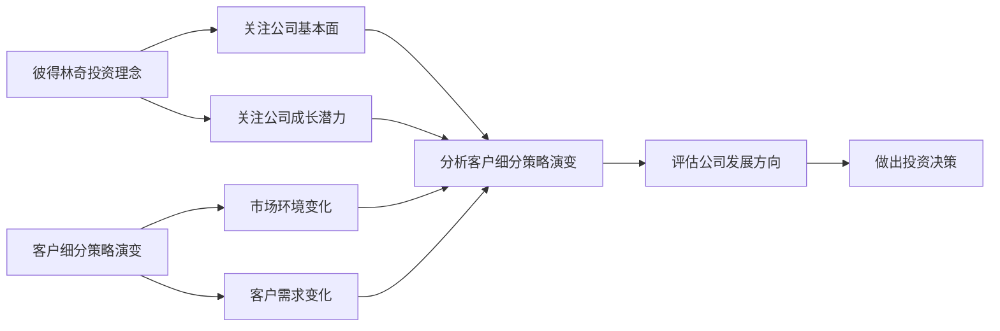

# 彼得林奇如何分析公司的客户细分策略演变

> 关键词：彼得林奇、客户细分策略、公司分析、策略演变、投资分析

> 摘要：本文旨在深入探讨彼得林奇分析公司客户细分策略演变的方法和思路。通过研究彼得林奇的投资理念和分析方式，我们可以了解到如何从客户细分的角度洞察公司的发展变化，这对于投资者评估公司价值以及公司自身优化市场策略都具有重要意义。文章将从背景介绍出发，阐述相关核心概念，剖析彼得林奇分析的核心算法原理及步骤，结合数学模型进行说明，通过项目实战案例详细解读，探讨实际应用场景，推荐相关工具和资源，最后总结未来发展趋势与挑战，并对常见问题进行解答。

## 1. 背景介绍 
### 1.1 目的和范围
本文的目的在于全面解析彼得林奇分析公司客户细分策略演变的方法和逻辑，为投资者和企业管理者提供有价值的参考。范围涵盖彼得林奇的投资理论基础、客户细分策略的基本概念、分析过程中的具体方法和工具，以及通过实际案例展示如何运用这些方法进行公司分析。

### 1.2 预期读者
本文预期读者包括对投资领域感兴趣的个人投资者、专业投资机构的分析师、企业的市场营销和战略规划人员，以及相关领域的研究学者。这些读者可以从不同角度获取有价值的信息，投资者可以借此提升投资决策的准确性，企业人员可以优化客户细分策略，学者可以深入研究相关理论。

### 1.3 文档结构概述
本文首先介绍彼得林奇分析公司客户细分策略演变的背景知识，包括目的、预期读者和文档结构。接着阐述核心概念，包括彼得林奇的投资理念和客户细分策略的相关原理，并通过流程图展示其联系。然后详细讲解核心算法原理和具体操作步骤，结合数学模型进行说明。通过项目实战案例，包括开发环境搭建、源代码实现和代码解读，深入剖析实际应用。探讨实际应用场景，推荐相关工具和资源，包括学习资源、开发工具框架和相关论文著作。最后总结未来发展趋势与挑战，解答常见问题，并提供扩展阅读和参考资料。

### 1.4 术语表
#### 1.4.1 核心术语定义
- **彼得林奇投资理念**：彼得林奇是著名的投资大师，他的投资理念强调从日常生活中发现投资机会，关注公司的基本面和成长潜力，注重实地调研和对公司业务的深入了解。
- **客户细分策略**：企业根据客户的不同特征，如需求、行为、偏好等，将市场划分为不同的客户群体，以便更精准地满足客户需求，提高市场竞争力。
- **客户细分策略演变**：指公司在不同的发展阶段，根据市场环境、竞争态势和自身战略调整，对客户细分策略进行的动态变化和优化。

#### 1.4.2 相关概念解释
- **市场定位**：企业确定目标市场和产品或服务在目标市场中的位置，是客户细分策略的重要依据。
- **目标客户群体**：企业通过客户细分确定的重点关注和服务的客户群体，是企业资源投入的主要方向。
- **客户价值**：客户为企业带来的经济价值和非经济价值，包括购买行为、口碑传播等，是评估客户细分策略效果的重要指标。

#### 1.4.3 缩略词列表
- **SWOT**：Strengths（优势）、Weaknesses（劣势）、Opportunities（机会）、Threats（威胁）的缩写，是一种常用的战略分析工具。

## 2. 核心概念与联系 
### 2.1 彼得林奇的投资理念
彼得林奇强调投资于自己了解的公司，他认为普通投资者可以通过日常生活中的观察和体验，发现具有潜力的公司。他注重公司的基本面，包括财务状况、业务模式、竞争优势等，同时关注公司的成长潜力和市场前景。

### 2.2 客户细分策略的原理
客户细分策略基于市场的异质性，即不同客户的需求、行为和偏好存在差异。通过对客户进行细分，企业可以更好地了解不同客户群体的特点，制定针对性的营销策略，提高客户满意度和忠诚度，从而提升市场竞争力。

### 2.3 彼得林奇投资理念与客户细分策略演变的联系
彼得林奇的投资理念强调对公司的深入了解，而客户细分策略演变反映了公司对市场和客户的认知变化。通过分析公司的客户细分策略演变，投资者可以更好地理解公司的战略调整和发展方向，评估公司的成长潜力和市场竞争力，从而做出更准确的投资决策。

### 2.4 文本示意图
彼得林奇的投资理念关注公司的基本面和成长潜力，客户细分策略演变是公司根据市场和客户变化进行的战略调整。两者的联系在于，通过分析客户细分策略演变，投资者可以更深入地了解公司的发展动态，为投资决策提供依据。

### 2.5 Mermaid 流程图


## 3. 核心算法原理 & 具体操作步骤 
### 3.1 核心算法原理
彼得林奇分析公司客户细分策略演变的核心算法原理是通过对公司的历史数据、市场调研和实地考察等信息进行综合分析，找出公司客户细分策略的变化规律和影响因素，从而评估公司的发展趋势和投资价值。

### 3.2 具体操作步骤
#### 3.2.1 收集数据
收集公司的历史财务报表、市场调研报告、产品销售数据、客户反馈等信息，了解公司的业务发展历程和客户群体特征。

```python
import pandas as pd

# 读取财务报表数据
financial_data = pd.read_csv('financial_statements.csv')

# 读取市场调研报告数据
market_research_data = pd.read_csv('market_research_report.csv')

# 读取产品销售数据
sales_data = pd.read_csv('product_sales_data.csv')

# 读取客户反馈数据
customer_feedback_data = pd.read_csv('customer_feedback_data.csv')
```

#### 3.2.2 分析客户细分策略的变化
对比不同时期的客户群体特征，找出客户细分策略的变化点和变化趋势。可以从客户的年龄、性别、地域、消费习惯等方面进行分析。

```python
# 提取不同时期的客户数据
customer_data_2019 = financial_data[financial_data['year'] == 2019][['customer_age', 'customer_gender', 'customer_region']]
customer_data_2020 = financial_data[financial_data['year'] == 2020][['customer_age', 'customer_gender', 'customer_region']]

# 分析客户年龄分布的变化
age_distribution_2019 = customer_data_2019['customer_age'].value_counts()
age_distribution_2020 = customer_data_2020['customer_age'].value_counts()

print('2019年客户年龄分布：', age_distribution_2019)
print('2020年客户年龄分布：', age_distribution_2020)
```

#### 3.2.3 找出影响客户细分策略演变的因素
分析市场环境、竞争态势、技术发展等因素对公司客户细分策略的影响。可以通过SWOT分析等工具进行评估。

```python
# SWOT分析示例
strengths = ['品牌知名度高', '产品质量好']
weaknesses = ['市场份额较小', '营销渠道单一']
opportunities = ['新兴市场需求增长', '技术创新带来机遇']
threats = ['竞争对手压力大', '政策法规变化']

print('优势：', strengths)
print('劣势：', weaknesses)
print('机会：', opportunities)
print('威胁：', threats)
```

#### 3.2.4 评估公司的发展趋势和投资价值
根据客户细分策略演变的分析结果，结合公司的财务状况和市场前景，评估公司的发展趋势和投资价值。

```python
# 假设根据分析结果给出投资建议
if '新兴市场需求增长' in opportunities and '品牌知名度高' in strengths:
    print('该公司具有较好的发展前景，建议投资')
else:
    print('该公司发展面临一定挑战，需谨慎投资')
```

## 4. 数学模型和公式 & 详细讲解 & 举例说明 
### 4.1 客户价值评估模型
客户价值是评估客户细分策略效果的重要指标，常用的客户价值评估模型包括RFM模型（Recency、Frequency、Monetary）。

#### 4.1.1 公式
$RFM = R \times w_R + F \times w_F + M \times w_M$

其中，$R$ 表示最近一次购买时间，$F$ 表示购买频率，$M$ 表示购买金额，$w_R$、$w_F$、$w_M$ 分别表示 $R$、$F$、$M$ 的权重。

#### 4.1.2 详细讲解
- **最近一次购买时间（R）**：反映客户的活跃度，最近购买的客户更有可能再次购买。
- **购买频率（F）**：反映客户的忠诚度，购买频率高的客户对公司的产品或服务更认可。
- **购买金额（M）**：反映客户的消费能力，购买金额高的客户为公司带来的利润更多。

#### 4.1.3 举例说明
假设某公司的客户数据如下：

| 客户ID | 最近一次购买时间（天） | 购买频率（次/年） | 购买金额（元） |
| ---- | ---- | ---- | ---- |
| 1 | 30 | 10 | 5000 |
| 2 | 60 | 5 | 3000 |
| 3 | 90 | 3 | 2000 |

假设 $w_R = 0.3$，$w_F = 0.3$，$w_M = 0.4$，则客户1的RFM值为：

$RFM_1 = 30 \times 0.3 + 10 \times 0.3 + 5000 \times 0.4 = 9 + 3 + 2000 = 2012$

同理，可以计算出客户2和客户3的RFM值，根据RFM值对客户进行细分，以便制定针对性的营销策略。

### 4.2 市场份额预测模型
市场份额是评估公司市场竞争力的重要指标，常用的市场份额预测模型包括线性回归模型。

#### 4.2.1 公式
$\hat{y} = \beta_0 + \beta_1 x_1 + \beta_2 x_2 + \cdots + \beta_n x_n$

其中，$\hat{y}$ 表示市场份额预测值，$\beta_0$ 为截距，$\beta_1, \beta_2, \cdots, \beta_n$ 为回归系数，$x_1, x_2, \cdots, x_n$ 为影响市场份额的因素，如产品价格、广告投入、竞争对手情况等。

#### 4.2.2 详细讲解
线性回归模型通过对历史数据的分析，找出影响市场份额的因素和市场份额之间的线性关系，从而进行市场份额的预测。

#### 4.2.3 举例说明
假设某公司的市场份额与产品价格和广告投入有关，历史数据如下：

| 年份 | 产品价格（元） | 广告投入（万元） | 市场份额（%） |
| ---- | ---- | ---- | ---- |
| 2018 | 100 | 50 | 10 |
| 2019 | 110 | 60 | 12 |
| 2020 | 120 | 70 | 15 |

使用Python的 `sklearn` 库进行线性回归分析：

```python
import numpy as np
from sklearn.linear_model import LinearRegression

# 提取特征和目标变量
X = np.array([[100, 50], [110, 60], [120, 70]])
y = np.array([10, 12, 15])

# 训练线性回归模型
model = LinearRegression()
model.fit(X, y)

# 预测市场份额
new_X = np.array([[130, 80]])
predicted_market_share = model.predict(new_X)

print('预测的市场份额：', predicted_market_share)
```

## 5. 项目实战：代码实际案例和详细解释说明 
### 5.1  开发环境搭建
#### 5.1.1 安装Python
可以从Python官方网站（https://www.python.org/downloads/）下载并安装Python 3.x 版本。

#### 5.1.2 安装必要的库
使用 `pip` 命令安装 `pandas`、`numpy`、`sklearn` 等必要的库。

```sh
pip install pandas numpy sklearn
```

### 5.2  源代码详细实现和代码解读
#### 5.2.1 数据预处理
```python
import pandas as pd

# 读取数据
data = pd.read_csv('customer_data.csv')

# 处理缺失值
data = data.dropna()

# 提取特征和目标变量
X = data[['customer_age', 'customer_gender', 'customer_region']]
y = data['customer_value']

print('数据预处理完成')
```

**代码解读**：首先使用 `pandas` 库读取客户数据文件，然后使用 `dropna()` 方法处理缺失值，最后提取特征和目标变量。

#### 5.2.2 客户细分
```python
from sklearn.cluster import KMeans

# 使用KMeans算法进行客户细分
kmeans = KMeans(n_clusters=3, random_state=42)
kmeans.fit(X)

# 获取客户细分结果
labels = kmeans.labels_

print('客户细分完成')
```

**代码解读**：使用 `sklearn` 库中的 `KMeans` 算法进行客户细分，将客户分为3个群体，然后获取每个客户的细分标签。

#### 5.2.3 分析客户细分结果
```python
# 将细分标签添加到原始数据中
data['cluster'] = labels

# 分析每个客户群体的特征
cluster_0 = data[data['cluster'] == 0]
cluster_1 = data[data['cluster'] == 1]
cluster_2 = data[data['cluster'] == 2]

print('客户群体0的平均年龄：', cluster_0['customer_age'].mean())
print('客户群体1的平均年龄：', cluster_1['customer_age'].mean())
print('客户群体2的平均年龄：', cluster_2['customer_age'].mean())
```

**代码解读**：将细分标签添加到原始数据中，然后分别提取每个客户群体的数据，分析每个客户群体的平均年龄等特征。

### 5.3  代码解读与分析
通过上述代码，我们完成了客户数据的预处理、客户细分和客户细分结果的分析。数据预处理确保了数据的质量，客户细分使用KMeans算法将客户分为不同的群体，客户细分结果的分析帮助我们了解每个客户群体的特征，为制定针对性的营销策略提供依据。

## 6. 实际应用场景 
### 6.1 投资决策
投资者可以通过分析公司的客户细分策略演变，了解公司的市场定位和发展方向，评估公司的成长潜力和市场竞争力，从而做出更准确的投资决策。例如，如果公司的客户细分策略从专注于高端客户向中低端客户拓展，可能意味着公司在扩大市场份额，但也可能面临竞争加剧的风险，投资者需要综合考虑这些因素。

### 6.2 企业战略规划
企业管理者可以通过分析客户细分策略演变，了解市场和客户的变化趋势，调整企业的战略规划。例如，如果市场上年轻客户群体的需求增长迅速，企业可以调整客户细分策略，加大对年轻客户群体的市场投入，推出适合年轻客户的产品和服务。

### 6.3 市场营销策略制定
市场营销人员可以根据客户细分策略演变，制定针对性的市场营销策略。例如，对于不同的客户群体，可以采用不同的广告宣传方式、促销活动和定价策略，提高市场营销的效果。

## 7. 工具和资源推荐
### 7.1 学习资源推荐
#### 7.1.1 书籍推荐
- 《彼得林奇的成功投资》：彼得林奇的经典著作，详细阐述了他的投资理念和方法。
- 《市场营销管理》：菲利普·科特勒的经典教材，系统介绍了市场营销的理论和实践。
- 《客户关系管理》：全面介绍了客户关系管理的概念、方法和技术。

#### 7.1.2 在线课程
- Coursera上的“市场营销原理”课程：由知名教授授课，讲解市场营销的基本原理和方法。
- edX上的“投资学基础”课程：系统介绍投资学的基本概念和分析方法。
- Udemy上的“客户细分与营销策略”课程：深入讲解客户细分的方法和营销策略的制定。

#### 7.1.3 技术博客和网站
- 雪球网：提供丰富的投资资讯和分析文章，是投资者交流和学习的平台。
- 营销智库网：专注于市场营销领域的研究和分享，提供最新的市场营销理论和案例。
- 客户世界网：关注客户关系管理和客户体验，提供相关的研究报告和行业动态。

### 7.2 开发工具框架推荐
#### 7.2.1 IDE和编辑器
- PyCharm：功能强大的Python集成开发环境，提供代码编辑、调试、版本控制等功能。
- Jupyter Notebook：交互式的开发环境，适合进行数据探索和分析。
- Visual Studio Code：轻量级的代码编辑器，支持多种编程语言和插件扩展。

#### 7.2.2 调试和性能分析工具
- pdb：Python自带的调试工具，用于调试Python代码。
- cProfile：Python的性能分析工具，用于分析代码的性能瓶颈。
- Py-Spy：用于实时分析Python代码的性能，找出性能热点。

#### 7.2.3 相关框架和库
- pandas：用于数据处理和分析的Python库，提供了丰富的数据结构和数据操作方法。
- numpy：用于科学计算的Python库，提供了高效的数组操作和数学函数。
- sklearn：用于机器学习的Python库，提供了各种机器学习算法和工具。

### 7.3 相关论文著作推荐
#### 7.3.1 经典论文
- “Market Segmentation: Conceptual and Empirical Foundations”：详细阐述了市场细分的概念和理论基础。
- “Customer Value: The Next Source for Competitive Advantage”：探讨了客户价值的概念和提升客户价值的方法。
- “The Impact of Market Segmentation on Firm Performance”：研究了市场细分对企业绩效的影响。

#### 7.3.2 最新研究成果
- 关注顶级学术期刊如《Journal of Marketing》、《Marketing Science》等，了解市场细分和客户关系管理领域的最新研究成果。

#### 7.3.3 应用案例分析
- 分析知名企业的客户细分策略和市场营销案例，如苹果公司、亚马逊公司等，学习它们的成功经验和实践方法。

## 8. 总结：未来发展趋势与挑战
### 8.1 未来发展趋势
- **数字化和智能化**：随着信息技术的发展，客户细分将越来越依赖于大数据和人工智能技术，实现更精准的客户画像和个性化的营销策略。
- **跨行业融合**：不同行业之间的界限将越来越模糊，客户细分策略需要考虑跨行业的客户需求和行为，实现更全面的市场覆盖。
- **客户体验至上**：客户体验将成为企业竞争的关键因素，客户细分策略需要更加关注客户的情感需求和体验感受，提供更优质的产品和服务。

### 8.2 挑战
- **数据隐私和安全**：客户细分需要收集和分析大量的客户数据，如何保护客户的隐私和数据安全是一个重要的挑战。
- **技术更新换代快**：信息技术发展迅速，企业需要不断更新和升级客户细分的技术和工具，以适应市场的变化。
- **市场竞争激烈**：客户细分策略越来越受到企业的重视，市场竞争将更加激烈，企业需要不断创新和优化客户细分策略，以提高市场竞争力。

## 9. 附录：常见问题与解答
### 9.1 如何确定客户细分的维度？
客户细分的维度可以根据企业的业务特点和市场需求来确定，常见的维度包括客户的年龄、性别、地域、消费习惯、收入水平等。可以通过市场调研和数据分析来找出对企业业务影响较大的维度。

### 9.2 客户细分策略是否需要定期调整？
是的，客户细分策略需要定期调整。市场环境和客户需求是不断变化的，企业需要根据市场变化及时调整客户细分策略，以确保策略的有效性和适应性。

### 9.3 如何评估客户细分策略的效果？
可以通过客户价值评估、市场份额变化、客户满意度等指标来评估客户细分策略的效果。如果客户价值提高、市场份额扩大、客户满意度提升，说明客户细分策略是有效的。

## 10. 扩展阅读 & 参考资料
### 10.1 扩展阅读
- 《创新者的窘境》：探讨了企业在创新和变革过程中面临的挑战和机遇。
- 《竞争战略》：迈克尔·波特的经典著作，系统介绍了企业竞争战略的理论和方法。
- 《长尾理论》：介绍了互联网时代的商业模式和市场趋势。

### 10.2 参考资料
- 彼得林奇的官方网站和相关访谈资料。
- 企业的年报、财务报表和市场调研报告。
- 相关学术期刊和研究报告。