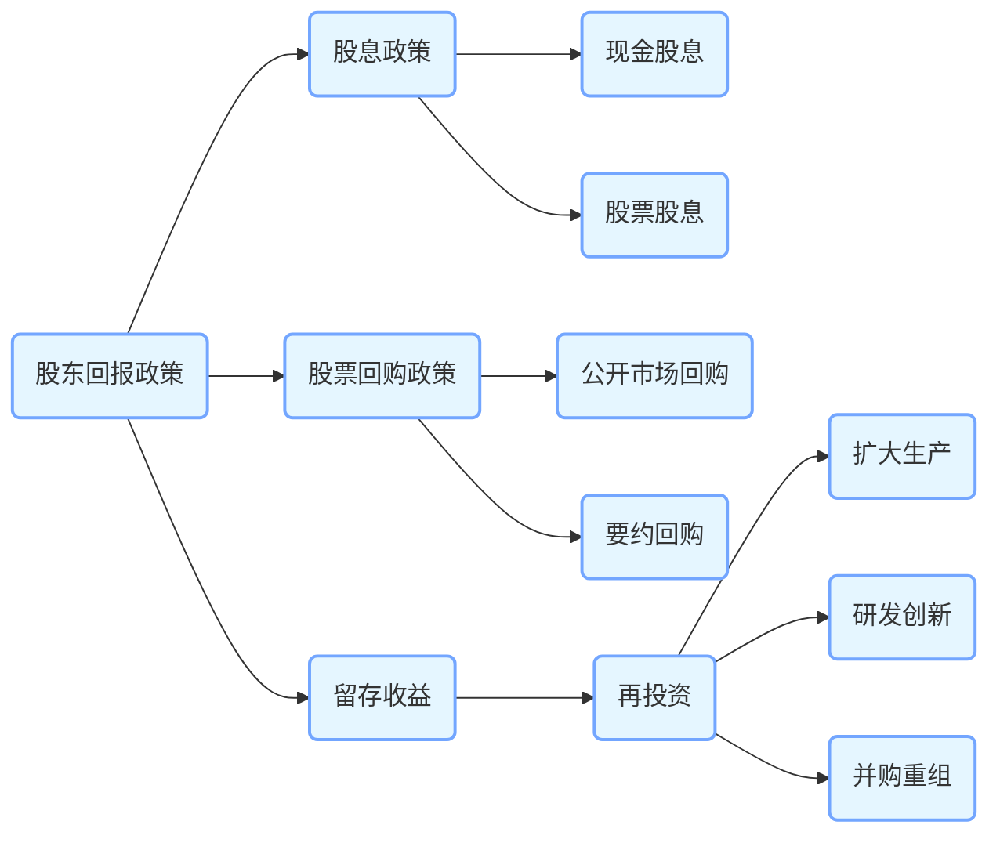

# 彼得林奇如何看待公司的股东回报政策

> 关键词：彼得林奇、股东回报政策、股息、股票回购、公司价值、投资策略、财务分析

> 摘要：本文深入探讨了投资大师彼得林奇对公司股东回报政策的观点。通过研究彼得林奇的投资理念和方法，阐述了股东回报政策在公司财务状况和投资价值评估中的重要性。详细分析了股息和股票回购等常见股东回报方式，以及它们与公司成长、盈利能力的关系。旨在帮助投资者理解彼得林奇的投资思路，学会通过评估公司的股东回报政策来做出更明智的投资决策。

## 1. 背景介绍 
### 1.1 目的和范围
本文的目的是全面剖析彼得林奇对于公司股东回报政策的看法。彼得林奇作为投资领域的传奇人物，其投资理念和策略对众多投资者产生了深远的影响。通过研究他对股东回报政策的观点，我们可以更好地理解如何评估公司的投资价值，以及如何在投资决策中运用相关的财务指标。

本文的范围涵盖了彼得林奇对各种股东回报方式的分析，包括股息政策、股票回购计划等。同时，还将探讨这些回报政策与公司的财务状况、成长潜力以及市场表现之间的关系。

### 1.2 预期读者
本文预期读者主要包括对投资领域感兴趣的个人投资者、金融从业者、财务分析师以及研究投资理论的学者。无论是初涉投资领域的新手，还是经验丰富的专业人士，都可以从本文中获得关于彼得林奇投资理念和股东回报政策分析的有价值信息。

### 1.3 文档结构概述
本文将按照以下结构展开：首先介绍相关的背景知识，包括彼得林奇的投资成就和股东回报政策的基本概念；接着深入探讨彼得林奇对核心概念的理解以及它们之间的联系；然后详细阐述相关的核心算法原理和具体操作步骤，用 Python 代码进行示例；再介绍相关的数学模型和公式，并结合实例进行讲解；之后通过项目实战展示如何在实际中应用这些理论；接着探讨股东回报政策的实际应用场景；推荐相关的工具和资源；最后总结未来发展趋势与挑战，提供常见问题解答和扩展阅读参考资料。

### 1.4 术语表
#### 1.4.1 核心术语定义
- **股东回报政策**：公司向股东分配利润的方式和策略，主要包括股息分配和股票回购等。
- **股息**：公司按照一定的比例向股东支付的利润，通常以现金或股票的形式发放。
- **股票回购**：公司从市场上购回自己发行的股票，减少流通股数量，从而提高每股价值。
- **留存收益**：公司在支付股息后剩余的利润，用于再投资和公司发展。

#### 1.4.2 相关概念解释
- **股息率**：股息与股票价格的比率，反映了股东从股息中获得的收益率。
- **市盈率**：股票价格与每股收益的比率，用于评估股票的估值水平。
- **市净率**：股票价格与每股净资产的比率，反映了股票的市场价值与账面价值的关系。

#### 1.4.3 缩略词列表
- **EPS**：Earnings Per Share，每股收益
- **P/E**：Price-to-Earnings Ratio，市盈率
- **P/B**：Price-to-Book Ratio，市净率

## 2. 核心概念与联系 

### 核心概念原理
#### 股息政策
股息是公司向股东分配利润的一种方式。公司通过定期或不定期地向股东支付股息，回报股东的投资。股息政策的制定通常受到公司盈利状况、现金流、发展战略等因素的影响。

稳定的股息政策可以吸引长期投资者，因为股息收入为投资者提供了稳定的现金流。同时，股息的增长也可以反映公司的盈利能力和成长潜力。例如，一家公司如果能够持续提高股息支付水平，说明其经营状况良好，有足够的利润来回报股东。

#### 股票回购政策
股票回购是公司从市场上购回自己发行的股票。公司进行股票回购的原因有很多，例如提高每股收益、增强股东信心、调整股权结构等。

当公司进行股票回购时，流通股数量减少，每股收益相应增加。这会使股票的估值提高，对股价产生积极的影响。此外，股票回购还可以向市场传递公司管理层对公司未来发展的信心，吸引更多的投资者。

#### 留存收益
留存收益是公司在支付股息后剩余的利润。公司可以将留存收益用于再投资，例如扩大生产规模、研发新产品、进行并购等。留存收益的合理运用可以促进公司的成长和发展，为股东创造更大的价值。

### 架构的文本示意图
```plaintext
股东回报政策
|-- 股息政策
|   |-- 现金股息
|   |-- 股票股息
|-- 股票回购政策
|   |-- 公开市场回购
|   |-- 要约回购
|-- 留存收益
    |-- 再投资
        |-- 扩大生产
        |-- 研发创新
        |-- 并购重组
```

### Mermaid 流程图


## 3. 核心算法原理 & 具体操作步骤 

### 股息率计算
股息率是衡量股息回报的重要指标，其计算公式为：
股息率 = 每股股息 / 股票价格 * 100%

以下是使用 Python 代码计算股息率的示例：
```python
def calculate_dividend_yield(dividend_per_share, stock_price):
    """
    计算股息率
    :param dividend_per_share: 每股股息
    :param stock_price: 股票价格
    :return: 股息率
    """
    if stock_price == 0:
        return 0
    return (dividend_per_share / stock_price) * 100

# 示例数据
dividend_per_share = 2
stock_price = 50

# 计算股息率
dividend_yield = calculate_dividend_yield(dividend_per_share, stock_price)
print(f"股息率: {dividend_yield}%")
```

### 每股收益（EPS）计算
每股收益是评估公司盈利能力的重要指标，其计算公式为：
每股收益 = 净利润 / 总股数

以下是使用 Python 代码计算每股收益的示例：
```python
def calculate_eps(net_income, total_shares):
    """
    计算每股收益
    :param net_income: 净利润
    :param total_shares: 总股数
    :return: 每股收益
    """
    if total_shares == 0:
        return 0
    return net_income / total_shares

# 示例数据
net_income = 1000000
total_shares = 500000

# 计算每股收益
eps = calculate_eps(net_income, total_shares)
print(f"每股收益: {eps}")
```

### 股票回购后每股收益变化计算
当公司进行股票回购时，每股收益会发生变化。假设公司回购了一定数量的股票，新的每股收益计算公式为：
新每股收益 = 净利润 / （总股数 - 回购股数）

以下是使用 Python 代码计算股票回购后每股收益变化的示例：
```python
def calculate_eps_after_repurchase(net_income, total_shares, repurchase_shares):
    """
    计算股票回购后每股收益
    :param net_income: 净利润
    :param total_shares: 总股数
    :param repurchase_shares: 回购股数
    :return: 股票回购后每股收益
    """
    new_total_shares = total_shares - repurchase_shares
    if new_total_shares == 0:
        return 0
    return net_income / new_total_shares

# 示例数据
net_income = 1000000
total_shares = 500000
repurchase_shares = 50000

# 计算股票回购后每股收益
eps_after_repurchase = calculate_eps_after_repurchase(net_income, total_shares, repurchase_shares)
print(f"股票回购后每股收益: {eps_after_repurchase}")
```

## 4. 数学模型和公式 & 详细讲解 & 举例说明 

### 股息增长模型
股息增长模型是一种用于评估股票价值的数学模型，其基本公式为：
$$V = \frac{D_1}{r - g}$$
其中：
- $V$ 表示股票的内在价值
- $D_1$ 表示下一期预计股息
- $r$ 表示投资者要求的回报率
- $g$ 表示股息的增长率

**详细讲解**：该模型假设股息以固定的增长率 $g$ 增长，投资者要求的回报率为 $r$。通过将未来的股息折现到当前，得到股票的内在价值 $V$。

**举例说明**：假设某公司下一期预计股息 $D_1$ 为 2 元，投资者要求的回报率 $r$ 为 10%，股息的增长率 $g$ 为 5%。则该股票的内在价值为：
$$V = \frac{2}{0.1 - 0.05} = 40$$（元）

### 市盈率模型
市盈率模型是一种常用的股票估值方法，其公式为：
$$P = EPS \times P/E$$
其中：
- $P$ 表示股票价格
- $EPS$ 表示每股收益
- $P/E$ 表示市盈率

**详细讲解**：该模型通过每股收益和市盈率来估算股票的价格。市盈率反映了市场对公司盈利的预期和估值水平。

**举例说明**：假设某公司的每股收益 $EPS$ 为 3 元，市场平均市盈率 $P/E$ 为 20 倍。则该股票的价格为：
$$P = 3 \times 20 = 60$$（元）

### 市净率模型
市净率模型是另一种股票估值方法，其公式为：
$$P = BVPS \times P/B$$
其中：
- $P$ 表示股票价格
- $BVPS$ 表示每股净资产
- $P/B$ 表示市净率

**详细讲解**：该模型通过每股净资产和市净率来估算股票的价格。市净率反映了市场对公司净资产的估值水平。

**举例说明**：假设某公司的每股净资产 $BVPS$ 为 10 元，市场平均市净率 $P/B$ 为 1.5 倍。则该股票的价格为：
$$P = 10 \times 1.5 = 15$$（元）

## 5. 项目实战：代码实际案例和详细解释说明 

### 5.1  开发环境搭建
- **Python 环境**：建议使用 Python 3.7 及以上版本。可以从 Python 官方网站（https://www.python.org/downloads/）下载并安装。
- **开发工具**：推荐使用 PyCharm 作为开发工具，它提供了丰富的代码编辑、调试和管理功能。可以从 JetBrains 官方网站（https://www.jetbrains.com/pycharm/download/）下载并安装。
- **相关库**：需要安装 `pandas`、`numpy` 等库，用于数据处理和分析。可以使用以下命令进行安装：
```sh
pip install pandas numpy
```

### 5.2  源代码详细实现和代码解读
以下是一个完整的 Python 代码示例，用于分析公司的股东回报政策和财务指标：
```python
import pandas as pd
import numpy as np

# 定义公司财务数据类
class CompanyFinancialData:
    def __init__(self, net_income, total_shares, dividend_per_share, stock_price, repurchase_shares):
        """
        初始化公司财务数据
        :param net_income: 净利润
        :param total_shares: 总股数
        :param dividend_per_share: 每股股息
        :param stock_price: 股票价格
        :param repurchase_shares: 回购股数
        """
        self.net_income = net_income
        self.total_shares = total_shares
        self.dividend_per_share = dividend_per_share
        self.stock_price = stock_price
        self.repurchase_shares = repurchase_shares

    def calculate_eps(self):
        """
        计算每股收益
        :return: 每股收益
        """
        if self.total_shares == 0:
            return 0
        return self.net_income / self.total_shares

    def calculate_dividend_yield(self):
        """
        计算股息率
        :return: 股息率
        """
        if self.stock_price == 0:
            return 0
        return (self.dividend_per_share / self.stock_price) * 100

    def calculate_eps_after_repurchase(self):
        """
        计算股票回购后每股收益
        :return: 股票回购后每股收益
        """
        new_total_shares = self.total_shares - self.repurchase_shares
        if new_total_shares == 0:
            return 0
        return self.net_income / new_total_shares

# 示例数据
net_income = 1000000
total_shares = 500000
dividend_per_share = 2
stock_price = 50
repurchase_shares = 50000

# 创建公司财务数据对象
company_data = CompanyFinancialData(net_income, total_shares, dividend_per_share, stock_price, repurchase_shares)

# 计算各项指标
eps = company_data.calculate_eps()
dividend_yield = company_data.calculate_dividend_yield()
eps_after_repurchase = company_data.calculate_eps_after_repurchase()

# 输出结果
print(f"每股收益: {eps}")
print(f"股息率: {dividend_yield}%")
print(f"股票回购后每股收益: {eps_after_repurchase}")
```

### 5.3  代码解读与分析
- **类定义**：`CompanyFinancialData` 类用于存储公司的财务数据，并提供计算每股收益、股息率和股票回购后每股收益的方法。
- **初始化方法**：`__init__` 方法用于初始化公司的财务数据，包括净利润、总股数、每股股息、股票价格和回购股数。
- **计算方法**：`calculate_eps` 方法用于计算每股收益，`calculate_dividend_yield` 方法用于计算股息率，`calculate_eps_after_repurchase` 方法用于计算股票回购后每股收益。
- **示例数据**：在代码中定义了示例数据，并创建了 `CompanyFinancialData` 对象。然后调用相应的方法计算各项指标，并输出结果。

通过这个代码示例，我们可以方便地分析公司的股东回报政策和财务指标，从而评估公司的投资价值。

## 6. 实际应用场景 
### 投资者决策
投资者在选择投资标的时，可以通过分析公司的股东回报政策来评估公司的投资价值。例如，稳定的股息政策可以为投资者提供稳定的现金流，而股票回购可以提高每股收益和股价。投资者可以根据自己的投资目标和风险偏好，选择具有良好股东回报政策的公司进行投资。

### 公司财务战略制定
公司管理层在制定财务战略时，需要考虑股东回报政策。合理的股东回报政策可以吸引投资者，提高公司的市场价值。例如，对于成熟的公司，可以适当提高股息支付水平，回报股东；对于成长型公司，可以将更多的利润用于再投资，促进公司的发展。

### 财务分析和评估
财务分析师在对公司进行分析和评估时，股东回报政策是重要的分析指标之一。通过分析股息率、股票回购情况等，可以了解公司的盈利能力、现金流状况和发展战略。这有助于财务分析师对公司的财务状况和投资价值做出准确的评估。

## 7. 工具和资源推荐
### 7.1 学习资源推荐
#### 7.1.1 书籍推荐
- 《彼得林奇的成功投资》：彼得林奇的经典著作，详细介绍了他的投资理念和方法，对理解股东回报政策有很大的帮助。
- 《聪明的投资者》：本杰明·格雷厄姆的著作，被誉为投资界的圣经，阐述了价值投资的理念和方法。
- 《财务报表分析》：介绍了财务报表的分析方法和技巧，有助于深入理解公司的财务状况和股东回报政策。

#### 7.1.2 在线课程
- Coursera 上的“投资学原理”课程：由知名大学教授授课，系统地介绍了投资学的基本原理和方法。
- Udemy 上的“财务分析实战”课程：通过实际案例，讲解财务分析的方法和技巧，包括对股东回报政策的分析。

#### 7.1.3 技术博客和网站
- 雪球网：提供丰富的股票投资资讯和分析，有很多投资者分享的关于股东回报政策的讨论和研究。
- 东方财富网：提供全面的金融信息和数据，包括公司的财务报表和股东回报数据。

### 7.2 开发工具框架推荐
#### 7.2.1 IDE和编辑器
- PyCharm：功能强大的 Python 开发工具，提供代码编辑、调试、版本控制等功能。
- Visual Studio Code：轻量级的代码编辑器，支持多种编程语言，有丰富的插件可以扩展功能。

#### 7.2.2 调试和性能分析工具
- Py-Spy：用于分析 Python 代码的性能，找出性能瓶颈。
- pdb：Python 自带的调试工具，用于调试 Python 代码。

#### 7.2.3 相关框架和库
- Pandas：用于数据处理和分析，提供了丰富的数据结构和操作方法。
- NumPy：用于科学计算，提供了高效的数组和矩阵运算功能。

### 7.3 相关论文著作推荐
#### 7.3.1 经典论文
- Miller, M. H., & Modigliani, F. (1961). Dividend policy, growth, and the valuation of shares. The Journal of Business, 34(4), 411-433. 该论文探讨了股息政策与公司价值的关系，是股息政策研究的经典文献。
- Fama, E. F., & French, K. R. (2001). Disappearing dividends: changing firm characteristics or lower propensity to pay? The Journal of Financial Economics, 60(1), 3-43. 该论文研究了股息支付率下降的原因，对理解公司的股息政策有重要意义。

#### 7.3.2 最新研究成果
- 关注顶级金融期刊，如 The Journal of Finance、The Review of Financial Studies 等，这些期刊发表了很多关于股东回报政策的最新研究成果。

#### 7.3.3 应用案例分析
- 可以参考一些知名投资机构的研究报告，了解他们对不同公司股东回报政策的分析和评估，以及相关的投资决策。

## 8. 总结：未来发展趋势与挑战
### 未来发展趋势
- **多元化股东回报方式**：未来公司可能会采用更加多元化的股东回报方式，除了传统的股息和股票回购外，还可能会探索其他形式，如实物分红、股权奖励等。
- **更加注重股东长期利益**：随着投资者对公司长期价值的关注增加，公司可能会更加注重股东的长期利益，制定更加稳定和可持续的股东回报政策。
- **数字化和智能化应用**：利用数字化和智能化技术，公司可以更加精准地分析股东需求，优化股东回报政策。例如，通过大数据分析了解股东的投资偏好和需求，为股东提供个性化的回报方案。

### 挑战
- **市场不确定性**：市场的不确定性会影响公司的盈利状况和现金流，从而给股东回报政策的制定带来挑战。例如，经济衰退、行业竞争加剧等因素可能导致公司利润下降，难以维持原有的股东回报水平。
- **股东利益冲突**：不同股东的利益诉求可能存在差异，如何平衡不同股东的利益是公司面临的一个挑战。例如，一些股东可能更注重短期股息回报，而另一些股东可能更关注公司的长期发展和资本增值。
- **法规和监管要求**：法规和监管要求的变化可能会对公司的股东回报政策产生影响。公司需要及时了解和遵守相关法规，确保股东回报政策的合规性。

## 9. 附录：常见问题与解答
### 问题 1：股息率越高越好吗？
不一定。股息率高可能表示公司有较高的股息支付水平，但也可能意味着公司的发展前景不佳，没有更好的投资机会，只能通过高股息来吸引投资者。因此，在评估股息率时，需要结合公司的财务状况、发展前景等因素进行综合分析。

### 问题 2：股票回购一定会提高股价吗？
不一定。股票回购可以减少流通股数量，提高每股收益，从而对股价产生积极影响。但股价的走势还受到市场整体环境、公司基本面等多种因素的影响。如果市场整体下跌或公司的经营状况不佳，股票回购可能无法有效提高股价。

### 问题 3：留存收益越多越好吗？
不一定。留存收益可以用于公司的再投资和发展，但如果留存收益过多，可能意味着公司没有合理利用资金，导致资金闲置。因此，公司需要根据自身的发展战略和资金需求，合理安排留存收益的使用。

## 10. 扩展阅读 & 参考资料
- 彼得林奇. 《彼得林奇的成功投资》. 机械工业出版社.
- 本杰明·格雷厄姆. 《聪明的投资者》. 人民邮电出版社.
- 相关金融期刊和学术论文，如 The Journal of Finance、The Review of Financial Studies 等.
- 雪球网、东方财富网等金融资讯网站的相关文章和讨论。