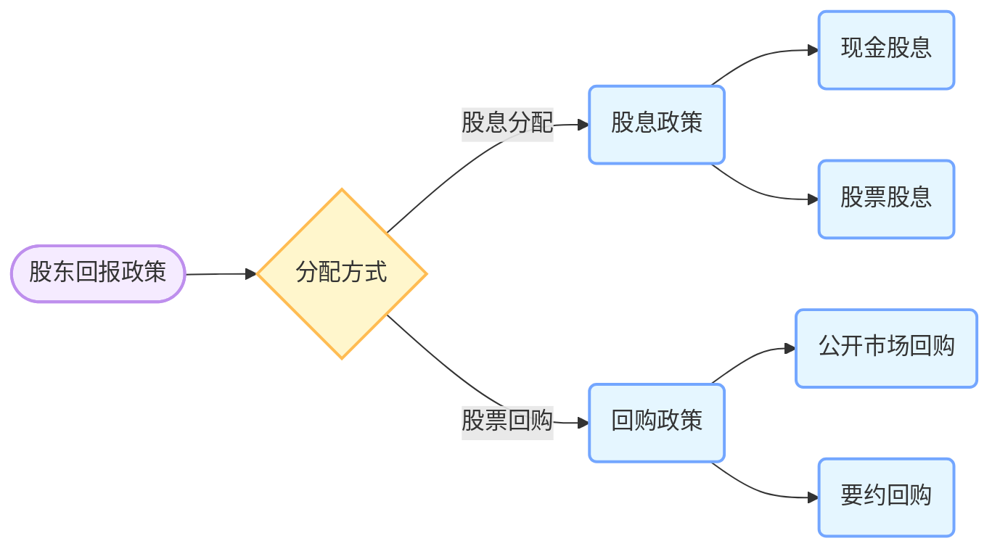

# 彼得林奇如何看待公司的股东回报政策演变

> 关键词：彼得林奇、股东回报政策、公司财务、股息政策、股票回购、政策演变

> 摘要：本文深入探讨彼得林奇对公司股东回报政策演变的观点。彼得林奇作为投资界的传奇人物，其对公司股东回报政策有着独特且深刻的见解。文章首先介绍了相关背景知识，包括研究目的、预期读者等。接着阐述了股东回报政策的核心概念及联系，分析了核心算法原理并给出操作步骤，还运用数学模型和公式进行详细讲解与举例。通过项目实战案例展示了不同股东回报政策在实际中的体现和影响。探讨了股东回报政策的实际应用场景，推荐了相关的学习资源、开发工具框架以及论文著作。最后总结了股东回报政策的未来发展趋势与挑战，并对常见问题进行了解答，同时提供了扩展阅读和参考资料。

## 1. 背景介绍 
### 1.1 目的和范围
本研究的目的是深入剖析彼得林奇对公司股东回报政策演变的看法。彼得林奇在投资领域取得了巨大的成功，他的投资理念和对公司各种财务政策的见解对投资者具有重要的指导意义。通过研究他对股东回报政策演变的观点，我们可以更好地理解公司在不同发展阶段如何制定合理的股东回报政策，以及这些政策对公司价值和股东利益的影响。研究范围涵盖了彼得林奇在其著作、演讲和访谈中涉及的关于股东回报政策的相关内容，同时结合不同行业、不同规模公司的实际案例进行分析。

### 1.2 预期读者
本文预期读者主要包括投资者，无论是个人投资者还是机构投资者，他们可以从彼得林奇的观点中获取投资决策的参考；公司财务管理人员，有助于他们制定更合理的股东回报政策；金融专业的学生和研究人员，为他们的学术研究和学习提供有价值的资料；以及对公司治理和股东权益感兴趣的普通读者。

### 1.3 文档结构概述
本文将按照以下结构展开：首先介绍核心概念与联系，明确股东回报政策的相关定义和原理，并通过示意图和流程图进行直观展示；接着阐述核心算法原理和具体操作步骤，结合 Python 代码进行详细说明；然后运用数学模型和公式对股东回报政策进行分析，并举例说明；通过项目实战案例，展示股东回报政策在实际中的应用和效果；探讨股东回报政策的实际应用场景；推荐相关的学习资源、开发工具框架和论文著作；总结股东回报政策的未来发展趋势与挑战；解答常见问题；最后提供扩展阅读和参考资料。

### 1.4 术语表
#### 1.4.1 核心术语定义
- **股东回报政策**：指公司将盈利分配给股东的方式和策略，主要包括股息分配和股票回购等。
- **股息**：公司按照一定比例向股东支付的利润，通常以现金形式发放。
- **股票回购**：公司从市场上购回自己发行的股票，减少流通股数量，从而提高每股价值。
- **留存收益**：公司在支付股息后剩余的利润，用于再投资和公司发展。

#### 1.4.2 相关概念解释
- **股息率**：股息与股票价格的比率，反映了股东从股息中获得的收益水平。
- **市盈率**：股票价格与每股收益的比率，用于衡量股票的估值水平。
- **自由现金流**：公司在满足所有运营和投资需求后剩余的现金流量，是衡量公司财务健康状况和可用于股东回报的重要指标。

#### 1.4.3 缩略词列表
- **EPS**：Earnings Per Share，每股收益
- **FCF**：Free Cash Flow，自由现金流
- **P/E**：Price-to-Earnings Ratio，市盈率

## 2. 核心概念与联系 
### 2.1 股东回报政策的基本概念
股东回报政策是公司财务管理的重要组成部分，它涉及到公司如何将盈利分配给股东。主要的股东回报方式有股息分配和股票回购。股息分配是公司定期向股东支付现金，作为对股东投资的回报。股票回购则是公司从市场上购买自己的股票，减少流通股数量，从而提高每股收益和股票价格。

### 2.2 核心概念原理和架构的文本示意图
```plaintext
股东回报政策
|-- 股息分配
|   |-- 现金股息
|   |-- 股票股息
|-- 股票回购
|   |-- 公开市场回购
|   |-- 要约回购
```

### 2.3 Mermaid 流程图


### 2.4 概念之间的联系
股息分配和股票回购并不是相互独立的，它们都受到公司盈利水平、财务状况、发展战略等因素的影响。公司在制定股东回报政策时，需要综合考虑这些因素，以实现股东利益最大化和公司长期发展的平衡。例如，当公司处于快速发展阶段，需要大量资金进行投资时，可能会减少股息分配，增加留存收益用于再投资；而当公司盈利稳定、现金流充裕时，可能会增加股息分配或进行股票回购，以回报股东。

## 3. 核心算法原理 & 具体操作步骤 
### 3.1 股息分配算法原理
股息分配的核心算法是根据公司的盈利情况和股息政策来确定每股股息的金额。一般来说，每股股息（DPS）可以通过以下公式计算：

```python
def calculate_dps(net_income, shares_outstanding, dividend_payout_ratio):
    """
    计算每股股息
    :param net_income: 公司净利润
    :param shares_outstanding: 流通股数量
    :param dividend_payout_ratio: 股息支付率
    :return: 每股股息
    """
    return (net_income * dividend_payout_ratio) / shares_outstanding

# 示例数据
net_income = 1000000  # 公司净利润为 100 万
shares_outstanding = 100000  # 流通股数量为 10 万股
dividend_payout_ratio = 0.5  # 股息支付率为 50%

dps = calculate_dps(net_income, shares_outstanding, dividend_payout_ratio)
print(f"每股股息: {dps}")
```

### 3.2 股票回购算法原理
股票回购的核心算法是根据公司用于回购的资金和股票市场价格来确定回购的股票数量。回购的股票数量（N）可以通过以下公式计算：

```python
def calculate_shares_repurchased(repo_funds, stock_price):
    """
    计算回购的股票数量
    :param repo_funds: 用于回购的资金
    :param stock_price: 股票市场价格
    :return: 回购的股票数量
    """
    return repo_funds / stock_price

# 示例数据
repo_funds = 500000  # 用于回购的资金为 50 万
stock_price = 50  # 股票市场价格为 50 元

shares_repurchased = calculate_shares_repurchased(repo_funds, stock_price)
print(f"回购的股票数量: {shares_repurchased}")
```

### 3.3 具体操作步骤
#### 3.3.1 股息分配操作步骤
1. **确定公司净利润**：通过公司的财务报表，计算出公司在一定时期内的净利润。
2. **制定股息政策**：根据公司的发展战略、财务状况和股东需求，确定股息支付率。
3. **计算每股股息**：使用上述公式计算每股股息。
4. **宣布股息分配方案**：公司董事会宣布股息分配方案，包括股息金额、登记日、除息日和支付日等信息。
5. **支付股息**：在支付日，公司将股息支付给登记在册的股东。

#### 3.3.2 股票回购操作步骤
1. **确定回购资金**：公司根据自身的财务状况和发展战略，确定用于股票回购的资金规模。
2. **选择回购方式**：根据市场情况和公司需求，选择公开市场回购或要约回购等方式。
3. **确定回购价格**：如果采用公开市场回购，公司需要根据市场价格进行操作；如果采用要约回购，公司需要确定要约价格。
4. **实施回购**：按照选定的回购方式和价格，在市场上进行股票回购操作。
5. **注销回购股票**：回购完成后，公司将回购的股票进行注销，减少流通股数量。

## 4. 数学模型和公式 & 详细讲解 & 举例说明 
### 4.1 股息分配的数学模型和公式
#### 4.1.1 股息支付率公式
股息支付率（Dividend Payout Ratio）是指公司股息分配金额与净利润的比率，计算公式为：

$$Dividend\ Payout\ Ratio = \frac{Dividends}{Net\ Income}$$

其中，$Dividends$ 表示公司股息分配金额，$Net\ Income$ 表示公司净利润。

#### 4.1.2 股息率公式
股息率（Dividend Yield）是指股息与股票价格的比率，计算公式为：

$$Dividend\ Yield = \frac{DPS}{Stock\ Price}$$

其中，$DPS$ 表示每股股息，$Stock\ Price$ 表示股票市场价格。

#### 4.1.3 举例说明
假设某公司 2023 年净利润为 2000 万元，流通股数量为 1000 万股，股息支付率为 40%，股票市场价格为 20 元。

首先，计算每股股息：

$DPS = \frac{Net\ Income \times Dividend\ Payout\ Ratio}{Shares\ Outstanding} = \frac{2000 \times 0.4}{1000} = 0.8$（元/股）

然后，计算股息率：

$Dividend\ Yield = \frac{DPS}{Stock\ Price} = \frac{0.8}{20} = 0.04 = 4\%$

### 4.2 股票回购的数学模型和公式
#### 4.2.1 回购后每股收益公式
股票回购会减少流通股数量，从而提高每股收益。回购后每股收益（EPS'）的计算公式为：

$$EPS' = \frac{Net\ Income}{Shares\ Outstanding - Shares\ Repurchased}$$

其中，$Net\ Income$ 表示公司净利润，$Shares\ Outstanding$ 表示回购前流通股数量，$Shares\ Repurchased$ 表示回购的股票数量。

#### 4.2.2 举例说明
假设某公司 2023 年净利润为 1500 万元，回购前流通股数量为 500 万股，用于回购的资金为 500 万元，股票市场价格为 25 元。

首先，计算回购的股票数量：

$Shares\ Repurchased = \frac{Repo\ Funds}{Stock\ Price} = \frac{500}{25} = 20$（万股）

然后，计算回购后每股收益：

$EPS' = \frac{Net\ Income}{Shares\ Outstanding - Shares\ Repurchased} = \frac{1500}{500 - 20} \approx 3.125$（元/股）

回购前每股收益为：

$EPS = \frac{Net\ Income}{Shares\ Outstanding} = \frac{1500}{500} = 3$（元/股）

可以看出，股票回购后每股收益有所提高。

## 5. 项目实战：代码实际案例和详细解释说明 
### 5.1  开发环境搭建
#### 5.1.1 安装 Python
首先，需要安装 Python 编程语言。可以从 Python 官方网站（https://www.python.org/downloads/）下载适合自己操作系统的 Python 版本，并按照安装向导进行安装。

#### 5.1.2 安装必要的库
为了进行数据分析和可视化，我们需要安装一些必要的 Python 库，如 Pandas、Numpy 和 Matplotlib。可以使用以下命令进行安装：

```bash
pip install pandas numpy matplotlib
```

### 5.2  源代码详细实现和代码解读
```python
import pandas as pd
import numpy as np
import matplotlib.pyplot as plt

# 模拟公司财务数据
years = np.arange(2018, 2024)
net_income = np.array([800, 900, 1000, 1100, 1200, 1300])  # 单位：万元
shares_outstanding = np.array([400, 400, 400, 380, 360, 340])  # 单位：万股
dividend_payout_ratio = np.array([0.3, 0.3, 0.3, 0.4, 0.4, 0.5])
repo_funds = np.array([0, 0, 0, 100, 200, 300])  # 单位：万元
stock_price = np.array([20, 22, 24, 26, 28, 30])  # 单位：元

# 创建 DataFrame
data = {
    'Year': years,
    'Net Income': net_income,
    'Shares Outstanding': shares_outstanding,
    'Dividend Payout Ratio': dividend_payout_ratio,
    'Repo Funds': repo_funds,
    'Stock Price': stock_price
}
df = pd.DataFrame(data)

# 计算每股股息
df['DPS'] = (df['Net Income'] * df['Dividend Payout Ratio']) / df['Shares Outstanding']

# 计算回购的股票数量
df['Shares Repurchased'] = df['Repo Funds'] / df['Stock Price']

# 计算回购后流通股数量
df['Shares Outstanding After Repo'] = df['Shares Outstanding'] - df['Shares Repurchased']

# 计算回购后每股收益
df['EPS After Repo'] = df['Net Income'] / df['Shares Outstanding After Repo']

# 计算股息率
df['Dividend Yield'] = df['DPS'] / df['Stock Price']

# 打印结果
print(df)

# 可视化分析
plt.figure(figsize=(12, 8))

plt.subplot(2, 2, 1)
plt.plot(df['Year'], df['DPS'], marker='o')
plt.title('Dividend Per Share Over Years')
plt.xlabel('Year')
plt.ylabel('Dividend Per Share (DPS)')

plt.subplot(2, 2, 2)
plt.plot(df['Year'], df['Dividend Yield'], marker='o')
plt.title('Dividend Yield Over Years')
plt.xlabel('Year')
plt.ylabel('Dividend Yield')

plt.subplot(2, 2, 3)
plt.plot(df['Year'], df['Shares Outstanding After Repo'], marker='o')
plt.title('Shares Outstanding After Repo Over Years')
plt.xlabel('Year')
plt.ylabel('Shares Outstanding After Repo')

plt.subplot(2, 2, 4)
plt.plot(df['Year'], df['EPS After Repo'], marker='o')
plt.title('EPS After Repo Over Years')
plt.xlabel('Year')
plt.ylabel('EPS After Repo')

plt.tight_layout()
plt.show()
```

### 5.3  代码解读与分析
#### 5.3.1 数据模拟
使用 `numpy` 数组模拟了公司从 2018 年到 2023 年的财务数据，包括净利润、流通股数量、股息支付率、用于回购的资金和股票市场价格。

#### 5.3.2 数据处理
使用 `pandas` 的 `DataFrame` 对数据进行存储和处理。计算了每股股息、回购的股票数量、回购后流通股数量、回购后每股收益和股息率等指标。

#### 5.3.3 可视化分析
使用 `matplotlib` 库绘制了四个子图，分别展示了每股股息、股息率、回购后流通股数量和回购后每股收益随时间的变化情况。通过可视化分析，可以直观地观察到公司股东回报政策的演变及其对公司财务指标的影响。

从代码运行结果可以看出，随着时间的推移，公司的股息支付率逐渐提高，同时进行了股票回购操作，导致流通股数量减少，每股收益和股息率有所提高。这反映了公司在不同发展阶段调整股东回报政策，以实现股东利益最大化的策略。

## 6. 实际应用场景 
### 6.1 成熟行业公司
在成熟行业中，公司的业务发展相对稳定，盈利水平较为可观。这些公司通常会采用较为稳定的股息分配政策，向股东提供持续的现金回报。例如，一些大型公用事业公司，如电力公司、水务公司等，它们的现金流稳定，会将一定比例的净利润以股息的形式分配给股东。同时，当公司有多余的现金时，也会进行适当的股票回购，以提高每股价值。

### 6.2 成长型行业公司
成长型行业的公司通常处于快速发展阶段，需要大量的资金进行研发、扩张和市场开拓。因此，这些公司可能会减少股息分配，将更多的利润用于再投资，以支持公司的快速增长。例如，科技行业的一些初创公司和新兴企业，它们更注重将资金投入到新产品研发和市场推广中，以获取更大的市场份额和未来的盈利潜力。然而，当公司发展到一定阶段，盈利稳定且现金流充裕时，也会逐渐开始考虑向股东提供回报，如增加股息分配或进行股票回购。

### 6.3 周期性行业公司
周期性行业的公司业绩受到宏观经济环境和行业周期的影响较大。在行业景气周期，公司盈利大幅增长，可能会增加股息分配或进行股票回购；而在行业不景气周期，公司盈利下降，可能会减少或暂停股息分配，甚至需要动用留存收益来维持运营。例如，钢铁、煤炭等行业的公司，其业绩与经济周期密切相关，股东回报政策也会随之波动。

### 6.4 重组和并购中的公司
在公司进行重组和并购时，股东回报政策也会发生相应的变化。如果公司通过并购实现了业务整合和协同效应，盈利水平提高，可能会调整股息政策或进行股票回购，以回报股东。相反，如果并购导致公司财务状况恶化，可能会减少股息分配或暂停股票回购，以保证公司的资金流动性和财务稳定。

## 7. 工具和资源推荐
### 7.1 学习资源推荐
#### 7.1.1 书籍推荐
- 《彼得林奇的成功投资》：彼得林奇的经典著作，详细阐述了他的投资理念和方法，包括如何分析公司财务报表、评估股东回报政策等。
- 《财务报表分析与证券定价》：这本书深入介绍了财务报表分析的方法和技巧，对于理解公司的股东回报政策和财务状况具有重要的参考价值。
- 《价值投资：从格雷厄姆到巴菲特》：系统介绍了价值投资的理论和实践，其中涉及到公司股东回报政策对股票价值的影响。

#### 7.1.2 在线课程
- Coursera 上的“Financial Markets”：由耶鲁大学教授罗伯特·席勒（Robert Shiller）主讲，课程涵盖了金融市场的各个方面，包括公司财务和股东回报政策。
- edX 上的“Corporate Finance”：该课程深入讲解了公司财务管理的原理和方法，对股东回报政策进行了详细的分析。

#### 7.1.3 技术博客和网站
- Seeking Alpha：一个提供金融分析和投资建议的网站，有很多关于公司股东回报政策的研究报告和分析文章。
- Motley Fool：提供股票投资、财经新闻和分析的网站，其博客文章中经常涉及到公司股东回报政策的讨论。

### 7.2 开发工具框架推荐
#### 7.2.1 IDE和编辑器
- PyCharm：一款专业的 Python 集成开发环境，具有强大的代码编辑、调试和分析功能，适合进行财务数据分析和算法实现。
- Jupyter Notebook：一个交互式的编程环境，支持 Python、R 等多种编程语言，方便进行数据探索、可视化和代码演示。

#### 7.2.2 调试和性能分析工具
- PDB：Python 自带的调试器，可以帮助开发者定位代码中的错误和问题。
- cProfile：Python 的性能分析工具，可以分析代码的运行时间和资源消耗情况，帮助优化代码性能。

#### 7.2.3 相关框架和库
- Pandas：一个强大的数据处理和分析库，提供了高效的数据结构和数据操作方法，适合处理公司财务数据。
- Numpy：Python 的数值计算库，提供了丰富的数学函数和数组操作功能，用于进行数学模型的实现和计算。
- Matplotlib：一个用于数据可视化的库，可以绘制各种类型的图表，帮助直观展示股东回报政策的分析结果。

### 7.3 相关论文著作推荐
#### 7.3.1 经典论文
- “Dividend Policy, Growth, and the Valuation of Shares” by Myron J. Gordon：该论文提出了股息增长模型，对股息政策和股票估值进行了深入的研究。
- “The Information Content of Dividends” by Eugene F. Fama and Harvey B. Miller：研究了股息分配对市场信息传递的影响。

#### 7.3.2 最新研究成果
- 关注《Journal of Financial Economics》《Review of Financial Studies》等顶级金融学术期刊，这些期刊上经常发表关于公司股东回报政策的最新研究成果。

#### 7.3.3 应用案例分析
- 可以查阅一些专业的金融研究报告和案例分析书籍，了解不同行业、不同公司的股东回报政策实践和效果，从中获取经验和启示。

## 8. 总结：未来发展趋势与挑战
### 8.1 未来发展趋势
#### 8.1.1 多元化的股东回报方式
未来，公司的股东回报政策可能会更加多元化。除了传统的股息分配和股票回购，公司可能会探索更多创新的回报方式，如实物分红、股票期权激励等。实物分红可以是公司的产品或服务，让股东直接受益于公司的经营成果；股票期权激励则可以将股东利益与公司管理层和员工的利益紧密结合，促进公司的长期发展。

#### 8.1.2 更加注重可持续性
随着社会对可持续发展的关注度不断提高，公司在制定股东回报政策时也会更加注重可持续性。这包括考虑环境、社会和治理（ESG）因素对公司长期价值的影响。例如，公司可能会将部分资金用于环保项目或社会责任活动，以提高公司的社会形象和声誉，从而间接提升股东价值。

#### 8.1.3 科技驱动的决策
随着人工智能、大数据和机器学习等技术的发展，公司在制定股东回报政策时将能够利用更丰富的数据和更先进的分析工具。通过对市场趋势、行业竞争、公司财务状况等多方面数据的分析，公司可以制定更加精准、科学的股东回报政策，提高决策的效率和质量。

### 8.2 挑战
#### 8.2.1 经济不确定性
全球经济环境的不确定性增加，如经济衰退、通货膨胀、汇率波动等，给公司的盈利和现金流带来了很大的压力。在这种情况下，公司难以制定稳定的股东回报政策，需要在满足股东回报需求和保证公司资金流动性之间进行艰难的平衡。

#### 8.2.2 股东利益冲突
不同类型的股东对股东回报政策的期望可能存在差异。一些短期投资者更关注股息分配和股票价格的短期波动，而长期投资者则更注重公司的长期发展和价值增长。公司在制定股东回报政策时，需要兼顾不同股东的利益，避免因利益冲突导致股东关系紧张。

#### 8.2.3 监管政策变化
政府和监管机构对公司股东回报政策的监管可能会发生变化。例如，为了防止公司过度分配利润导致资金短缺，监管机构可能会出台相关政策限制公司的股息分配和股票回购行为。公司需要密切关注监管政策的变化，及时调整股东回报政策，以确保合规经营。

## 9. 附录：常见问题与解答
### 9.1 为什么有些公司不分配股息？
一些公司不分配股息可能有以下原因：
- **发展需求**：公司处于快速发展阶段，需要大量资金进行研发、扩张和市场开拓，将利润用于再投资可以为公司带来更大的增长潜力。
- **财务状况不佳**：公司盈利不稳定或面临财务困境，没有足够的资金进行股息分配。
- **战略决策**：公司管理层认为将资金用于其他方面，如并购、偿还债务等，对公司的长期发展更有利。

### 9.2 股票回购对公司和股东有什么影响？
对公司的影响：
- **提高每股价值**：减少流通股数量，提高每股收益和每股净资产，从而提升股票价格。
- **优化资本结构**：通过回购股票，公司可以调整股权结构，提高财务杠杆的使用效率。
- **信号传递**：股票回购向市场传递了公司管理层对公司未来发展的信心，有助于提升市场对公司的认可度。

对股东的影响：
- **增加股东财富**：股票价格上涨和每股收益提高，使股东的财富增加。
- **税收优势**：与股息分配相比，股票回购在某些情况下可以为股东提供税收优势。

### 9.3 如何评估公司的股东回报政策是否合理？
可以从以下几个方面评估公司的股东回报政策是否合理：
- **盈利状况**：公司的盈利水平和稳定性是决定股东回报政策的基础。如果公司盈利稳定且增长，适当的股息分配和股票回购是合理的；如果公司盈利不佳，过度的回报可能会影响公司的发展。
- **财务状况**：关注公司的资产负债率、现金流状况等财务指标。如果公司财务状况良好，有足够的资金进行回报；如果公司负债过高或现金流紧张，可能需要谨慎考虑回报政策。
- **行业特点**：不同行业的公司具有不同的发展规律和资金需求。例如，成熟行业的公司通常更适合稳定的股息分配政策，而成长型行业的公司可能更注重再投资。
- **股东需求**：考虑不同股东的利益需求，如短期投资者和长期投资者对回报的期望不同。公司的股东回报政策应尽量满足大多数股东的需求。

## 10. 扩展阅读 & 参考资料
### 10.1 扩展阅读
- 《聪明的投资者》：本杰明·格雷厄姆（Benjamin Graham）的经典著作，深入探讨了价值投资的理念和方法，对理解公司的股东回报政策和股票投资具有重要的启示作用。
- 《金融炼金术》：乔治·索罗斯（George Soros）的著作，介绍了他的投资哲学和市场分析方法，有助于从更宏观的角度理解公司股东回报政策与市场环境的关系。

### 10.2 参考资料
- 彼得林奇的相关著作、演讲和访谈记录。
- 各大金融数据库，如 Bloomberg、Wind 等，提供了丰富的公司财务数据和市场信息。
- 专业的金融研究机构发布的研究报告和分析文章。