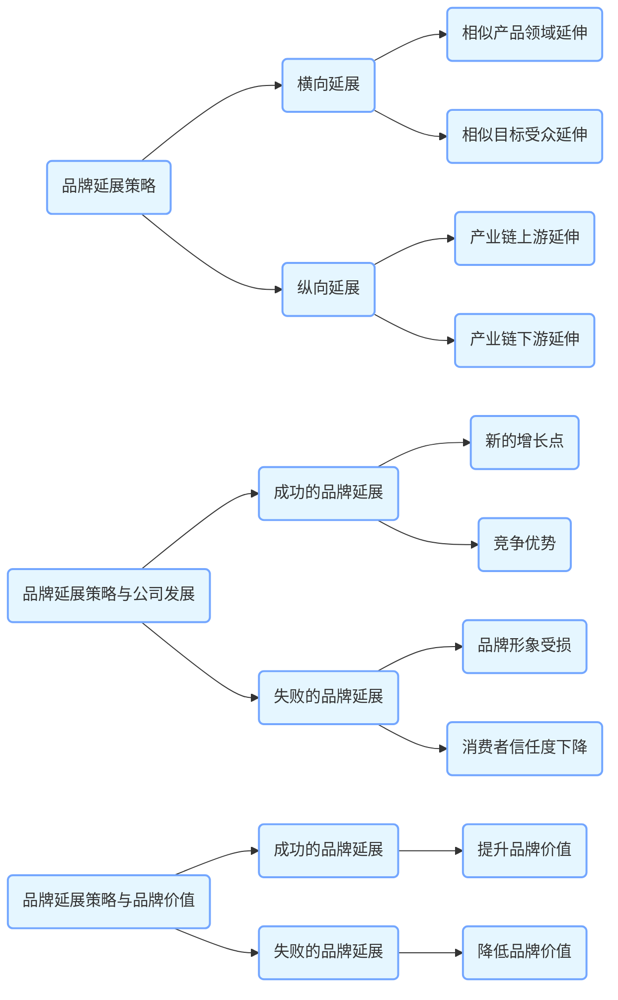

# 彼得林奇如何评估公司的品牌延展策略成功率

> 关键词：彼得林奇、品牌延展策略、成功率评估、公司评估、投资分析

> 摘要：本文聚焦于彼得林奇评估公司品牌延展策略成功率的方法。彼得林奇作为投资界的传奇人物，其投资理念和分析方法备受关注。品牌延展策略对于公司的发展至关重要，成功的品牌延展能为公司带来新的增长点和竞争优势，而失败的策略则可能导致资源浪费和品牌形象受损。通过深入研究彼得林奇的相关理论和实践案例，详细剖析其评估品牌延展策略成功率的要点和方法，旨在为投资者和企业管理者提供有价值的参考和指导，帮助他们更好地判断品牌延展策略的可行性和潜在价值。

## 1. 背景介绍 
### 1.1 目的和范围
本文的主要目的是深入探讨彼得林奇评估公司品牌延展策略成功率的方法和思路。彼得林奇在投资领域有着卓越的成就，他的投资决策往往基于对公司全面而深入的分析。品牌延展策略作为公司战略的重要组成部分，对公司的长期发展和市场价值有着重要影响。通过研究彼得林奇的评估方法，我们可以更好地理解如何判断一个品牌延展策略是否能够成功，从而为投资者提供更准确的投资决策依据，也为企业管理者在制定和实施品牌延展策略时提供参考。

本文的范围主要涵盖彼得林奇的投资思想和理论中与品牌延展策略评估相关的内容，同时结合实际的商业案例进行分析和说明。我们将探讨品牌延展策略的定义、重要性，以及彼得林奇在评估过程中所关注的关键因素和具体方法。

### 1.2 预期读者
本文的预期读者主要包括以下几类人群：
1. **投资者**：无论是个人投资者还是机构投资者，都希望通过了解彼得林奇的评估方法，更好地判断公司的投资价值，特别是在品牌延展策略方面的潜力，从而做出更明智的投资决策。
2. **企业管理者**：企业管理者需要制定和实施有效的品牌延展策略，以推动公司的发展和增长。通过学习彼得林奇的评估方法，他们可以从投资者的角度审视自己的策略，发现潜在的问题和机会，提高品牌延展策略的成功率。
3. **市场营销专业人士**：市场营销专业人士关注品牌的建设和推广，品牌延展策略是他们工作中的重要内容。了解彼得林奇的评估方法可以为他们提供新的视角和思路，帮助他们更好地制定和执行品牌营销策略。
4. **对投资和商业感兴趣的人士**：对于那些对投资和商业领域感兴趣的人士来说，本文可以提供一个深入了解彼得林奇投资思想和品牌延展策略的机会，拓宽他们的知识视野，培养他们的商业分析能力。

### 1.3 文档结构概述
本文将按照以下结构进行组织：
1. **背景介绍**：介绍本文的目的、范围、预期读者和文档结构概述，以及相关术语的定义和解释。
2. **核心概念与联系**：阐述品牌延展策略的核心概念和原理，以及与公司发展、品牌价值等方面的联系，并通过文本示意图和 Mermaid 流程图进行直观展示。
3. **核心算法原理 & 具体操作步骤**：虽然评估品牌延展策略成功率没有严格意义上的算法，但我们将总结彼得林奇的评估思路和具体操作步骤，并通过 Python 代码示例进行模拟和说明。
4. **数学模型和公式 & 详细讲解 & 举例说明**：介绍一些与品牌评估相关的数学模型和公式，并结合实际案例进行详细讲解和说明。
5. **项目实战：代码实际案例和详细解释说明**：通过一个实际的商业案例，展示如何运用彼得林奇的评估方法进行品牌延展策略成功率的评估，并对代码实现和分析过程进行详细解释。
6. **实际应用场景**：探讨品牌延展策略在不同行业和市场环境中的实际应用场景，以及彼得林奇评估方法的适用性和局限性。
7. **工具和资源推荐**：推荐一些学习和研究品牌延展策略、彼得林奇投资思想的相关书籍、在线课程、技术博客和网站，以及开发工具和框架。
8. **总结：未来发展趋势与挑战**：总结彼得林奇评估品牌延展策略成功率的方法和要点，分析未来品牌延展策略的发展趋势和面临的挑战。
9. **附录：常见问题与解答**：解答一些关于品牌延展策略和彼得林奇评估方法的常见问题。
10. **扩展阅读 & 参考资料**：提供一些扩展阅读的建议和参考资料，方便读者进一步深入研究相关领域的知识。

### 1.4 术语表
#### 1.4.1 核心术语定义
1. **品牌延展策略**：指企业利用已有的品牌声誉和市场影响力，将品牌应用于新的产品或服务领域，以实现品牌价值的拓展和企业业务的增长。
2. **品牌资产**：是指品牌所具有的价值和影响力，包括品牌知名度、品牌美誉度、品牌忠诚度等多个方面，是品牌在市场上的综合表现和价值体现。
3. **品牌形象**：是消费者对品牌的整体认知和印象，包括品牌的产品质量、服务水平、企业文化等多个方面，是品牌在消费者心目中的形象和地位。
4. **品牌协同效应**：是指品牌在不同产品或服务领域的延伸和应用过程中，所产生的相互促进、相互增强的效应，能够提高品牌的整体价值和市场竞争力。

#### 1.4.2 相关概念解释
1. **品牌定位**：是指企业在市场中确定品牌的位置和目标受众，明确品牌的核心价值和竞争优势，为品牌的发展和推广提供方向和指导。
2. **市场细分**：是指企业根据消费者的需求、偏好、行为等因素，将市场划分为不同的细分市场，以便更好地满足消费者的需求，提高市场竞争力。
3. **目标市场**：是指企业在市场细分的基础上，选择的具有一定规模和潜力的市场作为自己的目标客户群体，为品牌的推广和营销提供针对性的策略和措施。

#### 1.4.3 缩略词列表
1. **SWOT**：Strengths（优势）、Weaknesses（劣势）、Opportunities（机会）、Threats（威胁）的缩写，是一种常用的战略分析工具。
2. **ROI**：Return on Investment（投资回报率）的缩写，是衡量投资效益的重要指标。

## 2. 核心概念与联系 

### 品牌延展策略的核心概念
品牌延展策略是企业发展过程中的一种重要战略手段，它基于企业已有的品牌资产和市场影响力，通过将品牌延伸到新的产品或服务领域，实现品牌价值的最大化和企业业务的多元化发展。品牌延展可以分为横向延展和纵向延展两种类型。横向延展是指企业将品牌应用于与现有产品或服务具有相似特征或目标受众的新领域，例如可口可乐公司推出的不同口味的饮料产品。纵向延展则是指企业将品牌向产业链的上下游延伸，例如汽车制造商进入汽车零部件生产领域或汽车售后服务领域。

### 品牌延展策略与公司发展的联系
品牌延展策略对公司的发展具有重要的影响。一方面，成功的品牌延展可以为公司带来新的增长点和竞争优势。通过利用已有的品牌知名度和美誉度，公司可以更快地进入新的市场，降低市场推广成本，提高产品或服务的市场接受度。另一方面，品牌延展也面临着一定的风险。如果品牌延展策略不当，可能会导致品牌形象受损，消费者对品牌的信任度下降，从而影响公司的长期发展。

### 品牌延展策略与品牌价值的联系
品牌价值是品牌在市场上的综合表现和价值体现，品牌延展策略与品牌价值密切相关。成功的品牌延展可以提升品牌价值，通过拓展品牌的应用领域和目标受众，增加品牌的市场份额和影响力，从而提高品牌的知名度、美誉度和忠诚度。相反，失败的品牌延展可能会降低品牌价值，导致消费者对品牌的认知和评价下降，影响品牌的市场地位和竞争力。

### 文本示意图
```plaintext
品牌延展策略
|-- 横向延展
|   |-- 相似产品领域延伸
|   |-- 相似目标受众延伸
|-- 纵向延展
|   |-- 产业链上游延伸
|   |-- 产业链下游延伸

品牌延展策略与公司发展
|-- 成功的品牌延展
|   |-- 新的增长点
|   |-- 竞争优势
|-- 失败的品牌延展
|   |-- 品牌形象受损
|   |-- 消费者信任度下降

品牌延展策略与品牌价值
|-- 成功的品牌延展
|   |-- 提升品牌价值
|-- 失败的品牌延展
|   |-- 降低品牌价值
```

### Mermaid 流程图


## 3. 核心算法原理 & 具体操作步骤 

虽然评估品牌延展策略成功率没有严格意义上的算法，但我们可以总结彼得林奇的评估思路和具体操作步骤。彼得林奇在评估品牌延展策略时，主要关注以下几个方面：

### 核心评估思路
1. **品牌核心价值的一致性**：品牌延展的产品或服务必须与品牌的核心价值保持一致，否则可能会导致消费者对品牌的认知混乱，影响品牌形象。
2. **市场需求的分析**：需要深入了解目标市场的需求和趋势，确保品牌延展的产品或服务有足够的市场空间和发展潜力。
3. **竞争优势的评估**：评估品牌延展是否能够为企业带来新的竞争优势，例如产品差异化、成本优势等。
4. **企业资源的匹配**：确保企业拥有足够的资源和能力来支持品牌延展策略的实施，包括资金、技术、人才等方面。

### 具体操作步骤
1. **品牌分析**
    - 了解品牌的历史、文化和核心价值，明确品牌在消费者心目中的形象和地位。
    - 分析品牌的优势和劣势，包括品牌知名度、美誉度、忠诚度等方面。
2. **市场调研**
    - 研究目标市场的规模、增长趋势、消费者需求和竞争状况。
    - 分析目标市场的消费者行为和偏好，了解他们对品牌延展产品或服务的接受程度。
3. **竞争分析**
    - 识别竞争对手的优势和劣势，了解他们在目标市场的市场份额和竞争策略。
    - 评估品牌延展产品或服务与竞争对手的差异化程度，确定其竞争优势。
4. **资源评估**
    - 评估企业的资金、技术、人才等资源状况，确保企业有足够的能力支持品牌延展策略的实施。
    - 分析企业的生产能力、供应链管理等方面的能力，确保能够满足品牌延展产品或服务的市场需求。
5. **风险评估**
    - 识别品牌延展策略可能面临的风险，例如市场风险、技术风险、品牌风险等。
    - 制定相应的风险应对措施，降低风险对品牌延展策略的影响。

### Python 代码示例
以下是一个简单的 Python 代码示例，用于模拟彼得林奇评估品牌延展策略成功率的过程：

```python
class BrandExtensionEvaluator:
    def __init__(self, brand, market, competition, resources):
        self.brand = brand
        self.market = market
        self.competition = competition
        self.resources = resources

    def evaluate_brand_consistency(self):
        # 评估品牌核心价值的一致性
        # 这里简单假设品牌核心价值的一致性得分范围为 0 - 100
        # 实际评估需要更复杂的分析
        if self.brand['core_value'] == self.market['customer_need']:
            return 80
        else:
            return 40

    def evaluate_market_demand(self):
        # 评估市场需求
        # 这里简单假设市场需求得分范围为 0 - 100
        # 实际评估需要更复杂的分析
        if self.market['growth_rate'] > 0.1:
            return 70
        else:
            return 50

    def evaluate_competitive_advantage(self):
        # 评估竞争优势
        # 这里简单假设竞争优势得分范围为 0 - 100
        # 实际评估需要更复杂的分析
        if self.brand['unique_feature'] > self.competition['average_feature']:
            return 60
        else:
            return 40

    def evaluate_resource_matching(self):
        # 评估企业资源的匹配程度
        # 这里简单假设企业资源匹配程度得分范围为 0 - 100
        # 实际评估需要更复杂的分析
        if self.resources['funding'] > self.market['investment_need']:
            return 70
        else:
            return 50

    def calculate_success_rate(self):
        # 计算品牌延展策略的成功率
        brand_consistency_score = self.evaluate_brand_consistency()
        market_demand_score = self.evaluate_market_demand()
        competitive_advantage_score = self.evaluate_competitive_advantage()
        resource_matching_score = self.evaluate_resource_matching()

        # 简单加权平均计算成功率
        success_rate = (brand_consistency_score + market_demand_score + competitive_advantage_score + resource_matching_score) / 4
        return success_rate


# 示例数据
brand = {
    'core_value': '高品质',
    'unique_feature': 8,
}

market = {
    'customer_need': '高品质',
    'growth_rate': 0.15,
    'investment_need': 1000000,
}

competition = {
    'average_feature': 6,
}

resources = {
    'funding': 1500000,
}

evaluator = BrandExtensionEvaluator(brand, market, competition, resources)
success_rate = evaluator.calculate_success_rate()
print(f"品牌延展策略的成功率: {success_rate}%")
```

## 4. 数学模型和公式 & 详细讲解 & 举例说明 

### 品牌价值评估模型
品牌价值是评估品牌延展策略成功率的重要因素之一。常用的品牌价值评估模型有基于市场的模型、基于成本的模型和基于收益的模型。

#### 基于市场的模型
基于市场的模型通过比较品牌产品或服务的市场价格与无品牌产品或服务的市场价格，来评估品牌的价值。其基本公式为：

$$V_{brand} = P_{brand} - P_{non - brand}$$

其中，$V_{brand}$ 表示品牌价值，$P_{brand}$ 表示品牌产品或服务的市场价格，$P_{non - brand}$ 表示无品牌产品或服务的市场价格。

例如，一款品牌手机的市场价格为 5000 元，而一款无品牌但功能相似的手机市场价格为 3000 元，则该品牌手机的品牌价值为：

$$V_{brand} = 5000 - 3000 = 2000$$（元）

#### 基于成本的模型
基于成本的模型通过计算创建和维护品牌所花费的成本来评估品牌的价值。其基本公式为：

$$V_{brand} = C_{creation} + C_{maintenance}$$

其中，$V_{brand}$ 表示品牌价值，$C_{creation}$ 表示创建品牌的成本，$C_{maintenance}$ 表示维护品牌的成本。

例如，某企业创建一个品牌花费了 100 万元的市场调研、广告宣传等费用，每年维护品牌需要花费 20 万元，假设品牌已经存在了 5 年，则该品牌的价值为：

$$V_{brand} = 100 + 20 \times 5 = 200$$（万元）

#### 基于收益的模型
基于收益的模型通过预测品牌未来的收益，并将其折现到当前来评估品牌的价值。其基本公式为：

$$V_{brand} = \sum_{t = 1}^{n} \frac{R_{t}}{(1 + r)^{t}}$$

其中，$V_{brand}$ 表示品牌价值，$R_{t}$ 表示第 $t$ 年的品牌收益，$r$ 表示折现率，$n$ 表示预测的年数。

例如，某品牌预计未来 3 年的收益分别为 100 万元、120 万元和 150 万元，折现率为 10%，则该品牌的价值为：

$$V_{brand} = \frac{100}{(1 + 0.1)^{1}} + \frac{120}{(1 + 0.1)^{2}} + \frac{150}{(1 + 0.1)^{3}}$$

$$V_{brand} \approx 90.91 + 99.17 + 112.70 = 302.78$$（万元）

### 品牌延展策略成功率评估模型
虽然没有一个统一的品牌延展策略成功率评估模型，但我们可以综合考虑品牌价值、市场需求、竞争优势等因素，构建一个简单的评估模型。假设品牌价值、市场需求、竞争优势和企业资源的权重分别为 $w_1$、$w_2$、$w_3$ 和 $w_4$，对应的得分分别为 $s_1$、$s_2$、$s_3$ 和 $s_4$，则品牌延展策略的成功率 $SR$ 可以表示为：

$$SR = w_1s_1 + w_2s_2 + w_3s_3 + w_4s_4$$

其中，$w_1 + w_2 + w_3 + w_4 = 1$，$0 \leq s_i \leq 1$（$i = 1, 2, 3, 4$）。

例如，假设品牌价值、市场需求、竞争优势和企业资源的权重分别为 0.3、0.2、0.3 和 0.2，对应的得分分别为 0.8、0.7、0.6 和 0.7，则品牌延展策略的成功率为：

$$SR = 0.3 \times 0.8 + 0.2 \times 0.7 + 0.3 \times 0.6 + 0.2 \times 0.7$$

$$SR = 0.24 + 0.14 + 0.18 + 0.14 = 0.7$$

即品牌延展策略的成功率为 70%。

## 5. 项目实战：代码实际案例和详细解释说明 

### 5.1  开发环境搭建
在本项目实战中，我们使用 Python 语言进行开发，需要安装以下库：
1. **pandas**：用于数据处理和分析。
2. **numpy**：用于数值计算。
3. **matplotlib**：用于数据可视化。

可以使用以下命令进行安装：

```sh
pip install pandas numpy matplotlib
```

### 5.2  源代码详细实现和代码解读
以下是一个完整的 Python 代码示例，用于评估一个公司的品牌延展策略成功率：

```python
import pandas as pd
import numpy as np
import matplotlib.pyplot as plt

# 定义品牌信息类
class Brand:
    def __init__(self, name, core_value, unique_feature, brand_value):
        self.name = name
        self.core_value = core_value
        self.unique_feature = unique_feature
        self.brand_value = brand_value

    def __str__(self):
        return f"品牌名称: {self.name}, 核心价值: {self.core_value}, 独特特征: {self.unique_feature}, 品牌价值: {self.brand_value}"

# 定义市场信息类
class Market:
    def __init__(self, name, customer_need, growth_rate, market_size, investment_need):
        self.name = name
        self.customer_need = customer_need
        self.growth_rate = growth_rate
        self.market_size = market_size
        self.investment_need = investment_need

    def __str__(self):
        return f"市场名称: {self.name}, 消费者需求: {self.customer_need}, 增长率: {self.growth_rate}, 市场规模: {self.market_size}, 投资需求: {self.investment_need}"

# 定义竞争信息类
class Competition:
    def __init__(self, name, average_feature, market_share):
        self.name = name
        self.average_feature = average_feature
        self.market_share = market_share

    def __str__(self):
        return f"竞争对手名称: {self.name}, 平均特征: {self.average_feature}, 市场份额: {self.market_share}"

# 定义企业资源信息类
class Resources:
    def __init__(self, funding, technology, talent):
        self.funding = funding
        self.technology = technology
        self.talent = talent

    def __str__(self):
        return f"资金: {self.funding}, 技术水平: {self.technology}, 人才数量: {self.talent}"

# 定义品牌延展策略评估类
class BrandExtensionEvaluator:
    def __init__(self, brand, market, competition, resources):
        self.brand = brand
        self.market = market
        self.competition = competition
        self.resources = resources

    def evaluate_brand_consistency(self):
        # 评估品牌核心价值的一致性
        if self.brand.core_value == self.market.customer_need:
            return 0.8
        else:
            return 0.4

    def evaluate_market_demand(self):
        # 评估市场需求
        if self.market.growth_rate > 0.1:
            return 0.7
        else:
            return 0.5

    def evaluate_competitive_advantage(self):
        # 评估竞争优势
        if self.brand.unique_feature > self.competition.average_feature:
            return 0.6
        else:
            return 0.4

    def evaluate_resource_matching(self):
        # 评估企业资源的匹配程度
        if self.resources.funding > self.market.investment_need:
            return 0.7
        else:
            return 0.5

    def calculate_success_rate(self):
        # 计算品牌延展策略的成功率
        brand_consistency_score = self.evaluate_brand_consistency()
        market_demand_score = self.evaluate_market_demand()
        competitive_advantage_score = self.evaluate_competitive_advantage()
        resource_matching_score = self.evaluate_resource_matching()

        # 简单加权平均计算成功率
        weights = [0.3, 0.2, 0.3, 0.2]
        scores = [brand_consistency_score, market_demand_score, competitive_advantage_score, resource_matching_score]
        success_rate = np.dot(weights, scores)
        return success_rate

    def visualize_scores(self):
        # 可视化各项得分
        labels = ['品牌一致性', '市场需求', '竞争优势', '资源匹配']
        scores = [self.evaluate_brand_consistency(), self.evaluate_market_demand(), self.evaluate_competitive_advantage(), self.evaluate_resource_matching()]

        plt.bar(labels, scores)
        plt.ylabel('得分')
        plt.title('品牌延展策略各项得分')
        plt.show()

# 示例数据
brand = Brand('ABC 品牌', '高品质', 8, 5000000)
market = Market('新市场', '高品质', 0.15, 10000000, 1000000)
competition = Competition('竞争对手 X', 6, 0.3)
resources = Resources(1500000, '先进', 100)

evaluator = BrandExtensionEvaluator(brand, market, competition, resources)
success_rate = evaluator.calculate_success_rate()
print(f"品牌延展策略的成功率: {success_rate * 100}%")

# 可视化各项得分
evaluator.visualize_scores()
```

### 5.3  代码解读与分析
1. **类的定义**：
    - `Brand` 类：用于存储品牌的基本信息，包括品牌名称、核心价值、独特特征和品牌价值。
    - `Market` 类：用于存储市场的基本信息，包括市场名称、消费者需求、增长率、市场规模和投资需求。
    - `Competition` 类：用于存储竞争对手的基本信息，包括竞争对手名称、平均特征和市场份额。
    - `Resources` 类：用于存储企业的资源信息，包括资金、技术水平和人才数量。
    - `BrandExtensionEvaluator` 类：用于评估品牌延展策略的成功率，包含评估品牌一致性、市场需求、竞争优势和资源匹配的方法，以及计算成功率和可视化各项得分的方法。

2. **评估方法**：
    - `evaluate_brand_consistency` 方法：评估品牌核心价值与市场消费者需求的一致性，根据一致性程度返回相应的得分。
    - `evaluate_market_demand` 方法：评估市场需求的增长情况，根据增长率返回相应的得分。
    - `evaluate_competitive_advantage` 方法：评估品牌的独特特征与竞争对手平均特征的比较，根据优势程度返回相应的得分。
    - `evaluate_resource_matching` 方法：评估企业资源与市场投资需求的匹配程度，根据匹配情况返回相应的得分。

3. **成功率计算**：
    - `calculate_success_rate` 方法：通过加权平均的方式计算品牌延展策略的成功率，权重分别为 0.3、0.2、0.3 和 0.2。

4. **可视化**：
    - `visualize_scores` 方法：使用 `matplotlib` 库将各项得分以柱状图的形式进行可视化展示，方便用户直观地了解品牌延展策略在各个方面的表现。

## 6. 实际应用场景 
品牌延展策略在不同的行业和市场环境中都有广泛的应用，以下是一些常见的实际应用场景：

### 消费品行业
在消费品行业，品牌延展策略非常常见。例如，可口可乐公司除了推出经典的可乐产品外，还将品牌延伸到了其他饮料领域，如茶饮料、果汁饮料等。通过利用可口可乐的品牌知名度和市场影响力，这些新的产品能够更快地被消费者接受，从而扩大了公司的市场份额和产品线。

### 汽车行业
汽车制造商也经常采用品牌延展策略。例如，宝马公司除了生产豪华轿车外，还推出了 SUV、跑车等不同类型的车型，以及摩托车等相关产品。通过品牌延展，宝马公司能够满足不同消费者的需求，提高品牌的市场覆盖率和竞争力。

### 科技行业
在科技行业，品牌延展策略也有重要的应用。例如，苹果公司除了生产 iPhone 手机外，还推出了 iPad 平板电脑、Mac 电脑、Apple Watch 智能手表等一系列产品。这些产品都共享苹果的品牌形象和技术优势，通过品牌延展，苹果公司能够不断拓展市场，提高品牌的价值和影响力。

### 餐饮行业
餐饮企业也会采用品牌延展策略。例如，麦当劳除了提供传统的快餐食品外，还推出了甜品、咖啡等产品，以及早餐系列。通过品牌延展，麦当劳能够吸引更多的消费者，增加消费者的消费频次和消费金额。

### 彼得林奇评估方法的适用性和局限性
彼得林奇的评估方法在上述实际应用场景中具有一定的适用性。通过关注品牌核心价值的一致性、市场需求、竞争优势和企业资源等关键因素，能够帮助企业和投资者更好地判断品牌延展策略的可行性和成功率。然而，该方法也存在一定的局限性。例如，市场环境是不断变化的，消费者的需求和偏好也在不断变化，因此评估结果可能会受到时间和市场因素的影响。此外，评估过程中涉及到的一些因素，如品牌价值、市场需求等，很难进行准确的量化和评估，存在一定的主观性。

## 7. 工具和资源推荐
### 7.1 学习资源推荐
#### 7.1.1 书籍推荐
1. 《彼得·林奇的成功投资》：彼得·林奇的经典著作，详细介绍了他的投资理念和方法，包括如何评估公司的价值和潜力，对于学习品牌延展策略评估也有很大的帮助。
2. 《品牌资产管理》：全面介绍了品牌资产的概念、评估方法和管理策略，对于深入理解品牌延展策略与品牌价值的关系非常有帮助。
3. 《市场营销原理》：经典的市场营销教材，涵盖了市场调研、市场细分、目标市场选择、品牌策略等市场营销的各个方面，是学习品牌延展策略的重要参考书籍。

#### 7.1.2 在线课程
1. Coursera 上的“市场营销基础”课程：由知名大学的教授授课，系统地介绍了市场营销的基本理论和方法，包括品牌管理和品牌延展策略。
2. edX 上的“品牌战略”课程：深入探讨了品牌战略的制定和实施，包括品牌定位、品牌传播、品牌延展等内容。
3. 网易云课堂上的“品牌营销实战”课程：结合实际案例，介绍了品牌营销的实战技巧和方法，对于理解品牌延展策略在实际应用中的操作有很大的帮助。

#### 7.1.3 技术博客和网站
1. 品牌营销网：提供了丰富的品牌营销资讯和案例分析，包括品牌延展策略的相关内容。
2. 营销界：专注于市场营销领域的资讯和研究，有很多关于品牌管理和品牌延展的文章和观点。
3. 艾瑞网：提供互联网行业的研究报告和资讯，对于了解科技行业的品牌延展策略有一定的参考价值。

### 7.2 开发工具框架推荐
#### 7.2.1 IDE和编辑器
1. PyCharm：一款专业的 Python 集成开发环境，提供了丰富的代码编辑、调试和分析功能，适合开发和调试与品牌延展策略评估相关的 Python 代码。
2. Jupyter Notebook：一个交互式的开发环境，支持 Python 等多种编程语言，适合进行数据探索、分析和可视化，对于品牌延展策略评估中的数据处理和分析非常有用。

#### 7.2.2 调试和性能分析工具
1. pdb：Python 自带的调试工具，用于调试 Python 代码，帮助开发者定位和解决代码中的问题。
2. cProfile：Python 自带的性能分析工具，用于分析 Python 代码的性能瓶颈，帮助开发者优化代码的性能。

#### 7.2.3 相关框架和库
1. pandas：用于数据处理和分析，提供了高效的数据结构和数据操作方法，适合处理和分析品牌延展策略评估中的相关数据。
2. numpy：用于数值计算，提供了丰富的数值计算函数和数据结构，适合进行品牌延展策略评估中的数值计算。
3. matplotlib：用于数据可视化，提供了多种可视化图表和工具，适合将品牌延展策略评估中的数据和结果进行可视化展示。

### 7.3 相关论文著作推荐
#### 7.3.1 经典论文
1. Aaker, D. A., & Keller, K. L. (1990). Consumer evaluations of brand extensions. Journal of Marketing, 54(1), 27-41. 该论文深入研究了消费者对品牌延展的评价，为品牌延展策略的研究提供了重要的理论基础。
2. Tauber, E. M. (1981). Brand leverage: Strategy for growth in a cost-controlled world. Journal of Advertising Research, 21(2), 29-37. 该论文探讨了品牌杠杆的概念和作用，对于理解品牌延展策略的战略意义有很大的帮助。

#### 7.3.2 最新研究成果
可以通过学术数据库，如知网、万方、Web of Science 等，搜索关于品牌延展策略的最新研究成果，了解该领域的前沿动态和研究趋势。

#### 7.3.3 应用案例分析
可以通过商业杂志、行业报告等渠道，获取品牌延展策略的应用案例分析，了解不同行业和企业在品牌延展策略方面的实践经验和教训。

## 8. 总结：未来发展趋势与挑战
### 总结
通过对彼得林奇评估公司品牌延展策略成功率方法的研究，我们可以总结出以下要点：
1. 品牌核心价值的一致性是评估品牌延展策略成功率的关键因素之一。品牌延展的产品或服务必须与品牌的核心价值保持一致，以确保消费者对品牌的认知和信任。
2. 市场需求的分析是必不可少的。了解目标市场的需求和趋势，确保品牌延展的产品或服务有足够的市场空间和发展潜力。
3. 竞争优势的评估能够帮助企业判断品牌延展是否能够为其带来新的竞争优势，提高市场竞争力。
4. 企业资源的匹配是品牌延展策略成功实施的保障。确保企业拥有足够的资源和能力来支持品牌延展策略的实施。

### 未来发展趋势
1. **数字化和智能化趋势**：随着数字化和智能化技术的不断发展，品牌延展策略将更加注重数字化营销和智能化服务。例如，通过大数据分析和人工智能技术，企业可以更好地了解消费者的需求和偏好，精准地进行品牌推广和产品推荐。
2. **跨界融合趋势**：未来的品牌延展将更加注重跨界融合，打破行业界限，实现不同领域的资源整合和优势互补。例如，科技企业与时尚品牌的合作，推出具有科技感和时尚感的产品。
3. **可持续发展趋势**：消费者对可持续发展的关注度不断提高，未来的品牌延展策略将更加注重环保、社会责任等方面的因素。企业需要在品牌延展过程中，考虑产品或服务的可持续性，以满足消费者的需求和期望。

### 挑战
1. **品牌形象维护挑战**：品牌延展过程中，可能会面临品牌形象受损的风险。如果品牌延展的产品或服务质量不达标或与品牌形象不符，可能会导致消费者对品牌的信任度下降，影响品牌的长期发展。
2. **市场竞争加剧挑战**：随着市场竞争的加剧，品牌延展策略面临着更大的竞争压力。企业需要不断创新和提升品牌的竞争力，以在激烈的市场竞争中脱颖而出。
3. **消费者需求变化挑战**：消费者的需求和偏好不断变化，品牌延展策略需要及时适应这种变化。企业需要加强市场调研和分析，准确把握消费者的需求趋势，及时调整品牌延展策略。

## 9. 附录：常见问题与解答
### 1. 品牌延展策略一定能成功吗？
不一定。品牌延展策略虽然有很多潜在的好处，但也面临着一定的风险。如果品牌延展策略不当，例如品牌核心价值不一致、市场需求不足、竞争优势不明显或企业资源不匹配等，都可能导致品牌延展策略失败。

### 2. 如何提高品牌延展策略的成功率？
可以从以下几个方面提高品牌延展策略的成功率：
1. 确保品牌核心价值的一致性，使品牌延展的产品或服务与品牌的核心价值保持一致。
2. 深入进行市场调研，了解目标市场的需求和趋势，确保品牌延展的产品或服务有足够的市场空间和发展潜力。
3. 评估竞争优势，确保品牌延展能够为企业带来新的竞争优势。
4. 确保企业拥有足够的资源和能力来支持品牌延展策略的实施。

### 3. 品牌延展策略对品牌价值有什么影响？
成功的品牌延展可以提升品牌价值，通过拓展品牌的应用领域和目标受众，增加品牌的市场份额和影响力，从而提高品牌的知名度、美誉度和忠诚度。相反，失败的品牌延展可能会降低品牌价值，导致消费者对品牌的认知和评价下降，影响品牌的市场地位和竞争力。

### 4. 如何评估品牌价值？
可以使用基于市场的模型、基于成本的模型和基于收益的模型等方法来评估品牌价值。不同的模型适用于不同的情况，需要根据具体情况选择合适的评估方法。

### 5. 品牌延展策略适用于所有企业吗？
不是所有企业都适合采用品牌延展策略。品牌延展策略需要企业具备一定的品牌基础和资源能力。对于一些品牌知名度较低或资源有限的企业来说，可能更适合专注于核心业务的发展，而不是盲目进行品牌延展。

## 10. 扩展阅读 & 参考资料
### 扩展阅读
1. 《竞争战略》：迈克尔·波特的经典著作，介绍了企业竞争战略的基本理论和方法，对于理解品牌延展策略在企业竞争中的作用有很大的帮助。
2. 《创新者的窘境》：克莱顿·克里斯坦森的著作，探讨了企业在创新和变革过程中面临的挑战和机遇，对于品牌延展策略的创新和发展有一定的启示作用。
3. 《从 0 到 1》：彼得·蒂尔的著作，讲述了创业公司如何从无到有，创造出独特的价值和竞争优势，对于品牌延展策略的创新和实践有一定的参考价值。

### 参考资料
1. 彼得·林奇. 彼得·林奇的成功投资. 机械工业出版社.
2. 戴维·阿克. 品牌资产管理. 机械工业出版社.
3. 菲利普·科特勒. 市场营销原理. 中国人民大学出版社.
4. Aaker, D. A., & Keller, K. L. (1990). Consumer evaluations of brand extensions. Journal of Marketing, 54(1), 27-41.
5. Tauber, E. M. (1981). Brand leverage: Strategy for growth in a cost-controlled world. Journal of Advertising Research, 21(2), 29-37.