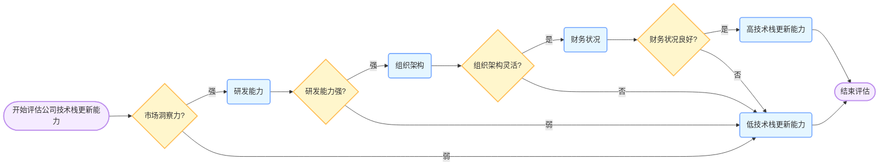

# 彼得林奇对公司技术栈更新能力的评估

> 关键词：彼得林奇、公司技术栈、更新能力评估、投资分析、技术创新

> 摘要：本文深入探讨了彼得林奇对公司技术栈更新能力的评估方法。彼得林奇作为投资领域的传奇人物，其投资理念和分析方法备受关注。在当今科技快速发展的时代，公司的技术栈更新能力对于其长期竞争力和市场价值至关重要。文章从背景介绍入手，阐述了相关概念和联系，详细分析了核心算法原理与操作步骤，通过数学模型和公式进一步解读，结合项目实战案例进行说明，探讨了实际应用场景，推荐了相关工具和资源，最后总结了未来发展趋势与挑战，并对常见问题进行了解答。旨在为投资者和企业管理者提供全面、深入的参考，帮助他们更好地评估公司的技术栈更新能力，做出明智的决策。

## 1. 背景介绍 
### 1.1 目的和范围
在当今高度竞争的商业环境中，技术的快速发展使得公司的技术栈更新能力成为影响其生存和发展的关键因素。彼得林奇以其独特的投资眼光和成功的投资实践而闻名于世，他对公司的评估方法对于投资者和企业管理者都具有重要的借鉴意义。本文的目的在于深入剖析彼得林奇对公司技术栈更新能力的评估方法，探讨其背后的逻辑和原理，为相关人员提供全面、系统的参考。范围涵盖了从理论概念到实际应用的各个方面，包括核心算法原理、数学模型、项目实战案例以及实际应用场景等。

### 1.2 预期读者
本文预期读者包括投资者、企业管理者、技术专家、研究人员以及对公司技术栈和投资分析感兴趣的人士。对于投资者来说，了解彼得林奇的评估方法有助于他们更好地筛选具有投资价值的公司；企业管理者可以从中获得关于提升公司技术栈更新能力的启示；技术专家可以深入探讨技术栈更新的相关技术和策略；研究人员可以将其作为研究公司竞争力和投资理论的参考；而对相关领域感兴趣的人士则可以通过本文了解这一重要主题的基本知识和前沿动态。

### 1.3 文档结构概述
本文将按照以下结构进行阐述：首先介绍背景信息，包括目的、预期读者和文档结构概述等；接着阐述核心概念与联系，通过文本示意图和 Mermaid 流程图展示相关概念的原理和架构；然后详细讲解核心算法原理和具体操作步骤，使用 Python 源代码进行说明；再通过数学模型和公式进一步解释评估方法的原理，并举例说明；之后结合项目实战案例，介绍开发环境搭建、源代码实现和代码解读；探讨实际应用场景；推荐相关的工具和资源；最后总结未来发展趋势与挑战，解答常见问题，并提供扩展阅读和参考资料。

### 1.4 术语表
#### 1.4.1 核心术语定义
- **彼得林奇**：美国著名的投资家，曾任富达公司麦哲伦基金的基金经理，以其卓越的投资业绩和独特的投资理念而闻名。
- **技术栈**：指公司所采用的一系列技术和工具的集合，包括硬件、软件、编程语言、开发框架等，用于支持公司的业务运营和产品开发。
- **技术栈更新能力**：指公司在面对技术变革和市场需求变化时，能够及时、有效地对其技术栈进行更新和升级的能力。
- **投资分析**：指对投资对象的财务状况、经营业绩、市场前景等进行评估和分析，以确定其投资价值和风险的过程。

#### 1.4.2 相关概念解释
- **技术创新**：指通过引入新的技术、方法或理念，创造新的产品、服务或商业模式，从而提高公司的竞争力和市场价值。
- **竞争力**：指公司在市场中与其他竞争对手相比所具有的优势和能力，包括技术、成本、品牌、客户服务等方面。
- **市场价值**：指公司在市场上的估值，通常由其股票价格、资产价值、盈利能力等因素决定。

#### 1.4.3 缩略词列表
- **IT**：信息技术（Information Technology）
- **AI**：人工智能（Artificial Intelligence）
- **ML**：机器学习（Machine Learning）

## 2. 核心概念与联系 
### 核心概念原理
彼得林奇对公司技术栈更新能力的评估基于他对公司基本面和行业趋势的深入研究。他认为，一个具有良好技术栈更新能力的公司通常具有以下特点：
1. **敏锐的市场洞察力**：能够及时捕捉市场需求的变化和技术发展的趋势，从而提前布局技术栈的更新。
2. **强大的研发能力**：拥有一支高素质的研发团队，能够不断开发新的技术和产品，以满足市场需求。
3. **灵活的组织架构**：能够快速响应市场变化，调整公司的战略和业务方向，确保技术栈的更新与公司的发展战略相一致。
4. **良好的财务状况**：有足够的资金支持技术栈的更新和研发投入，以保证公司的持续发展。

### 架构的文本示意图
```plaintext
彼得林奇评估体系
|-- 市场洞察力
|   |-- 市场需求分析
|   |-- 技术趋势研究
|-- 研发能力
|   |-- 研发团队素质
|   |-- 研发投入水平
|-- 组织架构
|   |-- 战略调整灵活性
|   |-- 业务方向适应性
|-- 财务状况
|   |-- 资金储备
|   |-- 盈利能力
```

### Mermaid 流程图


## 3. 核心算法原理 & 具体操作步骤 
### 核心算法原理
彼得林奇对公司技术栈更新能力的评估可以通过构建一个综合评估模型来实现。该模型可以基于多个指标对公司进行评估，每个指标赋予不同的权重，最后将各个指标的得分加权求和得到公司的综合得分。具体算法步骤如下：
1. **确定评估指标**：根据彼得林奇的评估理念，确定市场洞察力、研发能力、组织架构和财务状况等作为评估指标。
2. **设定指标权重**：根据各个指标的重要性，设定相应的权重。例如，市场洞察力的权重可以设定为 0.3，研发能力的权重为 0.3，组织架构的权重为 0.2，财务状况的权重为 0.2。
3. **指标量化**：对每个指标进行量化评估，例如，市场洞察力可以通过市场调研数据、行业报告等进行量化；研发能力可以通过研发人员数量、研发投入占比等进行量化。
4. **计算综合得分**：将各个指标的得分乘以其对应的权重，然后相加得到公司的综合得分。

### 具体操作步骤
以下是使用 Python 实现上述算法的源代码：
```python
# 定义评估指标及其权重
weights = {
    "市场洞察力": 0.3,
    "研发能力": 0.3,
    "组织架构": 0.2,
    "财务状况": 0.2
}

# 定义公司的各项指标得分
company_scores = {
    "市场洞察力": 80,
    "研发能力": 75,
    "组织架构": 70,
    "财务状况": 85
}

# 计算综合得分
total_score = 0
for indicator, weight in weights.items():
    score = company_scores[indicator]
    total_score += score * weight

# 输出结果
print(f"公司的综合得分为: {total_score}")
```
### 代码解释
1. **定义评估指标及其权重**：使用字典 `weights` 存储各个评估指标及其对应的权重。
2. **定义公司的各项指标得分**：使用字典 `company_scores` 存储公司在各个评估指标上的得分。
3. **计算综合得分**：通过遍历 `weights` 字典，将每个指标的得分乘以其对应的权重，然后相加得到公司的综合得分。
4. **输出结果**：使用 `print` 函数输出公司的综合得分。

## 4. 数学模型和公式 & 详细讲解 & 举例说明 
### 数学模型和公式
设公司的综合得分为 $S$，评估指标有 $n$ 个，分别为 $I_1, I_2, \cdots, I_n$，对应的权重为 $w_1, w_2, \cdots, w_n$，公司在每个指标上的得分为 $s_1, s_2, \cdots, s_n$，则综合得分的计算公式为：
$$S = \sum_{i=1}^{n} w_i s_i$$
其中，$\sum_{i=1}^{n} w_i = 1$，即所有权重之和为 1。

### 详细讲解
该公式的原理是将各个评估指标的得分按照其重要性进行加权求和，得到公司的综合得分。权重 $w_i$ 表示第 $i$ 个指标在综合评估中的重要程度，得分 $s_i$ 表示公司在第 $i$ 个指标上的表现。通过这种方式，可以综合考虑多个因素对公司技术栈更新能力的影响。

### 举例说明
假设有一家公司，其市场洞察力得分为 80 分，权重为 0.3；研发能力得分为 75 分，权重为 0.3；组织架构得分为 70 分，权重为 0.2；财务状况得分为 85 分，权重为 0.2。则该公司的综合得分计算如下：
$$S = 0.3 \times 80 + 0.3 \times 75 + 0.2 \times 70 + 0.2 \times 85$$
$$S = 24 + 22.5 + 14 + 17$$
$$S = 77.5$$
因此，该公司的综合得分为 77.5 分。

## 5. 项目实战：代码实际案例和详细解释说明 
### 5.1  开发环境搭建
为了运行上述代码，需要搭建一个 Python 开发环境。具体步骤如下：
1. **安装 Python**：从 Python 官方网站（https://www.python.org/downloads/）下载并安装 Python 3.x 版本。
2. **安装开发工具**：可以选择使用 PyCharm、VS Code 等集成开发环境（IDE），或者使用文本编辑器如 Sublime Text、Notepad++ 等。
3. **配置环境变量**：安装完成后，需要将 Python 的安装路径添加到系统的环境变量中，以便在命令行中可以直接使用 Python 命令。

### 5.2  源代码详细实现和代码解读
以下是一个更完整的 Python 代码示例，包含了用户输入和结果输出的功能：
```python
# 定义评估指标及其权重
weights = {
    "市场洞察力": 0.3,
    "研发能力": 0.3,
    "组织架构": 0.2,
    "财务状况": 0.2
}

# 提示用户输入公司的各项指标得分
company_scores = {}
for indicator in weights.keys():
    score = float(input(f"请输入公司在 {indicator} 方面的得分 (0 - 100): "))
    company_scores[indicator] = score

# 计算综合得分
total_score = 0
for indicator, weight in weights.items():
    score = company_scores[indicator]
    total_score += score * weight

# 输出结果
print(f"公司的综合得分为: {total_score}")

# 根据综合得分进行评估
if total_score >= 80:
    print("该公司的技术栈更新能力很强，具有较高的投资价值。")
elif total_score >= 60:
    print("该公司的技术栈更新能力一般，需要关注其发展动态。")
else:
    print("该公司的技术栈更新能力较弱，投资风险较高。")
```
### 代码解读
1. **定义评估指标及其权重**：与之前的代码相同，使用字典 `weights` 存储各个评估指标及其对应的权重。
2. **提示用户输入公司的各项指标得分**：通过 `input` 函数提示用户输入公司在各个评估指标上的得分，并将其转换为浮点数存储在字典 `company_scores` 中。
3. **计算综合得分**：与之前的代码相同，通过遍历 `weights` 字典，将每个指标的得分乘以其对应的权重，然后相加得到公司的综合得分。
4. **输出结果**：使用 `print` 函数输出公司的综合得分，并根据综合得分进行评估，给出相应的投资建议。

## 6. 实际应用场景 
### 投资者决策
对于投资者来说，彼得林奇对公司技术栈更新能力的评估方法可以帮助他们筛选具有投资价值的公司。在选择投资标的时，投资者可以通过评估公司的市场洞察力、研发能力、组织架构和财务状况等因素，判断公司的技术栈更新能力是否强大。具有较强技术栈更新能力的公司通常能够更好地适应市场变化，推出具有竞争力的产品和服务，从而实现持续增长和盈利，具有较高的投资价值。

### 企业战略规划
对于企业管理者来说，该评估方法可以帮助他们了解公司在技术栈更新方面的优势和不足，从而制定相应的战略规划。如果公司在某个评估指标上得分较低，管理者可以针对性地采取措施进行改进，如加强市场调研、加大研发投入、优化组织架构等。通过不断提升公司的技术栈更新能力，企业可以提高自身的竞争力，在市场中占据有利地位。

### 行业研究与分析
研究人员和分析师可以使用该评估方法对不同行业的公司进行研究和分析，了解行业的技术发展趋势和竞争格局。通过比较不同公司的技术栈更新能力，可以发现行业中的领先企业和潜在的竞争对手，为行业研究和投资分析提供参考。

## 7. 工具和资源推荐
### 7.1 学习资源推荐
#### 7.1.1 书籍推荐
- 《彼得林奇的成功投资》：彼得林奇的经典著作，详细介绍了他的投资理念和方法，对于理解他对公司的评估方法具有重要的参考价值。
- 《聪明的投资者》：本杰明·格雷厄姆的经典投资著作，被誉为投资界的圣经，书中阐述的价值投资理念对彼得林奇的投资思想产生了重要影响。
- 《创新者的窘境》：克莱顿·克里斯坦森的著作，探讨了技术创新对企业的影响，对于理解公司的技术栈更新能力具有重要的启示作用。

#### 7.1.2 在线课程
- Coursera 上的“投资学原理”：该课程由知名大学的教授授课，系统地介绍了投资学的基本原理和方法，包括公司分析、估值模型等内容。
- edX 上的“人工智能与机器学习”：该课程介绍了人工智能和机器学习的基本概念和算法，对于理解公司的技术创新和技术栈更新具有重要的帮助。

#### 7.1.3 技术博客和网站
- 36氪：提供科技、商业等领域的最新资讯和深度分析，对于了解行业动态和公司的技术创新具有重要的参考价值。
- 虎嗅网：聚焦于科技、商业等领域的创新和变革，提供有深度的行业分析和评论。

### 7.2 开发工具框架推荐
#### 7.2.1 IDE和编辑器
- PyCharm：一款专门为 Python 开发设计的集成开发环境，具有强大的代码编辑、调试和自动补全功能。
- VS Code：一款轻量级的代码编辑器，支持多种编程语言，具有丰富的插件和扩展功能。

#### 7.2.2 调试和性能分析工具
- PDB：Python 自带的调试工具，可以帮助开发者在代码中设置断点、查看变量值等，进行代码调试。
- cProfile：Python 自带的性能分析工具，可以帮助开发者分析代码的性能瓶颈，优化代码效率。

#### 7.2.3 相关框架和库
- Pandas：一个强大的数据分析库，提供了高效的数据结构和数据处理功能，可用于处理和分析公司的财务数据和市场调研数据。
- Scikit-learn：一个常用的机器学习库，提供了丰富的机器学习算法和工具，可用于构建和训练评估模型。

### 7.3 相关论文著作推荐
#### 7.3.1 经典论文
- “The Capital Asset Pricing Model: Theory and Evidence”：该论文介绍了资本资产定价模型（CAPM），是现代投资理论的重要基石之一。
- “Efficient Capital Markets: A Review of Theory and Empirical Work”：该论文对有效市场假说进行了全面的回顾和总结，对于理解市场效率和投资分析具有重要的意义。

#### 7.3.2 最新研究成果
- 关注顶级学术期刊如《Journal of Finance》、《Review of Financial Studies》等，这些期刊发表了许多关于投资理论和公司分析的最新研究成果。

#### 7.3.3 应用案例分析
- 可以参考一些知名投资机构的研究报告和案例分析，了解他们在实际投资过程中如何评估公司的技术栈更新能力和投资价值。

## 8. 总结：未来发展趋势与挑战
### 未来发展趋势
1. **技术创新加速**：随着科技的不断进步，技术创新的速度将越来越快，公司需要不断更新其技术栈以适应市场变化。未来，具有强大技术栈更新能力的公司将在市场竞争中占据更有利的地位。
2. **数据驱动的评估方法**：随着大数据和人工智能技术的发展，数据驱动的评估方法将越来越受到重视。通过收集和分析大量的公司数据，可以更准确地评估公司的技术栈更新能力和投资价值。
3. **跨行业融合**：不同行业之间的界限将越来越模糊，公司需要具备跨行业的技术和创新能力。未来，能够实现跨行业融合的公司将具有更大的发展潜力。

### 挑战
1. **技术复杂性增加**：随着技术的不断发展，技术栈的复杂性也在不断增加。公司需要具备更高的技术水平和管理能力，才能有效地更新和管理其技术栈。
2. **市场变化快速**：市场需求和技术发展的变化速度越来越快，公司需要具备快速响应的能力，及时调整其技术栈和业务战略。
3. **人才短缺**：具有技术创新和技术栈更新能力的人才短缺是当前面临的一个重要挑战。公司需要加强人才培养和引进，提高自身的人才竞争力。

## 9. 附录：常见问题与解答
### 问题 1：如何准确评估公司的市场洞察力？
答：可以通过以下方法评估公司的市场洞察力：1. 分析公司的市场调研数据和行业报告，了解其对市场需求和趋势的把握程度；2. 观察公司的产品和服务是否能够及时满足市场需求；3. 关注公司的战略决策和业务布局，是否与市场趋势相一致。

### 问题 2：研发能力的评估指标有哪些？
答：研发能力的评估指标包括：1. 研发人员数量和素质；2. 研发投入占比；3. 专利数量和质量；4. 新产品研发速度和成功率等。

### 问题 3：如何判断公司的组织架构是否灵活？
答：可以从以下几个方面判断公司的组织架构是否灵活：1. 公司的决策流程是否高效，能否快速响应市场变化；2. 部门之间的协作是否顺畅，是否存在沟通障碍；3. 公司是否能够根据业务需求及时调整组织架构。

### 问题 4：财务状况对公司技术栈更新能力有何影响？
答：良好的财务状况是公司技术栈更新的重要保障。有足够的资金支持，公司可以加大研发投入，引进先进的技术和设备，招聘优秀的研发人才，从而提高其技术栈更新能力。相反，财务状况不佳的公司可能会因为资金短缺而无法及时更新技术栈，影响其竞争力和发展前景。

## 10. 扩展阅读 & 参考资料
### 扩展阅读
- 《金融炼金术》：乔治·索罗斯的著作，探讨了金融市场的运行规律和投资策略，对于深入理解投资分析具有重要的参考价值。
- 《从0到1》：彼得·蒂尔的著作，阐述了创业和创新的理念和方法，对于理解公司的技术创新和发展具有重要的启示作用。

### 参考资料
- 彼得林奇的相关著作和访谈记录。
- 金融和投资领域的学术期刊和研究报告。
- 公司的年报、财务报表和相关公告。