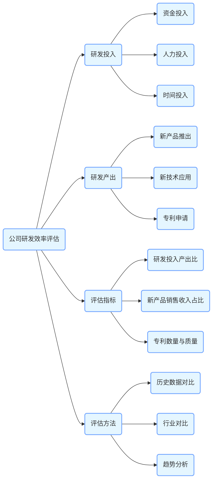

# 彼得林奇对公司研发效率的评估方法

> 关键词：彼得林奇、公司研发效率、评估方法、投资分析、企业竞争力

> 摘要：本文深入探讨了彼得林奇对公司研发效率的评估方法。彼得林奇作为投资界的传奇人物，其对公司研发效率的评估方法具有重要的借鉴意义。文章首先介绍了研究的背景，包括目的、预期读者等内容。接着阐述了核心概念与联系，展示了相关原理和架构的示意图与流程图。详细讲解了核心算法原理及具体操作步骤，并结合数学模型和公式进行说明。通过项目实战案例，对代码实现和解读进行了深入分析。还探讨了该评估方法的实际应用场景，推荐了相关的工具和资源。最后总结了未来发展趋势与挑战，提供了常见问题解答和扩展阅读参考资料，旨在帮助读者全面理解彼得林奇对公司研发效率的评估方法，为投资决策和企业管理提供有益的参考。

## 1. 背景介绍 
### 1.1 目的和范围
本研究的主要目的是深入剖析彼得林奇对公司研发效率的评估方法。在当今竞争激烈的商业环境中，研发效率对于公司的生存和发展至关重要。彼得林奇以其卓越的投资业绩和独特的投资理念闻名于世，他对公司研发效率的评估方法不仅对投资者判断公司的投资价值具有重要意义，也为企业管理者提升研发效率提供了参考。

研究范围将涵盖彼得林奇评估公司研发效率的各个方面，包括其评估的指标、方法、逻辑以及在不同行业中的应用。同时，还将结合实际案例，探讨如何将这些评估方法应用于实际的投资和企业管理决策中。

### 1.2 预期读者
本文预期读者包括投资者、企业管理者、金融分析师、研究学者以及对商业和投资领域感兴趣的人士。对于投资者来说，了解彼得林奇的评估方法有助于他们筛选出具有投资价值的公司；企业管理者可以借鉴这些方法来优化公司的研发策略，提高研发效率；金融分析师可以将其作为分析公司基本面的重要工具；研究学者可以在此基础上进行更深入的学术研究；而对商业和投资领域感兴趣的人士则可以通过本文拓宽自己的知识视野。

### 1.3 文档结构概述
本文将按照以下结构进行阐述：首先介绍背景信息，包括目的、预期读者和文档结构概述等内容。接着详细讲解核心概念与联系，通过文本示意图和 Mermaid 流程图展示相关原理和架构。然后阐述核心算法原理及具体操作步骤，并给出 Python 源代码进行详细说明。之后结合数学模型和公式进行讲解，并举例说明。通过项目实战案例，展示代码的实际实现和解读。探讨该评估方法的实际应用场景，推荐相关的工具和资源。最后总结未来发展趋势与挑战，提供常见问题解答和扩展阅读参考资料。

### 1.4 术语表
#### 1.4.1 核心术语定义
- **研发效率**：指企业在研发过程中投入资源（如资金、人力、时间等）与产出成果（如新产品、新技术、新专利等）之间的比率关系，反映了企业利用资源进行研发创新的能力和效果。
- **投资价值**：指公司对于投资者的吸引力和潜在回报能力，通常通过公司的财务状况、市场竞争力、发展前景等多个因素综合评估得出。
- **研发投入**：企业在研发活动中所花费的各项成本，包括研发人员的薪酬、研发设备的购置、研发材料的消耗等。
- **研发产出**：企业通过研发活动所获得的成果，如新产品的推出、新技术的应用、专利的申请等。

#### 1.4.2 相关概念解释
- **创新能力**：企业在研发过程中创造新的产品、技术或服务的能力，是研发效率的重要体现。创新能力强的企业往往能够在市场竞争中占据优势地位。
- **市场竞争力**：企业在市场中与竞争对手相比所具有的优势和能力，研发效率是影响市场竞争力的关键因素之一。高效的研发能够帮助企业推出更具竞争力的产品和服务，从而提高市场份额。
- **财务指标**：用于衡量企业财务状况和经营成果的各种数据，如营业收入、净利润、资产负债率等。在评估公司研发效率时，财务指标可以提供重要的参考信息。

#### 1.4.3 缩略词列表
- **R&D**：Research and Development，即研究与开发。
- **ROI**：Return on Investment，即投资回报率。

## 2. 核心概念与联系 
### 核心概念原理
彼得林奇对公司研发效率的评估基于对公司研发投入和产出的综合分析。他认为，研发投入是公司进行创新和发展的基础，而研发产出则是衡量研发效率的关键指标。一个高效的研发过程应该能够在合理的投入下获得显著的产出，从而为公司带来持续的竞争优势和盈利增长。

研发投入不仅包括资金的投入，还包括人力、时间等资源的投入。研发产出则可以表现为新产品的推出、新技术的应用、专利的申请等多种形式。通过对研发投入和产出的对比分析，可以评估公司的研发效率。

### 架构的文本示意图
```plaintext
公司研发效率评估
|-- 研发投入
|   |-- 资金投入
|   |-- 人力投入
|   |-- 时间投入
|-- 研发产出
|   |-- 新产品推出
|   |-- 新技术应用
|   |-- 专利申请
|-- 评估指标
|   |-- 研发投入产出比
|   |-- 新产品销售收入占比
|   |-- 专利数量与质量
|-- 评估方法
|   |-- 历史数据对比
|   |-- 行业对比
|   |-- 趋势分析
```

### Mermaid 流程图


## 3. 核心算法原理 & 具体操作步骤 
### 核心算法原理
彼得林奇评估公司研发效率的核心算法主要基于对研发投入和产出的量化分析。其中，研发投入产出比是一个重要的指标，它可以通过以下公式计算：

研发投入产出比 = 研发产出 / 研发投入

研发产出可以用新产品销售收入、专利数量等指标来衡量，研发投入则可以用研发费用、研发人员数量等指标来衡量。通过计算研发投入产出比，可以直观地了解公司在研发方面的效率。

### 具体操作步骤
1. **数据收集**：收集公司的研发投入和产出相关数据，包括研发费用、研发人员数量、新产品销售收入、专利数量等。这些数据可以从公司的财务报表、年报、专利数据库等渠道获取。
2. **数据整理**：对收集到的数据进行整理和清洗，去除无效数据和异常值。确保数据的准确性和可靠性。
3. **计算研发投入产出比**：根据上述公式，计算公司的研发投入产出比。可以分别计算不同时间段的研发投入产出比，以便进行趋势分析。
4. **行业对比**：将公司的研发投入产出比与同行业其他公司进行对比，了解公司在行业中的研发效率水平。
5. **趋势分析**：分析公司研发投入产出比的变化趋势，判断公司的研发效率是在提高还是在下降。

### Python 源代码实现
```python
import pandas as pd

# 假设数据存储在一个 CSV 文件中，文件名为 'research_data.csv'
# 包含列：'研发费用', '研发人员数量', '新产品销售收入', '专利数量'
data = pd.read_csv('research_data.csv')

# 计算研发投入：假设研发投入为研发费用和研发人员数量的加权和
# 这里简单假设研发费用权重为 0.6，研发人员数量权重为 0.4
data['研发投入'] = data['研发费用'] * 0.6 + data['研发人员数量'] * 0.4

# 计算研发产出：假设研发产出为新产品销售收入和专利数量的加权和
# 这里简单假设新产品销售收入权重为 0.7，专利数量权重为 0.3
data['研发产出'] = data['新产品销售收入'] * 0.7 + data['专利数量'] * 0.3

# 计算研发投入产出比
data['研发投入产出比'] = data['研发产出'] / data['研发投入']

# 输出结果
print(data[['研发投入', '研发产出', '研发投入产出比']])
```

## 4. 数学模型和公式 & 详细讲解 & 举例说明 
### 数学模型和公式
#### 研发投入产出比
研发投入产出比（$RIO$）的计算公式为：

$$RIO = \frac{O}{I}$$

其中，$O$ 表示研发产出，$I$ 表示研发投入。

#### 新产品销售收入占比
新产品销售收入占比（$NPS$）的计算公式为：

$$NPS = \frac{NS}{TS} \times 100\%$$

其中，$NS$ 表示新产品销售收入，$TS$ 表示总销售收入。

#### 专利数量与质量综合指标
专利数量与质量综合指标（$PQ$）的计算公式为：

$$PQ = \sum_{i=1}^{n} w_i q_i$$

其中，$n$ 表示专利数量，$w_i$ 表示第 $i$ 个专利的权重，$q_i$ 表示第 $i$ 个专利的质量得分。

### 详细讲解
- **研发投入产出比**：该指标反映了公司在研发方面的资源利用效率。比值越高，说明公司在相同的研发投入下能够获得更多的产出，研发效率越高。
- **新产品销售收入占比**：该指标衡量了新产品对公司销售收入的贡献程度。占比越高，说明公司的研发成果能够更好地转化为实际的销售收入，研发效率也越高。
- **专利数量与质量综合指标**：该指标综合考虑了专利的数量和质量。专利数量反映了公司的创新能力，而专利质量则反映了专利的技术含量和市场价值。通过加权计算，可以得到一个综合的指标来评估公司的专利水平。

### 举例说明
假设某公司在 2020 年的研发费用为 1000 万元，研发人员数量为 100 人，新产品销售收入为 5000 万元，总销售收入为 10000 万元，专利数量为 20 项。

1. **计算研发投入**：
假设研发费用权重为 0.6，研发人员数量权重为 0.4，每人的研发成本为 10 万元。
研发投入 = $1000 \times 0.6 + 100 \times 10 \times 0.4$ = 600 + 400 = 1000（万元）

2. **计算研发产出**：
假设新产品销售收入权重为 0.7，专利数量权重为 0.3，每项专利的价值为 100 万元。
研发产出 = $5000 \times 0.7 + 20 \times 100 \times 0.3$ = 3500 + 600 = 4100（万元）

3. **计算研发投入产出比**：
研发投入产出比 = $4100 \div 1000$ = 4.1

4. **计算新产品销售收入占比**：
新产品销售收入占比 = $(5000 \div 10000) \times 100\%$ = 50%

5. **计算专利数量与质量综合指标**：
假设所有专利的质量得分相同，均为 80 分，权重也相同，均为 0.05。
专利数量与质量综合指标 = $\sum_{i=1}^{20} 0.05 \times 80$ = 80

## 5. 项目实战：代码实际案例和详细解释说明 
### 5.1  开发环境搭建
- **操作系统**：可以选择 Windows、Linux 或 macOS 等主流操作系统。
- **Python 环境**：安装 Python 3.x 版本，可以从 Python 官方网站（https://www.python.org/downloads/） 下载并安装。
- **开发工具**：推荐使用 PyCharm 或 Jupyter Notebook 等开发工具。可以从官方网站下载并安装。
- **依赖库**：需要安装 pandas 库，可以使用以下命令进行安装：
```sh
pip install pandas
```

### 5.2  源代码详细实现和代码解读
```python
import pandas as pd

# 读取数据
data = pd.read_csv('research_data.csv')

# 计算研发投入
# 假设研发费用权重为 0.6，研发人员数量权重为 0.4
# 每人的研发成本为 10 万元
data['研发投入'] = data['研发费用'] * 0.6 + data['研发人员数量'] * 10 * 0.4

# 计算研发产出
# 假设新产品销售收入权重为 0.7，专利数量权重为 0.3
# 每项专利的价值为 100 万元
data['研发产出'] = data['新产品销售收入'] * 0.7 + data['专利数量'] * 100 * 0.3

# 计算研发投入产出比
data['研发投入产出比'] = data['研发产出'] / data['研发投入']

# 计算新产品销售收入占比
data['新产品销售收入占比'] = (data['新产品销售收入'] / data['总销售收入']) * 100

# 假设专利质量得分数据存储在 '专利质量得分' 列中
# 计算专利数量与质量综合指标
data['专利数量与质量综合指标'] = data['专利数量'] * data['专利质量得分']

# 输出结果
print(data[['研发投入', '研发产出', '研发投入产出比', '新产品销售收入占比', '专利数量与质量综合指标']])
```

### 代码解读与分析
1. **数据读取**：使用 `pandas` 库的 `read_csv` 函数读取存储在 CSV 文件中的数据。
2. **研发投入计算**：根据研发费用和研发人员数量，按照一定的权重计算研发投入。
3. **研发产出计算**：根据新产品销售收入和专利数量，按照一定的权重计算研发产出。
4. **研发投入产出比计算**：用研发产出除以研发投入，得到研发投入产出比。
5. **新产品销售收入占比计算**：用新产品销售收入除以总销售收入，再乘以 100，得到新产品销售收入占比。
6. **专利数量与质量综合指标计算**：用专利数量乘以专利质量得分，得到专利数量与质量综合指标。
7. **结果输出**：打印出计算得到的各项指标。

通过这个代码示例，可以对公司的研发效率进行量化评估，为投资决策和企业管理提供参考。

## 6. 实际应用场景 
### 投资决策
投资者可以使用彼得林奇的评估方法来筛选具有投资价值的公司。通过评估公司的研发效率，投资者可以了解公司的创新能力和发展潜力。研发效率高的公司往往能够推出更具竞争力的产品和服务，从而获得更高的市场份额和盈利增长。投资者可以将研发效率作为重要的选股指标之一，选择那些研发效率高、具有良好发展前景的公司进行投资。

### 企业管理
企业管理者可以利用这些评估方法来优化公司的研发策略，提高研发效率。通过分析研发投入产出比、新产品销售收入占比等指标，管理者可以了解公司研发活动的效果，找出存在的问题和不足。例如，如果研发投入产出比过低，可能意味着研发资源的浪费或研发方向的偏差，管理者可以及时调整研发策略，提高资源利用效率。同时，管理者还可以通过与同行业其他公司的对比，了解公司在研发方面的优势和劣势，从而有针对性地进行改进和提升。

### 行业分析
分析师可以使用彼得林奇的评估方法对整个行业的研发效率进行分析。通过比较不同公司的研发效率指标，可以了解行业的整体创新水平和发展趋势。这有助于分析师预测行业的未来发展方向，为投资者和企业管理者提供决策参考。例如，如果某个行业的研发效率普遍较低，可能意味着该行业面临着技术瓶颈或竞争压力，投资者可以谨慎投资；而如果某个行业的研发效率不断提高，可能意味着该行业具有较大的发展潜力，投资者可以关注相关的投资机会。

## 7. 工具和资源推荐
### 7.1 学习资源推荐
#### 7.1.1 书籍推荐
- 《彼得林奇的成功投资》：这是彼得林奇的经典著作之一，书中详细介绍了他的投资理念和方法，包括如何评估公司的基本面和研发效率等内容。
- 《聪明的投资者》：本杰明·格雷厄姆的著作，被誉为投资界的圣经。书中阐述了价值投资的基本原理和方法，对理解公司的内在价值和研发效率的重要性具有重要的指导意义。
- 《创新者的窘境》：克莱顿·克里斯坦森的著作，探讨了创新在企业发展中的作用和挑战。通过阅读这本书，可以了解到研发效率对于企业应对创新挑战的重要性。

#### 7.1.2 在线课程
- Coursera 上的“投资学原理”课程：该课程由知名高校的教授授课，系统地介绍了投资学的基本原理和方法，包括公司基本面分析和研发效率评估等内容。
- edX 上的“创新管理”课程：该课程深入探讨了创新管理的理论和实践，对于理解研发效率在企业创新中的作用具有重要的帮助。
- 网易云课堂上的“财务分析与决策”课程：该课程讲解了财务分析的基本方法和技巧，有助于学习者掌握如何通过财务数据评估公司的研发效率。

#### 7.1.3 技术博客和网站
- Seeking Alpha：这是一个知名的投资研究网站，提供了大量的公司分析报告和投资建议。其中不乏关于公司研发效率评估的内容。
- 雪球网：国内知名的投资交流社区，投资者可以在上面分享自己的投资经验和研究成果，也可以找到关于公司研发效率评估的相关讨论。
- 东方财富网：提供了丰富的金融数据和资讯，包括公司的财务报表和研发数据等，有助于学习者获取相关信息进行研发效率评估。

### 7.2 开发工具框架推荐
#### 7.2.1 IDE和编辑器
- PyCharm：一款专业的 Python 集成开发环境，具有强大的代码编辑、调试和分析功能，适合进行数据处理和分析的开发工作。
- Jupyter Notebook：一个交互式的开发环境，支持多种编程语言，特别适合进行数据探索和可视化分析。
- Visual Studio Code：一款轻量级的代码编辑器，支持多种编程语言和插件扩展，具有良好的开发体验。

#### 7.2.2 调试和性能分析工具
- pdb：Python 内置的调试工具，可以帮助开发者逐步调试代码，查找问题所在。
- cProfile：Python 标准库中的性能分析工具，可以统计代码的运行时间和函数调用次数，帮助开发者优化代码性能。
- Spyder：一款集成了调试和性能分析功能的 Python 开发环境，适合初学者使用。

#### 7.2.3 相关框架和库
- pandas：一个强大的数据处理和分析库，提供了高效的数据结构和数据操作方法，适合进行研发数据的处理和分析。
- numpy：一个用于科学计算的库，提供了高效的数组操作和数学函数，有助于进行数值计算和分析。
- matplotlib：一个用于数据可视化的库，可以绘制各种类型的图表，帮助开发者直观地展示研发数据和分析结果。

### 7.3 相关论文著作推荐
#### 7.3.1 经典论文
- “The Measurement of Productive Efficiency” by Michael J. Farrell：该论文提出了一种衡量生产效率的方法，对于理解研发效率的评估具有重要的理论基础。
- “Innovation and Learning: The Two Faces of R & D” by Zvi Griliches：该论文探讨了研发活动的创新和学习两个方面，对研发效率的评估提供了新的视角。
- “The Sources of Innovation” by Eric von Hippel：该论文研究了创新的来源和机制，有助于理解研发效率与创新的关系。

#### 7.3.2 最新研究成果
- 近年来，学术界对于研发效率的评估方法和影响因素进行了大量的研究。可以通过学术数据库（如 Web of Science、CNKI 等）搜索相关的研究论文，了解最新的研究成果。
- 一些知名的学术期刊（如《管理世界》、《中国工业经济》等）也经常发表关于研发效率的研究论文，可以关注这些期刊获取最新的研究动态。

#### 7.3.3 应用案例分析
- 可以通过查阅商业杂志（如《哈佛商业评论》、《财经》等）和企业案例集，了解不同行业和企业的研发效率评估和管理的实际案例。这些案例可以为实际应用提供参考和借鉴。

## 8. 总结：未来发展趋势与挑战
### 未来发展趋势
- **数据驱动的评估方法**：随着大数据和人工智能技术的发展，未来对公司研发效率的评估将更加依赖于数据。通过收集和分析大量的研发数据，可以构建更加精准的评估模型，提高评估的准确性和可靠性。
- **跨学科的评估视角**：研发效率的评估不仅仅涉及到技术和财务领域，还涉及到管理、市场、法律等多个学科。未来的评估方法将更加注重跨学科的融合，综合考虑各种因素对研发效率的影响。
- **动态评估和实时监测**：传统的研发效率评估往往是基于历史数据的静态评估，无法及时反映公司研发活动的变化。未来的评估方法将更加注重动态评估和实时监测，及时发现研发过程中存在的问题并进行调整。

### 挑战
- **数据质量和获取难度**：研发数据的质量和获取难度是评估研发效率的重要挑战。研发数据往往涉及到企业的核心机密，获取难度较大。同时，数据的准确性和完整性也会影响评估结果的可靠性。
- **评估指标的主观性**：研发效率的评估指标往往具有一定的主观性，不同的评估者可能会采用不同的指标和方法。如何选择合适的评估指标和方法，确保评估结果的客观性和公正性，是一个需要解决的问题。
- **技术创新的快速变化**：技术创新的快速变化使得研发效率的评估变得更加复杂。新的技术和商业模式不断涌现，传统的评估方法可能无法适应这些变化。如何及时调整评估方法，以适应技术创新的发展，是未来面临的一个重要挑战。

## 9. 附录：常见问题与解答
### 问题 1：如何确定研发投入和产出的权重？
研发投入和产出的权重可以根据不同的行业和公司特点进行确定。一般来说，可以参考行业平均水平、公司的战略目标和历史数据等因素。例如，如果公司注重新产品的市场推广，可以适当提高新产品销售收入的权重；如果公司注重技术创新，可以适当提高专利数量和质量的权重。

### 问题 2：研发投入产出比的合理范围是多少？
研发投入产出比的合理范围因行业而异。一些高科技行业的研发投入产出比可能较高，而一些传统行业的研发投入产出比可能较低。一般来说，可以通过与同行业其他公司的对比来判断研发投入产出比是否合理。如果公司的研发投入产出比明显高于同行业平均水平，说明公司的研发效率较高；反之，则说明公司的研发效率较低。

### 问题 3：如何评估专利的质量？
评估专利的质量可以从多个方面进行考虑，如专利的技术含量、市场价值、法律稳定性等。可以参考专利的引用次数、被实施情况、市场需求等因素来评估专利的质量。此外，还可以请专业的专利评估机构进行评估。

### 问题 4：研发效率评估方法是否适用于所有类型的公司？
研发效率评估方法适用于大多数类型的公司，但不同类型的公司在应用时可能需要进行适当的调整。例如，对于一些研发投入较少的传统制造业公司，可能需要更加关注产品的生产效率和成本控制；而对于一些高科技创新型公司，则需要更加注重研发效率和创新能力的评估。

## 10. 扩展阅读 & 参考资料
### 扩展阅读
- 《价值评估：公司价值的衡量与管理》：该书深入探讨了公司价值评估的方法和技术，对于理解研发效率与公司价值的关系具有重要的参考价值。
- 《技术创新管理》：这本书系统地介绍了技术创新管理的理论和实践，有助于进一步了解研发效率在技术创新中的作用和管理方法。
- 《竞争战略》：迈克尔·波特的经典著作，阐述了企业竞争战略的基本原理和方法，对于理解研发效率在企业竞争中的地位和作用具有重要的启示。

### 参考资料
- 彼得林奇相关的演讲和访谈记录。
- 各公司的财务报表和年报。
- 相关的学术研究论文和报告。
- 行业协会发布的统计数据和研究报告。