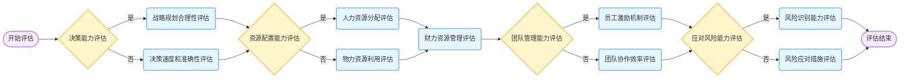

# 彼得林奇对公司管理层执行力的评估

> 关键词：彼得林奇、公司管理层、执行力评估、投资分析、企业管理

> 摘要：本文围绕彼得林奇对公司管理层执行力的评估展开。彼得林奇作为投资界的传奇人物，其对公司管理层执行力的评估方法和理念对投资者和企业管理者都具有重要的借鉴意义。文章深入探讨了相关核心概念，详细阐述了评估的算法原理及操作步骤，构建了数学模型并结合实际案例进行说明。通过项目实战展示了如何运用这些方法进行具体分析，介绍了实际应用场景以及相关的工具和资源。最后总结了未来发展趋势与挑战，并对常见问题进行了解答，为读者全面理解和应用彼得林奇的评估方法提供了系统的指导。

## 1. 背景介绍 
### 1.1 目的和范围
彼得林奇在投资领域取得了巨大的成功，他非常重视公司管理层的执行力对企业发展和投资价值的影响。本文的目的在于深入剖析彼得林奇评估公司管理层执行力的方法和理念，帮助投资者更好地筛选具有投资价值的公司，同时也为企业管理者提供提升自身执行力的参考。范围涵盖了彼得林奇评估方法的理论基础、实际操作步骤、数学模型构建以及在不同场景下的应用。

### 1.2 预期读者
本文预期读者包括广大的投资者，无论是个人投资者还是专业投资机构的从业者，都可以从彼得林奇的评估方法中获取有价值的投资思路。同时，企业管理者也能通过本文了解如何从投资者的视角评估自身的执行力，进而发现问题并加以改进。此外，对企业管理和投资分析感兴趣的学者和研究人员也能从本文中获得研究灵感和理论支持。

### 1.3 文档结构概述
本文首先介绍了相关的核心概念，包括公司管理层执行力的定义和彼得林奇评估方法的核心要点，并通过示意图和流程图进行直观展示。接着详细阐述了评估的核心算法原理和具体操作步骤，结合Python代码进行说明。然后构建了数学模型并给出详细的公式推导和举例说明。通过项目实战部分展示了如何将这些方法应用到实际案例中，包括开发环境搭建、源代码实现和代码解读。之后介绍了该评估方法在不同场景下的实际应用，推荐了相关的学习资源、开发工具和论文著作。最后总结了未来发展趋势与挑战，解答了常见问题，并提供了扩展阅读和参考资料。

### 1.4 术语表
#### 1.4.1 核心术语定义
- **公司管理层执行力**：指公司管理层将战略目标转化为实际成果的能力，包括制定合理的计划、有效组织资源、协调团队行动以及及时解决问题等方面。
- **彼得林奇评估法**：彼得林奇在投资实践中总结出的一套用于评估公司管理层执行力的方法，综合考虑多个因素对管理层执行力进行量化评估。
- **投资价值**：指公司对于投资者而言所具有的潜在获利能力和风险水平，是投资者决定是否投资的重要依据。

#### 1.4.2 相关概念解释
- **战略目标**：公司在一定时期内希望实现的总体发展方向和预期成果，是管理层决策和行动的指导方针。
- **资源配置**：管理层根据战略目标对公司的人力、物力、财力等资源进行合理分配和利用的过程，直接影响到公司的运营效率和执行力。
- **团队协作**：公司内部各个部门和成员之间相互配合、协同工作的程度，良好的团队协作是提高执行力的关键因素之一。

#### 1.4.3 缩略词列表
本文在撰写过程中未使用缩略词。

## 2. 核心概念与联系 
### 核心概念原理
彼得林奇认为，公司管理层的执行力是影响公司业绩和投资价值的关键因素之一。一个具有强大执行力的管理层能够准确把握市场机会，高效地组织和调配资源，将公司的战略目标转化为实际的经营成果。他的评估方法主要基于对管理层的决策能力、资源配置能力、团队管理能力以及应对风险能力等多个方面的综合考量。

具体来说，决策能力体现在管理层能否制定出符合市场趋势和公司实际情况的战略规划；资源配置能力涉及到如何合理分配人力、物力和财力资源，以实现公司效益的最大化；团队管理能力包括激励员工、协调团队关系等方面，确保团队成员能够高效协作；应对风险能力则要求管理层在面对各种不确定性时能够及时采取有效的措施，降低风险对公司的影响。

### 架构的文本示意图
```plaintext
彼得林奇对公司管理层执行力的评估
|-- 决策能力
|   |-- 战略规划合理性
|   |-- 决策速度和准确性
|-- 资源配置能力
|   |-- 人力资源分配
|   |-- 物力资源利用
|   |-- 财力资源管理
|-- 团队管理能力
|   |-- 员工激励机制
|   |-- 团队协作效率
|-- 应对风险能力
|   |-- 风险识别能力
|   |-- 风险应对措施
```

### Mermaid 流程图


## 3. 核心算法原理 & 具体操作步骤 
### 核心算法原理
彼得林奇对公司管理层执行力的评估可以采用综合评分法。首先，确定影响管理层执行力的各个因素，如决策能力、资源配置能力、团队管理能力和应对风险能力等，并为每个因素分配相应的权重。然后，对每个因素进行细分，制定具体的评估指标，并根据公司的实际情况对每个指标进行评分。最后，将各个指标的得分乘以相应的权重，求和得到管理层执行力的综合得分。

### 具体操作步骤
#### 步骤 1：确定评估因素和权重
假设我们确定的评估因素及权重如下：
| 评估因素 | 权重 |
| --- | --- |
| 决策能力 | 0.3 |
| 资源配置能力 | 0.25 |
| 团队管理能力 | 0.2 |
| 应对风险能力 | 0.25 |

#### 步骤 2：细分评估因素，制定评估指标
以决策能力为例，细分后的评估指标及评分标准如下：
| 评估指标 | 评分标准 |
| --- | --- |
| 战略规划合理性 | 优秀（9 - 10分）、良好（7 - 8分）、一般（5 - 6分）、较差（3 - 4分）、差（1 - 2分） |
| 决策速度和准确性 | 优秀（9 - 10分）、良好（7 - 8分）、一般（5 - 6分）、较差（3 - 4分）、差（1 - 2分） |

#### 步骤 3：对每个指标进行评分
根据公司的实际情况，对每个指标进行评分。例如，某公司的战略规划合理性评分为8分，决策速度和准确性评分为7分。

#### 步骤 4：计算每个因素的得分
决策能力得分 = 战略规划合理性得分 × 0.5 + 决策速度和准确性得分 × 0.5
= 8 × 0.5 + 7 × 0.5
= 7.5分

#### 步骤 5：计算综合得分
综合得分 = 决策能力得分 × 0.3 + 资源配置能力得分 × 0.25 + 团队管理能力得分 × 0.2 + 应对风险能力得分 × 0.25

### Python源代码实现
```python
# 定义评估因素的权重
weights = {
    "决策能力": 0.3,
    "资源配置能力": 0.25,
    "团队管理能力": 0.2,
    "应对风险能力": 0.25
}

# 定义决策能力的评估指标及权重
decision_ability_metrics = {
    "战略规划合理性": 0.5,
    "决策速度和准确性": 0.5
}

# 假设某公司的决策能力指标得分
decision_ability_scores = {
    "战略规划合理性": 8,
    "决策速度和准确性": 7
}

# 计算决策能力得分
decision_ability_score = 0
for metric, weight in decision_ability_metrics.items():
    decision_ability_score += decision_ability_scores[metric] * weight

# 假设其他因素的得分
resource_allocation_score = 7
team_management_score = 6
risk_management_score = 7

# 计算综合得分
composite_score = (
    decision_ability_score * weights["决策能力"] +
    resource_allocation_score * weights["资源配置能力"] +
    team_management_score * weights["团队管理能力"] +
    risk_management_score * weights["应对风险能力"]
)

print(f"公司管理层执行力综合得分: {composite_score}")
```

## 4. 数学模型和公式 & 详细讲解 & 举例说明 
### 数学模型
设 $E$ 为公司管理层执行力的综合得分，$F_i$ 为第 $i$ 个评估因素的得分，$W_i$ 为第 $i$ 个评估因素的权重，$n$ 为评估因素的个数，则综合得分的计算公式为：
$$E = \sum_{i=1}^{n} F_i \times W_i$$

对于每个评估因素 $F_i$，设 $M_{ij}$ 为第 $i$ 个评估因素下的第 $j$ 个评估指标的得分，$w_{ij}$ 为第 $i$ 个评估因素下的第 $j$ 个评估指标的权重，$m$ 为第 $i$ 个评估因素下评估指标的个数，则第 $i$ 个评估因素的得分计算公式为：
$$F_i = \sum_{j=1}^{m} M_{ij} \times w_{ij}$$

### 详细讲解
上述数学模型通过加权求和的方式，将各个评估因素和评估指标的得分进行综合计算，得到公司管理层执行力的综合得分。权重的设置反映了不同评估因素和评估指标在整体评估中的重要程度。通过这种方式，可以更全面、客观地评估公司管理层的执行力。

### 举例说明
假设我们要评估一家公司的管理层执行力，评估因素及权重如下：
| 评估因素 | 权重 |
| --- | --- |
| 决策能力 | 0.3 |
| 资源配置能力 | 0.25 |
| 团队管理能力 | 0.2 |
| 应对风险能力 | 0.25 |

决策能力的评估指标及权重如下：
| 评估指标 | 权重 |
| --- | --- |
| 战略规划合理性 | 0.5 |
| 决策速度和准确性 | 0.5 |

该公司的决策能力评估指标得分如下：
| 评估指标 | 得分 |
| --- | --- |
| 战略规划合理性 | 8 |
| 决策速度和准确性 | 7 |

首先，计算决策能力得分：
$$F_1 = M_{11} \times w_{11} + M_{12} \times w_{12} = 8 \times 0.5 + 7 \times 0.5 = 7.5$$

假设资源配置能力得分 $F_2 = 7$，团队管理能力得分 $F_3 = 6$，应对风险能力得分 $F_4 = 7$。

然后，计算综合得分：
$$E = F_1 \times W_1 + F_2 \times W_2 + F_3 \times W_3 + F_4 \times W_4$$
$$= 7.5 \times 0.3 + 7 \times 0.25 + 6 \times 0.2 + 7 \times 0.25$$
$$= 2.25 + 1.75 + 1.2 + 1.75$$
$$= 6.95$$

因此，该公司管理层执行力的综合得分是6.95分。

## 5. 项目实战：代码实际案例和详细解释说明 
### 5.1  开发环境搭建
为了运行上述Python代码，我们需要搭建以下开发环境：
- **Python环境**：建议安装Python 3.7及以上版本。可以从Python官方网站（https://www.python.org/downloads/）下载并安装。
- **开发工具**：可以选择使用PyCharm、VS Code等集成开发环境（IDE），也可以使用简单的文本编辑器如Sublime Text。

### 5.2  源代码详细实现和代码解读
```python
# 定义评估因素的权重
weights = {
    "决策能力": 0.3,
    "资源配置能力": 0.25,
    "团队管理能力": 0.2,
    "应对风险能力": 0.25
}

# 定义决策能力的评估指标及权重
decision_ability_metrics = {
    "战略规划合理性": 0.5,
    "决策速度和准确性": 0.5
}

# 假设某公司的决策能力指标得分
decision_ability_scores = {
    "战略规划合理性": 8,
    "决策速度和准确性": 7
}

# 计算决策能力得分
decision_ability_score = 0
for metric, weight in decision_ability_metrics.items():
    decision_ability_score += decision_ability_scores[metric] * weight

# 假设其他因素的得分
resource_allocation_score = 7
team_management_score = 6
risk_management_score = 7

# 计算综合得分
composite_score = (
    decision_ability_score * weights["决策能力"] +
    resource_allocation_score * weights["资源配置能力"] +
    team_management_score * weights["团队管理能力"] +
    risk_management_score * weights["应对风险能力"]
)

print(f"公司管理层执行力综合得分: {composite_score}")
```

### 代码解读与分析
- **评估因素权重定义**：通过字典 `weights` 定义了各个评估因素的权重，方便后续计算综合得分时使用。
- **决策能力指标及权重定义**：字典 `decision_ability_metrics` 定义了决策能力的评估指标及相应的权重。
- **决策能力指标得分假设**：字典 `decision_ability_scores` 假设了某公司决策能力的各个评估指标的得分。
- **决策能力得分计算**：通过循环遍历 `decision_ability_metrics` 字典，将每个指标的得分乘以相应的权重并累加，得到决策能力的得分。
- **其他因素得分假设**：直接假设了资源配置能力、团队管理能力和应对风险能力的得分。
- **综合得分计算**：将各个因素的得分乘以相应的权重并累加，得到公司管理层执行力的综合得分。
- **结果输出**：使用 `print` 函数输出综合得分。

## 6. 实际应用场景 
### 投资决策
投资者在选择投资标的时，可以运用彼得林奇的评估方法对公司管理层的执行力进行评估。一个具有强大执行力的管理层能够更好地推动公司的发展，提高公司的业绩和竞争力，从而为投资者带来更高的回报。通过评估管理层的执行力，投资者可以筛选出具有投资价值的公司，降低投资风险。

### 企业战略规划
企业在制定战略规划时，管理层可以参考彼得林奇的评估方法，对自身的执行力进行评估。了解自身在决策能力、资源配置能力、团队管理能力和应对风险能力等方面的优势和不足，有助于企业制定更加合理的战略规划，提高战略实施的成功率。

### 企业绩效管理
企业可以将管理层执行力的评估纳入绩效管理体系，通过定期评估管理层的执行力，激励管理层不断提高自身的能力和水平。同时，评估结果也可以作为管理层绩效考核和薪酬调整的重要依据。

### 企业并购重组
在企业并购重组过程中，评估目标企业管理层的执行力至关重要。一个执行力强的管理层能够更好地整合资源，实现协同效应，提高并购重组的成功率。因此，投资者和企业在进行并购重组决策时，需要对目标企业管理层的执行力进行全面评估。

## 7. 工具和资源推荐
### 7.1 学习资源推荐
#### 7.1.1 书籍推荐
- 《彼得·林奇的成功投资》：彼得林奇的经典著作，详细介绍了他的投资理念和方法，包括对公司管理层的评估。
- 《战胜华尔街》：进一步阐述了彼得林奇的投资策略和对不同类型公司的分析方法。
- 《管理学原理》：经典的管理学教材，系统介绍了企业管理的基本理论和方法，有助于深入理解公司管理层的职责和执行力的重要性。

#### 7.1.2 在线课程
- Coursera上的“企业管理基础”课程：由知名高校教授授课，涵盖了企业管理的各个方面，包括管理层决策、资源配置等内容。
- edX上的“投资分析与组合管理”课程：介绍了投资分析的基本方法和技巧，其中包括对公司基本面的分析，有助于学习如何评估公司管理层的执行力。

#### 7.1.3 技术博客和网站
- Seeking Alpha：提供专业的投资分析和研究报告，其中包含对公司管理层的分析和评价。
- 雪球网：国内知名的投资社区，投资者可以在上面交流对不同公司管理层的看法和评估经验。

### 7.2 开发工具框架推荐
#### 7.2.1 IDE和编辑器
- PyCharm：功能强大的Python集成开发环境，提供代码编辑、调试、自动补全、代码分析等功能，适合开发和调试Python代码。
- VS Code：轻量级的代码编辑器，支持多种编程语言，具有丰富的插件扩展功能，可以根据需要安装Python相关的插件。

#### 7.2.2 调试和性能分析工具
- pdb：Python自带的调试工具，可以在代码中设置断点，逐行调试代码，方便查找和解决问题。
- cProfile：Python的性能分析工具，可以统计代码的运行时间和函数调用次数，帮助优化代码性能。

#### 7.2.3 相关框架和库
- Pandas：强大的数据处理和分析库，可用于处理和分析公司的财务数据、运营数据等，辅助进行管理层执行力的评估。
- NumPy：Python的数值计算库，提供高效的数组操作和数学函数，可用于进行数学模型的计算和分析。

### 7.3 相关论文著作推荐
#### 7.3.1 经典论文
- "Management Quality and Corporate Performance"：研究了管理层质量与公司业绩之间的关系，为评估管理层执行力提供了理论支持。
- "The Impact of Management Execution on Firm Value"：探讨了管理层执行力对公司价值的影响，对投资者和企业管理者具有重要的参考价值。

#### 7.3.2 最新研究成果
- 关注顶尖学术期刊如《Journal of Financial Economics》《Management Science》等上发表的关于公司治理和管理层执行力的最新研究论文，了解该领域的前沿动态。

#### 7.3.3 应用案例分析
- 阅读一些知名企业的案例分析报告，了解它们在管理层执行力方面的成功经验和失败教训，从中汲取启示。

## 8. 总结：未来发展趋势与挑战
### 未来发展趋势
- **数字化评估**：随着信息技术的不断发展，未来对公司管理层执行力的评估将越来越多地借助数字化手段。通过大数据分析、人工智能等技术，可以更全面、准确地收集和分析与管理层执行力相关的数据，提高评估的效率和准确性。
- **综合评估体系完善**：评估方法将不断完善，不仅会考虑传统的财务指标和管理能力指标，还会纳入更多的非财务指标，如社会责任履行情况、创新能力等，以更全面地评估管理层的执行力。
- **跨行业比较**：投资者和企业将越来越注重跨行业比较管理层的执行力。不同行业的特点和竞争环境不同，通过跨行业比较可以更好地发现优秀的管理层和具有潜力的公司。

### 挑战
- **数据质量和可靠性**：数字化评估依赖于大量的数据，但数据的质量和可靠性可能存在问题。不准确或不完整的数据可能会导致评估结果的偏差，影响投资决策和企业管理。
- **指标量化难度**：一些与管理层执行力相关的指标，如团队协作精神、创新意识等，难以进行准确的量化评估。如何将这些定性指标转化为可量化的指标是一个挑战。
- **环境变化快速**：市场环境和行业竞争格局变化快速，管理层需要不断调整战略和决策。如何在动态变化的环境中及时、准确地评估管理层的执行力是一个亟待解决的问题。

## 9. 附录：常见问题与解答
### 问题1：如何确定评估因素的权重？
答：评估因素的权重可以根据不同的行业特点、公司发展阶段和投资者的关注点等因素来确定。一般来说，可以参考相关的研究报告、行业经验和专家意见，也可以通过历史数据进行分析和验证，不断调整权重以使其更加合理。

### 问题2：评估指标的评分标准如何制定？
答：评估指标的评分标准可以根据行业平均水平、公司的历史数据和预期目标等因素来制定。例如，对于战略规划合理性指标，可以根据战略规划与市场趋势的契合度、目标的可行性等方面进行评分，将评分分为优秀、良好、一般、较差和差五个等级，并分别给出相应的评分区间。

### 问题3：该评估方法是否适用于所有类型的公司？
答：该评估方法具有一定的通用性，但不同类型的公司在管理层执行力的表现和评估重点上可能会有所差异。例如，高科技公司可能更注重创新能力和研发决策能力，而传统制造业公司可能更关注生产管理和成本控制能力。因此，在应用该评估方法时，需要根据公司的具体情况进行适当的调整和优化。

### 问题4：如何获取评估所需的数据？
答：评估所需的数据可以通过多种渠道获取。财务数据可以从公司的年报、季报等公开披露的信息中获取；管理层的决策记录、团队协作情况等信息可以通过与公司内部人员沟通、实地调研等方式获取；行业数据可以参考行业研究报告、统计年鉴等资料。

## 10. 扩展阅读 & 参考资料
### 扩展阅读
- 《基业长青》：研究了具有长期竞争优势的企业的成功因素，其中包括管理层的领导力和执行力。
- 《从优秀到卓越》：探讨了企业如何从优秀走向卓越，强调了管理层在企业发展中的关键作用。

### 参考资料
- 彼得·林奇. 《彼得·林奇的成功投资》. 机械工业出版社.
- 斯蒂芬·P·罗宾斯. 《管理学原理》. 中国人民大学出版社.
- 相关学术期刊和研究报告，如《Journal of Financial Economics》《Management Science》等。