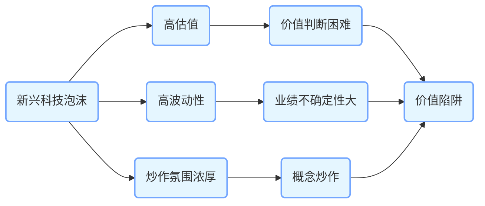

# 彼得林奇的“价值陷阱”在新兴科技泡沫中的识别技巧

> 关键词：彼得林奇、价值陷阱、新兴科技泡沫、识别技巧、投资分析

> 摘要：本文聚焦于彼得林奇提出的“价值陷阱”概念，深入探讨其在新兴科技泡沫环境下的识别技巧。通过介绍背景知识，阐述核心概念及其联系，分析核心算法原理与操作步骤，引入数学模型和公式进行说明，结合项目实战案例，探讨实际应用场景，推荐相关工具和资源，最后总结未来发展趋势与挑战，并对常见问题进行解答。旨在帮助投资者更好地理解和应对新兴科技泡沫中的价值陷阱，提高投资决策的准确性和安全性。

## 1. 背景介绍 
### 1.1 目的和范围
随着科技的飞速发展，新兴科技领域不断涌现出各种投资机会。然而，新兴科技市场往往伴随着高度的不确定性和波动性，容易形成泡沫。在这样的市场环境中，投资者可能会陷入彼得林奇所说的“价值陷阱”，即看似具有投资价值的资产，实际上却隐藏着巨大的风险。本文的目的是深入研究彼得林奇的“价值陷阱”理论，并提供在新兴科技泡沫中识别这些陷阱的实用技巧，帮助投资者避免不必要的损失，提高投资收益。

本文的范围涵盖了新兴科技领域的多个方面，包括但不限于人工智能、区块链、生物技术、新能源等热门行业。通过对这些行业的分析，探讨“价值陷阱”的表现形式和识别方法。

### 1.2 预期读者
本文的预期读者主要包括各类投资者，无论是个人投资者还是机构投资者，都可以从本文中获得有关新兴科技投资的有价值信息。此外，金融分析师、投资顾问以及对新兴科技市场感兴趣的研究人员也可以参考本文的内容，加深对“价值陷阱”和新兴科技泡沫的理解。

### 1.3 文档结构概述
本文将按照以下结构进行组织：
- 核心概念与联系：介绍彼得林奇的“价值陷阱”概念以及新兴科技泡沫的相关知识，并阐述它们之间的联系。
- 核心算法原理 & 具体操作步骤：运用Python代码详细讲解识别“价值陷阱”的算法原理和具体操作步骤。
- 数学模型和公式 & 详细讲解 & 举例说明：引入相关的数学模型和公式，对识别方法进行详细讲解，并通过实际例子进行说明。
- 项目实战：代码实际案例和详细解释说明：通过实际项目案例，展示如何运用识别技巧进行投资分析。
- 实际应用场景：探讨“价值陷阱”识别技巧在不同新兴科技领域的实际应用场景。
- 工具和资源推荐：推荐学习资源、开发工具框架以及相关论文著作，帮助读者进一步深入学习。
- 总结：未来发展趋势与挑战：总结新兴科技泡沫中“价值陷阱”识别的未来发展趋势和面临的挑战。
- 附录：常见问题与解答：解答读者在学习和应用过程中可能遇到的常见问题。
- 扩展阅读 & 参考资料：提供扩展阅读的建议和参考资料，方便读者进一步研究。

### 1.4 术语表
#### 1.4.1 核心术语定义
- **价值陷阱**：指投资者基于传统的价值评估方法，认为某些资产价格被低估而具有投资价值，但实际上这些资产由于各种原因（如行业衰退、公司基本面恶化等）并不具备真正的投资价值，投资者买入后可能会遭受损失。
- **新兴科技泡沫**：指在新兴科技领域，由于投资者对新技术的过度乐观和追捧，导致相关资产价格大幅上涨，远远超过其内在价值，形成泡沫。当泡沫破裂时，资产价格会大幅下跌。
- **内在价值**：指资产本身所具有的真实价值，通常通过对资产的未来现金流、盈利能力等因素进行评估得出。

#### 1.4.2 相关概念解释
- **市盈率（P/E）**：指股票价格与每股收益的比率，是衡量股票估值的常用指标之一。较高的市盈率可能意味着股票被高估，较低的市盈率可能意味着股票被低估，但需要结合其他因素进行综合分析。
- **市净率（P/B）**：指股票价格与每股净资产的比率，反映了股票价格相对于净资产的倍数。市净率较低的股票可能具有一定的投资价值，但也需要考虑行业特点和公司基本面。
- **现金流折现模型（DCF）**：一种评估资产内在价值的方法，通过预测资产未来的现金流，并将其折现到当前时刻，得出资产的内在价值。

#### 1.4.3 缩略词列表
- **P/E**：市盈率（Price-to-Earnings Ratio）
- **P/B**：市净率（Price-to-Book Ratio）
- **DCF**：现金流折现模型（Discounted Cash Flow Model）

## 2. 核心概念与联系 
### 2.1 彼得林奇的“价值陷阱”概念
彼得林奇是美国著名的投资家，他在投资实践中发现，很多投资者会被一些看似便宜的股票所吸引，认为这些股票具有投资价值。然而，这些股票往往存在各种问题，如公司业绩下滑、行业竞争激烈等，导致其价格虽然看似低廉，但实际上并不值得投资。这种情况被彼得林奇称为“价值陷阱”。

“价值陷阱”的形成原因主要有以下几点：
- **行业衰退**：某些行业由于技术进步、市场需求变化等原因，逐渐走向衰退。处于这些行业的公司，即使其股票价格看似很低，也可能因为行业前景不佳而难以实现价值提升。
- **公司基本面恶化**：公司可能由于管理不善、财务造假、产品竞争力下降等原因，导致其业绩下滑、盈利能力减弱。投资者如果只关注股票价格而忽略了公司基本面的变化，就容易陷入“价值陷阱”。
- **市场情绪影响**：在市场低迷时期，投资者往往会对股票价格过度悲观，导致一些优质股票的价格被低估。而在市场狂热时期，投资者又会对新兴科技股票过度乐观，忽视了其中的风险。这种市场情绪的波动也容易导致投资者陷入“价值陷阱”。

### 2.2 新兴科技泡沫的特点
新兴科技泡沫是指在新兴科技领域，由于投资者对新技术的过度乐观和追捧，导致相关资产价格大幅上涨，远远超过其内在价值的现象。新兴科技泡沫通常具有以下特点：
- **高估值**：新兴科技公司的股票价格往往被市场高估，市盈率、市净率等估值指标远远高于传统行业。这是因为投资者对新兴科技的未来发展充满期待，愿意为其支付较高的价格。
- **高波动性**：新兴科技行业的发展具有很大的不确定性，技术创新、市场竞争等因素都可能导致公司的业绩出现大幅波动。因此，新兴科技股票的价格也具有较高的波动性，投资者面临的风险较大。
- **炒作氛围浓厚**：新兴科技领域往往容易引发市场的炒作热情，媒体、投资者等会对一些热门技术和公司进行大肆宣传和追捧。这种炒作氛围会进一步推动资产价格的上涨，加剧泡沫的形成。

### 2.3 “价值陷阱”与新兴科技泡沫的联系
在新兴科技泡沫环境下，“价值陷阱”更容易出现。一方面，新兴科技公司的估值往往较高，投资者很难准确判断其内在价值。如果投资者仅仅根据传统的估值指标（如市盈率、市净率等）来判断股票的投资价值，就容易被高估的价格所迷惑，陷入“价值陷阱”。另一方面，新兴科技行业的发展具有很大的不确定性，很多公司可能只是炒作概念，并没有实际的盈利能力和市场竞争力。投资者如果盲目跟风投资这些公司，也容易遭受损失。

下面是“价值陷阱”与新兴科技泡沫关系的Mermaid流程图：


从图中可以看出，新兴科技泡沫的高估值、高波动性和炒作氛围浓厚等特点，会导致投资者在价值判断上出现困难，增加了陷入“价值陷阱”的风险。

## 3. 核心算法原理 & 具体操作步骤 
### 3.1 算法原理
识别新兴科技泡沫中的“价值陷阱”可以采用多维度的分析方法，综合考虑公司的基本面、行业前景、估值水平等因素。下面我们将介绍一种基于财务指标和行业分析的算法原理。

#### 3.1.1 财务指标分析
财务指标是评估公司基本面的重要依据，常用的财务指标包括市盈率（P/E）、市净率（P/B）、净资产收益率（ROE）、现金流等。通过对这些指标的分析，可以判断公司的盈利能力、偿债能力和运营效率。

#### 3.1.2 行业分析
行业分析是判断公司前景的关键。需要了解行业的发展趋势、市场规模、竞争格局等因素。可以通过研究行业报告、分析竞争对手等方式进行行业分析。

#### 3.1.3 综合评估
将财务指标分析和行业分析的结果进行综合评估，判断公司是否存在“价值陷阱”。如果公司的财务指标表现不佳，且所处行业前景黯淡，那么该公司很可能存在“价值陷阱”。

### 3.2 Python代码实现
```python
import pandas as pd

# 假设我们有一个包含公司财务数据和行业信息的DataFrame
# 示例数据
data = {
    '公司名称': ['公司A', '公司B', '公司C'],
    '市盈率': [30, 10, 50],
    '市净率': [3, 1, 5],
    '净资产收益率': [0.1, 0.2, 0.05],
    '行业前景': ['一般', '良好', '不佳']
}

df = pd.DataFrame(data)

# 定义一个函数来判断是否存在价值陷阱
def identify_value_trap(row):
    # 假设市盈率大于40，市净率大于4，净资产收益率小于0.1，且行业前景不佳为价值陷阱
    if row['市盈率'] > 40 and row['市净率'] > 4 and row['净资产收益率'] < 0.1 and row['行业前景'] == '不佳':
        return True
    else:
        return False

# 应用函数到DataFrame的每一行
df['是否价值陷阱'] = df.apply(identify_value_trap, axis=1)

print(df)
```

### 3.3 具体操作步骤
#### 3.3.1 数据收集
收集公司的财务报表、行业报告等相关数据。可以通过金融数据提供商（如Wind、东方财富等）、公司官网等渠道获取数据。

#### 3.3.2 数据预处理
对收集到的数据进行清洗和整理，去除缺失值、异常值等。将数据转换为适合分析的格式。

#### 3.3.3 指标计算
根据收集到的数据，计算所需的财务指标（如市盈率、市净率、净资产收益率等）。

#### 3.3.4 行业分析
研究行业的发展趋势、市场规模、竞争格局等因素。可以参考行业报告、专家意见等。

#### 3.3.5 综合评估
将财务指标分析和行业分析的结果进行综合评估，判断公司是否存在“价值陷阱”。

## 4. 数学模型和公式 & 详细讲解 & 举例说明 
### 4.1 市盈率（P/E）模型
市盈率是衡量股票估值的常用指标之一，其计算公式为：
$$P/E = \frac{股票价格}{每股收益}$$

市盈率反映了投资者为获取公司每一元盈利所愿意支付的价格。一般来说，市盈率较高的股票可能被高估，市盈率较低的股票可能被低估。但需要注意的是，不同行业的市盈率水平可能存在较大差异，因此在使用市盈率进行估值时，需要结合行业特点进行分析。

例如，某公司的股票价格为50元，每股收益为2元，则该公司的市盈率为：
$$P/E = \frac{50}{2} = 25$$

### 4.2 市净率（P/B）模型
市净率是衡量股票价格相对于净资产的倍数，其计算公式为：
$$P/B = \frac{股票价格}{每股净资产}$$

市净率反映了投资者为获取公司每一元净资产所愿意支付的价格。市净率较低的股票可能具有一定的投资价值，但也需要考虑行业特点和公司基本面。

例如，某公司的股票价格为30元，每股净资产为10元，则该公司的市净率为：
$$P/B = \frac{30}{10} = 3$$

### 4.3 现金流折现模型（DCF）
现金流折现模型是一种评估资产内在价值的方法，其基本原理是将资产未来的现金流折现到当前时刻，得出资产的内在价值。其计算公式为：
$$V = \sum_{t=1}^{n} \frac{CF_t}{(1 + r)^t}$$

其中，$V$ 表示资产的内在价值，$CF_t$ 表示第 $t$ 期的现金流，$r$ 表示折现率，$n$ 表示现金流的期数。

例如，某公司预计未来三年的现金流分别为100万元、120万元和150万元，折现率为10%，则该公司的内在价值为：
$$V = \frac{100}{(1 + 0.1)^1} + \frac{120}{(1 + 0.1)^2} + \frac{150}{(1 + 0.1)^3} \approx 295.42$$（万元）

### 4.4 综合评估模型
在识别“价值陷阱”时，可以综合考虑多个指标，建立综合评估模型。例如，可以采用加权平均的方法，对市盈率、市净率、净资产收益率等指标进行加权平均，得出一个综合评估得分。其计算公式为：
$$Score = w_1 \times P/E + w_2 \times P/B + w_3 \times ROE + \cdots$$

其中，$Score$ 表示综合评估得分，$w_i$ 表示第 $i$ 个指标的权重，$P/E$、$P/B$、$ROE$ 等表示相应的指标值。

例如，假设市盈率的权重为0.3，市净率的权重为0.3，净资产收益率的权重为0.4，某公司的市盈率为20，市净率为2，净资产收益率为0.15，则该公司的综合评估得分为：
$$Score = 0.3 \times 20 + 0.3 \times 2 + 0.4 \times 0.15 = 6 + 0.6 + 0.06 = 6.66$$

通过综合评估得分，可以对公司的投资价值进行更全面的评估，判断是否存在“价值陷阱”。

## 5. 项目实战：代码实际案例和详细解释说明 
### 5.1  开发环境搭建
#### 5.1.1 安装Python
首先需要安装Python环境，建议使用Python 3.x版本。可以从Python官方网站（https://www.python.org/downloads/）下载并安装。

#### 5.1.2 安装必要的库
在识别“价值陷阱”的项目中，需要使用一些Python库，如pandas、numpy等。可以使用以下命令进行安装：
```sh
pip install pandas numpy
```

### 5.2  源代码详细实现和代码解读
```python
import pandas as pd
import numpy as np

# 模拟数据
data = {
    '公司名称': ['科技公司A', '科技公司B', '科技公司C', '科技公司D'],
    '市盈率': [50, 20, 80, 15],
    '市净率': [5, 2, 6, 1],
    '净资产收益率': [0.08, 0.15, 0.05, 0.2],
    '行业前景评分': [2, 4, 1, 5]  # 1-5分，分数越高前景越好
}

df = pd.DataFrame(data)

# 定义评估函数
def evaluate_value_trap(row):
    # 设定阈值
    pe_threshold = 60
    pb_threshold = 5
    roe_threshold = 0.1
    industry_score_threshold = 3

    # 评估条件
    pe_condition = row['市盈率'] < pe_threshold
    pb_condition = row['市净率'] < pb_threshold
    roe_condition = row['净资产收益率'] > roe_threshold
    industry_condition = row['行业前景评分'] > industry_score_threshold

    # 判断是否为价值陷阱
    if pe_condition and pb_condition and roe_condition and industry_condition:
        return False
    else:
        return True

# 应用评估函数
df['是否价值陷阱'] = df.apply(evaluate_value_trap, axis=1)

# 输出结果
print(df)
```

### 5.3  代码解读与分析
#### 5.3.1 数据模拟
使用字典 `data` 模拟了四家科技公司的财务数据和行业前景评分，并将其转换为 `pandas` 的 `DataFrame` 对象 `df`。

#### 5.3.2 评估函数定义
定义了 `evaluate_value_trap` 函数，用于评估每家公司是否为价值陷阱。在函数中，设定了市盈率、市净率、净资产收益率和行业前景评分的阈值。根据这些阈值，判断每家公司是否满足评估条件。如果满足所有条件，则认为该公司不是价值陷阱；否则，认为该公司是价值陷阱。

#### 5.3.3 应用评估函数
使用 `apply` 方法将评估函数应用到 `DataFrame` 的每一行，得到每家公司是否为价值陷阱的判断结果，并将结果添加到 `DataFrame` 中。

#### 5.3.4 结果输出
最后，打印输出包含判断结果的 `DataFrame`，方便查看每家公司的评估情况。

通过这个项目实战案例，可以清晰地看到如何使用Python代码对新兴科技公司进行“价值陷阱”的识别。在实际应用中，可以根据具体情况调整阈值和评估条件，以提高识别的准确性。

## 6. 实际应用场景 
### 6.1 人工智能行业
在人工智能行业，新兴科技泡沫较为常见。很多人工智能公司在发展初期会受到市场的高度关注和追捧，其股票价格可能会大幅上涨。然而，其中一些公司可能只是炒作概念，并没有实际的技术实力和商业应用。投资者在投资人工智能公司时，可以运用“价值陷阱”识别技巧，对公司的技术研发能力、市场份额、盈利能力等进行综合评估。例如，通过分析公司的研发投入、专利数量、客户群体等指标，判断公司是否具有真正的核心竞争力。如果一家人工智能公司的市盈率过高，而研发投入不足，市场份额较小，那么它很可能存在“价值陷阱”。

### 6.2 区块链行业
区块链行业也是新兴科技泡沫的高发区。区块链技术具有去中心化、不可篡改等特点，被认为具有广阔的应用前景。然而，目前市场上存在大量的区块链项目，其中不乏一些欺诈和炒作项目。投资者在投资区块链项目时，需要仔细分析项目的技术架构、商业模式、团队背景等因素。例如，查看项目的白皮书，了解其技术实现细节和应用场景；考察项目团队的技术能力和行业经验。如果一个区块链项目的白皮书内容模糊，团队成员缺乏相关经验，而项目代币价格却大幅上涨，那么这个项目很可能是一个“价值陷阱”。

### 6.3 生物技术行业
生物技术行业的发展具有高风险、高回报的特点。新兴的生物技术公司在研发新药、基因治疗等领域可能会取得重大突破，但也可能面临研发失败的风险。投资者在投资生物技术公司时，需要关注公司的研发管线、临床试验进展、药品审批情况等因素。例如，分析公司的在研药物数量、药物的治疗领域、临床试验的阶段和结果等。如果一家生物技术公司的研发管线薄弱，临床试验进展不顺利，而股票价格却被高估，那么它可能存在“价值陷阱”。

### 6.4 新能源行业
新能源行业是近年来的热门投资领域，包括太阳能、风能、电动汽车等细分行业。随着全球对环境保护和可持续发展的重视，新能源行业得到了快速发展。然而，新能源行业也存在产能过剩、技术更新换代快等问题。投资者在投资新能源公司时，需要考虑公司的技术优势、市场份额、成本控制能力等因素。例如，比较不同电动汽车公司的电池技术、续航里程、销售价格等指标。如果一家新能源公司的技术落后，市场份额较小，而生产成本较高，那么它可能会陷入“价值陷阱”。

## 7. 工具和资源推荐
### 7.1 学习资源推荐
#### 7.1.1 书籍推荐
- 《彼得林奇的成功投资》：彼得林奇的经典著作，详细介绍了他的投资理念和方法，对于理解“价值陷阱”和投资分析具有重要的参考价值。
- 《聪明的投资者》：本杰明·格雷厄姆的代表作，被誉为投资界的圣经。书中阐述了价值投资的基本原则和方法，对投资者具有深远的影响。
- 《金融炼金术》：乔治·索罗斯的著作，探讨了金融市场的运行规律和泡沫形成的机制，对于理解新兴科技泡沫和“价值陷阱”有一定的帮助。

#### 7.1.2 在线课程
- Coursera上的“投资学原理”：由知名高校教授授课，系统介绍了投资学的基本原理和方法，包括资产估值、风险评估等内容。
- edX上的“金融市场”：提供了金融市场的全面知识，包括股票市场、债券市场、衍生品市场等，有助于投资者了解市场动态和投资机会。
- 网易云课堂上的“新兴科技投资分析”：专门针对新兴科技领域的投资分析课程，介绍了新兴科技行业的特点和投资策略。

#### 7.1.3 技术博客和网站
- 雪球网：国内知名的投资社区，提供了丰富的股票分析、投资策略等内容，投资者可以在这里交流经验、分享观点。
- 东方财富网：提供全面的金融信息和数据服务，包括股票行情、财经新闻、研究报告等，是投资者获取信息的重要渠道。
- Seeking Alpha：国外知名的金融博客网站，汇集了众多专业投资者和分析师的文章，对全球金融市场和投资机会进行深入分析。

### 7.2 开发工具框架推荐
#### 7.2.1 IDE和编辑器
- PyCharm：一款专业的Python集成开发环境，提供了丰富的代码编辑、调试、分析等功能，适合Python开发者使用。
- Jupyter Notebook：一个交互式的编程环境，支持多种编程语言，特别适合数据探索和分析。可以方便地进行代码编写、运行和结果展示。
- Visual Studio Code：一款轻量级的代码编辑器，支持多种编程语言和插件扩展。具有丰富的代码高亮、自动补全、调试等功能，深受开发者喜爱。

#### 7.2.2 调试和性能分析工具
- PDB：Python自带的调试器，可以帮助开发者在代码运行过程中进行调试，查看变量值、执行流程等。
- cProfile：Python的性能分析工具，可以分析代码的运行时间和函数调用情况，帮助开发者找出性能瓶颈。
- Py-Spy：一个简单易用的Python性能分析工具，可以实时查看Python程序的CPU使用率和函数调用情况。

#### 7.2.3 相关框架和库
- Pandas：Python中用于数据处理和分析的强大库，提供了丰富的数据结构和函数，方便进行数据清洗、整理、统计分析等操作。
- Numpy：Python中用于科学计算的基础库，提供了高效的多维数组对象和数学函数，广泛应用于数据分析、机器学习等领域。
- Scikit-learn：Python中常用的机器学习库，提供了丰富的机器学习算法和工具，如分类、回归、聚类等算法，以及数据预处理、模型评估等功能。

### 7.3 相关论文著作推荐
#### 7.3.1 经典论文
- “Efficient Capital Markets: A Review of Theory and Empirical Work”（有效资本市场：理论与实证研究综述）：由尤金·法玛（Eugene F. Fama）撰写，是有效市场假说的经典论文，对金融市场的效率和信息传播进行了深入探讨。
- “The Capital Asset Pricing Model: Theory and Evidence”（资本资产定价模型：理论与实证）：对资本资产定价模型进行了详细的介绍和分析，是现代金融理论的重要基础。
- “Behavioral Finance: Past Battles and Future Engagements”（行为金融学：过去的斗争与未来的挑战）：探讨了投资者的行为偏差和心理因素对金融市场的影响，为理解市场泡沫和“价值陷阱”提供了新的视角。

#### 7.3.2 最新研究成果
- 关注顶级金融学术期刊，如《Journal of Finance》（金融杂志）、《Review of Financial Studies》（金融研究评论）等，这些期刊发表了大量关于金融市场和投资领域的最新研究成果。
- 参加金融学术会议，如美国金融协会年会（AFA Annual Meeting）、欧洲金融协会年会（EFA Annual Meeting）等，与国内外的专家学者交流，了解最新的研究动态。

#### 7.3.3 应用案例分析
- 《金融市场案例分析》：通过实际案例分析，介绍了金融市场中的各种现象和问题，包括泡沫形成、危机爆发等，对于理解新兴科技泡沫和“价值陷阱”具有一定的参考价值。
- 各大金融机构发布的研究报告，如高盛、摩根士丹利等投资银行的研究报告，通常会对新兴科技行业进行深入分析，并提供投资建议和案例分析。

## 8. 总结：未来发展趋势与挑战
### 8.1 未来发展趋势
#### 8.1.1 技术创新加速
随着科技的不断进步，新兴科技领域的技术创新将加速发展。新的技术和概念不断涌现，如人工智能、区块链、量子计算等，将为投资者带来更多的投资机会。同时，技术创新也将推动新兴科技行业的快速发展，改变传统行业的格局。

#### 8.1.2 监管加强
为了防范新兴科技泡沫和金融风险，监管机构将加强对新兴科技行业的监管。监管政策将更加严格，对新兴科技公司的上市标准、信息披露等方面提出更高的要求。这将有助于提高市场的透明度和稳定性，保护投资者的利益。

#### 8.1.3 投资者教育普及
随着投资者对新兴科技投资的关注度不断提高，投资者教育将得到更广泛的普及。投资者将更加注重学习投资知识和技巧，提高自身的投资能力和风险意识。这将有助于减少投资者陷入“价值陷阱”的可能性，促进市场的健康发展。

### 8.2 面临的挑战
#### 8.2.1 技术不确定性
新兴科技行业的技术发展具有很大的不确定性。新技术可能面临研发失败、应用推广困难等问题。投资者很难准确判断一项新技术的发展前景和商业价值，增加了投资决策的难度。

#### 8.2.2 市场炒作风险
新兴科技领域容易引发市场的炒作热情，一些公司可能会夸大其技术实力和商业前景，吸引投资者的资金。投资者如果缺乏理性判断，容易被市场炒作所迷惑，陷入“价值陷阱”。

#### 8.2.3 数据质量和分析难度
在识别“价值陷阱”时，需要大量的财务数据和行业信息。然而，数据的质量和可靠性可能存在问题，数据的收集和整理也需要耗费大量的时间和精力。此外，对数据的分析和解读也需要专业的知识和技能，投资者可能面临一定的困难。

## 9. 附录：常见问题与解答
### 9.1 如何判断一个新兴科技公司是否存在“价值陷阱”？
判断一个新兴科技公司是否存在“价值陷阱”需要综合考虑多个因素。可以从公司的基本面、行业前景、估值水平等方面进行分析。具体来说，可以关注公司的财务指标（如市盈率、市净率、净资产收益率等）、技术研发能力、市场份额、商业模式、团队背景等。同时，要了解行业的发展趋势、市场规模、竞争格局等情况。如果公司的财务指标表现不佳，行业前景黯淡，而估值却过高，那么该公司很可能存在“价值陷阱”。

### 9.2 新兴科技泡沫一定会破裂吗？
新兴科技泡沫不一定会破裂，但破裂的可能性较大。新兴科技泡沫是由于投资者对新技术的过度乐观和追捧，导致资产价格大幅上涨，远远超过其内在价值。当市场出现不利因素（如技术发展不及预期、监管政策收紧等）时，投资者的信心可能会受到打击，资产价格可能会大幅下跌，泡沫就会破裂。然而，如果新兴科技能够实现技术突破和商业应用，推动行业的持续发展，那么泡沫也有可能逐渐消化，不会破裂。

### 9.3 如何避免陷入新兴科技泡沫中的“价值陷阱”？
为了避免陷入新兴科技泡沫中的“价值陷阱”，投资者可以采取以下措施：
- 加强学习：学习投资知识和技巧，了解新兴科技行业的特点和发展规律，提高自身的投资能力和风险意识。
- 深入研究：对投资的公司进行深入研究，了解其基本面、技术实力、商业模式等情况。同时，要关注行业的发展趋势和竞争格局。
- 分散投资：不要把所有的资金都投入到新兴科技领域，要进行分散投资，降低投资风险。
- 理性投资：不要盲目跟风投资，要保持理性，根据自己的风险承受能力和投资目标进行投资决策。

### 9.4 识别“价值陷阱”的方法是否适用于所有新兴科技行业？
识别“价值陷阱”的方法适用于大多数新兴科技行业，但不同行业可能需要根据其特点进行调整。例如，人工智能行业更注重技术研发能力和数据资源，区块链行业更关注技术架构和商业模式，生物技术行业更重视研发管线和临床试验进展。因此，在应用识别方法时，需要结合行业的特点，选择合适的指标和评估方法。

## 10. 扩展阅读 & 参考资料
### 10.1 扩展阅读
- 《创新者的窘境》：探讨了创新对企业和行业的影响，以及企业如何应对创新带来的挑战。对于理解新兴科技行业的发展和竞争具有重要的启示。
- 《技术的本质》：从哲学和科学的角度深入探讨了技术的本质和发展规律，有助于投资者更好地理解新兴科技的发展趋势。
- 《黑天鹅：如何应对不可预知的未来》：介绍了黑天鹅事件的特点和影响，以及如何在不确定的环境中进行决策。对于投资者应对新兴科技行业的不确定性具有一定的帮助。

### 10.2 参考资料
- 彼得林奇的相关著作和演讲资料，如《战胜华尔街》等。
- 各大金融数据提供商（如Wind、东方财富等）提供的金融数据和研究报告。
- 行业协会和研究机构发布的新兴科技行业报告，如人工智能协会、区块链研究中心等。