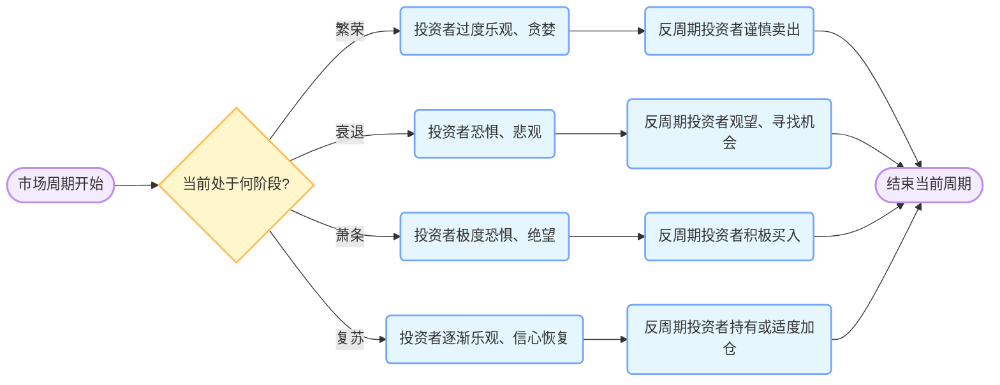

# 彼得林奇的“反周期”投资心理建设

> 关键词：彼得林奇、反周期投资、投资心理、市场周期、情绪管理、价值投资、风险管理

> 摘要：本文聚焦于彼得林奇的“反周期”投资心理建设，深入探讨其在投资领域的重要性和实际应用。首先介绍相关背景，包括目的、预期读者等内容。接着阐述核心概念，分析反周期投资与市场周期、投资者心理的联系，并通过流程图呈现其逻辑关系。详细讲解核心算法原理，结合Python代码示例说明如何进行相关分析。同时给出数学模型和公式，辅以具体例子加深理解。通过项目实战，展示代码实现和解读过程。探讨实际应用场景，为投资者提供参考。推荐学习资源、开发工具框架以及相关论文著作，助力读者进一步研究。最后总结未来发展趋势与挑战，解答常见问题，并提供扩展阅读和参考资料，帮助投资者更好地理解和运用彼得林奇的“反周期”投资心理，提升投资能力和心理素质。

## 1. 背景介绍 
### 1.1 目的和范围
本文章的主要目的是深入剖析彼得林奇的“反周期”投资心理建设，旨在帮助投资者理解并掌握这种独特的投资心理策略，提升在投资过程中的心理素质和决策能力。范围涵盖了从理论基础的讲解，包括核心概念、算法原理、数学模型等，到实际应用场景的探讨，以及相关工具和资源的推荐等多个方面，全面且系统地对彼得林奇的“反周期”投资心理进行研究和阐述。

### 1.2 预期读者
预期读者包括广大的个人投资者，无论是初涉投资领域的新手，还是有一定投资经验的老手，都能从本文中获取有价值的信息。同时，金融从业者、投资分析师、研究学者等也可将本文作为参考资料，进一步深入研究投资心理和投资策略相关内容。

### 1.3 文档结构概述
本文首先介绍背景信息，让读者对文章的目的、读者对象和整体结构有初步了解。接着阐述核心概念与联系，通过文本示意图和流程图清晰展示反周期投资心理的相关原理。详细讲解核心算法原理和具体操作步骤，并结合Python代码进行说明。给出数学模型和公式，通过举例加深理解。进行项目实战，包括开发环境搭建、源代码实现和代码解读。探讨实际应用场景，为投资者提供实际操作的参考。推荐学习资源、开发工具框架和相关论文著作，帮助读者进一步深入学习。最后总结未来发展趋势与挑战，解答常见问题，并提供扩展阅读和参考资料。

### 1.4 术语表
#### 1.4.1 核心术语定义
- **反周期投资**：指投资者在市场处于不同周期阶段时，采取与市场普遍趋势相反的投资策略。例如在市场低迷时积极买入，在市场过热时谨慎卖出。
- **市场周期**：市场价格和经济活动呈现出的周期性变化，通常包括繁荣、衰退、萧条和复苏四个阶段。
- **投资心理**：投资者在投资决策过程中所表现出的心理状态和思维方式，包括恐惧、贪婪、乐观、悲观等情绪。

#### 1.4.2 相关概念解释
- **价值投资**：一种基于对企业内在价值的评估进行投资的策略，强调寻找被低估的股票，长期持有以获取价值回归带来的收益。反周期投资与价值投资有一定的关联，在市场周期的低谷阶段，往往更容易发现被低估的股票，从而为反周期投资提供机会。
- **情绪管理**：在投资过程中，投资者对自己情绪的控制和调节能力。由于市场的波动会引发投资者的各种情绪，如恐惧和贪婪，良好的情绪管理对于做出理性的投资决策至关重要。

#### 1.4.3 缩略词列表
- **PE**：市盈率（Price-to-Earnings Ratio），是股票价格除以每股收益的比率，用于衡量股票的估值水平。
- **PB**：市净率（Price-to-Book Ratio），是股票价格与每股净资产的比率，反映了股票价格相对于净资产的倍数。

## 2. 核心概念与联系 
### 核心概念原理
彼得林奇的“反周期”投资心理建设基于对市场周期的深刻理解和对投资者心理的准确把握。市场周期是经济活动和市场价格波动的自然规律，而投资者的心理往往会受到市场周期的影响，在市场繁荣时过度乐观，在市场衰退时过度悲观。反周期投资就是要克服这种随波逐流的心理，在市场周期的不同阶段做出理性的投资决策。

在市场低迷阶段，大多数投资者因为恐惧而抛售股票，导致股价下跌。此时，反周期投资者会保持冷静，通过深入研究和分析，发现那些被市场低估但具有长期投资价值的股票，并果断买入。相反，在市场过热阶段，投资者往往被贪婪冲昏头脑，盲目追高。反周期投资者则会保持警惕，适时卖出股票，锁定收益。

### 架构的文本示意图
```plaintext
市场周期
|-- 繁荣阶段
|   |-- 投资者心理：过度乐观、贪婪
|   |-- 反周期投资策略：谨慎卖出
|-- 衰退阶段
|   |-- 投资者心理：恐惧、悲观
|   |-- 反周期投资策略：观望、寻找机会
|-- 萧条阶段
|   |-- 投资者心理：极度恐惧、绝望
|   |-- 反周期投资策略：积极买入
|-- 复苏阶段
|   |-- 投资者心理：逐渐乐观、信心恢复
|   |-- 反周期投资策略：持有或适度加仓
```

### Mermaid 流程图


## 3. 核心算法原理 & 具体操作步骤 
### 核心算法原理
在反周期投资中，关键是要判断市场所处的周期阶段。一种常见的方法是通过分析宏观经济指标和市场估值指标来进行判断。宏观经济指标如GDP增长率、通货膨胀率、利率等可以反映经济的整体运行状况；市场估值指标如市盈率（PE）、市净率（PB）等可以反映市场的估值水平。

以下是一个简单的判断市场周期阶段的算法思路：
1. 收集宏观经济指标和市场估值指标的数据。
2. 根据历史数据和经验，设定不同周期阶段的指标阈值。
3. 将当前指标数据与阈值进行比较，判断市场所处的周期阶段。

### 具体操作步骤
1. **数据收集**：通过金融数据提供商、政府部门网站等渠道收集宏观经济指标和市场估值指标的数据。
2. **阈值设定**：参考历史数据和市场经验，设定不同周期阶段的指标阈值。例如，当市盈率低于某个阈值时，可能表示市场处于萧条阶段；当市盈率高于某个阈值时，可能表示市场处于繁荣阶段。
3. **判断周期阶段**：将当前收集到的指标数据与设定的阈值进行比较，根据比较结果判断市场所处的周期阶段。
4. **制定投资策略**：根据判断出的市场周期阶段，制定相应的反周期投资策略。例如，在萧条阶段积极买入，在繁荣阶段谨慎卖出。

### Python 源代码示例
```python
# 假设我们有一个包含市盈率数据的列表
pe_data = [10, 12, 15, 18, 20, 22, 25, 28, 30, 32]

# 设定不同周期阶段的市盈率阈值
depression_threshold = 12
prosperity_threshold = 28

# 判断市场周期阶段的函数
def judge_market_cycle(pe):
    if pe <= depression_threshold:
        return "萧条阶段"
    elif pe >= prosperity_threshold:
        return "繁荣阶段"
    else:
        return "其他阶段"

# 对每个市盈率数据进行判断
for pe in pe_data:
    cycle_stage = judge_market_cycle(pe)
    print(f"市盈率为 {pe} 时，市场处于 {cycle_stage}")
```

## 4. 数学模型和公式 & 详细讲解 & 举例说明 
### 数学模型和公式
在反周期投资中，我们可以使用一些数学模型和公式来辅助判断市场周期和评估投资价值。以下是一些常见的模型和公式：

#### 市盈率（PE）
市盈率是股票价格除以每股收益的比率，公式为：
$$PE = \frac{P}{E}$$
其中，$P$ 表示股票价格，$E$ 表示每股收益。

#### 市净率（PB）
市净率是股票价格与每股净资产的比率，公式为：
$$PB = \frac{P}{B}$$
其中，$P$ 表示股票价格，$B$ 表示每股净资产。

#### 简单移动平均线（SMA）
简单移动平均线是一种常用的技术分析工具，用于平滑价格数据，反映价格的趋势。公式为：
$$SMA_n = \frac{\sum_{i=0}^{n-1} P_{t-i}}{n}$$
其中，$SMA_n$ 表示 $n$ 期的简单移动平均线，$P_{t-i}$ 表示第 $t-i$ 期的价格，$n$ 表示移动平均的期数。

### 详细讲解
- **市盈率（PE）**：市盈率反映了投资者为获取每股收益所愿意支付的价格。一般来说，市盈率较低的股票可能被低估，具有投资价值；市盈率较高的股票可能被高估，存在投资风险。但需要注意的是，不同行业的市盈率水平可能存在差异，因此在使用市盈率进行估值时，需要结合行业特点进行分析。
- **市净率（PB）**：市净率反映了股票价格相对于净资产的倍数。市净率较低的股票可能具有较高的安全边际，因为即使公司破产清算，投资者也可能获得较高的回报。但同样需要注意的是，不同行业的市净率水平也可能存在差异。
- **简单移动平均线（SMA）**：简单移动平均线可以帮助投资者平滑价格数据，过滤掉短期波动的影响，更好地观察价格的趋势。当短期移动平均线向上穿过长期移动平均线时，可能表示价格趋势向上，是买入信号；当短期移动平均线向下穿过长期移动平均线时，可能表示价格趋势向下，是卖出信号。

### 举例说明
假设某股票的价格为 $20$ 元，每股收益为 $2$ 元，每股净资产为 $10$ 元。则该股票的市盈率为：
$$PE = \frac{20}{2} = 10$$
市净率为：
$$PB = \frac{20}{10} = 2$$
如果该股票的历史平均市盈率为 $15$，历史平均市净率为 $2.5$，则从市盈率和市净率的角度来看，该股票可能被低估，具有一定的投资价值。

再假设我们计算该股票的 $5$ 日简单移动平均线和 $20$ 日简单移动平均线。如果 $5$ 日简单移动平均线向上穿过 $20$ 日简单移动平均线，可能表示该股票的价格趋势向上，投资者可以考虑买入。

## 5. 项目实战：代码实际案例和详细解释说明 
### 5.1  开发环境搭建
在进行项目实战之前，需要搭建相应的开发环境。以下是具体步骤：

1. **安装 Python**：从 Python 官方网站（https://www.python.org/downloads/）下载并安装 Python 3.x 版本。
2. **安装必要的库**：使用 pip 命令安装以下必要的库：
    - **pandas**：用于数据处理和分析。
    - **numpy**：用于数值计算。
    - **matplotlib**：用于数据可视化。

```bash
pip install pandas numpy matplotlib
```

### 5.2  源代码详细实现和代码解读
以下是一个使用 Python 实现的反周期投资项目实战案例，通过分析股票的市盈率数据来判断市场周期阶段，并制定相应的投资策略。

```python
import pandas as pd
import numpy as np
import matplotlib.pyplot as plt

# 读取市盈率数据文件（假设数据文件为 pe_data.csv，包含日期和市盈率两列）
data = pd.read_csv('pe_data.csv')

# 设定不同周期阶段的市盈率阈值
depression_threshold = 12
prosperity_threshold = 28

# 判断市场周期阶段的函数
def judge_market_cycle(pe):
    if pe <= depression_threshold:
        return "萧条阶段"
    elif pe >= prosperity_threshold:
        return "繁荣阶段"
    else:
        return "其他阶段"

# 计算市场周期阶段
data['市场周期阶段'] = data['市盈率'].apply(judge_market_cycle)

# 制定投资策略
data['投资策略'] = np.where(data['市场周期阶段'] == '萧条阶段', '积极买入',
                          np.where(data['市场周期阶段'] == '繁荣阶段', '谨慎卖出', '持有'))

# 可视化市盈率数据和市场周期阶段
plt.figure(figsize=(12, 6))
plt.plot(data['日期'], data['市盈率'], label='市盈率')
plt.axhline(y=depression_threshold, color='g', linestyle='--', label='萧条阈值')
plt.axhline(y=prosperity_threshold, color='r', linestyle='--', label='繁荣阈值')
for i, row in data.iterrows():
    if row['市场周期阶段'] == '萧条阶段':
        plt.scatter(row['日期'], row['市盈率'], color='g', marker='o')
    elif row['市场周期阶段'] == '繁荣阶段':
        plt.scatter(row['日期'], row['市盈率'], color='r', marker='o')
plt.xlabel('日期')
plt.ylabel('市盈率')
plt.title('市盈率与市场周期阶段')
plt.legend()
plt.show()

# 输出投资策略
print(data[['日期', '市盈率', '市场周期阶段', '投资策略']])
```

### 5.3  代码解读与分析
1. **数据读取**：使用 `pandas` 库的 `read_csv` 函数读取包含市盈率数据的 CSV 文件。
2. **阈值设定**：设定不同周期阶段的市盈率阈值，用于判断市场周期阶段。
3. **判断市场周期阶段**：定义 `judge_market_cycle` 函数，根据市盈率数据判断市场所处的周期阶段，并将结果添加到数据框中。
4. **制定投资策略**：使用 `np.where` 函数根据市场周期阶段制定相应的投资策略，并将结果添加到数据框中。
5. **可视化**：使用 `matplotlib` 库绘制市盈率数据和市场周期阶段的可视化图表，方便观察市场周期的变化。
6. **输出结果**：输出包含日期、市盈率、市场周期阶段和投资策略的数据框，方便投资者查看和分析。

通过这个项目实战案例，投资者可以更好地理解如何使用 Python 进行反周期投资分析，根据市场周期阶段制定相应的投资策略。

## 6. 实际应用场景 
### 股票投资
在股票投资中，彼得林奇的“反周期”投资心理建设具有重要的应用价值。当市场处于萧条阶段时，大多数股票价格下跌，投资者情绪低落。此时，反周期投资者可以通过深入研究和分析，寻找那些被市场低估但具有长期投资价值的股票。例如，一些具有稳定现金流、良好品牌和行业竞争力的公司，在市场低迷时可能被错误定价，反周期投资者可以在此时买入这些股票，等待市场复苏时获得丰厚的回报。

相反，当市场处于繁荣阶段时，股票价格普遍上涨，投资者情绪高涨。反周期投资者则会保持警惕，适时卖出那些被高估的股票，锁定收益。避免在市场泡沫破裂时遭受重大损失。

### 基金投资
在基金投资中，反周期投资同样适用。当市场处于低迷阶段时，基金净值可能较低，此时投资者可以加大对优质基金的投资。例如，一些业绩稳定、管理团队优秀的股票型基金，在市场下跌时可能会出现较好的投资机会。投资者可以通过定期定额投资的方式，逐步积累基金份额，降低平均成本。

当市场处于繁荣阶段时，基金净值可能较高，投资者可以适当减少基金投资，或者将部分资金转换为债券型基金等较为稳健的品种，以降低投资风险。

### 房地产投资
在房地产投资中，市场也存在周期波动。当房地产市场处于低迷阶段时，房价下跌，购房者观望情绪浓厚。反周期投资者可以关注那些具有发展潜力的区域和优质的房产项目。例如，一些城市的新兴区域，随着基础设施的不断完善和经济的发展，未来房价可能有较大的上涨空间。反周期投资者可以在此时买入房产，等待市场回暖时获得资产增值。

当房地产市场处于繁荣阶段时，房价上涨过快，市场泡沫可能逐渐积累。反周期投资者则会谨慎决策，避免盲目跟风投资。可以考虑出售部分房产，锁定收益，或者等待市场调整后再寻找新的投资机会。

## 7. 工具和资源推荐
### 7.1 学习资源推荐
#### 7.1.1 书籍推荐
- 《彼得林奇的成功投资》：彼得林奇的经典著作，详细阐述了他的投资理念和方法，包括如何选择股票、如何分析公司等内容，对投资者具有很高的参考价值。
- 《聪明的投资者》：本杰明·格雷厄姆的著作，被誉为投资界的圣经。书中强调了价值投资的重要性，以及如何在投资中控制风险。
- 《金融炼金术》：乔治·索罗斯的著作，深入探讨了金融市场的运行规律和投资者的心理因素，对理解市场周期和反周期投资具有重要的启示作用。

#### 7.1.2 在线课程
- Coursera 平台上的“投资学原理”课程：由知名大学的教授授课，系统地介绍了投资学的基本原理和方法，包括资产定价、投资组合理论等内容。
- 网易云课堂上的“股票投资实战技巧”课程：结合实际案例，讲解股票投资的实战技巧和策略，对投资者具有很强的指导意义。

#### 7.1.3 技术博客和网站
- 雪球网：一个专业的投资交流社区，汇聚了众多投资者和投资专家。投资者可以在雪球网上分享投资经验、交流投资心得，获取最新的市场信息和投资策略。
- 东方财富网：提供丰富的金融资讯和数据服务，包括股票行情、基金净值、宏观经济数据等内容。投资者可以通过东方财富网了解市场动态，进行投资分析。

### 7.2 开发工具框架推荐
#### 7.2.1 IDE和编辑器
- PyCharm：一款专业的 Python 集成开发环境，具有代码编辑、调试、自动补全、代码分析等功能，方便开发者进行 Python 编程。
- Jupyter Notebook：一个交互式的开发环境，支持 Python、R 等多种编程语言。开发者可以在 Jupyter Notebook 中编写代码、运行代码、展示结果，非常适合进行数据分析和可视化。

#### 7.2.2 调试和性能分析工具
- pdb：Python 自带的调试工具，通过设置断点、单步执行等方式，帮助开发者查找代码中的错误。
- cProfile：Python 标准库中的性能分析工具，可以统计代码的执行时间和函数调用次数，帮助开发者优化代码性能。

#### 7.2.3 相关框架和库
- pandas：用于数据处理和分析的 Python 库，提供了丰富的数据结构和数据操作方法，如数据读取、数据清洗、数据统计等。
- numpy：用于数值计算的 Python 库，提供了高效的多维数组对象和各种数学函数，是科学计算和数据分析的基础库。
- matplotlib：用于数据可视化的 Python 库，提供了丰富的绘图函数和工具，如折线图、柱状图、散点图等，方便开发者将数据以直观的图表形式展示出来。

### 7.3 相关论文著作推荐
#### 7.3.1 经典论文
- Fama, E. F., & French, K. R. (1992). The cross-section of expected stock returns. Journal of Finance, 47(2), 427-465. 该论文提出了著名的 Fama-French 三因子模型，对股票收益率的影响因素进行了深入研究，为投资组合理论和资产定价提供了重要的理论基础。
- Sharpe, W. F. (1964). Capital asset prices: A theory of market equilibrium under conditions of risk. Journal of Finance, 19(3), 425-442. 该论文提出了资本资产定价模型（CAPM），揭示了资产预期收益率与市场风险之间的关系，是现代金融理论的重要基石之一。

#### 7.3.2 最新研究成果
- Barberis, N., & Thaler, R. H. (2003). A survey of behavioral finance. Handbook of the Economics of Finance, 1, 1053-1128. 该论文对行为金融学的研究成果进行了全面的综述，探讨了投资者心理和行为对金融市场的影响，为反周期投资心理建设提供了理论支持。
- Campbell, J. Y., & Shiller, R. J. (1988). The dividend-price ratio and expectations of future dividends and discount factors. Review of Financial Studies, 1(3), 195-228. 该论文研究了股息价格比与未来股息和贴现因子之间的关系，为股票估值和投资决策提供了新的视角。

#### 7.3.3 应用案例分析
- 一些知名投资机构和投资者的案例分析报告，如巴菲特、彼得林奇等的投资案例。这些案例详细介绍了他们的投资策略、决策过程和投资成果，对投资者具有很高的借鉴价值。

## 8. 总结：未来发展趋势与挑战
### 未来发展趋势
- **智能化投资**：随着人工智能和大数据技术的不断发展，智能化投资将成为未来的发展趋势。通过运用机器学习、深度学习等算法，对海量的金融数据进行分析和挖掘，可以更准确地判断市场周期和投资机会，为投资者提供更智能、更个性化的投资建议。
- **跨市场投资**：全球金融市场的互联互通日益加强，投资者将有更多的机会进行跨市场投资。反周期投资策略也将在更广泛的市场范围内得到应用，投资者可以通过配置不同市场、不同资产类别的投资组合，降低投资风险，提高投资收益。
- **社会责任投资**：越来越多的投资者开始关注企业的社会责任和可持续发展，社会责任投资将成为未来投资的重要方向。在反周期投资中，投资者不仅要考虑市场周期和投资价值，还要关注企业的环境、社会和治理（ESG）因素，选择具有良好社会形象和可持续发展能力的企业进行投资。

### 挑战
- **市场不确定性增加**：全球经济和政治环境的不确定性不断增加，如贸易摩擦、地缘政治冲突、疫情等因素，都会对金融市场产生重大影响。这使得市场周期的判断更加困难，反周期投资策略的实施面临更大的挑战。
- **投资者情绪波动加剧**：随着社交媒体和互联网的普及，信息传播速度加快，投资者情绪更容易受到影响。市场的短期波动可能引发投资者的过度反应，导致市场情绪波动加剧。这对投资者的情绪管理和心理素质提出了更高的要求。
- **技术更新换代快**：人工智能、大数据等技术的发展日新月异，投资者需要不断学习和掌握新的技术和方法，才能更好地运用智能化投资工具和反周期投资策略。这对投资者的学习能力和适应能力是一个巨大的挑战。

## 9. 附录：常见问题与解答
### 问题 1：如何准确判断市场周期阶段？
答：判断市场周期阶段需要综合考虑宏观经济指标、市场估值指标、投资者情绪等多个因素。可以参考历史数据和市场经验，设定不同周期阶段的指标阈值，将当前指标数据与阈值进行比较，从而判断市场所处的周期阶段。同时，还可以关注市场的供求关系、政策变化等因素，辅助判断市场周期。

### 问题 2：反周期投资是否适用于所有投资者？
答：反周期投资需要投资者具备较强的心理素质和投资分析能力。对于初涉投资领域的新手来说，可能较难准确判断市场周期和把握投资机会。因此，反周期投资并不适用于所有投资者。投资者应该根据自己的风险承受能力、投资经验和投资目标，选择适合自己的投资策略。

### 问题 3：在反周期投资中，如何控制风险？
答：在反周期投资中，可以通过以下方法控制风险：
- **分散投资**：将资金分散投资于不同的资产类别、行业和市场，降低单一资产或行业的风险。
- **设定止损点**：在投资前设定止损点，当投资损失达到一定程度时，及时止损，避免损失进一步扩大。
- **定期评估和调整投资组合**：定期对投资组合进行评估和调整，根据市场变化和投资目标，及时调整投资策略和资产配置。

### 问题 4：如何培养反周期投资的心理？
答：培养反周期投资的心理可以从以下几个方面入手：
- **学习投资知识**：了解投资的基本原理和方法，掌握市场周期的规律，增强对投资的信心。
- **控制情绪**：在投资过程中，保持冷静和理性，避免被恐惧和贪婪等情绪左右。可以通过冥想、运动等方式缓解压力，保持良好的心态。
- **积累经验**：通过实际投资操作，积累投资经验，提高自己的投资分析能力和决策能力。

## 10. 扩展阅读 & 参考资料
### 扩展阅读
- 《漫步华尔街》：作者通过幽默风趣的语言，深入浅出地介绍了投资的基本原理和方法，对投资者具有很高的启发作用。
- 《投资最重要的事》：霍华德·马克斯的著作，强调了投资中的风险控制和逆向思维，对反周期投资心理建设具有重要的参考价值。

### 参考资料
- 彼得林奇的官方网站和相关采访资料。
- 金融数据提供商的报告和研究成果，如 Bloomberg、Wind 等。
- 学术期刊和会议论文，如 Journal of Finance、Review of Financial Studies 等。