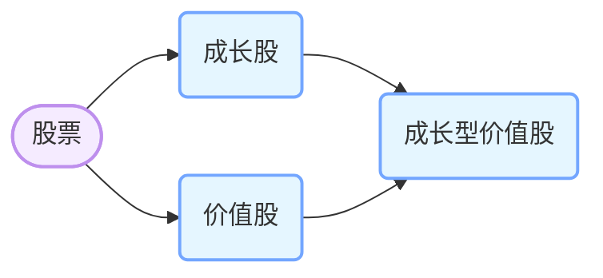

# 彼得林奇的“成长型价值股”概念

> 关键词：彼得林奇、成长型价值股、投资策略、股票分析、价值评估

> 摘要：本文深入探讨彼得林奇的“成长型价值股”概念。首先介绍该概念提出的背景，包括彼得林奇的投资成就及理念形成的时代背景。接着阐述成长型价值股的核心概念、与其他股票类型的联系，并给出相应的原理和架构示意图。详细讲解其核心算法原理与具体操作步骤，运用 Python 代码进行阐述，同时介绍相关的数学模型和公式并举例说明。通过项目实战，展示成长型价值股在实际投资中的应用，包括开发环境搭建、源代码实现与解读。分析成长型价值股的实际应用场景，推荐相关的学习资源、开发工具框架以及论文著作。最后总结其未来发展趋势与挑战，解答常见问题并提供扩展阅读与参考资料，帮助投资者更好地理解和运用这一概念进行投资决策。

## 1. 背景介绍 
### 1.1 目的和范围
彼得林奇是投资界的传奇人物，他管理的麦哲伦基金创造了惊人的业绩。“成长型价值股”概念是其投资理念的重要组成部分。本文的目的在于全面剖析这一概念，包括其定义、分析方法、应用场景等，帮助投资者深入理解这一概念，并将其应用于实际投资决策中。范围涵盖成长型价值股的理论基础、分析工具、实际案例以及未来发展趋势等方面。

### 1.2 预期读者
本文预期读者包括有一定投资基础的股民、金融从业者、投资研究人员以及对投资理论和实践感兴趣的人士。希望通过本文的讲解，读者能够对彼得林奇的“成长型价值股”概念有更深入的认识，并在实际投资中运用相关知识和方法。

### 1.3 文档结构概述
本文首先介绍背景知识，包括概念提出的目的、预期读者和文档结构。接着阐述成长型价值股的核心概念及其与其他股票类型的联系，通过示意图和流程图进行说明。然后详细讲解核心算法原理和具体操作步骤，结合 Python 代码进行解释。介绍相关的数学模型和公式，并举例说明。通过项目实战展示实际应用，包括开发环境搭建、源代码实现和代码解读。分析成长型价值股的实际应用场景，推荐学习资源、开发工具框架和相关论文著作。最后总结未来发展趋势与挑战，解答常见问题并提供扩展阅读与参考资料。

### 1.4 术语表
#### 1.4.1 核心术语定义
- **成长型价值股**：指那些既具有成长股的特征，即公司的盈利和销售额有较高的增长速度，又具有价值股的特点，即股票价格相对其内在价值被低估的股票。
- **成长股**：是指发行股票的公司正处在上升阶段，公司的销售额和利润额持续增长，并且其速度快于整个国家和本行业的增长。
- **价值股**：通常是指股价相对于公司的盈利、资产或现金流等基本面指标被低估的股票。

#### 1.4.2 相关概念解释
- **市盈率（PE）**：是指股票价格除以每股收益（EPS）的比率，反映了市场对公司盈利的预期和估值水平。
- **市净率（PB）**：是指股票价格与每股净资产的比率，用于衡量股票价格相对于公司净资产的高低。
- **PEG 指标**：即市盈率相对盈利增长比率，是用公司的市盈率除以公司的盈利增长速度，用于评估成长股的估值是否合理。

#### 1.4.3 缩略词列表
- **PE**：Price-to-Earnings Ratio（市盈率）
- **PB**：Price-to-Book Ratio（市净率）
- **PEG**：Price/Earnings to Growth Ratio（市盈率相对盈利增长比率）

## 2. 核心概念与联系 

### 2.1 成长型价值股的核心概念
成长型价值股是彼得林奇投资理念中的一个独特概念。它结合了成长股和价值股的优点。成长股的核心在于公司的高成长性，通常表现为销售额和利润的快速增长。这种增长可能源于公司所处行业的快速发展、新产品的推出、市场份额的扩大等因素。而价值股的关键在于其被市场低估的特性，即股票价格没有充分反映公司的内在价值。成长型价值股就是那些在具备高成长潜力的同时，股价又相对较低的股票。

### 2.2 与其他股票类型的联系
#### 2.2.1 与成长股的联系
成长型价值股和成长股都强调公司的成长潜力。然而，成长股可能更注重公司的增长速度，而不太关注其估值水平。一些成长股可能由于市场对其未来增长的过度乐观预期，导致股价被高估。而成长型价值股在关注成长的同时，更注重股票的估值合理性，要求股价相对其内在价值具有一定的安全边际。

#### 2.2.2 与价值股的联系
成长型价值股和价值股都关注股票的估值。但价值股可能更侧重于公司的现有资产和盈利能力，而对公司的未来成长预期相对较低。成长型价值股则在考虑估值的基础上，更强调公司的成长潜力，认为公司的未来增长将带来更大的价值提升。

### 2.3 核心概念原理和架构的文本示意图
| 概念层次 | 内容 |
| ---- | ---- |
| 上层概念 | 股票 |
| 中层概念 | 成长股、价值股 |
| 下层概念 | 成长型价值股 |

成长型价值股处于股票概念体系的下层，它融合了成长股和价值股的特征。从投资角度来看，成长型价值股既追求公司的成长带来的股价上升空间，又注重股票的估值安全，以降低投资风险。

### 2.4 Mermaid 流程图

该流程图清晰地展示了股票、成长股、价值股和成长型价值股之间的关系。股票是一个宽泛的概念，成长股和价值股是股票的两种不同类型，而成长型价值股是融合了成长股和价值股特征的一种特殊股票类型。

## 3. 核心算法原理 & 具体操作步骤 

### 3.1 核心算法原理
在判断一只股票是否为成长型价值股时，需要综合考虑多个因素。其中，PEG 指标是一个重要的参考指标。PEG 指标的计算公式为：$PEG = \frac{PE}{g}$，其中 $PE$ 是市盈率，$g$ 是公司的盈利增长率。一般来说，当 PEG 小于 1 时，股票可能被认为具有投资价值，因为这意味着公司的市盈率相对其盈利增长速度较低，股票可能被低估。

除了 PEG 指标，还需要考虑公司的市净率（PB）、净资产收益率（ROE）等指标。市净率反映了股票价格相对于公司净资产的高低，较低的市净率可能意味着股票被低估。净资产收益率则反映了公司运用自有资本的效率，较高的净资产收益率表明公司的盈利能力较强。

### 3.2 具体操作步骤
#### 3.2.1 数据收集
首先需要收集公司的财务数据，包括每股收益（EPS）、每股净资产（BPS）、净利润增长率等。这些数据可以从公司的财务报表、证券交易所网站、金融数据提供商等渠道获取。

#### 3.2.2 计算指标
根据收集到的数据，计算市盈率（$PE = \frac{股价}{每股收益}$）、市净率（$PB = \frac{股价}{每股净资产}$）、净资产收益率（$ROE = \frac{净利润}{净资产}$）和 PEG 指标。

#### 3.2.3 筛选股票
根据计算得到的指标，筛选出符合成长型价值股标准的股票。一般来说，可以设定 PEG 小于 1、市净率较低、净资产收益率较高等条件进行筛选。

#### 3.2.4 深入分析
对筛选出的股票进行深入分析，包括公司的行业前景、竞争优势、管理层能力等方面。评估公司的成长潜力和可持续性，以确定其是否真正具有投资价值。

### 3.3 Python 源代码详细阐述
```python
import pandas as pd

# 假设我们已经从数据提供商获取了以下数据
# 股票代码、股价、每股收益、每股净资产、净利润增长率
data = {
    'stock_code': ['000001', '000002', '000003'],
    'stock_price': [10, 20, 30],
    'eps': [1, 2, 3],
    'bps': [5, 10, 15],
    'net_profit_growth_rate': [0.2, 0.3, 0.4]
}

df = pd.DataFrame(data)

# 计算市盈率
df['pe'] = df['stock_price'] / df['eps']

# 计算市净率
df['pb'] = df['stock_price'] / df['bps']

# 计算 PEG 指标
df['peg'] = df['pe'] / (df['net_profit_growth_rate'] * 100)

# 筛选出 PEG 小于 1 的股票
growth_value_stocks = df[df['peg'] < 1]

print(growth_value_stocks)
```
在上述代码中，我们首先使用 Pandas 库创建了一个包含股票数据的 DataFrame。然后，根据公式计算了市盈率、市净率和 PEG 指标。最后，筛选出 PEG 小于 1 的股票，这些股票可能被认为是成长型价值股。

## 4. 数学模型和公式 & 详细讲解 & 举例说明 

### 4.1 数学模型和公式
#### 4.1.1 市盈率（PE）
$PE = \frac{P}{EPS}$
其中，$P$ 是股票价格，$EPS$ 是每股收益。市盈率反映了市场对公司盈利的预期和估值水平。较高的市盈率可能意味着市场对公司的未来增长预期较高，但也可能存在股价被高估的风险。

#### 4.1.2 市净率（PB）
$PB = \frac{P}{BPS}$
其中，$P$ 是股票价格，$BPS$ 是每股净资产。市净率用于衡量股票价格相对于公司净资产的高低。较低的市净率可能意味着股票被低估，但也可能反映公司的盈利能力较弱。

#### 4.1.3 净资产收益率（ROE）
$ROE = \frac{净利润}{净资产} \times 100\%$
净资产收益率反映了公司运用自有资本的效率，较高的净资产收益率表明公司的盈利能力较强。

#### 4.1.4 PEG 指标
$PEG = \frac{PE}{g}$
其中，$PE$ 是市盈率，$g$ 是公司的盈利增长率。PEG 指标综合考虑了公司的市盈率和盈利增长速度，用于评估成长股的估值是否合理。

### 4.2 详细讲解
#### 4.2.1 市盈率（PE）
市盈率是股票投资中常用的估值指标之一。不同行业的市盈率水平可能存在较大差异。一般来说，新兴行业的市盈率可能较高，因为市场对其未来增长预期较高；而传统行业的市盈率可能较低。在使用市盈率进行估值时，需要结合公司的行业特点、盈利增长情况等因素进行综合分析。

#### 4.2.2 市净率（PB）
市净率反映了股票价格与公司净资产的关系。对于一些重资产行业，如钢铁、煤炭等，市净率可能是一个重要的估值指标。较低的市净率可能意味着公司的资产被低估，但也需要考虑公司的资产质量和盈利能力。

#### 4.2.3 净资产收益率（ROE）
净资产收益率是衡量公司盈利能力的重要指标。较高的净资产收益率表明公司能够有效地利用自有资本创造利润。在分析公司的 ROE 时，需要考虑其稳定性和可持续性。

#### 4.2.4 PEG 指标
PEG 指标是对市盈率的一种补充和修正。它考虑了公司的盈利增长速度，使得不同增长速度的公司之间的估值具有可比性。一般来说，PEG 小于 1 被认为是比较理想的情况，表明股票的估值相对较低，具有一定的投资价值。

### 4.3 举例说明
假设公司 A 的股票价格为 20 元，每股收益为 2 元，每股净资产为 10 元，净利润增长率为 30%。

- 计算市盈率：$PE = \frac{20}{2} = 10$
- 计算市净率：$PB = \frac{20}{10} = 2$
- 计算净资产收益率：假设公司的净资产为 100 万元，净利润为 30 万元，则 $ROE = \frac{30}{100} \times 100\% = 30\%$
- 计算 PEG 指标：$PEG = \frac{10}{30} \approx 0.33$

从计算结果来看，公司 A 的 PEG 小于 1，市净率为 2，净资产收益率为 30%，表明该公司可能是一只成长型价值股。但在实际投资中，还需要进一步分析公司的行业前景、竞争优势等因素。

## 5. 项目实战：代码实际案例和详细解释说明 

### 5.1 开发环境搭建
#### 5.1.1 安装 Python
首先需要安装 Python 环境。可以从 Python 官方网站（https://www.python.org/downloads/）下载适合自己操作系统的 Python 安装包，并按照安装向导进行安装。

#### 5.1.2 安装必要的库
在 Python 环境中，需要安装一些必要的库，如 Pandas、Numpy 等。可以使用以下命令进行安装：
```sh
pip install pandas numpy
```

### 5.2 源代码详细实现和代码解读
```python
import pandas as pd
import numpy as np

# 模拟从数据提供商获取的股票数据
data = {
    'stock_code': ['000001', '000002', '000003', '000004', '000005'],
    'stock_price': [10, 20, 30, 40, 50],
    'eps': [1, 2, 3, 4, 5],
    'bps': [5, 10, 15, 20, 25],
    'net_profit_growth_rate': [0.2, 0.3, 0.4, 0.5, 0.6]
}

df = pd.DataFrame(data)

# 计算市盈率
df['pe'] = df['stock_price'] / df['eps']

# 计算市净率
df['pb'] = df['stock_price'] / df['bps']

# 计算 PEG 指标
df['peg'] = df['pe'] / (df['net_profit_growth_rate'] * 100)

# 筛选出 PEG 小于 1、市净率小于 3 且净资产收益率大于 15% 的股票
# 假设我们可以通过 eps 和 bps 计算净资产收益率
df['roe'] = df['eps'] / df['bps'] * 100
growth_value_stocks = df[(df['peg'] < 1) & (df['pb'] < 3) & (df['roe'] > 15)]

print(growth_value_stocks)
```
#### 5.2.1 代码解读
1. **数据模拟**：使用字典 `data` 模拟从数据提供商获取的股票数据，包括股票代码、股价、每股收益、每股净资产和净利润增长率。
2. **创建 DataFrame**：使用 Pandas 的 `DataFrame` 函数将字典数据转换为 DataFrame 对象，方便进行数据处理和分析。
3. **计算指标**：根据公式计算市盈率、市净率、PEG 指标和净资产收益率。
4. **筛选股票**：使用布尔索引筛选出 PEG 小于 1、市净率小于 3 且净资产收益率大于 15% 的股票，这些股票可能被认为是成长型价值股。
5. **输出结果**：打印筛选出的股票信息。

### 5.3 代码解读与分析
#### 5.3.1 优点
- **数据处理方便**：使用 Pandas 库可以方便地进行数据处理和分析，如数据的读取、计算和筛选。
- **可扩展性强**：可以根据需要添加更多的指标和筛选条件，以提高筛选的准确性。
- **易于理解**：代码结构清晰，易于理解和修改，适合初学者学习和使用。

#### 5.3.2 局限性
- **数据准确性**：模拟的数据可能与实际数据存在差异，需要从可靠的数据来源获取真实数据。
- **指标局限性**：PEG 等指标只是一种参考，不能完全代表股票的投资价值，还需要结合其他因素进行综合分析。
- **市场变化**：股票市场是复杂多变的，过去的指标和数据可能不能准确预测未来的走势。

## 6. 实际应用场景 
### 6.1 个人投资者
对于个人投资者来说，成长型价值股是一种较为理想的投资选择。个人投资者通常资金规模较小，风险承受能力相对较低。成长型价值股既具有成长潜力，又有一定的估值安全边际，可以在追求收益的同时降低风险。个人投资者可以通过分析公司的财务报表、行业前景等因素，筛选出成长型价值股进行投资。

### 6.2 机构投资者
机构投资者如基金公司、保险公司等，也会关注成长型价值股。机构投资者通常拥有专业的研究团队和大量的资金，可以对公司进行更深入的研究和分析。他们可以通过投资成长型价值股，优化投资组合，提高投资回报率。

### 6.3 长期投资
成长型价值股适合长期投资。由于其具有成长潜力，随着公司的发展和业绩的提升，股票价格有望上涨。长期投资可以避免短期市场波动的影响，充分享受公司成长带来的收益。

### 6.4 资产配置
在资产配置中，成长型价值股可以作为一种重要的资产类别。投资者可以将一部分资金投资于成长型价值股，以提高资产组合的收益水平和抗风险能力。同时，结合其他资产类别如债券、现金等，可以实现资产的多元化配置。

## 7. 工具和资源推荐
### 7.1 学习资源推荐
#### 7.1.1 书籍推荐
- 《彼得林奇的成功投资》：彼得林奇的经典著作，详细介绍了他的投资理念和方法，包括如何寻找成长型价值股。
- 《聪明的投资者》：本杰明·格雷厄姆的著作，被誉为投资界的圣经，对价值投资理念进行了深入阐述。
- 《怎样选择成长股》：菲利普·费雪的著作，重点介绍了如何选择具有成长潜力的股票。

#### 7.1.2 在线课程
- Coursera 上的“投资学原理”：由知名大学教授授课，系统介绍投资学的基本原理和方法。
- 网易云课堂上的“股票投资实战课程”：结合实际案例，讲解股票投资的技巧和策略。

#### 7.1.3 技术博客和网站
- 雪球网：国内知名的投资交流社区，有大量的投资者分享投资经验和研究成果。
- 东方财富网：提供丰富的金融数据和资讯，是投资者获取信息的重要渠道。

### 7.2 开发工具框架推荐
#### 7.2.1 IDE和编辑器
- PyCharm：功能强大的 Python 集成开发环境，适合开发和调试 Python 代码。
- Jupyter Notebook：交互式的开发环境，方便进行数据探索和分析。

#### 7.2.2 调试和性能分析工具
- PDB：Python 自带的调试工具，可以帮助开发者定位和解决代码中的问题。
- cProfile：Python 自带的性能分析工具，可以分析代码的运行时间和资源消耗情况。

#### 7.2.3 相关框架和库
- Pandas：用于数据处理和分析的 Python 库，提供了丰富的数据结构和函数。
- Numpy：用于科学计算的 Python 库，提供了高效的数组操作和数学函数。

### 7.3 相关论文著作推荐
#### 7.3.1 经典论文
- Fama, E. F., & French, K. R. (1992). The cross-section of expected stock returns. Journal of Finance, 47(2), 427-465. 该论文提出了著名的 Fama-French 三因子模型，对股票收益率的影响因素进行了深入研究。
- Sharpe, W. F. (1964). Capital asset prices: A theory of market equilibrium under conditions of risk. The Journal of Finance, 19(3), 425-442. 该论文提出了资本资产定价模型（CAPM），为资产定价提供了重要的理论基础。

#### 7.3.2 最新研究成果
可以通过学术数据库如知网、万方、Web of Science 等搜索关于成长型价值股的最新研究成果。关注相关领域的顶级学术期刊，如《金融研究》、《管理世界》等。

#### 7.3.3 应用案例分析
一些金融研究机构和投资公司会发布关于成长型价值股的应用案例分析报告。可以通过这些报告了解成长型价值股在实际投资中的应用情况和效果。

## 8. 总结：未来发展趋势与挑战
### 8.1 未来发展趋势
#### 8.1.1 科技驱动
随着科技的不断发展，新兴行业如人工智能、新能源、生物医药等将涌现出更多的成长型价值股。这些行业具有较高的增长潜力，有望成为未来投资的热点。

#### 8.1.2 全球化投资
投资者将越来越关注全球市场，寻找不同国家和地区的成长型价值股。全球化投资可以扩大投资范围，分散投资风险。

#### 8.1.3 量化投资
量化投资将在成长型价值股投资中发挥越来越重要的作用。通过大数据分析和机器学习算法，可以更准确地筛选出成长型价值股，提高投资决策的效率和准确性。

### 8.2 挑战
#### 8.2.1 市场不确定性
股票市场受到宏观经济、政策变化、国际形势等多种因素的影响，具有较大的不确定性。成长型价值股也可能受到市场波动的影响，投资者需要具备较强的风险承受能力和应对能力。

#### 8.2.2 信息不对称
在投资过程中，投资者可能面临信息不对称的问题。公司的真实情况可能无法完全通过公开信息了解，这增加了投资决策的难度和风险。

#### 8.2.3 竞争加剧
随着成长型价值股概念的普及，越来越多的投资者开始关注和投资这类股票，市场竞争将加剧。这可能导致股票价格被高估，投资机会减少。

## 9. 附录：常见问题与解答
### 9.1 如何确定公司的盈利增长率？
公司的盈利增长率可以通过比较不同时期的净利润来计算。一般可以使用年度净利润数据，计算公式为：$盈利增长率 = \frac{本期净利润 - 上期净利润}{上期净利润} \times 100\%$。也可以参考专业机构的研究报告和预测数据。

### 9.2 PEG 指标是否适用于所有行业？
PEG 指标并不是适用于所有行业。对于一些周期性行业，如钢铁、煤炭等，由于其盈利波动较大，PEG 指标可能不太适用。对于新兴行业，由于其未来增长的不确定性较大，PEG 指标也需要谨慎使用。

### 9.3 成长型价值股的投资期限一般是多久？
成长型价值股适合长期投资，一般投资期限可以在 3 - 5 年以上。因为公司的成长需要时间，长期投资可以更好地享受公司成长带来的收益。

### 9.4 如何判断公司的内在价值？
判断公司的内在价值需要综合考虑多个因素，如公司的财务状况、行业前景、竞争优势、管理层能力等。可以使用现金流折现模型、相对估值法等方法进行估值，但这些方法都有一定的局限性，需要结合主观判断和经验。

## 10. 扩展阅读 & 参考资料
### 10.1 扩展阅读
- 《金融炼金术》：乔治·索罗斯的著作，介绍了他的投资哲学和金融市场理论。
- 《金融市场与金融机构》：弗雷德里克·S·米什金的著作，系统介绍了金融市场和金融机构的基本原理和运作机制。

### 10.2 参考资料
- 公司的财务报表和公告
- 证券交易所网站
- 金融数据提供商的报告和数据
- 相关的学术论文和研究报告