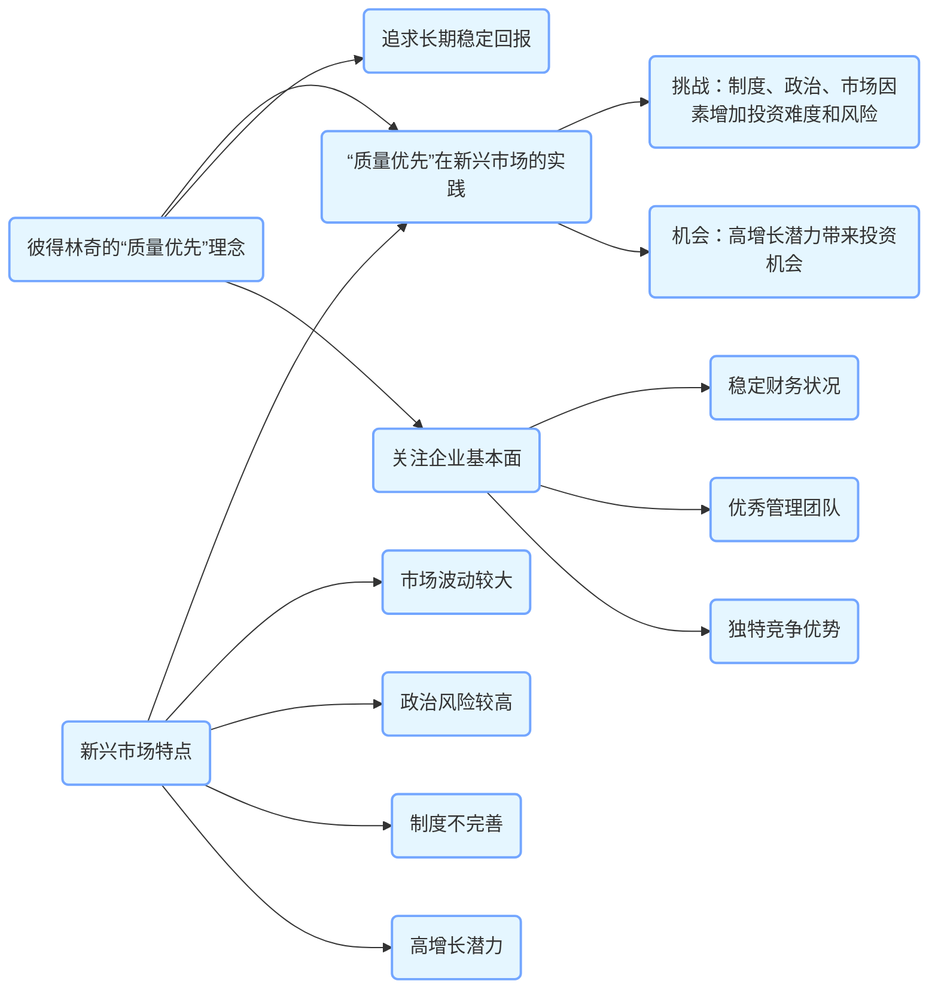

# 彼得林奇的“质量优先”在新兴市场的实践挑战

> 关键词：彼得林奇、质量优先、新兴市场、投资策略、实践挑战

> 摘要：彼得林奇的“质量优先”投资理念在成熟市场取得了巨大成功，然而当这一理念应用于新兴市场时，面临着诸多独特的挑战。本文旨在深入探讨“质量优先”理念在新兴市场的实践困境，通过对新兴市场特点的分析，结合核心概念、算法原理、数学模型等多方面的阐述，辅以项目实战案例，详细剖析其中的问题，并探讨其实际应用场景。同时，推荐相关的学习资源、开发工具和论文著作，最后总结未来发展趋势与挑战，以期为投资者在新兴市场运用这一理念提供有价值的参考。

## 1. 背景介绍 
### 1.1 目的和范围
本研究的目的在于全面分析彼得林奇的“质量优先”投资理念在新兴市场中所面临的实践挑战。范围涵盖新兴市场的经济、政治、文化等多个维度，以及这些因素对“质量优先”理念应用的影响。通过对新兴市场特点的研究，深入探讨该理念在不同行业、不同企业中的实践情况，揭示其中的问题和潜在风险。

### 1.2 预期读者
本文预期读者包括专业投资者、金融从业者、经济领域研究人员以及对投资策略和新兴市场感兴趣的人士。无论是希望在新兴市场寻找投资机会的投资者，还是致力于研究投资理论实践的学者，都能从本文中获取有价值的信息和启示。

### 1.3 文档结构概述
本文将首先介绍相关的背景知识和核心概念，包括彼得林奇的“质量优先”理念的内涵和新兴市场的特点。接着，阐述核心算法原理和数学模型，为分析实践挑战提供理论支持。通过项目实战案例，详细说明“质量优先”理念在新兴市场的实际应用情况。然后，探讨其在不同场景下的应用和面临的挑战。最后，推荐相关的学习资源、开发工具和论文著作，总结未来发展趋势与挑战，并提供常见问题解答和参考资料。

### 1.4 术语表
#### 1.4.1 核心术语定义
- **彼得林奇的“质量优先”**：彼得林奇是美国著名的投资大师，他强调在投资过程中优先选择具有高质量业务、优秀管理团队、良好财务状况等特征的公司。这些公司通常具有较强的竞争力和可持续发展能力，能够为投资者带来长期稳定的回报。
- **新兴市场**：指的是发展中国家或地区的金融市场，通常具有较高的经济增长率、快速的工业化进程和不断开放的市场环境。新兴市场在经济、政治、制度等方面与成熟市场存在较大差异。

#### 1.4.2 相关概念解释
- **投资策略**：投资者为实现投资目标而采取的一系列投资方法和决策原则。不同的投资策略适用于不同的市场环境和投资者风险偏好。
- **企业质量**：包括企业的产品或服务质量、管理水平、创新能力、财务健康状况等多个方面。高质量的企业通常具有较强的市场竞争力和抗风险能力。

#### 1.4.3 缩略词列表
- **GDP**：国内生产总值（Gross Domestic Product），是衡量一个国家或地区经济活动总量的重要指标。
- **PE**：市盈率（Price-to-Earnings Ratio），是股票价格与每股收益的比率，用于评估股票的估值水平。

## 2. 核心概念与联系 

### 2.1 彼得林奇的“质量优先”理念
彼得林奇的“质量优先”理念核心在于对企业内在价值的深入挖掘。他认为，投资者应该关注企业的基本面，选择那些具有独特竞争优势、良好管理团队和稳定财务状况的公司进行投资。这些公司通常能够在市场竞争中脱颖而出，实现持续的盈利增长，从而为投资者带来丰厚的回报。

例如，一家具有创新技术和优秀品牌的企业，能够在市场上获得更高的市场份额和利润空间。其产品或服务具有独特的价值，能够满足消费者的需求，从而在竞争中占据优势地位。

### 2.2 新兴市场的特点
新兴市场具有以下几个显著特点：
- **高增长潜力**：新兴市场国家通常处于经济快速发展阶段，具有较高的GDP增长率。这些国家的工业化和城市化进程不断推进，消费市场不断扩大，为企业的发展提供了广阔的空间。
- **制度不完善**：与成熟市场相比，新兴市场的法律法规、监管制度等方面还存在一定的缺陷。这可能导致市场秩序不够规范，企业的经营环境存在一定的不确定性。
- **政治风险较高**：新兴市场国家的政治局势相对不稳定，政策变化频繁。政治风险可能会对企业的经营和投资带来不利影响。
- **市场波动较大**：由于新兴市场的投资者结构和市场机制不够成熟，市场波动较为剧烈。股票价格容易受到宏观经济因素、政策变化和投资者情绪的影响。

### 2.3 核心概念的联系
彼得林奇的“质量优先”理念在新兴市场的应用面临着与新兴市场特点相关的挑战。高增长潜力为“质量优先”投资提供了机会，但制度不完善、政治风险较高和市场波动较大等因素增加了投资的难度和风险。在新兴市场中，如何准确评估企业的质量，以及如何应对这些特殊的市场环境，是“质量优先”理念实践的关键问题。

### 2.4 文本示意图
```plaintext
彼得林奇的“质量优先”理念
|
|--关注企业基本面
|   |--独特竞争优势
|   |--优秀管理团队
|   |--稳定财务状况
|
|--追求长期稳定回报
|
|
新兴市场特点
|
|--高增长潜力
|--制度不完善
|--政治风险较高
|--市场波动较大
|
|
“质量优先”在新兴市场的实践
|
|--机会：高增长潜力带来投资机会
|--挑战：制度、政治、市场因素增加投资难度和风险
```

### 2.5 Mermaid 流程图


## 3. 核心算法原理 & 具体操作步骤 

### 3.1 核心算法原理
在应用彼得林奇的“质量优先”理念时，可以通过一些量化指标来评估企业的质量。以下是一个简单的算法原理，通过对企业的财务指标和市场指标进行综合评估，来判断企业的质量水平。

#### 3.1.1 财务指标评估
- **盈利能力**：可以使用净利润率、净资产收益率（ROE）等指标来评估企业的盈利能力。净利润率反映了企业在扣除所有成本后每单位收入的盈利水平，ROE则反映了企业利用自有资本获取收益的能力。
- **偿债能力**：资产负债率、流动比率等指标可以用来评估企业的偿债能力。资产负债率反映了企业负债占总资产的比例，流动比率则反映了企业流动资产对流动负债的覆盖程度。
- **成长能力**：营业收入增长率、净利润增长率等指标可以用来评估企业的成长能力。这些指标反映了企业在一定时期内的业务增长情况。

#### 3.1.2 市场指标评估
- **市盈率（PE）**：市盈率是股票价格与每股收益的比率，反映了市场对企业未来盈利的预期。较低的市盈率可能意味着股票被低估，具有投资价值。
- **市净率（PB）**：市净率是股票价格与每股净资产的比率，反映了市场对企业净资产的估值。较低的市净率可能意味着股票被低估。

### 3.2 具体操作步骤
以下是一个使用Python实现的简单的企业质量评估示例：

```python
import pandas as pd

# 定义企业财务数据
data = {
    '公司名称': ['公司A', '公司B', '公司C'],
    '净利润率': [0.1, 0.15, 0.08],
    '净资产收益率': [0.12, 0.18, 0.1],
    '资产负债率': [0.4, 0.3, 0.5],
    '流动比率': [1.5, 2, 1.2],
    '营业收入增长率': [0.1, 0.15, 0.05],
    '净利润增长率': [0.12, 0.18, 0.08],
    '市盈率': [15, 20, 12],
    '市净率': [2, 2.5, 1.8]
}

# 创建DataFrame
df = pd.DataFrame(data)

# 定义指标权重
weights = {
    '净利润率': 0.1,
    '净资产收益率': 0.15,
    '资产负债率': 0.1,
    '流动比率': 0.1,
    '营业收入增长率': 0.15,
    '净利润增长率': 0.15,
    '市盈率': 0.1,
    '市净率': 0.15
}

# 标准化数据
def standardize(data):
    return (data - data.min()) / (data.max() - data.min())

# 对每个指标进行标准化
for column in df.columns[1:]:
    df[column] = standardize(df[column])

# 计算综合得分
df['综合得分'] = 0
for column, weight in weights.items():
    df['综合得分'] += df[column] * weight

# 按综合得分排序
df = df.sort_values(by='综合得分', ascending=False)

# 输出结果
print(df)
```

### 3.3 代码解读
- **数据定义**：首先定义了一个包含企业财务数据的字典 `data`，并使用 `pandas` 库创建了一个 `DataFrame` 对象 `df`。
- **指标权重**：定义了每个指标的权重，这些权重反映了每个指标在评估企业质量中的重要程度。
- **数据标准化**：使用 `standardize` 函数对每个指标进行标准化处理，将数据缩放到 0 到 1 的范围内，以便进行综合计算。
- **综合得分计算**：根据每个指标的权重，计算每个企业的综合得分，并将结果存储在 `综合得分` 列中。
- **排序输出**：按综合得分对企业进行排序，并输出结果。

## 4. 数学模型和公式 & 详细讲解 & 举例说明 

### 4.1 数学模型
在上述企业质量评估的算法中，使用了加权平均的数学模型来计算企业的综合得分。设企业的第 $i$ 个指标值为 $x_i$，对应的权重为 $w_i$，企业的综合得分 $S$ 可以表示为：

$$S = \sum_{i=1}^{n} w_i x_i$$

其中，$n$ 为指标的数量，且 $\sum_{i=1}^{n} w_i = 1$。

### 4.2 详细讲解
- **指标值 $x_i$**：每个指标值代表了企业在某个方面的表现，例如净利润率、净资产收益率等。这些指标值可以通过企业的财务报表和市场数据获取。
- **权重 $w_i$**：权重反映了每个指标在评估企业质量中的重要程度。不同的投资者可以根据自己的投资偏好和经验来确定权重。
- **综合得分 $S$**：综合得分是对企业质量的一个综合评估，得分越高，说明企业的质量越好。

### 4.3 举例说明
假设我们有两个企业 A 和 B，它们的指标值和权重如下表所示：

| 指标 | 企业 A 指标值 | 企业 B 指标值 | 权重 |
|---|---|---|---|
| 净利润率 | 0.1 | 0.15 | 0.1 |
| 净资产收益率 | 0.12 | 0.18 | 0.15 |
| 资产负债率 | 0.4 | 0.3 | 0.1 |
| 流动比率 | 1.5 | 2 | 0.1 |
| 营业收入增长率 | 0.1 | 0.15 | 0.15 |
| 净利润增长率 | 0.12 | 0.18 | 0.15 |
| 市盈率 | 15 | 20 | 0.1 |
| 市净率 | 2 | 2.5 | 0.15 |

首先，对指标值进行标准化处理：

| 指标 | 企业 A 标准化指标值 | 企业 B 标准化指标值 | 权重 |
|---|---|---|---|
| 净利润率 | 0 | 1 | 0.1 |
| 净资产收益率 | 0 | 1 | 0.15 |
| 资产负债率 | 0 | 1 | 0.1 |
| 流动比率 | 0 | 1 | 0.1 |
| 营业收入增长率 | 0 | 1 | 0.15 |
| 净利润增长率 | 0 | 1 | 0.15 |
| 市盈率 | 1 | 0 | 0.1 |
| 市净率 | 0 | 1 | 0.15 |

然后，计算企业 A 和 B 的综合得分：

企业 A 的综合得分：

$$S_A = 0.1 \times 0 + 0.15 \times 0 + 0.1 \times 0 + 0.1 \times 0 + 0.15 \times 0 + 0.15 \times 0 + 0.1 \times 1 + 0.15 \times 0 = 0.1$$

企业 B 的综合得分：

$$S_B = 0.1 \times 1 + 0.15 \times 1 + 0.1 \times 1 + 0.1 \times 1 + 0.15 \times 1 + 0.15 \times 1 + 0.1 \times 0 + 0.15 \times 1 = 0.9$$

从计算结果可以看出，企业 B 的综合得分高于企业 A，说明企业 B 的质量相对较好。

## 5. 项目实战：代码实际案例和详细解释说明 

### 5.1  开发环境搭建
- **Python 安装**：首先需要安装 Python 开发环境，建议使用 Python 3.7 及以上版本。可以从 Python 官方网站（https://www.python.org/downloads/） 下载并安装。
- **库安装**：本项目需要使用 `pandas` 库进行数据处理。可以使用以下命令进行安装：
```sh
pip install pandas
```

### 5.2  源代码详细实现和代码解读
以下是一个完整的企业质量评估项目的源代码：

```python
import pandas as pd

# 定义企业财务数据
def load_data():
    data = {
        '公司名称': ['公司A', '公司B', '公司C', '公司D', '公司E'],
        '净利润率': [0.1, 0.15, 0.08, 0.12, 0.13],
        '净资产收益率': [0.12, 0.18, 0.1, 0.14, 0.16],
        '资产负债率': [0.4, 0.3, 0.5, 0.35, 0.45],
        '流动比率': [1.5, 2, 1.2, 1.8, 1.6],
        '营业收入增长率': [0.1, 0.15, 0.05, 0.12, 0.14],
        '净利润增长率': [0.12, 0.18, 0.08, 0.14, 0.16],
        '市盈率': [15, 20, 12, 18, 16],
        '市净率': [2, 2.5, 1.8, 2.2, 2.1]
    }
    return pd.DataFrame(data)

# 标准化数据
def standardize(data):
    return (data - data.min()) / (data.max() - data.min())

# 计算综合得分
def calculate_score(df, weights):
    for column in df.columns[1:]:
        df[column] = standardize(df[column])
    df['综合得分'] = 0
    for column, weight in weights.items():
        df['综合得分'] += df[column] * weight
    return df.sort_values(by='综合得分', ascending=False)

# 主函数
def main():
    # 加载数据
    df = load_data()
    # 定义指标权重
    weights = {
        '净利润率': 0.1,
        '净资产收益率': 0.15,
        '资产负债率': 0.1,
        '流动比率': 0.1,
        '营业收入增长率': 0.15,
        '净利润增长率': 0.15,
        '市盈率': 0.1,
        '市净率': 0.15
    }
    # 计算综合得分
    result = calculate_score(df, weights)
    # 输出结果
    print(result)

if __name__ == "__main__":
    main()
```

### 5.3  代码解读与分析
- **`load_data` 函数**：该函数用于加载企业的财务数据，并将其存储在 `pandas` 的 `DataFrame` 对象中。
- **`standardize` 函数**：该函数用于对数据进行标准化处理，将数据缩放到 0 到 1 的范围内。
- **`calculate_score` 函数**：该函数根据指标权重计算企业的综合得分，并按综合得分对企业进行排序。
- **`main` 函数**：主函数，负责调用上述函数，完成数据加载、综合得分计算和结果输出的任务。

通过这个项目实战，我们可以看到如何使用量化指标来评估企业的质量。然而，在新兴市场中，由于数据的准确性和可靠性可能存在问题，以及市场环境的特殊性，这种评估方法可能会面临一定的挑战。

## 6. 实际应用场景 
### 6.1 股票投资
在新兴市场的股票投资中，“质量优先”理念可以帮助投资者筛选出具有较高质量的企业。通过对企业的财务指标和市场指标进行评估，投资者可以选择那些具有良好盈利能力、偿债能力和成长能力的企业进行投资。然而，新兴市场的股票市场波动较大，投资者需要更加谨慎地评估企业的质量，并结合市场情况进行投资决策。

### 6.2 私募股权投资
在私募股权投资领域，“质量优先”理念同样重要。投资者在选择投资项目时，需要对企业的基本面进行深入研究，评估企业的质量和发展潜力。在新兴市场中，由于企业的发展阶段和市场环境的特殊性，投资者需要更加注重企业的创新能力和管理团队的素质。

### 6.3 行业分析
“质量优先”理念还可以应用于行业分析。通过对不同行业中企业的质量进行评估，投资者可以了解各个行业的发展趋势和竞争格局。在新兴市场中，一些新兴行业可能具有较高的增长潜力，但同时也面临着较大的风险。投资者需要根据行业的特点和企业的质量来选择投资机会。

## 7. 工具和资源推荐
### 7.1 学习资源推荐
#### 7.1.1 书籍推荐
- 《彼得林奇的成功投资》：彼得林奇的经典著作，详细阐述了他的投资理念和方法，对投资者具有很高的参考价值。
- 《聪明的投资者》：本杰明·格雷厄姆的经典著作，强调了价值投资的重要性，为投资者提供了基本的投资原则和方法。
- 《财务报表分析》：帮助读者了解如何分析企业的财务报表，掌握评估企业质量的基本方法。

#### 7.1.2 在线课程
- Coursera 上的“投资学原理”：由知名教授授课，系统介绍了投资学的基本原理和方法。
- 网易云课堂上的“财务分析与决策”：帮助学习者掌握财务分析的技巧和方法，提高对企业财务状况的评估能力。

#### 7.1.3 技术博客和网站
- 雪球网：国内知名的投资交流社区，提供了丰富的股票分析和投资策略分享。
- Seeking Alpha：国外知名的投资研究网站，提供了全球范围内的股票分析和投资观点。

### 7.2 开发工具框架推荐
#### 7.2.1 IDE和编辑器
- PyCharm：功能强大的 Python 集成开发环境，提供了代码编辑、调试、版本控制等一系列功能。
- Jupyter Notebook：交互式的开发环境，适合进行数据探索和分析，方便代码的编写和展示。

#### 7.2.2 调试和性能分析工具
- PDB：Python 自带的调试工具，可以帮助开发者定位代码中的问题。
- cProfile：Python 标准库中的性能分析工具，可以帮助开发者分析代码的性能瓶颈。

#### 7.2.3 相关框架和库
- Pandas：强大的数据处理和分析库，提供了高效的数据结构和数据操作方法。
- NumPy：Python 科学计算的基础库，提供了高效的数组操作和数学函数。

### 7.3 相关论文著作推荐
#### 7.3.1 经典论文
- Fama, E. F., & French, K. R. (1992). The cross-section of expected stock returns. The Journal of Finance, 47(2), 427-465. 该论文提出了著名的 Fama-French 三因子模型，对股票收益率的影响因素进行了深入研究。
- Sharpe, W. F. (1964). Capital asset prices: A theory of market equilibrium under conditions of risk. The Journal of Finance, 19(3), 425-442. 该论文提出了资本资产定价模型（CAPM），为资产定价提供了重要的理论基础。

#### 7.3.2 最新研究成果
- 关注新兴市场投资策略的学术期刊，如《新兴市场金融与贸易》（Emerging Markets Finance and Trade），可以获取最新的研究成果和市场动态。

#### 7.3.3 应用案例分析
- 一些知名投资机构的研究报告和案例分析，如高盛、摩根士丹利等，提供了实际投资案例和分析方法，对投资者具有很高的参考价值。

## 8. 总结：未来发展趋势与挑战
### 8.1 未来发展趋势
- **新兴市场的崛起**：随着全球经济的发展，新兴市场的地位将不断提高。新兴市场国家的经济增长和市场开放将为投资者带来更多的机会。
- **数字化转型**：新兴市场国家的数字化转型将加速，科技和创新将成为推动经济发展的重要动力。投资者可以关注新兴市场中的科技企业和创新型企业。
- **可持续投资**：越来越多的投资者开始关注企业的社会责任和可持续发展能力。在新兴市场中，可持续投资将成为未来的发展趋势。

### 8.2 挑战
- **数据质量问题**：新兴市场的企业数据质量可能存在问题，数据的准确性和可靠性较低。这给投资者评估企业质量带来了困难。
- **政治和政策风险**：新兴市场国家的政治局势和政策变化频繁，政治风险较高。投资者需要密切关注政治和政策动态，及时调整投资策略。
- **市场波动风险**：新兴市场的市场波动较大，股票价格容易受到宏观经济因素、政策变化和投资者情绪的影响。投资者需要具备较强的风险承受能力和风险管理能力。

## 9. 附录：常见问题与解答
### 9.1 如何准确评估新兴市场企业的质量？
评估新兴市场企业的质量需要综合考虑多个因素，包括企业的财务状况、管理团队、市场竞争力、行业前景等。同时，需要注意数据的准确性和可靠性，可以参考多个数据源进行分析。此外，还可以结合实地调研和专家意见，提高评估的准确性。

### 9.2 新兴市场的政治风险对投资有哪些影响？
新兴市场的政治风险可能导致政策变化、法规调整、税收增加等，从而影响企业的经营和投资回报。政治不稳定还可能导致社会动荡，影响市场的正常运行。投资者需要密切关注政治动态，评估政治风险对投资的影响，并采取相应的风险管理措施。

### 9.3 如何应对新兴市场的市场波动风险？
投资者可以通过分散投资、长期投资、设置止损点等方式来应对新兴市场的市场波动风险。分散投资可以降低单一资产的风险，长期投资可以平滑市场波动的影响，设置止损点可以控制投资损失。此外，投资者还需要保持冷静，避免情绪化决策。

## 10. 扩展阅读 & 参考资料
### 10.1 扩展阅读
- 《新兴市场的投资机会与挑战》：深入探讨了新兴市场的投资环境和投资策略。
- 《全球投资视野下的新兴市场》：从全球视角分析了新兴市场在全球投资格局中的地位和作用。

### 10.2 参考资料
- 彼得林奇的官方网站和相关访谈记录。
- 新兴市场国家的政府统计部门发布的经济数据和政策文件。
- 金融机构的研究报告和市场分析。