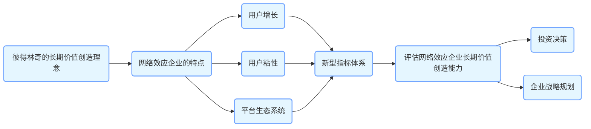

# 彼得林奇的"长期价值创造"在网络效应企业中的新型指标体系

> 关键词：彼得林奇、长期价值创造、网络效应企业、新型指标体系、投资分析

> 摘要：本文聚焦于彼得林奇的“长期价值创造”理念在网络效应企业中的应用，旨在构建一套适合此类企业的新型指标体系。通过深入剖析网络效应企业的特点，结合彼得林奇的投资思想，阐述核心概念与联系，介绍核心算法原理及操作步骤，推导数学模型和公式，并给出项目实战案例。同时，探讨实际应用场景，推荐相关工具和资源，最后总结未来发展趋势与挑战，为投资者和企业管理者提供全面的参考。

## 1. 背景介绍 
### 1.1 目的和范围
本研究的主要目的是将彼得林奇的“长期价值创造”理念引入网络效应企业的评估中，构建一套专门针对此类企业的新型指标体系。网络效应企业具有独特的商业模式和增长逻辑，传统的评估指标可能无法准确反映其长期价值。通过本研究，我们希望为投资者、企业管理者和研究者提供一套更科学、更有效的评估工具，帮助他们更好地理解和评估网络效应企业的长期价值创造能力。

本研究的范围涵盖了各种具有网络效应的企业，包括社交媒体平台、电商平台、共享经济平台等。我们将重点关注这些企业的用户增长、用户粘性、平台生态系统等方面的指标，以全面评估其长期价值创造能力。

### 1.2 预期读者
本文的预期读者包括投资者、企业管理者、金融分析师、学术研究者等。对于投资者来说，本文提供的新型指标体系可以帮助他们更准确地评估网络效应企业的投资价值，做出更明智的投资决策。对于企业管理者来说，该指标体系可以作为企业战略规划和运营管理的参考，帮助他们更好地把握企业的发展方向和竞争优势。对于金融分析师来说，本文的研究成果可以为他们的研究和分析提供新的视角和方法。对于学术研究者来说，本文的研究可以为网络效应企业的评估和投资领域的学术研究提供有益的参考。

### 1.3 文档结构概述
本文的文档结构如下：
- 背景介绍：介绍研究的目的、范围、预期读者和文档结构概述。
- 核心概念与联系：阐述彼得林奇的“长期价值创造”理念、网络效应企业的概念和特点，以及两者之间的联系，并给出核心概念原理和架构的文本示意图和 Mermaid 流程图。
- 核心算法原理 & 具体操作步骤：介绍构建新型指标体系的核心算法原理，并给出具体的操作步骤，同时使用 Python 源代码详细阐述算法实现。
- 数学模型和公式 & 详细讲解 & 举例说明：推导构建新型指标体系的数学模型和公式，并进行详细讲解，同时给出具体的举例说明。
- 项目实战：代码实际案例和详细解释说明：给出一个实际的项目案例，包括开发环境搭建、源代码详细实现和代码解读，以及代码解读与分析。
- 实际应用场景：探讨新型指标体系在投资者决策、企业战略规划、金融分析等实际应用场景中的应用。
- 工具和资源推荐：推荐学习资源、开发工具框架和相关论文著作，帮助读者进一步深入学习和研究。
- 总结：未来发展趋势与挑战：总结新型指标体系的研究成果，分析未来发展趋势和面临的挑战。
- 附录：常见问题与解答：解答读者在阅读本文过程中可能遇到的常见问题。
- 扩展阅读 & 参考资料：提供相关的扩展阅读资料和参考资料，方便读者进一步深入学习和研究。

### 1.4 术语表
#### 1.4.1 核心术语定义
- 彼得林奇的“长期价值创造”：彼得林奇是著名的投资大师，他强调通过深入研究企业的基本面，寻找具有长期增长潜力和价值创造能力的企业进行投资。“长期价值创造”指的是企业在长期内通过不断创新、提高运营效率、拓展市场份额等方式，为股东创造持续增长的价值。
- 网络效应企业：指的是那些通过用户之间的互动和连接产生网络效应的企业。网络效应是指随着用户数量的增加，产品或服务的价值也随之增加的现象。例如，社交媒体平台、电商平台等都具有明显的网络效应。
- 新型指标体系：指的是本文构建的专门针对网络效应企业的一套评估指标体系，该指标体系结合了彼得林奇的“长期价值创造”理念和网络效应企业的特点，旨在更准确地评估网络效应企业的长期价值创造能力。

#### 1.4.2 相关概念解释
- 用户增长：指的是网络效应企业的用户数量在一定时期内的增长情况。用户增长是网络效应企业发展的重要基础，通常可以通过用户注册数、活跃用户数等指标来衡量。
- 用户粘性：指的是用户对网络效应企业的产品或服务的依赖程度和忠诚度。用户粘性越高，用户越不容易流失，企业的长期价值创造能力也就越强。通常可以通过用户留存率、用户使用时长等指标来衡量。
- 平台生态系统：指的是网络效应企业围绕其核心产品或服务构建的一个生态系统，包括用户、合作伙伴、开发者等。平台生态系统的完善程度和活跃度是衡量网络效应企业长期价值创造能力的重要因素之一。

#### 1.4.3 缩略词列表
- DAU：Daily Active Users，日活跃用户数
- MAU：Monthly Active Users，月活跃用户数
- ARPU：Average Revenue Per User，每用户平均收入
- LTV：Customer Lifetime Value，客户终身价值
- CAC：Customer Acquisition Cost，客户获取成本

## 2. 核心概念与联系 
### 2.1 彼得林奇的“长期价值创造”理念
彼得林奇是美国著名的投资大师，他在管理富达麦哲伦基金期间取得了惊人的投资业绩。他的投资理念强调通过深入研究企业的基本面，寻找具有长期增长潜力和价值创造能力的企业进行投资。他认为，投资者应该关注企业的盈利能力、成长速度、竞争优势等因素，而不是被短期的市场波动所左右。

在“长期价值创造”方面，彼得林奇强调企业应该通过不断创新、提高运营效率、拓展市场份额等方式，为股东创造持续增长的价值。他认为，只有那些具有长期价值创造能力的企业，才值得投资者长期持有。

### 2.2 网络效应企业的概念和特点
网络效应企业是指那些通过用户之间的互动和连接产生网络效应的企业。网络效应是指随着用户数量的增加，产品或服务的价值也随之增加的现象。例如，社交媒体平台上的用户越多，用户之间的互动和交流就越频繁，平台的价值也就越高；电商平台上的卖家和买家越多，交易就越活跃，平台的价值也就越大。

网络效应企业具有以下特点：
- 用户规模至关重要：网络效应企业的价值与用户数量密切相关，用户数量越多，网络效应越明显，企业的价值也就越高。
- 高固定成本和低边际成本：网络效应企业通常需要投入大量的资金用于技术研发、平台建设和市场推广等方面，因此固定成本较高。但一旦平台建成，每增加一个用户的边际成本却很低。
- 赢家通吃：由于网络效应的存在，市场往往会呈现出赢家通吃的局面，即少数几家具有领先优势的企业会占据大部分市场份额。
- 平台生态系统复杂：网络效应企业通常围绕其核心产品或服务构建一个复杂的平台生态系统，包括用户、合作伙伴、开发者等。平台生态系统的完善程度和活跃度对企业的长期发展至关重要。

### 2.3 两者之间的联系
彼得林奇的“长期价值创造”理念与网络效应企业的特点有着密切的联系。网络效应企业的用户规模、用户粘性和平台生态系统等因素，都与企业的长期价值创造能力密切相关。例如，用户规模的增长可以带来网络效应的增强，从而提高企业的价值；用户粘性的提高可以减少用户流失，保证企业的稳定收入；平台生态系统的完善可以吸引更多的用户和合作伙伴，进一步提升企业的竞争力。

因此，将彼得林奇的“长期价值创造”理念引入网络效应企业的评估中，可以帮助投资者更好地理解和评估网络效应企业的长期价值创造能力，从而做出更明智的投资决策。

### 2.4 核心概念原理和架构的文本示意图
以下是核心概念原理和架构的文本示意图：

彼得林奇的“长期价值创造”理念强调企业通过创新、效率提升和市场拓展等方式为股东创造长期价值。在网络效应企业中，用户增长、用户粘性和平台生态系统是实现长期价值创造的关键因素。用户增长带来网络效应的增强，提高企业价值；用户粘性保证企业的稳定收入；平台生态系统的完善提升企业的竞争力。新型指标体系将围绕这些关键因素构建，以全面评估网络效应企业的长期价值创造能力。

### 2.5 Mermaid 流程图


该流程图展示了彼得林奇的“长期价值创造”理念与网络效应企业的特点之间的联系，以及如何通过构建新型指标体系来评估网络效应企业的长期价值创造能力，并将评估结果应用于投资决策和企业战略规划中。

## 3. 核心算法原理 & 具体操作步骤 
### 3.1 核心算法原理
构建新型指标体系的核心算法原理是综合考虑网络效应企业的用户增长、用户粘性和平台生态系统等因素，通过量化这些因素来评估企业的长期价值创造能力。具体来说，我们将采用加权平均的方法，为每个因素分配一个权重，然后将各个因素的得分乘以相应的权重，最后将结果相加得到企业的综合得分。

### 3.2 具体操作步骤
#### 3.2.1 确定评估因素和权重
首先，我们需要确定评估网络效应企业长期价值创造能力的因素，包括用户增长、用户粘性和平台生态系统等。然后，根据这些因素的重要性，为每个因素分配一个权重。例如，我们可以将用户增长的权重设定为 0.4，用户粘性的权重设定为 0.3，平台生态系统的权重设定为 0.3。

#### 3.2.2 量化评估因素
接下来，我们需要对每个评估因素进行量化。具体来说，我们可以采用以下指标来量化各个因素：
- 用户增长：可以采用日活跃用户数（DAU）增长率、月活跃用户数（MAU）增长率等指标来衡量。
- 用户粘性：可以采用用户留存率、用户使用时长等指标来衡量。
- 平台生态系统：可以采用合作伙伴数量、开发者数量、平台交易规模等指标来衡量。

#### 3.2.3 计算因素得分
对于每个评估因素，我们可以根据其量化指标的实际值，采用标准化的方法将其转化为 0 到 100 之间的得分。例如，对于用户增长指标，我们可以根据行业平均水平和企业的历史数据，确定一个合理的增长率范围，然后将企业的实际增长率转化为相应的得分。

#### 3.2.4 计算综合得分
最后，我们将各个因素的得分乘以相应的权重，然后将结果相加得到企业的综合得分。综合得分越高，说明企业的长期价值创造能力越强。

### 3.3 Python 源代码详细阐述
以下是使用 Python 实现上述核心算法的示例代码：

```python
# 定义评估因素的权重
weights = {
    '用户增长': 0.4,
    '用户粘性': 0.3,
    '平台生态系统': 0.3
}

# 定义量化指标和得分函数
def growth_score(dau_growth_rate):
    # 假设行业平均 DAU 增长率为 10%，最高增长率为 50%
    min_rate = 0
    max_rate = 0.5
    avg_rate = 0.1
    if dau_growth_rate < min_rate:
        return 0
    elif dau_growth_rate > max_rate:
        return 100
    else:
        return (dau_growth_rate - min_rate) / (max_rate - min_rate) * 100

def retention_score(retention_rate):
    # 假设行业平均用户留存率为 50%，最高留存率为 90%
    min_rate = 0
    max_rate = 0.9
    avg_rate = 0.5
    if retention_rate < min_rate:
        return 0
    elif retention_rate > max_rate:
        return 100
    else:
        return (retention_rate - min_rate) / (max_rate - min_rate) * 100

def ecosystem_score(partner_count):
    # 假设行业平均合作伙伴数量为 100，最高数量为 500
    min_count = 0
    max_count = 500
    avg_count = 100
    if partner_count < min_count:
        return 0
    elif partner_count > max_count:
        return 100
    else:
        return (partner_count - min_count) / (max_count - min_count) * 100

# 示例数据
dau_growth_rate = 0.2
retention_rate = 0.6
partner_count = 200

# 计算因素得分
growth = growth_score(dau_growth_rate)
retention = retention_score(retention_rate)
ecosystem = ecosystem_score(partner_count)

# 计算综合得分
scores = {
    '用户增长': growth,
    '用户粘性': retention,
    '平台生态系统': ecosystem
}
total_score = sum([scores[key] * weights[key] for key in scores])

print(f"用户增长得分: {growth}")
print(f"用户粘性得分: {retention}")
print(f"平台生态系统得分: {ecosystem}")
print(f"综合得分: {total_score}")
```

### 3.4 代码解释
- `weights` 字典定义了各个评估因素的权重。
- `growth_score`、`retention_score` 和 `ecosystem_score` 函数分别用于计算用户增长、用户粘性和平台生态系统的得分。这些函数根据指标的实际值，将其转化为 0 到 100 之间的得分。
- 示例数据 `dau_growth_rate`、`retention_rate` 和 `partner_count` 分别表示 DAU 增长率、用户留存率和合作伙伴数量。
- 通过调用得分函数，计算各个因素的得分，并将其存储在 `scores` 字典中。
- 最后，使用加权平均的方法计算综合得分，并将结果打印输出。

## 4. 数学模型和公式 & 详细讲解 & 举例说明 
### 4.1 数学模型和公式推导
设 $S$ 为网络效应企业的综合得分，$S_i$ 为第 $i$ 个评估因素的得分，$w_i$ 为第 $i$ 个评估因素的权重，$n$ 为评估因素的数量。则综合得分的计算公式为：

$$S = \sum_{i=1}^{n} w_i S_i$$

其中，$\sum_{i=1}^{n} w_i = 1$。

对于每个评估因素的得分 $S_i$，可以通过以下公式计算：

$$S_i = \frac{x_i - x_{min}}{x_{max} - x_{min}} \times 100$$

其中，$x_i$ 为第 $i$ 个评估因素的实际值，$x_{min}$ 和 $x_{max}$ 分别为该评估因素的最小值和最大值。

### 4.2 详细讲解
综合得分公式 $S = \sum_{i=1}^{n} w_i S_i$ 采用了加权平均的方法，将各个评估因素的得分乘以相应的权重，然后将结果相加得到企业的综合得分。权重 $w_i$ 反映了各个评估因素在评估企业长期价值创造能力中的重要性。

每个评估因素的得分公式 $S_i = \frac{x_i - x_{min}}{x_{max} - x_{min}} \times 100$ 采用了标准化的方法，将评估因素的实际值转化为 0 到 100 之间的得分。$x_{min}$ 和 $x_{max}$ 分别为该评估因素的最小值和最大值，可以根据行业平均水平和企业的历史数据来确定。

### 4.3 举例说明
假设我们要评估一家网络效应企业的长期价值创造能力，评估因素包括用户增长、用户粘性和平台生态系统，权重分别为 0.4、0.3 和 0.3。各个评估因素的实际值和最小值、最大值如下：

| 评估因素 | 实际值 | 最小值 | 最大值 |
| ---- | ---- | ---- | ---- |
| 用户增长（DAU 增长率） | 0.2 | 0 | 0.5 |
| 用户粘性（用户留存率） | 0.6 | 0 | 0.9 |
| 平台生态系统（合作伙伴数量） | 200 | 0 | 500 |

首先，计算各个评估因素的得分：

- 用户增长得分：
$$S_1 = \frac{0.2 - 0}{0.5 - 0} \times 100 = 40$$

- 用户粘性得分：
$$S_2 = \frac{0.6 - 0}{0.9 - 0} \times 100 \approx 66.67$$

- 平台生态系统得分：
$$S_3 = \frac{200 - 0}{500 - 0} \times 100 = 40$$

然后，计算综合得分：

$$S = 0.4 \times 40 + 0.3 \times 66.67 + 0.3 \times 40 \approx 46.00$$

因此，该网络效应企业的综合得分为 46.00，说明其长期价值创造能力处于中等水平。

## 5. 项目实战：代码实际案例和详细解释说明 
### 5.1 开发环境搭建
#### 5.1.1 安装 Python
首先，需要安装 Python 开发环境。可以从 Python 官方网站（https://www.python.org/downloads/）下载适合自己操作系统的 Python 安装包，并按照安装向导进行安装。

#### 5.1.2 安装必要的库
在本项目中，我们只需要使用 Python 的内置库，因此不需要额外安装其他库。

#### 5.1.3 创建项目目录
在本地创建一个项目目录，用于存放项目的代码和数据。例如，可以在桌面上创建一个名为 `network_effect_evaluation` 的文件夹。

### 5.2 源代码详细实现和代码解读
以下是完整的项目代码：

```python
# 定义评估因素的权重
weights = {
    '用户增长': 0.4,
    '用户粘性': 0.3,
    '平台生态系统': 0.3
}

# 定义量化指标和得分函数
def growth_score(dau_growth_rate):
    # 假设行业平均 DAU 增长率为 10%，最高增长率为 50%
    min_rate = 0
    max_rate = 0.5
    avg_rate = 0.1
    if dau_growth_rate < min_rate:
        return 0
    elif dau_growth_rate > max_rate:
        return 100
    else:
        return (dau_growth_rate - min_rate) / (max_rate - min_rate) * 100

def retention_score(retention_rate):
    # 假设行业平均用户留存率为 50%，最高留存率为 90%
    min_rate = 0
    max_rate = 0.9
    avg_rate = 0.5
    if retention_rate < min_rate:
        return 0
    elif retention_rate > max_rate:
        return 100
    else:
        return (retention_rate - min_rate) / (max_rate - min_rate) * 100

def ecosystem_score(partner_count):
    # 假设行业平均合作伙伴数量为 100，最高数量为 500
    min_count = 0
    max_count = 500
    avg_count = 100
    if partner_count < min_count:
        return 0
    elif partner_count > max_count:
        return 100
    else:
        return (partner_count - min_count) / (max_count - min_count) * 100

# 示例数据
dau_growth_rate = 0.2
retention_rate = 0.6
partner_count = 200

# 计算因素得分
growth = growth_score(dau_growth_rate)
retention = retention_score(retention_rate)
ecosystem = ecosystem_score(partner_count)

# 计算综合得分
scores = {
    '用户增长': growth,
    '用户粘性': retention,
    '平台生态系统': ecosystem
}
total_score = sum([scores[key] * weights[key] for key in scores])

# 输出结果
print("评估结果：")
print(f"用户增长得分: {growth}")
print(f"用户粘性得分: {retention}")
print(f"平台生态系统得分: {ecosystem}")
print(f"综合得分: {total_score}")
```

### 5.3 代码解读与分析
#### 5.3.1 权重定义
`weights` 字典定义了各个评估因素的权重，分别为用户增长 0.4、用户粘性 0.3 和平台生态系统 0.3。

#### 5.3.2 得分函数
`growth_score`、`retention_score` 和 `ecosystem_score` 函数分别用于计算用户增长、用户粘性和平台生态系统的得分。这些函数根据指标的实际值，将其转化为 0 到 100 之间的得分。

#### 5.3.3 示例数据
`dau_growth_rate`、`retention_rate` 和 `partner_count` 分别表示 DAU 增长率、用户留存率和合作伙伴数量，这些数据可以根据实际情况进行修改。

#### 5.3.4 得分计算
通过调用得分函数，计算各个因素的得分，并将其存储在 `scores` 字典中。然后，使用加权平均的方法计算综合得分。

#### 5.3.5 结果输出
最后，将各个因素的得分和综合得分打印输出，方便用户查看评估结果。

## 6. 实际应用场景 
### 6.1 投资者决策
对于投资者来说，新型指标体系可以帮助他们更准确地评估网络效应企业的投资价值。通过综合考虑用户增长、用户粘性和平台生态系统等因素，投资者可以更全面地了解企业的长期发展潜力和竞争优势，从而做出更明智的投资决策。例如，投资者可以根据企业的综合得分，将其与同行业的其他企业进行比较，选择得分较高的企业进行投资。

### 6.2 企业战略规划
对于网络效应企业的管理者来说，新型指标体系可以作为企业战略规划的参考。通过对各个评估因素的分析，企业管理者可以了解企业的优势和劣势，从而制定相应的战略措施。例如，如果企业的用户增长得分较低，管理者可以加大市场推广力度，吸引更多的用户；如果用户粘性得分较低，管理者可以优化产品或服务，提高用户的满意度和忠诚度。

### 6.3 金融分析
金融分析师可以使用新型指标体系对网络效应企业进行分析和评估。通过对企业的综合得分和各个评估因素的分析，金融分析师可以撰写更准确、更有价值的研究报告，为投资者和企业管理者提供决策参考。例如，金融分析师可以根据企业的综合得分，对企业的未来业绩进行预测，评估企业的投资风险和回报。

### 6.4 行业研究
新型指标体系还可以用于行业研究。通过对不同网络效应企业的评估和比较，研究者可以了解行业的发展趋势和竞争格局，为行业的发展提供理论支持和政策建议。例如，研究者可以分析行业内不同企业的用户增长、用户粘性和平台生态系统等因素的差异，找出行业的发展瓶颈和突破口，为行业的可持续发展提供指导。

## 7. 工具和资源推荐
### 7.1 学习资源推荐
#### 7.1.1 书籍推荐
- 《彼得林奇的成功投资》：彼得林奇的经典著作，详细介绍了他的投资理念和方法，对于理解“长期价值创造”理念具有重要的参考价值。
- 《网络经济的本质与规律》：深入探讨了网络经济的特点和规律，对于理解网络效应企业的商业模式和发展逻辑具有重要的帮助。
- 《增长黑客》：介绍了如何通过数据驱动和创新的方法来实现企业的快速增长，对于网络效应企业的用户增长和运营具有重要的指导意义。

#### 7.1.2 在线课程
- Coursera 上的“投资学原理”：由知名教授授课，系统介绍了投资学的基本原理和方法，对于投资者和金融分析师具有重要的学习价值。
- Udemy 上的“网络营销实战”：详细介绍了网络营销的策略和技巧，对于网络效应企业的市场推广和用户增长具有重要的帮助。
- edX 上的“数据科学与机器学习”：涵盖了数据科学和机器学习的基本概念和方法，对于使用数据分析来评估网络效应企业的长期价值创造能力具有重要的指导意义。

#### 7.1.3 技术博客和网站
- 36氪：关注新经济领域的动态和趋势，提供大量关于网络效应企业的报道和分析。
- 虎嗅网：聚焦于商业和科技领域的创新和变革，分享了许多关于网络效应企业的案例和观点。
- 艾瑞咨询：专业的市场研究机构，发布了大量关于网络经济和网络效应企业的研究报告和数据。

### 7.2 开发工具框架推荐
#### 7.2.1 IDE和编辑器
- PyCharm：一款专业的 Python 集成开发环境，提供了丰富的功能和插件，方便开发者进行代码编写、调试和管理。
- Visual Studio Code：一款轻量级的代码编辑器，支持多种编程语言和插件，具有良好的扩展性和性能。

#### 7.2.2 调试和性能分析工具
- PDB：Python 内置的调试器，可以帮助开发者定位和解决代码中的问题。
- cProfile：Python 内置的性能分析工具，可以帮助开发者分析代码的性能瓶颈和优化方向。

#### 7.2.3 相关框架和库
- Pandas：一个强大的数据分析库，提供了丰富的数据结构和数据处理功能，方便开发者进行数据清洗、分析和可视化。
- NumPy：一个用于科学计算的 Python 库，提供了高效的多维数组对象和数学函数，方便开发者进行数值计算和数据分析。

### 7.3 相关论文著作推荐
#### 7.3.1 经典论文
- “Network Externalities, Competition, and Compatibility”：由 Michael L. Katz 和 Carl Shapiro 发表的经典论文，深入探讨了网络外部性的概念和影响，对于理解网络效应企业的竞争和发展具有重要的理论意义。
- “The Economics of Two-Sided Markets”：由 Jean-Charles Rochet 和 Jean Tirole 发表的经典论文，系统介绍了双边市场的经济理论，对于理解网络效应企业的商业模式和定价策略具有重要的指导意义。

#### 7.3.2 最新研究成果
- 关注顶级学术期刊如《Journal of Financial Economics》、《Management Science》等上关于网络效应企业和投资领域的最新研究成果，了解该领域的前沿动态和发展趋势。

#### 7.3.3 应用案例分析
- 分析国内外知名网络效应企业如 Facebook、阿里巴巴、腾讯等的成功案例，了解它们在用户增长、用户粘性和平台生态系统建设等方面的经验和做法，为实际应用提供参考。

## 8. 总结：未来发展趋势与挑战
### 8.1 未来发展趋势
#### 8.1.1 指标体系的不断完善
随着网络效应企业的不断发展和创新，新型指标体系也需要不断完善和优化。未来，可能会引入更多的评估因素，如数据资产价值、创新能力等，以更全面地评估网络效应企业的长期价值创造能力。

#### 8.1.2 与人工智能和大数据的结合
人工智能和大数据技术的发展为网络效应企业的评估提供了更强大的工具和方法。未来，新型指标体系可能会与人工智能和大数据技术相结合，实现自动化的数据采集、分析和评估，提高评估的效率和准确性。

#### 8.1.3 跨行业应用的拓展
网络效应不仅存在于互联网行业，还逐渐渗透到金融、医疗、教育等各个行业。未来，新型指标体系可能会在更多的行业中得到应用，为不同行业的企业评估和投资决策提供参考。

### 8.2 挑战
#### 8.2.1 数据获取和质量问题
网络效应企业的评估需要大量的数据支持，然而数据的获取和质量是一个挑战。一方面，一些企业可能不愿意公开其核心数据，导致数据获取困难；另一方面，数据的准确性和完整性也可能存在问题，影响评估结果的可靠性。

#### 8.2.2 指标权重的确定
指标权重的确定是构建新型指标体系的关键环节，然而权重的确定往往具有主观性。不同的评估者可能会根据自己的经验和判断，赋予不同的指标不同的权重，从而导致评估结果的差异。

#### 8.2.3 行业差异的考虑
不同行业的网络效应企业具有不同的特点和发展规律，因此在应用新型指标体系时需要考虑行业差异。如何根据不同行业的特点，对指标体系进行调整和优化，是一个需要解决的问题。

## 9. 附录：常见问题与解答
### 9.1 新型指标体系适用于所有网络效应企业吗？
新型指标体系是一个通用的评估框架，但不同行业的网络效应企业具有不同的特点和发展规律。因此，在应用新型指标体系时，需要根据具体行业的特点，对指标体系进行适当的调整和优化，以确保评估结果的准确性和可靠性。

### 9.2 如何确定评估因素的权重？
评估因素的权重确定具有一定的主观性，可以根据评估者的经验和判断，结合行业特点和企业实际情况来确定。也可以采用层次分析法（AHP）等科学方法，通过专家打分和数据分析来确定权重。

### 9.3 新型指标体系与传统评估指标有什么区别？
传统评估指标主要关注企业的财务指标，如盈利能力、偿债能力等，而新型指标体系则更注重网络效应企业的用户增长、用户粘性和平台生态系统等非财务指标。新型指标体系可以更全面地评估网络效应企业的长期价值创造能力，弥补了传统评估指标的不足。

### 9.4 如何获取网络效应企业的数据？
可以通过企业的公开报告、行业研究机构的报告、第三方数据平台等渠道获取网络效应企业的数据。同时，也可以与企业进行合作，直接获取其内部数据，但需要注意数据的安全性和合规性。

## 10. 扩展阅读 & 参考资料
### 10.1 扩展阅读
- 《平台战略》：深入探讨了平台经济的商业模式和竞争策略，对于理解网络效应企业的平台生态系统建设具有重要的参考价值。
- 《指数型组织》：介绍了指数型组织的特点和发展规律，对于网络效应企业的快速增长和创新具有重要的启示意义。

### 10.2 参考资料
- 彼得林奇. 彼得林奇的成功投资[M]. 机械工业出版社, 2010.
- Michael L. Katz, Carl Shapiro. Network Externalities, Competition, and Compatibility[J]. The American Economic Review, 1985, 75(3): 424-440.
- Jean-Charles Rochet, Jean Tirole. The Economics of Two-Sided Markets[J]. The Journal of Economic Perspectives, 2006, 20(2): 161-184.