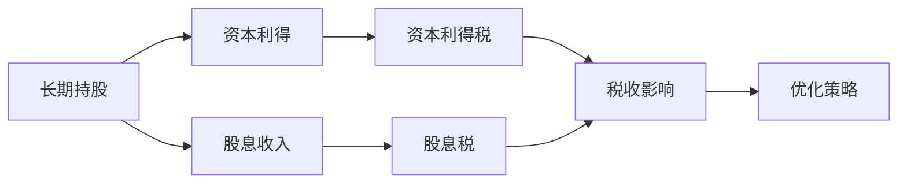

# 彼得林奇的"长期持股"在不同税制下的优化策略

> 关键词：彼得林奇、长期持股、税制、优化策略、投资收益

> 摘要：本文围绕彼得林奇的“长期持股”投资理念，深入探讨在不同税制环境下的优化策略。首先介绍了研究的背景、目的、预期读者等内容，接着阐述了“长期持股”及相关税制的核心概念与联系。通过详细的算法原理和数学模型，分析不同税制对长期持股收益的影响。结合项目实战案例，展示在实际操作中如何根据税制进行投资决策。同时，列举了该投资策略的实际应用场景，并推荐了相关的学习资源、开发工具和研究论文。最后总结了未来发展趋势与挑战，解答了常见问题并提供了扩展阅读和参考资料，旨在为投资者在不同税制下运用“长期持股”策略提供全面且深入的指导。

## 1. 背景介绍 
### 1.1 目的和范围
彼得林奇作为投资界的传奇人物，其“长期持股”的投资理念影响深远。然而，不同国家和地区的税收制度存在显著差异，这些差异会对长期持股的实际收益产生重大影响。本研究的目的在于深入分析在不同税制下，如何优化彼得林奇的“长期持股”策略，以实现投资收益的最大化。研究范围涵盖了常见的税制类型，包括资本利得税、股息税等，并结合实际案例进行分析。

### 1.2 预期读者
本文主要面向对股票投资感兴趣的个人投资者、金融行业从业者以及相关领域的研究人员。对于那些希望深入了解彼得林奇投资理念，并在不同税制环境下优化投资策略的读者具有较高的参考价值。

### 1.3 文档结构概述
本文将按照以下结构展开：首先介绍核心概念与联系，包括“长期持股”的原理和不同税制的特点；接着阐述核心算法原理和具体操作步骤，通过 Python 代码进行详细说明；然后给出数学模型和公式，并结合实际例子进行讲解；之后通过项目实战展示如何在实际中应用优化策略；再介绍实际应用场景和相关的工具资源；最后总结未来发展趋势与挑战，解答常见问题并提供扩展阅读和参考资料。

### 1.4 术语表
#### 1.4.1 核心术语定义
- **长期持股**：指投资者买入股票后，持有较长时间（通常为数年甚至数十年），不进行频繁的买卖操作，以获取股票长期增值和股息收益的投资策略。
- **资本利得税**：对投资者买卖股票等资产所获得的利润征收的税款。
- **股息税**：对投资者从股票中获得的股息收入征收的税款。

#### 1.4.2 相关概念解释
- **税收递延**：指投资者在一定期限内暂时不缴纳税款，而是将纳税时间推迟到未来某个时期，从而获得资金的时间价值。
- **税收筹划**：指投资者通过合理安排投资行为，利用税收政策的差异和优惠，降低纳税负担，提高投资收益的行为。

#### 1.4.3 缩略词列表
- **CGT**：Capital Gains Tax（资本利得税）
- **DT**：Dividend Tax（股息税）

## 2. 核心概念与联系 

### 2.1 “长期持股”原理
彼得林奇认为，优秀的公司具有持续增长的潜力，通过长期持有这些公司的股票，可以分享公司成长带来的红利。长期持股可以避免短期市场波动的影响，减少交易成本，同时还能获得股息收入。

### 2.2 不同税制特点
- **资本利得税**：不同国家和地区的资本利得税税率和征收方式差异较大。有些国家对长期资本利得实行较低的税率，以鼓励长期投资；而有些国家则对短期和长期资本利得实行统一税率。
- **股息税**：股息税的税率也因国家和地区而异。一些国家对股息收入给予一定的税收优惠，如减免部分税款或实行较低的税率；而另一些国家则对股息收入全额征税。

### 2.3 核心概念架构示意图


## 3. 核心算法原理 & 具体操作步骤 

### 3.1 算法原理
为了分析不同税制下长期持股的收益情况，我们需要考虑以下几个因素：初始投资金额、股票的年收益率、持有年限、资本利得税税率和股息税税率。假设初始投资金额为 $P$，股票的年收益率为 $r$，持有年限为 $n$，资本利得税税率为 $t_{cg}$，股息税税率为 $t_d$。

在不考虑税收的情况下，长期持股的期末价值为 $V = P(1 + r)^n$。

考虑资本利得税时，资本利得为 $CG = P(1 + r)^n - P$，需要缴纳的资本利得税为 $T_{cg} = t_{cg} \times CG$，期末实际价值为 $V_{cg} = P(1 + r)^n - T_{cg}$。

考虑股息税时，假设每年的股息率为 $d$，每年获得的股息为 $D = P \times d$，需要缴纳的股息税为 $T_d = t_d \times D$。在 $n$ 年中，股息的税后累计收益为 $D_{total} = \sum_{i = 1}^{n} (D - T_d)(1 + r)^{n - i}$，期末实际价值为 $V_d = P(1 + r)^n + D_{total}$。

### 3.2 具体操作步骤
以下是使用 Python 实现上述算法的代码：
```python
def calculate_long_term_holding_value(P, r, n, t_cg, t_d, d):
    # 不考虑税收的期末价值
    V = P * (1 + r) ** n
    # 资本利得
    CG = V - P
    # 资本利得税
    T_cg = t_cg * CG
    # 考虑资本利得税的期末价值
    V_cg = V - T_cg
    # 股息税后累计收益
    D_total = 0
    for i in range(1, n + 1):
        D = P * d
        T_d = t_d * D
        D_total += (D - T_d) * (1 + r) ** (n - i)
    # 考虑股息税的期末价值
    V_d = V + D_total
    return V, V_cg, V_d

# 示例参数
P = 10000  # 初始投资金额
r = 0.1  # 股票年收益率
n = 10  # 持有年限
t_cg = 0.2  # 资本利得税税率
t_d = 0.1  # 股息税税率
d = 0.03  # 股息率

V, V_cg, V_d = calculate_long_term_holding_value(P, r, n, t_cg, t_d, d)
print(f"不考虑税收的期末价值: {V}")
print(f"考虑资本利得税的期末价值: {V_cg}")
print(f"考虑股息税的期末价值: {V_d}")
```
### 3.3 代码解释
- `calculate_long_term_holding_value` 函数接受初始投资金额 `P`、股票年收益率 `r`、持有年限 `n`、资本利得税税率 `t_cg`、股息税税率 `t_d` 和股息率 `d` 作为参数。
- 首先计算不考虑税收的期末价值 `V`。
- 然后计算资本利得 `CG` 和资本利得税 `T_cg`，并得到考虑资本利得税的期末价值 `V_cg`。
- 接着通过循环计算每年的股息税后收益，并累加到 `D_total` 中，得到考虑股息税的期末价值 `V_d`。
- 最后返回三种情况下的期末价值。

## 4. 数学模型和公式 & 详细讲解 & 举例说明 

### 4.1 不考虑税收的期末价值
不考虑税收时，长期持股的期末价值可以用复利公式表示：
$$V = P(1 + r)^n$$
其中，$V$ 为期末价值，$P$ 为初始投资金额，$r$ 为股票的年收益率，$n$ 为持有年限。

例如，初始投资金额 $P = 10000$ 元，股票年收益率 $r = 0.1$，持有年限 $n = 10$ 年，则不考虑税收的期末价值为：
$$V = 10000\times(1 + 0.1)^{10} \approx 25937.42$$ 元。

### 4.2 考虑资本利得税的期末价值
资本利得为 $CG = P(1 + r)^n - P$，需要缴纳的资本利得税为 $T_{cg} = t_{cg} \times CG$，则考虑资本利得税的期末价值为：
$$V_{cg} = P(1 + r)^n - t_{cg} \times [P(1 + r)^n - P] = P\left[(1 + r)^n - t_{cg}((1 + r)^n - 1)\right]$$

继续以上面的例子，假设资本利得税税率 $t_{cg} = 0.2$，则资本利得为 $CG = 25937.42 - 10000 = 15937.42$ 元，需要缴纳的资本利得税为 $T_{cg} = 0.2\times15937.42 = 3187.48$ 元，考虑资本利得税的期末价值为 $V_{cg} = 25937.42 - 3187.48 = 22749.94$ 元。

### 4.3 考虑股息税的期末价值
假设每年的股息率为 $d$，每年获得的股息为 $D = P \times d$，需要缴纳的股息税为 $T_d = t_d \times D$。在 $n$ 年中，股息的税后累计收益为：
$$D_{total} = \sum_{i = 1}^{n} (D - T_d)(1 + r)^{n - i} = (P \times d)(1 - t_d)\sum_{i = 1}^{n} (1 + r)^{n - i}$$
考虑股息税的期末价值为：
$$V_d = P(1 + r)^n + D_{total}$$

假设股息率 $d = 0.03$，股息税税率 $t_d = 0.1$，则每年的股息为 $D = 10000\times0.03 = 300$ 元，每年需要缴纳的股息税为 $T_d = 0.1\times300 = 30$ 元，税后股息为 $D - T_d = 270$ 元。

通过等比数列求和公式计算股息的税后累计收益：
$$D_{total} = 270\times\frac{(1 + 0.1)^{10} - 1}{0.1} \approx 4239.78$$ 元。

考虑股息税的期末价值为 $V_d = 25937.42 + 4239.78 = 30177.2$ 元。

## 5. 项目实战：代码实际案例和详细解释说明 

### 5.1  开发环境搭建
- **Python 安装**：确保你的系统中已经安装了 Python 3.x 版本。可以从 Python 官方网站（https://www.python.org/downloads/）下载并安装。
- **IDE 选择**：推荐使用 PyCharm 或 Jupyter Notebook 作为开发环境。PyCharm 是一款功能强大的 Python IDE，提供了丰富的代码编辑、调试和项目管理功能；Jupyter Notebook 则适合进行交互式编程和数据分析，方便展示代码和结果。

### 5.2  源代码详细实现和代码解读
以下是一个更完整的 Python 代码示例，用于分析不同税制下长期持股的收益情况，并进行可视化展示：
```python
import matplotlib.pyplot as plt

def calculate_long_term_holding_value(P, r, n, t_cg, t_d, d):
    # 不考虑税收的期末价值
    V = P * (1 + r) ** n
    # 资本利得
    CG = V - P
    # 资本利得税
    T_cg = t_cg * CG
    # 考虑资本利得税的期末价值
    V_cg = V - T_cg
    # 股息税后累计收益
    D_total = 0
    for i in range(1, n + 1):
        D = P * d
        T_d = t_d * D
        D_total += (D - T_d) * (1 + r) ** (n - i)
    # 考虑股息税的期末价值
    V_d = V + D_total
    return V, V_cg, V_d

# 示例参数
P = 10000  # 初始投资金额
r = 0.1  # 股票年收益率
n = 10  # 持有年限
t_cg_list = [0, 0.1, 0.2, 0.3]  # 不同的资本利得税税率
t_d = 0.1  # 股息税税率
d = 0.03  # 股息率

V_list = []
V_cg_list = []
V_d_list = []

for t_cg in t_cg_list:
    V, V_cg, V_d = calculate_long_term_holding_value(P, r, n, t_cg, t_d, d)
    V_list.append(V)
    V_cg_list.append(V_cg)
    V_d_list.append(V_d)

# 可视化结果
plt.figure(figsize=(10, 6))
plt.plot(t_cg_list, V_list, label='No Tax')
plt.plot(t_cg_list, V_cg_list, label='With Capital Gains Tax')
plt.plot(t_cg_list, V_d_list, label='With Dividend Tax')
plt.xlabel('Capital Gains Tax Rate')
plt.ylabel('Final Value')
plt.title('Long-Term Holding Value under Different Tax Regimes')
plt.legend()
plt.grid(True)
plt.show()
```
### 5.3  代码解读与分析
- **函数定义**：`calculate_long_term_holding_value` 函数用于计算不同情况下的期末价值，与前面的代码类似。
- **参数设置**：定义了初始投资金额、股票年收益率、持有年限、不同的资本利得税税率、股息税税率和股息率。
- **循环计算**：通过循环遍历不同的资本利得税税率，调用 `calculate_long_term_holding_value` 函数计算相应的期末价值，并将结果存储在列表中。
- **可视化展示**：使用 `matplotlib` 库绘制折线图，展示不同税制下长期持股的期末价值随资本利得税税率的变化情况。

从可视化结果可以直观地看出，资本利得税和股息税对长期持股的收益有显著影响。随着资本利得税税率的增加，考虑资本利得税的期末价值逐渐降低；而考虑股息税的期末价值则相对稳定，因为股息税主要影响股息收入，而不是股票的增值部分。

## 6. 实际应用场景 
### 6.1 个人投资者
对于个人投资者来说，在选择长期持股的股票时，需要考虑不同税制的影响。例如，在资本利得税较高的地区，可以选择股息率较高的股票，以获取更多的股息收入，并通过合理的税收筹划降低纳税负担。同时，投资者还可以利用税收递延账户（如 IRA、401(k) 等）进行长期投资，享受税收优惠。

### 6.2 机构投资者
机构投资者通常管理着大量的资金，对税收的敏感度较高。在进行资产配置和投资决策时，需要充分考虑不同税制的差异。例如，在不同国家和地区设立投资组合，利用当地的税收政策优化投资收益。此外，机构投资者还可以通过专业的税务顾问进行税收筹划，降低整体税负。

### 6.3 跨国投资
在跨国投资中，不同国家的税制差异更为明显。投资者需要了解目标国家的资本利得税、股息税、印花税等税收政策，以及税收协定的相关规定。通过合理的投资架构设计和税收筹划，降低跨国投资的税收成本，提高投资收益。

## 7. 工具和资源推荐
### 7.1 学习资源推荐
#### 7.1.1 书籍推荐
- 《彼得林奇的成功投资》：彼得林奇的经典著作，详细介绍了他的投资理念和方法。
- 《聪明的投资者》：本杰明·格雷厄姆的代表作，被誉为投资界的圣经，对价值投资和长期投资有深入的阐述。
- 《税收筹划》：系统介绍了税收筹划的基本原理和方法，对投资者了解如何在不同税制下优化投资收益有很大帮助。

#### 7.1.2 在线课程
- Coursera 上的“投资学原理”：由知名高校的教授授课，涵盖了投资的基本理论和实践方法。
- edX 上的“税收政策与筹划”：深入讲解了税收政策的制定和税收筹划的技巧。

#### 7.1.3 技术博客和网站
- Seeking Alpha：提供专业的投资分析和研究报告，涵盖了全球市场的股票、基金等投资品种。
- Investopedia：一个权威的金融投资知识网站，提供了丰富的投资术语解释、投资策略分析等内容。

### 7.2 开发工具框架推荐
#### 7.2.1 IDE和编辑器
- PyCharm：功能强大的 Python IDE，适合进行大规模的 Python 项目开发。
- Jupyter Notebook：交互式编程环境，方便进行数据分析和可视化展示。

#### 7.2.2 调试和性能分析工具
- PDB：Python 自带的调试工具，可以帮助开发者定位代码中的问题。
- cProfile：Python 的性能分析工具，用于分析代码的运行时间和性能瓶颈。

#### 7.2.3 相关框架和库
- Pandas：用于数据处理和分析的 Python 库，提供了丰富的数据结构和函数。
- Matplotlib：用于数据可视化的 Python 库，支持多种图表类型的绘制。

### 7.3 相关论文著作推荐
#### 7.3.1 经典论文
- “Capital Gains Taxation and Asset Pricing”：探讨了资本利得税对资产定价的影响。
- “Dividend Taxation and Corporate Payout Policy”：研究了股息税对公司股利政策的影响。

#### 7.3.2 最新研究成果
- 关注顶尖金融学术期刊，如《Journal of Finance》、《Review of Financial Studies》等，了解关于税收和投资的最新研究动态。

#### 7.3.3 应用案例分析
- 一些知名投资机构的研究报告和案例分析，如高盛、摩根大通等，提供了实际应用中的投资策略和税收筹划方法。

## 8. 总结：未来发展趋势与挑战
### 8.1 未来发展趋势
- **税收政策调整**：随着经济形势的变化和政府财政需求的调整，各国的税收政策可能会发生变化。投资者需要密切关注税收政策的动态，及时调整投资策略。
- **数字化税收管理**：随着信息技术的发展，税收管理将越来越数字化。投资者可以利用数字化工具进行税收筹划和投资决策，提高效率和准确性。
- **全球税收协调**：在全球化的背景下，各国之间的税收协调将越来越重要。未来可能会出现更多的国际税收协定和合作机制，以减少跨国投资的税收障碍。

### 8.2 挑战
- **税收政策复杂性**：不同国家和地区的税收政策复杂多样，投资者需要花费大量的时间和精力去了解和研究。
- **税收筹划风险**：税收筹划需要在合法合规的前提下进行，如果操作不当，可能会面临税务风险和法律责任。
- **市场不确定性**：股票市场本身具有不确定性，税收政策的变化也会对市场产生影响。投资者需要在考虑税收因素的同时，合理应对市场风险。

## 9. 附录：常见问题与解答
### 9.1 长期持股一定能获得高收益吗？
长期持股并不一定能获得高收益，股票的收益受到多种因素的影响，如公司的基本面、行业发展趋势、宏观经济环境等。长期持股只是一种投资策略，需要选择具有成长潜力的优质股票，并耐心持有。

### 9.2 如何进行税收筹划？
税收筹划需要在合法合规的前提下进行。投资者可以通过选择合适的投资产品、利用税收优惠政策、合理安排投资时间等方式进行税收筹划。同时，建议咨询专业的税务顾问，以确保税收筹划的方案符合法律法规的要求。

### 9.3 不同国家的税收政策差异很大，如何应对？
投资者在进行跨国投资时，需要充分了解目标国家的税收政策。可以通过阅读相关的税收法规、咨询当地的税务机构或专业顾问等方式获取信息。同时，合理设计投资架构，利用税收协定等方式降低跨国投资的税收成本。

## 10. 扩展阅读 & 参考资料
### 10.1 扩展阅读
- 《金融炼金术》：乔治·索罗斯的著作，介绍了他的投资哲学和交易策略。
- 《漫步华尔街》：伯顿·马尔基尔的经典之作，对股票市场的有效性和投资策略进行了深入探讨。

### 10.2 参考资料
- 各国税收法规和政策文件。
- 金融学术期刊和研究报告。
- 相关的投资书籍和网站。