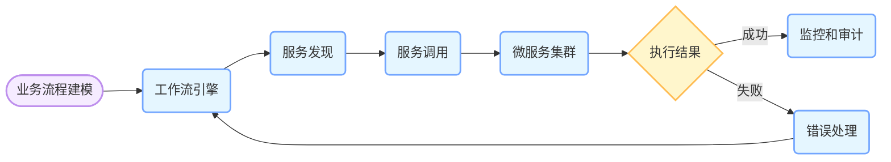

# 微服务治理专家：智能服务编排

> 关键词：微服务治理、智能服务编排、服务依赖、工作流引擎、分布式系统

> 摘要：本文聚焦于微服务治理中的智能服务编排。首先介绍了微服务治理和智能服务编排的背景，明确目的、范围、预期读者等内容。接着阐述核心概念，包括智能服务编排的原理和架构，并通过示意图和流程图展示。详细讲解了核心算法原理和具体操作步骤，结合 Python 代码示例。同时给出相关数学模型和公式，并举例说明。通过项目实战，从开发环境搭建到源代码实现和解读进行了全面剖析。探讨了智能服务编排的实际应用场景，推荐了学习资源、开发工具框架和相关论文著作。最后总结未来发展趋势与挑战，提供常见问题解答和扩展阅读参考资料，旨在帮助读者深入理解和应用智能服务编排技术。

## 1. 背景介绍 
### 1.1 目的和范围
在当今的软件开发领域，微服务架构已经成为构建复杂分布式系统的主流选择。随着微服务数量的不断增加，服务之间的交互变得愈发复杂，如何有效地管理和协调这些服务成为了一个关键问题。智能服务编排作为微服务治理的重要组成部分，旨在通过自动化和智能化的方式，对微服务进行高效的组织和调度，以实现业务流程的自动化执行和优化。

本文的范围将涵盖智能服务编排的核心概念、算法原理、数学模型、项目实战、应用场景、工具资源等方面。通过全面深入的介绍，帮助读者了解智能服务编排的技术细节和实际应用方法。

### 1.2 预期读者
本文预期读者包括软件开发者、软件架构师、CTO、微服务治理相关的技术人员以及对分布式系统和微服务架构感兴趣的学习者。无论是想要深入了解智能服务编排技术的专业人士，还是初学者，都可以从本文中获取有价值的信息。

### 1.3 文档结构概述
本文将按照以下结构进行组织：
1. 背景介绍：介绍智能服务编排的目的、范围、预期读者和文档结构。
2. 核心概念与联系：阐述智能服务编排的核心概念、原理和架构，并通过示意图和流程图进行展示。
3. 核心算法原理 & 具体操作步骤：详细讲解智能服务编排的核心算法原理，并给出具体的操作步骤，同时使用 Python 代码进行示例。
4. 数学模型和公式 & 详细讲解 & 举例说明：介绍智能服务编排相关的数学模型和公式，并进行详细讲解和举例说明。
5. 项目实战：代码实际案例和详细解释说明：通过一个实际的项目案例，展示智能服务编排的开发过程，包括开发环境搭建、源代码实现和代码解读。
6. 实际应用场景：探讨智能服务编排的实际应用场景。
7. 工具和资源推荐：推荐学习资源、开发工具框架和相关论文著作。
8. 总结：未来发展趋势与挑战：总结智能服务编排的未来发展趋势和面临的挑战。
9. 附录：常见问题与解答：提供常见问题的解答。
10. 扩展阅读 & 参考资料：提供扩展阅读和参考资料。

### 1.4 术语表
#### 1.4.1 核心术语定义
- **微服务治理**：对微服务架构中的各个服务进行管理、监控、协调和优化的一系列技术和方法。
- **智能服务编排**：通过自动化和智能化的方式，对微服务进行组织和调度，以实现业务流程的自动化执行和优化。
- **服务依赖**：一个微服务的正常运行依赖于其他微服务的输出或状态。
- **工作流引擎**：用于定义、执行和管理业务流程的软件系统。

#### 1.4.2 相关概念解释
- **分布式系统**：由多个独立的计算机节点组成的系统，这些节点通过网络进行通信和协作。
- **容器化技术**：将应用程序及其依赖项打包成一个独立的容器，实现应用程序的隔离和可移植性。
- **DevOps**：开发（Development）和运维（Operations）的结合，强调开发团队和运维团队之间的协作和自动化。

#### 1.4.3 缩略词列表
- **REST**：Representational State Transfer，一种基于 HTTP 协议的轻量级 Web 服务架构风格。
- **RPC**：Remote Procedure Call，远程过程调用，允许程序调用远程计算机上的过程。
- **Kubernetes**：一个开源的容器编排平台，用于自动化部署、扩展和管理容器化应用程序。

## 2. 核心概念与联系 
### 核心概念原理
智能服务编排的核心原理是通过定义业务流程和服务之间的依赖关系，使用工作流引擎来自动化执行这些流程。在微服务架构中，每个微服务通常只负责完成一个特定的业务功能，而多个微服务之间需要协同工作来完成一个复杂的业务流程。智能服务编排就是要解决如何将这些微服务有机地组合起来，以实现业务流程的自动化执行。

具体来说，智能服务编排需要完成以下几个任务：
1. **业务流程建模**：使用图形化工具或编程语言定义业务流程，包括流程的步骤、条件判断、循环等。
2. **服务发现**：在微服务架构中，服务的地址和状态是动态变化的，因此需要一种机制来发现和定位可用的服务。
3. **服务调用**：根据业务流程的定义，调用相应的微服务来完成具体的业务功能。
4. **错误处理**：在服务调用过程中，可能会出现各种错误，如网络故障、服务不可用等，需要有相应的错误处理机制来保证业务流程的可靠性。
5. **监控和审计**：对业务流程的执行情况进行监控和审计，以便及时发现和解决问题。

### 架构的文本示意图
以下是一个简单的智能服务编排架构的文本示意图：

```
+-------------------+
| 业务流程建模工具  |
+-------------------+
         |
         v
+-------------------+
| 工作流引擎        |
+-------------------+
         |
         v
+-------------------+
| 服务发现组件      |
+-------------------+
         |
         v
+-------------------+
| 服务调用组件      |
+-------------------+
         |
         v
+-------------------+
| 微服务集群        |
+-------------------+
         |
         v
+-------------------+
| 监控和审计组件    |
+-------------------+
```

### Mermaid 流程图


这个流程图展示了智能服务编排的主要流程：首先进行业务流程建模，然后由工作流引擎驱动，通过服务发现找到可用的微服务，进行服务调用。服务调用的结果会进行判断，如果成功则进行监控和审计，如果失败则进行错误处理，然后重新回到工作流引擎继续执行。

## 3. 核心算法原理 & 具体操作步骤 
### 核心算法原理
智能服务编排的核心算法主要涉及到服务调度和依赖关系处理。其中一个常用的算法是拓扑排序算法，用于处理服务之间的依赖关系，确保服务按照正确的顺序进行调用。

拓扑排序算法的基本思想是：对于一个有向无环图（DAG），找到一个顶点的线性序列，使得对于图中的任意一条有向边 (u, v)，顶点 u 在序列中都出现在顶点 v 之前。在智能服务编排中，服务可以看作是图中的顶点，服务之间的依赖关系可以看作是有向边。

### Python 代码实现拓扑排序算法
```python
from collections import defaultdict, deque

def topological_sort(graph):
    # 计算每个顶点的入度
    in_degree = defaultdict(int)
    for node in graph:
        for neighbor in graph[node]:
            in_degree[neighbor] += 1

    # 初始化队列，将入度为 0 的顶点加入队列
    queue = deque([node for node in graph if in_degree[node] == 0])
    result = []

    # 进行拓扑排序
    while queue:
        node = queue.popleft()
        result.append(node)
        # 减少相邻顶点的入度
        for neighbor in graph[node]:
            in_degree[neighbor] -= 1
            if in_degree[neighbor] == 0:
                queue.append(neighbor)

    # 如果结果的长度等于图中顶点的数量，则说明图是有向无环图，排序成功
    if len(result) == len(graph):
        return result
    else:
        return None

# 示例图
graph = {
    'A': ['B', 'C'],
    'B': ['D'],
    'C': ['D'],
    'D': []
}

# 调用拓扑排序算法
sorted_order = topological_sort(graph)
if sorted_order:
    print("拓扑排序结果:", sorted_order)
else:
    print("图中存在环，无法进行拓扑排序。")
```

### 具体操作步骤
1. **定义服务依赖关系图**：将微服务之间的依赖关系表示为一个有向无环图，使用字典来存储图的信息，键表示顶点，值表示该顶点的相邻顶点列表。
2. **计算入度**：遍历图，计算每个顶点的入度，即有多少条有向边指向该顶点。
3. **初始化队列**：将入度为 0 的顶点加入队列。
4. **进行拓扑排序**：从队列中取出一个顶点，将其加入结果列表，并减少其相邻顶点的入度。如果相邻顶点的入度变为 0，则将其加入队列。
5. **检查结果**：如果结果列表的长度等于图中顶点的数量，则说明图是有向无环图，排序成功；否则，图中存在环，无法进行拓扑排序。

## 4. 数学模型和公式 & 详细讲解 & 举例说明 
### 数学模型
智能服务编排可以使用图论中的有向无环图（DAG）来建模。一个有向无环图 $G=(V, E)$ 由顶点集 $V$ 和有向边集 $E$ 组成，其中 $V$ 表示微服务的集合，$E$ 表示服务之间的依赖关系。

### 拓扑排序的数学公式
设 $G=(V, E)$ 是一个有向无环图，$|V|$ 表示顶点的数量，$|E|$ 表示边的数量。拓扑排序的时间复杂度可以用以下公式表示：

$$T = O(|V| + |E|)$$

这是因为在拓扑排序的过程中，需要遍历所有的顶点和边一次。

### 详细讲解
在拓扑排序算法中，主要的操作是计算入度和减少入度。计算入度的过程需要遍历所有的边，时间复杂度为 $O(|E|)$；减少入度的过程也需要遍历所有的边，时间复杂度同样为 $O(|E|)$。而将入度为 0 的顶点加入队列和从队列中取出顶点的操作，每个顶点最多进行一次，时间复杂度为 $O(|V|)$。因此，总的时间复杂度为 $O(|V| + |E|)$。

### 举例说明
假设有一个由 4 个微服务组成的系统，服务之间的依赖关系如下：
- 服务 A 依赖于服务 B 和服务 C。
- 服务 B 依赖于服务 D。
- 服务 C 依赖于服务 D。
- 服务 D 没有依赖。

可以将这个系统表示为一个有向无环图，其中顶点集 $V = \{A, B, C, D\}$，边集 $E = \{(A, B), (A, C), (B, D), (C, D)\}$。

使用拓扑排序算法对这个图进行排序，首先计算每个顶点的入度：
- $in_degree(A) = 0$
- $in_degree(B) = 1$
- $in_degree(C) = 1$
- $in_degree(D) = 2$

将入度为 0 的顶点 A 加入队列，然后取出 A，减少其相邻顶点 B 和 C 的入度，此时 $in_degree(B) = 0$，$in_degree(C) = 0$，将 B 和 C 加入队列。接着取出 B，减少其相邻顶点 D 的入度，此时 $in_degree(D) = 1$。再取出 C，减少 D 的入度，此时 $in_degree(D) = 0$，将 D 加入队列。最后取出 D，排序完成，结果为 $[A, B, C, D]$。

## 5. 项目实战：代码实际案例和详细解释说明 
### 5.1  开发环境搭建
#### 环境准备
- **操作系统**：推荐使用 Linux 系统，如 Ubuntu 18.04 或更高版本。
- **编程语言**：Python 3.7 或更高版本。
- **容器化技术**：Docker 和 Docker Compose。
- **编排工具**：Apache Airflow。

#### 安装步骤
1. **安装 Python**：可以从 Python 官方网站下载并安装 Python 3.7 或更高版本。
2. **安装 Docker 和 Docker Compose**：按照 Docker 官方文档的指导，安装 Docker 和 Docker Compose。
3. **安装 Apache Airflow**：可以使用 pip 安装 Apache Airflow：
```bash
pip install apache-airflow
```

### 5.2  源代码详细实现和代码解读
#### 示例场景
假设我们有一个简单的业务流程，包括三个微服务：数据采集服务、数据处理服务和数据存储服务。数据采集服务负责从数据源采集数据，数据处理服务对采集到的数据进行处理，数据存储服务将处理后的数据存储到数据库中。

#### 代码实现
```python
from datetime import datetime
from airflow import DAG
from airflow.operators.python_operator import PythonOperator

# 模拟数据采集服务
def data_collection():
    print("数据采集服务正在运行...")
    # 模拟数据采集过程
    data = "采集到的数据"
    return data

# 模拟数据处理服务
def data_processing(**kwargs):
    ti = kwargs['ti']
    data = ti.xcom_pull(task_ids='data_collection')
    print("数据处理服务正在运行...")
    # 模拟数据处理过程
    processed_data = data.upper()
    return processed_data

# 模拟数据存储服务
def data_storage(**kwargs):
    ti = kwargs['ti']
    processed_data = ti.xcom_pull(task_ids='data_processing')
    print("数据存储服务正在运行...")
    # 模拟数据存储过程
    print("存储的数据:", processed_data)

# 定义 DAG
dag = DAG(
    'data_processing_dag',
    description='数据处理流程 DAG',
    schedule_interval=None,
    start_date=datetime(2023, 1, 1)
)

# 定义任务
data_collection_task = PythonOperator(
    task_id='data_collection',
    python_callable=data_collection,
    dag=dag
)

data_processing_task = PythonOperator(
    task_id='data_processing',
    python_callable=data_processing,
    provide_context=True,
    dag=dag
)

data_storage_task = PythonOperator(
    task_id='data_storage',
    python_callable=data_storage,
    provide_context=True,
    dag=dag
)

# 定义任务依赖关系
data_collection_task >> data_processing_task >> data_storage_task
```

#### 代码解读
1. **导入必要的模块**：从 `airflow` 模块中导入 `DAG` 和 `PythonOperator`，用于定义 DAG 和任务。
2. **定义微服务函数**：定义了三个函数 `data_collection`、`data_processing` 和 `data_storage`，分别模拟数据采集、数据处理和数据存储服务。
3. **定义 DAG**：使用 `DAG` 类定义一个 DAG，指定 DAG 的名称、描述、调度间隔和开始日期。
4. **定义任务**：使用 `PythonOperator` 类定义三个任务，分别对应三个微服务函数。
5. **定义任务依赖关系**：使用 `>>` 运算符定义任务之间的依赖关系，确保任务按照正确的顺序执行。

### 5.3  代码解读与分析
#### 任务执行顺序
在这个示例中，任务的执行顺序是：数据采集任务 -> 数据处理任务 -> 数据存储任务。这是通过定义任务依赖关系实现的，确保了数据处理任务在数据采集任务完成后执行，数据存储任务在数据处理任务完成后执行。

#### 数据传递
在数据处理任务和数据存储任务中，使用了 `xcom_pull` 方法从上游任务中获取数据。`xcom` 是 Airflow 中的一个机制，用于在任务之间传递数据。

#### 可扩展性
这个示例代码具有很好的可扩展性。如果需要添加新的微服务，只需要定义新的函数和任务，并调整任务依赖关系即可。

## 6. 实际应用场景 
### 电商系统
在电商系统中，智能服务编排可以用于处理订单流程。一个订单的处理通常涉及到多个微服务，如商品库存检查、用户账户验证、支付处理、物流安排等。通过智能服务编排，可以将这些微服务有机地组合起来，实现订单处理流程的自动化执行。例如，当用户提交一个订单时，系统可以自动调用商品库存检查服务，检查商品是否有库存；如果有库存，则调用用户账户验证服务，验证用户的账户信息；验证通过后，调用支付处理服务完成支付；最后调用物流安排服务安排商品的配送。

### 金融系统
在金融系统中，智能服务编排可以用于处理交易流程。一个交易的处理通常涉及到多个环节，如风险评估、资金验证、交易执行等。通过智能服务编排，可以确保交易流程的合规性和安全性。例如，当用户发起一笔交易时，系统可以自动调用风险评估服务，评估交易的风险等级；如果风险等级在可接受范围内，则调用资金验证服务，验证用户的资金是否充足；验证通过后，调用交易执行服务完成交易。

### 物联网系统
在物联网系统中，智能服务编排可以用于处理设备数据。物联网设备会产生大量的数据，这些数据需要进行采集、处理和存储。通过智能服务编排，可以将数据采集、数据处理和数据存储等微服务组合起来，实现设备数据的自动化处理。例如，当物联网设备产生数据时，系统可以自动调用数据采集服务，采集设备数据；然后调用数据处理服务，对采集到的数据进行清洗、分析和挖掘；最后调用数据存储服务，将处理后的数据存储到数据库中。

## 7. 工具和资源推荐
### 7.1 学习资源推荐
#### 7.1.1 书籍推荐
- 《微服务架构设计模式》：本书详细介绍了微服务架构的设计模式和最佳实践，对于理解微服务治理和智能服务编排有很大的帮助。
- 《Python 数据分析实战》：Python 是智能服务编排中常用的编程语言，本书介绍了 Python 在数据分析领域的应用，对于学习智能服务编排中的数据处理和分析有一定的参考价值。
- 《Docker 实战》：Docker 是容器化技术的代表，本书介绍了 Docker 的基本原理和使用方法，对于理解智能服务编排中的容器化部署有很大的帮助。

#### 7.1.2 在线课程
- Coursera 上的“微服务架构与设计”课程：该课程由知名高校的教授授课，系统地介绍了微服务架构的理论和实践。
- Udemy 上的“Python 编程从入门到精通”课程：该课程适合初学者，全面介绍了 Python 的基础知识和应用。
- edX 上的“容器化技术与 Kubernetes”课程：该课程介绍了容器化技术和 Kubernetes 的基本原理和使用方法。

#### 7.1.3 技术博客和网站
- InfoQ：一个专注于软件开发和技术创新的媒体平台，提供了大量关于微服务治理和智能服务编排的文章和案例。
- Medium：一个技术博客平台，有很多技术专家分享关于微服务架构和智能服务编排的经验和见解。
- Kubernetes 官方文档：Kubernetes 是一个重要的容器编排平台，其官方文档提供了详细的使用指南和教程。

### 7.2 开发工具框架推荐
#### 7.2.1 IDE和编辑器
- PyCharm：一款专业的 Python 集成开发环境，提供了丰富的代码编辑、调试和测试功能。
- Visual Studio Code：一款轻量级的代码编辑器，支持多种编程语言，有丰富的插件生态系统。
- IntelliJ IDEA：一款功能强大的 Java 集成开发环境，也支持 Python 开发。

#### 7.2.2 调试和性能分析工具
- PDB：Python 自带的调试工具，可以帮助开发者调试 Python 代码。
- Py-Spy：一个用于分析 Python 程序性能的工具，可以实时查看程序的 CPU 使用率和函数调用情况。
- Docker Desktop：提供了可视化的界面，方便开发者管理 Docker 容器和镜像。

#### 7.2.3 相关框架和库
- Apache Airflow：一个开源的工作流管理平台，用于自动化调度和监控任务。
- Celery：一个分布式任务队列，用于处理异步任务。
- Flask：一个轻量级的 Python Web 框架，适合开发微服务。

### 7.3 相关论文著作推荐
#### 7.3.1 经典论文
- “Microservices: a definition of this new architectural term”：该论文对微服务架构进行了定义和阐述，是微服务领域的经典论文。
- “Service Oriented Architecture: Concepts, Technology, and Design”：该论文介绍了面向服务架构（SOA）的概念、技术和设计方法，对理解微服务架构有很大的帮助。

#### 7.3.2 最新研究成果
- 可以关注 ACM SIGSOFT、IEEE Transactions on Software Engineering 等学术期刊和会议，了解智能服务编排领域的最新研究成果。

#### 7.3.3 应用案例分析
- 可以参考一些知名企业的技术博客，如 Netflix、Amazon 等，了解他们在微服务治理和智能服务编排方面的应用案例和实践经验。

## 8. 总结：未来发展趋势与挑战
### 未来发展趋势
#### 智能化程度不断提高
随着人工智能和机器学习技术的发展，智能服务编排将越来越智能化。例如，通过机器学习算法可以自动优化服务调度策略，根据服务的性能和负载情况动态调整服务的调用顺序和资源分配。

#### 与区块链技术的结合
区块链技术具有去中心化、不可篡改、安全可靠等特点，将智能服务编排与区块链技术结合，可以提高服务调用的可信度和安全性。例如，在金融交易等领域，可以使用区块链技术来记录服务调用的历史和结果，确保交易的透明性和可追溯性。

#### 云原生技术的广泛应用
云原生技术如 Kubernetes、Docker 等已经成为微服务架构的主流技术，未来智能服务编排将更加紧密地与云原生技术结合。例如，使用 Kubernetes 的自动化部署和管理功能，可以实现智能服务编排的快速部署和弹性伸缩。

### 面临的挑战
#### 服务间通信的复杂性
随着微服务数量的增加，服务之间的通信变得越来越复杂。如何保证服务间通信的可靠性、高效性和安全性是一个挑战。例如，在分布式环境中，网络延迟、丢包等问题可能会影响服务间通信的质量。

#### 错误处理和恢复机制
在智能服务编排中，错误处理和恢复机制是非常重要的。由于微服务的分布式特性，一个服务的故障可能会影响整个业务流程的执行。如何快速检测和处理错误，并进行有效的恢复是一个挑战。

#### 安全性和隐私保护
智能服务编排涉及到多个微服务之间的交互，数据在不同服务之间传输和处理。如何保证数据的安全性和隐私性是一个挑战。例如，在金融和医疗等领域，数据的安全性和隐私保护尤为重要。

## 9. 附录：常见问题与解答
### 问题 1：智能服务编排和服务治理有什么区别？
智能服务编排是服务治理的一个重要组成部分。服务治理是对微服务架构中的各个服务进行管理、监控、协调和优化的一系列技术和方法，而智能服务编排主要关注如何通过自动化和智能化的方式，对微服务进行组织和调度，以实现业务流程的自动化执行和优化。

### 问题 2：拓扑排序算法在智能服务编排中有什么作用？
拓扑排序算法用于处理服务之间的依赖关系，确保服务按照正确的顺序进行调用。在智能服务编排中，服务之间通常存在依赖关系，通过拓扑排序算法可以找到一个合理的服务调用顺序，避免因服务调用顺序不当而导致的错误。

### 问题 3：Apache Airflow 适合用于大规模的智能服务编排吗？
Apache Airflow 具有良好的扩展性和可维护性，适合用于大规模的智能服务编排。它支持分布式部署和并行执行任务，可以处理大量的任务和复杂的业务流程。同时，Apache Airflow 提供了丰富的插件和接口，可以方便地与其他系统集成。

### 问题 4：如何保证智能服务编排系统的可靠性？
可以从以下几个方面保证智能服务编排系统的可靠性：
1. **错误处理和恢复机制**：在服务调用过程中，要对可能出现的错误进行捕获和处理，并提供有效的恢复机制。
2. **监控和审计**：对业务流程的执行情况进行实时监控和审计，及时发现和解决问题。
3. **备份和恢复**：定期对系统数据进行备份，以便在出现故障时能够快速恢复。
4. **冗余和容错设计**：采用冗余设计和容错机制，确保系统在部分组件出现故障时仍能正常运行。

## 10. 扩展阅读 & 参考资料
### 扩展阅读
- 《云原生技术实践》：本书介绍了云原生技术的实践经验和最佳实践，对于理解智能服务编排与云原生技术的结合有很大的帮助。
- 《分布式系统原理与范型》：本书介绍了分布式系统的基本原理和范型，对于理解微服务架构和智能服务编排的分布式特性有一定的参考价值。

### 参考资料
- Apache Airflow 官方文档：https://airflow.apache.org/docs/
- Docker 官方文档：https://docs.docker.com/
- Kubernetes 官方文档：https://kubernetes.io/docs/
- Python 官方文档：https://docs.python.org/3/