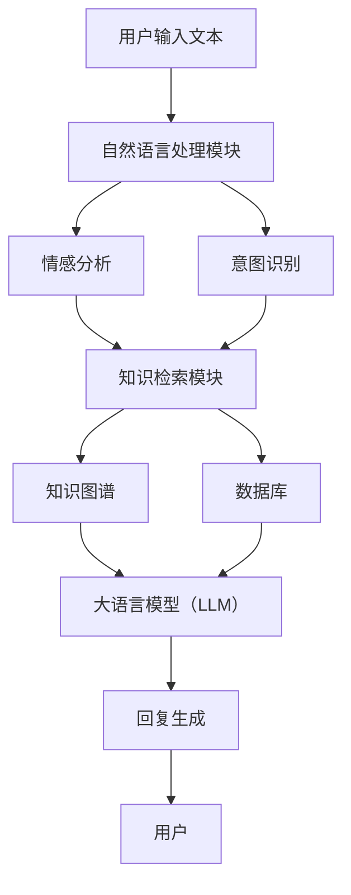

# 心理咨询 AI Agent：LLM 在心理健康领域的应用

> 关键词：心理咨询、AI Agent、大语言模型（LLM）、心理健康、自然语言处理

> 摘要：本文深入探讨了心理咨询 AI Agent 在心理健康领域的应用。首先介绍了相关背景，包括研究目的、预期读者、文档结构等内容。接着阐述了心理咨询 AI Agent 和大语言模型（LLM）的核心概念及它们之间的联系，并给出了相应的文本示意图和 Mermaid 流程图。详细讲解了实现心理咨询 AI Agent 的核心算法原理，结合 Python 源代码进行阐述，同时介绍了相关的数学模型和公式。通过项目实战，展示了代码实际案例并进行详细解释说明。分析了心理咨询 AI Agent 在心理健康领域的实际应用场景，推荐了学习该领域所需的工具和资源，包括书籍、在线课程、开发工具框架以及相关论文著作等。最后总结了未来发展趋势与挑战，并对常见问题进行了解答，提供了扩展阅读和参考资料，旨在为读者全面呈现心理咨询 AI Agent 在心理健康领域应用的相关知识和技术。

## 1. 背景介绍 
### 1.1 目的和范围
在当今社会，心理健康问题日益受到关注，寻求心理咨询的需求不断增加。然而，专业心理咨询师的数量有限，无法满足庞大的需求。心理咨询 AI Agent 的出现为解决这一问题提供了新的途径。本文的目的在于深入探讨大语言模型（LLM）在心理咨询 AI Agent 中的应用，详细介绍其技术原理、实现方法以及实际应用场景等内容。范围涵盖了从基础概念的介绍到具体算法实现，再到项目实战和应用场景分析等多个方面，旨在为读者全面了解和研究心理咨询 AI Agent 在心理健康领域的应用提供有价值的参考。

### 1.2 预期读者
本文预期读者包括对人工智能在心理健康领域应用感兴趣的科研人员、技术开发者、心理咨询从业者以及相关专业的学生。对于科研人员，本文可以提供新的研究思路和方向；技术开发者可以从中获取实现心理咨询 AI Agent 的具体技术细节和代码示例；心理咨询从业者能够了解如何借助 AI 技术提升心理咨询服务的效率和质量；相关专业的学生则可以通过本文系统地学习和掌握该领域的知识。

### 1.3 文档结构概述
本文首先介绍背景信息，包括目的、预期读者和文档结构等内容。接着阐述核心概念与联系，让读者对心理咨询 AI Agent 和 LLM 有清晰的认识。然后详细讲解核心算法原理和具体操作步骤，结合 Python 源代码进行说明。随后介绍相关的数学模型和公式，并举例说明。通过项目实战展示代码实际案例并进行详细解释。分析实际应用场景，为读者呈现心理咨询 AI Agent 在心理健康领域的具体应用。推荐学习该领域所需的工具和资源，包括书籍、在线课程、开发工具框架以及相关论文著作等。最后总结未来发展趋势与挑战，解答常见问题，并提供扩展阅读和参考资料。

### 1.4 术语表
#### 1.4.1 核心术语定义
- **心理咨询 AI Agent**：是一种能够模拟心理咨询师与用户进行交互，提供心理支持、咨询和建议的人工智能程序。它利用自然语言处理技术理解用户的问题，并根据一定的算法和知识模型生成相应的回复。
- **大语言模型（LLM）**：是基于深度学习的语言模型，通过在大规模文本数据上进行训练，学习语言的模式和规律，能够生成自然流畅的文本。常见的大语言模型如 GPT 系列、BERT 等。
- **自然语言处理（NLP）**：是人工智能的一个分支领域，主要研究如何让计算机理解、处理和生成自然语言。它涉及到文本分类、情感分析、机器翻译等多个任务。

#### 1.4.2 相关概念解释
- **情感分析**：是自然语言处理中的一项重要任务，用于识别文本中表达的情感倾向，如积极、消极或中性。在心理咨询 AI Agent 中，情感分析可以帮助了解用户的情绪状态。
- **知识图谱**：是一种语义网络，用于表示实体之间的关系和知识。在心理咨询领域，知识图谱可以整合心理学知识、案例等信息，为 AI Agent 提供更丰富的知识支持。

#### 1.4.3 缩略词列表
- **LLM**：Large Language Model（大语言模型）
- **NLP**：Natural Language Processing（自然语言处理）

## 2. 核心概念与联系 

### 核心概念原理
#### 心理咨询 AI Agent
心理咨询 AI Agent 的核心原理是模拟心理咨询师的工作流程。它首先通过自然语言处理技术理解用户输入的文本信息，包括问题描述、情感表达等。然后，根据预定义的算法和知识模型，对用户的问题进行分析和推理，生成合适的回复。这个过程可能涉及到情感分析、意图识别、知识检索等多个步骤。例如，当用户输入“我最近总是很焦虑，不知道该怎么办”时，AI Agent 会先分析用户的情感倾向为焦虑，然后识别用户的意图是寻求解决焦虑的方法，接着从知识模型中检索相关的建议和策略，最后生成回复，如“焦虑是一种常见的情绪，你可以尝试通过深呼吸、运动等方式来缓解焦虑情绪。同时，也可以和身边的朋友或家人倾诉，分享你的感受。”

#### 大语言模型（LLM）
大语言模型（LLM）是基于Transformer架构的深度学习模型。它通过在大规模文本数据上进行无监督学习，学习语言的模式和规律。LLM 具有强大的语言生成能力，能够根据输入的文本生成自然流畅的回复。其训练过程通常采用自监督学习的方式，例如预测下一个单词或填补文本中的空缺。在训练完成后，LLM 可以通过微调等方式适应不同的任务，如心理咨询。

### 架构的文本示意图
```plaintext
用户输入文本 -> 自然语言处理模块（情感分析、意图识别） -> 知识检索模块（知识图谱、数据库） -> 大语言模型（LLM） -> 回复生成 -> 用户
```
这个示意图展示了心理咨询 AI Agent 的基本工作流程。用户输入文本后，首先经过自然语言处理模块进行情感分析和意图识别，然后知识检索模块从知识图谱和数据库中检索相关的知识，接着大语言模型（LLM）根据这些信息生成回复，最后将回复返回给用户。

### Mermaid 流程图

这个流程图更加直观地展示了心理咨询 AI Agent 的工作流程。用户输入文本后，经过自然语言处理模块的情感分析和意图识别，将结果传递给知识检索模块，知识检索模块从知识图谱和数据库中获取相关知识，然后大语言模型（LLM）根据这些知识生成回复，最后将回复返回给用户。

## 3. 核心算法原理 & 具体操作步骤 

### 核心算法原理
#### 自然语言处理算法
自然语言处理算法主要包括情感分析和意图识别。情感分析可以使用基于机器学习的分类算法，如朴素贝叶斯分类器、支持向量机等，也可以使用深度学习模型，如循环神经网络（RNN）、长短期记忆网络（LSTM）等。意图识别可以通过文本分类的方法实现，将用户的问题分类到不同的意图类别中。

#### 知识检索算法
知识检索算法可以基于关键词匹配、语义匹配等方法。关键词匹配是最简单的方法，通过在知识图谱和数据库中查找与用户问题中关键词匹配的知识。语义匹配则是通过计算文本的语义相似度，找到与用户问题语义相近的知识。

#### 大语言模型（LLM）生成算法
大语言模型（LLM）的生成算法基于其内部的神经网络结构。在输入文本的基础上，LLM 通过多层的注意力机制和前馈神经网络进行计算，预测下一个单词的概率分布，然后根据概率分布选择合适的单词生成回复。

### 具体操作步骤
#### 步骤 1：数据预处理
首先，需要对训练数据进行预处理。训练数据可以包括心理咨询案例、心理学知识文本等。预处理步骤包括文本清洗（去除噪声、标点符号等）、分词、词向量化等。以下是一个简单的 Python 代码示例：
```python
import re
import jieba
from sklearn.feature_extraction.text import TfidfVectorizer

def clean_text(text):
    text = re.sub(r'[^\w\s]', '', text)  # 去除标点符号
    text = text.lower()  # 转换为小写
    return text

def tokenize(text):
    return jieba.lcut(text)  # 中文分词

def vectorize(texts):
    vectorizer = TfidfVectorizer(tokenizer=tokenize)
    vectors = vectorizer.fit_transform(texts)
    return vectors, vectorizer
```
#### 步骤 2：情感分析模型训练
可以使用朴素贝叶斯分类器进行情感分析模型的训练。以下是一个简单的 Python 代码示例：
```python
from sklearn.naive_bayes import MultinomialNB
from sklearn.model_selection import train_test_split
from sklearn.metrics import accuracy_score

# 假设已经有训练数据 X（文本）和 y（情感标签）
X = [...]
y = [...]

X_cleaned = [clean_text(text) for text in X]
X_vectors, vectorizer = vectorize(X_cleaned)

X_train, X_test, y_train, y_test = train_test_split(X_vectors, y, test_size=0.2, random_state=42)

clf = MultinomialNB()
clf.fit(X_train, y_train)

y_pred = clf.predict(X_test)
accuracy = accuracy_score(y_test, y_pred)
print(f"情感分析模型准确率: {accuracy}")
```
#### 步骤 3：意图识别模型训练
可以使用逻辑回归模型进行意图识别模型的训练。以下是一个简单的 Python 代码示例：
```python
from sklearn.linear_model import LogisticRegression

# 假设已经有训练数据 X（文本）和 y（意图标签）
X = [...]
y = [...]

X_cleaned = [clean_text(text) for text in X]
X_vectors, vectorizer = vectorize(X_cleaned)

X_train, X_test, y_train, y_test = train_test_split(X_vectors, y, test_size=0.2, random_state=42)

clf = LogisticRegression()
clf.fit(X_train, y_train)

y_pred = clf.predict(X_test)
accuracy = accuracy_score(y_test, y_pred)
print(f"意图识别模型准确率: {accuracy}")
```
#### 步骤 4：知识检索
根据用户的问题，使用关键词匹配或语义匹配的方法从知识图谱和数据库中检索相关的知识。以下是一个简单的关键词匹配的 Python 代码示例：
```python
def keyword_search(query, knowledge_base):
    results = []
    for item in knowledge_base:
        if any(keyword in item for keyword in query.split()):
            results.append(item)
    return results
```
#### 步骤 5：大语言模型（LLM）生成回复
可以使用开源的大语言模型，如 Hugging Face 的 Transformers 库中的模型。以下是一个简单的 Python 代码示例：
```python
from transformers import AutoModelForCausalLM, AutoTokenizer

model_name = "gpt2"
tokenizer = AutoTokenizer.from_pretrained(model_name)
model = AutoModelForCausalLM.from_pretrained(model_name)

def generate_response(query, knowledge):
    input_text = f"用户问题: {query} 相关知识: {knowledge}"
    input_ids = tokenizer.encode(input_text, return_tensors="pt")
    output = model.generate(input_ids)
    response = tokenizer.decode(output[0], skip_special_tokens=True)
    return response
```

## 4. 数学模型和公式 & 详细讲解 & 举例说明 

### 情感分析的数学模型和公式
#### 朴素贝叶斯分类器
朴素贝叶斯分类器基于贝叶斯定理，通过计算每个类别的后验概率来进行分类。贝叶斯定理的公式为：
$$P(c|x) = \frac{P(x|c)P(c)}{P(x)}$$
其中，$P(c|x)$ 是在给定特征 $x$ 的情况下类别 $c$ 的后验概率，$P(x|c)$ 是在类别 $c$ 下特征 $x$ 的似然概率，$P(c)$ 是类别 $c$ 的先验概率，$P(x)$ 是特征 $x$ 的概率。

在朴素贝叶斯分类器中，假设特征之间是相互独立的，因此可以将 $P(x|c)$ 分解为各个特征的条件概率的乘积：
$$P(x|c) = \prod_{i=1}^{n}P(x_i|c)$$
其中，$x_i$ 是特征 $x$ 的第 $i$ 个分量，$n$ 是特征的维度。

在实际应用中，为了避免概率为 0 的情况，通常会使用拉普拉斯平滑：
$$P(x_i|c) = \frac{count(x_i, c) + \alpha}{count(c) + \alpha|V|}$$
其中，$count(x_i, c)$ 是在类别 $c$ 中特征 $x_i$ 出现的次数，$count(c)$ 是类别 $c$ 中的样本数，$|V|$ 是词汇表的大小，$\alpha$ 是平滑参数。

举例说明：假设有一个文本分类任务，类别为积极和消极，特征为单词。已知在积极类别中，单词“开心”出现了 10 次，积极类别的样本数为 100，词汇表的大小为 1000，平滑参数 $\alpha = 1$。则单词“开心”在积极类别下的条件概率为：
$$P(开心|积极) = \frac{10 + 1}{100 + 1\times1000} = \frac{11}{1100} = 0.01$$

### 意图识别的数学模型和公式
#### 逻辑回归
逻辑回归是一种广义线性模型，通过逻辑函数将线性回归的输出映射到 $[0, 1]$ 之间的概率值。逻辑函数的公式为：
$$\sigma(z) = \frac{1}{1 + e^{-z}}$$
其中，$z$ 是线性回归的输出：
$$z = \theta_0 + \theta_1x_1 + \theta_2x_2 + \cdots + \theta_nx_n$$
其中，$\theta_i$ 是模型的参数，$x_i$ 是特征。

逻辑回归的损失函数通常使用对数损失函数：
$$J(\theta) = -\frac{1}{m}\sum_{i=1}^{m}[y^{(i)}\log(\sigma(z^{(i)})) + (1 - y^{(i)})\log(1 - \sigma(z^{(i)}))]$$
其中，$m$ 是样本数，$y^{(i)}$ 是第 $i$ 个样本的真实标签，$\sigma(z^{(i)})$ 是第 $i$ 个样本的预测概率。

在训练过程中，通过最小化损失函数来更新模型的参数 $\theta$，通常使用梯度下降法。梯度下降法的更新公式为：
$$\theta_j := \theta_j - \alpha\frac{\partial J(\theta)}{\partial \theta_j}$$
其中，$\alpha$ 是学习率。

举例说明：假设有一个二分类的意图识别任务，特征为单词的词频。已知一个样本的特征向量为 $x = [1, 2, 3]$，模型的参数为 $\theta = [0.1, 0.2, 0.3]$，则线性回归的输出为：
$$z = 0.1\times1 + 0.2\times2 + 0.3\times3 = 0.1 + 0.4 + 0.9 = 1.4$$
预测概率为：
$$\sigma(z) = \frac{1}{1 + e^{-1.4}} \approx 0.802$$

### 大语言模型（LLM）的数学模型和公式
#### Transformer 架构
Transformer 架构基于注意力机制，主要包括编码器和解码器。注意力机制的公式为：
$$Attention(Q, K, V) = softmax(\frac{QK^T}{\sqrt{d_k}})V$$
其中，$Q$ 是查询矩阵，$K$ 是键矩阵，$V$ 是值矩阵，$d_k$ 是键向量的维度。

多头注意力机制是将多个注意力头的输出拼接在一起：
$$MultiHead(Q, K, V) = Concat(head_1, head_2, \cdots, head_h)W^O$$
其中，$head_i = Attention(QW_i^Q, KW_i^K, VW_i^V)$，$W_i^Q$、$W_i^K$、$W_i^V$ 是线性变换矩阵，$W^O$ 是输出的线性变换矩阵。

Transformer 架构的编码器和解码器都由多个层组成，每层包括多头注意力机制和前馈神经网络。前馈神经网络的公式为：
$$FFN(x) = max(0, xW_1 + b_1)W_2 + b_2$$
其中，$W_1$、$W_2$ 是权重矩阵，$b_1$、$b_2$ 是偏置向量。

举例说明：假设有一个查询向量 $q$、键向量 $k$ 和值向量 $v$，维度都为 64。则注意力分数为：
$$score = \frac{qk^T}{\sqrt{64}}$$
通过 softmax 函数将分数转换为概率分布，然后根据概率分布对值向量进行加权求和得到注意力输出。

## 5. 项目实战：代码实际案例和详细解释说明 

### 5.1  开发环境搭建
#### 安装 Python
首先，需要安装 Python 环境。可以从 Python 官方网站（https://www.python.org/downloads/） 下载并安装适合自己操作系统的 Python 版本。建议安装 Python 3.7 及以上版本。

#### 安装必要的库
使用以下命令安装必要的库：
```sh
pip install scikit-learn jieba transformers
```
`scikit-learn` 是一个常用的机器学习库，用于模型训练和评估；`jieba` 是一个中文分词库；`transformers` 是 Hugging Face 提供的用于使用预训练大语言模型的库。

### 5.2  源代码详细实现和代码解读
```python
import re
import jieba
from sklearn.feature_extraction.text import TfidfVectorizer
from sklearn.naive_bayes import MultinomialNB
from sklearn.linear_model import LogisticRegression
from sklearn.model_selection import train_test_split
from sklearn.metrics import accuracy_score
from transformers import AutoModelForCausalLM, AutoTokenizer

# 数据预处理
def clean_text(text):
    text = re.sub(r'[^\w\s]', '', text)  # 去除标点符号
    text = text.lower()  # 转换为小写
    return text

def tokenize(text):
    return jieba.lcut(text)  # 中文分词

def vectorize(texts):
    vectorizer = TfidfVectorizer(tokenizer=tokenize)
    vectors = vectorizer.fit_transform(texts)
    return vectors, vectorizer

# 情感分析模型训练
def train_sentiment_model(X, y):
    X_cleaned = [clean_text(text) for text in X]
    X_vectors, vectorizer = vectorize(X_cleaned)

    X_train, X_test, y_train, y_test = train_test_split(X_vectors, y, test_size=0.2, random_state=42)

    clf = MultinomialNB()
    clf.fit(X_train, y_train)

    y_pred = clf.predict(X_test)
    accuracy = accuracy_score(y_test, y_pred)
    print(f"情感分析模型准确率: {accuracy}")

    return clf, vectorizer

# 意图识别模型训练
def train_intent_model(X, y):
    X_cleaned = [clean_text(text) for text in X]
    X_vectors, vectorizer = vectorize(X_cleaned)

    X_train, X_test, y_train, y_test = train_test_split(X_vectors, y, test_size=0.2, random_state=42)

    clf = LogisticRegression()
    clf.fit(X_train, y_train)

    y_pred = clf.predict(X_test)
    accuracy = accuracy_score(y_test, y_pred)
    print(f"意图识别模型准确率: {accuracy}")

    return clf, vectorizer

# 知识检索
def keyword_search(query, knowledge_base):
    results = []
    for item in knowledge_base:
        if any(keyword in item for keyword in query.split()):
            results.append(item)
    return results

# 大语言模型（LLM）生成回复
def generate_response(query, knowledge):
    model_name = "gpt2"
    tokenizer = AutoTokenizer.from_pretrained(model_name)
    model = AutoModelForCausalLM.from_pretrained(model_name)

    input_text = f"用户问题: {query} 相关知识: {knowledge}"
    input_ids = tokenizer.encode(input_text, return_tensors="pt")
    output = model.generate(input_ids)
    response = tokenizer.decode(output[0], skip_special_tokens=True)
    return response

# 主函数
def main():
    # 假设已经有训练数据
    sentiment_X = [...]
    sentiment_y = [...]
    intent_X = [...]
    intent_y = [...]
    knowledge_base = [...]

    # 训练情感分析模型
    sentiment_clf, sentiment_vectorizer = train_sentiment_model(sentiment_X, sentiment_y)

    # 训练意图识别模型
    intent_clf, intent_vectorizer = train_intent_model(intent_X, intent_y)

    # 用户输入
    user_query = input("请输入你的问题: ")

    # 情感分析
    user_query_cleaned = clean_text(user_query)
    user_query_vector = sentiment_vectorizer.transform([user_query_cleaned])
    sentiment = sentiment_clf.predict(user_query_vector)[0]
    print(f"情感倾向: {sentiment}")

    # 意图识别
    user_query_vector = intent_vectorizer.transform([user_query_cleaned])
    intent = intent_clf.predict(user_query_vector)[0]
    print(f"意图: {intent}")

    # 知识检索
    knowledge = keyword_search(user_query, knowledge_base)
    print(f"相关知识: {knowledge}")

    # 生成回复
    response = generate_response(user_query, knowledge)
    print(f"回复: {response}")

if __name__ == "__main__":
    main()
```
### 5.3  代码解读与分析
#### 数据预处理部分
`clean_text` 函数用于去除文本中的标点符号并将文本转换为小写，`tokenize` 函数使用 `jieba` 库进行中文分词，`vectorize` 函数使用 `TfidfVectorizer` 将文本转换为向量表示。

#### 模型训练部分
`train_sentiment_model` 函数使用朴素贝叶斯分类器训练情感分析模型，`train_intent_model` 函数使用逻辑回归模型训练意图识别模型。在训练过程中，将数据分为训练集和测试集，并计算模型的准确率。

#### 知识检索部分
`keyword_search` 函数通过关键词匹配的方法从知识图谱中检索相关的知识。

#### 回复生成部分
`generate_response` 函数使用 `transformers` 库中的 GPT-2 模型生成回复。首先将用户问题和相关知识拼接成输入文本，然后将输入文本转换为模型的输入格式，最后生成回复并解码输出。

#### 主函数部分
主函数首先训练情感分析模型和意图识别模型，然后获取用户输入，进行情感分析、意图识别和知识检索，最后生成回复并输出。

## 6. 实际应用场景 
### 在线心理咨询平台
在在线心理咨询平台中，心理咨询 AI Agent 可以作为初步筛选和引导工具。当用户进入平台时，AI Agent 可以与用户进行交互，了解用户的问题和需求，进行初步的情感分析和意图识别。对于一些常见的心理问题，AI Agent 可以提供相应的建议和解决方案。对于较为复杂的问题，AI Agent 可以将用户转接给专业的心理咨询师，提高咨询效率。

### 心理健康教育
在心理健康教育领域，心理咨询 AI Agent 可以作为学习辅助工具。学生可以通过与 AI Agent 进行交互，学习心理学知识，了解心理健康问题的应对方法。AI Agent 可以根据学生的问题和学习进度，提供个性化的学习建议和资源推荐，帮助学生更好地掌握心理健康知识。

### 心理危机干预
在心理危机干预场景中，心理咨询 AI Agent 可以及时响应并提供支持。当用户处于心理危机状态时，AI Agent 可以通过情感分析识别用户的情绪状态，提供紧急的心理支持和引导，如安抚情绪、提供危机干预热线等信息。同时，AI Agent 可以将用户的情况及时通知相关的专业人员，以便进行进一步的干预。

### 企业员工心理健康管理
在企业中，心理咨询 AI Agent 可以为员工提供心理健康服务。员工可以随时与 AI Agent 交流，分享工作和生活中的压力和困扰。AI Agent 可以根据员工的问题提供相应的解决方案，如压力管理技巧、情绪调节方法等。同时，企业可以通过 AI Agent 收集员工的心理健康数据，进行分析和评估，制定相应的心理健康管理策略。

## 7. 工具和资源推荐
### 7.1 学习资源推荐
#### 7.1.1 书籍推荐
- 《Python 自然语言处理》：本书详细介绍了 Python 中自然语言处理的相关技术和方法，包括文本处理、分类、聚类等内容，适合初学者学习。
- 《深度学习》：由 Ian Goodfellow、Yoshua Bengio 和 Aaron Courville 合著，是深度学习领域的经典教材，涵盖了神经网络、卷积神经网络、循环神经网络等内容，对于理解大语言模型的原理有很大帮助。
- 《心理咨询与治疗经典案例》：这本书通过实际案例介绍了心理咨询与治疗的方法和技巧，对于了解心理咨询的工作流程和需求有很大帮助。

#### 7.1.2 在线课程
- Coursera 上的“自然语言处理专项课程”：由斯坦福大学的教授授课，系统地介绍了自然语言处理的相关知识和技术，包括词嵌入、序列模型、注意力机制等内容。
- edX 上的“深度学习微硕士项目”：包含多个深度学习相关的课程，对于深入学习大语言模型和人工智能技术有很大帮助。
- 中国大学 MOOC 上的“心理咨询理论与实务”：由国内高校的专家授课，介绍了心理咨询的基本理论和实践方法。

#### 7.1.3 技术博客和网站
- Hugging Face 博客：提供了关于大语言模型和自然语言处理的最新研究成果和技术应用案例。
- Medium 上的人工智能和自然语言处理相关博客：有很多优秀的技术文章和案例分享。
- 中国心理学会官网：提供了心理健康领域的最新研究成果和行业动态。

### 7.2 开发工具框架推荐
#### 7.2.1 IDE和编辑器
- PyCharm：是一款专业的 Python 集成开发环境，提供了代码编辑、调试、版本控制等功能，适合开发 Python 项目。
- Visual Studio Code：是一款轻量级的代码编辑器，支持多种编程语言和插件扩展，对于快速开发和调试代码非常方便。

#### 7.2.2 调试和性能分析工具
- PDB：是 Python 自带的调试工具，可以帮助开发者定位和解决代码中的问题。
- TensorBoard：是 TensorFlow 提供的可视化工具，可以用于查看模型的训练过程和性能指标。

#### 7.2.3 相关框架和库
- Scikit-learn：是一个常用的机器学习库，提供了多种机器学习算法和工具，如分类、回归、聚类等。
- Transformers：是 Hugging Face 提供的用于使用预训练大语言模型的库，支持多种模型和任务。
- Jieba：是一个中文分词库，用于中文文本的分词处理。

### 7.3 相关论文著作推荐
#### 7.3.1 经典论文
- “Attention Is All You Need”：介绍了 Transformer 架构，是大语言模型的基础。
- “BERT: Pre-training of Deep Bidirectional Transformers for Language Understanding”：提出了 BERT 模型，在自然语言处理领域取得了很大的突破。
- “Word2Vec Parameter Learning Explained”：解释了 Word2Vec 模型的参数学习过程，对于理解词嵌入技术有很大帮助。

#### 7.3.2 最新研究成果
- 关注 ACL（Association for Computational Linguistics）、EMNLP（Conference on Empirical Methods in Natural Language Processing）等自然语言处理领域的顶级会议，获取最新的研究成果。
- 关注 ArXiv 预印本平台，及时了解人工智能和自然语言处理领域的最新研究动态。

#### 7.3.3 应用案例分析
- 阅读相关的学术期刊和研究报告，了解心理咨询 AI Agent 在心理健康领域的实际应用案例和效果评估。
- 关注行业内的领先企业和研究机构的官方网站，获取他们在该领域的实践经验和成果分享。

## 8. 总结：未来发展趋势与挑战
### 未来发展趋势
#### 个性化服务
未来的心理咨询 AI Agent 将能够根据用户的个人信息、历史咨询记录等数据，提供更加个性化的服务。例如，根据用户的性格特点、心理状态等因素，生成适合用户的建议和解决方案。

#### 多模态交互
除了文本交互外，心理咨询 AI Agent 将支持多模态交互，如语音、图像等。用户可以通过语音与 AI Agent 交流，更加方便快捷。同时，AI Agent 可以通过分析用户的语音语调、面部表情等信息，更好地了解用户的情绪状态。

#### 与专业心理咨询师的协作
心理咨询 AI Agent 将与专业心理咨询师实现更好的协作。AI Agent 可以作为专业心理咨询师的辅助工具，帮助他们进行初步的评估和筛选，提高咨询效率。同时，专业心理咨询师可以对 AI Agent 的回复进行审核和优化，提升服务质量。

#### 融合更多的心理健康数据
未来的心理咨询 AI Agent 将融合更多的心理健康数据，如生理数据（心率、血压等）、行为数据（睡眠质量、运动情况等）。通过综合分析这些数据，AI Agent 可以更全面地了解用户的心理健康状况，提供更加精准的建议和干预措施。

### 挑战
#### 数据隐私和安全
心理咨询涉及到用户的隐私信息，如个人心理问题、情感状态等。因此，如何保障用户数据的隐私和安全是一个重要的挑战。需要采取严格的安全措施，如数据加密、访问控制等，防止用户数据泄露。

#### 伦理和法律问题
心理咨询 AI Agent 的应用涉及到一系列伦理和法律问题。例如，AI Agent 的回复是否会对用户造成误导或伤害，AI Agent 是否应该承担相应的法律责任等。需要建立相应的伦理和法律规范，确保心理咨询 AI Agent 的合法合规应用。

#### 模型的可解释性
大语言模型（LLM）通常是黑盒模型，其决策过程难以解释。在心理咨询领域，用户需要了解 AI Agent 给出建议的依据和原因。因此，如何提高模型的可解释性是一个亟待解决的问题。

#### 专业知识的准确性和完整性
心理咨询是一个专业性很强的领域，需要准确和完整的心理学知识。如何确保心理咨询 AI Agent 掌握的专业知识的准确性和完整性，是保证其服务质量的关键。需要不断更新和完善知识图谱，提高 AI Agent 的专业水平。

## 9. 附录：常见问题与解答
### 问题 1：心理咨询 AI Agent 可以完全替代专业心理咨询师吗？
解答：目前，心理咨询 AI Agent 还不能完全替代专业心理咨询师。虽然 AI Agent 可以提供一些初步的心理支持和建议，但对于复杂的心理问题，如严重的心理障碍、精神疾病等，需要专业心理咨询师进行面对面的诊断和治疗。AI Agent 可以作为专业心理咨询师的辅助工具，提高咨询效率和服务范围。

### 问题 2：心理咨询 AI Agent 的回复准确可靠吗？
解答：心理咨询 AI Agent 的回复准确性和可靠性取决于多个因素，如模型的训练数据、算法的合理性、知识图谱的完整性等。目前，虽然 AI Agent 在不断发展和完善，但仍然存在一定的局限性。在使用心理咨询 AI Agent 时，用户应该保持理性和客观的态度，对于重要的心理问题，最好咨询专业的心理咨询师。

### 问题 3：如何保障心理咨询 AI Agent 用户数据的隐私和安全？
解答：为了保障用户数据的隐私和安全，开发和运营心理咨询 AI Agent 的机构需要采取一系列措施。例如，对用户数据进行加密处理，防止数据在传输和存储过程中被泄露；建立严格的访问控制机制，只有授权人员才能访问用户数据；定期进行安全审计和漏洞修复，及时发现和解决安全问题。

### 问题 4：心理咨询 AI Agent 是如何学习心理学知识的？
解答：心理咨询 AI Agent 学习心理学知识的方式主要有以下几种：一是通过在大规模的心理学文本数据上进行训练，学习语言的模式和规律；二是构建知识图谱，将心理学知识、案例等信息整合到知识图谱中，供 AI Agent 检索和使用；三是通过与专业心理咨询师的协作，获取专业的知识和经验，不断更新和完善自身的知识体系。

## 10. 扩展阅读 & 参考资料
### 扩展阅读
- 《人工智能时代的心理与教育变革》：探讨了人工智能对心理与教育领域的影响和变革，对于理解心理咨询 AI Agent 的发展趋势和应用前景有很大帮助。
- 《情感计算》：介绍了情感计算的相关理论和技术，对于了解如何通过人工智能技术分析和理解用户的情感状态有很大帮助。

### 参考资料
- 相关学术论文和研究报告，如 ACL、EMNLP 等会议的论文。
- 相关技术文档和开源代码，如 Hugging Face 的 Transformers 库的文档和代码。
- 专业心理咨询机构和行业协会的官方网站，获取心理健康领域的最新动态和标准规范。