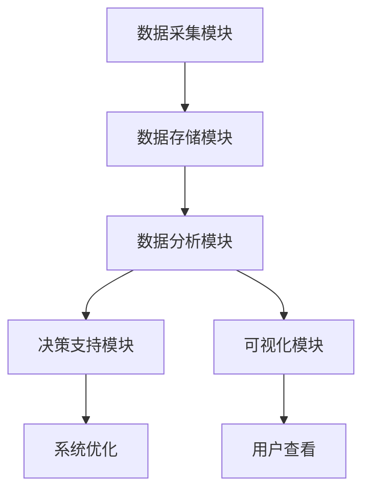

# 性能测试智能化：负载分析方案

> 关键词：性能测试、智能化、负载分析、性能指标、自动化

> 摘要：本文围绕性能测试智能化的负载分析方案展开深入探讨。首先介绍了性能测试智能化负载分析的背景和相关概念，包括目的、预期读者等。接着阐述了核心概念及联系，通过文本示意图和 Mermaid 流程图进行清晰展示。详细讲解了核心算法原理，并用 Python 源代码进行说明，同时给出了相关的数学模型和公式。通过项目实战，展示了开发环境搭建、源代码实现及解读。分析了实际应用场景，推荐了相关的工具和资源，包括学习资源、开发工具框架、论文著作等。最后总结了未来发展趋势与挑战，还提供了常见问题解答和扩展阅读参考资料，旨在为读者全面呈现性能测试智能化负载分析方案的全貌，助力读者在性能测试领域更好地开展工作。

## 1. 背景介绍 
### 1.1 目的和范围
性能测试在软件系统的开发、部署和维护过程中起着至关重要的作用。随着软件系统的规模不断扩大、复杂度不断增加，传统的性能测试方法已经难以满足需求。本负载分析方案的目的在于实现性能测试的智能化，通过对负载的深入分析，准确评估软件系统在不同负载条件下的性能表现，发现潜在的性能瓶颈，为系统的优化和改进提供有力依据。

本方案的范围涵盖了各种类型的软件系统，包括 Web 应用程序、移动应用、分布式系统等。适用于不同规模的开发团队和企业，无论是小型创业公司还是大型企业级项目，都可以借助本方案进行性能测试和负载分析。

### 1.2 预期读者
本文的预期读者包括软件测试工程师、性能测试专家、软件开发者、系统架构师以及对性能测试和负载分析感兴趣的技术人员。对于软件测试工程师，本方案可以帮助他们提升性能测试的效率和准确性；软件开发者可以通过负载分析结果优化代码，提高系统性能；系统架构师可以根据分析结果调整系统架构，确保系统的可扩展性和稳定性。

### 1.3 文档结构概述
本文将按照以下结构进行阐述：首先介绍性能测试智能化负载分析的背景知识，包括目的、预期读者和文档结构等。接着详细讲解核心概念及联系，通过文本示意图和 Mermaid 流程图进行直观展示。然后深入探讨核心算法原理，并用 Python 源代码进行详细说明，同时给出相关的数学模型和公式。通过项目实战，展示开发环境搭建、源代码实现及解读。分析实际应用场景，推荐相关的工具和资源，包括学习资源、开发工具框架、论文著作等。最后总结未来发展趋势与挑战，提供常见问题解答和扩展阅读参考资料。

### 1.4 术语表
#### 1.4.1 核心术语定义
- **性能测试**：指通过自动化的测试工具模拟多种正常、峰值以及异常负载条件来对系统的各项性能指标进行测试。
- **智能化**：指利用人工智能、机器学习等技术，使系统能够自动学习、分析和决策，提高性能测试的效率和准确性。
- **负载分析**：指对系统在不同负载条件下的性能表现进行分析，找出性能瓶颈和潜在问题。
- **性能指标**：指用于衡量系统性能的各种参数，如响应时间、吞吐量、并发用户数等。

#### 1.4.2 相关概念解释
- **并发用户数**：指在同一时刻，同时访问系统的用户数量。并发用户数的增加会对系统的性能产生显著影响。
- **吞吐量**：指系统在单位时间内处理的请求数量。吞吐量是衡量系统性能的重要指标之一。
- **响应时间**：指从用户发送请求到系统返回响应的时间间隔。响应时间越短，用户体验越好。

#### 1.4.3 缩略词列表
- **QPS**：Queries Per Second，每秒查询率，用于衡量系统的处理能力。
- **TPS**：Transactions Per Second，每秒事务数，用于衡量系统的事务处理能力。
- **CPU**：Central Processing Unit，中央处理器，是计算机的核心组件之一。
- **RAM**：Random Access Memory，随机存取存储器，用于暂时存储计算机运行时的数据。

## 2. 核心概念与联系 

### 核心概念原理
性能测试智能化负载分析的核心在于利用人工智能和机器学习技术，对系统在不同负载条件下的性能数据进行分析和挖掘。通过收集系统的性能指标数据，如响应时间、吞吐量、并发用户数等，建立性能模型。然后利用机器学习算法对性能模型进行训练和优化，从而实现对系统性能的预测和分析。

### 架构的文本示意图
性能测试智能化负载分析系统主要由以下几个部分组成：
1. **数据采集模块**：负责收集系统的性能指标数据，包括服务器的 CPU 使用率、内存使用率、网络带宽等，以及应用程序的响应时间、吞吐量等。
2. **数据存储模块**：用于存储采集到的性能数据，以便后续的分析和处理。可以使用关系型数据库或非关系型数据库进行存储。
3. **数据分析模块**：利用机器学习算法对存储的性能数据进行分析和挖掘，建立性能模型，找出性能瓶颈和潜在问题。
4. **决策支持模块**：根据数据分析结果，提供决策支持，如系统优化建议、资源分配建议等。
5. **可视化模块**：将分析结果以直观的图表和报表的形式展示给用户，方便用户理解和决策。

### Mermaid 流程图


## 3. 核心算法原理 & 具体操作步骤 

### 核心算法原理
在性能测试智能化负载分析中，常用的机器学习算法包括线性回归、决策树、随机森林等。这里以线性回归算法为例进行说明。

线性回归是一种用于预测连续数值的机器学习算法。在性能测试中，我们可以利用线性回归算法来建立性能指标之间的关系模型，例如响应时间和并发用户数之间的关系。通过对历史数据的学习，线性回归算法可以找到最佳的拟合直线，从而实现对响应时间的预测。

### Python 源代码详细阐述
```python
import numpy as np
from sklearn.linear_model import LinearRegression
import matplotlib.pyplot as plt

# 生成示例数据
# 并发用户数
X = np.array([10, 20, 30, 40, 50, 60, 70, 80, 90, 100]).reshape(-1, 1)
# 响应时间
y = np.array([0.5, 0.8, 1.2, 1.5, 1.8, 2.2, 2.5, 2.8, 3.2, 3.5])

# 创建线性回归模型
model = LinearRegression()

# 训练模型
model.fit(X, y)

# 预测新的响应时间
new_X = np.array([110]).reshape(-1, 1)
predicted_y = model.predict(new_X)

print(f"当并发用户数为 110 时，预测的响应时间为: {predicted_y[0]} 秒")

# 绘制数据点和拟合直线
plt.scatter(X, y, color='blue', label='实际数据')
plt.plot(X, model.predict(X), color='red', label='拟合直线')
plt.xlabel('并发用户数')
plt.ylabel('响应时间（秒）')
plt.title('线性回归模型')
plt.legend()
plt.show()
```
### 具体操作步骤
1. **数据收集**：收集系统在不同负载条件下的性能指标数据，如并发用户数和响应时间。
2. **数据预处理**：对收集到的数据进行清洗和预处理，去除异常值和缺失值。
3. **模型训练**：使用训练数据对线性回归模型进行训练。
4. **模型评估**：使用测试数据对训练好的模型进行评估，计算模型的准确率和误差。
5. **预测和分析**：使用训练好的模型对新的负载条件下的性能指标进行预测，并进行分析和决策。

## 4. 数学模型和公式 & 详细讲解 & 举例说明 

### 线性回归数学模型
线性回归的数学模型可以表示为：
$$y = \beta_0 + \beta_1x + \epsilon$$
其中，$y$ 是因变量（如响应时间），$x$ 是自变量（如并发用户数），$\beta_0$ 是截距，$\beta_1$ 是斜率，$\epsilon$ 是误差项。

### 最小二乘法求解参数
线性回归模型的目标是找到最佳的 $\beta_0$ 和 $\beta_1$，使得误差项的平方和最小。最小二乘法是一种常用的求解方法，其目标函数可以表示为：
$$J(\beta_0, \beta_1) = \sum_{i=1}^{n}(y_i - (\beta_0 + \beta_1x_i))^2$$
其中，$n$ 是样本数量，$y_i$ 是第 $i$ 个样本的实际值，$x_i$ 是第 $i$ 个样本的自变量值。

通过对目标函数求偏导数并令其等于 0，可以得到 $\beta_0$ 和 $\beta_1$ 的最优解：
$$\hat{\beta}_1 = \frac{\sum_{i=1}^{n}(x_i - \bar{x})(y_i - \bar{y})}{\sum_{i=1}^{n}(x_i - \bar{x})^2}$$
$$\hat{\beta}_0 = \bar{y} - \hat{\beta}_1\bar{x}$$
其中，$\bar{x}$ 和 $\bar{y}$ 分别是自变量和因变量的平均值。

### 举例说明
假设我们有以下样本数据：
| 并发用户数 ($x$) | 响应时间 ($y$) |
|---|---|
| 10 | 0.5 |
| 20 | 0.8 |
| 30 | 1.2 |
| 40 | 1.5 |
| 50 | 1.8 |

首先计算平均值：
$$\bar{x} = \frac{10 + 20 + 30 + 40 + 50}{5} = 30$$
$$\bar{y} = \frac{0.5 + 0.8 + 1.2 + 1.5 + 1.8}{5} = 1.16$$

然后计算 $\hat{\beta}_1$：
$$\sum_{i=1}^{5}(x_i - \bar{x})(y_i - \bar{y}) = (10 - 30)(0.5 - 1.16) + (20 - 30)(0.8 - 1.16) + (30 - 30)(1.2 - 1.16) + (40 - 30)(1.5 - 1.16) + (50 - 30)(1.8 - 1.16) = 20$$
$$\sum_{i=1}^{5}(x_i - \bar{x})^2 = (10 - 30)^2 + (20 - 30)^2 + (30 - 30)^2 + (40 - 30)^2 + (50 - 30)^2 = 1000$$
$$\hat{\beta}_1 = \frac{20}{1000} = 0.02$$

最后计算 $\hat{\beta}_0$：
$$\hat{\beta}_0 = 1.16 - 0.02 \times 30 = 0.56$$

所以，线性回归模型为：
$$y = 0.56 + 0.02x$$

当并发用户数为 60 时，预测的响应时间为：
$$y = 0.56 + 0.02 \times 60 = 1.76$$

## 5. 项目实战：代码实际案例和详细解释说明 

### 5.1  开发环境搭建
#### 安装 Python
首先需要安装 Python 开发环境。可以从 Python 官方网站（https://www.python.org/downloads/）下载适合自己操作系统的 Python 安装包，并按照安装向导进行安装。

#### 安装必要的库
使用以下命令安装必要的 Python 库：
```sh
pip install numpy scikit-learn matplotlib
```

### 5.2  源代码详细实现和代码解读
```python
import numpy as np
from sklearn.linear_model import LinearRegression
import matplotlib.pyplot as plt

# 生成示例数据
# 并发用户数
X = np.array([10, 20, 30, 40, 50, 60, 70, 80, 90, 100]).reshape(-1, 1)
# 响应时间
y = np.array([0.5, 0.8, 1.2, 1.5, 1.8, 2.2, 2.5, 2.8, 3.2, 3.5])

# 创建线性回归模型
model = LinearRegression()

# 训练模型
model.fit(X, y)

# 预测新的响应时间
new_X = np.array([110]).reshape(-1, 1)
predicted_y = model.predict(new_X)

print(f"当并发用户数为 110 时，预测的响应时间为: {predicted_y[0]} 秒")

# 绘制数据点和拟合直线
plt.scatter(X, y, color='blue', label='实际数据')
plt.plot(X, model.predict(X), color='red', label='拟合直线')
plt.xlabel('并发用户数')
plt.ylabel('响应时间（秒）')
plt.title('线性回归模型')
plt.legend()
plt.show()
```
### 代码解读
1. **数据生成**：使用 `np.array` 生成示例数据，包括并发用户数和响应时间。
2. **模型创建**：使用 `LinearRegression()` 创建线性回归模型。
3. **模型训练**：使用 `model.fit(X, y)` 对模型进行训练。
4. **预测**：使用 `model.predict(new_X)` 对新的并发用户数下的响应时间进行预测。
5. **可视化**：使用 `matplotlib` 库绘制数据点和拟合直线，直观展示模型的拟合效果。

### 5.3  代码解读与分析
通过上述代码，我们可以看到线性回归模型在性能测试负载分析中的应用。通过对历史数据的学习，模型可以预测新的负载条件下的响应时间，从而帮助我们评估系统的性能。

在实际应用中，我们可以收集更多的性能指标数据，如吞吐量、CPU 使用率等，并使用更复杂的机器学习算法，如决策树、随机森林等，来提高模型的准确性和泛化能力。

## 6. 实际应用场景 
### Web 应用程序
在 Web 应用程序的性能测试中，负载分析方案可以帮助开发团队评估系统在不同并发用户数下的性能表现。通过对响应时间、吞吐量等性能指标的分析，找出性能瓶颈，如数据库查询慢、服务器配置不足等，并进行相应的优化。

### 移动应用
对于移动应用，负载分析方案可以帮助测试人员模拟不同网络环境和用户操作场景，评估应用在不同负载条件下的性能。例如，在弱网络环境下，应用的响应时间是否过长，是否会出现卡顿等问题。

### 分布式系统
在分布式系统中，负载分析方案可以帮助架构师和运维人员评估系统的可扩展性和稳定性。通过对各个节点的性能指标进行分析，找出瓶颈节点，并进行资源分配和优化，确保系统在高负载下的正常运行。

## 7. 工具和资源推荐
### 7.1 学习资源推荐
#### 7.1.1 书籍推荐
- 《Python 机器学习》：介绍了 Python 中常用的机器学习算法和库，适合初学者入门。
- 《性能测试实战》：详细介绍了性能测试的方法和技巧，以及如何进行负载分析和优化。
- 《机器学习实战》：通过实际案例介绍了机器学习的应用，帮助读者更好地理解和掌握机器学习算法。

#### 7.1.2 在线课程
- Coursera 上的《机器学习》课程：由斯坦福大学的 Andrew Ng 教授授课，是机器学习领域的经典课程。
- edX 上的《Python 数据科学》课程：介绍了 Python 在数据科学领域的应用，包括数据处理、数据分析和机器学习等。
- 网易云课堂上的《性能测试从入门到精通》课程：详细介绍了性能测试的流程和方法，以及如何使用各种性能测试工具。

#### 7.1.3 技术博客和网站
- 博客园：有很多技术博客分享性能测试和机器学习的经验和技巧。
- 开源中国：提供了大量的开源项目和技术文章，包括性能测试工具和机器学习库的介绍。
- Medium：有很多关于性能测试和人工智能的高质量文章。

### 7.2 开发工具框架推荐
#### 7.2.1 IDE和编辑器
- PyCharm：一款功能强大的 Python 集成开发环境，提供了代码编辑、调试、版本控制等功能。
- Visual Studio Code：一款轻量级的代码编辑器，支持多种编程语言，有丰富的插件可以扩展功能。

#### 7.2.2 调试和性能分析工具
- pdb：Python 内置的调试器，可以帮助开发人员调试代码。
- cProfile：Python 内置的性能分析工具，可以分析代码的性能瓶颈。
- Sentry：一款开源的错误跟踪和性能监控平台，可以帮助开发人员及时发现和解决系统中的问题。

#### 7.2.3 相关框架和库
- Scikit-learn：Python 中常用的机器学习库，提供了丰富的机器学习算法和工具。
- TensorFlow：Google 开发的深度学习框架，广泛应用于人工智能领域。
- Apache JMeter：一款开源的性能测试工具，可以模拟多种负载场景，对系统的性能进行测试和分析。

### 7.3 相关论文著作推荐
#### 7.3.1 经典论文
- 《Gradient-Based Learning Applied to Document Recognition》：介绍了卷积神经网络在图像识别领域的应用，是深度学习领域的经典论文。
- 《A Mathematical Theory of Communication》：奠定了信息论的基础，对性能测试和负载分析中的数据传输和处理有重要的指导意义。

#### 7.3.2 最新研究成果
- 关注顶级学术会议，如 ACM SIGKDD、IEEE ICML 等，了解性能测试和机器学习领域的最新研究成果。
- 阅读顶级学术期刊，如 Journal of Artificial Intelligence Research、ACM Transactions on Intelligent Systems and Technology 等，获取最新的学术论文。

#### 7.3.3 应用案例分析
- 研究一些知名公司的性能测试和负载分析案例，如 Google、Amazon 等，学习他们的经验和方法。
- 关注开源项目的性能测试和优化案例，如 Apache、MySQL 等，了解开源社区的最佳实践。

## 8. 总结：未来发展趋势与挑战
### 未来发展趋势
- **智能化程度不断提高**：随着人工智能和机器学习技术的不断发展，性能测试智能化负载分析方案将更加智能化。系统可以自动学习和优化性能模型，实现更准确的性能预测和分析。
- **与 DevOps 集成**：性能测试将与 DevOps 流程更加紧密地集成，实现自动化的性能测试和负载分析。在软件开发的各个阶段，都可以及时发现和解决性能问题，提高软件的质量和交付效率。
- **多维度分析**：未来的负载分析方案将不仅仅关注系统的性能指标，还将考虑用户体验、业务流程等多维度因素。通过综合分析，提供更全面的性能优化建议。

### 挑战
- **数据质量问题**：性能测试数据的质量直接影响负载分析的准确性。在实际应用中，可能会存在数据缺失、异常值等问题，需要进行有效的数据预处理。
- **模型可解释性**：一些复杂的机器学习模型，如深度学习模型，虽然具有较高的准确性，但模型的可解释性较差。在性能测试中，需要能够解释模型的预测结果，以便进行有效的决策。
- **计算资源需求**：随着数据量的增加和模型复杂度的提高，性能测试智能化负载分析需要大量的计算资源。如何在有限的资源下，提高分析效率，是一个亟待解决的问题。

## 9. 附录：常见问题与解答
### 1. 性能测试智能化负载分析方案适用于所有类型的软件系统吗？
性能测试智能化负载分析方案适用于大多数类型的软件系统，包括 Web 应用程序、移动应用、分布式系统等。但不同类型的软件系统具有不同的特点和性能需求，需要根据具体情况进行调整和优化。

### 2. 如何选择合适的机器学习算法？
选择合适的机器学习算法需要考虑多个因素，如数据类型、数据量、问题类型等。对于线性关系的数据，可以选择线性回归算法；对于非线性关系的数据，可以选择决策树、随机森林等算法。在实际应用中，可以通过实验和比较不同算法的性能，选择最适合的算法。

### 3. 如何保证数据的安全性？
在性能测试过程中，需要收集和存储大量的系统性能数据，这些数据可能包含敏感信息。为了保证数据的安全性，可以采取以下措施：对数据进行加密处理，限制数据的访问权限，定期备份数据等。

### 4. 如何评估负载分析方案的准确性？
可以使用一些评估指标来评估负载分析方案的准确性，如均方误差（MSE）、平均绝对误差（MAE）、决定系数（$R^2$）等。通过比较模型的预测结果和实际值，计算这些评估指标，评估模型的准确性。

## 10. 扩展阅读 & 参考资料
### 扩展阅读
- 《人工智能简史》：了解人工智能的发展历程和重要事件。
- 《大数据时代》：了解大数据的概念、技术和应用。
- 《云计算与虚拟化技术》：了解云计算和虚拟化技术的原理和应用。

### 参考资料
- Scikit-learn 官方文档：https://scikit-learn.org/stable/documentation.html
- TensorFlow 官方文档：https://www.tensorflow.org/api_docs
- Apache JMeter 官方文档：https://jmeter.apache.org/usermanual/