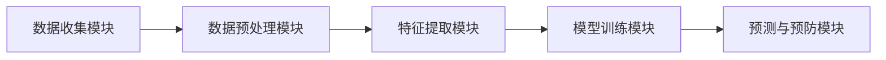

# 性能监控的AI革新：预测与预防

> 关键词：性能监控、AI革新、预测、预防、数据分析、机器学习、深度学习

> 摘要：本文深入探讨了性能监控领域的AI革新，重点聚焦于预测与预防功能。首先介绍了性能监控的背景知识，包括其目的、预期读者等。接着阐述了核心概念及联系，通过文本示意图和Mermaid流程图进行清晰展示。详细讲解了核心算法原理及具体操作步骤，结合Python源代码进行分析。对相关数学模型和公式进行了详细解读并举例说明。通过项目实战展示了代码的实际案例和详细解释。探讨了性能监控在不同场景下的实际应用，推荐了学习、开发相关的工具和资源。最后总结了未来发展趋势与挑战，提供了常见问题解答及扩展阅读参考资料，旨在全面呈现性能监控中AI革新的预测与预防技术。

## 1. 背景介绍 
### 1.1 目的和范围
性能监控在当今复杂的信息技术环境中至关重要，其目的在于确保系统、应用程序和网络等的稳定运行，及时发现潜在的性能问题，保障业务的连续性和高效性。传统的性能监控方法往往侧重于事后的故障排查和解决，缺乏对潜在问题的前瞻性预测和预防能力。

本文章的范围涵盖了性能监控领域中AI技术的应用，重点探讨如何利用AI实现性能的预测与预防。将详细介绍相关的核心概念、算法原理、数学模型，通过项目实战展示具体实现，分析实际应用场景，并提供相关的工具和资源推荐，帮助读者全面了解性能监控的AI革新。

### 1.2 预期读者
本文预期读者包括但不限于IT专业人士，如系统管理员、网络工程师、软件开发者、数据分析师等，他们对性能监控和AI技术有一定的了解，希望深入学习如何将AI应用于性能监控的预测与预防中。同时，也适合对新技术趋势感兴趣的企业管理者和决策者，帮助他们了解性能监控的发展方向，为企业的技术战略规划提供参考。

### 1.3 文档结构概述
本文共分为十个部分。第一部分为背景介绍，阐述了目的、范围、预期读者和文档结构概述等内容。第二部分介绍核心概念与联系，通过文本示意图和Mermaid流程图展示相关概念的原理和架构。第三部分详细讲解核心算法原理及具体操作步骤，结合Python源代码进行说明。第四部分对数学模型和公式进行详细讲解并举例说明。第五部分通过项目实战展示代码的实际案例和详细解释。第六部分探讨实际应用场景。第七部分推荐学习、开发相关的工具和资源。第八部分总结未来发展趋势与挑战。第九部分为附录，提供常见问题与解答。第十部分提供扩展阅读和参考资料。

### 1.4 术语表
#### 1.4.1 核心术语定义
- **性能监控**：对系统、应用程序、网络等的性能指标进行实时或定期监测，以评估其运行状态和性能表现。
- **AI革新**：在性能监控领域引入人工智能技术，对传统监控方法进行创新和改进，实现更智能、高效的监控。
- **预测**：基于历史数据和机器学习算法，对未来的性能指标和潜在问题进行预估和判断。
- **预防**：根据预测结果，提前采取措施避免性能问题的发生，保障系统的稳定运行。
- **数据分析**：对收集到的性能数据进行清洗、整理、挖掘和分析，以提取有价值的信息和模式。

#### 1.4.2 相关概念解释
- **机器学习**：一门多领域交叉学科，涉及概率论、统计学、逼近论、凸分析、算法复杂度理论等多门学科。它专门研究计算机怎样模拟或实现人类的学习行为，以获取新的知识或技能，重新组织已有的知识结构使之不断改善自身的性能。在性能监控中，机器学习可用于构建预测模型，根据历史数据预测未来的性能趋势。
- **深度学习**：机器学习的一个分支领域，它是一种基于对数据进行表征学习的方法。深度学习通过构建具有很多层的神经网络模型，自动从大量数据中学习复杂的模式和特征。在性能监控中，深度学习可用于处理复杂的非结构化数据，如日志文件、网络流量数据等，以提高预测的准确性。

#### 1.4.3 缩略词列表
- **AI**：Artificial Intelligence，人工智能
- **ML**：Machine Learning，机器学习
- **DL**：Deep Learning，深度学习
- **CPU**：Central Processing Unit，中央处理器
- **RAM**：Random Access Memory，随机存取存储器

## 2. 核心概念与联系 
### 核心概念原理
性能监控的AI革新主要基于数据分析、机器学习和深度学习等技术，通过对大量性能数据的收集、处理和分析，实现对性能的预测与预防。

- **数据收集**：从各种数据源收集性能数据，包括系统日志、应用程序日志、网络流量数据、硬件传感器数据等。这些数据包含了系统运行的各种信息，是进行性能分析和预测的基础。
- **数据预处理**：对收集到的原始数据进行清洗、转换和归一化等处理，以消除噪声和异常值，提高数据的质量和可用性。
- **特征提取**：从预处理后的数据中提取有代表性的特征，这些特征将作为机器学习和深度学习模型的输入。特征提取的目的是减少数据的维度，提高模型的训练效率和准确性。
- **模型训练**：使用机器学习和深度学习算法对提取的特征进行训练，构建预测模型。常见的算法包括线性回归、决策树、支持向量机、神经网络等。
- **预测与预防**：使用训练好的模型对未来的性能指标进行预测，根据预测结果提前采取措施，如调整系统配置、增加资源等，以预防性能问题的发生。

### 架构的文本示意图
```plaintext
+-------------------+
|  数据收集模块    |
|  (系统日志、应用 |
|  程序日志、网络  |
|  流量数据等)     |
+-------------------+
           |
           v
+-------------------+
|  数据预处理模块  |
|  (清洗、转换、归 |
|  一化等)         |
+-------------------+
           |
           v
+-------------------+
|  特征提取模块    |
|  (提取有代表     |
|  性的特征)       |
+-------------------+
           |
           v
+-------------------+
|  模型训练模块    |
|  (机器学习、深   |
|  度学习算法)     |
+-------------------+
           |
           v
+-------------------+
|  预测与预防模块  |
|  (预测未来性能   |
|  指标，采取预    |
|  防措施)         |
+-------------------+
```

### Mermaid流程图


## 3. 核心算法原理 & 具体操作步骤 
### 核心算法原理
在性能监控的预测与预防中，常用的机器学习算法包括线性回归、决策树和神经网络等。下面以线性回归为例，详细介绍其原理。

线性回归是一种用于建立自变量和因变量之间线性关系的统计模型。假设我们有一组数据 $(x_1, y_1), (x_2, y_2), \cdots, (x_n, y_n)$，其中 $x_i$ 是自变量，$y_i$ 是因变量。线性回归模型的目标是找到一条直线 $y = \theta_0 + \theta_1x$，使得所有数据点到该直线的误差平方和最小。

误差平方和的计算公式为：
$$J(\theta_0, \theta_1) = \frac{1}{2n} \sum_{i=1}^{n} (y_i - (\theta_0 + \theta_1x_i))^2$$

其中，$n$ 是数据点的数量。我们的目标是找到 $\theta_0$ 和 $\theta_1$ 的值，使得 $J(\theta_0, \theta_1)$ 最小。可以使用梯度下降算法来求解这个优化问题。

### 具体操作步骤
1. **数据准备**：收集性能数据，并进行预处理和特征提取。
2. **模型初始化**：随机初始化 $\theta_0$ 和 $\theta_1$ 的值。
3. **计算误差**：根据当前的 $\theta_0$ 和 $\theta_1$ 的值，计算误差平方和 $J(\theta_0, \theta_1)$。
4. **更新参数**：使用梯度下降算法更新 $\theta_0$ 和 $\theta_1$ 的值，使得 $J(\theta_0, \theta_1)$ 减小。
5. **重复步骤3和4**：直到误差平方和收敛或达到最大迭代次数。

### Python源代码实现
```python
import numpy as np

# 数据准备
x = np.array([1, 2, 3, 4, 5])
y = np.array([2, 4, 6, 8, 10])

# 模型初始化
theta_0 = 0
theta_1 = 0

# 超参数设置
learning_rate = 0.01
num_iterations = 1000

# 梯度下降算法
for i in range(num_iterations):
    # 计算预测值
    y_pred = theta_0 + theta_1 * x
    
    # 计算误差
    error = y_pred - y
    
    # 计算梯度
    gradient_theta_0 = np.mean(error)
    gradient_theta_1 = np.mean(error * x)
    
    # 更新参数
    theta_0 = theta_0 - learning_rate * gradient_theta_0
    theta_1 = theta_1 - learning_rate * gradient_theta_1

# 输出结果
print("theta_0:", theta_0)
print("theta_1:", theta_1)
```

## 4. 数学模型和公式 & 详细讲解 & 举例说明 
### 线性回归模型
线性回归模型的数学表达式为：
$$y = \theta_0 + \theta_1x_1 + \theta_2x_2 + \cdots + \theta_nx_n + \epsilon$$

其中，$y$ 是因变量，$x_1, x_2, \cdots, x_n$ 是自变量，$\theta_0, \theta_1, \cdots, \theta_n$ 是模型的参数，$\epsilon$ 是误差项。

在简单线性回归中，只有一个自变量，即 $n = 1$，模型的表达式为：
$$y = \theta_0 + \theta_1x + \epsilon$$

### 误差平方和公式
误差平方和（也称为损失函数）的计算公式为：
$$J(\theta_0, \theta_1, \cdots, \theta_n) = \frac{1}{2m} \sum_{i=1}^{m} (y^{(i)} - h_{\theta}(x^{(i)}))^2$$

其中，$m$ 是样本数量，$y^{(i)}$ 是第 $i$ 个样本的真实值，$h_{\theta}(x^{(i)})$ 是第 $i$ 个样本的预测值，$\theta$ 是模型的参数向量。

### 梯度下降算法公式
梯度下降算法的更新公式为：
$$\theta_j := \theta_j - \alpha \frac{\partial}{\partial \theta_j} J(\theta_0, \theta_1, \cdots, \theta_n)$$

其中，$\alpha$ 是学习率，$\frac{\partial}{\partial \theta_j} J(\theta_0, \theta_1, \cdots, \theta_n)$ 是损失函数 $J$ 关于参数 $\theta_j$ 的偏导数。

### 举例说明
假设我们有以下数据集：
| $x$ | $y$ |
| --- | --- |
| 1   | 2   |
| 2   | 4   |
| 3   | 6   |
| 4   | 8   |
| 5   | 10  |

我们的目标是使用线性回归模型来预测 $y$ 的值。

首先，我们需要初始化模型的参数 $\theta_0$ 和 $\theta_1$，假设 $\theta_0 = 0$，$\theta_1 = 0$。

然后，我们可以计算误差平方和 $J(\theta_0, \theta_1)$：
$$J(\theta_0, \theta_1) = \frac{1}{2 \times 5} \sum_{i=1}^{5} (y_i - (\theta_0 + \theta_1x_i))^2$$

接下来，我们使用梯度下降算法更新参数 $\theta_0$ 和 $\theta_1$：
$$\theta_0 := \theta_0 - \alpha \frac{\partial}{\partial \theta_0} J(\theta_0, \theta_1)$$
$$\theta_1 := \theta_1 - \alpha \frac{\partial}{\partial \theta_1} J(\theta_0, \theta_1)$$

重复这个过程，直到误差平方和收敛或达到最大迭代次数。

## 5. 项目实战：代码实际案例和详细解释说明 
### 5.1  开发环境搭建
- **操作系统**：Windows、Linux 或 macOS
- **编程语言**：Python 3.x
- **开发工具**：Jupyter Notebook 或 PyCharm
- **相关库**：NumPy、Pandas、Scikit-learn、Matplotlib

安装相关库的命令如下：
```bash
pip install numpy pandas scikit-learn matplotlib
```

### 5.2  源代码详细实现和代码解读
```python
import numpy as np
import pandas as pd
from sklearn.model_selection import train_test_split
from sklearn.linear_model import LinearRegression
from sklearn.metrics import mean_squared_error
import matplotlib.pyplot as plt

# 数据准备
# 假设我们有一个包含性能数据的 CSV 文件
data = pd.read_csv('performance_data.csv')

# 分离自变量和因变量
X = data[['cpu_usage', 'memory_usage']]
y = data['response_time']

# 划分训练集和测试集
X_train, X_test, y_train, y_test = train_test_split(X, y, test_size=0.2, random_state=42)

# 模型训练
model = LinearRegression()
model.fit(X_train, y_train)

# 模型预测
y_pred = model.predict(X_test)

# 模型评估
mse = mean_squared_error(y_test, y_pred)
print("Mean Squared Error:", mse)

# 可视化结果
plt.scatter(y_test, y_pred)
plt.xlabel('Actual Response Time')
plt.ylabel('Predicted Response Time')
plt.title('Actual vs Predicted Response Time')
plt.show()
```

### 5.3  代码解读与分析
1. **数据准备**：使用 Pandas 库读取包含性能数据的 CSV 文件，并分离出自变量和因变量。
2. **划分训练集和测试集**：使用 Scikit-learn 库的 `train_test_split` 函数将数据集划分为训练集和测试集，其中测试集占总数据集的 20%。
3. **模型训练**：使用 Scikit-learn 库的 `LinearRegression` 类创建线性回归模型，并使用训练集进行训练。
4. **模型预测**：使用训练好的模型对测试集进行预测，得到预测结果。
5. **模型评估**：使用 Scikit-learn 库的 `mean_squared_error` 函数计算预测结果的均方误差，评估模型的性能。
6. **可视化结果**：使用 Matplotlib 库绘制实际响应时间和预测响应时间的散点图，直观展示模型的预测效果。

## 6. 实际应用场景 
### 数据中心性能监控
在数据中心中，性能监控的AI革新可以帮助管理员实时监测服务器的CPU使用率、内存使用率、磁盘I/O等性能指标，预测服务器的负载变化和潜在的故障风险，提前采取措施进行资源调度和故障预防，确保数据中心的稳定运行。

### 网络性能监控
在网络环境中，性能监控的AI革新可以对网络流量、带宽利用率、延迟等指标进行实时监测和分析，预测网络拥塞和故障的发生，及时调整网络配置和优化网络拓扑，提高网络的性能和可靠性。

### 应用程序性能监控
对于企业级应用程序，性能监控的AI革新可以帮助开发人员和运维人员实时监测应用程序的响应时间、吞吐量、错误率等性能指标，预测应用程序的性能瓶颈和潜在的问题，及时进行优化和修复，提高用户体验和业务效率。

### 工业设备性能监控
在工业领域，性能监控的AI革新可以对工业设备的运行状态、温度、压力、振动等参数进行实时监测和分析，预测设备的故障和维护需求，提前安排维护计划，减少设备停机时间和维修成本。

## 7. 工具和资源推荐
### 7.1 学习资源推荐
#### 7.1.1 书籍推荐
- 《机器学习》（周志华著）：全面介绍了机器学习的基本概念、算法和应用，是机器学习领域的经典教材。
- 《深度学习》（Ian Goodfellow、Yoshua Bengio 和 Aaron Courville 著）：深入探讨了深度学习的理论和实践，是深度学习领域的权威著作。
- 《Python 数据分析实战》（Sebastian Raschka 著）：介绍了使用 Python 进行数据分析的方法和技巧，包括数据清洗、数据可视化、机器学习等内容。

#### 7.1.2 在线课程
- Coursera 上的“机器学习”课程（Andrew Ng 教授）：经典的机器学习入门课程，涵盖了机器学习的基本概念、算法和应用。
- edX 上的“深度学习”课程（MIT 教授）：深入介绍了深度学习的理论和实践，包括神经网络、卷积神经网络、循环神经网络等内容。
- Kaggle 上的“数据科学微课程”：提供了丰富的数据科学学习资源，包括数据分析、机器学习、深度学习等内容。

#### 7.1.3 技术博客和网站
- Medium 上的“Towards Data Science”：汇集了众多数据科学和机器学习领域的优秀文章，涵盖了最新的技术趋势和实践经验。
- Analytics Vidhya：提供了丰富的数据科学和机器学习学习资源，包括教程、博客、案例分析等内容。
- KDnuggets：是数据科学和机器学习领域的知名网站，提供了最新的行业动态、技术文章、工具和资源推荐等内容。

### 7.2 开发工具框架推荐
#### 7.2.1 IDE和编辑器
- PyCharm：功能强大的 Python 集成开发环境，提供了代码编辑、调试、版本控制等功能，适合专业的 Python 开发者。
- Jupyter Notebook：交互式的开发环境，支持 Python、R 等多种编程语言，适合数据科学家和研究人员进行数据分析和模型开发。
- Visual Studio Code：轻量级的代码编辑器，支持多种编程语言和插件扩展，适合快速开发和调试。

#### 7.2.2 调试和性能分析工具
- PDB：Python 自带的调试工具，用于调试 Python 代码。
- cProfile：Python 自带的性能分析工具，用于分析 Python 代码的性能瓶颈。
- TensorBoard：TensorFlow 提供的可视化工具，用于可视化深度学习模型的训练过程和性能指标。

#### 7.2.3 相关框架和库
- NumPy：Python 中用于科学计算的基础库，提供了高效的数组操作和数学函数。
- Pandas：Python 中用于数据分析的库，提供了数据结构和数据处理工具，方便进行数据清洗、转换和分析。
- Scikit-learn：Python 中用于机器学习的库，提供了丰富的机器学习算法和工具，包括分类、回归、聚类等。
- TensorFlow：Google 开发的深度学习框架，提供了高效的神经网络训练和推理功能。
- PyTorch：Facebook 开发的深度学习框架，提供了动态计算图和自动求导功能，适合快速开发和实验。

### 7.3 相关论文著作推荐
#### 7.3.1 经典论文
- “A Unified Approach to Interpreting Model Predictions”（Scott Lundberg 和 Su-In Lee 著）：提出了 SHAP（SHapley Additive exPlanations）方法，用于解释机器学习模型的预测结果。
- “Deep Residual Learning for Image Recognition”（Kaiming He 等人著）：提出了残差网络（ResNet），解决了深度学习中的梯度消失和梯度爆炸问题，提高了模型的训练效率和性能。
- “Attention Is All You Need”（Ashish Vaswani 等人著）：提出了 Transformer 架构，是自然语言处理领域的重要突破，为后续的语言模型发展奠定了基础。

#### 7.3.2 最新研究成果
- 在 arXiv 上搜索“Performance Monitoring with AI”、“Predictive Maintenance with Machine Learning”等关键词，可以获取最新的性能监控和预测预防相关的研究成果。

#### 7.3.3 应用案例分析
- Google Cloud Platform 的官方博客和文档中提供了许多关于性能监控和预测预防的应用案例分析，包括数据中心、网络、应用程序等领域的实际应用。
- Amazon Web Services 的官方博客和文档中也提供了丰富的性能监控和预测预防的应用案例，展示了如何使用 AWS 服务实现高效的性能监控和故障预防。

## 8. 总结：未来发展趋势与挑战
### 未来发展趋势
- **智能化程度不断提高**：随着人工智能技术的不断发展，性能监控系统将越来越智能化，能够自动学习和适应不同的环境和场景，实现更精准的预测和预防。
- **多模态数据融合**：未来的性能监控系统将不仅仅依赖于传统的结构化数据，还将融合图像、音频、视频等多模态数据，以获取更全面的系统信息，提高预测和预防的准确性。
- **与物联网的深度融合**：物联网的发展使得大量的设备和传感器能够实时采集数据，性能监控系统将与物联网深度融合，实现对设备和系统的实时监测和管理，提高生产效率和安全性。
- **云化和分布式架构**：为了处理大规模的性能数据，性能监控系统将越来越多地采用云化和分布式架构，提高系统的可扩展性和可靠性。

### 挑战
- **数据质量和安全问题**：性能监控系统需要处理大量的数据，数据的质量和安全是关键问题。如何确保数据的准确性、完整性和安全性，防止数据泄露和恶意攻击，是需要解决的重要挑战。
- **模型的可解释性**：深度学习模型虽然在性能预测方面取得了很好的效果，但模型的可解释性较差。如何理解模型的决策过程，解释预测结果的合理性，是需要解决的问题。
- **计算资源和成本**：人工智能算法的训练和推理需要大量的计算资源，如何在有限的计算资源和成本下，实现高效的性能监控和预测预防，是需要解决的挑战。
- **人才短缺**：性能监控的AI革新需要既懂性能监控又懂人工智能的复合型人才，目前这类人才短缺，如何培养和吸引相关人才，是推动技术发展的关键。

## 9. 附录：常见问题与解答
### 问题1：性能监控的AI革新与传统性能监控方法有什么区别？
传统性能监控方法主要侧重于事后的故障排查和解决，缺乏对潜在问题的前瞻性预测和预防能力。而性能监控的AI革新通过引入人工智能技术，能够对大量的性能数据进行分析和学习，实现对性能的预测与预防，提前发现潜在的问题并采取措施，提高系统的稳定性和可靠性。

### 问题2：如何选择适合的机器学习算法进行性能预测？
选择适合的机器学习算法需要考虑多个因素，包括数据的特点、问题的类型、模型的复杂度等。对于简单的线性关系问题，可以选择线性回归算法；对于复杂的非线性关系问题，可以选择决策树、支持向量机、神经网络等算法。在实际应用中，可以通过实验和比较不同算法的性能，选择最适合的算法。

### 问题3：性能监控的AI革新需要多少数据？
性能监控的AI革新需要足够的数据来训练模型，以确保模型的准确性和可靠性。数据的数量和质量取决于具体的应用场景和问题的复杂度。一般来说，数据量越大，模型的性能越好。在实际应用中，可以通过收集历史数据、模拟数据等方式来增加数据量。

### 问题4：如何评估性能预测模型的性能？
评估性能预测模型的性能可以使用多种指标，包括均方误差（MSE）、均方根误差（RMSE）、平均绝对误差（MAE）、决定系数（$R^2$）等。这些指标可以反映模型的预测准确性和拟合程度。在实际应用中，可以根据具体的问题和需求选择合适的评估指标。

## 10. 扩展阅读 & 参考资料
- 《人工智能：现代方法》（Stuart Russell 和 Peter Norvig 著）
- 《Python 机器学习实战》（Sebastian Raschka 和 Vahid Mirjalili 著）
- 《深度学习实战》（Aurélien Géron 著）
- 相关学术期刊和会议论文，如《IEEE Transactions on Neural Networks and Learning Systems》、《ACM SIGKDD Conference on Knowledge Discovery and Data Mining》等。
- 各大科技公司的官方博客和文档，如 Google、Microsoft、Amazon 等。