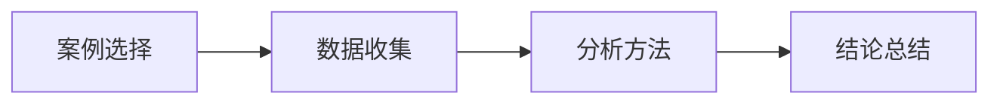

# 成功案例分析

> 关键词：成功案例、分析方法、商业策略、技术创新、市场竞争、用户体验、可持续发展

> 摘要：本文旨在深入探讨成功案例分析的方法与价值。通过对不同领域成功案例的剖析，我们将揭示其背后的商业策略、技术创新、市场竞争应对等关键因素。同时，阐述如何从这些成功案例中汲取经验教训，为企业和个人的发展提供有益的参考。我们将详细介绍分析的步骤和方法，结合具体的数学模型和实际代码案例，帮助读者更好地理解和应用这些分析技巧。最后，展望成功案例分析在未来的发展趋势与面临的挑战。

## 1. 背景介绍 
### 1.1 目的和范围
成功案例分析的目的在于通过对已取得显著成就的企业、项目或个人经历的研究，总结出具有普遍适用性的成功因素和经验教训。本分析的范围涵盖了多个领域，包括但不限于科技、金融、零售、医疗等，旨在全面展示不同行业中成功案例的多样性和共性。通过对这些案例的深入研究，我们希望能够为企业管理者、创业者、投资者以及其他相关人员提供有价值的参考，帮助他们在各自的领域中取得更好的成绩。

### 1.2 预期读者
本文的预期读者包括企业管理者、创业者、投资者、行业分析师、学者以及对成功案例分析感兴趣的广大读者。无论是希望借鉴成功经验改进自身业务的企业人士，还是想要深入了解行业发展趋势的研究人员，都能从本文中获得有价值的信息。

### 1.3 文档结构概述
本文将首先介绍成功案例分析的核心概念和相关联系，包括分析的基本原理和架构。接着，详细阐述核心算法原理和具体操作步骤，并通过 Python 源代码进行说明。然后，引入数学模型和公式，对分析过程进行量化和深入讲解。在项目实战部分，将给出实际的代码案例并进行详细解释。之后，探讨成功案例分析在不同实际应用场景中的应用。再推荐相关的工具和资源，包括学习资源、开发工具框架以及相关论文著作。最后，总结成功案例分析的未来发展趋势与挑战，并提供常见问题与解答以及扩展阅读和参考资料。

### 1.4 术语表
#### 1.4.1 核心术语定义
- **成功案例**：指在特定领域或行业中，通过一系列有效的策略和行动，取得了显著的业绩、市场份额、创新成果或社会影响力的具体事例。
- **案例分析**：对成功案例进行系统的研究和剖析，以揭示其背后的原因、机制和规律的过程。
- **商业策略**：企业为实现其目标而制定的一系列决策和行动计划，包括市场定位、产品策略、竞争策略等。
- **技术创新**：通过引入新的技术、方法或产品，提高企业的竞争力和生产效率的行为。
- **市场竞争**：企业在市场中为争夺客户、资源和市场份额而进行的竞争活动。

#### 1.4.2 相关概念解释
- **价值链分析**：将企业的生产经营活动分解为一系列相互关联的价值创造环节，通过对每个环节的分析，找出企业的竞争优势和改进方向。
- **SWOT 分析**：对企业的优势（Strengths）、劣势（Weaknesses）、机会（Opportunities）和威胁（Threats）进行全面评估的方法，帮助企业制定战略决策。
- **用户体验**：用户在使用产品或服务过程中所感受到的主观感受和体验，包括易用性、满意度、忠诚度等方面。

#### 1.4.3 缩略词列表
- **MVP**：Minimum Viable Product，最小可行产品
- **ROI**：Return on Investment，投资回报率
- **KPI**：Key Performance Indicator，关键绩效指标

## 2. 核心概念与联系 
成功案例分析的核心概念主要包括案例选择、数据收集、分析方法和结论总结。这些概念相互关联，构成了一个完整的分析流程。

### 核心概念原理和架构的文本示意图
案例选择是成功案例分析的起点，需要根据分析的目的和范围，选择具有代表性和典型性的案例。数据收集则是为后续的分析提供基础，需要收集与案例相关的各种数据，包括市场数据、财务数据、用户反馈等。分析方法是对收集到的数据进行处理和分析的手段，常见的分析方法包括定性分析和定量分析。结论总结是对分析结果的归纳和提炼，得出具有普遍适用性的经验教训和启示。

### Mermaid 流程图


## 3. 核心算法原理 & 具体操作步骤 
### 核心算法原理
在成功案例分析中，我们可以使用聚类分析算法来对不同的案例进行分类，以便更好地发现它们之间的共性和差异。聚类分析的基本思想是将数据集中的对象划分为不同的簇，使得同一簇内的对象具有较高的相似度，而不同簇之间的对象具有较高的差异度。

### 具体操作步骤
1. **数据预处理**：对收集到的数据进行清洗、转换和标准化，以提高数据的质量和可用性。
2. **特征选择**：选择与案例分析相关的特征，作为聚类分析的输入。
3. **聚类算法选择**：根据数据的特点和分析的目的，选择合适的聚类算法，如 K-Means 算法、层次聚类算法等。
4. **聚类分析**：使用选择的聚类算法对数据进行聚类，得到不同的簇。
5. **结果评估**：对聚类结果进行评估，选择最优的聚类方案。

### Python 源代码实现
```python
import numpy as np
from sklearn.cluster import KMeans
from sklearn.preprocessing import StandardScaler
from sklearn.metrics import silhouette_score

# 示例数据
data = np.array([[1, 2], [2, 3], [3, 4], [4, 5], [5, 6], [6, 7], [7, 8], [8, 9], [9, 10], [10, 11]])

# 数据预处理
scaler = StandardScaler()
scaled_data = scaler.fit_transform(data)

# 选择最优的聚类数
silhouette_scores = []
for n_clusters in range(2, 10):
    kmeans = KMeans(n_clusters=n_clusters)
    kmeans.fit(scaled_data)
    labels = kmeans.labels_
    score = silhouette_score(scaled_data, labels)
    silhouette_scores.append(score)

best_n_clusters = np.argmax(silhouette_scores) + 2

# 聚类分析
kmeans = KMeans(n_clusters=best_n_clusters)
kmeans.fit(scaled_data)
labels = kmeans.labels_

print("最优的聚类数：", best_n_clusters)
print("聚类标签：", labels)
```

## 4. 数学模型和公式 & 详细讲解 & 举例说明 
### 数学模型
在聚类分析中，K-Means 算法是一种常用的聚类算法，其数学模型可以表示为：

$$\min_{C_1,C_2,\cdots,C_k}\sum_{i=1}^{k}\sum_{x\in C_i}||x - \mu_i||^2$$

其中，$C_1,C_2,\cdots,C_k$ 表示 $k$ 个簇，$\mu_i$ 表示第 $i$ 个簇的中心点，$x$ 表示数据集中的一个样本。

### 详细讲解
K-Means 算法的基本思想是通过迭代的方式不断更新簇的中心点，直到满足停止条件。具体步骤如下：
1. **初始化**：随机选择 $k$ 个样本作为初始的簇中心点。
2. **分配样本**：将每个样本分配到距离最近的簇中心点所在的簇。
3. **更新中心点**：计算每个簇中所有样本的平均值，作为新的簇中心点。
4. **重复步骤 2 和 3**：直到簇中心点不再发生变化或达到最大迭代次数。

### 举例说明
假设我们有一个二维数据集，包含 5 个样本：$x_1=(1, 2), x_2=(2, 3), x_3=(3, 4), x_4=(4, 5), x_5=(5, 6)$。我们希望将这些样本分为 2 个簇。

1. **初始化**：随机选择 $x_1=(1, 2)$ 和 $x_3=(3, 4)$ 作为初始的簇中心点。
2. **分配样本**：计算每个样本到两个中心点的距离，将样本分配到距离最近的中心点所在的簇。
    - 对于 $x_1=(1, 2)$，距离中心点 $x_1=(1, 2)$ 的距离为 0，距离中心点 $x_3=(3, 4)$ 的距离为 $\sqrt{(1 - 3)^2 + (2 - 4)^2}=\sqrt{8}$，因此 $x_1$ 分配到第一个簇。
    - 对于 $x_2=(2, 3)$，距离中心点 $x_1=(1, 2)$ 的距离为 $\sqrt{(2 - 1)^2 + (3 - 2)^2}=\sqrt{2}$，距离中心点 $x_3=(3, 4)$ 的距离为 $\sqrt{(2 - 3)^2 + (3 - 4)^2}=\sqrt{2}$，因此 $x_2$ 可以分配到任意一个簇，这里我们分配到第一个簇。
    - 对于 $x_3=(3, 4)$，距离中心点 $x_1=(1, 2)$ 的距离为 $\sqrt{(3 - 1)^2 + (4 - 2)^2}=\sqrt{8}$，距离中心点 $x_3=(3, 4)$ 的距离为 0，因此 $x_3$ 分配到第二个簇。
    - 对于 $x_4=(4, 5)$，距离中心点 $x_1=(1, 2)$ 的距离为 $\sqrt{(4 - 1)^2 + (5 - 2)^2}=\sqrt{18}$，距离中心点 $x_3=(3, 4)$ 的距离为 $\sqrt{(4 - 3)^2 + (5 - 4)^2}=\sqrt{2}$，因此 $x_4$ 分配到第二个簇。
    - 对于 $x_5=(5, 6)$，距离中心点 $x_1=(1, 2)$ 的距离为 $\sqrt{(5 - 1)^2 + (6 - 2)^2}=\sqrt{32}$，距离中心点 $x_3=(3, 4)$ 的距离为 $\sqrt{(5 - 3)^2 + (6 - 4)^2}=\sqrt{8}$，因此 $x_5$ 分配到第二个簇。
3. **更新中心点**：计算每个簇中所有样本的平均值，作为新的簇中心点。
    - 第一个簇包含 $x_1=(1, 2)$ 和 $x_2=(2, 3)$，新的中心点为 $(\frac{1 + 2}{2}, \frac{2 + 3}{2})=(1.5, 2.5)$。
    - 第二个簇包含 $x_3=(3, 4)$、$x_4=(4, 5)$ 和 $x_5=(5, 6)$，新的中心点为 $(\frac{3 + 4 + 5}{3}, \frac{4 + 5 + 6}{3})=(4, 5)$。
4. **重复步骤 2 和 3**：直到簇中心点不再发生变化或达到最大迭代次数。

## 5. 项目实战：代码实际案例和详细解释说明 
### 5.1  开发环境搭建
在进行成功案例分析的项目实战之前，需要搭建相应的开发环境。以下是具体的步骤：
1. **安装 Python**：Python 是一种常用的编程语言，具有丰富的数据分析和机器学习库。可以从 Python 官方网站（https://www.python.org/downloads/）下载并安装最新版本的 Python。
2. **安装必要的库**：使用 pip 命令安装必要的库，如 numpy、pandas、scikit-learn 等。
```bash
pip install numpy pandas scikit-learn
```
3. **选择开发工具**：可以选择使用 Jupyter Notebook、PyCharm 等开发工具进行代码编写和调试。

### 5.2  源代码详细实现和代码解读
以下是一个完整的成功案例分析的代码示例，使用 K-Means 算法对鸢尾花数据集进行聚类分析：

```python
import numpy as np
import pandas as pd
from sklearn.datasets import load_iris
from sklearn.cluster import KMeans
from sklearn.preprocessing import StandardScaler
from sklearn.metrics import silhouette_score
import matplotlib.pyplot as plt

# 加载鸢尾花数据集
iris = load_iris()
data = iris.data
target = iris.target

# 数据预处理
scaler = StandardScaler()
scaled_data = scaler.fit_transform(data)

# 选择最优的聚类数
silhouette_scores = []
for n_clusters in range(2, 10):
    kmeans = KMeans(n_clusters=n_clusters)
    kmeans.fit(scaled_data)
    labels = kmeans.labels_
    score = silhouette_score(scaled_data, labels)
    silhouette_scores.append(score)

best_n_clusters = np.argmax(silhouette_scores) + 2

# 聚类分析
kmeans = KMeans(n_clusters=best_n_clusters)
kmeans.fit(scaled_data)
labels = kmeans.labels_

# 可视化聚类结果
plt.scatter(scaled_data[:, 0], scaled_data[:, 1], c=labels, cmap='viridis')
plt.scatter(kmeans.cluster_centers_[:, 0], kmeans.cluster_centers_[:, 1], marker='x', s=200, linewidths=3, color='r')
plt.title('K-Means Clustering of Iris Dataset')
plt.xlabel('Sepal Length')
plt.ylabel('Sepal Width')
plt.show()

print("最优的聚类数：", best_n_clusters)
print("聚类标签：", labels)
```

### 代码解读与分析
1. **数据加载**：使用 `load_iris()` 函数加载鸢尾花数据集，并将数据和目标标签分别存储在 `data` 和 `target` 变量中。
2. **数据预处理**：使用 `StandardScaler()` 函数对数据进行标准化处理，以消除不同特征之间的量纲差异。
3. **选择最优的聚类数**：使用轮廓系数（Silhouette Score）来选择最优的聚类数。轮廓系数越大，表示聚类效果越好。
4. **聚类分析**：使用选择的最优聚类数，创建 K-Means 模型并进行聚类分析。
5. **可视化聚类结果**：使用 `matplotlib` 库绘制散点图，将聚类结果可视化。
6. **输出结果**：打印最优的聚类数和聚类标签。

## 6. 实际应用场景 
成功案例分析在许多实际应用场景中都具有重要的价值，以下是一些常见的应用场景：
### 企业战略规划
通过对行业内成功企业的案例分析，企业可以了解竞争对手的优势和劣势，发现市场机会和威胁，从而制定出更加科学合理的战略规划。例如，苹果公司通过对索尼等竞争对手的案例分析，发现了消费者对便携式音乐播放器的需求，从而推出了 iPod 产品，取得了巨大的成功。

### 产品创新
分析成功产品的案例，可以帮助企业了解用户需求和市场趋势，从而开发出更具竞争力的产品。例如，特斯拉公司通过对传统汽车行业的案例分析，发现了消费者对环保、高性能汽车的需求，从而推出了电动汽车产品，引领了汽车行业的变革。

### 市场营销
研究成功的市场营销案例，可以为企业提供有效的营销策略和方法。例如，可口可乐公司通过对百事可乐等竞争对手的案例分析，不断创新营销策略，如开展广告宣传、举办促销活动等，从而保持了市场领先地位。

### 投资决策
投资者可以通过对成功企业的案例分析，评估企业的价值和发展潜力，从而做出更加明智的投资决策。例如，巴菲特通过对可口可乐、苹果等成功企业的案例分析，长期持有这些企业的股票，获得了丰厚的投资回报。

## 7. 工具和资源推荐
### 7.1 学习资源推荐
#### 7.1.1 书籍推荐
- 《数据挖掘：概念与技术》：全面介绍了数据挖掘的基本概念、算法和应用，是数据挖掘领域的经典教材。
- 《Python 数据分析实战》：通过实际案例介绍了如何使用 Python 进行数据分析，适合初学者学习。
- 《机器学习》：由周志华教授编写，系统地介绍了机器学习的基本理论和算法，是机器学习领域的权威著作。

#### 7.1.2 在线课程
- Coursera 上的《Data Science Specialization》：由约翰霍普金斯大学提供，全面介绍了数据科学的各个方面，包括数据采集、数据分析、机器学习等。
- edX 上的《Introduction to Artificial Intelligence》：由麻省理工学院提供，介绍了人工智能的基本概念、算法和应用。
- Udemy 上的《Python for Data Science and Machine Learning Bootcamp》：通过实际案例介绍了如何使用 Python 进行数据分析和机器学习，适合初学者学习。

#### 7.1.3 技术博客和网站
- Medium：一个技术博客平台，有许多关于数据分析、机器学习、人工智能等领域的优秀文章。
- Towards Data Science：专注于数据科学和机器学习领域的技术博客，提供了许多实用的教程和案例分析。
- Kaggle：一个数据科学竞赛平台，提供了丰富的数据集和竞赛项目，可以帮助学习者提高数据分析和机器学习能力。

### 7.2 开发工具框架推荐
#### 7.2.1 IDE和编辑器
- Jupyter Notebook：一个交互式的开发环境，适合进行数据分析和机器学习的实验和演示。
- PyCharm：一个专业的 Python 开发工具，提供了丰富的功能和插件，适合进行大型项目的开发。
- Visual Studio Code：一个轻量级的代码编辑器，支持多种编程语言，具有丰富的插件生态系统。

#### 7.2.2 调试和性能分析工具
- Py-Spy：一个用于 Python 代码性能分析的工具，可以帮助开发者找出代码中的性能瓶颈。
- PDB：Python 自带的调试工具，可以帮助开发者调试代码中的错误。
- Memory Profiler：一个用于 Python 代码内存分析的工具，可以帮助开发者找出代码中的内存泄漏问题。

#### 7.2.3 相关框架和库
- NumPy：一个用于科学计算的 Python 库，提供了高效的数组操作和数学函数。
- Pandas：一个用于数据处理和分析的 Python 库，提供了灵活的数据结构和数据操作方法。
- Scikit-learn：一个用于机器学习的 Python 库，提供了丰富的机器学习算法和工具。

### 7.3 相关论文著作推荐
#### 7.3.1 经典论文
- 《A Mathematical Theory of Communication》：由克劳德·香农（Claude Shannon）撰写，奠定了信息论的基础。
- 《The Elements of Statistical Learning》：由 Trevor Hastie、Robert Tibshirani 和 Jerome Friedman 撰写，系统地介绍了统计学习的基本理论和算法。
- 《Pattern Recognition and Machine Learning》：由 Christopher Bishop 撰写，全面介绍了模式识别和机器学习的基本概念、算法和应用。

#### 7.3.2 最新研究成果
- 《Attention Is All You Need》：提出了 Transformer 模型，为自然语言处理领域带来了革命性的变化。
- 《Generative Adversarial Networks》：提出了生成对抗网络（GAN），为生成式模型的发展做出了重要贡献。
- 《Masked Autoencoders Are Scalable Vision Learners》：提出了 Masked Autoencoder（MAE）模型，为计算机视觉领域的自监督学习提供了新的思路。

#### 7.3.3 应用案例分析
- 《The Lean Startup》：介绍了精益创业的理念和方法，通过实际案例分析了如何快速验证商业模式和产品假设。
- 《Zero to One》：由彼得·蒂尔（Peter Thiel）撰写，探讨了创业公司如何从 0 到 1 创造价值，通过实际案例分析了成功创业公司的经验和教训。
- 《Good to Great》：由吉姆·柯林斯（Jim Collins）撰写，通过对 11 家优秀公司的案例分析，总结了企业从优秀到卓越的关键因素。

## 8. 总结：未来发展趋势与挑战
### 未来发展趋势
- **智能化**：随着人工智能技术的不断发展，成功案例分析将越来越智能化。例如，使用自然语言处理技术自动提取案例中的关键信息，使用机器学习算法自动分析案例中的规律和趋势。
- **可视化**：为了更好地展示分析结果，成功案例分析将越来越注重可视化。例如，使用图表、地图、动画等可视化工具，将分析结果直观地展示给用户。
- **个性化**：不同的用户对成功案例分析的需求不同，未来的成功案例分析将越来越个性化。例如，根据用户的行业、职位、兴趣等因素，为用户推荐个性化的成功案例和分析报告。

### 挑战
- **数据质量**：成功案例分析需要大量的高质量数据，但在实际应用中，数据质量往往存在问题，如数据缺失、数据错误、数据不一致等。如何提高数据质量是成功案例分析面临的一个重要挑战。
- **隐私保护**：在收集和分析成功案例数据时，需要保护用户的隐私和数据安全。如何在保证隐私保护的前提下，进行有效的成功案例分析是一个亟待解决的问题。
- **模型解释性**：随着人工智能技术的不断发展，越来越多的复杂模型被应用于成功案例分析中。但这些模型往往缺乏解释性，难以理解其决策过程和结果。如何提高模型的解释性是成功案例分析面临的另一个重要挑战。

## 9. 附录：常见问题与解答
### 1. 如何选择合适的成功案例进行分析？
选择合适的成功案例需要考虑以下几个因素：
- **相关性**：案例应该与分析的目的和领域相关。
- **代表性**：案例应该具有代表性，能够反映该领域的普遍情况。
- **典型性**：案例应该具有典型性，能够突出成功的关键因素和经验教训。

### 2. 如何确保数据收集的准确性和完整性？
确保数据收集的准确性和完整性需要注意以下几点：
- **明确数据需求**：在收集数据之前，需要明确需要收集哪些数据，以及这些数据的用途。
- **选择合适的数据来源**：选择可靠的数据来源，如官方统计数据、行业报告、企业年报等。
- **进行数据验证**：在收集数据之后，需要对数据进行验证，确保数据的准确性和完整性。

### 3. 如何评估聚类分析的结果？
评估聚类分析的结果可以使用以下几种方法：
- **轮廓系数**：轮廓系数越大，表示聚类效果越好。
- **Calinski-Harabasz 指数**：Calinski-Harabasz 指数越大，表示聚类效果越好。
- **Davies-Bouldin 指数**：Davies-Bouldin 指数越小，表示聚类效果越好。

### 4. 如何将成功案例分析的结果应用到实际中？
将成功案例分析的结果应用到实际中需要注意以下几点：
- **结合实际情况**：在应用成功案例分析的结果时，需要结合实际情况，进行适当的调整和改进。
- **制定具体的行动计划**：根据成功案例分析的结果，制定具体的行动计划，并确保行动计划的可行性和有效性。
- **持续跟踪和评估**：在实施行动计划的过程中，需要持续跟踪和评估效果，及时调整和改进行动计划。

## 10. 扩展阅读 & 参考资料
### 扩展阅读
- 《创新者的窘境》：由克莱顿·克里斯坦森（Clayton Christensen）撰写，探讨了创新者在面对颠覆性创新时所面临的困境和挑战。
- 《从 0 到 1：开启商业与未来的秘密》：由彼得·蒂尔（Peter Thiel）撰写，探讨了创业公司如何从 0 到 1 创造价值。
- 《思考，快与慢》：由丹尼尔·卡尼曼（Daniel Kahneman）撰写，探讨了人类思维的两种模式：快思考和慢思考。

### 参考资料
- 《数据挖掘：概念与技术》（第 3 版），Jiawei Han、Jian Pei 和 Micheline Kamber 著
- 《Python 数据分析实战》，韦斯·麦金尼（Wes McKinney）著
- 《机器学习》，周志华著
- 《Attention Is All You Need》，Ashish Vaswani 等人著
- 《Generative Adversarial Networks》，Ian J. Goodfellow 等人著
- 《Masked Autoencoders Are Scalable Vision Learners》，Kaiming He 等人著