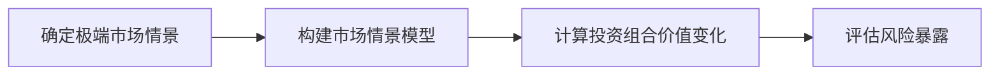

# 投资组合压力测试：评估极端市场情况下的风险

> 关键词：投资组合、压力测试、极端市场、风险评估、金融模型

> 摘要：本文聚焦于投资组合压力测试，旨在深入探讨如何评估极端市场情况下投资组合所面临的风险。首先介绍了压力测试的背景，包括目的、预期读者、文档结构和相关术语。接着阐述了核心概念与联系，构建了清晰的原理架构并以 Mermaid 流程图呈现。详细讲解了核心算法原理，并用 Python 代码进行示例。给出了相关数学模型和公式，并结合实例说明。通过项目实战，从开发环境搭建到源代码实现及解读，全面展示了压力测试的实际操作。分析了压力测试在不同场景下的实际应用，推荐了学习资源、开发工具和相关论文著作。最后总结了未来发展趋势与挑战，解答了常见问题并提供了扩展阅读和参考资料，为投资者和金融从业者提供了全面且深入的投资组合压力测试指南。

## 1. 背景介绍 
### 1.1 目的和范围
在金融市场中，投资组合面临着各种各样的风险。传统的风险评估方法往往基于历史数据和假设的市场平稳状态，然而，极端市场事件（如金融危机、重大政治事件等）可能导致市场出现剧烈波动，这些传统方法在评估极端情况下的风险时往往显得力不从心。投资组合压力测试的目的就是通过模拟极端市场情况，评估投资组合在这些不利条件下的表现，帮助投资者和金融机构更好地了解投资组合的脆弱性，提前做好风险防范措施。

本文的范围涵盖了投资组合压力测试的基本概念、核心算法原理、数学模型、实际应用案例以及相关的工具和资源推荐。通过全面的介绍，读者将能够深入理解投资组合压力测试的理论和实践。

### 1.2 预期读者
本文预期读者包括金融投资者、金融分析师、投资组合经理、金融机构的风险管理部门人员以及对金融风险管理和投资组合分析感兴趣的研究人员和学生。对于那些希望了解如何在极端市场情况下评估投资组合风险的人士，本文将提供有价值的参考。

### 1.3 文档结构概述
本文将按照以下结构进行组织：首先介绍投资组合压力测试的背景信息，包括目的、预期读者和文档结构。接着阐述核心概念与联系，包括压力测试的原理和架构，并以 Mermaid 流程图展示。然后详细讲解核心算法原理，并用 Python 代码进行示例。随后给出相关数学模型和公式，并结合实例说明。通过项目实战，展示压力测试的实际操作，包括开发环境搭建、源代码实现和代码解读。分析压力测试在不同场景下的实际应用，推荐学习资源、开发工具和相关论文著作。最后总结未来发展趋势与挑战，解答常见问题并提供扩展阅读和参考资料。

### 1.4 术语表
#### 1.4.1 核心术语定义
- **投资组合**：由多种资产（如股票、债券、基金等）组成的集合，投资者通过分散投资来降低风险。
- **压力测试**：一种风险评估方法，通过模拟极端市场情况，评估投资组合在这些不利条件下的表现。
- **极端市场情况**：指市场出现剧烈波动、大幅下跌或其他异常情况，如金融危机、重大政治事件等。
- **风险评估**：对投资组合面临的各种风险进行识别、分析和量化的过程。

#### 1.4.2 相关概念解释
- **VaR（Value at Risk）**：风险价值，是一种常用的风险度量指标，用于衡量在一定置信水平下，投资组合在未来一段时间内可能遭受的最大损失。
- **CVaR（Conditional Value at Risk）**：条件风险价值，也称为预期尾部损失，是在 VaR 的基础上，考虑了超过 VaR 的损失情况，更能反映极端风险。

#### 1.4.3 缩略词列表
- **VaR**：Value at Risk
- **CVaR**：Conditional Value at Risk

## 2. 核心概念与联系 

### 核心概念原理
投资组合压力测试的核心原理是通过模拟极端市场情况，评估投资组合在这些情况下的价值变化和风险暴露。具体来说，压力测试可以分为以下几个步骤：
1. **确定极端市场情景**：根据历史数据、专家意见或其他方法，确定可能出现的极端市场情况，如市场暴跌、利率大幅上升等。
2. **构建市场情景模型**：使用数学模型和统计方法，将极端市场情景转化为具体的市场变量变化，如股票价格下跌幅度、利率上升幅度等。
3. **计算投资组合价值变化**：根据市场变量的变化，计算投资组合在极端市场情景下的价值变化。
4. **评估风险暴露**：根据投资组合价值变化，评估投资组合在极端市场情景下的风险暴露，如 VaR、CVaR 等。

### 架构的文本示意图
```plaintext
              确定极端市场情景
                    |
                    v
             构建市场情景模型
                    |
                    v
          计算投资组合价值变化
                    |
                    v
             评估风险暴露
```

### Mermaid 流程图


## 3. 核心算法原理 & 具体操作步骤 

### 核心算法原理
在投资组合压力测试中，常用的算法包括蒙特卡罗模拟、历史模拟等。这里我们以蒙特卡罗模拟为例，介绍核心算法原理。

蒙特卡罗模拟是一种基于随机抽样的数值计算方法，通过模拟大量的随机情景，来估计投资组合在不同情景下的表现。具体步骤如下：
1. **确定市场变量的概率分布**：根据历史数据或其他方法，确定市场变量（如股票价格、利率等）的概率分布。
2. **生成随机样本**：根据市场变量的概率分布，生成大量的随机样本。
3. **计算投资组合价值**：根据随机样本，计算投资组合在每个情景下的价值。
4. **统计分析**：对投资组合在所有情景下的价值进行统计分析，如计算均值、标准差、VaR、CVaR 等。

### 具体操作步骤
以下是使用 Python 实现蒙特卡罗模拟进行投资组合压力测试的具体步骤和代码示例：

```python
import numpy as np
import pandas as pd
import matplotlib.pyplot as plt

# 假设投资组合包含两种资产，其初始价值和权重
initial_values = np.array([100, 200])
weights = np.array([0.3, 0.7])

# 假设市场变量（如资产收益率）的均值和标准差
mean_returns = np.array([0.05, 0.08])
std_returns = np.array([0.1, 0.15])

# 模拟次数
num_simulations = 1000

# 模拟时间步长（年）
time_steps = 1

# 生成随机样本
simulated_returns = np.random.normal(mean_returns, std_returns, (num_simulations, len(initial_values)))

# 计算投资组合在每个情景下的价值
portfolio_values = []
for i in range(num_simulations):
    final_values = initial_values * (1 + simulated_returns[i])
    portfolio_value = np.dot(weights, final_values)
    portfolio_values.append(portfolio_value)

# 统计分析
portfolio_values = np.array(portfolio_values)
mean_portfolio_value = np.mean(portfolio_values)
std_portfolio_value = np.std(portfolio_values)

# 计算 VaR 和 CVaR
confidence_level = 0.95
sorted_portfolio_values = np.sort(portfolio_values)
var_index = int((1 - confidence_level) * num_simulations)
var = initial_values.sum() - sorted_portfolio_values[var_index]
cvar = initial_values.sum() - np.mean(sorted_portfolio_values[:var_index])

# 打印结果
print(f"Mean portfolio value: {mean_portfolio_value}")
print(f"Standard deviation of portfolio value: {std_portfolio_value}")
print(f"VaR at {confidence_level * 100}% confidence level: {var}")
print(f"CVaR at {confidence_level * 100}% confidence level: {cvar}")

# 绘制直方图
plt.hist(portfolio_values, bins=50, density=True)
plt.xlabel('Portfolio Value')
plt.ylabel('Probability Density')
plt.title('Monte Carlo Simulation of Portfolio Value')
plt.show()
```

### 代码解释
1. **导入必要的库**：导入 `numpy`、`pandas` 和 `matplotlib.pyplot` 库，用于数值计算、数据处理和绘图。
2. **定义投资组合的初始价值和权重**：使用 `np.array` 定义投资组合中两种资产的初始价值和权重。
3. **定义市场变量的均值和标准差**：使用 `np.array` 定义市场变量（如资产收益率）的均值和标准差。
4. **生成随机样本**：使用 `np.random.normal` 生成大量的随机样本，模拟市场变量的变化。
5. **计算投资组合在每个情景下的价值**：遍历每个随机样本，计算投资组合在该情景下的价值。
6. **统计分析**：计算投资组合价值的均值、标准差、VaR 和 CVaR。
7. **打印结果**：打印投资组合价值的均值、标准差、VaR 和 CVaR。
8. **绘制直方图**：使用 `plt.hist` 绘制投资组合价值的直方图，直观展示投资组合价值的分布情况。

## 4. 数学模型和公式 & 详细讲解 & 举例说明 

### 数学模型和公式
#### 投资组合价值计算
假设投资组合包含 $n$ 种资产，第 $i$ 种资产的初始价值为 $V_{i0}$，权重为 $w_i$，收益率为 $r_i$，则投资组合的初始价值 $V_0$ 和最终价值 $V_T$ 可以表示为：
$$
V_0 = \sum_{i=1}^{n} w_i V_{i0}
$$
$$
V_T = \sum_{i=1}^{n} w_i V_{i0} (1 + r_i)
$$

#### VaR 计算
VaR 是在一定置信水平 $\alpha$ 下，投资组合在未来一段时间内可能遭受的最大损失。假设投资组合的价值变化服从某种概率分布，我们可以通过以下步骤计算 VaR：
1. 对投资组合的价值变化进行排序。
2. 找到第 $(1 - \alpha)N$ 个分位数，其中 $N$ 是模拟次数。
3. VaR 等于初始投资组合价值减去第 $(1 - \alpha)N$ 个分位数。

#### CVaR 计算
CVaR 是在 VaR 的基础上，考虑了超过 VaR 的损失情况。假设投资组合的价值变化服从某种概率分布，我们可以通过以下步骤计算 CVaR：
1. 找到所有小于 VaR 的损失值。
2. 计算这些损失值的平均值。
3. CVaR 等于初始投资组合价值减去这些损失值的平均值。

### 详细讲解
#### 投资组合价值计算
投资组合价值的计算是基于资产的初始价值、权重和收益率。权重表示每种资产在投资组合中所占的比例，收益率表示资产在一定时间内的增值情况。通过加权平均的方式，可以计算出投资组合的初始价值和最终价值。

#### VaR 计算
VaR 是一种常用的风险度量指标，它可以帮助投资者了解在一定置信水平下，投资组合可能遭受的最大损失。通过对投资组合的价值变化进行排序，找到第 $(1 - \alpha)N$ 个分位数，可以确定 VaR 的值。

#### CVaR 计算
CVaR 是对 VaR 的改进，它考虑了超过 VaR 的损失情况，更能反映极端风险。通过计算所有小于 VaR 的损失值的平均值，可以得到 CVaR 的值。

### 举例说明
假设投资组合包含两种资产，资产 A 的初始价值为 100 元，权重为 0.3，收益率为 0.05；资产 B 的初始价值为 200 元，权重为 0.7，收益率为 0.08。则投资组合的初始价值为：
$$
V_0 = 0.3 \times 100 + 0.7 \times 200 = 30 + 140 = 170
$$
投资组合的最终价值为：
$$
V_T = 0.3 \times 100 \times (1 + 0.05) + 0.7 \times 200 \times (1 + 0.08) = 31.5 + 151.2 = 182.7
$$

假设我们进行了 1000 次蒙特卡罗模拟，得到了投资组合在每个情景下的价值变化。将这些价值变化进行排序，找到第 $(1 - 0.95) \times 1000 = 50$ 个分位数，假设该分位数为 160 元。则 VaR 为：
$$
VaR = 170 - 160 = 10
$$

找到所有小于 160 元的损失值，计算这些损失值的平均值，假设平均值为 155 元。则 CVaR 为：
$$
CVaR = 170 - 155 = 15
$$

## 5. 项目实战：代码实际案例和详细解释说明 

### 5.1  开发环境搭建
为了实现投资组合压力测试的项目，我们需要搭建以下开发环境：
1. **Python 环境**：建议使用 Python 3.7 及以上版本。可以从 Python 官方网站（https://www.python.org/downloads/）下载并安装 Python。
2. **开发工具**：可以使用 PyCharm、Jupyter Notebook 等开发工具。PyCharm 是一款专业的 Python 集成开发环境，提供了丰富的功能和工具；Jupyter Notebook 是一种交互式的开发环境，适合进行数据分析和可视化。
3. **必要的库**：需要安装 `numpy`、`pandas`、`matplotlib` 等库。可以使用 `pip` 命令进行安装：
```sh
pip install numpy pandas matplotlib
```

### 5.2  源代码详细实现和代码解读
以下是一个完整的投资组合压力测试的源代码示例，结合了前面介绍的蒙特卡罗模拟方法：

```python
import numpy as np
import pandas as pd
import matplotlib.pyplot as plt

# 定义投资组合的参数
assets = ['Asset A', 'Asset B', 'Asset C']
initial_values = np.array([100, 200, 300])
weights = np.array([0.2, 0.3, 0.5])

# 定义市场变量的参数
mean_returns = np.array([0.05, 0.08, 0.1])
std_returns = np.array([0.1, 0.15, 0.2])

# 模拟参数
num_simulations = 10000
time_steps = 1

# 生成随机样本
simulated_returns = np.random.normal(mean_returns, std_returns, (num_simulations, len(assets)))

# 计算投资组合在每个情景下的价值
portfolio_values = []
for i in range(num_simulations):
    final_values = initial_values * (1 + simulated_returns[i])
    portfolio_value = np.dot(weights, final_values)
    portfolio_values.append(portfolio_value)

# 统计分析
portfolio_values = np.array(portfolio_values)
mean_portfolio_value = np.mean(portfolio_values)
std_portfolio_value = np.std(portfolio_values)

# 计算 VaR 和 CVaR
confidence_level = 0.95
sorted_portfolio_values = np.sort(portfolio_values)
var_index = int((1 - confidence_level) * num_simulations)
var = initial_values.sum() - sorted_portfolio_values[var_index]
cvar = initial_values.sum() - np.mean(sorted_portfolio_values[:var_index])

# 打印结果
print(f"Mean portfolio value: {mean_portfolio_value}")
print(f"Standard deviation of portfolio value: {std_portfolio_value}")
print(f"VaR at {confidence_level * 100}% confidence level: {var}")
print(f"CVaR at {confidence_level * 100}% confidence level: {cvar}")

# 绘制直方图
plt.hist(portfolio_values, bins=50, density=True)
plt.xlabel('Portfolio Value')
plt.ylabel('Probability Density')
plt.title('Monte Carlo Simulation of Portfolio Value')
plt.show()
```

### 代码解读
1. **导入必要的库**：导入 `numpy`、`pandas` 和 `matplotlib.pyplot` 库，用于数值计算、数据处理和绘图。
2. **定义投资组合的参数**：使用 `np.array` 定义投资组合中三种资产的初始价值和权重。
3. **定义市场变量的参数**：使用 `np.array` 定义市场变量（如资产收益率）的均值和标准差。
4. **模拟参数**：设置模拟次数和时间步长。
5. **生成随机样本**：使用 `np.random.normal` 生成大量的随机样本，模拟市场变量的变化。
6. **计算投资组合在每个情景下的价值**：遍历每个随机样本，计算投资组合在该情景下的价值。
7. **统计分析**：计算投资组合价值的均值、标准差、VaR 和 CVaR。
8. **打印结果**：打印投资组合价值的均值、标准差、VaR 和 CVaR。
9. **绘制直方图**：使用 `plt.hist` 绘制投资组合价值的直方图，直观展示投资组合价值的分布情况。

### 5.3  代码解读与分析
通过上述代码，我们可以看到如何使用蒙特卡罗模拟方法进行投资组合压力测试。具体分析如下：
- **随机样本生成**：使用 `np.random.normal` 生成随机样本，模拟市场变量的变化。这种方法假设市场变量服从正态分布，在实际应用中，可能需要根据具体情况选择更合适的概率分布。
- **投资组合价值计算**：通过加权平均的方式计算投资组合在每个情景下的价值。这种方法简单直观，但需要注意资产之间的相关性。
- **风险评估**：计算 VaR 和 CVaR 来评估投资组合的风险。VaR 可以帮助投资者了解在一定置信水平下，投资组合可能遭受的最大损失；CVaR 考虑了超过 VaR 的损失情况，更能反映极端风险。
- **可视化**：使用 `plt.hist` 绘制投资组合价值的直方图，直观展示投资组合价值的分布情况。通过直方图，我们可以了解投资组合价值的集中趋势和离散程度。

## 6. 实际应用场景 
投资组合压力测试在金融领域有广泛的应用场景，以下是一些常见的应用场景：
### 金融机构风险管理
金融机构（如银行、证券公司、基金公司等）需要对投资组合进行风险管理，以确保在极端市场情况下能够保持稳健的财务状况。通过进行投资组合压力测试，金融机构可以评估投资组合在不同极端市场情景下的风险暴露，提前做好风险防范措施，如调整投资组合结构、增加风险缓冲等。

### 投资决策支持
投资者在进行投资决策时，需要考虑投资组合在极端市场情况下的表现。通过进行投资组合压力测试，投资者可以了解投资组合在不同市场情景下的风险和收益特征，从而做出更加明智的投资决策。例如，投资者可以根据压力测试结果，选择风险较低、收益较稳定的投资组合。

### 监管合规要求
金融监管机构通常要求金融机构进行投资组合压力测试，并提交测试报告。这是为了确保金融机构能够有效管理风险，维护金融市场的稳定。金融机构需要按照监管机构的要求，定期进行投资组合压力测试，并向监管机构报告测试结果。

### 保险产品定价
保险公司在设计和定价保险产品时，需要考虑投资组合在极端市场情况下的风险。通过进行投资组合压力测试，保险公司可以评估投资组合在不同市场情景下的损失情况，从而合理确定保险产品的价格。例如，保险公司可以根据压力测试结果，调整保险费率，以确保保险产品的定价能够覆盖潜在的风险。

## 7. 工具和资源推荐
### 7.1 学习资源推荐
#### 7.1.1 书籍推荐
- 《金融风险管理师（FRM）考试教材》：全面介绍了金融风险管理的理论和实践，包括投资组合压力测试等内容。
- 《风险管理与金融机构》：由著名金融学家约翰·赫尔（John C. Hull）所著，详细介绍了金融机构的风险管理方法和技术。
- 《投资组合管理：理论与应用》：系统介绍了投资组合管理的基本理论和方法，包括投资组合优化、风险评估等内容。

#### 7.1.2 在线课程
- Coursera 上的“Financial Risk Management”：由纽约大学斯特恩商学院教授讲授，介绍了金融风险管理的基本概念和方法。
- edX 上的“Investment Management with Python and Machine Learning”：介绍了如何使用 Python 和机器学习方法进行投资管理和风险评估。
- Udemy 上的“Financial Modeling and Valuation for Investment Banking and Private Equity”：介绍了金融建模和估值的方法和技术，包括投资组合压力测试等内容。

#### 7.1.3 技术博客和网站
- 金融界（https://www.jrj.com.cn/）：提供了丰富的金融资讯和分析报告，包括投资组合管理、风险管理等方面的内容。
- 华尔街见闻（https://wallstreetcn.com/）：专注于全球金融市场的实时资讯和分析，提供了有关投资组合压力测试的最新动态和研究成果。
- QuantNet（https://www.quantnet.com/）：是一个量化金融社区，提供了量化金融领域的技术文章、论坛和招聘信息，包括投资组合压力测试的相关讨论。

### 7.2 开发工具框架推荐
#### 7.2.1 IDE和编辑器
- PyCharm：是一款专业的 Python 集成开发环境，提供了丰富的功能和工具，如代码编辑、调试、版本控制等。
- Jupyter Notebook：是一种交互式的开发环境，适合进行数据分析和可视化。可以通过浏览器访问，方便与他人分享代码和结果。
- Visual Studio Code：是一款轻量级的代码编辑器，支持多种编程语言，包括 Python。具有丰富的插件和扩展功能，可以提高开发效率。

#### 7.2.2 调试和性能分析工具
- PyCharm 调试器：可以帮助开发者调试 Python 代码，定位和解决问题。
- cProfile：是 Python 内置的性能分析工具，可以分析代码的运行时间和函数调用情况，帮助开发者优化代码性能。
- Memory Profiler：是一个 Python 库，可以分析代码的内存使用情况，帮助开发者找出内存泄漏和优化内存使用。

#### 7.2.3 相关框架和库
- NumPy：是 Python 的一个基础科学计算库，提供了高效的数组操作和数学函数，用于数值计算和科学计算。
- Pandas：是 Python 的一个数据处理和分析库，提供了高效的数据结构和数据操作方法，用于数据清洗、分析和可视化。
- Matplotlib：是 Python 的一个绘图库，提供了丰富的绘图功能，用于数据可视化和结果展示。
- Scipy：是 Python 的一个科学计算库，提供了优化、插值、积分等数学算法，用于解决科学计算问题。

### 7.3 相关论文著作推荐
#### 7.3.1 经典论文
- “Value at Risk: The New Benchmark for Managing Financial Risk” by Philippe Jorion：介绍了 VaR 的基本概念和计算方法，是金融风险管理领域的经典论文。
- “Conditional Value-at-Risk for General Loss Distributions” by Rockafellar and Uryasev：提出了 CVaR 的概念和计算方法，为极端风险评估提供了新的思路。
- “Portfolio Selection” by Harry Markowitz：提出了现代投资组合理论，为投资组合优化和风险评估奠定了基础。

#### 7.3.2 最新研究成果
- 可以通过学术数据库（如 IEEE Xplore、ACM Digital Library、ScienceDirect 等）搜索最新的研究论文，了解投资组合压力测试领域的最新研究成果和发展趋势。
- 参加国际学术会议（如 INFORMS、ACM SIGKDD 等），听取专家学者的报告和演讲，了解该领域的前沿动态。

#### 7.3.3 应用案例分析
- 可以通过金融机构的官方网站、监管机构的报告和金融媒体的报道，了解投资组合压力测试在实际应用中的案例和经验。
- 分析这些案例可以帮助我们更好地理解投资组合压力测试的实际应用场景和方法，为我们的实践提供参考。

## 8. 总结：未来发展趋势与挑战
### 未来发展趋势
- **模型和方法的创新**：随着金融市场的不断发展和变化，传统的投资组合压力测试模型和方法可能无法满足实际需求。未来，可能会出现更多创新的模型和方法，如基于机器学习和人工智能的压力测试模型，能够更好地捕捉市场的复杂特征和非线性关系。
- **多维度压力测试**：传统的投资组合压力测试主要关注市场风险，未来可能会向多维度压力测试发展，包括信用风险、流动性风险、操作风险等。通过综合考虑多种风险因素，可以更全面地评估投资组合的风险。
- **实时压力测试**：随着信息技术的不断发展，金融市场的数据更新速度越来越快。未来，可能会实现实时压力测试，能够及时反映市场的变化和投资组合的风险状况，为投资者和金融机构提供更及时的决策支持。
- **宏观经济因素的纳入**：宏观经济因素（如 GDP 增长率、通货膨胀率、利率等）对投资组合的风险和收益有重要影响。未来，投资组合压力测试可能会更多地纳入宏观经济因素，以更好地评估投资组合在不同宏观经济环境下的表现。

### 挑战
- **数据质量和可用性**：投资组合压力测试需要大量的历史数据和市场数据，数据的质量和可用性对测试结果的准确性有重要影响。然而，在实际应用中，可能会面临数据缺失、数据错误、数据不一致等问题，需要花费大量的时间和精力进行数据清洗和预处理。
- **模型的复杂性和不确定性**：随着模型和方法的不断创新，投资组合压力测试模型的复杂性也在不断增加。复杂的模型可能会导致计算成本增加、解释难度增大，同时也会带来更多的不确定性。如何在模型的复杂性和准确性之间找到平衡，是一个挑战。
- **极端事件的预测和模拟**：极端市场事件往往具有低概率、高影响的特点，很难通过历史数据进行准确的预测和模拟。如何有效地模拟极端市场事件，评估投资组合在这些事件下的风险，是投资组合压力测试面临的一个重要挑战。
- **监管要求和合规性**：金融监管机构对投资组合压力测试的要求越来越严格，金融机构需要满足监管机构的合规要求。如何确保投资组合压力测试的结果符合监管要求，同时又能为金融机构提供有价值的决策支持，是一个挑战。

## 9. 附录：常见问题与解答
### 问题 1：投资组合压力测试和传统风险评估方法有什么区别？
传统风险评估方法（如 VaR）往往基于历史数据和假设的市场平稳状态，主要关注市场风险的量化。而投资组合压力测试则是通过模拟极端市场情况，评估投资组合在这些不利条件下的表现，更侧重于评估极端风险和投资组合的脆弱性。

### 问题 2：蒙特卡罗模拟在投资组合压力测试中有什么优缺点？
优点：
- 可以处理复杂的市场变量和资产之间的相关性。
- 可以模拟大量的随机情景，更全面地评估投资组合的风险。
- 可以生成投资组合价值的概率分布，直观展示风险情况。

缺点：
- 计算成本较高，需要大量的计算资源和时间。
- 假设市场变量服从某种概率分布，可能与实际情况不符。
- 模拟结果的准确性依赖于输入参数的准确性。

### 问题 3：如何确定极端市场情景？
确定极端市场情景可以采用以下方法：
- **历史数据法**：分析历史上发生的极端市场事件，如金融危机、重大政治事件等，将这些事件作为极端市场情景的参考。
- **专家意见法**：咨询金融专家、经济学家等，听取他们对未来可能出现的极端市场情况的看法和预测。
- **情景分析法**：根据宏观经济因素、市场趋势等，构建可能出现的极端市场情景。

### 问题 4：投资组合压力测试的结果如何应用？
投资组合压力测试的结果可以应用于以下方面：
- **风险管理**：帮助投资者和金融机构了解投资组合在极端市场情况下的风险暴露，提前做好风险防范措施，如调整投资组合结构、增加风险缓冲等。
- **投资决策**：为投资者提供决策支持，帮助他们选择风险较低、收益较稳定的投资组合。
- **监管合规**：满足金融监管机构的要求，向监管机构报告测试结果。
- **保险产品定价**：帮助保险公司合理确定保险产品的价格，以覆盖潜在的风险。

## 10. 扩展阅读 & 参考资料
### 扩展阅读
- 《金融计量学：从初级到高级建模技术》：深入介绍了金融计量学的理论和方法，包括投资组合压力测试中常用的统计模型和计量方法。
- 《机器学习在金融风险管理中的应用》：介绍了如何使用机器学习算法进行金融风险管理，包括投资组合压力测试中的数据处理和模型构建。
- 《金融时间序列分析》：详细介绍了金融时间序列的分析方法和模型，对于理解市场变量的动态变化和投资组合的风险评估有重要帮助。

### 参考资料
- Jorion, Philippe. Value at Risk: The New Benchmark for Managing Financial Risk. McGraw-Hill, 2007.
- Rockafellar, R. Tyrrell, and Stanislav Uryasev. "Conditional Value-at-Risk for General Loss Distributions." Mathematical Finance 10.3 (2000): 219-239.
- Markowitz, Harry M. "Portfolio Selection." The Journal of Finance 7.1 (1952): 77-91.
- 相关金融机构的官方报告和研究论文，如国际清算银行（BIS）、国际货币基金组织（IMF）等发布的报告。