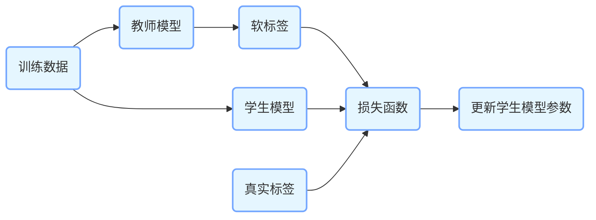

# 推理任务中的知识蒸馏技术应用

> 关键词：推理任务、知识蒸馏技术、模型压缩、知识迁移、深度神经网络

> 摘要：本文聚焦于推理任务中的知识蒸馏技术应用。知识蒸馏作为一种有效的模型压缩和知识迁移方法，在推理任务中发挥着重要作用。文章将深入介绍知识蒸馏的背景、核心概念、算法原理、数学模型，通过项目实战展示其具体应用，探讨实际应用场景，推荐相关工具和资源，最后总结未来发展趋势与挑战，并解答常见问题。旨在帮助读者全面了解知识蒸馏技术在推理任务中的应用，为相关领域的研究和实践提供有价值的参考。

## 1. 背景介绍 
### 1.1 目的和范围
随着深度学习的快速发展，深度神经网络在各种任务中取得了显著的成果。然而，这些模型通常具有庞大的参数和复杂的结构，导致在推理阶段需要大量的计算资源和内存，限制了其在资源受限设备上的应用。知识蒸馏技术作为一种有效的模型压缩和知识迁移方法，旨在解决这一问题。本文的目的是深入探讨知识蒸馏技术在推理任务中的应用，包括其原理、算法、实际应用场景等，为相关研究和实践提供全面的参考。范围涵盖知识蒸馏的基本概念、核心算法、数学模型、项目实战以及未来发展趋势等方面。

### 1.2 预期读者
本文预期读者包括深度学习领域的研究人员、工程师、学生以及对人工智能技术感兴趣的爱好者。对于希望了解模型压缩和知识迁移技术的读者，本文将提供深入的理论分析和实际应用案例；对于从事推理任务相关开发的工程师，本文将介绍实用的技术和方法，帮助他们优化模型性能，提高推理效率。

### 1.3 文档结构概述
本文将按照以下结构进行组织：
1. 背景介绍：介绍知识蒸馏技术的目的、范围、预期读者和文档结构概述，并对相关术语进行定义和解释。
2. 核心概念与联系：阐述知识蒸馏的核心概念、原理和架构，通过文本示意图和 Mermaid 流程图进行直观展示。
3. 核心算法原理 & 具体操作步骤：详细讲解知识蒸馏的核心算法原理，并使用 Python 源代码进行具体操作步骤的阐述。
4. 数学模型和公式 & 详细讲解 & 举例说明：介绍知识蒸馏的数学模型和公式，进行详细讲解并通过举例说明其应用。
5. 项目实战：代码实际案例和详细解释说明：通过项目实战展示知识蒸馏技术在推理任务中的具体应用，包括开发环境搭建、源代码实现和代码解读。
6. 实际应用场景：探讨知识蒸馏技术在不同领域的实际应用场景。
7. 工具和资源推荐：推荐学习资源、开发工具框架和相关论文著作。
8. 总结：未来发展趋势与挑战：总结知识蒸馏技术的未来发展趋势和面临的挑战。
9. 附录：常见问题与解答：解答关于知识蒸馏技术的常见问题。
10. 扩展阅读 & 参考资料：提供扩展阅读和参考资料，方便读者进一步深入学习。

### 1.4 术语表
#### 1.4.1 核心术语定义
- **知识蒸馏（Knowledge Distillation）**：一种模型压缩和知识迁移技术，通过将大型教师模型的知识迁移到小型学生模型中，使学生模型在保持较高性能的同时减少模型参数和计算量。
- **教师模型（Teacher Model）**：在知识蒸馏中，具有较高性能和复杂结构的大型模型，作为知识的来源。
- **学生模型（Student Model）**：在知识蒸馏中，需要学习教师模型知识的小型模型，通过学习教师模型的输出和中间特征来提高自身性能。
- **软标签（Soft Labels）**：教师模型输出的概率分布，包含了比硬标签（真实标签）更多的信息，用于指导学生模型的学习。
- **温度参数（Temperature Parameter）**：在知识蒸馏中，用于控制软标签的平滑程度的参数，通过调整温度参数可以改变软标签的分布。

#### 1.4.2 相关概念解释
- **模型压缩（Model Compression）**：通过各种技术减少模型的参数数量和计算量，以提高模型的推理效率和在资源受限设备上的部署能力。
- **知识迁移（Knowledge Transfer）**：将一个模型的知识或信息传递到另一个模型中，使后者能够学习到前者的经验和能力。
- **深度神经网络（Deep Neural Network）**：由多个神经元层组成的神经网络，具有强大的特征提取和模式识别能力，广泛应用于各种人工智能任务中。

#### 1.4.3 缩略词列表
- **DNN**：深度神经网络（Deep Neural Network）
- **CNN**：卷积神经网络（Convolutional Neural Network）
- **RNN**：循环神经网络（Recurrent Neural Network）

## 2. 核心概念与联系 

### 知识蒸馏的基本原理
知识蒸馏的基本思想是将大型教师模型的知识迁移到小型学生模型中。教师模型通常具有较高的性能和复杂的结构，能够学习到丰富的特征和模式。学生模型则是一个相对简单的模型，通过学习教师模型的输出和中间特征，来提高自身的性能。

具体来说，知识蒸馏的过程包括以下几个步骤：
1. **训练教师模型**：首先，使用大量的训练数据对教师模型进行训练，使其达到较高的性能。
2. **生成软标签**：在训练学生模型时，将训练数据输入到教师模型中，得到教师模型的输出概率分布，即软标签。
3. **训练学生模型**：将训练数据同时输入到学生模型和教师模型中，学生模型的目标是学习教师模型的软标签，同时也可以结合真实标签进行训练。

### 知识蒸馏的架构
知识蒸馏的架构通常由教师模型、学生模型和损失函数组成。图 1 展示了知识蒸馏的基本架构。


**图 1：知识蒸馏的基本架构**

在这个架构中，训练数据同时输入到教师模型和学生模型中。教师模型生成软标签，学生模型的输出与软标签和真实标签一起输入到损失函数中。损失函数用于衡量学生模型的输出与软标签和真实标签之间的差异，通过优化损失函数来更新学生模型的参数。

### 知识蒸馏中的关键概念联系
- **教师模型与学生模型**：教师模型是知识的来源，学生模型通过学习教师模型的知识来提高自身性能。教师模型的性能和结构对学生模型的学习效果有重要影响。
- **软标签与真实标签**：软标签包含了比真实标签更多的信息，能够指导学生模型学习到更丰富的知识。在训练学生模型时，可以结合软标签和真实标签，以平衡模型的泛化能力和准确性。
- **温度参数与软标签**：温度参数用于控制软标签的平滑程度。较高的温度参数会使软标签更加平滑，分布更加均匀；较低的温度参数会使软标签更加尖锐，突出概率较大的类别。通过调整温度参数，可以改变学生模型学习的重点。

## 3. 核心算法原理 & 具体操作步骤 

### 核心算法原理
知识蒸馏的核心算法基于损失函数的设计，通常包括两部分：蒸馏损失和分类损失。

#### 蒸馏损失
蒸馏损失用于衡量学生模型的输出与教师模型的软标签之间的差异。常用的蒸馏损失函数是 KL 散度（Kullback-Leibler Divergence），其定义如下：

$$
L_{distill} = D_{KL}(p_{teacher}^T || p_{student}^T)
$$

其中，$p_{teacher}^T$ 和 $p_{student}^T$ 分别是教师模型和学生模型在温度 $T$ 下的输出概率分布，$D_{KL}$ 表示 KL 散度。

#### 分类损失
分类损失用于衡量学生模型的输出与真实标签之间的差异。常用的分类损失函数是交叉熵损失（Cross Entropy Loss），其定义如下：

$$
L_{classify} = - \sum_{i=1}^{C} y_i \log(p_{student}^1)_i
$$

其中，$y_i$ 是真实标签的第 $i$ 个类别，$p_{student}^1$ 是学生模型在温度为 1 时的输出概率分布，$C$ 是类别数。

#### 总损失
总损失是蒸馏损失和分类损失的加权和，其定义如下：

$$
L_{total} = \alpha L_{distill} + (1 - \alpha) L_{classify}
$$

其中，$\alpha$ 是一个超参数，用于控制蒸馏损失和分类损失的权重。

### 具体操作步骤

以下是使用 Python 和 PyTorch 实现知识蒸馏的具体操作步骤：

```python
import torch
import torch.nn as nn
import torch.optim as optim

# 定义教师模型
class TeacherModel(nn.Module):
    def __init__(self):
        super(TeacherModel, self).__init__()
        # 定义教师模型的结构
        self.fc1 = nn.Linear(784, 256)
        self.fc2 = nn.Linear(256, 128)
        self.fc3 = nn.Linear(128, 10)

    def forward(self, x):
        x = x.view(-1, 784)
        x = torch.relu(self.fc1(x))
        x = torch.relu(self.fc2(x))
        x = self.fc3(x)
        return x

# 定义学生模型
class StudentModel(nn.Module):
    def __init__(self):
        super(StudentModel, self).__init__()
        # 定义学生模型的结构
        self.fc1 = nn.Linear(784, 128)
        self.fc2 = nn.Linear(128, 10)

    def forward(self, x):
        x = x.view(-1, 784)
        x = torch.relu(self.fc1(x))
        x = self.fc2(x)
        return x

# 定义温度参数和超参数
T = 4
alpha = 0.5

# 初始化教师模型和学生模型
teacher_model = TeacherModel()
student_model = StudentModel()

# 定义优化器和损失函数
optimizer = optim.Adam(student_model.parameters(), lr=0.001)
criterion_ce = nn.CrossEntropyLoss()
criterion_kl = nn.KLDivLoss(reduction='batchmean')

# 模拟训练数据
x = torch.randn(32, 1, 28, 28)
y_true = torch.randint(0, 10, (32,))

# 前向传播
teacher_output = teacher_model(x)
student_output = student_model(x)

# 计算软标签
teacher_soft_labels = nn.functional.softmax(teacher_output / T, dim=1)
student_logits_T = student_output / T
student_soft_labels_T = nn.functional.log_softmax(student_logits_T, dim=1)

# 计算蒸馏损失
distill_loss = criterion_kl(student_soft_labels_T, teacher_soft_labels) * (T * T)

# 计算分类损失
classify_loss = criterion_ce(student_output, y_true)

# 计算总损失
total_loss = alpha * distill_loss + (1 - alpha) * classify_loss

# 反向传播和参数更新
optimizer.zero_grad()
total_loss.backward()
optimizer.step()

print("Total Loss:", total_loss.item())
```

### 代码解释
1. **定义模型**：定义了教师模型和学生模型的结构，教师模型比学生模型更复杂。
2. **定义参数**：定义了温度参数 $T$ 和超参数 $\alpha$。
3. **初始化模型和优化器**：初始化教师模型、学生模型和优化器。
4. **前向传播**：将输入数据分别输入到教师模型和学生模型中，得到输出。
5. **计算软标签**：使用教师模型的输出计算软标签。
6. **计算损失**：计算蒸馏损失、分类损失和总损失。
7. **反向传播和参数更新**：通过反向传播计算梯度，并更新学生模型的参数。

## 4. 数学模型和公式 & 详细讲解 & 举例说明 

### 数学模型和公式

#### KL 散度
KL 散度是一种衡量两个概率分布之间差异的指标，其定义如下：

$$
D_{KL}(p || q) = \sum_{i=1}^{n} p(i) \log \frac{p(i)}{q(i)}
$$

其中，$p$ 和 $q$ 是两个概率分布，$n$ 是分布的维度。

在知识蒸馏中，KL 散度用于衡量学生模型的输出概率分布与教师模型的软标签之间的差异。

#### 交叉熵损失
交叉熵损失是一种常用的分类损失函数，其定义如下：

$$
L_{CE}(y, \hat{y}) = - \sum_{i=1}^{C} y_i \log(\hat{y}_i)
$$

其中，$y$ 是真实标签的概率分布，$\hat{y}$ 是模型的预测概率分布，$C$ 是类别数。

### 详细讲解

#### KL 散度的作用
KL 散度在知识蒸馏中起到了重要的作用。它能够衡量学生模型的输出与教师模型的软标签之间的差异，通过最小化 KL 散度，学生模型可以学习到教师模型的知识。

#### 温度参数的影响
温度参数 $T$ 用于控制软标签的平滑程度。当 $T$ 较大时，软标签的分布更加均匀，学生模型可以学习到更多的类别信息；当 $T$ 较小时，软标签的分布更加尖锐，学生模型可以学习到概率较大的类别信息。

### 举例说明

假设我们有一个三分类问题，教师模型的输出为 $[2, 1, 0]$，真实标签为 $[1, 0, 0]$。

#### 计算软标签
当温度 $T = 1$ 时，教师模型的软标签为：

$$
p_{teacher}^1 = \text{softmax}([2, 1, 0]) = [0.665, 0.245, 0.090]
$$

当温度 $T = 2$ 时，教师模型的软标签为：

$$
p_{teacher}^2 = \text{softmax}([2/2, 1/2, 0/2]) = [0.559, 0.271, 0.170]
$$

可以看到，随着温度的升高，软标签的分布更加均匀。

#### 计算蒸馏损失
假设学生模型的输出为 $[1, 0.5, 0]$，当温度 $T = 1$ 时，学生模型的软标签为：

$$
p_{student}^1 = \text{softmax}([1, 0.5, 0]) = [0.558, 0.271, 0.171]
$$

则蒸馏损失为：

$$
L_{distill} = D_{KL}(p_{teacher}^1 || p_{student}^1) = 0.665 \log \frac{0.665}{0.558} + 0.245 \log \frac{0.245}{0.271} + 0.090 \log \frac{0.090}{0.171} \approx 0.067
$$

通过这个例子可以看出，蒸馏损失衡量了学生模型的输出与教师模型的软标签之间的差异。

## 5. 项目实战：代码实际案例和详细解释说明 

### 5.1  开发环境搭建
在进行知识蒸馏的项目实战之前，需要搭建相应的开发环境。以下是具体的步骤：

#### 安装 Python
首先，确保你已经安装了 Python 3.6 或更高版本。可以从 Python 官方网站（https://www.python.org/downloads/） 下载并安装 Python。

#### 安装 PyTorch
PyTorch 是一个常用的深度学习框架，用于实现知识蒸馏。可以根据自己的需求选择合适的安装方式，例如使用 pip 或 conda 进行安装。以下是使用 pip 安装 PyTorch 的命令：

```bash
pip install torch torchvision
```

#### 安装其他依赖库
除了 PyTorch 之外，还需要安装一些其他的依赖库，如 numpy、matplotlib 等。可以使用以下命令进行安装：

```bash
pip install numpy matplotlib
```

### 5.2  源代码详细实现和代码解读
以下是一个使用知识蒸馏技术对 MNIST 数据集进行分类的完整代码示例：

```python
import torch
import torch.nn as nn
import torch.optim as optim
import torchvision
import torchvision.transforms as transforms
from torch.utils.data import DataLoader

# 定义教师模型
class TeacherModel(nn.Module):
    def __init__(self):
        super(TeacherModel, self).__init__()
        self.conv1 = nn.Conv2d(1, 32, kernel_size=3, padding=1)
        self.conv2 = nn.Conv2d(32, 64, kernel_size=3, padding=1)
        self.pool = nn.MaxPool2d(2, 2)
        self.fc1 = nn.Linear(64 * 7 * 7, 128)
        self.fc2 = nn.Linear(128, 10)

    def forward(self, x):
        x = self.pool(torch.relu(self.conv1(x)))
        x = self.pool(torch.relu(self.conv2(x)))
        x = x.view(-1, 64 * 7 * 7)
        x = torch.relu(self.fc1(x))
        x = self.fc2(x)
        return x

# 定义学生模型
class StudentModel(nn.Module):
    def __init__(self):
        super(StudentModel, self).__init__()
        self.conv1 = nn.Conv2d(1, 16, kernel_size=3, padding=1)
        self.pool = nn.MaxPool2d(2, 2)
        self.fc1 = nn.Linear(16 * 7 * 7, 64)
        self.fc2 = nn.Linear(64, 10)

    def forward(self, x):
        x = self.pool(torch.relu(self.conv1(x)))
        x = x.view(-1, 16 * 7 * 7)
        x = torch.relu(self.fc1(x))
        x = self.fc2(x)
        return x

# 定义温度参数和超参数
T = 4
alpha = 0.5

# 数据预处理
transform = transforms.Compose([
    transforms.ToTensor(),
    transforms.Normalize((0.5,), (0.5,))
])

# 加载 MNIST 数据集
trainset = torchvision.datasets.MNIST(root='./data', train=True,
                                      download=True, transform=transform)
trainloader = DataLoader(trainset, batch_size=64, shuffle=True)

testset = torchvision.datasets.MNIST(root='./data', train=False,
                                     download=True, transform=transform)
testloader = DataLoader(testset, batch_size=64, shuffle=False)

# 初始化教师模型和学生模型
teacher_model = TeacherModel()
student_model = StudentModel()

# 定义优化器和损失函数
optimizer = optim.Adam(student_model.parameters(), lr=0.001)
criterion_ce = nn.CrossEntropyLoss()
criterion_kl = nn.KLDivLoss(reduction='batchmean')

# 训练教师模型
teacher_criterion = nn.CrossEntropyLoss()
teacher_optimizer = optim.Adam(teacher_model.parameters(), lr=0.001)

for epoch in range(5):
    running_loss = 0.0
    for i, data in enumerate(trainloader, 0):
        inputs, labels = data
        teacher_optimizer.zero_grad()
        outputs = teacher_model(inputs)
        loss = teacher_criterion(outputs, labels)
        loss.backward()
        teacher_optimizer.step()
        running_loss += loss.item()
    print(f'Epoch {epoch + 1}, Teacher Loss: {running_loss / len(trainloader)}')

# 训练学生模型
for epoch in range(5):
    running_loss = 0.0
    for i, data in enumerate(trainloader, 0):
        inputs, labels = data

        # 前向传播
        teacher_output = teacher_model(inputs)
        student_output = student_model(inputs)

        # 计算软标签
        teacher_soft_labels = nn.functional.softmax(teacher_output / T, dim=1)
        student_logits_T = student_output / T
        student_soft_labels_T = nn.functional.log_softmax(student_logits_T, dim=1)

        # 计算蒸馏损失
        distill_loss = criterion_kl(student_soft_labels_T, teacher_soft_labels) * (T * T)

        # 计算分类损失
        classify_loss = criterion_ce(student_output, labels)

        # 计算总损失
        total_loss = alpha * distill_loss + (1 - alpha) * classify_loss

        # 反向传播和参数更新
        optimizer.zero_grad()
        total_loss.backward()
        optimizer.step()

        running_loss += total_loss.item()
    print(f'Epoch {epoch + 1}, Student Loss: {running_loss / len(trainloader)}')

# 测试学生模型
correct = 0
total = 0
with torch.no_grad():
    for data in testloader:
        images, labels = data
        outputs = student_model(images)
        _, predicted = torch.max(outputs.data, 1)
        total += labels.size(0)
        correct += (predicted == labels).sum().item()

print(f'Accuracy of the student network on the 10000 test images: {100 * correct / total}%')
```

### 5.3  代码解读与分析
1. **定义模型**：定义了教师模型和学生模型的结构，教师模型比学生模型更复杂。
2. **数据预处理**：使用 `transforms` 对 MNIST 数据集进行预处理，包括将图像转换为张量和归一化操作。
3. **加载数据集**：使用 `DataLoader` 加载 MNIST 训练集和测试集。
4. **训练教师模型**：使用交叉熵损失函数和 Adam 优化器对教师模型进行训练。
5. **训练学生模型**：在训练学生模型时，同时考虑蒸馏损失和分类损失，通过调整超参数 $\alpha$ 来平衡两者的权重。
6. **测试学生模型**：在测试集上评估学生模型的准确率。

通过这个项目实战，可以看到知识蒸馏技术能够有效地将教师模型的知识迁移到学生模型中，提高学生模型的性能。

## 6. 实际应用场景 
知识蒸馏技术在多个领域都有广泛的应用，以下是一些常见的实际应用场景：

### 移动设备和嵌入式系统
在移动设备和嵌入式系统中，资源通常非常有限，无法运行复杂的大型模型。知识蒸馏技术可以将大型模型的知识迁移到小型模型中，使小型模型在保持较高性能的同时减少计算量和内存占用，从而可以在移动设备和嵌入式系统上高效运行。例如，在智能手机上实现图像识别、语音识别等功能时，可以使用知识蒸馏技术对模型进行压缩和优化。

### 自动驾驶
自动驾驶系统需要在实时性和准确性之间取得平衡。知识蒸馏技术可以将复杂的深度学习模型压缩为轻量级模型，提高模型的推理速度，同时保持较高的准确性。例如，在自动驾驶车辆的目标检测和识别任务中，使用知识蒸馏技术可以减少模型的计算量，提高系统的响应速度。

### 医疗影像分析
医疗影像分析需要处理大量的图像数据，并且对模型的准确性要求很高。知识蒸馏技术可以将大型的医学影像分析模型的知识迁移到小型模型中，使小型模型能够在有限的计算资源下实现高效的医疗影像分析。例如，在医学图像的疾病诊断和分类任务中，使用知识蒸馏技术可以提高模型的性能和效率。

### 智能安防
智能安防系统需要实时处理监控视频，对目标进行检测和识别。知识蒸馏技术可以将复杂的目标检测和识别模型压缩为轻量级模型，提高系统的实时性和准确性。例如，在智能监控摄像头中，使用知识蒸馏技术可以实现高效的目标检测和行为分析。

### 推荐系统
推荐系统需要对大量的用户数据进行处理和分析，以提供个性化的推荐服务。知识蒸馏技术可以将大型的推荐模型的知识迁移到小型模型中，减少模型的计算量和存储需求，提高推荐系统的效率。例如，在电商平台的商品推荐和社交媒体的内容推荐中，使用知识蒸馏技术可以提高推荐的准确性和实时性。

## 7. 工具和资源推荐
### 7.1 学习资源推荐
#### 7.1.1 书籍推荐
- 《深度学习》（Deep Learning）：由 Ian Goodfellow、Yoshua Bengio 和 Aaron Courville 合著，是深度学习领域的经典教材，涵盖了深度学习的基本原理、算法和应用。
- 《Python 深度学习》（Deep Learning with Python）：由 Francois Chollet 所著，通过 Python 和 Keras 框架介绍深度学习的实践应用，适合初学者入门。
- 《动手学深度学习》（Dive into Deep Learning）：由 Aston Zhang、Zack C. Lipton、Mu Li 和 Alexander J. Smola 合著，提供了丰富的代码示例和详细的解释，帮助读者深入理解深度学习的原理和实践。

#### 7.1.2 在线课程
- Coursera 上的“深度学习专项课程”（Deep Learning Specialization）：由 Andrew Ng 教授授课，涵盖了深度学习的各个方面，包括神经网络、卷积神经网络、循环神经网络等。
- edX 上的“人工智能基础”（Introduction to Artificial Intelligence）：介绍了人工智能的基本概念、算法和应用，包括深度学习、机器学习等领域。
- 哔哩哔哩（B 站）上的相关深度学习教程：有许多优质的深度学习教程，由不同的博主分享，内容丰富多样，适合不同层次的学习者。

#### 7.1.3 技术博客和网站
- Medium 上的深度学习相关博客：有许多深度学习领域的专家和研究者在 Medium 上分享他们的研究成果和实践经验。
- arXiv 网站：是一个预印本平台，提供了大量的深度学习相关的研究论文，及时了解最新的研究动态。
- 开源中国（OSChina）：提供了丰富的技术文章和开源项目，包括深度学习领域的相关内容。

### 7.2 开发工具框架推荐
#### 7.2.1 IDE和编辑器
- PyCharm：是一款专业的 Python 集成开发环境，提供了丰富的代码编辑、调试和项目管理功能，适合深度学习项目的开发。
- Visual Studio Code：是一款轻量级的代码编辑器，支持多种编程语言和插件扩展，通过安装相关插件可以方便地进行深度学习项目的开发。
- Jupyter Notebook：是一个交互式的开发环境，适合进行数据探索、模型训练和结果展示，常用于深度学习的实验和教学。

#### 7.2.2 调试和性能分析工具
- PyTorch Profiler：是 PyTorch 提供的性能分析工具，可以帮助开发者分析模型的性能瓶颈，优化模型的计算效率。
- TensorBoard：是 TensorFlow 提供的可视化工具，也可以与 PyTorch 结合使用，用于可视化模型的训练过程、损失曲线、准确率等指标。
- NVIDIA Nsight Systems：是 NVIDIA 提供的性能分析工具，可用于分析 GPU 计算的性能，优化深度学习模型在 GPU 上的运行效率。

#### 7.2.3 相关框架和库
- PyTorch：是一个开源的深度学习框架，具有动态计算图、易于使用和高效的特点，广泛应用于深度学习的研究和实践。
- TensorFlow：是一个由 Google 开发的开源深度学习框架，具有强大的分布式训练和部署能力，在工业界有广泛的应用。
- Scikit-learn：是一个用于机器学习的 Python 库，提供了丰富的机器学习算法和工具，可用于数据预处理、模型选择和评估等任务。

### 7.3 相关论文著作推荐
#### 7.3.1 经典论文
- “Distilling the Knowledge in a Neural Network”：由 Geoffrey Hinton、Oriol Vinyals 和 Jeff Dean 发表，是知识蒸馏领域的开创性论文，首次提出了知识蒸馏的概念和方法。
- “MobileNets: Efficient Convolutional Neural Networks for Mobile Vision Applications”：介绍了 MobileNet 系列轻量级卷积神经网络的设计和实现，为模型压缩和加速提供了有效的方法。
- “EfficientNet: Rethinking Model Scaling for Convolutional Neural Networks”：提出了 EfficientNet 系列高效的卷积神经网络，通过自动搜索网络结构和缩放策略，在模型性能和计算效率之间取得了较好的平衡。

#### 7.3.2 最新研究成果
- 关注 arXiv 上最新的知识蒸馏相关论文，了解该领域的最新研究动态和技术进展。
- 参加相关的学术会议，如 NeurIPS、ICML、CVPR 等，听取最新的研究报告和成果分享。

#### 7.3.3 应用案例分析
- 研究工业界和学术界的实际应用案例，了解知识蒸馏技术在不同领域的应用场景和实践经验。
- 分析开源项目中的知识蒸馏实现，学习优秀的代码和工程实践。

## 8. 总结：未来发展趋势与挑战
### 未来发展趋势
#### 多模态知识蒸馏
随着人工智能技术的发展，多模态数据（如图像、文本、音频等）的处理变得越来越重要。未来的知识蒸馏技术将更加注重多模态知识的迁移和融合，以提高模型在多模态任务中的性能。

#### 自适应知识蒸馏
不同的任务和数据集对知识蒸馏的需求可能不同。未来的知识蒸馏技术将更加自适应，能够根据具体的任务和数据集自动调整蒸馏策略和参数，以达到更好的效果。

#### 与其他技术的融合
知识蒸馏技术将与其他人工智能技术（如强化学习、生成对抗网络等）进行融合，创造出更加强大和智能的模型。例如，将知识蒸馏与强化学习相结合，可以提高智能体的学习效率和性能。

#### 跨领域知识蒸馏
未来的知识蒸馏技术将不仅局限于同一领域内的模型压缩和知识迁移，还将实现跨领域的知识蒸馏，将一个领域的知识迁移到另一个领域，拓展模型的应用范围。

### 挑战
#### 知识表示和迁移的有效性
如何有效地表示和迁移教师模型的知识是知识蒸馏技术面临的一个重要挑战。不同的模型和任务可能需要不同的知识表示方法，如何找到一种通用有效的知识表示和迁移方法是未来研究的重点。

#### 蒸馏策略的优化
蒸馏策略的选择对学生模型的性能有重要影响。如何优化蒸馏策略，平衡蒸馏损失和分类损失的权重，以及如何选择合适的温度参数等，都是需要进一步研究的问题。

#### 模型的可解释性
随着深度学习模型的复杂性不断增加，模型的可解释性变得越来越重要。知识蒸馏技术在提高模型性能的同时，也需要考虑模型的可解释性，以便更好地理解和应用模型。

#### 计算资源的限制
虽然知识蒸馏技术可以减少模型的计算量和内存占用，但在处理大规模数据集和复杂任务时，仍然需要大量的计算资源。如何在有限的计算资源下实现高效的知识蒸馏是一个挑战。

## 9. 附录：常见问题与解答
### 问题 1：知识蒸馏技术与模型压缩有什么关系？
知识蒸馏技术是一种有效的模型压缩方法。通过将大型教师模型的知识迁移到小型学生模型中，可以减少学生模型的参数数量和计算量，从而实现模型的压缩。同时，知识蒸馏还可以提高学生模型的性能，使其在保持较高准确率的同时减少资源消耗。

### 问题 2：如何选择合适的温度参数？
温度参数的选择需要根据具体的任务和数据集进行调整。一般来说，较高的温度参数会使软标签更加平滑，学生模型可以学习到更多的类别信息；较低的温度参数会使软标签更加尖锐，学生模型可以学习到概率较大的类别信息。可以通过实验来选择合适的温度参数，以达到最佳的蒸馏效果。

### 问题 3：知识蒸馏技术适用于所有类型的模型吗？
知识蒸馏技术适用于大多数类型的深度学习模型，包括卷积神经网络（CNN）、循环神经网络（RNN）、全连接神经网络等。但不同类型的模型在知识蒸馏过程中可能需要采用不同的策略和方法。例如，对于 CNN 模型，可以考虑蒸馏中间层的特征图；对于 RNN 模型，可以考虑蒸馏隐藏状态信息。

### 问题 4：知识蒸馏技术对数据集有什么要求？
知识蒸馏技术对数据集没有特殊的要求。可以使用与训练教师模型相同的数据集来训练学生模型。但为了提高学生模型的泛化能力，建议使用足够大的数据集进行训练。同时，数据集的质量也会影响知识蒸馏的效果，应尽量使用标注准确、分布合理的数据集。

### 问题 5：知识蒸馏技术的训练时间会比普通训练长吗？
知识蒸馏技术的训练时间可能会比普通训练长一些。这是因为在知识蒸馏过程中，需要同时运行教师模型和学生模型，并且需要计算蒸馏损失和分类损失。但具体的训练时间还取决于模型的复杂度、数据集的大小和计算资源等因素。在实际应用中，可以通过优化训练策略和使用高效的计算设备来减少训练时间。

## 10. 扩展阅读 & 参考资料
### 扩展阅读
- 阅读更多关于深度学习模型压缩和加速的相关文献，了解其他模型压缩技术（如剪枝、量化等）与知识蒸馏技术的结合应用。
- 研究知识蒸馏技术在不同领域的具体应用案例，深入了解其在实际场景中的优势和挑战。
- 关注人工智能领域的最新研究动态，了解知识蒸馏技术的前沿发展和创新应用。

### 参考资料
- Hinton, G., Vinyals, O., & Dean, J. (2015). Distilling the Knowledge in a Neural Network. arXiv preprint arXiv:1503.02531.
- Howard, A. G., Zhu, M., Chen, B., Kalenichenko, D., Wang, W., Weyand, T., ... & Adam, H. (2017). MobileNets: Efficient Convolutional Neural Networks for Mobile Vision Applications. arXiv preprint arXiv:1704.04861.
- Tan, M., & Le, Q. V. (2019). EfficientNet: Rethinking Model Scaling for Convolutional Neural Networks. In Proceedings of the IEEE/CVF International Conference on Computer Vision (pp. 6105-6114).
- PyTorch 官方文档：https://pytorch.org/docs/stable/index.html
- TensorFlow 官方文档：https://www.tensorflow.org/api_docs