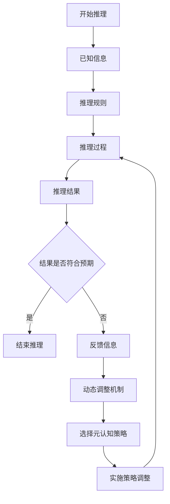

# 推理过程中的元认知策略动态调整机制研究

> 关键词：推理过程、元认知策略、动态调整机制、认知心理学、人工智能

> 摘要：本文聚焦于推理过程中的元认知策略动态调整机制。元认知策略在人类的推理活动中起着关键作用，它能够帮助个体监控和调节自己的思维过程，以提高推理的效率和准确性。通过深入研究这一机制，不仅有助于我们理解人类认知的本质，还能为人工智能领域中推理系统的设计提供有益的参考。文章从背景介绍入手，阐述相关核心概念与联系，详细讲解核心算法原理和具体操作步骤，运用数学模型和公式进行分析，通过项目实战展示代码实现和解读，探讨实际应用场景，推荐相关工具和资源，最后总结未来发展趋势与挑战，并对常见问题进行解答，为该领域的进一步研究奠定基础。

## 1. 背景介绍 
### 1.1 目的和范围
本研究的目的在于深入探究推理过程中，元认知策略是如何进行动态调整的。这包括理解元认知策略在不同推理任务中的作用、调整的依据和方式，以及这种调整对推理结果的影响。研究范围涵盖了从认知心理学角度对人类推理行为的分析，到在人工智能领域中模拟和应用元认知策略动态调整机制的相关内容。

### 1.2 预期读者
本文预期读者包括认知心理学领域的研究人员，他们可以从文中获取关于元认知策略在推理过程中作用的新见解；人工智能领域的开发者和研究人员，能够借鉴其中的理论和方法来改进推理系统的设计；以及对人类认知和推理机制感兴趣的广大爱好者。

### 1.3 文档结构概述
本文首先介绍研究的背景信息，包括目的、预期读者和文档结构。接着阐述核心概念与联系，通过文本示意图和 Mermaid 流程图进行说明。然后详细讲解核心算法原理和具体操作步骤，结合 Python 源代码进行阐述。之后运用数学模型和公式进行分析，并举例说明。通过项目实战展示代码实际案例和详细解释。探讨实际应用场景，推荐相关工具和资源。最后总结未来发展趋势与挑战，解答常见问题，并提供扩展阅读和参考资料。

### 1.4 术语表
#### 1.4.1 核心术语定义
- **推理过程**：个体从已知信息出发，通过一定的思维规则和方法，推导出新的结论或知识的过程。
- **元认知策略**：个体对自己认知过程的监控、调节和控制的策略，旨在提高认知效率和准确性。
- **动态调整机制**：在推理过程中，根据推理的进展、遇到的问题和反馈信息，实时调整元认知策略的机制。

#### 1.4.2 相关概念解释
- **认知**：个体获取、存储、处理和应用知识的心理过程。
- **元认知**：对认知的认知，包括对自己认知过程的意识、监控和调节。
- **策略**：为了达到特定目标而采取的一系列行动或方法。

#### 1.4.3 缩略词列表
- **AI**：Artificial Intelligence，人工智能
- **CogSci**：Cognitive Science，认知科学

## 2. 核心概念与联系 
### 核心概念原理
推理过程是人类认知活动的重要组成部分。在推理过程中，个体需要运用各种知识和思维规则来推导结论。元认知策略则是个体对自己推理过程的监控和调节。例如，当个体在推理过程中遇到困难时，元认知策略可以帮助其调整思维方式、检查推理步骤是否合理等。

元认知策略的动态调整机制是基于个体对推理过程的实时评估和反馈。当个体发现推理结果与预期不符或遇到障碍时，会触发元认知策略的调整。这种调整可以是对推理方法的改变、对知识的重新调用，或者是对推理目标的修正。

### 架构的文本示意图
```plaintext
推理过程
├── 已知信息
│   ├── 事实知识
│   ├── 规则知识
├── 推理规则
│   ├── 演绎推理规则
│   ├── 归纳推理规则
│   ├── 类比推理规则
├── 推理结果
│   ├── 正确结论
│   ├── 错误结论

元认知策略
├── 监控策略
│   ├── 对推理过程的实时监测
│   ├── 对推理结果的评估
├── 调节策略
│   ├── 调整推理方法
│   ├── 重新调用知识
│   ├── 修正推理目标

动态调整机制
├── 反馈信息
│   ├── 推理结果与预期的差异
│   ├── 遇到的困难和障碍
├── 调整决策
│   ├── 选择合适的元认知策略
│   ├── 实施策略调整
```

### Mermaid 流程图


## 3. 核心算法原理 & 具体操作步骤 
### 核心算法原理
在推理过程中，我们可以将元认知策略的动态调整机制看作一个反馈控制系统。该系统根据推理结果与预期的差异，以及遇到的困难和障碍等反馈信息，动态调整元认知策略。

以下是一个简化的算法描述：

1. 初始化推理过程，包括已知信息、推理规则和预期结果。
2. 进行推理，得到推理结果。
3. 评估推理结果与预期的差异，检查是否遇到困难和障碍。
4. 根据反馈信息，选择合适的元认知策略。
5. 实施策略调整，更新推理过程。
6. 重复步骤 2 - 5，直到推理结果符合预期或达到最大迭代次数。

### 具体操作步骤及 Python 源代码
```python
# 示例代码，模拟推理过程和元认知策略的动态调整机制

# 定义已知信息
known_information = {
    "facts": ["A is true", "B is true"],
    "rules": ["If A and B, then C"]
}

# 定义预期结果
expected_result = "C is true"

# 定义推理规则
def inference_rule(facts, rules):
    for rule in rules:
        if "If" in rule and "then" in rule:
            condition, conclusion = rule.split("then")
            condition_facts = [fact.strip() for fact in condition.replace("If", "").split("and")]
            if all(fact in facts for fact in condition_facts):
                return conclusion.strip()
    return None

# 定义元认知策略
def metacognitive_strategy(feedback):
    if feedback == "result does not match expected":
        # 调整推理规则，尝试其他可能的规则
        new_rules = ["If A, then D"]  # 示例调整
        return new_rules
    elif feedback == "encountered difficulty":
        # 重新检查已知信息，补充或修正知识
        new_facts = ["E is true"]  # 示例调整
        return new_facts
    else:
        return None

# 推理过程
max_iterations = 10
iteration = 0
while iteration < max_iterations:
    # 进行推理
    result = inference_rule(known_information["facts"], known_information["rules"])
    print(f"Iteration {iteration}: Result = {result}")

    # 评估推理结果
    if result == expected_result:
        print("推理成功！")
        break
    elif result is None:
        feedback = "encountered difficulty"
    else:
        feedback = "result does not match expected"

    # 选择并实施元认知策略
    adjustment = metacognitive_strategy(feedback)
    if adjustment is not None:
        if isinstance(adjustment, list) and all("is true" in fact for fact in adjustment):
            known_information["facts"].extend(adjustment)
        else:
            known_information["rules"] = adjustment

    iteration += 1

if iteration == max_iterations:
    print("达到最大迭代次数，推理失败。")
```

## 4. 数学模型和公式 & 详细讲解 & 举例说明 
### 数学模型
我们可以用一个简单的数学模型来描述推理过程中的元认知策略动态调整机制。设 $S_t$ 表示在第 $t$ 次迭代时的推理状态，包括已知信息、推理规则和推理结果等。$E$ 表示预期结果，$F_t$ 表示第 $t$ 次迭代的反馈信息，$M_t$ 表示第 $t$ 次迭代选择的元认知策略，$A_t$ 表示第 $t$ 次迭代实施的策略调整。

则反馈信息 $F_t$ 可以表示为：
$$F_t = f(S_t, E)$$
其中 $f$ 是一个反馈函数，用于评估推理状态 $S_t$ 与预期结果 $E$ 的差异。

元认知策略的选择可以表示为：
$$M_t = g(F_t)$$
其中 $g$ 是一个策略选择函数，根据反馈信息 $F_t$ 选择合适的元认知策略。

策略调整可以表示为：
$$A_t = h(M_t)$$
其中 $h$ 是一个策略实施函数，根据选择的元认知策略 $M_t$ 实施具体的调整。

推理状态的更新可以表示为：
$$S_{t+1} = u(S_t, A_t)$$
其中 $u$ 是一个状态更新函数，根据当前推理状态 $S_t$ 和实施的策略调整 $A_t$ 更新推理状态。

### 详细讲解
反馈函数 $f$ 可以根据具体的推理任务和评估标准进行定义。例如，在逻辑推理中，可以比较推理结果与预期结果是否相等；在数值推理中，可以计算推理结果与预期结果的误差。

策略选择函数 $g$ 可以根据不同的反馈信息选择不同的元认知策略。例如，当反馈信息表示推理结果与预期不符时，可以选择调整推理规则的策略；当反馈信息表示遇到困难时，可以选择重新检查已知信息的策略。

策略实施函数 $h$ 负责将选择的元认知策略转化为具体的调整操作。例如，如果选择了调整推理规则的策略，$h$ 函数可以将新的推理规则替换原来的规则。

状态更新函数 $u$ 则根据实施的策略调整更新推理状态，包括更新已知信息、推理规则和推理结果等。

### 举例说明
假设我们有一个简单的逻辑推理任务，已知信息为 $A = True$ 和 $B = True$，推理规则为 $If A and B, then C$，预期结果为 $C = True$。

在第一次迭代中，推理结果为 $C = True$，反馈信息 $F_1 = f(S_1, E) = "result matches expected"$，此时不需要选择元认知策略，推理成功。

假设在第一次迭代中，推理结果为 $D = True$，反馈信息 $F_1 = f(S_1, E) = "result does not match expected"$，策略选择函数 $g(F_1)$ 选择调整推理规则的策略，策略实施函数 $h(M_1)$ 将新的推理规则 $If A, then D$ 替换原来的规则，状态更新函数 $u(S_1, A_1)$ 更新推理状态，进入下一次迭代。

## 5. 项目实战：代码实际案例和详细解释说明 
### 5.1  开发环境搭建
- **操作系统**：Windows、Linux 或 macOS 均可。
- **Python 版本**：建议使用 Python 3.7 及以上版本。
- **开发工具**：可以使用 PyCharm、VS Code 等集成开发环境（IDE），也可以使用文本编辑器和命令行工具。

### 5.2  源代码详细实现和代码解读
```python
# 示例代码，模拟一个更复杂的推理过程和元认知策略的动态调整机制

# 定义已知信息类
class KnownInformation:
    def __init__(self, facts, rules):
        self.facts = facts
        self.rules = rules

    def add_fact(self, fact):
        self.facts.append(fact)

    def update_rules(self, new_rules):
        self.rules = new_rules

# 定义推理规则函数
def inference_rule(known_info):
    for rule in known_info.rules:
        if "If" in rule and "then" in rule:
            condition, conclusion = rule.split("then")
            condition_facts = [fact.strip() for fact in condition.replace("If", "").split("and")]
            if all(fact in known_info.facts for fact in condition_facts):
                return conclusion.strip()
    return None

# 定义元认知策略类
class MetacognitiveStrategy:
    def __init__(self):
        self.strategies = {
            "result does not match expected": self.adjust_rules,
            "encountered difficulty": self.recheck_facts
        }

    def adjust_rules(self):
        # 示例调整：添加新的推理规则
        new_rules = ["If A, then D"]
        return new_rules

    def recheck_facts(self):
        # 示例调整：补充新的事实
        new_facts = ["E is true"]
        return new_facts

    def choose_strategy(self, feedback):
        if feedback in self.strategies:
            return self.strategies[feedback]()
        else:
            return None

# 推理过程
def reasoning_process(known_info, expected_result, max_iterations=10):
    iteration = 0
    metacognitive_strategy = MetacognitiveStrategy()
    while iteration < max_iterations:
        # 进行推理
        result = inference_rule(known_info)
        print(f"Iteration {iteration}: Result = {result}")

        # 评估推理结果
        if result == expected_result:
            print("推理成功！")
            break
        elif result is None:
            feedback = "encountered difficulty"
        else:
            feedback = "result does not match expected"

        # 选择并实施元认知策略
        adjustment = metacognitive_strategy.choose_strategy(feedback)
        if adjustment is not None:
            if isinstance(adjustment, list) and all("is true" in fact for fact in adjustment):
                for fact in adjustment:
                    known_info.add_fact(fact)
            else:
                known_info.update_rules(adjustment)

        iteration += 1

    if iteration == max_iterations:
        print("达到最大迭代次数，推理失败。")

# 主程序
if __name__ == "__main__":
    known_info = KnownInformation(
        facts=["A is true", "B is true"],
        rules=["If A and B, then C"]
    )
    expected_result = "C is true"
    reasoning_process(known_info, expected_result)
```

### 5.3  代码解读与分析
- **KnownInformation 类**：用于存储已知信息，包括事实和推理规则。提供了添加事实和更新推理规则的方法。
- **inference_rule 函数**：根据已知信息进行推理，返回推理结果。如果没有匹配的规则，则返回 None。
- **MetacognitiveStrategy 类**：实现了元认知策略的选择和实施。根据不同的反馈信息，选择不同的策略进行调整。
- **reasoning_process 函数**：实现了整个推理过程，包括推理、评估、选择和实施元认知策略等步骤。
- **主程序**：初始化已知信息和预期结果，调用推理过程函数进行推理。

通过这个项目实战，我们可以看到如何在代码中实现推理过程中的元认知策略动态调整机制。

## 6. 实际应用场景 
### 教育领域
在教育中，元认知策略的动态调整机制可以帮助学生更好地监控和调节自己的学习过程。例如，当学生在解决数学问题时遇到困难，元认知策略可以引导他们检查解题思路、回顾相关知识，调整解题方法。教师可以通过教学活动培养学生的元认知策略，提高学生的学习能力和自主学习水平。

### 人工智能领域
在人工智能的推理系统中，元认知策略的动态调整机制可以提高系统的智能水平和适应性。例如，在专家系统中，当系统的推理结果与实际情况不符时，元认知策略可以帮助系统调整推理规则、更新知识库，从而提高系统的准确性和可靠性。

### 决策支持系统
在决策支持系统中，元认知策略的动态调整机制可以帮助决策者更好地评估决策方案，根据反馈信息及时调整决策策略。例如，在企业的投资决策中，决策者可以根据市场变化和投资回报情况，动态调整投资策略。

## 7. 工具和资源推荐
### 7.1 学习资源推荐
#### 7.1.1 书籍推荐
- 《认知心理学》：介绍了人类认知的基本原理和过程，包括推理、元认知等方面的内容。
- 《人工智能：一种现代的方法》：涵盖了人工智能的各个领域，包括推理系统的设计和实现。
- 《元认知与学习策略》：专门探讨了元认知策略在学习中的应用和作用。

#### 7.1.2 在线课程
- Coursera 上的“认知心理学”课程：由知名大学的教授授课，系统地介绍了认知心理学的知识。
- edX 上的“人工智能基础”课程：提供了人工智能的基础知识和实践经验。
- 中国大学 MOOC 上的“学习策略与元认知”课程：结合中国教育实际，讲解了元认知策略在学习中的应用。

#### 7.1.3 技术博客和网站
- Medium 上的人工智能和认知科学相关博客：有很多专业人士分享的最新研究成果和实践经验。
- Cognitive Science Society 官方网站：提供了认知科学领域的最新研究动态和学术资源。
- AI Research 网站：专注于人工智能领域的研究和发展，有很多关于推理系统和元认知策略的文章。

### 7.2 开发工具框架推荐
#### 7.2.1 IDE和编辑器
- PyCharm：功能强大的 Python 集成开发环境，提供了代码编辑、调试、版本控制等功能。
- VS Code：轻量级的代码编辑器，支持多种编程语言，有丰富的插件扩展。
- Jupyter Notebook：交互式的开发环境，适合进行数据分析和算法实验。

#### 7.2.2 调试和性能分析工具
- pdb：Python 内置的调试工具，用于调试 Python 代码。
- cProfile：Python 标准库中的性能分析工具，用于分析代码的性能瓶颈。
- Py-Spy：一个简单快速的 Python 性能分析工具，可以实时查看 Python 程序的性能。

#### 7.2.3 相关框架和库
- PyKE：Python 知识引擎，用于实现基于规则的推理系统。
- NLTK：自然语言处理工具包，可用于处理和分析文本信息，辅助推理过程。
- scikit-learn：机器学习库，可用于构建和训练推理模型。

### 7.3 相关论文著作推荐
#### 7.3.1 经典论文
- “A Theory of Metacognitive Learning and Instruction”：提出了元认知学习和教学的理论框架。
- “Reasoning in Artificial Intelligence”：探讨了人工智能中推理的基本原理和方法。
- “Metacognitive Strategies in Problem Solving”：研究了元认知策略在问题解决中的作用。

#### 7.3.2 最新研究成果
- 关注顶级学术会议如 AAAI、IJCAI 上发表的关于推理和元认知策略的研究论文。
- 查阅相关学术期刊如 Artificial Intelligence、Cognitive Psychology 上的最新研究成果。

#### 7.3.3 应用案例分析
- 分析一些实际应用中的推理系统和元认知策略的案例，如医疗诊断系统、智能客服系统等。

## 8. 总结：未来发展趋势与挑战
### 未来发展趋势
- **跨学科融合**：推理过程中的元认知策略动态调整机制将与认知心理学、人工智能、教育学等多个学科进一步融合，推动相关领域的发展。
- **智能化应用**：在人工智能领域，元认知策略的动态调整机制将被广泛应用于各种智能系统中，提高系统的智能水平和适应性。
- **个性化学习**：在教育领域，基于元认知策略的个性化学习系统将得到更多的关注和发展，满足不同学生的学习需求。

### 挑战
- **理论模型的完善**：目前关于元认知策略动态调整机制的理论模型还不够完善，需要进一步深入研究和验证。
- **技术实现的难题**：在人工智能中实现元认知策略的动态调整机制面临着技术上的挑战，如如何准确地评估推理结果、如何选择合适的元认知策略等。
- **伦理和社会问题**：随着元认知策略在智能系统中的应用，可能会带来一些伦理和社会问题，如隐私保护、算法偏见等，需要引起重视和解决。

## 9. 附录：常见问题与解答
### 问题 1：元认知策略和认知策略有什么区别？
认知策略是个体在认知过程中直接用于获取、存储、处理和应用知识的策略，如记忆策略、理解策略等。元认知策略则是个体对自己认知过程的监控、调节和控制的策略，它不直接参与知识的获取和处理，而是对认知过程进行管理和优化。

### 问题 2：如何在实际应用中评估元认知策略的效果？
可以通过多种方式评估元认知策略的效果，如观察推理结果的准确性和效率、收集用户的反馈意见、进行实验对比等。例如，在教育中可以通过学生的学习成绩、学习态度和学习方法的改变来评估元认知策略的效果；在人工智能中可以通过系统的性能指标和用户满意度来评估。

### 问题 3：元认知策略的动态调整机制是否适用于所有的推理任务？
元认知策略的动态调整机制适用于大多数推理任务，但不同的推理任务可能需要不同的元认知策略和调整方式。例如，在逻辑推理任务中，可能更注重推理规则的调整；在数值推理任务中，可能更注重数据的准确性和计算方法的选择。

## 10. 扩展阅读 & 参考资料
- Anderson, J. R. (2000). Cognitive Psychology and Its Implications. Worth Publishers.
- Mitchell, T. M. (1997). Machine Learning. McGraw-Hill.
- Flavell, J. H. (1979). Metacognition and cognitive monitoring: A new area of cognitive - developmental inquiry. American Psychologist, 34(10), 906 - 911.
- AAAI Conference on Artificial Intelligence Proceedings.
- IJCAI International Joint Conference on Artificial Intelligence Proceedings.
- Cognitive Psychology Journal.
- Artificial Intelligence Journal.