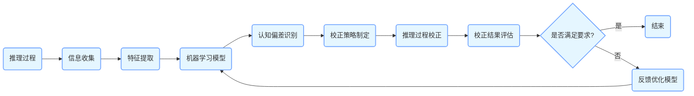

# 推理过程中的认知偏差自动识别与校正技术

> 关键词：认知偏差、自动识别、校正技术、推理过程、机器学习、人工智能

> 摘要：本文聚焦于推理过程中的认知偏差自动识别与校正技术。在人们的日常推理和决策中，认知偏差广泛存在且可能导致错误的判断和决策。通过深入研究认知偏差的自动识别与校正技术，我们可以利用先进的机器学习和人工智能方法，对推理过程中的偏差进行精准捕捉和有效纠正。文章详细介绍了该技术的背景、核心概念、算法原理、数学模型，通过项目实战展示其实际应用，探讨了相关的实际应用场景、工具资源，并对未来发展趋势与挑战进行了总结，旨在为相关领域的研究和实践提供全面且深入的参考。

## 1. 背景介绍 
### 1.1 目的和范围
认知偏差是人类思维过程中普遍存在的现象，它会影响我们对信息的理解、评估和决策。本技术的目的在于开发一套能够自动识别推理过程中认知偏差，并进行有效校正的方法和系统。其范围涵盖了各种领域的推理活动，包括但不限于金融投资决策、医疗诊断、科学研究等。通过自动识别和校正认知偏差，可以提高决策的准确性和合理性，减少因偏差导致的错误和损失。

### 1.2 预期读者
本文预期读者包括从事人工智能、机器学习、认知科学等领域的研究人员和开发者，以及对决策优化、风险管理等实际应用感兴趣的专业人士。对于希望了解如何利用技术手段提高推理质量和决策效率的人员，本文也具有一定的参考价值。

### 1.3 文档结构概述
本文首先介绍了认知偏差自动识别与校正技术的背景信息，包括目的、预期读者和文档结构。接着阐述了核心概念与联系，包括认知偏差的定义、分类以及与自动识别和校正技术的关系。然后详细讲解了核心算法原理和具体操作步骤，通过Python源代码进行说明。之后介绍了相关的数学模型和公式，并举例说明。项目实战部分展示了代码实际案例和详细解释。随后探讨了实际应用场景，推荐了相关的工具和资源。最后总结了未来发展趋势与挑战，并提供了常见问题与解答以及扩展阅读和参考资料。

### 1.4 术语表
#### 1.4.1 核心术语定义
- **认知偏差**：指在认知过程中，由于个体的心理、生理等因素的影响，导致对信息的感知、理解、判断等出现偏离客观事实的现象。
- **自动识别**：利用计算机技术和算法，对认知偏差进行自动检测和判断的过程。
- **校正技术**：针对识别出的认知偏差，采取相应的措施进行纠正和调整的技术。
- **推理过程**：人们从已知信息出发，通过逻辑思考和判断得出结论的过程。

#### 1.4.2 相关概念解释
- **机器学习**：一门多领域交叉学科，涉及概率论、统计学、逼近论、凸分析、算法复杂度理论等多门学科。它专门研究计算机怎样模拟或实现人类的学习行为，以获取新的知识或技能，重新组织已有的知识结构使之不断改善自身的性能。
- **人工智能**：研究、开发用于模拟、延伸和扩展人的智能的理论、方法、技术及应用系统的一门新的技术科学。

#### 1.4.3 缩略词列表
- **AI**：Artificial Intelligence，人工智能
- **ML**：Machine Learning，机器学习

## 2. 核心概念与联系 

### 认知偏差的定义与分类
认知偏差是人类思维的一种局限性，它可以分为多种类型。常见的认知偏差包括：
- **确认偏差**：人们倾向于寻找和接受与自己已有信念相符的信息，而忽视或排斥与之矛盾的信息。
- **可得性偏差**：人们根据信息的可得性来判断事件发生的概率，容易高估容易回忆起的事件的发生概率。
- **锚定偏差**：人们在做决策时，往往会受到最初获得的信息（锚点）的影响，而对后续信息的调整不足。

### 自动识别与校正技术的原理
自动识别认知偏差的原理是通过对推理过程中的各种信息进行分析和建模，利用机器学习算法识别出可能存在的偏差模式。校正技术则是基于识别结果，采取相应的策略来纠正偏差，例如提供客观信息、调整决策权重等。

### 核心概念的联系
认知偏差是自动识别与校正技术的研究对象，自动识别是校正的前提，只有准确识别出偏差，才能进行有效的校正。而校正的效果又可以反馈到识别模型中，不断优化识别的准确性。

### 文本示意图
认知偏差自动识别与校正技术的核心概念联系可以用以下文本描述：认知偏差存在于推理过程中，自动识别系统通过对推理过程的信息收集和分析，利用机器学习模型识别出认知偏差。校正系统根据识别结果，采取相应的校正策略对推理过程进行调整，以减少认知偏差的影响。校正后的结果又可以作为新的数据用于改进自动识别模型，形成一个闭环的优化过程。

### Mermaid 流程图


## 3. 核心算法原理 & 具体操作步骤 

### 核心算法原理
我们可以使用监督学习算法来实现认知偏差的自动识别。以逻辑回归算法为例，逻辑回归是一种广泛应用于分类问题的算法，它通过对输入特征进行线性组合，然后通过逻辑函数将线性组合的结果映射到概率值，从而进行分类。

### 具体操作步骤
1. **数据收集**：收集包含推理过程信息和对应认知偏差标签的数据集。例如，在金融投资决策中，收集投资者的决策信息和是否存在认知偏差的标签。
2. **数据预处理**：对收集到的数据进行清洗、特征提取和标准化处理。例如，将文本信息转换为数值特征，去除异常值等。
3. **模型训练**：使用预处理后的数据训练逻辑回归模型。
4. **模型评估**：使用测试集对训练好的模型进行评估，计算准确率、召回率等指标。
5. **偏差识别与校正**：使用训练好的模型对新的推理过程进行认知偏差识别，根据识别结果采取相应的校正措施。

### Python 源代码详细阐述
```python
import numpy as np
from sklearn.linear_model import LogisticRegression
from sklearn.model_selection import train_test_split
from sklearn.metrics import accuracy_score

# 生成示例数据
np.random.seed(42)
X = np.random.randn(100, 5)  # 特征矩阵
y = np.random.randint(0, 2, 100)  # 标签

# 划分训练集和测试集
X_train, X_test, y_train, y_test = train_test_split(X, y, test_size=0.2, random_state=42)

# 创建逻辑回归模型
model = LogisticRegression()

# 训练模型
model.fit(X_train, y_train)

# 预测
y_pred = model.predict(X_test)

# 评估模型
accuracy = accuracy_score(y_test, y_pred)
print(f"模型准确率: {accuracy}")
```

## 4. 数学模型和公式 & 详细讲解 & 举例说明 

### 逻辑回归的数学模型
逻辑回归的数学模型基于逻辑函数（也称为 sigmoid 函数）。逻辑函数的定义如下：
$$\sigma(z)=\frac{1}{1 + e^{-z}}$$
其中，$z$ 是线性组合的结果，即：
$$z = \theta_0 + \theta_1x_1 + \theta_2x_2 + \cdots + \theta_nx_n$$
$\theta_i$ 是模型的参数，$x_i$ 是输入特征。

### 损失函数
逻辑回归使用对数损失函数（也称为交叉熵损失函数）来衡量模型的预测结果与真实标签之间的差异。对数损失函数的定义如下：
$$J(\theta)=-\frac{1}{m}\sum_{i = 1}^{m}[y^{(i)}\log(h_{\theta}(x^{(i)}))+(1 - y^{(i)})\log(1 - h_{\theta}(x^{(i)}))]$$
其中，$m$ 是样本数量，$y^{(i)}$ 是第 $i$ 个样本的真实标签，$h_{\theta}(x^{(i)})$ 是模型对第 $i$ 个样本的预测概率。

### 优化算法
为了最小化损失函数，我们可以使用梯度下降算法。梯度下降算法的更新公式如下：
$$\theta_j:=\theta_j-\alpha\frac{\partial J(\theta)}{\partial\theta_j}$$
其中，$\alpha$ 是学习率，$\frac{\partial J(\theta)}{\partial\theta_j}$ 是损失函数对参数 $\theta_j$ 的偏导数。

### 举例说明
假设我们有一个简单的二分类问题，输入特征 $x$ 只有一个维度，真实标签 $y$ 为 0 或 1。我们的目标是找到一个逻辑回归模型来预测 $y$。
首先，我们初始化模型的参数 $\theta_0$ 和 $\theta_1$。然后，根据输入特征 $x$ 计算 $z$ 的值：
$$z = \theta_0 + \theta_1x$$
接着，将 $z$ 代入逻辑函数得到预测概率：
$$h_{\theta}(x)=\frac{1}{1 + e^{-z}}$$
最后，根据预测概率和真实标签计算损失函数的值，并使用梯度下降算法更新模型的参数，直到损失函数收敛。

## 5. 项目实战：代码实际案例和详细解释说明 

### 5.1  开发环境搭建
- **Python 环境**：建议使用 Python 3.7 及以上版本。
- **依赖库**：安装 `numpy`、`pandas`、`scikit-learn` 等必要的库。可以使用以下命令进行安装：
```sh
pip install numpy pandas scikit-learn
```

### 5.2  源代码详细实现和代码解读
```python
import numpy as np
import pandas as pd
from sklearn.linear_model import LogisticRegression
from sklearn.model_selection import train_test_split
from sklearn.metrics import accuracy_score

# 读取数据集
data = pd.read_csv('cognitive_bias_data.csv')

# 分离特征和标签
X = data.drop('bias_label', axis=1).values
y = data['bias_label'].values

# 划分训练集和测试集
X_train, X_test, y_train, y_test = train_test_split(X, y, test_size=0.2, random_state=42)

# 创建逻辑回归模型
model = LogisticRegression()

# 训练模型
model.fit(X_train, y_train)

# 预测
y_pred = model.predict(X_test)

# 评估模型
accuracy = accuracy_score(y_test, y_pred)
print(f"模型准确率: {accuracy}")

# 校正过程示例
# 假设我们有一个新的推理过程数据 new_data
new_data = np.array([[1, 2, 3, 4, 5]])
prediction = model.predict(new_data)
if prediction[0] == 1:  # 识别出存在认知偏差
    # 这里可以添加具体的校正策略，例如提供额外信息
    print("检测到认知偏差，提供额外信息进行校正...")
else:
    print("未检测到认知偏差")
```
### 代码解读与分析
1. **数据读取**：使用 `pandas` 库读取包含认知偏差信息的数据集。
2. **特征和标签分离**：将数据集分为特征矩阵 $X$ 和标签向量 $y$。
3. **数据集划分**：使用 `train_test_split` 函数将数据集划分为训练集和测试集。
4. **模型创建与训练**：创建逻辑回归模型并使用训练集进行训练。
5. **模型评估**：使用测试集对训练好的模型进行评估，计算准确率。
6. **校正过程示例**：对新的推理过程数据进行预测，如果识别出存在认知偏差，则采取相应的校正措施。

## 6. 实际应用场景 
### 金融投资决策
在金融投资领域，投资者往往会受到各种认知偏差的影响，如过度自信、羊群效应等。通过自动识别和校正技术，可以帮助投资者更客观地评估投资风险和收益，做出更合理的投资决策。例如，系统可以识别投资者是否过度关注近期的市场表现（可得性偏差），并提供更全面的历史数据和市场分析来校正偏差。

### 医疗诊断
在医疗诊断中，医生的判断可能会受到认知偏差的影响，如代表性偏差、锚定偏差等。自动识别和校正技术可以辅助医生进行诊断，通过对患者的症状、检查结果等信息进行分析，识别医生可能存在的认知偏差，并提供相关的医学知识和案例参考，帮助医生做出更准确的诊断。

### 科学研究
在科学研究中，研究人员可能会受到确认偏差的影响，只关注支持自己假设的证据，而忽视相反的证据。自动识别和校正技术可以对研究过程中的数据收集、分析和结论推导进行监测，识别可能存在的认知偏差，并提醒研究人员进行全面的思考和验证，提高研究的科学性和可靠性。

## 7. 工具和资源推荐
### 7.1 学习资源推荐
#### 7.1.1 书籍推荐
- 《机器学习》（周志华）：全面介绍了机器学习的基本概念、算法和应用，是学习机器学习的经典教材。
- 《Python 机器学习》（Sebastian Raschka）：结合 Python 语言，详细讲解了机器学习的算法实现和应用案例。
- 《思考，快与慢》（丹尼尔·卡尼曼）：深入探讨了人类思维中的认知偏差和决策机制，对理解认知偏差的本质有很大帮助。

#### 7.1.2 在线课程
- Coursera 上的“机器学习”课程（Andrew Ng 教授）：由机器学习领域的知名专家授课，内容系统全面，是学习机器学习的优质课程。
- edX 上的“人工智能基础”课程：介绍了人工智能的基本概念、算法和应用，帮助学习者建立人工智能的基础知识体系。

#### 7.1.3 技术博客和网站
- Medium：有许多关于机器学习、人工智能和认知科学的优质博客文章，可以及时了解最新的技术动态和研究成果。
- arXiv：提供了大量的学术论文，包括认知偏差、机器学习等领域的最新研究，是获取前沿知识的重要渠道。

### 7.2 开发工具框架推荐
#### 7.2.1 IDE和编辑器
- PyCharm：一款专业的 Python 集成开发环境，具有代码编辑、调试、自动补全、版本控制等强大功能，适合开发机器学习和人工智能项目。
- Jupyter Notebook：一种交互式的开发环境，支持 Python 代码的实时运行和可视化展示，非常适合数据探索和模型实验。

#### 7.2.2 调试和性能分析工具
- TensorBoard：TensorFlow 提供的可视化工具，可以帮助用户监控模型的训练过程、分析模型的性能指标。
- Py-Spy：一个用于分析 Python 程序性能的工具，可以找出程序中的性能瓶颈。

#### 7.2.3 相关框架和库
- Scikit-learn：一个简单易用的机器学习库，提供了丰富的机器学习算法和工具，适合初学者和快速开发。
- TensorFlow：一个开源的深度学习框架，具有强大的计算能力和丰富的工具集，适合开发复杂的深度学习模型。

### 7.3 相关论文著作推荐
#### 7.3.1 经典论文
- “Judgment Under Uncertainty: Heuristics and Biases”（Daniel Kahneman, Paul Slovic, Amos Tversky）：该论文是认知偏差研究领域的经典之作，首次系统地介绍了人类在不确定情况下的判断启发式和认知偏差。
- “Gradient-Based Learning Applied to Document Recognition”（Yann LeCun, Léon Bottou, Yoshua Bengio, Patrick Haffner）：介绍了卷积神经网络（CNN）在文档识别中的应用，是深度学习领域的经典论文。

#### 7.3.2 最新研究成果
- 可以通过 arXiv、IEEE Xplore 等学术数据库搜索关于认知偏差自动识别与校正技术的最新研究论文，了解该领域的前沿动态。

#### 7.3.3 应用案例分析
- 一些商业杂志和行业报告中会有关于认知偏差自动识别与校正技术在实际应用中的案例分析，可以从中学习到该技术在不同领域的应用经验和效果。

## 8. 总结：未来发展趋势与挑战
### 未来发展趋势
- **多模态数据融合**：未来的认知偏差自动识别与校正技术将不仅仅依赖于文本和数值数据，还会融合图像、语音等多模态数据，以更全面地捕捉推理过程中的信息。
- **深度学习的应用**：深度学习模型具有强大的特征提取和模式识别能力，未来将在认知偏差识别中发挥更大的作用，提高识别的准确性和效率。
- **个性化校正**：根据个体的认知特点和历史行为，提供个性化的校正策略，提高校正的效果和针对性。

### 挑战
- **数据隐私和安全**：认知偏差识别需要收集大量的个人信息和行为数据，如何保护这些数据的隐私和安全是一个重要的挑战。
- **认知偏差的复杂性**：认知偏差的种类繁多，且相互交织，如何准确地识别和区分不同类型的认知偏差是一个难题。
- **技术的可解释性**：深度学习模型等复杂的算法往往具有较高的黑盒性，如何解释模型的决策过程和结果，使其具有可解释性，是提高技术可信度的关键。

## 9. 附录：常见问题与解答
### 问题 1：如何收集有效的认知偏差数据？
解答：可以通过问卷调查、实验研究、观察记录等方式收集认知偏差数据。在收集数据时，要确保数据的准确性和可靠性，同时要注意保护被调查者的隐私。

### 问题 2：逻辑回归模型在认知偏差识别中的效果如何？
解答：逻辑回归模型是一种简单有效的分类模型，在认知偏差识别中可以取得一定的效果。但对于复杂的认知偏差模式，可能需要使用更复杂的模型，如深度学习模型。

### 问题 3：如何评估校正技术的效果？
解答：可以通过对比校正前后的决策结果、准确率、召回率等指标来评估校正技术的效果。同时，也可以通过用户反馈和实际应用效果来综合评估。

## 10. 扩展阅读 & 参考资料
- [1] Kahneman, D., Slovic, P., & Tversky, A. (1982). Judgment under uncertainty: Heuristics and biases. Cambridge University Press.
- [2] Raschka, S. (2015). Python Machine Learning. Packt Publishing.
- [3] LeCun, Y., Bottou, L., Bengio, Y., & Haffner, P. (1998). Gradient-based learning applied to document recognition. Proceedings of the IEEE, 86(11), 2278-2324.
- [4] 周志华. (2016). 机器学习. 清华大学出版社.