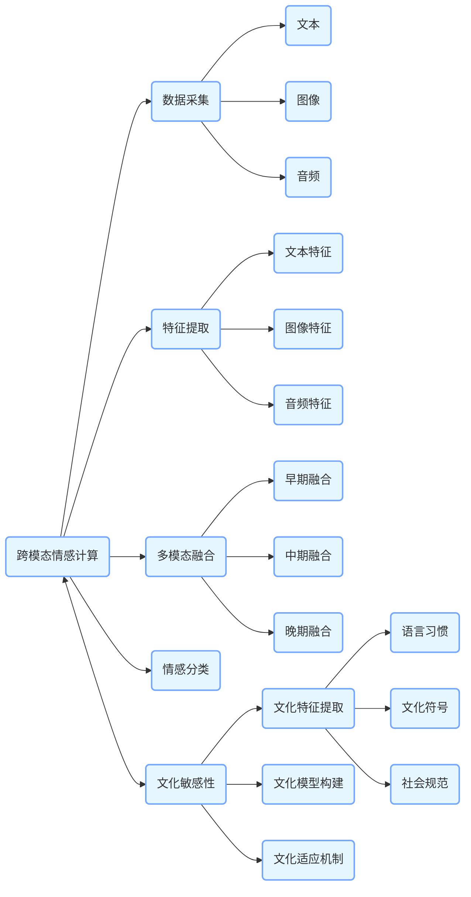

# 提升AI模型在跨模态情感计算任务中的文化敏感性

> 关键词：AI模型、跨模态情感计算、文化敏感性、情感分析、多模态融合

> 摘要：本文聚焦于提升AI模型在跨模态情感计算任务中的文化敏感性这一重要课题。跨模态情感计算结合多种模态信息以更准确地理解情感，然而不同文化背景下情感表达和认知存在显著差异，这对AI模型的准确性和泛化能力提出挑战。文章首先介绍了相关背景知识，包括目的范围、预期读者等内容；接着阐述了核心概念与联系，分析了跨模态情感计算和文化敏感性的原理与架构；详细讲解了核心算法原理和具体操作步骤，并给出Python源代码；探讨了数学模型和公式；通过项目实战展示代码案例及详细解释；列举了实际应用场景；推荐了相关工具和资源；最后总结了未来发展趋势与挑战，还包含常见问题解答及参考资料，旨在为提升AI模型在跨模态情感计算中的文化敏感性提供全面而深入的指导。

## 1. 背景介绍 
### 1.1 目的和范围
随着人工智能技术的飞速发展，跨模态情感计算作为一个新兴且极具潜力的研究领域，受到了广泛关注。跨模态情感计算旨在综合利用多种模态（如文本、图像、音频等）的信息来更准确地识别和理解人类的情感状态。然而，不同文化背景下人们的情感表达和认知方式存在很大差异，这使得现有的AI模型在跨文化场景下的情感计算任务中表现不佳。本文的目的就是深入探讨如何提升AI模型在跨模态情感计算任务中的文化敏感性，从而提高模型在不同文化环境下的性能和适用性。

本文的范围涵盖了跨模态情感计算和文化敏感性的基本概念、相关的核心算法原理、数学模型、项目实战案例、实际应用场景以及相关的工具和资源推荐等方面。通过全面的阐述，为研究人员和开发者提供一个系统的参考，以促进相关领域的研究和发展。

### 1.2 预期读者
本文预期读者主要包括以下几类人群：
- **人工智能研究人员**：对跨模态情感计算和文化敏感性相关领域感兴趣的科研人员，希望通过本文获取前沿的研究思路和方法，推动该领域的理论研究进展。
- **AI开发者**：从事AI模型开发的工程师，需要提升模型在跨文化场景下的性能，本文将为他们提供具体的技术实现方案和实践指导。
- **计算机科学专业的学生**：正在学习人工智能、机器学习等相关课程的学生，通过阅读本文可以加深对跨模态情感计算和文化敏感性的理解，拓宽专业知识面。
- **相关领域的从业者**：如心理学、社会学等领域的专业人员，他们可以从本文中了解AI技术在跨文化情感分析中的应用，促进不同学科之间的交叉融合。

### 1.3 文档结构概述
本文的结构如下：
- **核心概念与联系**：介绍跨模态情感计算和文化敏感性的基本概念，分析它们之间的联系，并给出相关的原理和架构示意图。
- **核心算法原理 & 具体操作步骤**：详细讲解提升文化敏感性的核心算法原理，通过Python源代码进行具体阐述，并给出操作步骤。
- **数学模型和公式 & 详细讲解 & 举例说明**：介绍相关的数学模型和公式，对其进行详细讲解，并通过具体例子说明其应用。
- **项目实战：代码实际案例和详细解释说明**：通过一个实际的项目案例，展示如何在跨模态情感计算任务中提升AI模型的文化敏感性，包括开发环境搭建、源代码实现和代码解读。
- **实际应用场景**：列举跨模态情感计算在不同领域的实际应用场景，说明提升文化敏感性的重要性。
- **工具和资源推荐**：推荐相关的学习资源、开发工具框架和论文著作，帮助读者进一步深入学习和研究。
- **总结：未来发展趋势与挑战**：总结提升AI模型文化敏感性的未来发展趋势和面临的挑战。
- **附录：常见问题与解答**：解答读者在阅读和实践过程中可能遇到的常见问题。
- **扩展阅读 & 参考资料**：提供相关的扩展阅读材料和参考资料，方便读者进一步查阅。

### 1.4 术语表
#### 1.4.1 核心术语定义
- **跨模态情感计算**：综合利用多种模态（如文本、图像、音频等）的信息来识别和理解人类情感状态的技术。
- **文化敏感性**：AI模型能够感知和适应不同文化背景下情感表达和认知差异的能力。
- **多模态融合**：将来自不同模态的信息进行整合和处理，以获取更全面和准确的情感信息。
- **情感分析**：对文本、图像、音频等数据中的情感倾向进行识别和分类的过程。

#### 1.4.2 相关概念解释
- **模态**：指信息的表现形式，如文本、图像、音频等。不同模态的信息具有不同的特点和表达方式。
- **文化背景**：包括价值观、信仰、习俗、语言等方面的差异，这些差异会影响人们的情感表达和认知方式。
- **泛化能力**：AI模型在未见过的数据上的表现能力，对于跨文化情感计算任务，泛化能力尤为重要。

#### 1.4.3 缩略词列表
- **AI**：Artificial Intelligence（人工智能）
- **ML**：Machine Learning（机器学习）
- **DL**：Deep Learning（深度学习）
- **NLP**：Natural Language Processing（自然语言处理）
- **CV**：Computer Vision（计算机视觉）

## 2. 核心概念与联系 
### 跨模态情感计算原理
跨模态情感计算的核心思想是利用多种模态的信息来更全面地理解人类的情感状态。不同模态的信息可以提供互补的情感线索，例如，文本可以表达情感的语义信息，图像可以展示面部表情和身体姿势等情感线索，音频可以传达语音语调等情感特征。通过将这些不同模态的信息进行融合，可以提高情感识别的准确性和可靠性。

其基本原理可以分为以下几个步骤：
1. **数据采集**：收集来自不同模态的情感数据，如文本、图像、音频等。
2. **特征提取**：从不同模态的数据中提取情感相关的特征。例如，对于文本数据，可以提取词向量、词性、情感极性等特征；对于图像数据，可以提取面部表情特征、身体姿势特征等；对于音频数据，可以提取语音语调、语速等特征。
3. **多模态融合**：将提取的不同模态的特征进行融合，得到一个综合的特征表示。融合的方法可以分为早期融合、中期融合和晚期融合等。
4. **情感分类**：利用融合后的特征进行情感分类，将情感状态分为不同的类别，如积极、消极、中性等。

### 文化敏感性原理
文化敏感性是指AI模型能够感知和适应不同文化背景下情感表达和认知差异的能力。不同文化背景下，人们的情感表达和认知方式存在很大差异。例如，在一些文化中，直接表达情感被认为是合适的，而在另一些文化中，情感表达可能更加含蓄。此外，不同文化对于同一种情感的理解和表达方式也可能不同。

为了提高AI模型的文化敏感性，需要考虑以下几个方面：
1. **文化特征提取**：从数据中提取与文化相关的特征，如语言习惯、文化符号、社会规范等。
2. **文化模型构建**：根据提取的文化特征，构建文化模型，以描述不同文化背景下的情感表达和认知模式。
3. **文化适应机制**：在模型训练和推理过程中，引入文化适应机制，使模型能够根据不同的文化背景调整自己的行为。

### 跨模态情感计算与文化敏感性的联系
跨模态情感计算和文化敏感性是相互关联的。一方面，跨模态情感计算为提升文化敏感性提供了更多的信息来源。通过综合利用多种模态的信息，可以更全面地捕捉不同文化背景下的情感表达特征。另一方面，文化敏感性是跨模态情感计算在跨文化场景下取得良好性能的关键。如果模型缺乏文化敏感性，就无法准确理解不同文化背景下的情感表达，从而导致情感识别的误差。

### 文本示意图
跨模态情感计算与文化敏感性的关系可以用以下文本示意图表示：

跨模态情感计算包括数据采集（文本、图像、音频）、特征提取（文本特征、图像特征、音频特征）、多模态融合（早期融合、中期融合、晚期融合）和情感分类。文化敏感性包括文化特征提取（语言习惯、文化符号、社会规范）、文化模型构建和文化适应机制。两者相互关联，跨模态情感计算为文化敏感性提供信息，文化敏感性提高跨模态情感计算在跨文化场景下的性能。

### Mermaid 流程图


## 3. 核心算法原理 & 具体操作步骤 
### 核心算法原理
为了提升AI模型在跨模态情感计算任务中的文化敏感性，我们可以采用基于注意力机制的多模态融合算法。注意力机制可以帮助模型自动地关注不同模态中与情感表达和文化背景相关的重要信息，从而提高模型的性能。

具体来说，该算法的原理如下：
1. **特征提取**：首先，对不同模态的数据（文本、图像、音频）进行特征提取，得到各自的特征表示。例如，对于文本数据，可以使用预训练的语言模型（如BERT）提取词向量和句子向量；对于图像数据，可以使用卷积神经网络（如ResNet）提取图像特征；对于音频数据，可以使用循环神经网络（如LSTM）提取音频特征。
2. **注意力机制**：在多模态融合阶段，引入注意力机制，计算不同模态特征的权重。注意力机制可以根据不同模态特征与情感表达和文化背景的相关性，自动地分配权重，使得模型更加关注重要的信息。
3. **多模态融合**：根据计算得到的权重，对不同模态的特征进行加权融合，得到一个综合的特征表示。
4. **情感分类**：利用融合后的特征进行情感分类，得到最终的情感预测结果。

### Python源代码详细阐述
以下是一个基于PyTorch实现的简单示例代码：

```python
import torch
import torch.nn as nn
import torch.nn.functional as F

# 定义文本特征提取器
class TextFeatureExtractor(nn.Module):
    def __init__(self, input_dim, hidden_dim):
        super(TextFeatureExtractor, self).__init__()
        self.fc1 = nn.Linear(input_dim, hidden_dim)
        self.fc2 = nn.Linear(hidden_dim, hidden_dim)

    def forward(self, x):
        x = F.relu(self.fc1(x))
        x = F.relu(self.fc2(x))
        return x

# 定义图像特征提取器
class ImageFeatureExtractor(nn.Module):
    def __init__(self, input_dim, hidden_dim):
        super(ImageFeatureExtractor, self).__init__()
        self.fc1 = nn.Linear(input_dim, hidden_dim)
        self.fc2 = nn.Linear(hidden_dim, hidden_dim)

    def forward(self, x):
        x = F.relu(self.fc1(x))
        x = F.relu(self.fc2(x))
        return x

# 定义音频特征提取器
class AudioFeatureExtractor(nn.Module):
    def __init__(self, input_dim, hidden_dim):
        super(AudioFeatureExtractor, self).__init__()
        self.fc1 = nn.Linear(input_dim, hidden_dim)
        self.fc2 = nn.Linear(hidden_dim, hidden_dim)

    def forward(self, x):
        x = F.relu(self.fc1(x))
        x = F.relu(self.fc2(x))
        return x

# 定义注意力机制
class Attention(nn.Module):
    def __init__(self, hidden_dim):
        super(Attention, self).__init__()
        self.fc = nn.Linear(hidden_dim, 1)

    def forward(self, x):
        scores = self.fc(x)
        weights = F.softmax(scores, dim=0)
        weighted_x = x * weights
        return weighted_x.sum(dim=0)

# 定义跨模态情感计算模型
class CrossModalEmotionModel(nn.Module):
    def __init__(self, text_input_dim, image_input_dim, audio_input_dim, hidden_dim, num_classes):
        super(CrossModalEmotionModel, self).__init__()
        self.text_extractor = TextFeatureExtractor(text_input_dim, hidden_dim)
        self.image_extractor = ImageFeatureExtractor(image_input_dim, hidden_dim)
        self.audio_extractor = AudioFeatureExtractor(audio_input_dim, hidden_dim)
        self.attention = Attention(hidden_dim)
        self.fc = nn.Linear(hidden_dim, num_classes)

    def forward(self, text, image, audio):
        text_features = self.text_extractor(text)
        image_features = self.image_extractor(image)
        audio_features = self.audio_extractor(audio)

        features = torch.stack([text_features, image_features, audio_features], dim=0)
        weighted_features = self.attention(features)

        output = self.fc(weighted_features)
        return output

# 示例使用
text_input_dim = 100
image_input_dim = 200
audio_input_dim = 150
hidden_dim = 128
num_classes = 3

model = CrossModalEmotionModel(text_input_dim, image_input_dim, audio_input_dim, hidden_dim, num_classes)

text_data = torch.randn(1, text_input_dim)
image_data = torch.randn(1, image_input_dim)
audio_data = torch.randn(1, audio_input_dim)

output = model(text_data, image_data, audio_data)
print(output)
```

### 具体操作步骤
1. **数据准备**：收集跨模态情感数据，包括文本、图像、音频等，并进行预处理，如数据清洗、特征提取等。
2. **模型定义**：根据上述代码定义跨模态情感计算模型，包括文本特征提取器、图像特征提取器、音频特征提取器、注意力机制和情感分类器。
3. **模型训练**：使用准备好的数据对模型进行训练，优化模型的参数。可以使用交叉熵损失函数和随机梯度下降等优化算法。
4. **模型评估**：使用测试数据对训练好的模型进行评估，计算模型的准确率、召回率、F1值等指标，评估模型的性能。
5. **模型调优**：根据评估结果，对模型进行调优，如调整模型的超参数、增加训练数据等，以提高模型的性能。

## 4. 数学模型和公式 & 详细讲解 & 举例说明 
### 特征提取
对于文本特征提取，我们可以使用预训练的语言模型（如BERT）。假设输入的文本序列为 $x = [x_1, x_2, \cdots, x_n]$，其中 $x_i$ 表示第 $i$ 个词的词向量。经过BERT模型处理后，得到文本的特征表示 $h^t$：

$$h^t = \text{BERT}(x)$$

对于图像特征提取，我们可以使用卷积神经网络（如ResNet）。假设输入的图像为 $I$，经过ResNet模型处理后，得到图像的特征表示 $h^i$：

$$h^i = \text{ResNet}(I)$$

对于音频特征提取，我们可以使用循环神经网络（如LSTM）。假设输入的音频序列为 $a = [a_1, a_2, \cdots, a_m]$，其中 $a_j$ 表示第 $j$ 个音频帧的特征向量。经过LSTM模型处理后，得到音频的特征表示 $h^a$：

$$h^a = \text{LSTM}(a)$$

### 注意力机制
注意力机制的作用是计算不同模态特征的权重。假设不同模态的特征表示为 $h = [h^t, h^i, h^a]$，注意力机制的计算公式如下：

1. 计算注意力分数：
$$s = W^T h + b$$
其中 $W$ 是权重矩阵，$b$ 是偏置向量。

2. 计算注意力权重：
$$\alpha = \text{softmax}(s)$$
其中 $\text{softmax}$ 是softmax函数，用于将注意力分数转换为概率分布。

3. 计算加权特征：
$$\tilde{h} = \sum_{k} \alpha_k h^k$$
其中 $k$ 表示不同的模态（$k = t, i, a$）。

### 情感分类
经过注意力机制处理后，得到加权特征 $\tilde{h}$。然后，将加权特征输入到全连接层进行情感分类。假设全连接层的权重矩阵为 $W_{fc}$，偏置向量为 $b_{fc}$，则情感分类的计算公式如下：

$$y = \text{softmax}(W_{fc} \tilde{h} + b_{fc})$$
其中 $y$ 是情感分类的概率分布。

### 举例说明
假设我们有一个文本句子 “I'm very happy today”，对应的图像是一张面带微笑的人脸，音频是欢快的语调。经过特征提取后，得到文本特征 $h^t$、图像特征 $h^i$ 和音频特征 $h^a$。

然后，使用注意力机制计算不同模态特征的权重。假设计算得到的注意力权重为 $\alpha = [0.4, 0.3, 0.3]$，表示文本特征的权重最高，图像和音频特征的权重相对较低。

接着，根据注意力权重计算加权特征 $\tilde{h}$：

$$\tilde{h} = 0.4h^t + 0.3h^i + 0.3h^a$$

最后，将加权特征 $\tilde{h}$ 输入到全连接层进行情感分类，得到情感分类的概率分布 $y$。假设 $y = [0.1, 0.8, 0.1]$，表示模型预测该样本的情感为积极的概率为0.8。

## 5. 项目实战：代码实际案例和详细解释说明 
### 5.1  开发环境搭建
在进行项目实战之前，需要搭建开发环境。以下是具体的步骤：

1. **安装Python**：建议使用Python 3.7及以上版本。可以从Python官方网站（https://www.python.org/downloads/）下载并安装。
2. **安装深度学习框架**：本文使用PyTorch作为深度学习框架。可以根据自己的CUDA版本和操作系统，从PyTorch官方网站（https://pytorch.org/get-started/locally/）选择合适的安装命令进行安装。例如，对于CPU版本的PyTorch，可以使用以下命令进行安装：
```sh
pip install torch torchvision
```
3. **安装其他依赖库**：还需要安装一些其他的依赖库，如numpy、pandas、matplotlib等。可以使用以下命令进行安装：
```sh
pip install numpy pandas matplotlib
```

### 5.2  源代码详细实现和代码解读
以下是一个完整的项目实战代码示例，包括数据加载、模型定义、训练和评估等步骤：

```python
import torch
import torch.nn as nn
import torch.optim as optim
from torch.utils.data import Dataset, DataLoader
import numpy as np
import pandas as pd

# 定义数据集类
class CrossModalDataset(Dataset):
    def __init__(self, text_data, image_data, audio_data, labels):
        self.text_data = text_data
        self.image_data = image_data
        self.audio_data = audio_data
        self.labels = labels

    def __len__(self):
        return len(self.labels)

    def __getitem__(self, idx):
        text = torch.tensor(self.text_data[idx], dtype=torch.float32)
        image = torch.tensor(self.image_data[idx], dtype=torch.float32)
        audio = torch.tensor(self.audio_data[idx], dtype=torch.float32)
        label = torch.tensor(self.labels[idx], dtype=torch.long)
        return text, image, audio, label

# 定义文本特征提取器
class TextFeatureExtractor(nn.Module):
    def __init__(self, input_dim, hidden_dim):
        super(TextFeatureExtractor, self).__init__()
        self.fc1 = nn.Linear(input_dim, hidden_dim)
        self.fc2 = nn.Linear(hidden_dim, hidden_dim)

    def forward(self, x):
        x = torch.relu(self.fc1(x))
        x = torch.relu(self.fc2(x))
        return x

# 定义图像特征提取器
class ImageFeatureExtractor(nn.Module):
    def __init__(self, input_dim, hidden_dim):
        super(ImageFeatureExtractor, self).__init__()
        self.fc1 = nn.Linear(input_dim, hidden_dim)
        self.fc2 = nn.Linear(hidden_dim, hidden_dim)

    def forward(self, x):
        x = torch.relu(self.fc1(x))
        x = torch.relu(self.fc2(x))
        return x

# 定义音频特征提取器
class AudioFeatureExtractor(nn.Module):
    def __init__(self, input_dim, hidden_dim):
        super(AudioFeatureExtractor, self).__init__()
        self.fc1 = nn.Linear(input_dim, hidden_dim)
        self.fc2 = nn.Linear(hidden_dim, hidden_dim)

    def forward(self, x):
        x = torch.relu(self.fc1(x))
        x = torch.relu(self.fc2(x))
        return x

# 定义注意力机制
class Attention(nn.Module):
    def __init__(self, hidden_dim):
        super(Attention, self).__init__()
        self.fc = nn.Linear(hidden_dim, 1)

    def forward(self, x):
        scores = self.fc(x)
        weights = torch.softmax(scores, dim=0)
        weighted_x = x * weights
        return weighted_x.sum(dim=0)

# 定义跨模态情感计算模型
class CrossModalEmotionModel(nn.Module):
    def __init__(self, text_input_dim, image_input_dim, audio_input_dim, hidden_dim, num_classes):
        super(CrossModalEmotionModel, self).__init__()
        self.text_extractor = TextFeatureExtractor(text_input_dim, hidden_dim)
        self.image_extractor = ImageFeatureExtractor(image_input_dim, hidden_dim)
        self.audio_extractor = AudioFeatureExtractor(audio_input_dim, hidden_dim)
        self.attention = Attention(hidden_dim)
        self.fc = nn.Linear(hidden_dim, num_classes)

    def forward(self, text, image, audio):
        text_features = self.text_extractor(text)
        image_features = self.image_extractor(image)
        audio_features = self.audio_extractor(audio)

        features = torch.stack([text_features, image_features, audio_features], dim=0)
        weighted_features = self.attention(features)

        output = self.fc(weighted_features)
        return output

# 训练模型
def train_model(model, train_loader, criterion, optimizer, device):
    model.train()
    total_loss = 0
    for text, image, audio, labels in train_loader:
        text = text.to(device)
        image = image.to(device)
        audio = audio.to(device)
        labels = labels.to(device)

        optimizer.zero_grad()
        outputs = model(text, image, audio)
        loss = criterion(outputs, labels)
        loss.backward()
        optimizer.step()

        total_loss += loss.item()
    return total_loss / len(train_loader)

# 评估模型
def evaluate_model(model, test_loader, device):
    model.eval()
    correct = 0
    total = 0
    with torch.no_grad():
        for text, image, audio, labels in test_loader:
            text = text.to(device)
            image = image.to(device)
            audio = audio.to(device)
            labels = labels.to(device)

            outputs = model(text, image, audio)
            _, predicted = torch.max(outputs.data, 1)
            total += labels.size(0)
            correct += (predicted == labels).sum().item()
    return correct / total

# 主函数
def main():
    # 生成示例数据
    num_samples = 1000
    text_input_dim = 100
    image_input_dim = 200
    audio_input_dim = 150
    hidden_dim = 128
    num_classes = 3

    text_data = np.random.randn(num_samples, text_input_dim)
    image_data = np.random.randn(num_samples, image_input_dim)
    audio_data = np.random.randn(num_samples, audio_input_dim)
    labels = np.random.randint(0, num_classes, num_samples)

    # 划分训练集和测试集
    train_size = int(0.8 * num_samples)
    train_text = text_data[:train_size]
    train_image = image_data[:train_size]
    train_audio = audio_data[:train_size]
    train_labels = labels[:train_size]

    test_text = text_data[train_size:]
    test_image = image_data[train_size:]
    test_audio = audio_data[train_size:]
    test_labels = labels[train_size:]

    # 创建数据集和数据加载器
    train_dataset = CrossModalDataset(train_text, train_image, train_audio, train_labels)
    test_dataset = CrossModalDataset(test_text, test_image, test_audio, test_labels)

    train_loader = DataLoader(train_dataset, batch_size=32, shuffle=True)
    test_loader = DataLoader(test_dataset, batch_size=32, shuffle=False)

    # 初始化模型、损失函数和优化器
    device = torch.device("cuda" if torch.cuda.is_available() else "cpu")
    model = CrossModalEmotionModel(text_input_dim, image_input_dim, audio_input_dim, hidden_dim, num_classes).to(device)
    criterion = nn.CrossEntropyLoss()
    optimizer = optim.Adam(model.parameters(), lr=0.001)

    # 训练模型
    num_epochs = 10
    for epoch in range(num_epochs):
        train_loss = train_model(model, train_loader, criterion, optimizer, device)
        test_acc = evaluate_model(model, test_loader, device)
        print(f'Epoch {epoch + 1}/{num_epochs}, Train Loss: {train_loss:.4f}, Test Acc: {test_acc:.4f}')

if __name__ == '__main__':
    main()
```

### 5.3  代码解读与分析
1. **数据集类 `CrossModalDataset`**：用于加载和处理跨模态情感数据。该类继承自 `torch.utils.data.Dataset`，实现了 `__len__` 和 `__getitem__` 方法，分别用于返回数据集的长度和获取指定索引的样本。
2. **特征提取器**：包括文本特征提取器 `TextFeatureExtractor`、图像特征提取器 `ImageFeatureExtractor` 和音频特征提取器 `AudioFeatureExtractor`。这些特征提取器都是简单的全连接神经网络，用于从不同模态的数据中提取特征。
3. **注意力机制 `Attention`**：用于计算不同模态特征的权重。该类使用一个全连接层计算注意力分数，然后使用softmax函数将分数转换为概率分布，最后根据概率分布计算加权特征。
4. **跨模态情感计算模型 `CrossModalEmotionModel`**：将特征提取器、注意力机制和全连接层组合在一起，实现跨模态情感计算的功能。该模型首先从不同模态的数据中提取特征，然后使用注意力机制计算加权特征，最后将加权特征输入到全连接层进行情感分类。
5. **训练和评估函数**：`train_model` 函数用于训练模型，`evaluate_model` 函数用于评估模型的性能。在训练过程中，使用交叉熵损失函数和Adam优化器进行优化。
6. **主函数 `main`**：生成示例数据，划分训练集和测试集，创建数据集和数据加载器，初始化模型、损失函数和优化器，然后进行模型训练和评估。

## 6. 实际应用场景 
### 智能客服
在智能客服系统中，提升AI模型的文化敏感性可以帮助系统更好地理解不同文化背景用户的情感需求。例如，在一些文化中，用户可能更加委婉地表达自己的不满，而在另一些文化中，用户可能更加直接。通过跨模态情感计算和文化敏感性的提升，智能客服系统可以更准确地识别用户的情感状态，提供更加个性化和贴心的服务。

### 社交媒体分析
社交媒体平台上的用户来自不同的文化背景，他们的情感表达和认知方式也存在很大差异。通过提升AI模型的文化敏感性，可以更准确地分析社交媒体上的情感倾向，了解不同文化背景用户的需求和态度。这对于企业的市场调研、品牌推广等方面都具有重要的意义。

### 教育领域
在教育领域，了解学生的情感状态对于提高教学效果至关重要。不同文化背景的学生在学习过程中的情感表达和需求也有所不同。通过跨模态情感计算和文化敏感性的提升，可以更好地了解学生的情感状态，为学生提供更加个性化的学习支持和指导。

### 娱乐产业
在娱乐产业中，电影、音乐、游戏等作品的受众来自不同的文化背景。通过提升AI模型的文化敏感性，可以更好地理解不同文化背景用户的情感需求，制作出更具吸引力和感染力的作品。例如，在电影制作中，可以根据不同文化背景观众的情感偏好，调整剧情和画面风格。

## 7. 工具和资源推荐
### 7.1 学习资源推荐
#### 7.1.1 书籍推荐
- 《深度学习》（Deep Learning）：由Ian Goodfellow、Yoshua Bengio和Aaron Courville所著，是深度学习领域的经典教材，涵盖了深度学习的基本原理、算法和应用。
- 《Python机器学习》（Python Machine Learning）：由Sebastian Raschka所著，介绍了使用Python进行机器学习的基本方法和技巧，包括数据预处理、模型选择、评估等内容。
- 《自然语言处理入门》（Natural Language Processing in Action）：由Jakub Adam所著，系统地介绍了自然语言处理的基本概念、算法和应用，适合初学者学习。

#### 7.1.2 在线课程
- Coursera上的“深度学习专项课程”（Deep Learning Specialization）：由Andrew Ng教授授课，包括神经网络和深度学习、改善深层神经网络、结构化机器学习项目、卷积神经网络、序列模型等五门课程，是学习深度学习的优质课程。
- edX上的“人工智能基础”（Introduction to Artificial Intelligence）：由麻省理工学院（MIT）的Patrick Winston教授授课，介绍了人工智能的基本概念、算法和应用，适合初学者入门。
- 哔哩哔哩（Bilibili）上的一些AI相关教程：有很多优秀的UP主分享了AI领域的学习视频，内容丰富多样，可以根据自己的需求选择学习。

#### 7.1.3 技术博客和网站
- arXiv：是一个收集物理学、数学、计算机科学、生物学与统计学论文预印本的网站，提供了大量的最新研究成果和论文。
- Medium：是一个开放的写作平台，有很多AI领域的专家和爱好者分享自己的研究成果和经验，是获取最新技术资讯的好地方。
- 机器之心：专注于人工智能领域的科技媒体，提供了丰富的AI技术文章、行业动态和研究报告。

### 7.2 开发工具框架推荐
#### 7.2.1 IDE和编辑器
- PyCharm：是一款专门为Python开发设计的集成开发环境（IDE），具有代码自动补全、调试、版本控制等功能，适合专业的Python开发者使用。
- Visual Studio Code：是一款轻量级的代码编辑器，支持多种编程语言和插件扩展，具有丰富的功能和良好的用户体验。
- Jupyter Notebook：是一个交互式的编程环境，适合进行数据探索、模型训练和可视化等工作，方便用户进行代码的编写和调试。

#### 7.2.2 调试和性能分析工具
- PyTorch Profiler：是PyTorch提供的性能分析工具，可以帮助用户分析模型的性能瓶颈，优化模型的训练和推理速度。
- TensorBoard：是TensorFlow提供的可视化工具，可以帮助用户可视化模型的训练过程、损失函数、准确率等指标，方便用户进行模型的调试和优化。
- cProfile：是Python标准库中的性能分析工具，可以帮助用户分析Python代码的性能瓶颈，找出耗时较长的函数和代码段。

#### 7.2.3 相关框架和库
- PyTorch：是一个开源的深度学习框架，具有动态图、自动求导等特点，适合进行深度学习模型的开发和训练。
- TensorFlow：是一个广泛使用的开源深度学习框架，具有强大的分布式训练和部署能力，适合进行大规模的深度学习应用开发。
- Scikit-learn：是一个用于机器学习的Python库，提供了丰富的机器学习算法和工具，适合进行数据预处理、模型选择、评估等工作。

### 7.3 相关论文著作推荐
#### 7.3.1 经典论文
- “Attention Is All You Need”：提出了Transformer模型，引入了注意力机制，为自然语言处理领域带来了革命性的变化。
- “ImageNet Classification with Deep Convolutional Neural Networks”：介绍了AlexNet模型，开启了深度学习在计算机视觉领域的应用热潮。
- “Long Short-Term Memory”：提出了长短期记忆网络（LSTM），解决了循环神经网络中的梯度消失和梯度爆炸问题，在序列建模任务中取得了很好的效果。

#### 7.3.2 最新研究成果
- 在arXiv等预印本网站上可以找到很多关于跨模态情感计算和文化敏感性的最新研究成果。例如，一些研究提出了基于多模态融合和文化嵌入的情感分析模型，提高了模型在跨文化场景下的性能。
- 国际顶级学术会议（如CVPR、ICML、NeurIPS等）上也会发表很多相关的研究论文，可以关注这些会议的论文集，了解最新的研究动态。

#### 7.3.3 应用案例分析
- 一些企业和研究机构会发布关于跨模态情感计算和文化敏感性的应用案例分析报告。例如，一些智能客服系统提供商分享了如何通过提升模型的文化敏感性来提高客户满意度的案例。这些案例分析可以帮助我们更好地理解如何将相关技术应用到实际场景中。

## 8. 总结：未来发展趋势与挑战
### 未来发展趋势
- **多模态融合技术的不断发展**：未来，跨模态情感计算将更加注重多模态融合技术的发展，不仅仅是简单的特征拼接，而是更加深入地挖掘不同模态之间的内在联系，提高情感识别的准确性和可靠性。
- **文化知识的融合**：为了更好地提升AI模型的文化敏感性，未来的研究将更加注重文化知识的融合。例如，将文化图谱、文化词典等知识融入到模型中，让模型能够更好地理解不同文化背景下的情感表达和认知方式。
- **跨学科研究的深入**：跨模态情感计算和文化敏感性是一个涉及计算机科学、心理学、社会学等多个学科的交叉领域。未来，跨学科研究将更加深入，不同学科之间的合作将更加紧密，共同推动该领域的发展。
- **应用场景的拓展**：随着技术的不断发展，跨模态情感计算和文化敏感性的应用场景将不断拓展。除了现有的智能客服、社交媒体分析、教育领域、娱乐产业等应用场景外，还将在医疗、金融、交通等领域得到更广泛的应用。

### 挑战
- **数据的多样性和标注难度**：不同文化背景下的情感数据具有很大的多样性，收集和标注这些数据是一个挑战。此外，由于文化差异的存在，情感标注的标准也可能不同，这增加了数据标注的难度。
- **模型的可解释性**：目前的深度学习模型大多是黑盒模型，缺乏可解释性。在跨模态情感计算和文化敏感性的应用中，模型的可解释性尤为重要。例如，在智能客服系统中，用户需要了解模型为什么做出这样的情感判断。因此，如何提高模型的可解释性是一个亟待解决的问题。
- **计算资源的需求**：跨模态情感计算需要处理大量的多模态数据，对计算资源的需求较高。在实际应用中，如何在有限的计算资源下提高模型的性能是一个挑战。
- **文化差异的复杂性**：文化差异是一个非常复杂的问题，涉及到价值观、信仰、习俗、语言等多个方面。如何准确地捕捉和理解这些文化差异，并将其融入到AI模型中，是一个具有挑战性的任务。

## 9. 附录：常见问题与解答
### 1. 什么是跨模态情感计算？
跨模态情感计算是指综合利用多种模态（如文本、图像、音频等）的信息来识别和理解人类情感状态的技术。通过将不同模态的信息进行融合，可以提高情感识别的准确性和可靠性。

### 2. 为什么要提升AI模型在跨模态情感计算任务中的文化敏感性？
不同文化背景下人们的情感表达和认知方式存在很大差异。如果AI模型缺乏文化敏感性，就无法准确理解不同文化背景下的情感表达，从而导致情感识别的误差。提升AI模型的文化敏感性可以提高模型在不同文化环境下的性能和适用性。

### 3. 如何提升AI模型的文化敏感性？
可以从以下几个方面提升AI模型的文化敏感性：
- **文化特征提取**：从数据中提取与文化相关的特征，如语言习惯、文化符号、社会规范等。
- **文化模型构建**：根据提取的文化特征，构建文化模型，以描述不同文化背景下的情感表达和认知模式。
- **文化适应机制**：在模型训练和推理过程中，引入文化适应机制，使模型能够根据不同的文化背景调整自己的行为。

### 4. 跨模态情感计算中常用的多模态融合方法有哪些？
跨模态情感计算中常用的多模态融合方法包括早期融合、中期融合和晚期融合等。
- **早期融合**：在特征提取之前将不同模态的数据进行融合，然后再进行特征提取和情感分类。
- **中期融合**：在特征提取之后，将不同模态的特征进行融合，然后再进行情感分类。
- **晚期融合**：在情感分类之后，将不同模态的分类结果进行融合，得到最终的情感预测结果。

### 5. 如何评估跨模态情感计算模型的性能？
可以使用准确率、召回率、F1值等指标来评估跨模态情感计算模型的性能。此外，还可以使用混淆矩阵、ROC曲线等工具来分析模型的性能。在跨文化场景下，还需要考虑模型在不同文化背景下的性能差异。

## 10. 扩展阅读 & 参考资料
### 扩展阅读
- 《情感计算》：全面介绍了情感计算的基本概念、算法和应用，对跨模态情感计算有更深入的阐述。
- 《文化心理学》：探讨了文化与心理之间的关系，有助于理解不同文化背景下的情感表达和认知方式。
- 《人工智能：现代方法》：是人工智能领域的经典教材，涵盖了人工智能的各个方面，包括机器学习、自然语言处理、计算机视觉等。

### 参考资料
- Goodfellow, I., Bengio, Y., & Courville, A. (2016). Deep Learning. MIT Press.
- Raschka, S. (2015). Python Machine Learning. Packt Publishing.
- Adam, J. (2019). Natural Language Processing in Action. Manning Publications.
- Vaswani, A., Shazeer, N., Parmar, N., Uszkoreit, J., Jones, L., Gomez, A. N., ... & Polosukhin, I. (2017). Attention is all you need. Advances in neural information processing systems, 5998-6008.
- Krizhevsky, A., Sutskever, I., & Hinton, G. E. (2012). ImageNet classification with deep convolutional neural networks. Advances in neural information processing systems, 1097-1105.
- Hochreiter, S., & Schmidhuber, J. (1997). Long short-term memory. Neural computation, 9(8), 1735-1780.